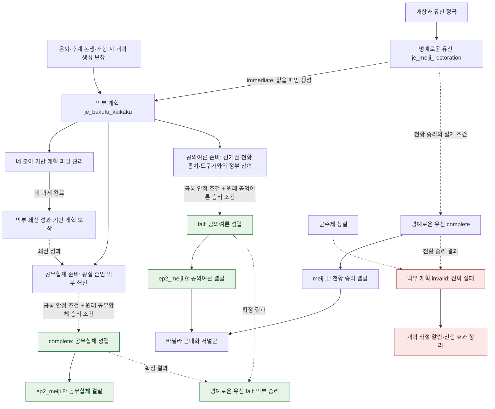
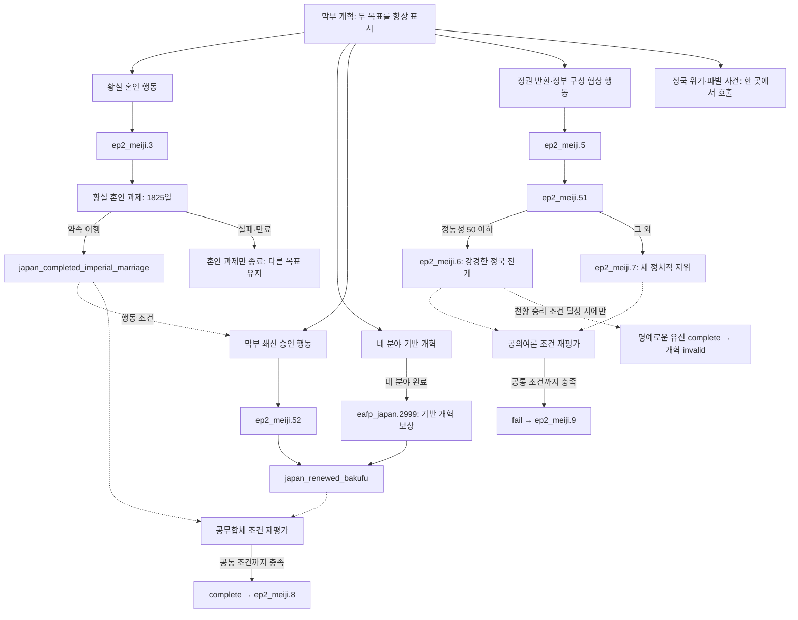

# 막부 개혁 저널 리워크 계획

이 문서는 `je_bakufu_kaikaku`의 별도 리워크 설계안이다. **게임 코드에는 아직 반영하지 않았다.** 현재 구현은 `japan_content.md`에서 설명하며, 이 계획에서는 막부의 정치적 승리를 공무합체와 공의여론으로 나누고 두 목표를 동시에 추진하게 한다.

## 설계 원칙

- `complete`는 **공무합체 성립**, `fail`은 **공의여론 성립**이다. 둘 다 막부 개혁의 성공이다.
- 진짜 실패는 `invalid`와 `on_invalid`에서 처리한다. 명예로운 유신의 천황 승리는 반드시 이 경로로 연결한다.
- 개혁 방향을 미리 선택하거나 전환하는 버튼은 사용하지 않는다. 혼인 교섭, 막부 쇄신, 선거권 확대와 정국 협상을 병행할 수 있다.
- 현재 명예로운 유신의 막부 승리 조건에서 **사전 노선 지정 부분만 제거**하고, 실질적인 국가 상태·혼인·쇄신·정통성·운동·내전 조건은 보존한다.
- 명예로운 유신에 붙어 있는 막부의 정치적 대응, 개혁 관련 사건과 결말 처리는 막부 개혁으로 모은다. 명예로운 유신은 천황 승리와 유신 정국의 공통 상태를 담당한다.
- 두 저널이 서로의 종료를 기다리는 구조를 만들지 않는다. **막부 개혁이 실제 승리 조건을 판정하고 결말을 확정하면, 명예로운 유신이 그 결과를 받아 막부 승리로 종료**한다.

## 현재 구현에서 해결할 문제

| 현재 구현 | 리워크 방향 |
| --- | --- |
| 네 분야 개혁 완료만으로 `eafp_japan.2999`를 호출하고 전체 개혁 완료 변수 설정 | 네 분야 완료는 기반 개혁 성과로 처리하고, 정치적 최종 성공은 두 승리 조건으로 판정 |
| 명예로운 유신에서 `kobu_gattai`·`kogi_yoron`을 선택하고 한 노선만 검사 | 막부 개혁에 두 목표를 항상 표시하고 각각 검사 |
| 막부 개혁 `invalid`가 막부법·막번체제 저널 상실을 즉시 실패로 취급 | 공의여론 추진 중에는 두 조건을 유지 요건으로 삼지 않음 |
| `on_invalid`도 `bakufu_kaikaku_complete_var`를 설정 | 성공 표식과 진짜 실패 결과를 분리 |
| `japan_restoration_complete`가 천황 승리·막부 승리·군주제 상실에 모두 설정됨 | 이 변수만으로 막부 개혁의 성공·실패를 판정하지 않음 |
| `japan_emperor_restored`가 천황 승리와 공의여론 양쪽에 설정됨 | 이 변수도 진짜 실패 판정으로 사용하지 않음 |
| 황실 혼인 실패 시 공의여론을 강제로 선택 | 혼인 과제의 실패만 처리하고 다른 목표 진행도는 그대로 유지 |
| 두 저널에서 같은 사건·결말을 호출할 가능성 | 결말별 실행 주체를 한곳으로 고정하고 재호출 방지 |

## 저널과 결말의 역할

| 저널 | 엔진 분기 | 화면에 보일 의미 | 주된 실행 내용 |
| --- | --- | --- | --- |
| 막부 개혁 | `complete` / `on_complete` | 공무합체 성립 — 개혁 성공 | 공무합체 결과 기록, `ep2_meiji.8` 호출 |
| 막부 개혁 | `fail` / `on_fail` | 공의여론 성립 — 개혁 성공 | 공의여론 결과 기록, `ep2_meiji.9` 호출 |
| 막부 개혁 | `invalid` / `on_invalid` | 막부 개혁 좌절 — 진짜 실패 | 실패 원인 기록, 임시 효과 정리, 실패 알림 |
| 명예로운 유신 | `complete` / `on_complete` | 천황 승리 | 천황 승리 결과 기록, `meiji.1` 호출, 막부 개혁 무효화 조건 성립 |
| 명예로운 유신 | `fail` / `on_fail` | 막부 승리 | 막부 개혁의 공무합체·공의여론 확정 결과를 받아 종료 |
| 명예로운 유신 | `invalid` / `on_invalid` | 군주제 기반 상실 | 공통 정리, 막부 개혁의 진짜 실패 조건 성립 |

`fail`이라는 스크립트 이름이 공의여론의 실패를 뜻하지 않도록 조건·효과 제목과 설명을 모두 바꾼다. 류큐 경쟁의 일본 승리/중국 승리처럼 하나의 저널에서 다른 두 결말을 표현한다.

## 성공 조건

### 공통 조건

두 성공 분기에 다음 조건을 공통으로 적용한다.

1. 명예로운 유신이 활성화된 유신 정국이며, 아직 최종 결말이 확정되지 않았다.
2. 군주제를 유지한다.
3. 정부 정통성 `legitimacy >= 75`.
4. 진행 중인 내전이 없다. 현재 바닐라의 `NOT = { any_civil_war = { civil_war_progress > 0 } }` 판정을 보존한다.
5. 유신파 운동이 존재하면 해당 운동의 지지가 5% 미만 **또는** 급진성이 50% 미만이다. 운동이 없으면 이 조건은 충족한다.
6. 명예로운 유신의 천황 승리 조건이 성립하지 않았다.

개혁 저널이 이에나리 은퇴·후계 논쟁 등으로 개항 전에 생성되더라도 기반 개혁만 준비할 수 있다. 최종 성공은 유신 정국에서 판정하여 개항 전 조기 종료를 막는다.

### 공무합체: `complete`

공통 조건에 더해 다음을 모두 만족한다.

- `law_bakufu`를 유지한다.
- `japan_completed_imperial_marriage`가 있다.
- `japan_renewed_bakufu`가 있다.

현재 명예로운 유신의 공무합체 승리 조건에 해당한다. `has_variable = kobu_gattai`는 선행 조건에서 제거한다. 혼인과 쇄신은 **달성한 성과**이며 노선 선택 표식이 아니다.

### 공의여론: `fail`

공통 조건에 더해 다음을 모두 만족한다.

- `country_has_voting_franchise = yes`.
- 다이묘 이해집단이 정부에 참여한다.
- 그 이해집단 지도자가 `house_tokugawa`를 가진다.
- 통치자가 `house_yamato`를 가진다.

현재 명예로운 유신의 공의여론 승리 조건에 해당한다. `has_variable = kogi_yoron`은 선행 조건에서 제거한다. **막부법 유지는 요구하지 않는다.** 천황이 통치하더라도 도쿠가와가 정부의 핵심으로 남아 조건을 충족하면 개혁 성공이다.

### 병행 추진과 결말 우선순위

황실 혼인을 추진하면서 선거권 확대와 정부 구성을 준비할 수 있다. 한쪽 행동을 했다는 이유로 다른 버튼이나 목표를 숨기지 않으며, 혼인 실패도 공의여론 자동 선택이나 개혁 전체 실패를 일으키지 않는다.

다만 최종 정치 체제는 하나만 확정한다. 먼저 **모든 성공 조건**을 충족한 결말이 성립하고, 다른 노선의 일부 성과만으로 저널을 종료하지 않는다. 두 조건이 같은 평가에서 모두 참인 예외 상황에는 공무합체를 우선한다. 공의여론의 최종 판정에 `NOT = { 공무합체 최종 조건 }`을 넣어 엔진의 `complete`·`fail` 평가 순서에 의존하지 않는다. 이 우선순위는 사전 노선 선택이 아니라 중복 결말 방지 규칙이다.

## 진짜 실패와 정상적인 체제 변화의 구분

`invalid`는 다음 상황을 다룬다.

- 명예로운 유신의 천황 승리 조건이 성립했거나 천황 승리 결과가 확정되었다.
- 군주제가 사라져 공무합체와 공의여론 모두 성립할 수 없다.
- 저널이 소유할 수 없는 국가로 넘어간 경우 등 구조적으로 진행 불가능한 상태. 원국의 정상 진행 실패와 잘못 전달된 저널의 정리는 알림에서 구분한다.

다음은 단독 실패 조건으로 사용하지 않는다.

- 막부법 폐지.
- `je_bakuhantaisei` 종료.
- 천황의 통치 시작.
- 황실 혼인 과제의 실패·기한 만료.
- 정통성·운동 진정 조건의 일시적 미충족.
- `japan_restoration_complete` 또는 `japan_emperor_restored`의 존재만으로 판단하는 경우.

천황 승리 판정은 명예로운 유신의 실제 `complete` 조건을 공용 판정으로 재사용한다. 현행 기준은 천황 특성의 군주, 막부법 부재, 내전 부재, 도쿠가와가 아닌 다이묘 이해집단 지도자, 해당 상태에서 누적된 `restoration_timer_var >= 6`이다. 공의여론의 도쿠가와 지도자 조건과 구별되므로 천황 즉위만으로 개혁이 실패하지 않는다.

공무합체·공의여론이 이미 확정된 후의 법률 변화가 과거 개혁 성공을 뒤집지 않도록 한다. 실패 시에는 `bakufu_kaikaku_complete_var`를 설정하지 않는다.

## 전체 저널 흐름

실선은 생성·결말 실행, 점선은 조건 판정 또는 결과 전달을 뜻한다. 한 줄에 놓인 사건이 항상 시간순으로 발생한다는 의미는 아니다.



공무합체의 `ep2_meiji.8`은 현행대로 근대화 저널군을 직접 생성하지 않는다. 공의여론의 `ep2_meiji.9`와 천황 승리의 `meiji.1`이 가진 바닐라 근대화 연결을 보존한다.

## 막부 개혁으로 모을 기능

| 현재 위치·항목 | 계획상의 담당과 조치 |
| --- | --- |
| 유신 저널의 막부 승리 `fail` 조건 | 공무합체·공의여론의 실질 조건을 개혁 저널 두 분기로 분리. 유신 `fail`에는 확정 결과 수신만 남김 |
| 유신 `on_fail`의 `.8`·`.9` 호출과 결과 표시 | 개혁 `on_complete`·`on_fail` 및 각 `event_outcome_*_effect_desc`로 이동 |
| 유신의 `decide_shogunate_strategy` 버튼과 `ep2_meiji.2` | 사전 노선 결정·전환 기능을 폐지. `.2`는 정상 진행에서 호출하지 않음 |
| 유신의 황실 혼인 버튼·`ep2_meiji.3`·혼인 저널 | 개혁 저널의 공무합체 과제로 관리. 혼인 버튼의 `kobu_gattai` 선행 조건 제거 |
| 왕정복고 선포 버튼·`ep2_meiji.5 → .51/.52 → .6/.7` | 개혁 저널의 실제 정국 행동으로 배치. 사전 노선 flag 분기와 노선 강제 전환 제거 |
| `japan_renewed_bakufu`·혼인 달성 상태 | 개혁 저널의 성과 판정으로 모으고 UI에 표시 |
| 유신의 월간 정국 사건 풀 | 막부 통치에 대한 위기·대응 사건의 호출을 개혁 저널로 모음. 원래 유신 정국에서만 발생하던 시점 조건은 별도로 유지 |
| 막부 승리 후 `japan_restoration_complete`·공의여론의 `japan_emperor_restored` 설정 | 개혁의 각 성공 콜백에서 한 번만 실행 |
| 막부 승리 후 에조 AI 국가 병합 조건 | 기존 공의여론 성공 부속 처리를 개혁의 공의여론 콜백으로 이동. 천황 승리·군주제 상실 때의 유신 처리는 유지 |
| `modifier_meiji_interregnum`의 JE 부착·참조 | 개혁 사건에서 발생하는 정국 효과이므로 개혁 JE에 부착하도록 대상 스코프 변경 |
| 유신 설명의 막부 전략 안내·노선별 효과 미리보기 | 개혁의 공무합체·공의여론 설명으로 모음 |

명예로운 유신에는 천황 위젯, 천황 승리 조건·6개월 계산, 유신파 생성, 천황 승리 이벤트, 혁명·보신전쟁의 공통 연결을 남긴다. `번과 다이묘` 위젯과 캐시는 양측 정국에서 사용하는 공통 정보이므로 유지한다. 개혁 생성 보장 호출과 결말 결과 수신은 두 저널을 연결하는 데 필요한 최소 연결이다.

### 월간 사건 호출의 담당

개혁 저널이 다음 최초 호출 후보를 담당한다.

- `ep2_meiji_pulse.1` 나마무기 사건과 그 후속 `.11 → eafp_japan.4006 → .2`.
- `ep2_meiji_pulse.3` 시모노세키, `.4` 공사관 방화, `.5` 이이 나오스케 암살.
- `ep2_meiji_pulse.6` 이케다야, `.7 → .8` 금문의 변·조슈 정벌, `.9` 양이 명령.
- `eafp_japan.4004` 후지산 등반, `.4008` 낭인의 외국인 습격.

기존 개혁의 파벌 사건 `.2181~.2184`도 개혁 JE가 계속 담당한다. `.4008`처럼 양쪽 풀에 있던 사건은 호출 항목을 하나만 남긴다. 후속 사건을 월간 후보로 새로 넣지 않는다.

유신 정국 사건은 `has_journal_entry = je_meiji_restoration`을 추가 진입 조건으로 삼아 개혁의 조기 생성 때문에 발생 시점이 앞당겨지지 않게 한다. 이벤트 고유 trigger·cooldown·외국 수신국을 보존한다. 두 풀을 합칠 때 기존 무사건 가중치까지 고려하여 월간 총 발생 빈도가 과도하게 늘지 않도록 별도 비교한다.

## 두 목표를 병행하는 행동 설계

### 황실 혼인

황실 혼인 버튼은 개혁 저널에 배치하고 `.3`의 기존 혼인·파벌 효과를 사용한다. 막부법, 정통성 50 초과, 섭정 아님, 내전 아님, 기존 1회 실행 제한은 유지한다. 사전 `kobu_gattai` 지정만 제거한다.

`je_meiji_imperial_marriage`는 별도 과제로 유지하되 상위 진행 여부를 막부 개혁에 연결한다. 관련 조약 해소, 국경 폐쇄, 자유무역 부재, 본토 조약항 부재 및 1825일 기한을 보존한다. 완료 시 `japan_completed_imperial_marriage`를 설정한다.

실패·기한 만료 시 혼인 상태와 관련 효과만 정리한다. `remove_variable = kobu_gattai`·`set_variable = kogi_yoron`과 강제 노선 전환 문구는 제거한다. 상위 개혁이 종료되면 미완료 혼인 과제를 정리하며, 이 정리가 상위 저널의 다른 결말을 일으켜서는 안 된다.

### 막부 쇄신과 정권 협상

배타적인 방침 선택을 없애면서 `.51`·`.52`를 모두 이용할 수 있도록 다음 두 행동으로 분리한다. 두 버튼은 서로의 실행 표식을 검사하지 않는다.

| 행동 | 사건 | 조건·효과 |
| --- | --- | --- |
| 조정에 막부 쇄신을 승인받기 | `ep2_meiji.52` | 막부법·혼인 달성·정통성 50 초과·섭정 및 내전 아님. 승인 시 `japan_renewed_bakufu` 설정 |
| 정권 반환과 새 정부 구성을 협의하기 | `ep2_meiji.5 → .51 → .6/.7` | 바닐라의 유신파 압력·군주 성향·혼인 성과 등 행동 가능 조건을 토대로 실행. `kobu_gattai`·`kogi_yoron` 선행 조건 없이 실제 정국을 바꿈 |

첫 행동은 `.52`가 자기 `immediate`에서 쇼군·조슈 번주·운동 스코프를 확보하도록 하고, 정권 반환 1회 표식과 별도의 재실행 방지를 둔다. 이미 `japan_renewed_bakufu`가 있으면 승인 행동은 완료 상태로 표시한다.

두 번째 행동은 기존 선포 버튼을 개혁 저널에 배치하고 설명을 정권 협상에 맞춘다. `.5`의 노선 flag 분기를 제거하고 `.51`로 연결한다. `.51`의 `legitimacy <= 50`에 따른 `.6` 위험 경로와 그 외 `.7` 경로는 보존하되, 공무합체를 선택했다는 이유의 전통주의자 자동 패배·공의여론 강제 전환은 제거한다. 인물 성향의 실제 협상 반응은 필요하면 별도 효과로 설명하며 숨은 노선 선택으로 사용하지 않는다.

정권 반환은 실제 통치자·법률·정부 구성에 영향을 주는 행동이다. 이로 인해 공무합체의 최종 조건이 일시적으로 불가능해질 수 있지만, 혼인·개혁 성과를 일괄 삭제하거나 공의여론 성공을 즉시 확정하지 않는다. `.6`이 발생해도 개혁 전체의 진짜 실패는 명예로운 유신의 천황 승리 조건 등 `invalid` 판정에서만 확정한다.

### 기반 개혁 네 과제

기존 `je_bakufu_kaikoku`, `je_bakufu_guntai`, `je_bakufu_naibu`, `je_bakufu_zaisei`는 공통 기반 개혁으로 남긴다. 이 계획의 설계 선택은 **네 과제 완료를 두 정치적 성공의 공통 추가 필수 조건으로 만들지 않는 것**이다. 최종 성공 조건은 앞서 명시한 바닐라 막부 승리 조건을 따른다.

네 과제 완료 시 `japan_renewed_bakufu`를 설정하고 `eafp_japan.2999`를 기반 개혁 성과 이벤트로 한 번 호출한다. `.2999`의 제목·설명은 최종 승리 선언이 아닌 개혁 성과로 다시 작성하고, 기존 생산·외교 보상은 유지한다. 이 경로는 `.52`와 함께 막부 쇄신 성과를 얻는 다른 방법이다.

네 분야 완료에는 네 개 기존 완료 변수를 계속 사용한다. `.2999`의 1회 보상 표식만 별도로 두고, 여기서는 `bakufu_kaikaku_complete_var`나 `japan_restoration_complete`를 설정하지 않는다.

네 하위 JE의 `invalid`에서 막부법 상실만으로 종료하는 조건을 제거한다. 내정 과제의 완료·진행·월간 계산에 반복되는 막부법 조건도 함께 고쳐, 공의여론 협상 중 도쿠가와가 정부에 남아 있으면 개혁을 이어갈 수 있게 한다. 나머지 행정·교육·군제·재정 과제와 현재 보상은 유지한다. 상위 개혁의 최종 종료 시 미완료 하위 과제와 부패 효과를 정리한다.

## 이벤트 흐름



## 류큐 방식의 설명과 결과 미리보기

참고 대상은 바닐라 `common/journal_entries/01_ryukyu_rivalry.txt`와 `localization/korean/ep2_01_l_korean.yml`이다. 류큐는 `custom_completion_header`·`custom_failure_header`로 두 승리 조건을 구분하고, `custom_on_completion_header`·`custom_on_failure_header` 및 `event_outcome_*_effect_desc`로 각 승리의 효과를 설명한다. 진짜 실패 조건은 reason 본문에 별도로 안내한다.

막부 개혁에도 같은 실제 필드를 사용한다. 지원 여부를 확인하지 않은 `complete_desc`·`fail_desc`·`custom_invalid_header` 같은 필드를 임의로 추가하지 않는다.

```text
custom_completion_header = je_bakufu_kaikaku_kobu_gattai_header
custom_on_completion_header = je_bakufu_kaikaku_on_kobu_gattai_header
custom_failure_header = je_bakufu_kaikaku_kogi_yoron_header
custom_on_failure_header = je_bakufu_kaikaku_on_kogi_yoron_header
```

설명용 현지화 초안은 다음과 같다. 두 `desc`는 `je_bakufu_kaikaku_reason`에 함께 참조하여 항상 보이게 한다.

```yaml
je_bakufu_kaikaku_kobu_gattai_desc: "#bold 공무합체#!\n조정의 권위와 막부의 통치를 결합하여 흔들리는 정국을 수습합니다. 황실과 맺은 혼약을 이행하고 막부의 쇄신을 인정받는다면, 쇼군은 조정의 지지 아래 국정을 이끌 수 있습니다."
je_bakufu_kaikaku_kogi_yoron_desc: "#bold 공의여론#!\n천황을 국가의 중심에 세우고 여러 세력의 의견을 국정에 반영합니다. 도쿠가와가 새로운 정부에 참여하여 영향력을 지킨다면, 통치의 형식이 달라져도 개혁을 주도한 막부 세력의 정치적 지위는 이어집니다."
je_bakufu_kaikaku_parallel_desc: "공무합체와 공의여론은 함께 추진할 수 있습니다. 어느 한쪽의 성립 조건을 모두 충족하면 막부 개혁이 성공하며, 두 결말의 보상을 중복으로 받지는 않습니다."
je_bakufu_kaikaku_kobu_gattai_header: "#bold 공무합체#! 성립 조건:\n"
je_bakufu_kaikaku_kogi_yoron_header: "#bold 공의여론#! 성립 조건:\n"
je_bakufu_kaikaku_on_kobu_gattai_header: "#bold 공무합체#! 성립 시:\n$EFFECT$"
je_bakufu_kaikaku_on_kogi_yoron_header: "#bold 공의여론#! 성립 시:\n$EFFECT$"
je_bakufu_kaikaku_invalid_desc: "@warning! #r 막부 개혁의 좌절:#!\n명예로운 유신에서 천황 측이 최종 승리를 거두거나, 군주제가 폐지되면 막부 개혁은 실패합니다. 황실 혼인의 무산이나 공의여론 추진 과정에서의 막부법 폐지만으로는 실패하지 않습니다."
```

`je_bakufu_kaikaku_reason`은 도입 서술 뒤에 두 목표의 `desc`, 병행 추진 설명, 진짜 실패 설명을 참조한다. 실제 조건 수치는 `complete`·`fail`의 trigger tooltip에서 표시하여 본문과 판정의 숫자가 따로 관리되지 않게 한다.

- 공무합체 효과 미리보기: `.8`의 조정·막부 국가 효과, 천황의 특성·개인 효과, EAFP 성공 후 정리.
- 공의여론 효과 미리보기: `.9`의 근대화 JE 연결과 현대화 운동, 선택지별 국가·도쿠가와 인물 효과, EAFP 성공 후 정리.
- 진짜 실패: reason에서 조건을 설명하고 `on_invalid`에서 별도 알림으로 원인을 알려 준다. `event_outcome_failed_effect_desc`는 공의여론 성공에 사용하므로 진짜 실패 설명을 여기에 넣지 않는다.
- 미리보기는 실제 이벤트·선택지 효과와 일치시킨다. 표시용 `event_outcome_*_effect_desc`를 별도 실제 보상 경로로 사용하지 않는다.
- 한국어·영어·중국어 간체 현지화를 함께 작성한다. 외부 이름·전략용 custom localization도 두 목표를 동시 표시하도록 점검한다.

## 결과 기록과 저널 간 동기화

### 최소 결과 데이터

국가에 `eafp_japan_reform_result` 하나를 두고 결과 flag를 저장하는 방안을 사용한다.

| 값 | 의미 | 쓰는 주체 |
| --- | --- | --- |
| 변수 없음 | 아직 최종 결말 없음 | 진행 중 |
| `flag:kobu_gattai` | 공무합체 성공 | 개혁 `on_complete` |
| `flag:kogi_yoron` | 공의여론 성공 | 개혁 `on_fail` |
| `flag:imperial_victory` | 천황 승리로 개혁 실패 | 유신 `on_complete` 또는 이를 먼저 감지한 개혁 `on_invalid` |
| `flag:regime_collapse` | 군주제 상실 등으로 개혁 실패 | 무효화 처리 |

이 변수는 **확정 결과만** 저장한다. 진행 중 목표 선택이나 개별 행동의 자격으로 사용하지 않는다. `.2999` 보상 중복 방지 표식은 최종 결과와 분리한다.

`bakufu_kaikaku_complete_var`는 공무합체·공의여론 성공에만 설정한다. `eafp_japan_ensure_reform_journal`은 시작 표식뿐 아니라 확정 결과를 확인하여 진짜 실패 후에도 자동 재생성되지 않게 한다.

`kobu_gattai`·`kogi_yoron`은 진행 중에는 설정하지 않고, 해당 결말이 확정될 때만 호환용으로 하나를 설정한다. 특히 바닐라 공무합체 업적이 `kobu_gattai + japan_restoration_complete + modifier_court_and_shogunate`를 읽으므로 결과 호환성을 보존한다. 두 변수를 사전 노선으로 읽던 버튼·이벤트·custom localization은 모두 교체한다.

### 실행 주체와 순서

**막부 승리:**

1. 개혁 JE가 공용 공통 조건과 각 승리 조건을 검사한다.
2. 해당 성공 콜백에서 조건을 재확인하고 결과를 먼저 기록한다.
3. 개혁 성공 표식, 노선별 호환 표식과 `japan_restoration_complete`를 설정한다. 공의여론에서는 기존 `japan_emperor_restored`·에조 처리도 적용한다.
4. `.8` 또는 `.9`를 한 번만 호출한다. 필요한 통치자·전 쇼군·천황 스코프와 생존 인물은 결과 이벤트가 읽을 때까지 보존한다.
5. 명예로운 유신의 `fail`은 확정된 두 성공 결과만 검사한다. 그 `on_fail`에서 결과 이벤트·보상·근대화 JE를 다시 만들지 않는다.
6. 막부 인사·파벌·지역 관리와 남은 하위 과제는 기존 종료 처리와 연결하되, 결과 이벤트에 필요한 인물이나 이해집단 지도자를 먼저 은퇴시키지 않도록 정리 순서를 확인한다.

**천황 승리:**

1. 유신 `complete`와 개혁 `invalid`가 같은 천황 승리 trigger를 참조한다. 막부 성공 trigger는 이 조건을 명시적으로 제외한다.
2. 유신이 먼저 평가되면 `on_complete`가 천황 승리 결과를 기록한 뒤 `meiji.1`을 호출한다. 다음 개혁 평가에서 `invalid`로 종료한다.
3. 개혁이 먼저 평가되면 `on_invalid`가 천황 승리 결과와 실패 알림을 처리한다. 유신 `complete`는 이 실패 결과 때문에 막히지 않고 기존 천황 승리 조건으로 종료하여 `meiji.1`을 호출한다.
4. 개혁 `on_invalid`에서는 `meiji.1`을 호출하지 않는다. 유신 쪽에서는 개혁 실패 알림을 중복 호출하지 않는다.
5. 군주제 상실 시에도 한 번 기록한 결과를 다른 콜백이 덮어쓰지 않는다. 공무합체·공의여론 확정 결과는 무효화 검사에서 제외한다.

명예로운 유신의 천황 승리를 `japan_restoration_complete`로 판별하거나, 개혁의 성공을 유신 `fail` 발생 후에만 허용하는 순환 구조는 사용하지 않는다. `remove_journal_entry`만 실행하여 `on_invalid`가 실행될 것이라고 가정하지도 않는다.

## 파일별 구현 범위

| 파일·정의 | 작업 |
| --- | --- |
| `common/journal_entries/eafp_japan.txt` | 개혁의 두 성공 분기·무효화·표시·사건 풀, 네 하위 과제의 유지 조건과 기반 성과 처리 |
| `common/journal_entries/eafp_00_meiji_restoration.txt` | 막부 행동·결말 효과를 개혁으로 옮기고, 천황 승리 및 확정 결과 수신 유지. 혼인 JE의 필요한 변경도 같은 관련 파일에 정의 |
| `common/scripted_buttons/eafp_japan_buttons.txt` | 혼인·정권 협상 버튼 변경, 쇄신 승인 행동, 사전 전략 선택 호출 제거 |
| 일본 관련 `common/scripted_triggers/` | 천황 승리·공통 안정·공무합체·공의여론 판정을 각각 한곳에 정의하여 JE·미리보기·사건이 공유 |
| `common/scripted_effects/eafp_japan_succession_effects.txt` | 개혁 생성 보장 조건에 최종 결과 반영. 쇼군 후계자의 뜻·승계 계산은 유지 |
| `events/000_eafp_japan_overrides.txt` | 이미 존재하는 일반 ID 교체 사건은 그 정의를 수정. `.3`·`.52` 등의 현행 EAFP 추가 효과 보존 |
| 바닐라 `.5`·`.51`·필요한 `.6/.7` 교체 정의 | 전략 flag 의존 제거, 스코프·정국 JE modifier 대상을 개혁으로 변경. 실제 군주·정부 구성 효과는 보존 |
| `events/eafp_jap_events/eafp_japan.txt` | `.2999`를 기반 개혁 성과로 수정, 정국 사건의 활성 조건 점검 |
| 일본 알림 정의·현지화 | 개혁 좌절 알림 및 원인 텍스트. 공의여론에는 실패 알림이 나오지 않도록 구성 |
| 일본 `customizable_localization`·GUI | 노선 선택 상태 대신 두 목표 설명·완료 여부 표시. 파벌의 기존 명망·평균 충성도 계산 유지 |
| `localization/{korean,english,simp_chinese}/` | 두 desc·조건/결과 제목·버튼·실패 설명·기반 성과 이벤트 문구 |
| `documentation/japan_content.md` | 구현 완료 후에만 현재 콘텐츠와 흐름도 갱신 |

동일 ID를 `000_eafp_japan_overrides.txt`의 일반 정의와 다른 파일의 `REPLACE:`로 동시에 추가하지 않는다. 바닐라 수정 부분의 주석은 저장소의 기존 `#수정`·`#추가` 및 원문 보존 방식에 맞춘다. 계획 작성 단계에서는 코드·현지화를 변경하지 않는다.

## 구현 순서

1. 공용 승리 조건과 최종 결과의 의미를 정의한다. 성공·실패가 같은 표식을 쓰는 현재 경로부터 분리한다.
2. 개혁 JE의 `complete`·`fail`·`invalid`와 유신 JE의 결과 수신을 함께 수정한다. 한쪽만 적용한 상태를 완성으로 보지 않는다.
3. 노선 선택을 제거하고 혼인·쇄신 승인·정권 협상 행동을 연결한다. 기존 버튼의 visible·possible·selected·AI 조건까지 수정한다.
4. 네 기반 개혁과 혼인 과제의 유지·종료 조건을 맞추고, `.2999`의 중간 성과 보상을 분리한다.
5. 월간 사건 호출을 모으고 기존 풀의 중복을 제거한다. 법률·인물·이념에 따른 실제 사건 효과는 보존한다.
6. 류큐 방식의 두 결말 설명·미리보기·진짜 실패 알림을 작성한다.
7. 정적 검사와 게임 내 두 저널의 동시 종료 시험을 마친 뒤 통합 문서를 갱신한다.

## 검증 기준

| 시험 상황 | 기대 결과 |
| --- | --- |
| 개항 전 개혁 저널 생성 | 기반 과제 진행 가능, 최종 성공은 아직 불가 |
| 혼인과 선거권 확대를 함께 추진 | 두 목표 표시와 진행이 유지됨. 선택 flag로 상대 행동을 잠그지 않음 |
| 네 분야 개혁만 완료 | 쇄신 성과·기반 보상 1회, 부모 저널은 미종료 |
| 혼인·쇄신 완료, 정통성 75 미만 | 공무합체 미성립 |
| 공무합체 조건 전부 충족 | 개혁 `complete`, `.8` 1회, 유신은 막부 승리 종료 |
| 공의여론 조건 전부 충족, 막부법 없음 | 개혁 `fail`이 성공으로 표시, `.9` 1회, 실패 알림 없음 |
| 천황 즉위, 도쿠가와 IG 지도자 유지 | 즉위만으로 개혁이 무효화되지 않음 |
| 막부법 폐지·막번체제 종료 후 공의여론 준비 | 개혁·진행 가능한 기반 과제 유지, 막부 보직 종료와 분리 |
| 유신의 천황 승리 조건 충족 | 유신 `complete`, `meiji.1` 1회, 개혁 `invalid`, 개혁 성공 표식 없음 |
| 군주제 상실 | 진짜 실패 처리, 성공 보상 없음 |
| 혼인 과제 실패·기한 만료 | 과제만 종료, 공의여론 자동 선택 및 개혁 전체 실패 없음 |
| 두 성공 조건 동시 충족 | 공무합체만 확정, 공의여론 보상 중복 없음 |
| 저널 평가 순서를 바꿔 재현 | 어느 순서에서도 결말·실패 알림·보상 각 1회 |
| 결과 이벤트가 열린 상태에서 JE 정리 | 전 쇼군·천황 등 스코프와 인물 유지, 빈 초상화·효과 누락 없음 |
| 내전 발생·혁명국 생성 | 원국과 혁명국이 같은 막부 결말을 중복 실행하지 않음. 바닐라 보신전쟁 경로 유지 |
| 성공·실패 뒤 개혁 생성 effect 재호출 | 종료한 개혁이 다시 생성되지 않음 |
| 정국 사건 월간 호출 조사 | 각 최초 사건은 한 풀에서만 호출, 후속 사건과 외국 응답 경로 유지 |
| UI·현지화 검사 | 공의여론을 실패로 안내하지 않음. 두 desc·조건·선택지별 효과가 실제 결과와 일치 |

정적 검사에서는 사전 `kobu_gattai`·`kogi_yoron` 참조 잔존, 개혁의 막부법 강제 유지 조건, `.8/.9/.2999`의 호출 중복, `bakufu_kaikaku_complete_var`의 실패 경로 기록, 미리보기와 실제 효과의 차이를 검색한다. 실제 엔진에서는 `fail` 완료 알림·로그의 기본 표현까지 확인한다. 사용자 정의 헤더로 바뀌지 않는 공의여론 알림은 해당 알림·현지화를 별도로 조정하며, 모든 JE의 실패 표시를 전역 변경하지 않는다.

## 확인한 원본

- EAFP: `common/journal_entries/eafp_japan.txt`, `eafp_00_meiji_restoration.txt`, `common/scripted_buttons/eafp_japan_buttons.txt`, `common/scripted_effects/eafp_japan_succession_effects.txt`, `events/000_eafp_japan_overrides.txt`, `events/eafp_jap_events/eafp_japan.txt`.
- 바닐라: `common/journal_entries/00_meiji_restoration.txt`, `01_ryukyu_rivalry.txt`, `common/scripted_buttons/07_meiji_buttons.txt`, `events/japan_events/ep2_meiji_restoration.txt`, `common/customizable_localization/victoria_ep2_custom_loc.txt`, `common/achievements/ep2_the_great_wave_achievements.txt`.
- 바닐라 현지화: `localization/korean/ep2_01_l_korean.yml`, `ep2_04_l_korean.yml`.
- 바닐라 설치 기준 경로: `D:/SteamLibrary/steamapps/common/Victoria 3/game`.
