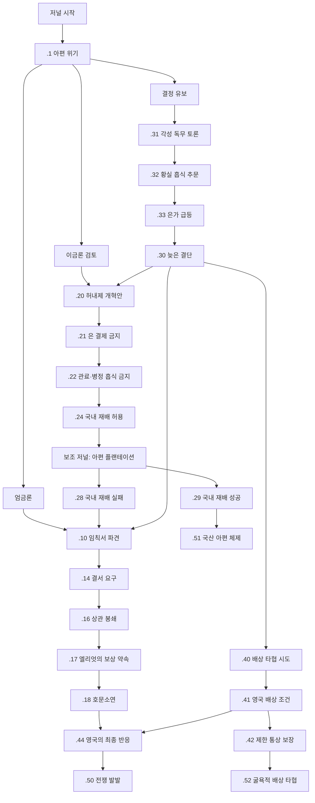

# 1차 아편전쟁 분기형 저널 재설계

## 목표

`je_qing_opium_obsession`은 청나라 전용 1차 아편전쟁 위기 저널이다. 저널 시작과 동시에 `first_opium_war.1` 시작 이벤트가 뜨고, 플레이어는 엄금론, 이금론, 유보 중 하나를 고른다. 이후 선택지는 여러 사건으로 갈라지지만, 위기는 계속 전쟁 쪽으로 압력을 받는다.

이번 설계의 핵심은 다음과 같다.

- 분기와 이벤트 수를 크게 늘린다.
- 전쟁 발발이 기본 결과가 되도록 설계한다.
- 전쟁 이외 결말은 가능하지만 매우 어렵게 만든다.
- 국내 아편 재배 루트는 별도 저널 `je_qing_domestic_opium_substitution`을 열고, 제한 시간 안에 아편 플랜테이션을 충분히 지어야 성공한다.
- `관리된 합법화`와 `독성 안정`은 하나의 결말 `국산 아편 체제`로 합친다.
- AI는 청나라와 영국 모두 역사적 선택지만 고르도록 한다.
- 바닐라 `opium_wars.1`은 기존처럼 `opium_wars_start_var`로 청나라에서 뜨지 않게 막는다.

## 웹 검색으로 반영한 역사 재료

이 설계에서 추가 분기의 근거로 삼을 만한 사건과 논점은 다음과 같다.

- 1836년 허내제의 이금론
  - 외국 아편을 약재처럼 납세 수입.
  - 은 유출 방지를 위해 은 결제를 금하고 물물교환만 허용.
  - 문무관, 사자, 병정의 흡식을 금지.
  - 민간의 매매와 흡식은 일단 문제 삼지 않음.
  - 내지 백성의 양귀비 재배 금지를 완화.
- 1838년 황작자의 엄금론
  - 흡식자를 중벌로 다스리자는 강경 금연론.
  - 병력과 은 유출을 국가 존망 문제로 제기.
- 1838년 말 이후 도광제의 엄금 결심
  - 황실/관료층 흡식 문제와 은 유출 문제가 조정 위기로 확대.
- 1839년 임칙서 광동 파견
  - 행상 압박, 외국 상관 봉쇄, 아편 제출 요구.
  - 외국 상인에게 장래 아편 밀반입 시 `화물 몰수, 사람 처형`을 감수한다는 결서 요구.
- 1839년 3월 27일 엘리엇의 아편 제출 지시
  - 영국 상인들이 20,000상자 이상을 제출.
  - 엘리엇이 영국 정부 보상을 약속하면서 외교 배상 문제로 변질.
- 1839년 6월 호문소연
  - 대량 아편 폐기.
  - 영국 내 전쟁 여론과 배상 요구 강화.
- 1839년 10월 영국 내각의 원정 결정과 1840년 원정 지시
  - 배상, 장래 안전, 통상 보장을 요구.
  - 영국 내부 논쟁은 별도 체인으로 길게 묘사하지 않고, 최종 대외 반응 이벤트 하나로 압축한다.

## 기본 난이도 원칙

전쟁 외 결말은 "선택지만 누르면 되는 탈출구"가 아니어야 한다.

### 전쟁으로 기우는 압력

아래 사건이 발생할수록 전쟁 루트가 강해진다.

- 청이 아편 금지를 유지하거나 강화.
- 임칙서를 전권으로 파견.
- 상관 봉쇄.
- 아편 몰수 또는 폐기.
- 결서에 사형 조항을 요구.
- 영국 배상 요구 거부.
- 영국이 상인 손실 보상을 정부 책임으로 인정.
- 조정 논쟁을 오래 유보.

### 비전쟁 결말의 조건

전쟁을 피하려면 다음 중 하나를 만족해야 한다.

- `국산 아편 체제`
  - 이금론 루트 진입.
  - 국내 재배 허용.
  - `je_qing_domestic_opium_substitution` 성공.
  - 진행도 100 전에 조정 반발을 견뎌야 함.
  - 영국과의 위기가 호문소연 단계까지 가지 않아야 함.
- `굴욕적 배상 타협`
  - 강경 몰수 후에도 배상을 일부 받아들임.
  - 영국 관계를 충분히 회복.
  - 영국 AI가 아니라 플레이어 영국일 때만 현실적인 선택.
  - 청 AI는 이 루트를 선택하지 않음.

비전쟁 루트 실패 시에는 대부분 `늦은 엄금`으로 합류하고, 이 경우 전쟁 발발 확률은 역사 루트보다 더 높아진다.

## AI 원칙

AI는 항상 역사적 루트를 따른다.

### 청나라 AI

- `first_opium_war.1`: 엄금론 선택 100%.
- `first_opium_war.10`: 임칙서에게 전권 부여 100%.
- `first_opium_war.14`: 상관 봉쇄 선택 100%.
- `first_opium_war.12`: 배상 거부 100%.
- 이금론, 국내 재배, 배상 타협, 유보 장기화 선택지는 플레이어 전용에 가깝게 `ai_chance = 0` 또는 `trigger = { is_ai = no }`로 둔다.

### 영국 AI

- 영국 소유 이벤트는 `first_opium_war.44` 하나로 단순화한다.
- `first_opium_war.44`: 배상과 통상 보장을 요구하며 원정 강행 100%.
- 배상만 받고 물러서는 선택지는 `is_ai = no` 또는 `ai_chance = 0`.

## 상태 관리

전용 변수는 최소한으로 유지하되, 분기 난이도를 위해 두 개의 점수형 변수를 사용한다.

- `opium_wars_start_var`
  - 바닐라 청나라 아편전쟁 시작 이벤트 차단.
- `eafp_opium_policy_score`
  - 정책 방향.
  - 음수: 엄금론.
  - 양수: 이금론.
  - 0: 유보/논쟁.
- `eafp_opium_crisis_pressure`
  - 전쟁 압력.
  - 상관 봉쇄, 몰수, 폐기, 배상 거부, 지연으로 증가.
  - 100 이상이면 영국 전쟁 루트가 거의 확정.
- `opium_wars_target`
  - 전쟁 루트 진입 시 기존 체인 연결.
- `opium_wars_gave_in`
  - 비전쟁 결말 완료용 기존 변수.
- `eafp_domestic_opium_success`
  - 국내 재배 보조 저널 성공 표시.

## 전체 흐름



## 메인 저널

### `je_qing_opium_obsession`

역할:

- 청나라 전용 위기 관리 저널.
- 시작 이벤트를 띄운다.
- 진행도는 단순 시간 진행이 아니라 "조정 논쟁과 외교 위기의 누적"을 표시한다.
- 진행도 100 또는 `eafp_opium_crisis_pressure >= 100`이면 `first_opium_war.30` 또는 영국 전쟁 루트로 합류한다.

권장 월간 pulse:

```txt
on_monthly_pulse = {
    random_events = {
        100 = 0
        30 = first_opium_war.2
        30 = first_opium_war.3
        25 = first_opium_war.4
        20 = first_opium_war.5
        10 = first_opium_war.6
        5 = first_opium_war.7
        5 = first_opium_war.8
        10 = first_opium_war.31
        10 = first_opium_war.33
    }
    effect = {
        if = {
            limit = {
                je:je_qing_opium_obsession = {
                    "scripted_bar_progress(eafp_first_opium_war_debate_progress_bar)" >= 100
                }
                NOT = { has_variable = opium_wars_target }
                NOT = { has_variable = opium_wars_gave_in }
            }
            trigger_event = { id = first_opium_war.30 popup = yes }
        }
    }
}
```

완료 조건:

- `opium_wars_target` 설정 후 영국 외교전 루트 진입.
- `opium_wars_gave_in` 설정.
- `eafp_domestic_opium_success`와 `opium_wars_gave_in`이 함께 설정되어 `국산 아편 체제` 결말 도달.
- 기존 전쟁 승패 변수: `opium_wars_won`, `lost_opium_wars`, `opium_wars_lost`.

## 보조 저널: 국내 아편 대체

### `je_qing_domestic_opium_substitution`

발동:

- `first_opium_war.24`에서 "내지 양귀비 재배를 허용한다" 선택.

목표:

- 제한 시간 안에 일정 수준 이상의 아편 플랜테이션을 건설한다.
- 국내 생산으로 수입 아편을 대체해야만 `국산 아편 체제` 결말이 열린다.

권장 조건:

- 제한 시간: 730일 또는 900일.
- 목표: 전국 `building_opium_plantation` 총 20레벨 이상.
- 추가 난이도 조건:
  - 시장 내 아편 부족이 심하면 실패 압력 증가.
  - `eafp_opium_crisis_pressure >= 80`이면 성공해도 영국 전쟁 루트가 다시 열릴 수 있음.
  - 청이 아편 금지를 유지 중이면 보조 저널 진행 불가.

권장 완료:

```txt
complete = {
    custom_tooltip = {
        text = eafp_domestic_opium_substitution_complete_tt
        # 전국 building_opium_plantation 총 20레벨 이상을 확인하는 scripted_trigger 권장
    }
}
on_complete = {
    set_variable = eafp_domestic_opium_success
    trigger_event = { id = first_opium_war.29 popup = yes }
}
```

권장 실패:

```txt
on_timeout = {
    trigger_event = { id = first_opium_war.28 popup = yes }
}
```

실패 효과:

- `eafp_opium_policy_score -= 2`
- `eafp_opium_crisis_pressure += 30`
- 조정 반발 modifier.
- `first_opium_war.10`으로 합류.

## 이벤트 설계

### 시작과 조정 논쟁

#### `first_opium_war.1`: 아편 위기

선택지:

- A. 엄금론을 채택한다.
  - 역사 루트.
  - AI 100%.
  - `eafp_opium_policy_score = -2`
  - `eafp_opium_crisis_pressure += 20`
  - `first_opium_war.10` 발동.
- B. 허내제의 이금론을 검토한다.
  - 플레이어용 비역사 루트.
  - AI 0%.
  - `eafp_opium_policy_score = 2`
  - `first_opium_war.20` 발동.
- C. 각성 독무의 의견을 더 듣는다.
  - 유보 루트.
  - AI 0%.
  - `eafp_opium_policy_score = 0`
  - `first_opium_war.31` 발동.

#### `first_opium_war.2`: 허내제의 상소

역할:

- 이금론을 설명하고 합법화 방향으로 끌어당긴다.

선택지:

- A. 약재 납세 수입안을 검토한다.
  - `eafp_opium_policy_score += 1`
  - `first_opium_war.20` 가능.
- B. 은 유출을 막기에는 부족하다.
  - `eafp_opium_policy_score -= 1`
  - `eafp_opium_crisis_pressure += 10`

#### `first_opium_war.3`: 원옥린의 반박

역할:

- 이금론을 밀고 있을 때 강한 역풍으로 작동.

선택지:

- A. 해금은 제방을 허무는 일이다.
  - `eafp_opium_policy_score -= 1`
  - 엄금 루트 접근.
- B. 세금과 감찰로 통제할 수 있다.
  - `eafp_opium_policy_score += 1`
  - 보수 반발 modifier.

#### `first_opium_war.4`: 허구의 모순 지적

역할:

- "사고파는 것은 허용하면서 흡식만 금지"하는 모순을 제기.

선택지:

- A. 이금론을 접는다.
  - `first_opium_war.10` 합류.
- B. 금지 대상을 관료·병정으로 좁힌다.
  - `first_opium_war.22`로 이동.

#### `first_opium_war.5`: 황작자의 엄금 상소

새 이벤트.

역할:

- 흡식자 중벌론과 은 유출 위기감을 제시.
- 유보 루트와 이금론 루트를 전쟁 방향으로 끌어당긴다.

선택지:

- A. 흡식자에게 기한을 주고 중벌을 예고한다.
  - `eafp_opium_policy_score -= 2`
  - `eafp_opium_crisis_pressure += 20`
  - `first_opium_war.10` 가능.
- B. 지나치게 가혹하다.
  - `eafp_opium_policy_score += 1`
  - 조정 강경파 반발.

### 엄금론 루트

#### `first_opium_war.10`: 임칙서 파견

선택지:

- A. 흠차대신에게 전권을 준다.
  - AI 100%.
  - `add_banned_goods = g:opium`
  - `set_variable = opium_wars_target`
  - `eafp_opium_crisis_pressure += 20`
  - `first_opium_war.14` 발동.
- B. 광동에서 교섭을 병행하게 한다.
  - AI 0%.
  - `eafp_opium_crisis_pressure += 10`
  - `first_opium_war.15` 발동.

#### `first_opium_war.14`: 결서 요구

역할:

- 외국 상인에게 앞으로 아편을 들여오면 화물 몰수와 처형을 감수한다는 결서를 요구.

선택지:

- A. 결서 없이는 통상도 없다.
  - AI 100%.
  - `eafp_opium_crisis_pressure += 25`
  - `first_opium_war.16` 발동.
- B. 사형 조항을 빼고 보증만 받는다.
  - AI 0%.
  - `first_opium_war.40` 타협 시도.

#### `first_opium_war.15`: 행상 압박

새 이벤트.

역할:

- 공행과 광동 관리들이 외국 상인을 설득하거나 압박한다.
- 절충 엄금 루트의 마지막 완충 장치.

선택지:

- A. 행상에게 책임을 묻는다.
  - `eafp_opium_crisis_pressure += 15`
  - `first_opium_war.16`
- B. 포상과 통상 보호를 제시한다.
  - `eafp_opium_crisis_pressure -= 5`
  - 단, 이후 영국 요구 이벤트로 넘어갈 수 있음.

#### `first_opium_war.16`: 외국 상관 봉쇄

새 이벤트.

역할:

- 물과 식량 공급 차단, 통신 제한, 상관 봉쇄를 표현.

선택지:

- A. 봉쇄를 유지한다.
  - AI 100%.
  - `eafp_opium_crisis_pressure += 30`
  - `first_opium_war.17`
- B. 봉쇄를 풀고 협상한다.
  - AI 0%.
  - `first_opium_war.40`

#### `first_opium_war.17`: 엘리엇의 보상 약속

새 청나라 정보 이벤트.

역할:

- 엘리엇이 영국 정부 명의로 아편 제출 보상을 약속.
- 사적 밀수가 국가 배상 문제로 바뀌는 합류점.
- 영국 플레이어에게 별도 정치 체인을 띄우지 않고, 청나라가 외교적 후폭풍을 확인하는 사건으로 처리한다.

선택지:

- A. 상인 손실을 정부가 떠안는다.
  - `eafp_opium_crisis_pressure += 25`
  - `first_opium_war.18`
- B. 상인에게 책임을 돌린다.
  - 플레이어용 완화 선택.
  - `first_opium_war.40`

#### `first_opium_war.18`: 호문소연

새 이벤트 또는 기존 `.11` 재배치.

역할:

- 제출된 아편을 공개 폐기.
- 전쟁 압력 대폭 상승.

선택지:

- A. 황명에 따라 모두 폐기한다.
  - AI 100%.
  - `eafp_opium_crisis_pressure += 35`
  - `first_opium_war.19`
- B. 일부를 증거로 남기고 배상 협상을 제안한다.
  - AI 0%.
  - `first_opium_war.40`

#### `first_opium_war.19`: 재입항 결서 거부

새 이벤트.

역할:

- 영국 상인과 엘리엇이 사형 조항 결서를 거부.
- 평화적 해결이 닫히는 마지막 청나라 이벤트.

선택지:

- A. 결서 없는 배는 입항하지 못한다.
  - AI 100%.
  - `first_opium_war.44`
- B. 마카오와 중립 상인을 통해 우회 교섭한다.
  - AI 0%.
  - `first_opium_war.40`

### 이금론과 국내 재배 루트

#### `first_opium_war.20`: 허내제 개혁안 채택

선택지:

- A. 아편을 약재로 납세 수입한다.
  - `remove_banned_goods = g:opium`
  - `first_opium_war.21`
- B. 수입 대신 국내 재배로 은 유출을 막는다.
  - `remove_banned_goods = g:opium`
  - `first_opium_war.24`
- C. 조정 반발이 두렵다.
  - `first_opium_war.3`

#### `first_opium_war.21`: 은 결제 금지와 물물교환

새 이벤트.

역할:

- 허내제안의 핵심인 `은 결제 금지, 화물 교환`을 제도화한다.

선택지:

- A. 은 결제를 금하고 화물 교환만 허용한다.
  - 성공 난이도 상승.
  - 영국 상인 불만.
  - `first_opium_war.23`
- B. 관세만 매기고 결제는 묵인한다.
  - 은 유출 계속.
  - `eafp_opium_crisis_pressure += 15`
  - `first_opium_war.33`

#### `first_opium_war.22`: 관료·병정 흡식 금지

새 이벤트.

역할:

- 허내제안의 제한 금지 조항을 구현.

선택지:

- A. 관료, 사자, 병정의 흡식만 엄벌한다.
  - 군대/관료 반발.
  - 이금론 유지.
- B. 민간까지 단속한다.
  - 사실상 엄금론으로 복귀.
  - `first_opium_war.10`

#### `first_opium_war.23`: 공행과 세관의 부패

새 이벤트.

역할:

- 합법화해도 공행, 세관, 밀수 구조가 그대로 남는 문제를 제기.

선택지:

- A. 세관 감찰을 강화한다.
  - 비용 증가.
  - 성공 조건 일부 충족.
  - `first_opium_war.24`
- B. 공행에 맡긴다.
  - 실패 압력 증가.
  - `first_opium_war.27`

#### `first_opium_war.24`: 내지 양귀비 재배 허용

새 이벤트.

역할:

- 국내 아편 재배 루트의 관문.
- 선택 시 보조 저널이 열린다.

선택지:

- A. 내지 재배 금지를 완화한다.
  - `add_journal_entry = { type = je_qing_domestic_opium_substitution }`
  - `first_opium_war.25`
- B. 재배는 허용할 수 없다.
  - `first_opium_war.30` 또는 `.10`으로 합류.

#### `first_opium_war.25`: 지방관의 재배지 배정

새 이벤트.

역할:

- 어느 지방에 플랜테이션을 짓게 할지 선택.

선택지:

- A. 서남 내륙에 집중한다.
  - 플랜테이션 건설 보너스.
  - 운송/시장 접근 약점.
- B. 연해 수요지에 가깝게 둔다.
  - 건설은 빠르나 외국 상인과 밀수 결탁 위험.
- C. 각 성에 맡긴다.
  - 건설 목표 달성 난이도 상승.

#### `first_opium_war.26`: 외국 상인의 가격 대응

새 이벤트.

역할:

- 국내 재배가 시작되자 외국 상인이 가격을 낮추거나 밀수를 늘리는 대응.

선택지:

- A. 해상 단속을 강화한다.
  - `eafp_opium_crisis_pressure += 10`
  - 엄금 루트 재진입 위험.
- B. 관세를 낮춰 경쟁한다.
  - 재정 손실.
  - 국내 재배 성공 가능성 소폭 증가.

#### `first_opium_war.27`: 검열관의 탄핵

새 이벤트.

역할:

- 국내 재배와 이금론이 조정 내 도덕적 공격을 받는다.

선택지:

- A. 탄핵을 묵살한다.
  - 급진파/반발 증가.
  - 보조 저널 유지.
- B. 재배 허가를 중단한다.
  - 보조 저널 실패 처리.
  - `first_opium_war.28`

#### `first_opium_war.28`: 국내 재배 실패

새 이벤트.

발동:

- 보조 저널 timeout.
- 재배 허가 철회.
- 목표 플랜테이션 부족.

효과:

- `eafp_domestic_opium_success` 없음.
- `eafp_opium_policy_score -= 2`
- `eafp_opium_crisis_pressure += 30`
- `first_opium_war.43` 늦은 엄금으로 합류.

#### `first_opium_war.29`: 국내 재배 성공

새 이벤트.

발동:

- 보조 저널 완료.

효과:

- `set_variable = eafp_domestic_opium_success`
- `first_opium_war.51` 결말 가능.
- 단, `eafp_opium_crisis_pressure >= 80`이면 영국 배상/통상 요구 이벤트가 먼저 뜬다.

### 유보와 위기 악화 루트

#### `first_opium_war.30`: 늦은 결단

역할:

- 진행도 100 또는 장기 유보 시 강제 선택.

선택지:

- A. 늦었지만 엄금한다.
  - AI 100%에 가까운 역사 선택.
  - `first_opium_war.43`
- B. 국내 재배로 마지막 도박을 한다.
  - AI 0%.
  - `first_opium_war.24`
  - 보조 저널 제한 시간 단축.
- C. 배상과 통상으로 타협한다.
  - AI 0%.
  - `first_opium_war.40`

#### `first_opium_war.31`: 각성 독무 토론

새 이벤트.

역할:

- 각 성 독무에게 금연 방책을 묻는다.
- 역사적으로 황작자 상소 뒤 여러 지방관 의견이 갈린 상황을 이벤트화.

선택지:

- A. 광동에서 근원을 끊어야 한다.
  - 엄금 루트 강화.
- B. 전국 흡식자를 먼저 다스린다.
  - 내부 혼란.
  - 엄금 루트 강화.
- C. 세금과 재배로 은 유출을 막는다.
  - 이금론 루트.

#### `first_opium_war.32`: 황실 흡식 추문

새 이벤트.

역할:

- 황실/상층의 흡식 문제가 드러나 도광제가 강경해지는 압력.

선택지:

- A. 황실이라도 예외 없다.
  - `eafp_opium_policy_score -= 2`
  - `eafp_opium_crisis_pressure += 15`
- B. 추문을 덮는다.
  - 정통성 손상.
  - 이금론 가능성 유지.

#### `first_opium_war.33`: 은가 급등

새 이벤트.

역할:

- 은 유출과 은귀전천 문제를 위기화.

선택지:

- A. 외국 아편을 끊어야 한다.
  - 엄금 루트.
- B. 은 결제를 금지하고 화물 교환으로 돌린다.
  - `.21`

#### `first_opium_war.34`: 연해 밀수선

새 이벤트.

역할:

- 광동뿐 아니라 복건, 절강, 산동, 천진 방면까지 밀수가 번지는 압력.

선택지:

- A. 수군 단속을 강화한다.
  - crisis pressure 증가.
  - 엄금 루트.
- B. 세관 신고제를 확대한다.
  - 이금론 루트.

#### `first_opium_war.35`: 조정 교착

새 이벤트.

역할:

- 유보를 계속하면 진행도와 전쟁 압력이 함께 오른다.

선택지:

- A. 더 기다린다.
  - 진행도 증가.
  - crisis pressure 증가.
- B. 결단한다.
  - `.30`

### 외교 타협 루트

#### `first_opium_war.40`: 배상 타협 시도

역할:

- 전쟁을 피할 수 있는 매우 어려운 외교 루트.

진입:

- 봉쇄 전 협상.
- 호문소연 전 일부 보상 제안.
- 늦은 결단에서 굴욕적 타협 선택.

선택지:

- A. 상인 손실 일부를 배상한다.
  - `first_opium_war.41`
- B. 배상은 거부하고 통상만 보장한다.
  - 영국 불만.
  - `first_opium_war.44`

#### `first_opium_war.41`: 영국 배상 조건

새 청나라 이벤트.

역할:

- 영국이 전달한 배상, 통상 안전, 외교적 대등성 요구를 청나라가 검토한다.
- 영국 내각의 세부 논쟁은 다루지 않는다.

선택지:

- A. 배상과 제한 통상을 받아들인다.
  - 플레이어 전용.
  - `first_opium_war.42`
- B. 요구가 지나치다.
  - `first_opium_war.44`

#### `first_opium_war.42`: 제한 통상 보장

새 이벤트.

역할:

- 전쟁 회피 결말 직전의 마지막 비용 부과.

조건:

- `eafp_opium_crisis_pressure < 70`
- 청이 이미 아편을 모두 폐기하지 않았거나, 폐기 전 보상 제안이 있었음.
- 영국이 AI가 아니거나 특별한 플레이어 선택.

선택지:

- A. 통상 안전과 배상을 보장한다.
  - `first_opium_war.52`
- B. 굴욕을 감수할 수 없다.
  - `first_opium_war.50`

### 영국 전쟁 루트

#### `first_opium_war.44`: 영국의 최종 반응

유일한 영국 소유 이벤트.

역할:

- 청의 몰수, 폐기, 배상 거부, 통상 제한을 하나로 묶어 영국의 대외 반응을 단순하게 표현한다.
- 내각 내부의 설왕설래, 팔머스턴 지시, 의회 논쟁은 별도 이벤트로 만들지 않는다.
- 플레이어가 영국을 잡고 있을 때만 전쟁 회피 선택을 볼 수 있게 하고, AI 영국은 무조건 전쟁으로 간다.

선택지:

- A. 배상과 장래 통상 안전을 요구하며 함대를 보낸다.
  - 영국 AI 100%.
  - `first_opium_war.50`
- B. 배상만 받고 물러난다.
  - 영국 AI 0%.
  - `trigger = { is_ai = no }` 권장.
  - `first_opium_war.52` 가능.

## 최종 결과

### `first_opium_war.50`: 1차 아편전쟁 발발

기본 결말.

진입:

- 엄금론 역사 루트.
- 이금론 실패 후 늦은 엄금.
- 배상 타협 실패.
- 유보 장기화.
- 영국 AI의 역사 선택.

효과:

```txt
c:GBR = {
    set_variable = opium_wars_aggressor
    add_journal_entry = {
        type = je_opium_wars
        target = c:CHI
    }
    add_involvement = {
        strategic_region = sr:region_south_china
        value = 2500
    }
    create_diplomatic_play = {
        name = first_opium_war
        target_country = c:CHI
        type = dp_first_opium_war
    }
}
```

청 저널:

- `opium_wars_target`로 완료.
- 이후 승패는 기존 `je_opium_wars`와 연동.

### `first_opium_war.51`: 국산 아편 체제

`관리된 합법화`와 `독성 안정`을 합친 결말.

진입 조건:

- `eafp_domestic_opium_success` 있음.
- `je_qing_domestic_opium_substitution` 성공.
- `eafp_opium_crisis_pressure < 80`.
- 호문소연 또는 상관 봉쇄가 전쟁 임계점까지 가지 않았음.

성격:

- 전쟁은 피하지만 결코 좋은 결말이 아니다.
- 국내 아편 생산이 은 유출을 줄이는 대신, 중독과 농지 전환을 국가 내부로 끌어들인다.
- "관리된 합법화"의 행정적 성공과 "독성 안정"의 사회적 대가를 하나로 묶는다.

효과:

```txt
set_variable = opium_wars_gave_in
remove_banned_goods = g:opium
add_modifier = {
    name = eafp_domestic_opium_regime
    days = very_long_modifier_time
}
add_modifier = {
    name = opium_wars_addiction_modifier
    days = very_long_modifier_time
}
```

추가 후유증:

- 아편 플랜테이션 처리량 또는 수익 보너스.
- 농민/유생/지식인 반발.
- 일부 주 생활수준 또는 출생률/사망률 악화 modifier.
- 제2차 아편전쟁 또는 통상 압박의 씨앗으로 남길 수 있음.

### `first_opium_war.52`: 굴욕적 배상 타협

희귀 비전쟁 결말.

진입 조건:

- 청이 강제 몰수 전에 보상 교섭을 제시했거나, 몰수 후 즉시 일부 배상을 수용.
- 영국이 AI가 아니거나 특수 조건으로 전쟁을 포기.
- `eafp_opium_crisis_pressure < 70`.

성격:

- 전쟁은 피하지만 청의 권위가 크게 손상된다.
- 아편 문제 자체는 해결되지 않는다.

효과:

- `set_variable = opium_wars_gave_in`
- 영국 관계 개선.
- 청나라 위신/정통성 손상 modifier.
- 재정 지출 또는 배상금.
- 이후 별도 통상 요구 이벤트가 열릴 수 있음.

### `first_opium_war.43`: 늦은 엄금

중간 결말이 아니라 전쟁으로 되돌리는 합류 이벤트.

진입:

- 국내 재배 실패.
- 이금론 철회.
- 유보 끝 강경 결단.

효과:

- `first_opium_war.10`으로 이동.
- `eafp_opium_crisis_pressure += 25`
- 전쟁 루트에서 청에게 불리한 modifier 부여 가능.

## 이벤트 목록

| ID | 역할 | 소유국 | AI 역사 선택 | 주요 출구 |
| --- | --- | --- | --- | --- |
| `.1` | 시작 선택 | 청 | 엄금론 | `.10`, `.20`, `.31` |
| `.2` | 허내제 상소 | 청 | 거부 | `.20`, 유지 |
| `.3` | 원옥린 반박 | 청 | 엄금 지지 | `.10`, `.4` |
| `.4` | 허구 모순 지적 | 청 | 이금론 철회 | `.10`, `.22` |
| `.5` | 황작자 엄금 상소 | 청 | 중벌론 | `.10` |
| `.6-.8` | 바닐라 보조 이벤트 | 청 | 기존 | modifier |
| `.10` | 임칙서 파견 | 청 | 전권 부여 | `.14`, `.15` |
| `.14` | 결서 요구 | 청 | 사형 조항 유지 | `.16`, `.40` |
| `.15` | 행상 압박 | 청 | 강경 압박 | `.16`, `.40` |
| `.16` | 상관 봉쇄 | 청 | 봉쇄 유지 | `.17`, `.40` |
| `.17` | 엘리엇 보상 약속 보고 | 청 | 정부 책임 인정 소식 | `.18`, `.40` |
| `.18` | 호문소연 | 청 | 전량 폐기 | `.19`, `.40` |
| `.19` | 재입항 결서 거부 | 청 | 입항 거부 | `.44`, `.40` |
| `.20` | 허내제 개혁안 | 청 | 선택 안 함 | `.21`, `.24`, `.3` |
| `.21` | 은 결제 금지 | 청 | 선택 안 함 | `.23`, `.33` |
| `.22` | 관료·병정 흡식 금지 | 청 | 선택 안 함 | `.23`, `.10` |
| `.23` | 공행·세관 부패 | 청 | 선택 안 함 | `.24`, `.27` |
| `.24` | 국내 재배 허용 | 청 | 선택 안 함 | 보조 저널, `.30` |
| `.25` | 재배지 배정 | 청 | 선택 안 함 | 보조 저널 진행 |
| `.26` | 외국 상인 가격 대응 | 청 | 선택 안 함 | `.27`, `.10` |
| `.27` | 검열관 탄핵 | 청 | 선택 안 함 | `.28`, 보조 저널 유지 |
| `.28` | 국내 재배 실패 | 청 | 선택 안 함 | `.43` |
| `.29` | 국내 재배 성공 | 청 | 선택 안 함 | `.51`, `.40` |
| `.30` | 늦은 결단 | 청 | 엄금 | `.43`, `.24`, `.40` |
| `.31` | 각성 독무 토론 | 청 | 광동 근원 차단 | `.10`, `.21` |
| `.32` | 황실 흡식 추문 | 청 | 엄벌 | `.10`, 유지 |
| `.33` | 은가 급등 | 청 | 엄금 | `.10`, `.21` |
| `.34` | 연해 밀수선 | 청 | 수군 단속 | `.10`, `.21` |
| `.35` | 조정 교착 | 청 | 결단 | `.30` |
| `.40` | 배상 타협 시도 | 청 | 선택 안 함 | `.41`, `.44` |
| `.41` | 영국 배상 조건 검토 | 청 | 거부/강경 | `.42`, `.44` |
| `.42` | 제한 통상 보장 | 청 | 선택 안 함 | `.52`, `.50` |
| `.43` | 늦은 엄금 | 청 | 역사 합류 | `.10` |
| `.44` | 영국의 최종 반응 | 영국 | 원정 강행 | `.50`, `.52` |
| `.50` | 전쟁 발발 | 영국 | 기본 | 외교전 |
| `.51` | 국산 아편 체제 | 청 | AI 도달 불가 | 저널 완료 |
| `.52` | 굴욕적 배상 타협 | 청/영국 | AI 도달 불가 | 저널 완료 |

## 구현 순서

1. 기존 `first_opium_war.1`을 3선택 시작 이벤트로 바꾼다.
2. `eafp_opium_policy_score`, `eafp_opium_crisis_pressure` 변수를 추가한다.
3. `.2-.5` 조정 논쟁 이벤트를 정책 점수와 위기 압력을 바꾸도록 수정한다.
4. `.10`, `.14-.19` 엄금론 루트를 추가한다.
5. `.20-.29` 이금론/국내 재배 루트를 추가한다.
6. `je_qing_domestic_opium_substitution` 보조 저널을 추가한다.
7. `.30-.35` 유보/위기 악화 이벤트를 추가한다.
8. `.40-.42`, `.52` 굴욕적 타협 루트를 추가하되 AI는 선택하지 않게 한다.
9. `.44`, `.50` 영국 전쟁 루트를 추가하고 영국 AI는 무조건 전쟁으로 가게 한다.
10. `.51`을 `관리된 합법화`와 `독성 안정`을 합친 `국산 아편 체제` 결말로 추가한다.
11. 모든 신규 이벤트의 localization을 세 언어에 추가한다.
12. `rg -n "first_opium_war\."`로 이벤트와 localization 누락을 확인한다.
13. `error.log`에서 잘못된 scope, 변수 연산, 저널 완료 조건, missing loc를 확인한다.

## 참고 링크

- [故宫博物院: 弛禁派](https://www.dpm.org.cn/lemmas/241846.html)
- [虎门销烟](https://zh.wikipedia.org/wiki/%E8%99%8E%E9%97%A8%E9%94%80%E7%83%9F)
- [新华网: 虎门销烟](https://www.xinhuanet.com/politics/2018-10/23/c_1123600637.htm)
- [中国共产党新闻网: 林则徐虎门销烟](https://cpc.people.com.cn/n1/2018/1017/c421684-30345397.html)
- [First Opium War](https://en.wikipedia.org/wiki/First_Opium_War)
- [Hansard: Compensation for Opium Seized](https://hansard.parliament.uk/Commons/1842-03-17/debates/27ecbf3d-d7df-4e43-86cf-8de95816f66e/AddressToTheCrown%E2%80%94CompensationForOpiumSeizedByTheChinese)
