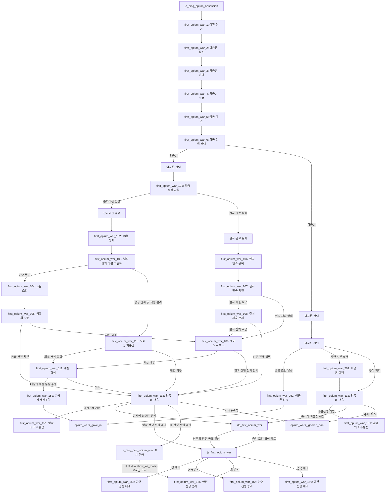

# 1차 아편전쟁 선형 구현 계획

## 목표

기존 분기형 1차 아편전쟁 계획은 전부 폐기한다. 새 구현은 하나의 저널과 짧은 선형 이벤트 체인으로 구성한다.

핵심 흐름:

```txt
first_opium_war_1
  -> first_opium_war_2
  -> first_opium_war_3
  -> first_opium_war_4
  -> first_opium_war_5
  -> first_opium_war_6
      -> 엄금론: first_opium_war_101 -> 광동 단속 사건 체인 -> 영국의 최후통첩 또는 굴욕적 배상조약
      -> 이금론: 이금론 저널 -> first_opium_war_251 또는 first_opium_war_201
```

실제 Victoria 3 이벤트 ID는 시작 체인 `first_opium_war.1-.6`, 엄금론 진행 체인 `.101-.112`, 엄금론 종결 이벤트 `.151-.156`, 이금론 진행 이벤트 `.201`, 이금론 종결 이벤트 `.251`을 사용한다. 전쟁 합류점에는 바닐라 `opium_wars.2`를 복제한 영국 이벤트 `first_opium_war.112`와 청의 `영국의 최후통첩` 이벤트 `first_opium_war.151`을 연속으로 사용한다. 영국 승리 시 청 패배 이벤트 `.153`과 영국 승리 이벤트 `.154`, 청 승리 시 청 승리 이벤트 `.155`와 영국 패배 이벤트 `.156`으로 처리한다. 문서에서 `first_opium_war_1`처럼 쓰는 이름은 읽기용 별칭이다.

## 기본 원칙

- 플레이어 선택으로 큰 분기를 만들지 않는다.
- `first_opium_war.1`부터 `.5`까지는 다음 이벤트 하나만 호출한다.
- `first_opium_war.6`에서만 엄금론과 이금론 두 선택지로 갈라진다.
- 엄금론 선택은 즉시 전쟁을 만들지 않고, `first_opium_war.101`에서 흠차대신 임명과 현지 관료 유예 중 하나를 고른 뒤 광동 단속 사건 체인으로 들어간다.
- `찰스 엘리엇의 아편 국유화`에서 함정임을 간파하면 `first_opium_war.103.b`에서 영국 정부 배상 책임 분리 효과를 직접 적용하고 `first_opium_war.110`로 이어진다.
- 현지 관료 유예를 선택하면 곧바로 토머스 쿠츠 호 사건으로 가지 않고, 현지 단속의 지연과 결서 제출 문제를 다루는 `first_opium_war.107-.109` 체인을 거친다.
- 이금론 루트는 `first_opium_war.6.b`에서 즉시 `이금론` 저널을 추가하여 처리한다.
- 과거 월간 반복 이벤트로 쓰던 구 `.6`, `.7`, `.8` 정의와 localization은 제거한다. 새 `.6`은 황제의 최종 결단 이벤트로 재사용하며, `이금론` 저널에는 월간 반복 이벤트를 두지 않는다.
- 엄금론 사건 체인의 전쟁 합류점 또는 `이금론` 부칙 폐지 시 청이 `first_opium_war.151`를 직접 호출하지 않는다. 영국에 `first_opium_war.112`을 띄우고, 영국이 아편전쟁 개입을 선택하면 청에 `first_opium_war.151`를 호출한다.
- `first_opium_war.112`은 바닐라 `opium_wars.2`의 영국 반응 효과와 localization을 공유한다. 선택지 A는 청에 `first_opium_war.151`를 띄우는 동시에, 삭제된 `first_opium_war.50`의 전용 `je_first_opium_war` 추가와 외교전 생성 효과를 직접 수행한다. 아편전쟁 회피 선택지 B의 AI 가중치는 0이다.
- `je_first_opium_war`는 영국에 추가되고 청나라를 target으로 저장한다. 기존 시장 개방·투자권·조약항 조건을 달성하면 완료되어 `c:CHI`에 `.153`, `c:GBR`에 `.154`를 호출한다. 완료 조건을 달성하지 못한 상태에서 `dp_first_opium_war`가 종료되면 실패하여 `c:CHI`에 `.155`, `c:GBR`에 `.156`을 호출한다.
- `je_qing_first_opium_war`도 청나라에 추가한다. 영국 저널의 반대 조건으로 완료·실패하지만 `on_complete`와 `on_fail`의 이벤트 효과는 모두 `show_as_tooltip`으로 감싸 결과 안내에만 사용한다.
- AI와 플레이어 모두 같은 역사적 순서를 따른다.
- 전쟁 발발 외 결말은 `first_opium_war_6`에서 이금론을 선택한 뒤, 후속 이벤트와 `이금론` 저널을 성공시켰을 때만 얻을 수 있다.
- 국내 아편 재배 보조 저널은 제거하지 않고, 이름과 진입 맥락을 `이금론` 저널로 바꿔 그대로 재사용한다.
- `이금론` 저널이 시작되면 `광동체제` 법률에 `이금론` 부칙을 붙여, 합법화의 재정 이익과 행정/정통성 비용을 법률 효과로 표현한다.
- scripted progress bar는 유지할지 재검토하되, 선형 체인에서는 필수 요소가 아니다.

## 저널 구조

### `je_qing_opium_obsession`

역할:

- 청나라에 시작부터 부여되는 1차 아편전쟁 전조 저널.
- 시작 즉시 `first_opium_war.1`을 호출한다.
- 저널은 이벤트 체인이 끝나거나 전쟁 diplomatic play가 생성되면 완료된다.

초안:

```txt
je_qing_opium_obsession = {
    icon = "gfx/interface/icons/event_icons/event_military.dds"
    group = je_group_qing

    immediate = {
        trigger_event = { id = first_opium_war.1 popup = yes }
    }

    complete = {
        OR = {
            has_variable = opium_wars_target
            has_variable = opium_wars_gave_in
            has_variable = opium_wars_won
            has_variable = lost_opium_wars
            has_modifier = opium_wars_lost
        }
    }

    invalid = {
        OR = {
            NOT = { exists = c:CHI }
            NOT = { THIS = c:CHI }
            NOT = { exists = c:GBR }
        }
    }

    weight = 10000
    should_be_pinned_by_default_uninvolved_or_context = yes
}
```

## 이벤트 체인



### `first_opium_war_1`

실제 ID: `first_opium_war.1`

역할:

- 청나라의 아편 위기가 더 이상 방치할 수 없는 상태임을 알린다.
- `opium_wars_start_var`가 이미 설정되어 바닐라 아편전쟁 시작 이벤트가 뜨지 않는다는 전제를 둔다.

효과:

- 필요한 초기 변수만 설정한다.
- 다음 이벤트 `first_opium_war.2`를 예약한다.

```txt
trigger_event = { id = first_opium_war.2 days = { 30 60 } }
```

### `first_opium_war_2`

실제 ID: `first_opium_war.2`

역할:

- 허내제의 이금론을 보여준다.
- 기존 복잡한 합법화 분기로 넘어가지 않고, 조정 논쟁의 한 단계로만 사용한다.

효과:

- 위기 압력 또는 논쟁 분위기를 약간 증가시킨다.
- 다음 이벤트 `first_opium_war.3`을 예약한다.

```txt
trigger_event = { id = first_opium_war.3 days = { 30 60 } }
```

### `first_opium_war_3`

실제 ID: `first_opium_war.3`

역할:

- 원옥린 등 엄금론자의 반박을 보여준다.
- 이금론이 정치적으로 밀려나는 과정을 표현한다.

효과:

- 아편 금지 방향을 강화한다.
- 다음 이벤트 `first_opium_war.4`를 예약한다.

```txt
trigger_event = { id = first_opium_war.4 days = { 30 60 } }
```

### `first_opium_war_4`

실제 ID: `first_opium_war.4`

역할:

- 허구의 반박 또는 조정 내 엄금론 결집을 보여준다.
- 청 조정이 사실상 엄금 정책으로 기울었음을 확정한다.

효과:

- `add_banned_goods = g:opium`
- 다음 이벤트 `first_opium_war.5`를 예약한다.

```txt
trigger_event = { id = first_opium_war.5 days = { 30 60 } }
```

### `first_opium_war_5`

실제 ID: `first_opium_war.5`

역할:

- 임칙서 파견 또는 광동 단속 착수를 표현한다.
- 호문소연, 외국 상관 봉쇄, 영국 배상 요구를 여기서 압축하지 않고, 이후 엄금론 사건 체인에서 별도 이벤트로 처리한다.

효과:

- 청나라 쪽 위기 압력을 크게 높인다.
- 영국 측 최종 반응을 기다리지 않고 다음 이벤트 `first_opium_war.6`로 이어간다.

```txt
trigger_event = { id = first_opium_war.6 days = { 60 120 } }
```

### `first_opium_war_6`

실제 ID: `first_opium_war.6`

역할:

- 청 조정의 최종 정책 선택을 처리한다.
- 선택지는 엄금론 하나와 이금론 하나만 둔다.
- 엄금론은 역사적 선택지이며, 곧바로 전쟁을 만들지 않고 `first_opium_war.101`에서 실행 방식을 고르게 한다.
- 이금론은 플레이어 전용 선택지이며, 즉시 전쟁을 피하지만 완전한 비전쟁 결말을 바로 주지는 않는다.
- 이금론을 택하면 후속 이벤트에서 아편 시장 가격, 금 보유, 이해집단 지지도를 안정시켜야 한다는 조건을 설명하고, `이금론` 저널을 연다.
- 기존 복잡한 영국 이벤트 체인은 사용하지 않는다.

선택지 A: 엄금론

- 기본 선택지.
- AI 선택 확률 100%.
- 후속 이벤트 `first_opium_war.101`을 호출한다.
- 전쟁 diplomatic play는 아직 생성하지 않는다.

핵심 효과:

```txt
option = {
    name = first_opium_war.6.a
    default_option = yes
    trigger_event = { id = first_opium_war.101 days = { 7 14 } }
    ai_chance = { base = 1 }
}
```

선택지 B: 이금론

- 플레이어 전용 선택지.
- AI 선택 확률 0%.
- 아편 금지를 해제한다.
- `opium_wars_gave_in`은 아직 설정하지 않는다.
- 선택 즉시 `이금론` 저널을 열고, 그 저널을 성공시켜야 비전쟁 결말에 도달한다.

핵심 효과:

```txt
option = {
    name = first_opium_war.6.b
    trigger = { is_ai = no }
    if = {
        limit = { is_banning_goods = opium }
        remove_banned_goods = g:opium
    }
    add_modifier = {
        name = eafp_legalized_opium_shame
        days = very_long_modifier_time
    }
    add_journal_entry = { type = je_first_opium_war_legalization }
    ai_chance = { base = 0 }
}
```

### `first_opium_war_101`

실제 ID: `first_opium_war.101`

역할:

- 엄금론을 택한 뒤 단속 실행 방식을 고르는 이벤트다.
- 선택지는 `흠차대신 임명`과 `현지 관료들에게 책임을 묻고 유예 기간을 주어 스스로 단속을 강화하게 한다` 두 가지다.
- 두 선택지 모두 광동 단속 사건 체인으로 이어지지만, 사건의 시작점과 전쟁 압력 증가 속도가 다르다.
- AI는 역사적 선택인 흠차대신 임명을 고른다.

선택지 A: 흠차대신 임명

- 기본 선택지.
- AI 선택 확률 100%.
- 임칙서 파견을 표현한다.
- 강경한 중앙 특명 단속이므로 위기 압력을 크게 올린다.
- 다음 이벤트 `first_opium_war.102`을 호출한다.

핵심 효과:

```txt
option = {
    name = first_opium_war.101.a
    default_option = yes
    add_banned_goods = g:opium
    add_modifier = {
        name = eafp_imperial_commissioner_opium_crackdown
        days = normal_modifier_time
    }
    trigger_event = { id = first_opium_war.102 days = { 15 30 } }
    ai_chance = { base = 1 }
}
```

선택지 B: 현지 관료 유예

- 플레이어 전용 완충 선택지.
- AI 선택 확률 0%.
- 광동 등 현지 관료들에게 책임을 묻고 일정 유예 기간을 주어 자체 단속을 강화하게 한다.
- 즉시 봉쇄로 튀지는 않지만, 영국과 밀수망의 반발은 결국 누적된다.
- `normal_modifier_time` 동안 현지 단속 modifier를 주고, 다음 이벤트 `first_opium_war.106`을 호출한다.
- 이 선택지는 전쟁을 피하는 선택지가 아니라 사건 순서와 협상 가능성을 바꾸는 선택지다.

핵심 효과:

```txt
option = {
    name = first_opium_war.101.b
    trigger = { is_ai = no }
    add_banned_goods = g:opium
    add_modifier = {
        name = eafp_local_official_opium_grace_period
        days = normal_modifier_time
    }
    trigger_event = { id = first_opium_war.106 days = { 60 120 } }
    ai_chance = { base = 0 }
}
```

### `first_opium_war_102`

실제 ID: `first_opium_war.102`

제목 초안: `13행 전면 봉쇄 및 인질화 조치`

역할:

- 흠차대신이 광동에 도착한 뒤 외국 상관과 13행 상인들을 압박하는 단계다.
- 역사 루트는 상관 봉쇄, 통신 차단, 행상 책임 추궁, 사실상의 인질화 조치로 위기를 급격히 끌어올린다.
- 완화 선택지는 물자 공급과 협상 창구를 남겨 이후 배상 협상으로 갈 여지를 만든다.

선택지 A: 13행 전면 봉쇄 및 인질화 조치

- AI 역사 선택지.
- 위기 압력을 크게 올린다.
- 찰스 엘리엇이 상인 보호와 정부 보상을 명분으로 개입할 수 있게 한다.
- 다음 이벤트 `first_opium_war.103`를 호출한다.

```txt
option = {
    name = first_opium_war.102.a
    default_option = yes
    add_modifier = {
        name = eafp_thirteen_factories_blockade
        days = normal_modifier_time
    }
    trigger_event = { id = first_opium_war.103 days = { 15 30 } }
    ai_chance = { base = 1 }
}
```

선택지 B: 압박하되 교섭 창구는 남긴다

- 플레이어 전용 완화 선택지.
- 위기 압력은 오르지만 봉쇄 강도는 낮다.
- 다음 이벤트 `first_opium_war.103`를 호출하되, 이후 `함정임을 간파` 선택지의 설득력이 커지는 맥락으로 쓴다.

```txt
option = {
    name = first_opium_war.102.b
    trigger = { is_ai = no }
    add_modifier = {
        name = eafp_limited_factory_pressure
        days = normal_modifier_time
    }
    trigger_event = { id = first_opium_war.103 days = { 30 60 } }
    ai_chance = { base = 0 }
}
```

### `first_opium_war_103`

실제 ID: `first_opium_war.103`

제목 초안: `찰스 엘리엇의 아편 국유화`

역할:

- 찰스 엘리엇이 영국 상인의 아편을 영국 정부 명의로 넘기게 하며, 사적 밀수품을 국가 배상 문제로 바꾸는 사건이다.
- 이 이벤트가 엄금론 루트의 핵심 분기점이다.

선택지 A: 아편을 받는다

- AI 역사 선택지.
- 영국 정부가 보상 책임을 떠안은 아편을 청이 접수한다.
- 다음 이벤트 `first_opium_war.104` 호문소연으로 이어진다.

```txt
option = {
    name = first_opium_war.103.a
    default_option = yes
    add_modifier = {
        name = eafp_opium_surrender_accepted
        days = normal_modifier_time
    }
    trigger_event = { id = first_opium_war.104 days = { 15 30 } }
    ai_chance = { base = 1 }
}
```

선택지 B: 함정임을 간파한다

- 플레이어 전용 선택지.
- 아편을 즉시 접수하지 않고, 민간 밀수품과 영국 정부 보상 책임을 분리하려 시도한다.
- 영국 정부의 배상 책임을 분리하는 modifier를 직접 적용한다.
- 다음 이벤트 `first_opium_war.110`을 호출한다.

```txt
option = {
    name = first_opium_war.103.b
    trigger = { is_ai = no }
    add_modifier = {
        name = eafp_separated_british_compensation_liability
        days = normal_modifier_time
    }
    trigger_event = { id = first_opium_war.110 days = { 15 45 } }
    ai_chance = { base = 0 }
}
```

### `first_opium_war_110`

실제 ID: `first_opium_war.110`

제목 초안: `무배상 처분안`

역할:

- 영국 정부 배상 책임을 분리한 뒤, 몰수 아편을 사적 밀수품으로 처리하려는 협상 단계다.
- 청은 제한 통상 보장과 낮은 수준의 체면 손상을 대가로 사건을 봉합할 수 있지만, 영국이 요구하는 보상 명분은 완전히 사라지지 않는다.
- 이 이벤트는 `굴욕적 배상조약`으로 가는 협상 루트와, 협상 결렬 후 `영국의 최후통첩`으로 가는 루트를 나눈다.

선택지 A: 제한 통상 보장과 최소 배상으로 봉합한다

- 플레이어 전용 비전쟁 루트 유지 선택지.
- 완전한 승리가 아니라 더 낮은 비용의 굴욕적 타협으로 간다.
- 다음 이벤트 `first_opium_war.111`을 호출한다.

```txt
option = {
    name = first_opium_war.110.a
    trigger = { is_ai = no }
    add_modifier = {
        name = eafp_minimized_opium_compensation_claim
        days = normal_modifier_time
    }
    trigger_event = { id = first_opium_war.111 days = { 15 45 } }
    ai_chance = { base = 0 }
}
```

선택지 B: 배상과 제한 통상 모두 거부한다

- 강경 복귀 선택지다.
- 영국은 청이 책임 회피와 통상 거부를 동시에 택했다고 보고 `first_opium_war.112`에서 대응을 정한다. 개입 선택 시 청의 `영국의 최후통첩` 이벤트로 이어진다.

```txt
option = {
    name = first_opium_war.110.b
    default_option = yes
    c:GBR = { trigger_event = { id = first_opium_war.112 days = { 7 21 } } }
    ai_chance = { base = 1 }
}
```

### `first_opium_war_104`

실제 ID: `first_opium_war.104`

제목 초안: `호문소연`

역할:

- 접수한 아편을 공개 폐기하는 사건이다.
- 플레이어 선택을 크게 두지 않고, 앞선 `아편 받기` 선택의 결과로 발생하는 합류 이벤트로 둔다.
- 전쟁 압력을 크게 올린 뒤 임유희 사건으로 이어진다.

```txt
option = {
    name = first_opium_war.104.a
    default_option = yes
    add_modifier = {
        name = eafp_humen_opium_destruction
        days = normal_modifier_time
    }
    trigger_event = { id = first_opium_war.105 days = { 60 120 } }
    ai_chance = { base = 1 }
}
```

### `first_opium_war_105`

실제 ID: `first_opium_war.105`

제목 초안: `임유희 살인 사건`

역할:

- 구룡 인근에서 임유희(林維喜)가 사망하고, 청이 범인 인도를 요구하지만 영국 측이 인도를 거부하는 사건이다.
- 이 사건은 호문소연 이후의 외교 위기를 무력 충돌 직전으로 밀어붙이는 분기점이다.

선택지 A: 영국 선단에 식량 공급을 완전히 차단한다

- AI 역사 선택지.
- 범인 인도 거부에 대한 강경 보복이다.
- 영국의 대응 이벤트 `first_opium_war.112`로 이어지며, 개입 선택 시 `first_opium_war.151`가 청에 발생한다.

```txt
option = {
    name = first_opium_war.105.a
    default_option = yes
    add_modifier = {
        name = eafp_british_fleet_supply_cutoff
        days = normal_modifier_time
    }
    c:GBR = { trigger_event = { id = first_opium_war.112 days = { 15 30 } } }
    ai_chance = { base = 1 }
}
```

선택지 B: 범인 인도 요구는 유지하되 공급 차단은 제한한다

- 플레이어 전용 완화 선택지.
- 전쟁 압력을 낮추지는 못하지만, 즉시 최후통첩으로 가지 않고 토머스 쿠츠 호 사건으로 이어진다.

```txt
option = {
    name = first_opium_war.105.b
    trigger = { is_ai = no }
    add_modifier = {
        name = eafp_limited_response_to_lin_weixi_case
        days = normal_modifier_time
    }
    trigger_event = { id = first_opium_war.109 days = { 15 45 } }
    ai_chance = { base = 0 }
}
```

### `first_opium_war_106`

실제 ID: `first_opium_war.106`

제목 초안: `현지 관료들의 유예 단속`

역할:

- `first_opium_war.101.b`에서 현지 관료에게 책임과 유예 기간을 준 경우의 후속 이벤트다.
- 단속은 강화되지만 중앙 특명보다 느리고 균열이 생긴다.
- 곧바로 토머스 쿠츠 호 사건으로 가지 않고, 현지 단속 지연과 결서 제출 문제를 먼저 다룬다.

```txt
option = {
    name = first_opium_war.106.a
    default_option = yes
    add_modifier = {
        name = eafp_local_opium_crackdown_deadline
        days = normal_modifier_time
    }
    trigger_event = { id = first_opium_war.107 days = { 30 90 } }
    ai_chance = { base = 1 }
}
```

### `first_opium_war_107`

실제 ID: `first_opium_war.107`

제목 초안: `현지 단속 지연`

역할:

- 현지 관료에게 유예 기간을 준 결과, 단속 명령은 내려갔지만 실제 집행이 느려지는 상황을 다룬다.
- 광동 관료와 13행 상인들은 외국 상인과의 기존 거래 질서를 완전히 끊지 않으려 하고, 청 조정은 체면과 실효성 사이에서 다시 선택해야 한다.
- 이 이벤트는 현지 유예 루트가 단순한 평화 선택지가 아니라, 중앙 통제 약화와 외국 상인 이탈을 동반한다는 점을 보여준다.

선택지 A: 기한을 재확인하고 결서 제출을 요구한다

- 플레이어 전용 완화 루트 유지 선택지.
- 외국 상인에게 아편 금지 서약인 결서를 요구하고, 이를 따르는 선박만 통상 질서로 되돌리려 한다.
- 다음 이벤트 `first_opium_war.108`을 호출한다.

```txt
option = {
    name = first_opium_war.107.a
    trigger = { is_ai = no }
    add_modifier = {
        name = eafp_local_crackdown_deadline_reaffirmed
        days = normal_modifier_time
    }
    trigger_event = { id = first_opium_war.108 days = { 30 60 } }
    ai_chance = { base = 0 }
}
```

선택지 B: 현지 재량을 더 인정한다

- 유예를 더 주는 선택지지만, 결과적으로 영국 상인과 엘리엇 사이의 균열을 빠르게 드러낸다.
- 다음 이벤트 `first_opium_war.109` 토머스 쿠츠 호 사건으로 이어진다.

```txt
option = {
    name = first_opium_war.107.b
    default_option = yes
    add_modifier = {
        name = eafp_local_official_discretion_extended
        days = normal_modifier_time
    }
    trigger_event = { id = first_opium_war.109 days = { 15 45 } }
    ai_chance = { base = 1 }
}
```

### `first_opium_war_108`

실제 ID: `first_opium_war.108`

제목 초안: `결서 제출 문제`

역할:

- 현지 단속 유예 루트에서 결서를 제출한 선박과 엘리엇의 통제에 따르는 선박 사이의 균열을 다룬다.
- 토머스 쿠츠 호 사건으로 이어질 수 있는 직접 전 단계다.
- 청 조정은 결서 제출 선박을 선례로 삼아 제한 통상을 회복할지, 영국 선단 전체를 같은 압박 대상으로 묶을지 선택한다.

선택지 A: 결서 제출 선박만 받아들인다

- 플레이어 전용 완화 선택지.
- 영국 내부 균열을 이용해 토머스 쿠츠 호 사건으로 이어진다.
- 다음 이벤트 `first_opium_war.109`을 호출한다.

```txt
option = {
    name = first_opium_war.108.a
    trigger = { is_ai = no }
    add_modifier = {
        name = eafp_bond_submission_precedent
        days = normal_modifier_time
    }
    trigger_event = { id = first_opium_war.109 days = { 15 45 } }
    ai_chance = { base = 0 }
}
```

선택지 B: 결서 없이는 선단 전체를 압박한다

- 강경 복귀 선택지다.
- 현지 유예 루트가 실패하고, 영국의 대응 이벤트 `first_opium_war.112`로 이어진다.

```txt
option = {
    name = first_opium_war.108.b
    default_option = yes
    add_modifier = {
        name = eafp_bond_submission_rejected_fleet_pressure
        days = normal_modifier_time
    }
    c:GBR = { trigger_event = { id = first_opium_war.112 days = { 15 45 } } }
    ai_chance = { base = 1 }
}
```

### `first_opium_war_109`

실제 ID: `first_opium_war.109`

제목 초안: `토머스 쿠츠 호 배신 사건`

역할:

- 토머스 쿠츠 호가 엘리엇의 지시를 거스르고 결서 제출 또는 통상 재개를 시도한 사건을 다룬다.
- 청 조정은 이를 영국 내부 균열로 이용할지, 배신을 받아들인 선례가 더 큰 분열을 부를 것을 우려해 강경 대응할지 선택한다.

선택지 A: 배신을 이용해 통상 질서를 다시 세운다

- 플레이어 전용 완화 선택지.
- 토머스 쿠츠 호의 협조를 근거로 제한 통상과 배상 협상으로 이동한다.
- 다음 이벤트 `first_opium_war.111`을 호출한다.

```txt
option = {
    name = first_opium_war.109.a
    trigger = { is_ai = no }
    add_modifier = {
        name = eafp_thomas_coutts_precedent
        days = normal_modifier_time
    }
    trigger_event = { id = first_opium_war.111 days = { 15 45 } }
    ai_chance = { base = 0 }
}
```

선택지 B: 엘리엇의 권위 뒤에 숨은 영국 선단 전체를 압박한다

- AI 역사 선택지.
- 토머스 쿠츠 호 사건이 평화 신호가 아니라 영국 내부 균열과 압박 심화의 계기가 된다.
- 영국의 대응 이벤트 `first_opium_war.112`로 이어지며, 개입 선택 시 `first_opium_war.151`가 청에 발생한다.

```txt
option = {
    name = first_opium_war.109.b
    default_option = yes
    add_modifier = {
        name = eafp_rejected_thomas_coutts_precedent
        days = normal_modifier_time
    }
    c:GBR = { trigger_event = { id = first_opium_war.112 days = { 15 45 } } }
    ai_chance = { base = 1 }
}
```

### `first_opium_war_111`

실제 ID: `first_opium_war.111`

제목 초안: `배상 협상`

역할:

- `찰스 엘리엇의 함정`을 간파한 뒤 영국 정부 배상 책임 분리를 시도했거나, 토머스 쿠츠 호 사건을 이용했을 때 열리는 완화 루트다.
- 전쟁을 명예롭게 피하는 길이 아니라, 청이 배상과 제한 통상 보장을 받아들이는 굴욕적 타협 루트다.

선택지 A: 배상과 제한 통상 보장을 받아들인다

- 플레이어 전용 비전쟁 결말.
- 다음 이벤트 `first_opium_war.152` 굴욕적 배상조약으로 이어진다.

```txt
option = {
    name = first_opium_war.111.a
    trigger = { is_ai = no }
    trigger_event = { id = first_opium_war.152 days = { 7 14 } }
    ai_chance = { base = 0 }
}
```

선택지 B: 끝내 받아들일 수 없다

- 전쟁 루트 복귀 선택지.
- 영국의 대응 이벤트 `first_opium_war.112`로 이어지며, 개입 선택 시 `first_opium_war.151`가 청에 발생한다.

```txt
option = {
    name = first_opium_war.111.b
    default_option = yes
    c:GBR = { trigger_event = { id = first_opium_war.112 days = { 7 14 } } }
    ai_chance = { base = 1 }
}
```

### `first_opium_war_152`

실제 ID: `first_opium_war.152`

제목 초안: `굴욕적 배상조약`

역할:

- 엄금론 루트에서 전쟁을 피할 수 있는 드문 결말이다.
- 청은 아편 단속 명분을 유지하지만, 영국 상인 손실 배상과 제한 통상 보장을 받아들인다.
- 좋은 결말이 아니라, 전쟁 대신 외교적 굴욕과 재정 부담을 택하는 결말이다.
- 메인 저널 완료를 위해 `opium_wars_gave_in`을 설정한다.

```txt
option = {
    name = first_opium_war.152.a
    default_option = yes
    set_variable = opium_wars_gave_in
    add_modifier = {
        name = eafp_humiliating_opium_indemnity_treaty
        days = very_long_modifier_time
    }
    ai_chance = { base = 1 }
}
```

## `이금론` 저널

실제 ID 초안: `je_first_opium_war_legalization`

표시 이름:

```yml
je_first_opium_war_legalization: "이금론"
```

역할:

- 기존 국내 아편 생산 저널의 제한 시간과 실패 구조를 재사용한다.
- 완료 조건은 국내 아편 생산량 자체가 아니라, 이금론이 실제로 시장과 재정을 안정시켰는지를 본다.
- 아편의 시장 가격이 base price의 120% 이하이고, 금 보유율이 충분하며, 모든 이해집단이 최소한 중립 이상이어야 한다.
- 이름과 설명만 `이금론` 정책 실행에 맞게 바꾼다.
- 새 저널은 기존 국내 아편 생산 저널의 timeout 구조를 옮겨오되, complete 조건은 새 조건으로 교체한다.
- 월간 반복 이벤트는 기존 국내 아편 생산 저널의 `first_opium_war.26` 대신 아편 중독 저널의 반복 이벤트 묶음을 그대로 사용한다.
- 저널 시작 시 `광동체제` 법률에 `이금론` 부칙을 추가한다.
- `이금론` 부칙이 폐지되면 저널은 invalid 처리된다.
- 이때 청나라가 여전히 `광동체제` 또는 `고립주의`를 유지 중이면 영국에 `first_opium_war.112`을 띄워 전쟁 루트로 되돌린다. 영국의 개입 선택 시 청에 `first_opium_war.151`가 발생한다.

법률 부칙:

- 부칙 ID 초안: `amendment_first_opium_war_legalization`
- 표시 이름: `이금론`
- 붙는 법률: `law_canton_system`
- 기본 parent 법률: `law_isolationism`
- 저널 시작 시 청나라의 활성 무역 법률이 `law_canton_system`일 때만 부칙을 추가한다.
- 효과는 국가가 아편을 제도권 안으로 끌어들였을 때의 주조 수익 증가, 행정 부담, 아편 수요 증가, 아편 수출 관세 상한 감소, 조정 정통성 손상, 유교/상인층 반발을 함께 표현한다.

부칙 정의 초안:

```txt
amendment_first_opium_war_legalization = {
    parent = law_isolationism

    allowed_laws = {
        law_canton_system
    }

    modifier = {
        country_minting_mult = 0.05
        country_bureaucracy_mult = -0.05
        state_buy_orders_opium_add = 100
        country_opium_max_export_tariffs_level_add = -2
        country_legitimacy_base_add = -10
        interest_group_ig_devout_approval_add = -5
        interest_group_ig_petty_bourgeoisie_approval_add = -5
    }

    possible = {
        c:CHI ?= THIS
    }

    ai_will_revoke = {
        always = no
    }
}
```

부칙 폐지 잔존 modifier:

- modifier ID 초안: `eafp_first_opium_war_legalization_repealed_decay`
- 역할: `이금론` 부칙을 폐지해도 이미 생긴 합법화의 행정 부담, 아편 수요, 정통성 손상, 이해집단 반발이 즉시 사라지지 않도록 표현한다.
- 효과는 `amendment_first_opium_war_legalization`의 modifier와 동일하게 둔다.
- 적용 방식은 `add_modifier`에서 `days = normal_modifier_time`, `is_decaying = yes`를 사용한다.

정의 초안:

```txt
eafp_first_opium_war_legalization_repealed_decay = {
    country_minting_mult = 0.05
    country_bureaucracy_mult = -0.05
    state_buy_orders_opium_add = 100
    country_opium_max_export_tariffs_level_add = -2
    country_legitimacy_base_add = -10
    interest_group_ig_devout_approval_add = -5
    interest_group_ig_petty_bourgeoisie_approval_add = -5
}
```

내용:

```txt
immediate = {
    if = {
        limit = { has_law = law_type:law_canton_system }
        active_law:lawgroup_trade_policy ?= {
            if = {
                limit = {
                    NOT = {
                        has_amendment = amendment_type:amendment_first_opium_war_legalization
                    }
                }
                add_amendment = {
                    type = amendment_first_opium_war_legalization
                    sponsor = PREV.ig:ig_landowners
                }
            }
        }
    }
}

complete = {
    custom_tooltip = {
        text = eafp_first_opium_war_legalization_opium_price_tt
        # market_goods_pricier <= 0.2: 현재 시장 가격이 base price보다 20% 초과로 비싸지 않음.
        mg:opium = { market_goods_pricier <= 0.2 }
    }
    gold_reserve_ratio >= 0.2
    custom_tooltip = {
        text = eafp_first_opium_war_legalization_ig_approval_tt
        NOT = {
            any_interest_group = {
                ig_approval < 0
            }
        }
    }
}

on_complete = {
    trigger_event = { id = first_opium_war.251 popup = yes }
}

on_timeout = {
    trigger_event = { id = first_opium_war.201 popup = yes }
}

invalid = {
    OR = {
        NOT = { exists = c:CHI }
        NOT = { THIS = c:CHI }
        has_variable = opium_wars_target
        has_variable = opium_wars_gave_in
        AND = {
            OR = {
                has_law = law_type:law_canton_system
                has_law = law_type:law_isolationism
            }
            active_law:lawgroup_trade_policy ?= {
                NOT = {
                    has_amendment = amendment_type:amendment_first_opium_war_legalization
                }
            }
        }
    }
}

on_invalid = {
    if = {
        limit = {
            OR = {
                has_law = law_type:law_canton_system
                has_law = law_type:law_isolationism
            }
            NOT = { has_variable = opium_wars_target }
            NOT = { has_variable = opium_wars_gave_in }
        }
        add_modifier = {
            name = eafp_first_opium_war_legalization_repealed_decay
            days = normal_modifier_time
            is_decaying = yes
        }
        c:GBR = { trigger_event = { id = first_opium_war.112 popup = yes } }
    }
}
```

성공:

- `first_opium_war.251`을 호출한다.
- 청나라에 `opium_wars_gave_in`을 설정한다.
- 아편 가격, 금 보유, 이해집단 지지도 조건을 모두 만족해 이금론이 관리 가능한 정책으로 자리잡았음을 보여준다.
- 아편 합법화/시장 안정 modifier를 부여한다.
- `je_qing_opium_obsession` 완료 조건을 만족한다.

실패:

- `first_opium_war.201`를 호출한다.
- 이금론은 실패하고 엄금론/전쟁 루트로 되돌아간다.
- 영국의 대응 이벤트 `first_opium_war.112`을 호출해 아편전쟁 루트로 합류한다.

부칙 폐지:

- 플레이어가 `이금론` 부칙을 폐지하면 `이금론` 저널은 invalid 된다.
- `on_invalid`는 `광동체제` 또는 `고립주의`가 유지 중인지 확인한다.
- 조건을 만족하면 `eafp_first_opium_war_legalization_repealed_decay`를 `normal_modifier_time` 동안 `is_decaying = yes`로 부여한다.
- 이어서 영국에 `first_opium_war.112`을 호출한다.
- `first_opium_war.112`의 개입 선택지는 청에 기존 `영국의 최후통첩` 이벤트 `first_opium_war.151`를 띄우고 아편전쟁 루트로 이어진다.

### `first_opium_war_251`

실제 ID: `first_opium_war.251`

역할:

- `이금론` 저널 성공 이벤트다.
- 아편 가격과 금 보유, 이해집단 지지도가 안정되어 이금론이 일단 관리 가능한 정책으로 자리잡았다는 결말을 보여준다.

효과:

- `opium_wars_gave_in`을 설정한다.
- 아편 금지는 해제 상태를 유지한다.
- 필요하면 `eafp_legalized_opium_shame` 또는 국내 아편 체제 modifier를 부여한다.

```txt
option = {
    name = first_opium_war.251.a
    default_option = yes
    set_variable = opium_wars_gave_in
    add_modifier = {
        name = eafp_legalized_opium_shame
        days = very_long_modifier_time
    }
}
```

### `first_opium_war_201`

실제 ID: `first_opium_war.201`

역할:

- `이금론` 저널 실패 이벤트다.
- 아편 가격 안정, 금 보유 회복, 이해집단 지지도 확보 중 하나 이상에 실패해 이금론이 무너지고, 위기가 다시 전쟁 루트로 돌아가는 상황을 보여준다.

효과:

- 영국의 대응 이벤트 `first_opium_war.112`을 호출한다.
- 영국이 개입하면 청에 `first_opium_war.151`가 발생하고 아편전쟁 루트로 이어진다.

```txt
option = {
    name = first_opium_war.201.a
    default_option = yes
    c:GBR = { trigger_event = { id = first_opium_war.112 popup = yes } }
}
```

## 삭제할 요소

다음 요소는 새 선형 계획에서 제거한다.

- 기존 `first_opium_war.10`부터 `first_opium_war.52`까지의 분기형 체인
- 새 번호 체계에서는 이금론 실패 이벤트를 `first_opium_war.201`, 성공 종결 이벤트를 `.251`로 둔다. 이금론 실행 효과는 `first_opium_war.6.b`에 직접 둔다.
- `first_opium_war.112`은 바닐라 `opium_wars.2`의 영국 반응을 복제하는 전쟁 합류점이며, `first_opium_war.151`는 그 개입 선택 뒤 청에 발생하는 `영국의 최후통첩`으로 유지한다.
- `first_opium_war.112.a`는 청에 `first_opium_war.151`을 띄우고, 기존 `first_opium_war.50`의 휴전 종료, 영국 저널 추가, 외교전 및 전쟁 목표 생성, 외교전 고조도와 전쟁 지지도 설정, 청의 `opium_wars_target` 설정을 한 번에 수행한다. `.112.b`는 바닐라 회피 효과를 유지하되 `ai_chance = 0`으로 둔다.
- `first_opium_war.50`은 이벤트와 localization을 모두 삭제한다.
- `first_opium_war.101-.112`는 엄금론 진행 체인, `.151-.156`은 엄금론 종결 이벤트로 둔다.
- 기존 `je_first_opium_war_domestic_opium_substitution` ID
- 국내 아편 재배 성공/실패 루트의 기존 이름과 분기 구조
- 배상 타협 루트
- 국산 아편 체제 결말
- 월간 random event 기반 조정 논쟁 pulse

단, `굴욕적 배상조약`은 삭제 대상이 아니다. 기존의 느슨한 배상 타협 루트를 제거하고, 새 계획에서는 `first_opium_war.111` 배상 협상과 `.152` 종결 이벤트로 엄금론 사건 체인 안에 제한적으로 다시 둔다.

단, 국내 아편 생산 저널의 제한 시간과 실패 구조는 `이금론` 저널로 이름을 바꿔 재사용하되, 완료 조건은 아편 가격, 금 보유, 이해집단 지지도 조건으로 교체한다. 사료 기반 flavor text는 새 시작 체인 `.1-.6`, 엄금론 체인 `.101-.112`와 `.151-.152`, 이금론 이벤트 `.201`과 `.251`에 배치한다. 전쟁 결과 이벤트 `.153-.154`의 localization은 복제 원본인 바닐라 `opium_wars.4-.5`를 참조하고, 청 승리 `.155`의 flavor는 바닐라 `opium_wars.3`을 참조한다.

## 안전장치

각 이벤트에는 다음 guard를 둔다.

청나라 이벤트:

```txt
trigger = {
    has_journal_entry = je_qing_opium_obsession
    NOT = { has_variable = opium_wars_target }
    NOT = { has_variable = opium_wars_gave_in }
}
```

전쟁 발발 선택지 guard:

```txt
trigger = {
    exists = c:CHI
    exists = c:GBR
    c:CHI = {
        has_journal_entry = je_qing_opium_obsession
        NOT = { has_variable = opium_wars_target }
        NOT = { has_variable = opium_wars_gave_in }
    }
    NOT = { is_diplomatic_play_enemy_of = c:CHI }
}
```

반복 호출 방지를 위해 모든 선형 이벤트에 긴 cooldown을 둔다.

```txt
cooldown = { days = stupidly_long_modifier_time }
```

## 구현 순서

1. 기존 분기형 이벤트 정의를 제거한다.
2. 시작 체인 `.1-.6`, 엄금론 진행 체인 `.101-.112`, 엄금론 종결 이벤트 `.151-.156`, 이금론 진행 이벤트 `.201`, 이금론 종결 이벤트 `.251`만 남긴다.
3. 과거 월간 반복 이벤트였던 구 `.6`, `.7`, `.8` 정의와 localization을 제거하고, `.6`은 황제의 최종 결단 이벤트에 재할당한다.
4. 부칙 폐지와 엄금론 전쟁 합류점에서 사용할 영국 반응 이벤트 `first_opium_war.112`과 청의 최후통첩 이벤트 `first_opium_war.151`를 유지한다.
5. `.1`부터 `.5`까지는 기본 선택지 하나만 둔다.
6. `.1`부터 `.5`까지는 다음 이벤트 하나만 `trigger_event`로 예약하게 한다.
7. `je_qing_opium_obsession`의 monthly random events와 scripted progress bar 의존을 제거한다.
8. `je_first_opium_war_domestic_opium_substitution` ID는 제거하고, 제한 시간과 실패 구조만 `je_first_opium_war_legalization`으로 옮긴다.
9. `이금론` 저널 완료 조건을 아편 시장 가격 120% 이하, `gold_reserve_ratio >= 0.2`, 모든 이해집단 `ig_approval >= 0`으로 교체한다.
10. 아편 시장 가격 조건은 scripted trigger로 분리하지 않고, 저널 `complete` 안에 `mg:opium = { market_goods_pricier <= 0.2 }`로 직접 적는다.
11. `amendment_first_opium_war_legalization`을 추가하고, `parent = law_isolationism`, `allowed_laws = { law_canton_system }`로 둔다.
12. `eafp_first_opium_war_legalization_repealed_decay` modifier를 추가한다. 효과는 `이금론` 부칙과 같고, 부칙 폐지 시 `normal_modifier_time` 동안 `is_decaying = yes`로 적용한다.
13. `이금론` 저널 `immediate`에서 `lawgroup_trade_policy`의 활성 법률에 부칙을 추가한다.
14. `이금론` 저널 `invalid`는 `광동체제` 또는 `고립주의` 유지 중 `이금론` 부칙이 사라진 경우를 잡는다.
15. `이금론` 저널 `on_invalid`는 decay modifier를 부여하고 영국에 `first_opium_war.112`을 호출한다.
16. `이금론` 저널에는 아편 중독 반복 이벤트를 호출하는 `on_monthly_pulse`를 두지 않는다.
17. localization에서 삭제된 이벤트 키를 제거한다.
18. 남긴 이벤트의 title, desc, flavor, option을 순서대로 재정렬한다.
19. `first_opium_war.6`에서 엄금론과 이금론 두 선택지를 처리한다.
20. 엄금론 선택지는 전쟁 diplomatic play를 직접 만들지 않고 `first_opium_war.101`을 호출한다.
21. `first_opium_war.101`은 흠차대신 임명과 현지 관료 유예 중 하나를 고르게 한다.
22. `first_opium_war.101.a` 흠차대신 임명은 AI 역사 선택지이며 `first_opium_war.102`로 이어진다.
23. `first_opium_war.101.b` 현지 관료 유예는 플레이어 전용 선택지이며 `first_opium_war.106`으로 이어진다.
24. `first_opium_war.102`은 `13행 전면 봉쇄 및 인질화 조치`와 완화 선택지를 처리한다.
25. `first_opium_war.103`은 찰스 엘리엇의 아편 국유화 후 아편 넘기기를 처리한다. `아편 받기`는 `.104` 호문소연으로, `함정임을 간파`는 영국 정부 배상 책임 분리 효과를 적용한 뒤 `.110` 무배상 처분안으로 간다.
26. `first_opium_war.110`은 무배상 처분안을 처리한다. 제한 통상과 최소 배상 봉합은 `.111` 배상 협상으로, 전면 거부는 영국의 `.112` 대응 이벤트로 간다.
27. `first_opium_war.104`는 호문소연을 처리하고 `.105` 임유희 사건으로 이어진다.
28. `first_opium_war.105`는 임유희 살인 사건과 범인 인도 거부를 처리한다. 식량 공급 완전 차단은 영국의 `.112` 대응 이벤트로, 제한 대응은 `.109` 토머스 쿠츠 호 사건으로 간다.
29. `first_opium_war.106`은 현지 관료 유예 단속 후 `.107` 현지 단속 지연으로 간다.
30. `first_opium_war.107`은 현지 단속 지연을 처리한다. 기한 재확인과 결서 제출 요구는 `.108`로, 현지 재량 확대는 `.109` 토머스 쿠츠 호 사건으로 간다.
31. `first_opium_war.108`은 결서 제출 문제를 처리한다. 결서 제출 선박만 받아들이면 `.109`로, 선단 전체 압박은 영국의 `.112` 대응 이벤트로 간다.
32. `first_opium_war.109`는 토머스 쿠츠 호 배신 사건을 처리한다. 이를 이용하면 `.111` 배상 협상으로, 거부하면 영국의 `.112` 대응 이벤트로 간다.
33. `first_opium_war.111`은 배상 협상을 처리한다. 배상과 제한 통상 보장을 받아들이면 `.152` 굴욕적 배상조약으로, 거부하면 영국의 `.112` 대응 이벤트로 간다.
34. `first_opium_war.152`는 굴욕적 배상조약 결말이며 `opium_wars_gave_in`을 설정한다.
35. 이금론 선택지는 아편 금지를 해제하고 `이금론` 저널을 즉시 연다.
36. `이금론` 저널 성공 시 `.251`, 실패 시 `.201`을 호출한다.
37. `.251`은 `opium_wars_gave_in`을 설정한다.
38. `.201`은 영국의 `.112` 대응 이벤트를 호출하고, 영국의 개입 선택으로 청의 `.151` 최후통첩에 이어진다.
39. `.112.a`에서 바닐라 `je_opium_wars` 대신 청나라를 target으로 하는 `je_first_opium_war`를 영국에 추가한다.
40. `je_first_opium_war`가 영국의 전쟁 목표 달성을 감지하면 `c:CHI`에 `.153`, `c:GBR`에 `.154`를 5일 뒤 호출한다.
41. `.153`과 `.154`는 각각 바닐라 `opium_wars.4`, `opium_wars.5`를 복제하되 국가 탐색 scope를 `c:CHI`, `c:GBR` 태그로 고정한다.
42. 영국 저널의 실패 조건을 승리 조건 미달성 및 `dp_first_opium_war` 종료로 교체하고, 실패 시 `.155`와 `.156`을 호출한다.
43. 청나라에 표시 전용 `je_qing_first_opium_war`를 추가하고 모든 결과 효과를 `show_as_tooltip`으로 처리한다.
44. `.155`는 청 통합도 10% 증가와 정치운동 급진파 감소·권위 증가 modifier를 적용하고, `.156`은 영국의 원정 실패 modifier를 적용한다.
45. 오류 검사를 수행한다.

## 오류 검사

잔여 분기 이벤트 확인:

허용되는 이벤트 정의는 `.1-.6`, `.101-.112`, `.151-.156`, `.201`, `.251`이다. `.6`은 황제의 최종 결단이며, 구 월간 반복 이벤트 `.7`, `.8`과 이전 번호 체계의 정의·호출은 남지 않아야 한다.

```powershell
rg -n "^first_opium_war\.[0-9]+\s*=\s*\{" events/eafp_chi_events/eafp_first_opium_war_events.txt
```

남아야 하는 이벤트 확인:

```powershell
rg -n "first_opium_war\.(1|2|3|4|5|6|10[1-9]|11[0-2]|15[1-6]|201|251)\b" events localization documentation
```

구버전 보조 저널 ID 제거 확인:

```powershell
rg -n "je_first_opium_war_domestic_opium_substitution" common events localization documentation
```

새 이금론 저널 확인:

```powershell
rg -n "je_first_opium_war_legalization|이금론" common events localization documentation
```

이금론 완료 조건 확인:

```powershell
rg -n "mg:opium|market_goods_pricier <= 0.2|gold_reserve_ratio|ig_approval < 0|eafp_first_opium_war_legalization_opium_price_tt|eafp_first_opium_war_legalization_ig_approval_tt" common events localization documentation
```

이금론 부칙 확인:

```powershell
rg -n "amendment_first_opium_war_legalization|law_canton_system|law_isolationism|state_buy_orders_opium_add|country_opium_max_export_tariffs_level_add" common events localization documentation
```

이금론 부칙 폐지 invalid 확인:

```powershell
rg -n "eafp_first_opium_war_legalization_repealed_decay|on_invalid|has_amendment = amendment_type:amendment_first_opium_war_legalization|trigger_event = \\{ id = first_opium_war\\.112|is_decaying = yes" common events localization documentation
```

최종 선택지 효과 확인:

```powershell
rg -n "first_opium_war\\.(90|91|92|93|94|96|97|98|99|111|112|113|12)|dp_first_opium_war|create_diplomatic_play|opium_wars_target|opium_wars_aggressor|opium_wars_gave_in|eafp_legalized_opium_shame|eafp_imperial_commissioner_opium_crackdown|eafp_local_official_opium_grace_period|eafp_thirteen_factories_blockade|eafp_separated_british_compensation_liability|eafp_minimized_opium_compensation_claim|eafp_local_crackdown_deadline_reaffirmed|eafp_bond_submission_precedent|eafp_humen_opium_destruction|eafp_british_fleet_supply_cutoff|eafp_humiliating_opium_indemnity_treaty|je_first_opium_war_legalization" events/eafp_chi_events/eafp_first_opium_war_events.txt
```

기본 구조 검사:

- 이벤트 파일 brace balance가 0인지 확인한다.
- 정의되지 않은 `trigger_event` target이 없는지 확인한다.
- localization 중복 key가 없는지 확인한다.
- `git diff --check`를 실행한다.
- `.txt`, `.yml`, `.md` 파일의 UTF-8 BOM + CRLF 상태를 확인한다.
- 게임 실행 후 `error.log`에서 unknown event, missing localization, invalid scope, invalid diplomatic play 오류를 확인한다.

## 최종 기대 흐름

청나라 시작:

1. `je_qing_opium_obsession` 추가.
2. `first_opium_war.1` 발생.
3. 조정 논쟁 이벤트 `2`, `3`, `4`가 순차 발생.
4. 광동 단속 이벤트 `5` 발생.
5. 최종 정책 선택 이벤트 `6` 발생.
6. `6.a` 엄금론 선택 시 `first_opium_war.101`이 발생한다.
7. `first_opium_war.101`에서 흠차대신 임명을 고르면 `first_opium_war.102` 13행 봉쇄 사건으로 간다.
8. `first_opium_war.101`에서 현지 관료 유예를 고르면 `first_opium_war.106` 현지 단속 유예 사건으로 간다.
9. `first_opium_war.102`에서 13행 전면 봉쇄 및 인질화 조치를 택하면 `first_opium_war.103` 엘리엇의 아편 국유화 사건으로 간다.
10. `first_opium_war.103`에서 아편을 받으면 `first_opium_war.104` 호문소연으로 이어진다.
11. `first_opium_war.103`에서 함정임을 간파하면 영국 정부 배상 책임 분리 효과를 적용하고 `first_opium_war.110` 무배상 처분안으로 간다.
12. `first_opium_war.110`에서 제한 통상과 최소 배상으로 봉합하면 `first_opium_war.111` 배상 협상으로 가고, 배상과 제한 통상을 모두 거부하면 영국의 `first_opium_war.112` 대응 이벤트로 간다.
13. `first_opium_war.104` 호문소연 이후 `first_opium_war.105` 임유희 살인 사건이 발생한다.
14. `first_opium_war.105`에서 영국 선단 식량 공급을 완전히 차단하면 영국의 `first_opium_war.112` 대응 이벤트로 가고, 개입 선택 뒤 청의 `.151`과 아편전쟁 루트로 진행된다.
15. `first_opium_war.105`에서 제한 대응을 택하면 `first_opium_war.109` 토머스 쿠츠 호 배신 사건으로 간다.
16. `first_opium_war.106` 현지 관료 유예 루트는 `first_opium_war.107` 현지 단속 지연으로 간다.
17. `first_opium_war.107`에서 기한을 재확인하고 결서 제출을 요구하면 `first_opium_war.108` 결서 제출 문제로 가고, 현지 재량을 더 인정하면 `first_opium_war.109` 토머스 쿠츠 호 사건으로 간다.
18. `first_opium_war.108`에서 결서 제출 선박만 받아들이면 `first_opium_war.109` 토머스 쿠츠 호 사건으로 가고, 선단 전체를 압박하면 영국의 `first_opium_war.112` 대응 이벤트로 간다.
19. `first_opium_war.109`에서 토머스 쿠츠 호 사건을 이용하면 `first_opium_war.111` 배상 협상으로, 거부하면 영국의 `first_opium_war.112` 대응 이벤트로 간다.
20. `first_opium_war.111`에서 배상과 제한 통상을 받아들이면 `first_opium_war.152` 굴욕적 배상조약으로 끝난다.
21. `first_opium_war.111`에서 거부하면 영국의 `first_opium_war.112` 대응 이벤트로 가고, 개입 선택 뒤 청의 `.151`과 아편전쟁 루트로 진행된다.
22. `6.b` 이금론 선택 시 청나라는 아편 금지를 해제하고 `이금론` 저널을 즉시 연다.
23. `이금론` 저널 시작 시 `광동체제` 법률에 `이금론` 부칙이 붙는다.
24. `이금론` 저널에는 아편 중독 월간 반복 이벤트를 두지 않는다.
25. 아편 가격이 base price의 120% 이하, `gold_reserve_ratio >= 0.2`, 모든 이해집단 지지도 0 이상을 동시에 만족하면 `이금론` 저널이 성공한다.
26. `이금론` 저널 성공 시 `first_opium_war.251`이 발생하고 `opium_wars_gave_in`을 받아 메인 저널 완료 조건을 만족.
27. `이금론` 저널 실패 시 `first_opium_war.201`가 발생하고 영국의 `first_opium_war.112` 대응 이벤트로 돌아간다.
28. `광동체제` 또는 `고립주의` 유지 중 `이금론` 부칙을 폐지하면 `이금론` 저널이 invalid 된다.
29. `on_invalid`는 `eafp_first_opium_war_legalization_repealed_decay`를 `normal_modifier_time` 동안 decay modifier로 부여한다.
30. 이후 영국에 `first_opium_war.112`이 발생하며, 개입 선택 시 청에 `first_opium_war.151`가 발생해 아편전쟁 루트로 돌아간다.
31. 영국이 개입을 선택하면 `dp_first_opium_war`와 함께 청나라를 target으로 하는 `je_first_opium_war`가 영국에 추가된다.
32. 영국이 시장 개방, 투자권 또는 조약항 목표를 달성하면 `je_first_opium_war`가 완료된다.
33. 저널 완료 5일 뒤 청나라에는 `first_opium_war.153` 패배 이벤트가, 영국에는 `first_opium_war.154` 승리 이벤트가 발생한다.
34. 두 결과 이벤트는 바닐라 효과와 localization을 유지하되 국가 scope는 각각 `c:CHI`, `c:GBR`로 고정된다.
35. 청나라에도 `je_qing_first_opium_war`가 추가되며, 이 저널은 양국 결과 이벤트를 `show_as_tooltip`으로만 보여준다.
36. 영국이 승리 조건을 달성하지 못한 채 `dp_first_opium_war`가 끝나면 영국 저널이 실패한다.
37. 영국 저널 실패 5일 뒤 청나라에는 `first_opium_war.155` 승리 이벤트가, 영국에는 `first_opium_war.156` 패배 이벤트가 발생한다.
38. 청 승리 이벤트는 중국 통합도를 10% 높이고, 정치운동 급진파를 줄이며 권위를 높이는 장기 modifier를 부여한다.
