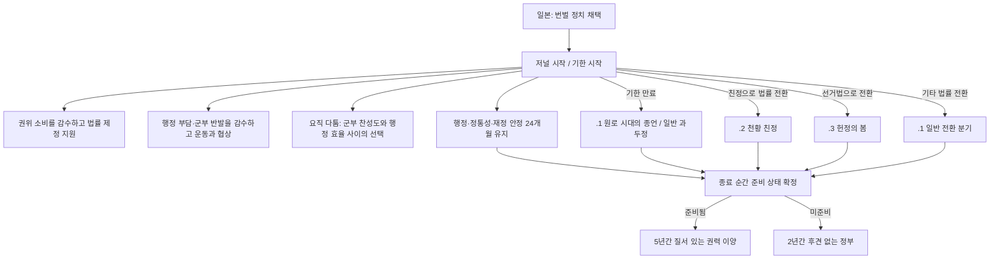

# 번벌 정치 저널 구현 계획

개정일: 2026-10-04. **계획만 수정했으며 게임 코드는 변경하지 않았다.** 수치·기간은 첫 구현을 위한 제안값이다. 번벌 영향력이라는 별도 수치 없이 국가의 실제 상태와 기간제 효과로 운영한다.

## 1. 저널의 역할

`law_hanbatsu_oligarchy`를 보유한 일본에서 활성화되는, **원로 정치의 기한 동안 개혁과 정치적 타협을 추진하고 안정적인 후속 체제를 준비하는 저널**로 만든다.

플레이어의 선택은 실제 국가 운영의 대가와 연결한다.

1. 권위를 다른 용도에 활용할 것인가, 원로의 중재를 통해 법률 제정을 지원할 것인가.
2. 행정 자원을 소모하고 기존 지배층의 반발을 감수하면서 자유민권운동과 타협할 것인가.
3. 번벌을 유지한 채 세대교체를 맞을 것인가, 정상적인 법률 제정으로 천황 친정·의회 정치 등으로 먼저 전환할 것인가.

**번벌 영향력 변수·progress bar·월간 증감·구간별 보너스는 사용하지 않는다.** 기존 게임의 권위·행정력·정통성·이해집단 찬성도·운동 급진성에 직접 효과를 준다. 안정적 통치 유지 개월 수는 종결 준비 판정용이며 결정을 구매하는 자원으로 사용하지 않는다.

원로 개인은 추적하지 않는다. 저널의 기본 기한이 끝나면 원로 정치가 종결된다. **`.4` 「번벌의 균열」은 만들지 않는다.**

## 2. 바닐라 조사와 채택할 구조

설치된 바닐라 `D:/SteamLibrary/steamapps/common/Victoria 3/game`의 실제 파일을 조사했다. 아래는 확인한 구현과 이 계획에 적용하는 설계를 구분한 것이다.

| 바닐라 콘텐츠 | 확인한 동작 | 번벌 저널에 적용할 점 |
| --- | --- | --- |
| `je_caudillo` | 군부의 정부 참여·권세 등에 따라 진행도가 변한다. 칙령 버튼은 진행도를 올리는 동시에 modifier를 부여한다. 양 끝의 결과도 정부 구성 조건과 함께 판정한다. | 정부 구성에 따른 결정 조건과 기간제 효과만 참고한다. 진행도 자원·인물 인기 계산·극단값 자동 결말은 가져오지 않는다. |
| `je_meiji_main` | 군제·경제·외교/이와쿠라 성과를 확인하며, 시간 초과 시 일부 성과라도 있는지에 따라 다른 이벤트를 호출한다. | 기한은 동일해도 준비 상태에 따라 종결 효과를 다르게 한다. 기존 근대화 과제는 중복 생성하지 않는다. |
| `je_sick_man_main` | 30년 상당의 기한, 개혁 성과 목표, 기한 만료 불이익과 후속 콘텐츠가 연결되어 있다. | 기한 이전에 무엇을 준비해야 하는지와 준비하지 않았을 때의 비용을 처음부터 표시한다. 원로 정치의 종결 자체를 실패로 취급하지 않는다. |
| `je_corn_laws` | 실제 경제·이해집단 조건으로 시작하고 자유무역 채택으로 끝나며, 결과에 정치적 효과가 따른다. | 버튼으로 법률을 우회 제정하지 않는다. 번벌 정치 이탈은 정상적인 법률 전환의 결과로 처리한다. |
| `je_pedro_brazil` | 내전·채무불이행·열강 진입 같은 실제 국가 상태를 평가하고, 일회성 변수로 같은 성과의 반복 적립을 막는다. | 추상적인 선택지만 누르는 구조를 피하고 정통성·행정·재정 안정 상태를 평가한다. 인물 수명과 가문 추적 부분은 사용하지 않는다. |

조사 파일:

- `common/journal_entries/02_caudillo.txt`
- `common/scripted_progress_bars/00_victoria_progress_bars.txt`의 `je_caudillo_progress_bar`
- `common/scripted_buttons/caudillo_buttons.txt`
- `common/journal_entries/00_meiji_restoration.txt`의 `je_meiji_main`
- `common/journal_entries/00_sick_man.txt`의 `je_sick_man_main`
- `common/journal_entries/00_corn_laws.txt`
- `common/journal_entries/02_pedro_brazil.txt`

## 3. 현재 EAFP와 활성 조건

현재 `law_hanbatsu_oligarchy`는 `law_oligarchy`의 파생 법률이며 정통성, 군인·귀족·자본가·관료의 정치력, 권위에 보너스를 제공한다. `ep2_meiji.6`의 `immediate`에서 채택된다. 저널 이름·reason 번역은 있으나 저널 본체는 없고, `.1`은 효과가 비어 있으며 `.2/.3`은 번역만 존재한다.

| 항목 | 계획 |
| --- | --- |
| 대상 | `c:JAP`, 정확히 `law_hanbatsu_oligarchy` 보유 |
| 생성 | 저널 자동 생성 조건 사용. 특정 유신 이벤트 한 곳에만 의존하지 않음 |
| 중복 방지 | 활성 저널·종료 대기·`eafp_hanbatsu_ended` 확인 |
| 기한 | 활성화부터 `timeout = 18250`일. 365일 기준 50년 상당의 조정안이며 확정된 역사 연도에 맞추지 않음 |
| 시작 상태 | 안정적 통치 유지 개월 수 0, 기본 저널 기한 시작 |
| 종료 | 번벌 정치 법률 이탈 또는 기한 만료 |
| 원로 인물 처리 | 명단·character role·인물 변수·사망/은퇴 hook·초상화 목록 모두 없음 |

일반 과두정은 활성 대상이 아니다. 법률 이탈을 `invalid`에만 넣지 않고 완료 경로로 처리하여 결과가 표시되도록 한다. 국가 소멸 등 결과를 만들 수 없는 경우에는 정리만 수행한다.

저장·불러오기로 기한을 재설정하지 않는다. 결정·일상 사건도 기한을 늘리지 않는다. 게임 종반에 활성화되어 게임 종료까지 기한이 남더라도, 정상적인 법률 전환으로 먼저 종료할 수 있다.

## 4. 실제 국가 상태에 따른 운영

저널 전용 자원이나 월간 점수는 만들지 않는다. 법률이 이미 주는 직업별 정치력·권위·정통성 보너스는 그대로 두고, 저널 활성만으로 추가 상시 행정력 보너스를 부여하지 않는다.

저널이 제공하는 것은 다음 세 가지다.

- 개혁과 정치적 타협을 돕되 실질적인 비용을 요구하는 결정.
- 기존 지배층과 관료 조직 사이에서 선택하게 하는 일상 사건.
- 기한 또는 법률 전환 시 실제 통치 준비 상태에 따라 달라지는 종결 효과.

월간 처리는 안정적 통치 유지 개월 수 갱신과 일상 사건 추첨으로 제한한다. 군부의 권세·정부 참여나 자유민권운동 수치를 별도 영향력 점수로 환산하지 않는다.

## 5. 결정: 직접적인 이익과 대가

두 버튼에 **공통 12개월 대기시간**을 둔다. 개별 효과는 24개월 동안 유지하고 같은 결정은 그 효과가 끝나기 전에 다시 사용할 수 없다. 모든 결정은 저널 활성·번벌 정치 유지·종료 대기 아님을 요구한다.

| 결정 | 추가 조건 | 실질 효과 | 직접적인 대가 |
| --- | --- | --- | --- |
| 원로의 중재로 개혁 추진 | 법률 제정 진행 중, 사용 가능한 권위 100 이상 | 24개월간 제정 성공 확률 +10%p, 제정 주기 -10% | 같은 24개월간 **권위 소비 +100**. 칙령 등 다른 권위 활용 여력이 줄어듦 |
| 의회 세력과 협상 | 자유민권운동 급진성 10% 이상, 군부가 정부에 참여하고 소외되지 않음 | 해당 운동 급진성 -10%p, 24개월 | 같은 기간 **행정력 -10%**, 군부 찬성도 -2. 협상 집행의 행정 부담과 기존 지배층의 반발을 감수 |

권위는 축적 자원이 아니므로 '100을 일회성 차감'하지 않는다. `권위 소비 +100`의 기간제 modifier로 처리한다. 소비 효과가 적용된 뒤의 가용 권위와 예상 행정력 변화를 툴팁에서 확인할 수 있게 한다. 효과가 유지되는 동안 다른 정책 때문에 여력이 부족해져도 자동 취소나 비용 환급은 하지 않는다.

제정 보조를 국가 modifier로 구현하면 다른 법률에도 남은 기간 적용됨을 명시한다. 법률 자체는 자동 제정하지 않으며, 진행 중인 법률을 취소해도 비용 modifier는 남는다. 보조와 비용은 같은 기간을 사용하고 저널 종료 시 함께 제거한다.

협상은 지지도를 삭제하지 않으므로 장기적인 참정권 요구가 남는다. 동일 유형의 운동이 여러 개라면 지지도가 가장 높은 운동 하나를 대상으로 한다. 대상 운동이 사라져도 국가·이해집단 비용과 대기시간은 유지한다. 군부 찬성도 비용은 실행 시 대상에게 붙고 이후 정부에서 빠져도 저널 종료나 기간 만료 전까지 남는다.

기존 '번벌의 결속 강화' 버튼은 제거한다. 별도 점수를 얻기 위해 급진성을 지불하는 구조는 사용하지 않는다.

**단위:** 행정력·제정 주기는 상대 변화, 제정 성공 확률·운동 급진성은 퍼센트포인트, 이해집단 찬성도는 점수다. 실제 modifier 이름·스코프·표시 단위는 구현 시 설치본 정의로 검증한다.

## 6. 기한까지 준비할 것: 안정적인 통치 기반

단순히 시간을 보내도 같은 결과가 나오지 않도록, 종결 효과를 결정하는 **준비 조건**을 둔다. 별도의 새 근대화 저널이나 원로 인물 관리는 만들지 않는다.

아래 조건을 **24개월 연속** 만족하면 준비 상태로 판정한다.

- 세습 관료제가 아닌 `law_appointed_bureaucrats` 또는 `law_elected_bureaucrats`를 보유한다.
- 정통성이 50 이상이다.
- 채무불이행·파산 상태가 아니고, 진행 중인 내전이 없다.

이는 특정 선거법으로 강제 유도하는 조건이 아니다. 천황 친정·일반 과두정·의회 정치 모두 행정과 재정이 안정되었다면 준비된 이행으로 평가할 수 있다. 자유민권운동 저널의 폭넓은 인권 요구는 별도로 유지한다.

매월 모두 충족하면 유지 개월 수를 1 올리고 24에서 멈춘다. 하나라도 충족하지 못하면 0으로 되돌린다. 준비 완료를 영구 flag로 남기지 않아, 안정 상태를 한 번 달성한 뒤 국가 운영을 방치하는 방식으로 보상을 보장받지 못하게 한다.

결말에서는 누적 24개월뿐 아니라 현재 조건도 다시 확인한다. 종료 직전 관료법 변경·파산 등을 놓치지 않는다. 정통성 50 문턱에서 자주 초기화되어 과도한 재시도가 발생하는지는 플레이 검증 대상으로 둔다.

UI에는 세 조건의 충족 여부와 `안정적 통치 유지: 18/24개월`을 표시한다. 별도의 자원 bar 없이 체크리스트·유지 개월 수로 제공한다.

## 7. 기한 만료와 법률 전환의 결과

### 7.1. 결말 선택

| 경로 | 표시 | 법률 처리 |
| --- | --- | --- |
| 기한 만료 | `.1` 「원로 시대의 종언」 | 아직 번벌 정치이면 일반 `law_oligarchy`로 전환 |
| 전제정 채택 + 군주정 + 천황 통치 확인 | `.2` 「천황 친정」 | 이미 채택한 법률 유지 |
| 금권·제한·보통선거 채택 | `.3` 「헌정의 봄」 | 이미 채택한 법률 유지 |
| 그 밖의 번벌 정치 이탈 | `.1`의 일반 체제 전환용 제목·본문 분기 | 이미 채택한 법률 유지 |

일반 과두정·지주 선거·기술관료제·일당제 등을 자동으로 민주화나 천황 친정으로 묘사하지 않는다. `.1`의 종료 사유는 `flag:timeout` / `flag:law_change`로 구분하여 기간과 맞지 않는 서술을 피한다. `.2`에서도 군주정만 확인하여 쇼군을 천황으로 오인하지 않는다.

특정 원로의 사망은 서술하지 않는다. `.3`은 실제 다수당 내각 여부를 확인하지 않는 한 기존 번역의 '다수당 총재가 총리가 되었다'는 단정을 수정한다. 삭제된 천도·정체서 이벤트를 복원하지 않는다.

### 7.2. 준비 상태에 따른 효과

모든 정상 결말에서 다음 둘 중 하나만 적용한다. 서로 다른 정치 체제의 우열을 보상으로 강제하지 않고, 그 체제를 얼마나 안정적으로 준비했는지 평가한다.

| 종료 시 준비 | 후속 modifier | 제안 효과·기간 |
| --- | --- | --- |
| 준비 완료 | 질서 있는 권력 이양 | 정통성 +5, 법률 제정 주기 -10%, 5년 |
| 준비 미완료 | 후견 없는 정부 | 정통성 -5, 행정력 -5%, 2년 |

후속 정부를 준비하지 않고 기한만 기다리면 단기적인 정통성·행정력 불이익이 발생한다. 반대로 준비를 갖추고 먼저 의회 정치나 친정으로 전환하는 선택에도 보상이 있다. 기존 번벌 정치 법률의 효과는 전환한 법률의 효과로 대체된다.

후속 보상·불이익은 **의도된 기간제 종결 효과**이므로 저널 정리에서 삭제하지 않는다. 정리 대상은 결정 및 일상 사건의 국가·이해집단·운동 modifier, 재사용 대기, 통치 유지 개월 수다. 보상과 벌점은 중첩하지 않으며 국가 소멸로 무효화된 경우에는 부여하지 않는다.

법률 전환과 기한 만료가 겹치면 이미 바뀐 법률을 우선한다. 종료 공통 effect에서 사유·준비 상태를 한 번 확정하고, 재호출을 막은 뒤 결과 이벤트를 호출한다. 팝업 선택 전 추가로 법률을 바꾸더라도 새 법률을 일반 과두정으로 덮어쓰지 않도록 `.1`에서 재검사한다. 준비 보상은 종료 순간에 확정하여 팝업을 지연시켜 얻지 못하게 한다.

## 8. 일상 사건과 기존 콘텐츠 연결

### 일상 사건 `.5` 요직을 둘러싼 다툼

최초 구현에서는 한 개만 만든다. 군부가 정부에 참여하고 소외되지 않았을 때만 후보가 된다. 최소 36개월의 사건 재발 간격을 두며 종료 대기 중에는 발생하지 않는다. 인물 스코프 없이 국가 사건으로 처리한다.

- **번벌의 추천을 수용:** 12개월간 군부 찬성도 +2, 행정력 -5%. 정부 내 지지 기반을 달래는 대신 행정 효율을 희생한다.
- **관료 조직의 자율성을 인정:** 12개월간 군부 찬성도 -2, 행정력 +5%. 행정 효율을 높이는 대신 정부 내 반발을 감수한다.

이해집단의 찬성도와 행정 효율을 맞교환한다. 선택지를 누르는 횟수를 종결 성공 점수로 적립하지 않는다. `.4`는 미사용으로 남긴다.

### 다른 저널

- 바닐라 군제·경제·외교·이와쿠라 저널은 원래 흐름과 보상을 유지한다. 번벌 저널의 보조법률 제정 효과를 활용할 수 있지만 완료 flag를 중복 지급하지 않는다.
- 자유민권운동의 실제 지지도·급진성을 읽고 협상 대상으로 삼는다. 번벌 저널 종료만으로 자유민권운동 저널을 완료시키지 않는다.
- 정한론의 대외 로비·사건·군사적 결과를 유지한다. 번벌 시작만으로 대조선 로비를 생성하거나 정한론 성공을 필수 목표로 삼지 않는다.
- 막부 존속 경로는 번벌 정치 법률이 없으므로 진입하지 않는다.
- 일본과 혁명 국가에 저널·결과가 중복 생성되지 않도록 국가 식별·상속 설정·종료 표식을 함께 검증한다. 첫 구현은 일본 한 국가에서 관리한다.

## 9. UI와 플레이 흐름

저널에는 남은 기한, 두 결정, 적용 중인 기간제 효과, 안정적 통치 준비 조건, 결말 예상 효과를 표시한다. reason은 '어떤 임무를 수행하라'는 지시보다 이 체제가 제공하는 기능과 곧 사라질 기반을 설명한다.

결정에는 보상과 비용의 modifier 내역·유지 기간·공통 및 개별 대기 조건을 표시한다. 결말 툴팁에는 현재 예상되는 보상 또는 불이익을 실제 판정과 동일한 scripted trigger로 계산한다.

위 도표의 준비 조건은 자동 종료를 유발하지 않는다. 준비를 유지하면서 언제 법률을 전환할지 선택한다. 결정의 사용 횟수 자체는 성공 조건이 아니다.

## 10. 구현 범위와 순서

1. `common/journal_entries/eafp_japan.txt`: 자동 생성, 기한, 완료/시간 초과/무효화, 월간 안정 개월 수, 버튼 연결.
2. 번벌 전용 scripted effect·trigger: 결정 조건, 준비 조건, 종료 사유와 결과 확정. 전용 영향력 value·progress bar 파일은 만들지 않는다. 같은 계산을 여러 파일에 복사하지 않는다.
3. `common/scripted_buttons/`와 `common/static_modifiers/`: 두 결정의 보상과 비용, 일상 사건 효과, 기간제 종결 효과. 제안한 권위 소비·행정력·정통성·이해집단 찬성도·법률 제정·운동 급진성 modifier는 설치본 정의에서 유효 이름·스코프·단위를 확인한다.
4. `events/eafp_jap_events/eafp_hanbatsu_oligarchy_events.txt`: `.1` 개편, `.2/.3/.5` 추가. `.4`는 만들지 않는다. EAFP 사건에 `dlc = dlc_eafp` 적용.
5. 한국어·영어·중국어 번역과 기본 저널 UI. 준비 체크리스트가 기본 설명문으로 충분하면 custom widget을 추가하지 않는다.
6. AI는 제정 중이고 권위 여유가 있으면 개혁 보조를 고려한다. 급진적 운동과의 협상은 행정력 감소 후 적자 여부와 군부 찬성도 악화를 함께 평가한다. 플레이어와 같은 비용·대기시간을 적용한다.
7. 실제 구현 완료 후 `japan_content.md`의 활성 목록·플로우차트를 갱신한다. 현재는 이 별도 계획 파일만 수정한다.

## 11. 밸런스와 검증 기준

### 플레이 비교

| 상황 | 기대되는 선택과 결과 |
| --- | --- |
| 개혁 필요, 권위 여유 있음 | 칙령 등에 쓸 여력을 24개월 내주는 대신 제정 성공 확률과 속도를 높임 |
| 강한 자유민권운동 | 행정력과 군부의 지지를 일부 희생하여 급진성을 낮출지 선택 |
| 행정력 부족·군부 불만 | 협상 비용을 감당하기 어렵다면 정부 구성·법률·재정 운영부터 개선 |
| 준비 완료 후 선거법 전환 | 법률을 정상 제정하여 일찍 종료하고 질서 있는 이양 보상 획득 |
| 기한까지 번벌 유지, 준비 완료 | 일반 과두정으로 전환하되 안정적인 세대교체 보상 획득 |
| 기한까지 번벌 유지, 준비 미완료 | 같은 법률 전환에도 단기 행정·정통성 불이익 발생 |

### 구현 검증

- 일반 과두정에 생성되지 않고, 번벌 정치에 한 번 생성된다. 이미 활성인 저널을 다시 초기화하지 않는다.
- 원로 추적·사망 hook·`.4` 호출·번벌 영향력 변수·전용 자원 bar가 없다.
- 권위 비용은 생산량 감소가 아닌 소비 증가로 적용되며, 보상과 비용의 기간 및 종료 정리가 일치한다.
- 결정 비용 modifier·공통 및 개별 대기시간·미충족 조건 표시가 작동한다.
- 협상 대상 운동 선정과 툴팁이 일치하고, 운동 소멸·군부의 정부 이탈 시에도 비용이 의도대로 유지된다.
- 준비 조건은 24개월 연속 유지와 현재 조건을 함께 확인한다. 파산·법률 변경으로 다시 미준비가 될 수 있다.
- 시간 초과·법률 변경 동시 발생과 이벤트 지연 중 법률 변경에서 결과가 중복되거나 새 법률을 덮어쓰지 않는다.
- 종료 시 활성 효과는 제거되고, 의도한 2년/5년의 후속 효과만 남는다.
- 개혁 보조·협상이 언제나 정답이 되지 않도록 실제 권위·행정력·군부 찬성도 비용을 확인한다. 반대로 비용 때문에 전혀 사용되지 않으면 수치를 조정한다.
- 50년은 긴 상한이므로 중간 플레이를 결정과 실제 운영 효과가 지탱하는지 확인한다. 게임 실행 검증 전 수치는 확정하지 않는다.
