# 일본 콘텐츠 안내

바닐라와 EAFP의 일본 콘텐츠를 기능별로 정리한다. 각 절에서 저널의 역할, 이벤트 연결, EAFP가 바꾸거나 추가한 동작을 함께 설명한다. 구현 설명과 흐름도는 활성 스크립트를 기준으로 하며, 별도 계획서는 구현된 기능과 구분한다.

## 목차

- [전체 구조와 표기](#integrated-flow)
- [막번체제와 주별 통치](#regional-governance)
- [번과 다이묘](#han-identity)
- [막부 인사와 임기](#bakufu-roles)
- [막부 개혁과 파벌](#bakufu-reform)
- [쇼군 후계와 황실](#succession)
- [텐포 위기·아편전쟁·쇄국](#tenpo-sakoku)
- [명예로운 유신과 정국 사건](#restoration)
- [정치운동과 보신전쟁](#boshin)
- [근대화와 이와쿠라 사절단](#modernization)
- [북방 개척](#north)
- [류큐와 대만](#ryukyu-taiwan)
- [자유민권·정한론·번벌 정치](#civil-politics)
- [종교·재벌·사회 사건](#society)
- [이벤트 색인과 구현 파일](#reference)

---

<a id="integrated-flow"></a>

## 전체 구조와 표기

| 표시 | 의미 |
| --- | --- |
| **[V] 바닐라** / 파랑 | 해당 저널·이벤트 본문은 바닐라 정의를 사용한다. 공용 effect나 modifier를 통한 EAFP의 간접 변화는 별도 설명한다. |
| **[M] EAFP 수정** / 주황 | 바닐라 저널·이벤트 또는 공용 처리에 EAFP가 변경을 적용한다. 모든 선택지가 변경됐다는 뜻은 아니다. |
| **[A] EAFP 추가** / 초록 | 바닐라에 없는 EAFP 저널·이벤트·처리다. |
| **[U] 호출 미확인** / 회색 점선 테두리 | 정의는 있지만 활성 스크립트에서 시작시키는 호출을 찾지 못했다. 자연 발생 경로로 연결하지 않는다. |
| 실선 `-->` | 명시적인 호출·생성·완료 후 처리. 선택지에 따른 호출은 화살표에 조건을 적었다. |
| 점선 `-.->` | 조건 충족, 정기 평가, 무작위 후보, 공용 시스템의 간접 영향. 발생을 보장하지 않는다. |

화살표는 시간순으로 모든 사건이 반드시 발생한다는 뜻이 아니다. DLC, 인물 생존, 법률, 소유 주, 외교 상황과 각 이벤트의 `trigger`를 추가로 만족해야 한다. 도표의 조건은 핵심 조건을 요약했다. 범위 표기 `1~5`는 그 번호의 이벤트 묶음이며, 순차 발생을 뜻하지 않는다.

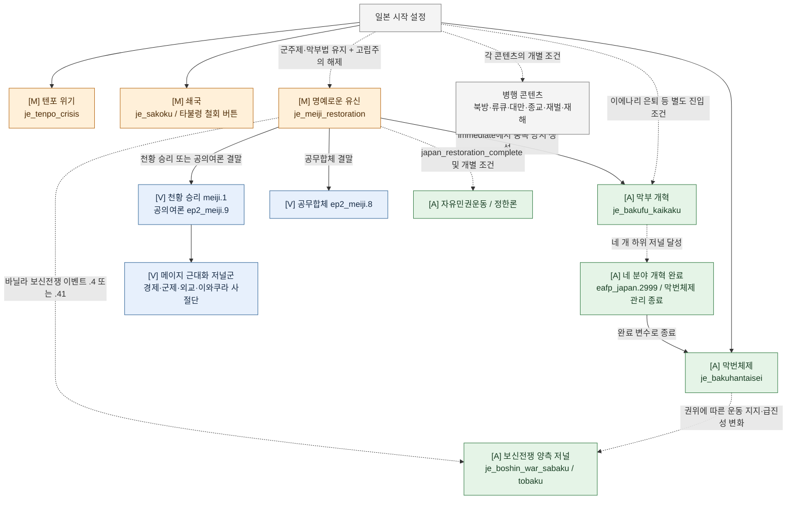

막부 개혁은 명예로운 유신과 **병행하는 별도 경로**다. 현재 `eafp_japan.2999`는 공무합체·공의여론을 자동 선택하거나 메이지 근대화 저널을 생성하지 않는다. 개혁 완료는 `bakufu_kaikaku_complete_var`를 설정하고, 막번체제 저널의 지역·보직 관리 종료로 이어진다. 공무합체 결말 `ep2_meiji.8`에도 근대화 저널군 생성 호출은 없다.

---

<a id="regional-governance"></a>

## 막번체제와 주별 통치

`je_bakuhantaisei`는 막부 권위, 각 주의 충성도·독립성, 막부 인사와 임무를 관리한다. 주마다 별도 저널을 만들지 않으며, 일본의 막부법과 막번체제 저널이 활성화된 동안 지역 계산을 수행한다. 개혁 완료 또는 막부법 상실로 저널이 종료되면 지역 변화요인·보직·등용 대기 요청을 정리한다.

### 막부 권위

막부 권위의 자연 감쇠는 매월 -20이다. 엄격한 지위 질서는 월간 +5, 해이한 지위 질서는 월간 -5를 적용한다. 사건과 국가 변화요인도 권위를 조절하며, 권위는 정치운동의 지지·급진성과 막부 인사 임명 시 쇼군 영향력 보정에 사용된다.

### 주별 저장값과 초기값

충성도 `L`과 독립성 `I`는 국가 범위의 `eafp_japan_loyalty_<STATE>`·`eafp_japan_independency_<STATE>`에 각각 저장하는 0~100 값이다. 다이묘의 개인 충성도와 구분되며, 초기화 표식이 없는 주에만 초기값을 부여한다.

| 주 | 충성도 L | 독립성 I |
| --- | ---: | ---: |
| 에조치 `HOKKAIDO` | 65 | 25 |
| 도호쿠 `TOHOKU` | 77.5 | 22.5 |
| 간토 `KANTO` | 92.5 | 7.5 |
| 호쿠신에쓰 `HOKUSHINETSU` | 75 | 25 |
| 도카이 `TOKAI` | 75 | 25 |
| 교토 `KYOTO` | 83.5 | 16.5 |
| 간사이 `KANSAI` | 83.5 | 16.5 |
| 주고쿠 `CHUGOKU` | 45.8 | 54.2 |
| 시코쿠 `SHIKOKU` | 67.5 | 32.5 |
| 규슈 `KYUSHU` | 28.8 | 71.2 |

### 다이묘 충성도와의 상호작용

`eafp_japan_refresh_regions = yes`는 현재 통치 상태와 다이묘 충성도를 재평가한다. 이미 초기화된 주의 값을 초기값으로 되돌리지 않으며, 월간 변화량을 즉시 더하는 효과도 아니다. 전체 효과는 재평가를 설명하는 `custom_tooltip` 안에 들어 있다.

1. 기존 지역 충성도 modifier를 제거한 뒤, 해당 주의 살아 있는 다이묘(`has_role_of_type = magnate`·해당 `daimyo_var`)의 충성도 평균 `D`를 계산한다.
2. 이 평균을 `eafp_japan_daimyo_average_loyalty_<STATE>`에 저장하여 주 충성도 drift에 사용한다. 다이묘가 없으면 주 충성도를 대체값으로 사용하여 이 drift를 0으로 둔다.
3. 각 다이묘에게 `(L - D) × 0.75`만큼의 충성도 보정을 14일간 적용한다. 기존 보정을 제거한 뒤 계산하므로 갱신마다 배율이 누적되지 않는다.

현재 코드의 보정 계수는 `0.75`이며, drift용 평균은 이 보정을 부여하기 전에 측정한 값이다. 다른 변화요인이 없을 때 주 충성도와 이 평균이 같으면 drift와 개인 보정이 모두 0이 된다.

### 월간 변화량

```text
주 충성도 변화 = (D - L) / 100
                + 충성파 비율 - 급진파 비율
                + 주 충성도 월간 modifier 합계
                + AI 보정(0.1, 플레이어는 0)

주 독립성 변화 = (50 - L) / 200 + (50 - I) / 200
                + 해당 주 GDP / 국가 GDP
                + 징세역량 부족 비율 / 2
                + 주 독립성 월간 modifier 합계
```

인구 비율과 GDP 비중은 0~1로 계산한다. 징세역량 부족 비율은 `(사용량 - 역량) / 사용량`을 0~1로 제한한 값이며, 사용량이 0이면 0이다. 국가 GDP가 0이면 GDP 항도 0이다. 계산 후 충성도·독립성은 0~100 범위로 제한한다.

`add_bakuhantaisei_state_loyalty`와 `add_bakuhantaisei_state_independency`는 사건의 즉시 변화에 사용한다. 월간 효과는 각각 `state_bakuhantaisei_loyalty_progress_bar_monthly_add`와 `state_bakuhantaisei_independency_progress_bar_monthly_add`로 합산한다.

### 바닐라 다이묘 충성도 캐시

막번체제가 활성화되어 있으면 주의 `cached_daimyo_loyalty`에 EAFP의 주 충성도를 저장한다. 바닐라에서 이 캐시를 읽는 판정도 같은 주 충성도를 사용한다. 캐시 갱신은 주 충성도의 저장값 자체를 다이묘 평균으로 바꾸지 않는다.

막번체제가 비활성일 때 `vanilla_daimyo_loyalty_calc`는 해당 주의 살아 있는 다이묘 충성도를 평균하여 반환한다. 이 평균 계산과, 활성 상태에서 주 충성도를 향하게 하는 개인 보정은 별도 처리다.

### 주 변화요인과 임무

`eafp_japan_regional_autonomy`는 독립성을 배율로 삼아 아래 네 효과를 함께 부여한다. `eafp_japan_regional_loyalty`는 충성도에 따라 두 정치운동의 지지를 조절한다.

| 변화요인 | modifier type | 계산값 |
| --- | --- | --- |
| 번의 자치권 | 세금 낭비 | `0.25 × I / 100` |
| 번의 자치권 | 최대 징병 한도 | `-50 × I / 100` |
| 번의 자치권 | 팝 정치력 | `-0.5 × I / 100` |
| 번의 자치권 | 인구에 따른 행정력 비용 | `-0.5 × I / 100` |
| 번의 충성 | 도쿠가와 충성파 지지 | `(L - 50) / 100` |
| 번의 충성 | 유신파 지지 | `(50 - L) / 100` |

표의 소수는 내부 modifier 값이다. 백분율형 효과의 `0.25`는 +25%이며, 최대 징병 한도의 `-50`은 주에서 모집할 수 있는 징집 대대 수의 감소다.

- **다이묘 영지 감독** `eafp_japan.11`: 대상 주에 월간 독립성 -0.5 변화요인을 적용한다.
- **다이묘 충성심 재확인** `eafp_japan.12`: 대상 주에 월간 충성도 +0.5 변화요인을 적용한다.
- **세키가하라의 유산**: 규슈에 배율 0.4, 주고쿠에 0.2를 부여하여 각각 월간 충성도 -0.4·-0.2를 적용한다.
- **막부의 비호**: 에조치에 월간 충성도 +0.4를 적용한다. 저널 종료 시 세키가하라의 유산과 함께 제거한다.

다이묘 이해집단의 지역 지지도 보정은 활성 주마다 `(L - 50) / 50 × (100 - I) / 100`을 구한 뒤 평균하여 3을 곱한다. 충성도가 높고 독립성이 낮은 주일수록 지지도에 더 크게 기여한다.

임무의 국가 비용과 대상 주의 월간 변화는 각각 처리한다. 다른 국가에도 적용되는 류큐 측 경쟁 결과 modifier에는 막부 권위 월간 효과를 넣지 않는다.

### 번과 다이묘 위젯

막번체제와 명예로운 유신 저널이 같은 위젯을 사용한다. 전체 목록은 접을 수 있으며, 각 주는 제목·내용으로 구분한다. 제목의 주 이름은 주 화면으로 이동하는 버튼과 주 툴팁을 제공하고, 오른쪽 modifier 아이콘은 해당 주의 효과 내역을 보여 준다.

내용에는 충성도·독립성 progress bar와 그 아래 어두운 다이묘 목록 영역을 둔다. 한 주에 여러 다이묘를 나열할 수 있으며, 각 초상화에 충성도 기호와 번 이름을 표시한다. 에조치도 두 progress bar를 모두 사용한다.

막대의 월간 변화 툴팁은 `PROGRESS_BAR_BREAKDOWN`·`PROGRESS_BAR_BREAKDOWN_NEGATIVE` 양식을 따른다. modifier 내역은 하나의 텍스트에 모으고, 수치 부분의 `#tooltippable;tooltip:`에서 `GetScriptValueDesc` 계산 내역을 표시한다.

### 연결 흐름

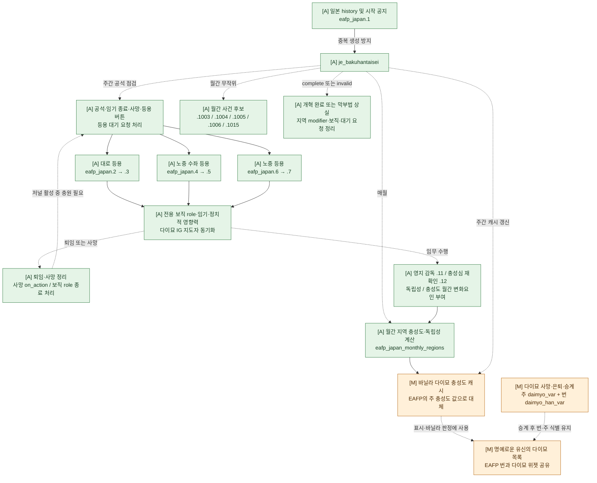

---

<a id="han-identity"></a>

## 번과 다이묘

### 주 위치와 번 식별자

```text
set_variable = { name = daimyo_var value = s:STATE_KYOTO }
set_variable = { name = daimyo_han_var value = flag:hikone }
```

- `daimyo_var`: 영지가 속한 주 지역 스코프. 주별 GUI 목록, 충성도 캐시, 주 변화요인, 소유 국가 판정에 사용한다.
- `daimyo_han_var`: 번 식별용 flag. 번 이름, 특정 번주 선택, 번별 후임 생성에 사용한다.
- `has_variable = daimyo_var`: 기존의 다이묘 신분 판정이므로 유지한다.
- 다이묘 지위를 해제하는 `character_clear_daimyo_status`는 두 변수를 모두 제거한다.

### 기본 10개 번

기본 10개 번은 다음 주와 번 식별자를 사용한다. 막부 직위만 가진 인물에게 다이묘 신분을 새로 부여하지 않는다.

| 번 | flag | 기본 주 |
|---|---|---|
| 사쓰마 | satsuma | KYUSHU |
| 미토 | mito | KANTO |
| 조슈 | choshu | CHUGOKU |
| 도쿠시마 | tokushima | SHIKOKU |
| 기슈 | kishu | KANSAI |
| 오와리 | owari | TOKAI |
| 히코네 | hikone | KYOTO |
| 가가 | kaga | HOKUSHINETSU |
| 센다이 | sendai | TOHOKU |
| 마쓰마에 | matsumae | HOKKAIDO |

### 번을 기준으로 선택하는 대상

- `japan_domain_by_character`: 인물의 번 이름. EAFP 초상화 위 번 이름도 이 정의를 사용한다.
- `JAP_character_generate_new_daimyo`: 사망·쇼군 취임 등으로 공석이 된 번의 후임 생성 경로 선택.
- `JAP_state_generate_new_daimyo`, `japan_replace_missing_daimyo`: 내전 후 복구 시 해당 번의 생존 번주 유무 확인. 같은 주에 다른 번주가 있어도 복구를 막지 않는다.
- 대로 등용의 기존 이이 가문 후보 선택: 교토 소재 여부 대신 히코네번 여부 확인.
- `ep2_meiji.52`, `ep2_meiji_pulse.3`: 조슈 번주 선택.
- 나마무기 사건의 번주 선택: 내륙의 히코네번만 제외한다. 교토 주의 다른 번까지 제외하지 않는다.
- `ezo_republic.2`: 마쓰마에 번주의 자동 망명 대상 판정.
- `evaluate_matsumae_curse`: 바닐라 월간 on_action이 선택한 에조치 인물의 소유 국가에서 마쓰마에 번주를 다시 선택한다. 같은 주의 다른 번주가 사망 확률 판정을 대신 소모하지 않는다. 기존 역사 인물·연도·확률 조건은 유지한다.

### 주를 기준으로 처리하는 대상

- 주별 다이묘 목록과 충성도 캐시, 주 변화요인·급진파·충성파 효과.
- 지진 피해 지역, 나마무기 사건의 실제 영지·피해 주 선택, 신선조가 활동하는 교토의 지역 대상.
- 내전에서 영지 소유 국가에 따른 인물 이전, 사망 시 소유 영지 존재 확인.
- 월간 on_action의 에조치·간사이 진입 조건. 실제 마쓰마에 대상은 새 효과에서 번으로 선택하고, 기슈의 조기 사망 대상은 기존 역사 인물 템플릿으로 한정되어 있다.
- 일반 다이묘 여부를 확인하는 상호작용·정치 운동·의복·정당 GUI 조건.
- `japan_domain_by_state`: 특정 인물의 소속이 아닌 주의 대표 번을 표시하는 바닐라 문구.

### 번을 추가할 때

1. 해당 인물의 생성 경로마다 주 지역과 새 번 flag를 모두 설정한다.
2. `japan_domain_by_character`에 flag와 `domain_번이름` 현지화의 대응을 추가한다.
3. 번별 후임 생성 효과와 `JAP_character_generate_new_daimyo`의 flag 분기를 추가한다. 역사 승계 순번을 사용한다면 다른 번과 공유하지 않는 변수를 사용한다. 기존 10개 번의 바닐라 승계 순번은 각 생성 효과에 고정된 서로 다른 주 지역에 저장되어 있다.
4. `JAP_state_generate_new_daimyo`에 해당 주·번의 공석 확인과 생성 분기를 추가한다. 같은 주에 분기를 여러 개 두어도 번주 존재 확인은 flag별로 이루어진다.

<a id="additional-daimyos"></a>

### 추가 10개 번의 인물·이념·승계

1836년 재임 번주 10명과 이후 역사 인물 22명, 총 32개 character_template을 추가했다. 시작 인물만 국가 역사에서 생성하며, 나머지는 해당 번의 승계가 발생할 때 생성한다. 기존 10개 번과 합쳐 20개 번을 개별 식별한다.

#### 번 배치와 신분

| 번 | 가문 | 게임 주 | 분류 | 1836년 번주 |
|---|---|---|---|---|
| 구마모토 | 호소카와 | KYUSHU | 도자마 | 나리모리 |
| 사가 | 나베시마 | KYUSHU | 도자마 | 나오마사 |
| 후쿠오카 | 구로다 | KYUSHU | 도자마 | 나가히로 |
| 오카야마 | 이케다 | CHUGOKU | 도자마 | 나리토시 |
| 히로시마 | 아사노 | CHUGOKU | 도자마 | 나리타카 |
| 돗토리 | 이케다 | CHUGOKU | 도자마 | 나리미치 |
| 후쿠이 | 마쓰다이라 | HOKUSHINETSU | 신판 | 나리사와 |
| 쓰 | 도도 | TOKAI | 도자마 | 다카유키 |
| 구보타 | 사타케 | TOHOKU | 도자마 | 요시히로 |
| 토사 | 야마우치 | SHIKOKU | 도자마 | 도요스케 |

주 배치는 게임의 큰 주 구획에 대응시킨 것이다. 바닐라 `dynamic_state_and_hub_names_l_english.yml`의 쓰 거점은 `STATE_TOKAI`, 후쿠이 거점은 `STATE_HOKUSHINETSU`에 속한다. 돗토리 이케다가는 도쿠가와가와 가까운 대우를 받았지만 도자마로 분류했다. 쓰번 도도가는 도자마이면서 준후다이 대우를 받은 사례로, 이 구현은 출신 구분인 도자마를 사용한다. 준후다이 지위를 별도 후다이 변화요인과 중복 적용하지 않는다. 이 특수성은 [국립국회도서관의 도도가 연구 서지](https://ndlsearch.ndl.go.jp/books/R000000004-I8799055)에서도 확인할 수 있다.

#### 인물 목록과 조사 자료

출생일은 양력으로 맞췄다. 재임 연도는 조사용 자료이며 게임에서 강제 퇴임시키는 날짜가 아니다. 1869년 이후의 표기는 지번사 재임을 포함한다. 호소카와 모리히사와 도도 다카키요는 에도시대 번주가 아니라 이후 지번사인 가문 계승자이므로 이를 별도로 표시했다.

| 번 | 인물 (전기) | 출생일 | 재임 |
|---|---|---|---|
| 구마모토 | [호소카와 나리모리 / 細川斉護](https://ja.wikipedia.org/wiki/細川斉護) | 1804.10.19 | 1826–1860 |
| 구마모토 | [호소카와 요시쿠니 / 細川韶邦](https://ja.wikipedia.org/wiki/細川韶邦) | 1835.7.23 | 1860–1870 |
| 구마모토 | [호소카와 모리히사 / 細川護久](https://ja.wikipedia.org/wiki/細川護久) | 1839.4.14 | 1870–1871 (知藩事) |
| 사가 | [나베시마 나오마사 / 鍋島直正](https://ja.wikipedia.org/wiki/鍋島直正) | 1815.1.16 | 1830–1861 |
| 사가 | [나베시마 나오히로 / 鍋島直大](https://ja.wikipedia.org/wiki/鍋島直大) | 1846.10.17 | 1861–1871 |
| 후쿠오카 | [쿠로다 나가히로 / 黒田長溥](https://ja.wikipedia.org/wiki/黒田長溥) | 1811.4.23 | 1834–1869 |
| 후쿠오카 | [쿠로다 나가토모 / 黒田長知](https://ja.wikipedia.org/wiki/黒田長知) | 1839.2.2 | 1869–1871 |
| 오카야마 | [이케다 나리토시 / 池田斉敏](https://ja.wikipedia.org/wiki/池田斉敏) | 1811.5.29 | 1829–1842 |
| 오카야마 | [이케다 요시마사 / 池田慶政](https://ja.wikipedia.org/wiki/池田慶政) | 1823.8.10 | 1842–1863 |
| 오카야마 | [이케다 모치마사 / 池田茂政](https://ja.wikipedia.org/wiki/池田茂政) | 1839.11.16 | 1863–1868 |
| 오카야마 | [이케다 아키마사 / 池田章政](https://ja.wikipedia.org/wiki/池田章政) | 1836.6.16 | 1868–1871 |
| 히로시마 | [아사노 나리타카 / 浅野斉粛](https://ja.wikipedia.org/wiki/浅野斉粛) | 1817.11.7 | 1830–1858 |
| 히로시마 | [아사노 요시테루 / 浅野慶熾](https://ja.wikipedia.org/wiki/浅野慶熾) | 1836.12.19 | 1858 |
| 히로시마 | [아사노 나가미치 / 浅野長訓](https://ja.wikipedia.org/wiki/浅野長訓) | 1812.9.4 | 1858–1869 |
| 히로시마 | [아사노 나가코토 / 浅野長勲](https://ja.wikipedia.org/wiki/浅野長勲) | 1842.8.28 | 1869–1871 |
| 돗토리 | [이케다 나리미치 / 池田斉訓](https://ja.wikipedia.org/wiki/池田斉訓) | 1820.9.2 | 1830–1841 |
| 돗토리 | [이케다 요시유키 / 池田慶行](https://ja.wikipedia.org/wiki/池田慶行) | 1832.5.24 | 1841–1848 |
| 돗토리 | [이케다 요시타카 / 池田慶栄](https://ja.wikipedia.org/wiki/池田慶栄) | 1834.5.1 | 1848–1850 |
| 돗토리 | [이케다 요시노리 / 池田慶徳](https://ja.wikipedia.org/wiki/池田慶徳) | 1837.8.13 | 1850–1871 |
| 후쿠이 | [마츠다이라 나리사와 / 松平斉善](https://ja.wikipedia.org/wiki/松平斉善) | 1820.10.30 | 1835–1838 |
| 후쿠이 | [마츠다이라 요시나가 / 松平慶永](https://ja.wikipedia.org/wiki/松平慶永) | 1828.10.10 | 1838–1858 |
| 후쿠이 | [마츠다이라 모치아키 / 松平茂昭](https://ja.wikipedia.org/wiki/松平茂昭) | 1836.9.17 | 1858–1871 |
| 쓰 | [도도 다카유키 / 藤堂高猷](https://ja.wikipedia.org/wiki/藤堂高猷) | 1813.3.11 | 1825–1871 |
| 쓰 | [도도 다카키요 / 藤堂高潔](https://ja.wikipedia.org/wiki/藤堂高潔) | 1837.10.19 | 1871 (知藩事) |
| 구보타 | [사타케 요시히로 / 佐竹義厚](https://ja.wikipedia.org/wiki/佐竹義厚) | 1812.8.23 | 1815–1846 |
| 구보타 | [사타케 요시치카 / 佐竹義睦](https://ja.wikipedia.org/wiki/佐竹義睦) | 1839.7.2 | 1846–1857 |
| 구보타 | [사타케 요시타카 / 佐竹義堯](https://ja.wikipedia.org/wiki/佐竹義堯) | 1825.9.9 | 1857–1871 |
| 토사 | [야마우치 도요스케 / 山内豊資](https://ja.wikipedia.org/wiki/山内豊資) | 1794.11.9 | 1809–1843 |
| 토사 | [야마우치 도요테루 / 山内豊熈](https://ja.wikipedia.org/wiki/山内豊熈) | 1815.4.8 | 1843–1848 |
| 토사 | [야마우치 도요아쓰 / 山内豊惇](https://ja.wikipedia.org/wiki/山内豊惇) | 1824.7.2 | 1848 |
| 토사 | [야마우치 도요시게 / 山内豊信](https://ja.wikipedia.org/wiki/山内豊信) | 1827.11.27 | 1848–1859 |
| 토사 | [야마우치 도요노리 / 山内豊範](https://ja.wikipedia.org/wiki/山内豊範) | 1846.5.10 | 1859–1871 |

연속된 번주 목록과 행적 확인에는 다음 박물관·지역 자료를 함께 사용했다. 개별 출생일은 위 인물별 전기와 대조했다.

- 구마모토: [문화유산 온라인의 호소카와가 묘소 자료](https://online.bunka.go.jp/heritages/detail/162588).
- 사가: [나베시마 보효회 나오마사 소개](https://www.nabeshima.or.jp/main/40.html), [아시아역사자료센터 나오히로 인물사전](https://www.jacar.go.jp/dictionary/02_item.html?id=00001038).
- 후쿠오카: [구로다가 역대 당주](https://toukoukai-kuroda.com/master/), [후쿠오카시박물관 나가히로 자료](https://museum.city.fukuoka.jp/archives/leaflet/479/index02.html).
- 오카야마: [오카야마성 역대 성주](https://okayama-castle.jp/learn-castlelords/), [하야시바라미술관 막말 이케다가 전시](https://www.hayashibara-museumofart.jp/data/199/exhibition_tpl/).
- 히로시마: [히로시마성 역대 성주](https://hiroshimacastle.jp/history/lord-of-castle), [국립국회도서관 아사노 나가코토](https://www.ndl.go.jp/portrait/datas/524).
- 돗토리: [돗토리현 이케다 요시노리](https://www.pref.tottori.lg.jp/82541.htm), [돗토리시역사박물관 요시유키 자료](https://www.tbz.or.jp/yamabikokan/yamabiko/10348/).
- 후쿠이: [후쿠이현 문서관 마쓰다이라가 자료](https://www.library-archives.pref.fukui.lg.jp/bunsho/category/usage/22268.html).
- 쓰: [도도 다카유키 인물사전](https://kotobank.jp/word/藤堂高猷-19061). 사전의 음력 생일과 게임에서 사용하는 양력 생일을 구분했다.
- 구보타: [사타케 요시히로](https://en.wikipedia.org/wiki/Satake_Yoshihiro), [요시치카](https://en.wikipedia.org/wiki/Satake_Yoshichika), [요시타카](https://en.wikipedia.org/wiki/Satake_Yoshitaka) 전기에서 출생일과 계승 순서를 확인했다.
- 토사: [고치성역사박물관 야마우치가 번주 소개](https://www.kochi-johaku.jp/column/3819/), [국립국회도서관 야마우치 도요시게](https://www.ndl.go.jp/portrait/datas/206).

#### 이념·이해집단·특성

인물별 이념 판단과 출처는 생성 원본 `tools/data/japan_additional_daimyos.json`의 `ideology_rationale`, `ideology_sources`에도 기록한다. 중신이 주도한 번정의 정책 역시 배정 근거로 삼는다.

배정은 사료에 적힌 행동과 재임기의 실제 번정 정책을 게임 이념의 법률 선호로 대응한 해석이다. 번주가 중신에게 정무를 맡긴 경우에는 그 중신·실무진이 시행한 정책을 번주의 게임 이념으로 대표시킨다. 직접 친정하지 않았다는 이유만으로 중도파를 부여하지 않는다. 이념 배정은 당사자들의 자기 규정이 아니며, 정적 템플릿의 특성상 재임 중·후반기의 대표 정책도 반영한다. 1836년에 후대의 모든 정책을 이미 주장했다는 뜻은 아니다. 원문 문서의 공개 번각·발췌와 이를 분석한 대학·공공기관 자료를 우선했으며, 모든 고문서 원본을 직접 판독한 것은 아니다.

- 서양 기술·개국·산업 진흥은 `ideology_modernizer_leader`, 신분·직업 제한 완화는 `ideology_reformer`로 구별한다.
- `ideology_protectionist`는 번 주도 경제 진흥을 표현하는 근사치다. 관세 정책 전체가 사료로 입증되었다는 뜻은 아니다.
- `ideology_jingoist_leader`는 해방·군비 확충을 표현한다. 이 이념에 묶인 식민지 선호까지 해당 인물의 실제 주장으로 간주하지 않는다.
- `ideology_royalist`는 조정·군주 중심 정부를 지지한 행적에 대응한다. 게임의 왕당파 이념 자체에는 천황과 쇼군을 구별하는 기능이 없다. 배외주의가 확인되지 않은 존왕 인물에게 `ideology_shojoi`를 일괄 부여하지 않는다.
- 정책 근거가 부족한 인물의 기존 배정은 유지하고 그 한계를 표에 적었다. 중도파 유지는 실제 중립 사상이 입증되었다는 뜻이 아니다.
- EAFP 파벌 판정은 계속 에도 지위 질서에 대한 법률 선호를 따른다. 이념을 다양화해도 그 법률에 특별한 선호가 없는 왕당파·권위주의자·보호주의자 등은 게임의 파벌 판정에서 중도파가 될 수 있다. 역사 속 후계 지지 파벌과 게임 이념을 강제로 일치시키지 않는다.

| 번 | 인물 | 적용 이념 | 판단 근거와 확인 자료 |
| --- | --- | --- | --- |
| 구마모토 | 호소카와 나리모리 | `ideology_authoritarian` | 실학파의 결당을 경계하고 배제를 추진한 기록을 반영한다. 번주 권한과 정치적 통제를 중시하는 권위주의자로 해석한다. [구마모토대학 영청문고연구센터 연보 16호, 「横井小楠の人脈と思想形成過程」, 50–51쪽](https://eisei.kumamoto-u.ac.jp/docs/16%E5%8F%B7.pdf) |
| 구마모토 | 호소카와 요시쿠니 | `ideology_traditionalist` | 전통주의로 배정한다. 확인한 정책 자료만으로 다른 강한 이념을 부여할 근거는 충분하지 않다. [인물 전기](https://ja.wikipedia.org/wiki/細川韶邦); 정책 재분류 근거 부족 |
| 구마모토 | 호소카와 모리히사 | `ideology_modernizer_leader` | 실학파 중심 개혁과 서양식 교육 도입을 반영한다. 일반적인 권리 확대보다 교육·기술의 근대화를 우선한다. [구마모토대학, 구마모토 양학교 개교 당시 서간 소개](https://www.kumamoto-u.ac.jp/daigakujouhou/kouhou/pressrelease/2021-file/release211019-1.pdf) |
| 사가 | 나베시마 나오마사 | `ideology_bakufu_reformer` | 기술·산업·번정 쇄신을 막부 체제 안에서 추진한 행적을 막부개혁가로 표현한다. [사가성혼마루역사관, 막말·유신기 사가](https://saga-museum.jp/sagajou/about/ishin.html) |
| 사가 | 나베시마 나오히로 | `ideology_royalist` | 신정부의 진무 명령을 받고 관군 측에 참여한 행적을 군주 중심 국가에 대한 지지로 해석한다. [사가대학 도서관보 42호, 소장 「行政官達（戊辰軍功賞典につき）」 해설](https://www.lib.saga-u.ac.jp/assets/pdf/about/public/hikarino/hikarino42.pdf) |
| 후쿠오카 | 쿠로다 나가히로 | `ideology_bakufu_reformer` | 기술·산업·번정 쇄신을 막부 체제 안에서 추진한 행적을 막부개혁가로 표현한다. [후쿠오카시박물관, 구로다 나가히로 전시](https://museum.city.fukuoka.jp/sp/exhibition/508/) |
| 후쿠오카 | 쿠로다 나가토모 | `ideology_bakufu_reformer` | 공무합체 노선에서 번주 대리로 직접 활동한 기록을 반영한다. 조정·막부·유력 번의 협력을 통한 체제 조정을 막부개혁가로 해석하며, 양부의 서양 기술 선호를 그대로 물려주지는 않는다. [후쿠오카시박물관, 「福岡藩主の絵画と書跡・文芸」](https://museum.city.fukuoka.jp/archives/leaflet/479/index02.html) |
| 오카야마 | 이케다 나리토시 | `ideology_moderate` | 재임기 중신이 집행한 구체적 정책 노선의 근거가 충분하지 않아 중도파를 유지한다. 후임 요시마사 때의 존양·긴축 노선을 소급하지 않는다. [인물 전기](https://ja.wikipedia.org/wiki/池田斉敏); 정책 재분류 근거 부족 |
| 오카야마 | 이케다 요시마사 | `ideology_shojoi` | 페리 내항 후 개국에 부정적인 견해를 제시하고 막부의 하문에 존양 방침으로 답한 기록을 반영한다. [오카야마대학·오카야마시티뮤지엄, 「幕末維新期の池田家」 도록, 1·19쪽](https://www.lib.okayama-u.ac.jp/ikeda/pdf/r7.pdf) |
| 오카야마 | 이케다 모치마사 | `ideology_mitogaku` | 미토가 출신이며 존양론의 고조 속에서 입양·취임하고 국사 주선에 참여했다. 기존 미토학 배정을 유지한다. [오카야마대학·오카야마시티뮤지엄, 「幕末維新期の池田家」 도록, 1·19쪽](https://www.lib.okayama-u.ac.jp/ikeda/pdf/r7.pdf) |
| 오카야마 | 이케다 아키마사 | `ideology_royalist` | 요시노부 추토 칙명 후 모치마사를 대신해 계승한 경위와 관군 참여를 반영한다. 이를 자유주의 개혁 전반으로 확대하지 않는다. [오카야마대학·오카야마시티뮤지엄, 「幕末維新期の池田家」 도록, 1·19쪽](https://www.lib.okayama-u.ac.jp/ikeda/pdf/r7.pdf) |
| 히로시마 | 아사노 나리타카 | `ideology_protectionist` | 세키 구란도·이마나카 스케치카가 실권을 가진 번정의 목면·모시 전매, 육회법 등 상업·금융 통제 정책을 반영한다. 중신 주도의 번정 노선을 대표하는 보호주의 배정이며, 자유방임이나 개인의 근대적 관세론을 뜻하지 않는다. [히로시마성, 역대 성주와 나리타카 재임기의 중신 정치](https://hiroshimacastle.jp/history/lord-of-castle) |
| 히로시마 | 아사노 요시테루 | `ideology_moderate` | 개혁파와의 교류와 취임에 대한 기대는 확인되지만, 짧은 재임 중 어느 중신 집단이 어떤 개혁을 집행했는지는 충분히 확인되지 않았다. 나가미치 때의 쓰지 쇼소 등용과 실제 개혁을 소급하지 않아 중도파를 유지한다. [히로시마시립도서관, 아사노가 역대 당주 전시 패널](https://www.library.city.hiroshima.jp/news/docs/2019asanoshi_panel_rekidai.pdf) |
| 히로시마 | 아사노 나가미치 | `ideology_bakufu_reformer` | 기술·산업·번정 쇄신을 막부 체제 안에서 추진한 행적을 막부개혁가로 표현한다. [히로시마시립도서관, 아사노가 역대 당주 전시 패널](https://www.library.city.hiroshima.jp/news/docs/2019asanoshi_panel_rekidai.pdf) |
| 히로시마 | 아사노 나가코토 | `ideology_royalist` | 폐번치현 당시 유시에서 조정 명령 준수를 요구한 기록을 반영한다. 군주 중심 중앙정부 수용을 나타내는 왕당파로 배정한다. [히로시마성, 아사노 나가코토의 폐번치현 당시 「御諭書」 해설·번각](https://www.mogurin.or.jp/museum/hwm/details/tenzi06/1/t06_1_g3_dai02.html) |
| 돗토리 | 이케다 나리미치 | `ideology_protectionist` | 덴포기에도 확인되는 번의 철 생산·유통 통제와 산원체역을 통한 집하·판매 운영을 반영한다. 특정 가로 개인의 사상보다 재임기 번정 실무의 경제 노선을 대표하는 보호주의 배정이다. [일본국제문제연구소 조사보고, 근도가 문서·융통회소 기록을 인용한 철 유통 해설](https://www.jiia.or.jp/jic/2022/01/1.pdf) |
| 돗토리 | 이케다 요시유키 | `ideology_moderate` | 재임기 중신의 구체적 집행 노선을 충분히 확인하지 못해 중도파를 유지한다. 어린 번주라는 이유만으로 배정을 보류한 것은 아니며, 후대 요시노리 시기의 미토학·군제 개혁을 소급하지 않는다. [돗토리현, 이케다 요시유키](https://www.pref.tottori.lg.jp/82539.htm) |
| 돗토리 | 이케다 요시타카 | `ideology_moderate` | 1848–1850년의 실권 중신과 집행 정책을 충분히 특정하지 못해 중도파를 유지한다. 앞선 덴포기 자료만으로 같은 정책의 계속 시행을 단정하지 않는다. [인물 전기](https://ja.wikipedia.org/wiki/池田慶栄); 정책 재분류 근거 부족 |
| 돗토리 | 이케다 요시노리 | `ideology_mitogaku` | 나리아키에게 직접 배웠고 미토의 덴포 개혁을 본보기로 삼은 번정 개혁이 확인되어 미토학을 유지한다. [돗토리현, 이케다 요시노리](https://www.pref.tottori.lg.jp/82541.htm) |
| 후쿠이 | 마츠다이라 나리사와 | `ideology_traditionalist` | 선대부터 실권을 가졌으며 1840년에야 실각한 마쓰다이라 슈메 등 수구파 중신의 번정을 반영한다. 나리사와 재임기의 구체제 유지 노선을 전통주의로 해석하고, 요시나가 때 오카베·아마카타·나카네가 추진한 개혁은 소급하지 않는다. [후쿠이현사, 「改革の始動」](https://www.library-archives.pref.fukui.lg.jp/fukui/07/kenshi/T4/T4-6-01-01-01-02.htm) |
| 후쿠이 | 마츠다이라 요시나가 | `ideology_modernizer_leader` | 요코이 쇼난 등 개혁 인재 등용과 적극적 개국론으로의 전환을 반영한다. 도쿠가와가 옹호와 근대화 정책은 구분한다. [국립국회도서관, 마쓰다이라 요시나가](https://www.ndl.go.jp/portrait/datas/195) |
| 후쿠이 | 마츠다이라 모치아키 | `ideology_reformer` | 사족의 농공상 종사와 직업 제한 완화, 신분에 구애받지 않는 인재 등용을 건의한 점을 반영한다. 단순한 군사 기술 개량보다 사회제도 개혁에 가깝다. [후쿠이현사 통사편 5, 모치아키의 신분·직업 개혁 건의](https://www.library-archives.pref.fukui.lg.jp/fukui/07/kenshi/T5/T5-0a1-02-01-03-03.htm) |
| 쓰 | 도도 다카유키 | `ideology_jingoist_leader` | 해안 방비의 직접 점검, 포대·대포 정비를 반영해 군비 확충 성향을 배정한다. 정복전쟁·식민주의까지 사료로 확인했다는 뜻은 아니다. [미에현사, 「長官日記」 등 막말 해방 자료 해설](https://www.bunka.pref.mie.lg.jp/rekishi/kenshi/asp/shijyo/detail597.html) |
| 쓰 | 도도 다카키요 | `ideology_moderate` | 기념비에서 확인되는 번의 토지 매매 규정과 재임기 실무진의 구체적 정책 결정을 구분한다. 짧은 지번사 재임기의 집행 노선을 충분히 특정하지 못해 중도파를 유지한다. [욧카이치시 미에지구 마을만들기추진위원회, 도도 다카키요 기념비](https://mie-ru.org/history_and_culture/31-todotakakiyonohi/) |
| 구보타 | 사타케 요시히로 | `ideology_protectionist` | 양잠 등 번 주도의 산업 진흥을 반영해 보호주의자로 해석한다. 자유무역이나 자유방임을 지지했다는 의미는 아니다. [아키타시, 사타케가 역대 번주 해설](https://www.city.akita.akita.jp/city/pl/pb/koho/htm/20251003/100306.html) |
| 구보타 | 사타케 요시치카 | `ideology_jingoist_leader` | 외국 선박에 대비한 쓰치자키·아라야 포대 설치를 군비 확충 성향으로 해석한다. 어린 번주 개인의 사상보다 재임기 정책에 근거한 제한적인 배정이다. [아키타시, 사타케가 역대 번주 해설](https://www.city.akita.akita.jp/city/pl/pb/koho/htm/20251003/100306.html) |
| 구보타 | 사타케 요시타카 | `ideology_royalist` | 보신전쟁에서 신정부 측을 선택한 행적을 반영한다. 존왕과 배외적 쇄국 지지를 구별한다. [아키타시, 사타케가 역대 번주 해설](https://www.city.akita.akita.jp/city/pl/pb/koho/htm/20251003/100306.html) |
| 토사 | 야마우치 도요스케 | `ideology_traditionalist` | 기존 질서 아래 전매 통제를 강화했고, 후계자의 개혁 인사들이 기존 가신들의 반발과 그에게 한 호소로 실각한 점을 반영해 유지한다. [고치성역사박물관, 토사번 역대 번주](https://www.kochi-johaku.jp/column/3819/) |
| 토사 | 야마우치 도요테루 | `ideology_protectionist` | 절약·재정 쇄신과 신진 실무 관료 등용을 번 주도의 경제 개혁으로 해석한다. 구체적 관세율 주장까지 입증된 것은 아니다. [고치성역사박물관, 토사번 역대 번주](https://www.kochi-johaku.jp/column/3819/) |
| 토사 | 야마우치 도요아쓰 | `ideology_moderate` | 취임 12일 동안 실제로 집행된 중신 정책이나 전임 개혁 집단의 지속 여부를 충분히 확인하지 못해 중도파를 유지한다. 짧은 재임 자체를 이념 배정의 배제 기준으로 삼지는 않는다. [고치성역사박물관, 토사번 역대 번주](https://www.kochi-johaku.jp/column/3819/) |
| 토사 | 야마우치 도요시게 | `ideology_bakufu_reformer` | 재정·해방·교육 개혁과 공무합체, 대정봉환 및 도쿠가와가 옹호를 함께 반영해 막부개혁가를 유지한다. [고치성역사박물관, 토사번 역대 번주](https://www.kochi-johaku.jp/column/3819/) |
| 토사 | 야마우치 도요노리 | `ideology_royalist` | 관군 파병과 판적봉환 참여를 반영해 왕당파로 배정한다. 후일 사업·교육 활동만으로 재임기 모든 자유주의 법률 선호를 부여하지 않는다. [고치성역사박물관, 토사번 역대 번주](https://www.kochi-johaku.jp/column/3819/) |

특성은 혁신적·꼼꼼함·신중함·정치적 수완 등을 1~2개 부여했다. 생성일에 만 16세 미만이면 바닐라 방식의 `trait_child` 조건도 적용한다.

#### 추가 번의 역사 승계

번마다 `eafp_daimyo_chain_id_<han>`를 주 지역에 저장한다. 같은 주의 여러 번은 서로 다른 순번을 가지며, 기본 번의 순번과도 공유하지 않는다. 등록은 순번을 앞으로만 진행시킨다.

다음 역사 인물이 이미 사용된 템플릿이면 건너뛴다. 아직 태어나지 않았으면 순번을 소비하지 않고 같은 가문의 무작위 번주를 생성하여 다음 승계 때 다시 확인한다. 역사 인물 목록이 끝나면 같은 가문·번·주·신분의 무작위 후임을 생성한다.

현재 국가가 해당 주를 소유하고 폐번 전역 변수가 설정되지 않은 경우에 생성한다. 바닐라 사망·쇼군 취임·입양의 공용 승계 경로를 사용하며, 역사상 퇴임일에 강제 교체하는 일정은 없다. 게임 중 실제 사망·해임 시점에 따라 역사와 다른 연도에 승계할 수 있다.

#### 인물 데이터 파일과 도구

- `common/character_templates/eafp_japan_additional_daimyo_templates.txt`: 32개 역사 인물.
- `common/scripted_effects/eafp_japan_additional_daimyo_effects.txt`: 등록·번별 역사 승계·무작위 후임.
- `common/history/characters/jap - japan.txt`: 시작 번주 10명.
- `common/scripted_effects/eafp_japan_daimyo_effects.txt`: 승계 및 공석 복구 연결.
- `common/customizable_localization/eafp_japan_daimyo_custom_loc.txt`: 번 flag별 이름.
- `localization/{korean,english,simp_chinese}/eafp_japan_additional_daimyos_l_<language>.yml`: 번 이름 및 새 인명.

동일 로마자·동일 한자는 기존 인명 키를 사용한다. 동일 로마자에 다른 한자이면 빈 숫자 접미사 키를 사용한다. 새 키는 한국어·영어·중국어 간체에 모두 정의한다.

재생성 및 검사:

```powershell
python -B tools/generate_japan_additional_daimyos.py --game 'D:/SteamLibrary/steamapps/common/Victoria 3/game'
python -B tools/validate_japan_daimyo_identity.py --game 'D:/SteamLibrary/steamapps/common/Victoria 3/game'
python -B tools/validate_japan_additional_daimyos.py --game 'D:/SteamLibrary/steamapps/common/Victoria 3/game'
```

검사 도구는 번 식별자, 후임 생성 분기, 역사 인물·현지화 참조와 파일 구조를 확인한다. 게임 엔진에서의 실행·화면 검증은 별도로 필요하다.

---

<a id="bakufu-roles"></a>

## 막부 인사와 임기

### 보직과 인물 역할

| 직위 | 전용 character role | 국가의 재임자 참조 |
| --- | --- | --- |
| 노중 | `character_role_eafp_roju` | `roju_var` 목록, 정원 4명 |
| 노중 수좌 | `character_role_eafp_rojushuza` | `rojushuza_var` |
| 대로 | `character_role_eafp_tairo` | `tairo_var` |

인물의 `eafp_bakufu_office_position`은 현재 직위를 기록한다. 보직 role은 자동 배정하지 않으며, 보직에 임명됐다는 이유만으로 일반 `character_role_politician`을 추가하지 않는다. 시작 템플릿도 이이 나오아키를 제외하면 일반 정치인 role·`type = politician`을 사용하지 않는다.

막번체제가 활성화된 동안 다이묘 이해집단 지도자는 대로를 우선하고, 대로가 없으면 노중 수좌로 맞춘다. 이해집단 지도자 역할에 필요한 일반 정치인 처리는 보직 자체와 구분한다.

### 등용과 파벌

등용 이벤트는 대로 `.2 → .3`, 노중 수좌 `.4 → .5`, 노중 `.6 → .7`이다. `create_bakufu_politician_character`는 인물 이념의 기존 weight로 후보를 생성하고, 요청한 히토츠바시파·난키파·중도파 판정에 맞을 때까지 후보 생성을 반복한다. 반복 한도까지 적합한 후보가 없으면 각각 미토학·전통주의·중도파 이념으로 등용을 보장한다. 직위는 후보 선정 후 부여한다.

새 인물은 귀족으로 생성한다. 막부 보직 임명만으로 `daimyo_var`나 `role_magnate`를 추가하지 않으며, 다이묘 분류 효과는 직위별 비율로 적용한다.

| 새 인물의 직위 | 후다이 | 도자마 | 신판 |
| --- | ---: | ---: | ---: |
| 노중 | 90% | 5% | 5% |
| 노중 수좌 | 95% | 2% | 3% |
| 사카이가 대로 | 100% | 0% | 0% |

이이 가문이 대로 후보가 되면 이념 조건에 맞는 기존 히코네 다이묘를 등용한다. 적합한 이이 후보가 없으면 사카이 성씨의 새 후보를 사용한다. 막부 직위에 재임 중인 다이묘는 다이묘 보직해임 상호작용의 대상에서 제외한다.

### 정치적 영향력

월간 증가량은 **직위별 기본값 + 명망 × 0.2**다. 기본값은 대로 3, 노중 수좌 1.5, 노중 0이다. GUI의 계산 내역도 기본값과 명망을 표시한다. 파벌 영향력 progress bar의 계산과는 별개다.

임명 시 `shogun_influence`는 막번체제의 막부 권위에 따라 원래 값의 0~2배로 조정한다. 인물의 정치적 영향력이 소진되어 해임될 때는 별도 알림을 사용한다.

### 퇴임·자연사와 후임 요청

보직별 `on_career_end`는 보직·임무를 해제하고, 생존한 비다이묘 인물을 은퇴시킨 뒤 기존 등용 대기 요청을 처리한다. 다이묘 인물은 막부 임기가 끝나도 번주로 남을 수 있다.

자연사에서는 보직 정보가 제거되기 전에 사망 인물의 직위를 읽어 해당 후임 대기 요청을 설정한다. 이후 보직을 정리하고 기존 대기 처리 경로를 실행한다. 저널 종료로 막부 인사를 해산하는 동안에는 후임 요청을 만들지 않는다.

다른 등용이 진행 중이면 기존 잠금과 주간 재시도를 사용한다. 주간 공석 보충은 노중·노중 수좌를 다루며, 대로는 등용 요청이나 버튼으로 처리한다. 등용 성공 알림은 선정 인물 스코프가 유효한 시점에 보내고, 등용 처리 마지막에 `new_politician_scope`를 정리한다.

<a id="bakufu-careers"></a>

### 역사적 재임 기간과 게임 임기

`set_career_length`는 설정 시점부터 역할의 종료일까지 남은 시간을 지정한다. 이미 재임 중인 시작 인물에게 전체 재임 기간을 다시 부여하지 않고, 1836년부터 실제 퇴임·사망 연도까지의 잔여 기간을 부여한다. 연도 단위의 역사적 경과를 게임의 무작위 기간으로 표현하며, 정확한 퇴임일을 강제하지 않는다.

#### 게임 시작 인물

각자의 `character_role_eafp_roju`, `character_role_eafp_rojushuza`, `character_role_eafp_tairo`에 적용한다. 기간은 `months × random_range`이다.

| 인물 | 시작 직위 | 역사적 기준 | months | random_range | 시작 후 기간 |
|---|---|---|---:|---|---|
| 이이 나오아키 | 대로 | 1835~1841년 대로 재임 | 60 | `{ 1.0 1.2 }` | 5~6년 |
| 오쿠보 다다자네 | 노중수좌 | 1818~1837년 노중, 1835~1837년 수좌 | 12 | `{ 1.0 2.0 }` | 1~2년 |
| 마쓰다이라 노리히로 | 노중 | 1822~1839년 노중 | 24 | `{ 1.5 2.0 }` | 3~4년 |
| 미즈노 다다쿠니 | 노중 | 1843년 첫 파면 | 48 | `{ 1.75 2.0 }` | 7~8년 |
| 마쓰다이라 무네아키라 | 노중 | 1831~1840년 노중 | 48 | `{ 1.0 1.25 }` | 4~5년 |
| 오타 스케모토 | 노중 | 1834~1841년 첫 재임 | 60 | `{ 1.0 1.2 }` | 5~6년 |

미즈노 다다쿠니의 임기는 첫 파면 연도인 1843년을 기준으로 하며, 1844~1845년의 별도 재임은 시작 임기에 합산하지 않는다. 오타 스케모토의 1858~1859년 및 1863년 재임도 합산하지 않는다. 서환·본환 노중의 구분은 기존 EAFP 시작 직위 구성을 유지한다.

#### 신규 임명과 승진

`set_bakufu_politician_career_length`를 신규 생성·기존 인물 등용 및 노중수좌 승진에 공통으로 적용하며, 해당 보직의 전용 역할에만 임기를 설정한다. 아래 범위는 후기 막부의 선정된 사례에서 도출한 게임 설정이며, 역사상 모든 재임자의 최솟값·최댓값이나 법정 임기를 의미하지 않는다.

| 직위 | years | random_range | 기간 | 참고 사례 |
|---|---:|---|---|---|
| 노중 | 10 | `{ 0.7 1.9 }` | 7~19년 | 오타 스케모토 1834~1841, 무네아키라 1831~1840, 다다자네 1818~1837 |
| 노중수좌 | 5 | `{ 0.4 2.0 }` | 2~10년 | 다다자네 1835~1837, 다다쿠니 1839~1843, 아베 마사히로 1845~1855 |
| 대로 | 4 | `{ 0.125 1.5 }` | 6개월~6년 | 사카이 다다시게 1865년의 단기 재임, 이이 나오스케 1858~1860, 나오아키 1835~1841 |

대로의 최솟값 6개월은 1865년 중의 단기 재임을 게임에 반영하기 위한 근사값이다. 승진·재임명 때는 그 시점부터 새 직위의 기간을 다시 설정한다. 사망이나 다른 이벤트에 의한 조기 해임은 여전히 가능하다.

### 임기 근거 자료

- 엔진 효과 설명: 로컬 `docs/effects.log`의 `set_career_length` — “Sets the career length from now”. 역할 종료 콜백은 바닐라 `common/character_roles/character_roles.md`의 `on_career_end` 설명을 따른다.
- [오다와라 디지털 뮤지엄: 오쿠보 다다자네](https://odawara-digital-museum.jp/great/detail/125/) — 1835년 수좌 취임 및 1837년 사망.
- [미야즈시 역사문화 자료](https://www.city.miyazu.kyoto.jp/uploaded/attachment/8773.pdf) — 무네아키라의 1831년 노중 취임과 1840년 종수의 가독 계승.
- [JapanKnowledge: 미즈노 다다쿠니](https://japanknowledge.com/introduction/keyword.html?i=1186) — 1843년 첫 파면과 1844~1845년 복직·재사임.
- [역대 노중 목록](https://en.wikipedia.org/wiki/R%C5%8Dj%C5%AB) — 시작 인물의 노중 재임 연도 대조.
- [대로·노중·수좌 목록](https://www.asahi-net.or.jp/~SH8A-YMMT/hp/japan/list11.htm) — 후기 대로와 아베 마사히로 수좌의 재임 연도 대조. 일부 수좌·서환 구분은 다른 자료와 차이가 있어 다다자네는 박물관의 1835년 취임을 따른다.
- [히코네성 박물관: 이이 나오스케의 대로 정치](https://hikone-castle-museum.jp/history/naosuke.php) — 대로 임명과 재임 중 정치 활동의 배경.

---

<a id="bakufu-reform"></a>

## 막부 개혁과 파벌

파벌은 인물의 에도 지위 질서 법률 선호로 판정한다. 히토츠바시파·난키파를 고정 flag로 저장하지 않으며, 어느 쪽 조건에도 속하지 않으면 중도파다.

개혁 저널의 파벌 영향력은 해당 인물의 **명망**을, 인물 충성도에 따른 월간 지지도 항목은 해당 파벌 인물의 **평균 충성도**를 사용한다. 막부 정치인 개인의 정치적 영향력과 별도 progress bar다.

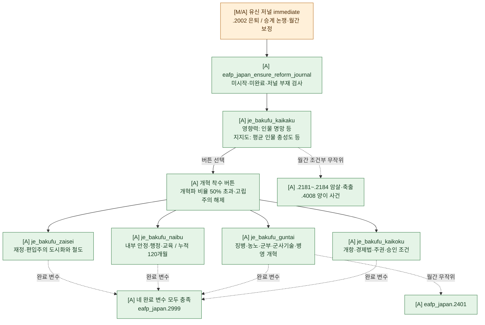

`je_bakufu_kaikaku.on_invalid`에도 파벌 modifier 정리와 `bakufu_kaikaku_complete_var` 설정이 있다. 따라서 그 변수만 보고 성공 이벤트 `.2999`가 발생했다고 판단하면 안 된다. `.2999`는 네 분야를 완료한 `on_complete`에서 호출된다.

---

<a id="succession"></a>

## 쇼군 후계와 황실

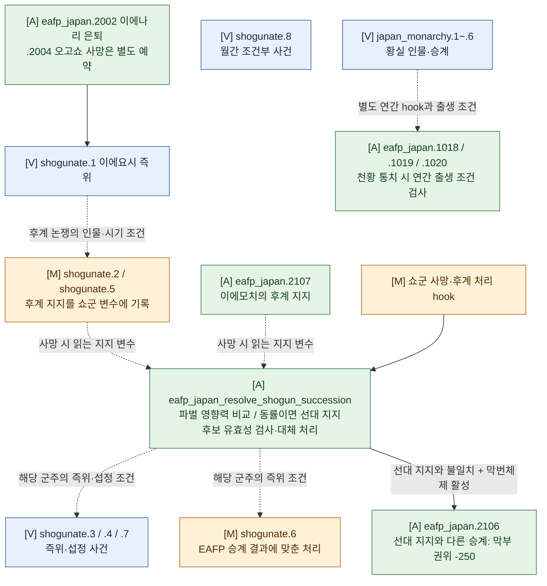

바닐라의 후계자 지명을 그대로 실행하는 구조가 아니다. 수정된 `.2/.5`와 추가된 `.2107`은 뜻을 기록하며, 실제 승계는 사망 시 effect에서 결정한다. 왕조별 바닐라 사건은 해당 인물과 조건에 맞게 계속 사용한다. `shogunate.8`과 황실 사건은 이 후계 분쟁의 필수 후속 단계가 아니다.

---

<a id="tenpo-sakoku"></a>

## 텐포 위기·아편전쟁·쇄국

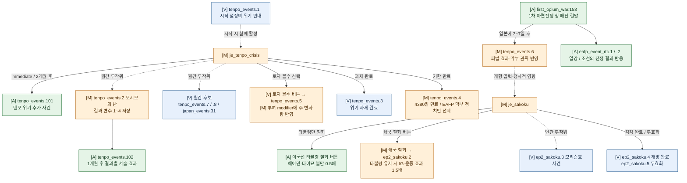

아편전쟁 충격 `tenpo_events.6`은 EAFP 1차 아편전쟁의 청 패전 결말에서 발생한다. 텐포 위기는 추가 사건 `.101`과 오시오의 난 결과별 후속 사건 `.102`를 사용한다.

쇄국 저널의 `eafp_repeal_ikokusen_uchiharairei_button`은 타불령 단독 철회 버튼이다. 타불령이 붙은 법률에서 해당 증보만 제거하고, 헤이민(`ig_rural_folk`)과 다이묘(`ig_landowners`)에 `forced_transition_from_tradition`을 `multiplier = 0.5`로 부여한다. 기본 지지도 -5의 절반인 -2.5이며, 기존 5년 지속·점감 조건을 유지한다.

기존 쇄국 철회 버튼은 타불령을 보유한 경우 `ep2_sakoku.2`의 이해집단·정치운동 modifier를 모두 1.5배로 적용한다. 선택 법률 지지 집단의 `overdue_break_with_tradition`, 쇄국 지지 집단의 `forced_transition_from_tradition`, 유신파의 `modifier_ended_sakoku_movement`가 대상이다. 타불령이 없으면 1배다. 이벤트 immediate에서 법률 변경 전 배율을 저장하며, 버튼 미리보기와 custom_tooltip도 같은 조건을 설명한다. modifier 지속 기간은 늘리지 않는다.

---

<a id="restoration"></a>

## 명예로운 유신과 정국 사건

### 유신 저널·황실 혼인·세 가지 결말

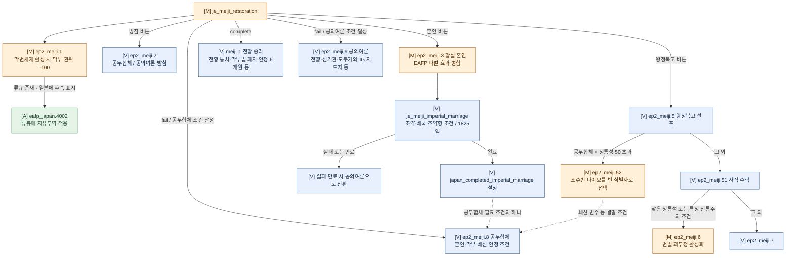

`fail`은 이 저널에서 **막부 측 승리**를 표현하는 엔진 분기 이름이다. 일반적인 패배로 읽으면 안 된다. 천황 승리와 두 막부 결말은 `japan_restoration_complete`를 설정하지만, 근대화 저널군 호출 여부는 서로 다르다. 군주제 상실에 따른 `on_invalid`도 이 변수를 설정하므로, 후속 저널은 각자의 추가 조건까지 확인해야 한다.

### 정국 사건과 EAFP 효과

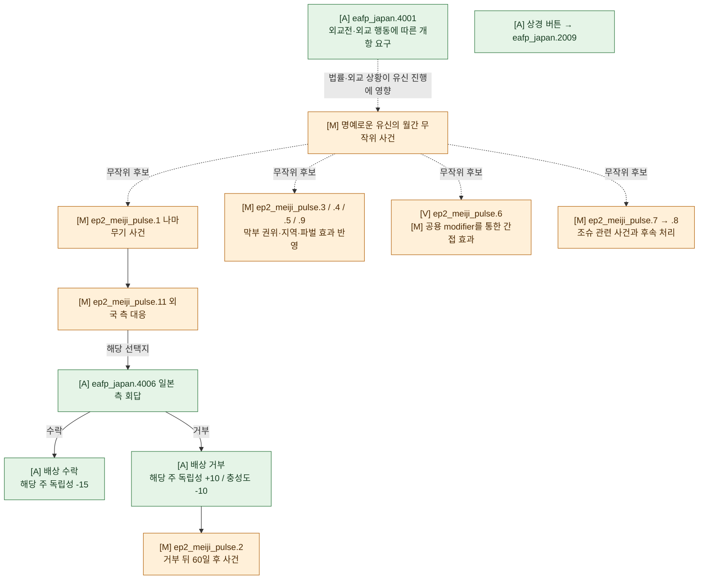

나마무기 사건의 일본 측 후속 회답은 `eafp_japan.4006`에서 처리한다. `ep2_meiji_pulse.9`에는 EAFP의 파벌·권위 효과가 함께 들어 있다. 바닐라 사건이 사용하는 modifier에 월간 막부 권위·지역 변화량을 추가한 경우에는 이벤트 본문 교체와 구분한다.

---

<a id="boshin"></a>

## 정치운동과 보신전쟁

막부 권위가 높을수록 유신파·도쿠가와 충성파 운동의 팝 지지와 급진성 보정이 낮아진다. 권위에 따른 팝 지지 배율은 0.5~2.5배, 급진성 추가는 -20%~+60%다. 주 충성도가 부여하는 운동 지지 modifier는 [주별 통치](#regional-governance)의 별도 효과다.

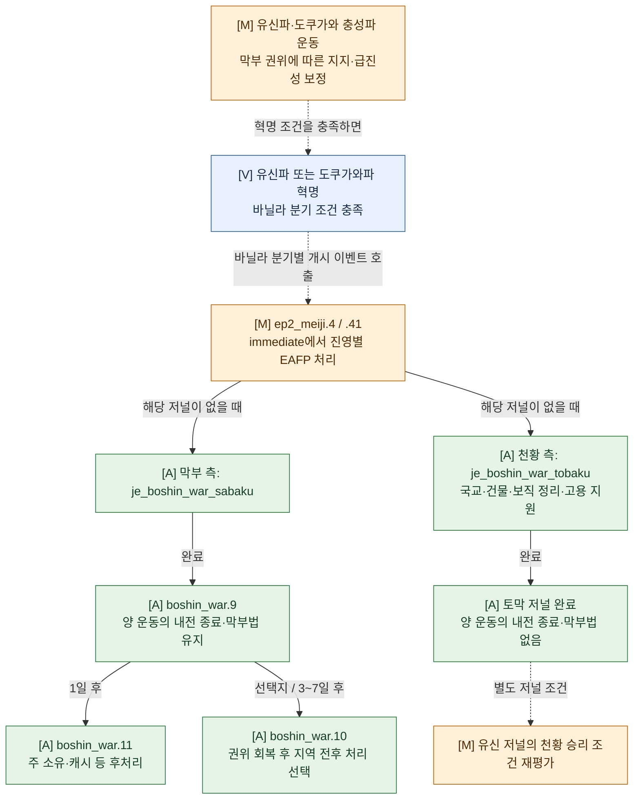

양측 저널 생성과 국가 지원은 `ep2_meiji.4/.41`의 `immediate`에서 처리하고, 막부 승리 후 `.9 → .11/.10` 경로를 사용한다. 토막 저널 완료에는 `meiji.1` 직접 호출이 없으므로, 보신전쟁 승리와 유신 저널의 천황 승리를 하나의 즉시 전환으로 연결하지 않았다.

| 개시 이벤트 | 막부 측 / 사막 저널 | 천황 측 / 토막 저널·지원 |
| --- | --- | --- |
| `ep2_meiji.4` | `scope:tokugawa_scope` — 도쿠가와파 혁명국 | `ROOT` — 원국 |
| `ep2_meiji.41` | `ROOT` — 원국 | `scope:imperial_court_scope` — 유신파 혁명국 |

두 저널은 서로를 `target`으로 저장한다. 상대국 스코프가 존재할 때만 처리하고, 각 저널이 이미 있으면 해당 진영의 초기 처리를 반복하지 않는다. `boshin_war_happened`는 막부 측에 설정한다. 천황 측에는 유교 국교, 항구·수도 무역 중심지, 막부 보직 해제, 24개월 고용 지원을 적용한다. 바닐라 이벤트의 진영 선택·플레이 국가 전환은 유지한다.

군주 구성은 바닐라 내전 처리에 맡긴다. 두 저널의 완료 판정은 유신파와 도쿠가와파 내전을 모두 검사하여 `.4` 경로에서 전쟁 중 조기 완료되지 않도록 한다.

---

<a id="modernization"></a>

## 근대화와 이와쿠라 사절단

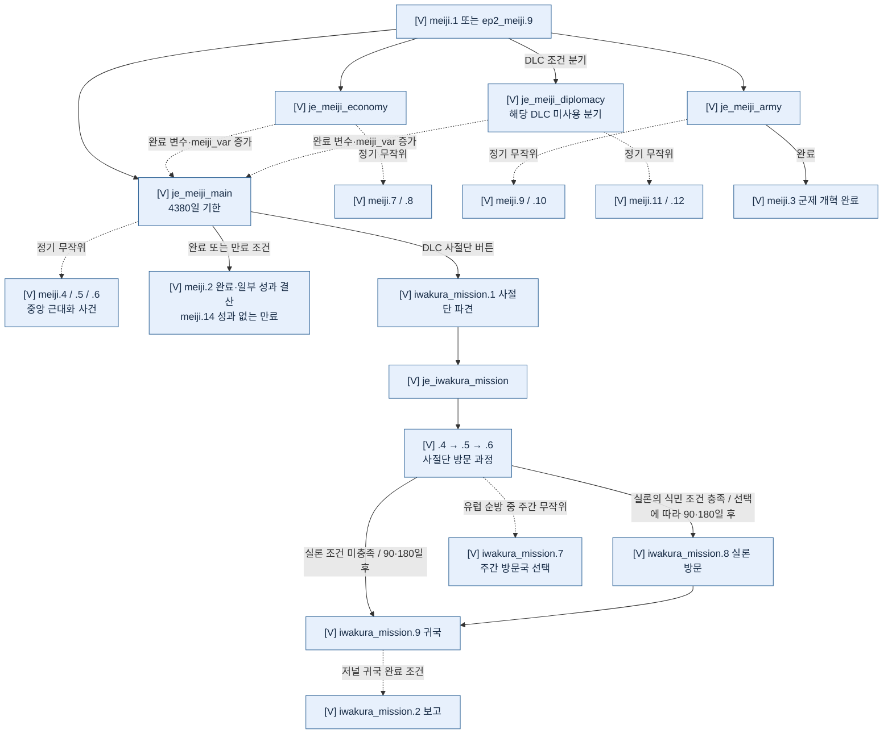

현재 EAFP는 `je_meiji_restoration`만 교체한다. 같은 바닐라 파일의 `je_meiji_imperial_marriage`, `je_meiji_main`, `je_meiji_economy`, `je_meiji_army`, `je_meiji_diplomacy`는 바닐라 정의를 사용한다. `meiji.*`와 이와쿠라 사건도 바닐라 정의를 사용한다. 경제·외교 하위 저널은 완료 변수와 `meiji_var`를 갱신하고, 군제 하위 저널만 `meiji.3`을 직접 호출한다. 이와쿠라 `.6`의 두 선택지는 유럽 체류 기간을 정하며, 이후 `.8` 경유 여부는 실론의 식민 상태 조건으로 갈린다. 근대화 저널의 지위체계 변경 버튼은 바닐라 공용 `set_hierarchy_event.3`으로 연결된다.

---

<a id="north"></a>

## 북방 개척

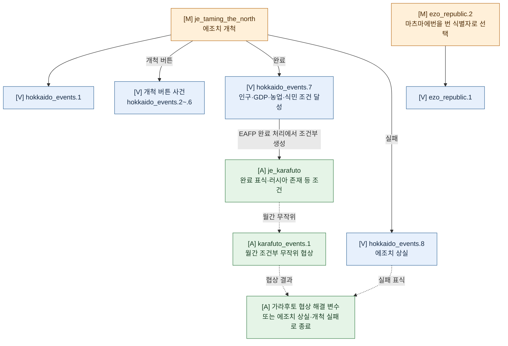

북방 개척 본편은 바닐라 `hokkaido_events.*`를 사용한다. EAFP가 바꾼 지점은 저널의 완료·실패 표식과 가라후토 연결, 에조 공화국 사건의 다이묘 선택 등이다.

---

<a id="ryukyu-taiwan"></a>

## 류큐와 대만

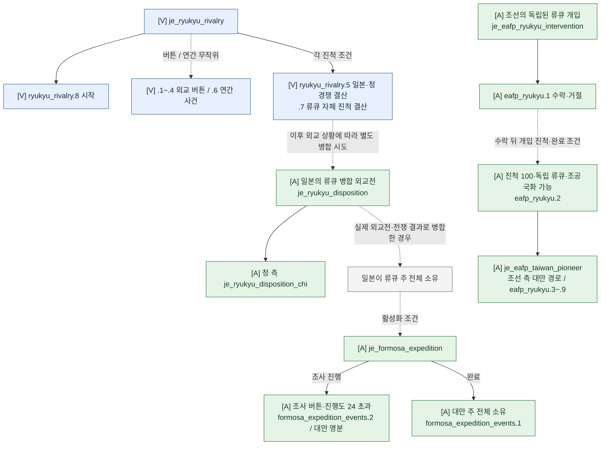

`je_ryukyu_disposition` 두 저널은 현재 완료 효과가 비어 있다. 이 저널이 자동으로 류큐를 병합한다고 해석하지 않는다. 대만 원정은 **일본의 류큐 주 전체 소유**가 활성화 조건이므로 시작부터 이어지는 경로가 아니다. 조선의 류큐 개입은 바닐라 `je_ryukyu_rivalry`를 대체하거나 그 진척도를 공유하지 않는 별도 저널이다. 조선 대만 경로는 관련 대외 분기까지만 묶어 표시했다.

---

<a id="civil-politics"></a>

## 자유민권·정한론·번벌 정치

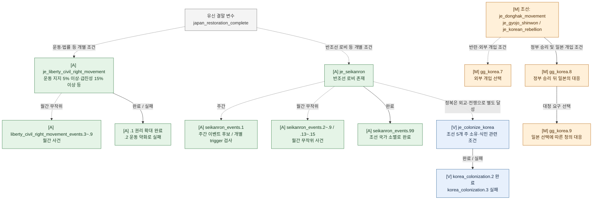

자유민권운동과 정한론은 `meiji.2`의 근대화 완료를 기다리는 직렬 후속 저널이 아니다. 유신 결말 변수와 각 활성화 조건으로 진입한다. 정한론의 로비 만족도 `appeasement <= -8` 실패 분기에는 후속 이벤트가 없고, 반조선 로비가 없어지면 무효화된다. 조선 사건은 EAFP의 같은 경로 파일 `events/soi_events/00_ep1_korea_events.txt`를 사용한다. 조선 전체 국내 개혁 과정은 이 일본 흐름도의 범위 밖이다.

### 번벌 정치 계획

`law_hanbatsu_oligarchy`에 대응하는 저널 설계는 별도 문서 [번벌 과두정 저널 계획](hanbatsu_oligarchy_journal_plan.md)에 둔다. 원로 개개인이나 번별 영향력을 추적하지 않고, 저널의 기한과 게임 내 정책·정치 조건을 중심으로 설계한다. 이 계획을 현재 작동하는 저널로 간주하지 않는다.

`hanbatsu_oligarchy_events.1`의 이벤트 정의는 존재하지만, 호출할 활성 저널·이벤트는 확인되지 않았다.

---

<a id="society"></a>

## 종교·재벌·사회 사건

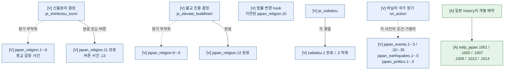

바닐라 종교 저널은 각각의 결정에서 시작한다. 일상·재해 사건은 정기 호출 후보이며 특정 저널을 순서대로 완료해야 발생하는 목록은 아니다. `japan_events.31`은 텐포 위기의 월간 후보다.

---

<a id="reference"></a>

## 이벤트 색인과 구현 파일

### 이벤트 namespace별 정의

다음 표는 바닐라 일본 이벤트 디렉터리, 바닐라 `events/meiji_restoration.txt`, EAFP 일본 이벤트 디렉터리의 **실제 정의 ID**를 대조한 목록이다. 큰 사건 묶음을 도표에서 생략 없이 찾아보기 위한 색인이다. 한 셀의 번호 목록은 표 첫 열의 namespace를 공유한다. `[U]` 항목도 정의 자체는 존재하므로 `[A]` 열에 포함되며, 연결 여부는 번벌 정치 절과 아래 일반 진행 외 정의 항목을 따른다.

| Namespace | [V] 바닐라 본문 | [M] EAFP 교체 | [A] EAFP 추가 |
| --- | --- | --- | --- |
| `boshin_war` | — | — | .9, .10, .11 |
| `eafp_japan` | — | — | .1, .2, .3, .4, .5, .6, .7, .9, .11, .12, .1001, .1002, .1003, .1004, .1005, .1006, .1007, .1009, .1012, .1014, .1015, .1018, .1019, .1020, .2002, .2004, .2009, .2106, .2107, .2181, .2182, .2183, .2184, .2401, .2999, .4001, .4002, .4004, .4006, .4008 |
| `ep2_meiji` | .2, .5, .7, .8, .9, .51, .1000 | .1, .3, .4, .6, .41, .52 | — |
| `ep2_meiji_pulse` | .6 | .1, .2, .3, .4, .5, .7, .8, .9, .11 | — |
| `ep2_sakoku` | .3, .4, .5 | .2 | — |
| `ezo_republic` | .1 | .2 | — |
| `formosa_expedition_events` | — | — | .1, .2 |
| `hanbatsu_oligarchy_events` | — | — | .1 |
| `hokkaido_events` | .1, .2, .3, .4, .5, .6, .7, .8 | — | — |
| `iwakura_mission` | .1, .2, .4, .5, .6, .7, .8, .9 | — | — |
| `japan_earthquakes` | .1, .2, .3, .4, .5 | — | — |
| `japan_events` | .1, .2, .3, .4, .5, .31, .32, .33, .34, .35 | — | — |
| `japan_monarchy` | .1, .2, .3, .4, .5, .6 | — | — |
| `japan_politics` | .1, .2, .3 | — | — |
| `japan_religion` | .1, .2, .3, .4, .5, .6, .7, .8, .9, .10, .11, .12, .13 | — | — |
| `karafuto_events` | — | — | .1 |
| `korea_colonization` | .2, .3 | — | — |
| `liberty_civil_right_movement_events` | — | — | .1, .2, .3, .4, .5, .6, .7, .8, .9 |
| `meiji` | .1, .2, .3, .4, .5, .6, .7, .8, .9, .10, .11, .12, .13, .14 | — | — |
| `ryukyu_rivalry` | .1, .2, .3, .4, .5, .6, .7, .8 | — | — |
| `seikanron_events` | — | — | .1, .2, .3, .4, .5, .6, .7, .8, .9, .13, .14, .15, .99 |
| `shogunate` | .1, .3, .4, .7, .8 | .2, .5, .6 | — |
| `tenpo_events` | .1, .3, .5, .7, .8 | .2, .4, .6 | .101, .102 |
| `zaibatsu` | .1, .2 | — | — |

외부 연결 사건은 `first_opium_war.153`, `eafp_event_rtc.1/.2`, `gg_korea.7/.8/.9`, `eafp_ryukyu.1~.9`, `set_hierarchy_event.3`을 도표와 본문에 별도로 표시했다. 다른 국가의 모든 사건을 일본 사건 목록으로 합산하지 않는다.

### 일반 진행 외 정의

| 구분 | 이벤트 | 현재 조사 결과 |
| --- | --- | --- |
| [U] 바닐라 잔존 정의 | `meiji.13` | 강제 개항 사건으로 `orphan = yes`가 있으며, 활성 호출을 찾지 못했다. 일반 개항 경로에 연결하지 않는다. |
| [V] 디버그 전용 | `ep2_meiji.1000` | 바닐라에 `orphan = yes`인 디버그 이벤트로 정의되어 있다. 정상 진행의 사건으로 연결하지 않는다. |

이는 활성 스크립트의 정적 검색 결과이며, 콘솔이나 외부 모드의 호출까지 배제하는 판정은 아니다.

### 주요 구현 파일

| 용도 | 현재 정의·호출을 확인한 파일 |
| --- | --- |
| 막번체제·개혁·전쟁·대외 저널 | `common/journal_entries/eafp_japan.txt` |
| 교체된 유신·텐포·북방 저널 | `common/journal_entries/eafp_00_meiji_restoration.txt`, `eafp_07_tenpo_crisis.txt`, `eafp_07_taming_the_north.txt` |
| 시작·정기·혁명·사망 호출 | `common/history/countries/jap - japan.txt`, `common/history/global/`, `common/on_actions/japan_code_on_actions.txt`, `eafp_japan_regional_on_actions.txt`, `00_code_on_actions_definition.txt` |
| 인사·번·승계·지역 계산 | `common/scripted_effects/eafp_japan_effects.txt`, `eafp_japan_daimyo_effects.txt`, `eafp_japan_additional_daimyo_effects.txt`, `eafp_japan_succession_effects.txt`, `eafp_japan_vanilla_succession_effects.txt`, `eafp_japan_regional_effects.txt` |
| 버튼·진행도 | `common/scripted_buttons/eafp_japan_buttons.txt`, `common/scripted_progress_bars/`, `common/script_values/` |
| 일본 이벤트 | `events/eafp_jap_events/*.txt`, `events/000_eafp_japan_overrides.txt` |
| 아편전쟁 접점 | `events/eafp_chi_events/eafp_first_opium_war_events.txt`, `events/opium_wars_events.txt` |
| 류큐·조선 접점 | `common/journal_entries/eafp_01_ryukyu_rivalry.txt`, `eafp_taiwan_journal.txt`, `eafp_03_korea.txt`, `events/eafp_ryukyu_events.txt`, `events/soi_events/00_ep1_korea_events.txt` |
| 바닐라 원본 | 설치 경로의 `events/japan_events/*.txt`, `events/meiji_restoration.txt`, 일본 관련 `common/journal_entries/`, `common/scripted_buttons/07_japan_buttons.txt`, `common/scripted_effects/00_victoria_ep2_scripted_effects.txt`, 정기 `common/on_actions/` |

바닐라 조사 경로는 `D:/SteamLibrary/steamapps/common/Victoria 3/game`이다. 특히 북방 원본 저널 파일명은 `common/journal_entries/07_hokkaido.txt`이며, 모드 교체 파일명과 다르다.

이 문서의 흐름도는 활성 정의, 명시적 호출, 저널의 생성·완료·실패·무효화와 정기 이벤트 후보를 기준으로 한다. `show_as_tooltip`·`event_outcome_*_effect_desc`의 표시용 효과는 실행 경로로 세지 않는다. 무작위 사건의 발생 빈도와 실제 게임 화면·스코프 동작은 별도의 게임 실행 검증이 필요하다.
