# 일본 콘텐츠 통합 문서

통합일: 2026-10-01

일본 전용 Markdown 문서 19개를 한 파일로 통합했다. 계획, 구현 보고, 역사 인물 자료, 바닐라 저널·이벤트 목록과 흐름도를 아래 목차에서 찾아볼 수 있다.

각 절의 날짜·완료 상태·미검증 항목은 원문 작성 당시의 기록이다. 과거 설계와 후속 구현이 다른 경우 해당 절에 명시된 후속 변경을 함께 읽는다. 이번 통합은 기존 코드의 재검증이나 모든 문서의 최신화 완료를 뜻하지 않는다. 원문의 표·코드·흐름도·출처를 보존하고, 반복된 공통 안내문은 아래에 한 번만 수록했다. 통합 전 파일명은 각 절의 출처 표시에 남겼다.

## 목차

**현재 구현 기준 통합 흐름도**

- [20. 바닐라·EAFP 일본 콘텐츠 통합 흐름도](#integrated-flow) — EAFP 수정·추가 표시, 분기별 도표 13개와 이벤트 정의 색인.

**전체 설계와 바닐라 연계**

- [1. 일본 콘텐츠 리뉴얼 구현 계획](#renewal-plan)
- [2. 일본 바닐라 호환성 기준선](#vanilla-compatibility)
- [3. 바닐라 일본 저널·이벤트 전체 목록과 흐름](#vanilla-flow)
- [4. 바닐라 DLC–EAFP 일본 이벤트 내용 중복 조사](#event-overlap)

**주별 통치와 다이묘**

- [5. 일본 막번체제 저널 내 주별 통치 관리 복원·최신화 계획](#regional-plan)
- [6. 일본 막번체제 주별 통치 구현 보고](#regional-implementation)
- [7. 주별 통치 효과 이관표](#regional-migration)
- [8. 다이묘의 주 위치와 번 식별자 분리](#han-identity)
- [9. 추가 다이묘 10개 번: 역사 인물과 승계 구현](#additional-daimyos)

**막부 인사와 인물**

- [10. 막부 보직별 character_role 전환 계획](#bakufu-roles)
- [11. 막부 정치인 활동 기간 설정](#bakufu-careers)
- [12. 일본 중복 인물 정본 매핑](#character-identity)

**이관·구현·검증 이력**

- [13. 일본 옛 콘텐츠 이관 Manifest](#migration-manifest)
- [14. 일본 콘텐츠 1단계 최초 로드 보고서](#stage1-load)
- [15. 일본 콘텐츠 2단계 P0 충돌 제거 보고서](#p0-collisions)
- [16. 일본 콘텐츠 3단계 직접 소유 구현 보고서](#stage3-implementation)
- [17. 일본 콘텐츠 리뉴얼 4단계 구현 보고서](#stage4-implementation)
- [18. 일본 콘텐츠 4단계 런타임 오류 해결 계획](#stage4-runtime-plan)
- [19. 일본 콘텐츠 4단계 선택 P0 구현 보고서](#stage4-selected-p0)

## 공통 후속 변경 기록

> 2026-10-01 보신전쟁 개시 처리 이관: `japan_on_revolution_start`와 그 등록을 제거하고, 진영별 저널·국교·항구·무역 중심지·보직 정리·고용 지원을 `ep2_meiji.4/.41`의 `immediate`로 옮겼다. 연도별 군주·후계자 생성과 관련 출생 변수 설정은 삭제했다. 아래 기존 on_action 연결 설명은 이관 전 기록이며 현재 경로는 20.8절을 따른다.

> 2026-10-01 보신전쟁 정리: `boshin_war.1~4`와 혁명 시작 시의 호출, 전용 번역문을 삭제했다. 양측 보신전쟁 저널과 전후 처리 `boshin_war.9~11`은 유지한다. 아래 과거 복원·이관 기록의 전체 이벤트 보존 방침은 이 변경 이전의 기록이다. 현재 경로는 20.8절을 따른다.

> 2026-09-06 후속 변경: 지역 충성도·독립성 관리는 `je_bakuhantaisei` 하나에 통합했다. 주 충성도는 독자 저장값이며, 관리 주의 `cached_daimyo_loyalty`를 이 값으로 덮어쓴다. 별도 지역 JE와 고료 기능은 사용하지 않는다. 아래의 지역 삭제·인물 평균/대표자 캐시·고료 관련 과거 서술은 결정 이력으로 보존한다. 현재 구현과 검증 범위는 [주별 통치 구현 보고](#regional-implementation), 효과별 변경은 [이관표](#regional-migration)를 참조한다.

---

<a id="renewal-plan"></a>

## 1. 일본 콘텐츠 리뉴얼 구현 계획

통합 전 문서: `japan_content_renewal_plan.md`

> 2026-09-09 쇼군 승계 변경: 아래의 바닐라 후계 지정 우선 방안은 대체되었다. 쇼군의 지지는 EAFP 인물 변수에 기록하고 사망 시 파벌 영향력으로 승계자를 결정한다. 동률은 선대의 지지를 따르며, 다른 후보가 즉위하면 .2106의 막부 권위 -250을 적용한다. 바닐라 .2/.5는 지지 선언, .1/.3/.4/.6/.7은 즉위·섭정을 담당한다. 변경은 기존 원칙대로 신게임 기준이다.

> 2026-09-09 후속 변경: 사용자 요청으로 `eafp_jap_meiji_legacy.1~.13` 및 전용 번역 파일을 전부 삭제했다. 메이지 저널의 해당 후속·정기 호출과 전용 변수를 제거하고 바닐라 메이지 사건을 사용한다. 아래의 legacy 이벤트 보존·추가 계획은 과거 결정 이력이며 현재 구현에 적용하지 않는다.


### 0. 최신 구현 결정: EAFP 직접 소유

2026-09-01의 최신 구현 지시에 따라 bridge·바닐라 상태 동기화 전제를 폐기했다. 이 결정은 이 문서 아래쪽에 남아 있는 bridge, 바닐라 정본 소유, 호환 adapter 관련 과거 계획보다 우선한다.

- 지원 대상은 EAFP를 활성화한 상태로 시작한 신게임뿐이다.
- EAFP는 메이지 5개 JE와 `je_taming_the_north`를 `REPLACE:`로 로드하지만, 각 정의의 내용 기준선은 현행 바닐라 JE 전문이다. `REPLACE:`는 배포 수단이지 EAFP식 간이 JE를 새로 설계한다는 뜻이 아니다.
- 4단계에서 각 `REPLACE:` 블록을 바닐라 1.13.11 정의의 모든 필드·버튼·widget·공식 이벤트·완료/실패/무효화 결과를 먼저 그대로 옮긴 뒤 EAFP가 추가·수정한 부분만 명시적으로 병합한다.
- 실행 중에는 별도 bridge를 통해 바닐라 일본 JE의 활성 상태, 완료 변수, 진행 막대와 내부 modifier를 읽지 않는다. 다만 구현 시점의 바닐라 JE 소스는 `REPLACE:` 정의를 만드는 기준본으로 사용한다.
- bridge scripted trigger·effect와 월간 bridge on_action을 사용하지 않는다.
- 류큐 조선 개입은 바닐라 류큐 경쟁과 분리된 EAFP 자체 진행도를 사용한다.
- 이전 EAFP 저장에 대한 migration은 구현하지 않는다.

구현 결과와 현재 변수 계약은 [일본 콘텐츠 3단계 직접 소유 구현 보고서](#stage3-implementation)를 정본으로 삼는다. 이 문서의 기존 호환 계층 세부안은 결정 이력으로만 보존한다.

### 1. 문서 목적과 기준선

이 문서는 현재 `East-Asia-Flavor-Pack`에 남아 있는 옛 일본 콘텐츠를 Victoria 3의 현행 일본 콘텐츠, 특히 `The Great Wave` DLC와 충돌하지 않도록 재설계하기 위한 구현 계획이다. 이번 단계에서는 게임 스크립트나 자산을 수정하지 않고, 콘텐츠 소유권·이관 범위·호환 계층·구현 순서·검증 기준을 확정한다.

비교 및 구현 기준은 2026-08-30 현재 로컬 작업 폴더다.

| 항목 | 기준 |
|---|---|
| 대상 저장소 | `East-Asia-Flavor-Pack` |
| 대상 모드 버전 | `2.2.0` |
| 대상 게임 버전 | `1.13.*` |
| 검증한 로컬 실행 파일 버전 | Victoria 3 `1.13.11` |
| 검증한 Steam 빌드 | `24799966` |
| 검증한 로컬 게임 데이터 | `D:\SteamLibrary\steamapps\common\Victoria 3\game` |
| DLC 전제 | 모든 공식 DLC 설치, 일본 콘텐츠는 `The Great Wave`의 `ep2_content` 필수 |
| 지원 범위 | 전체 DLC 활성 환경만 지원·검증하며 DLC 비보유 환경은 고려하지 않음 |
| 주요 국가 태그 | `JAP`, `RYU`, `KOR`, `CHI` |
| 신규 식별자 접두사 | `eafp_jap_` / 이벤트 네임스페이스 `eafp_jap` |
| 기본 언어 | 한국어·영어·중국어 간체 동시 제공 |

현재 [`.metadata/metadata.json`](../.metadata/metadata.json)은 `supported_game_version = 1.13.*`로 설정되어 있다. 반면 [`README.md`](../README.md)의 일부 버전 표기는 이전 버전에 머물러 있으므로, 일본 리뉴얼 릴리스 시 메타데이터와 문서의 버전 표기도 함께 동기화한다.

이 계획은 다음 원칙을 전제로 한다.

> EAFP는 모드를 활성화한 신게임의 일본 저널 상태와 후속 결과를 직접 관리하고, 옛 저널·이벤트·현지화를 최대한 원형대로 복원한다.

옛 일본 `.disable` 파일은 이번 리뉴얼의 주 구현 원본으로 취급한다. 구현을 시작할 때 현재 비활성인 일본 관련 파일을 먼저 전부 활성 확장자로 복사한다. 게임 스크립트 파일은 같은 경로·같은 basename의 `.txt`로, localization 파일은 엔진 형식에 맞는 `.yml`로 되살린다. 이 “무수정 활성 복원본”을 기준선으로 고정한 다음에만 활성 복사본을 수정한다. 일부 정의가 최종 삭제 대상이더라도 해당 `.disable` 파일을 처음부터 제외하지 않고, 먼저 전체를 복원한 뒤 활성 `.txt` 또는 `.yml` 안에서 정의와 참조를 제거·병합한다.

기본 방침은 저널 구조, 이벤트 선택지, 이벤트 순서, 현지화 문구와 고유 효과를 그대로 보존하는 것이다. 다만 이 문서가 명시한 지역 JE 7개, 정책·청원 JE 8개, 독립 덴포 기근 JE와 중복 인물 정의는 활성 복원 후 삭제하며 재사용 가능한 서사만 새 소유자에게 이관한다. 그 밖의 수정은 현행 문법으로의 기계적 변환, 바닐라와 충돌하는 키의 이름 변경, 폐지된 주·스코프 교체, 바닐라 DLC가 이미 소유하는 완료 결과의 동기화에 한정한다.

### 2. 조사 결과 요약

#### 2.1 옛 일본 콘텐츠

옛 일본 콘텐츠의 대부분은 `.disable` 상태로 남아 있다.

- [`common/journal_entries/eafp_japan.disable`](../common/journal_entries/eafp_japan.disable)
  - 막번체제, 홋카이도, 덴포 기근, 막부 개혁, 개국, 군제, 재정, 보신전쟁, 자유민권운동, 정한론, 신토, 재벌, 류큐, 가라후토, 대만출병을 포함한다.
- [`common/journal_entries/eafp_bakufu_seisaku.disable`](../common/journal_entries/eafp_bakufu_seisaku.disable)
  - 막부 정책과 개혁 관련 보조 저널을 포함한다.
- `events/eafp_jap_events/*.disable`
  - 막부 인사, 계승, 모리슨호 사건, 존 만지로, 개항, 지진, 보신전쟁, 덴포 위기, 홋카이도, 신토, 정한론, 자유민권운동, 재벌, 가라후토, 대만출병 등의 사건을 포함한다.
- [`events/meiji_restoration.disable`](../events/meiji_restoration.disable)
  - `meiji.1`부터 `meiji.13`까지 현재 바닐라와 동일한 이벤트 네임스페이스를 사용한다.
- `common/character_templates/*.disable`
  - 대량의 옛 일본 인물 템플릿을 포함한다.

확인된 원본은 비활성 저널 44개, 비활성 이벤트 파일 12개의 이벤트 156개, 영어·한국어·중국어 간체 주 현지화 약 4,300개 키, 한국어 역사명 1,586개 키다. 모두 이관 manifest에는 등록하지만, 이번 수정으로 지역 막번체제 JE 7개, 막부 정책·청원 JE 8개, 독립 `je_tenpo_famine` 1개, `je_terakoya` 1개, 옛 `je_hokkaido` 1개, 옛 재벌 JE와 재벌 청원 JE 3개를 활성 대상에서 제외한다. 결과적으로 비활성 저널 44개 중 22개를 활성 JE로 복원·최신화하고 22개는 삭제 또는 바닐라 JE에 병합한다. `je_bakufu_seisaku`라는 단독 최상위 JE는 원본에 존재하지 않으므로 이 명칭은 8개 하위 JE와 공용 지원 자산 전체를 가리키는 삭제 범위로 사용한다.

#### 2.2 현행 바닐라 일본 콘텐츠

Victoria 3 1.13.11과 `The Great Wave`는 다음 일본 시스템을 이미 제공한다.

- `je_sakoku`: 쇄국과 개항
- `je_tenpo_crisis`: 덴포 위기와 오시오의 난
- `je_meiji_restoration` 및 `je_meiji_*`: 메이지 유신, 경제·군사·외교 과제
- `ep2_meiji.*`: 보신전쟁과 막부 말기 정치 사건
- `je_taming_the_north`: 홋카이도 개발과 북방 문제
- 에조 공화국·하코다테·고료카쿠 관련 사건
- `je_shinbutsu_bunri` / `je_elevate_buddhism`: 종교 정책
- `je_zaibatsu`: 재벌 형성
- `je_ryukyu_rivalry`: 류큐를 둘러싼 청일 경쟁
- `je_iwakura_mission`: 이와쿠라 사절단
- `je_colonize_korea`: 조선 식민화
- 막부 계승 사건과 현행 일본 회사

따라서 EAFP가 같은 주제의 마스터 저널, 진행 변수, 전쟁 시스템, 이벤트 네임스페이스 또는 회사를 다시 정의하면 이중 진행과 패치 호환성 문제가 생긴다.

#### 2.3 현재 활성 상태로 남은 충돌 요소

| 우선도 | 파일 또는 기능 | 문제 | 처리 방향 |
|---|---|---|---|
| P0 | [`common/country_definitions/eafp_countries.txt`](../common/country_definitions/eafp_countries.txt) | `REPLACE:JAP`로 바닐라 국가 정의 전체를 교체 | 전체 교체 제거 우선 |
| P0 | [`common/cultures/00_cultures_jap.txt`](../common/cultures/00_cultures_jap.txt) | `REPLACE:japanese`가 현행 바닐라 필드를 누락 | 생성형 패치 또는 교체 제거 |
| P0 | [`localization/english/replace/jap_replace_l_english.yml`](../localization/english/replace/jap_replace_l_english.yml) | 현행 `je_meiji_main`, `meiji.*` 문구를 옛 내용으로 덮음 | 문구를 legacy 키로 보존한 뒤 직접 덮어쓰기만 제거 |
| P0 | 중국어 일본 교체 로컬라이징 | 영어 파일과 같은 위험 | 문구를 legacy 키로 보존한 뒤 직접 덮어쓰기만 제거 |
| P0 | [`common/journal_entries/eafp_01_ryukyu_rivalry.txt`](../common/journal_entries/eafp_01_ryukyu_rivalry.txt) | 바닐라 `je_ryukyu_rivalry` 전체 재정의 | 조선 개입을 사이드카로 분리 |
| P0 | [`common/history/military_formations/06_military_formations_asia.txt`](../common/history/military_formations/06_military_formations_asia.txt) | 바닐라 아시아 편제 파일 경로를 통째로 가림 | EAFP 추가분만 별도 파일로 분리 |
| P1 | [`common/political_movements/eafp_ideological_movements.txt`](../common/political_movements/eafp_ideological_movements.txt) | 자유민권운동은 활성화될 수 있지만 연결 JE는 비활성 | 복원된 원본 JE와 다시 연결 |
| P1 | [`common/political_movement_pop_support/eafp_political_movement_pop_support.txt`](../common/political_movement_pop_support/eafp_political_movement_pop_support.txt) | 비활성 JE 참조가 남음 | 복원된 기존 JE 키로 참조 활성화 |
| P1 | [`common/diplomatic_plays/eafp_diplomatic_plays.txt`](../common/diplomatic_plays/eafp_diplomatic_plays.txt) | `dp_boshin_war`가 바닐라 내전 생성과 충돌 | 옛 조건·툴팁용 wrapper로 보존하고 실제 내전은 DLC에 위임 |
| P1 | [`common/modifier_type_definitions/eafp_modifier_types.txt`](../common/modifier_type_definitions/eafp_modifier_types.txt) | 옛 막번체제·계승·자유민권 수정치가 남음 | 원본 이관 후 충돌 키만 이름 변경 |
| P1 | [`common/ai_strategies/eafp_admin_strategies.txt`](../common/ai_strategies/eafp_admin_strategies.txt) | 조선 전략 안에 옛 일본 JE 판정이 남음 | 연결 계층으로 이동 또는 제거 |

### 3. 핵심 설계 결정

1. **옛 EAFP 콘텐츠는 기본적으로 보존하되 명시적 삭제 목록을 우선한다.** 지역 막번체제 JE 7개, 막부 정책·청원 JE 8개, 독립 `je_tenpo_famine`, `je_terakoya`, 옛 `je_hokkaido`, 옛 재벌 JE·청원 JE 3개는 삭제·병합한다. 옛 홋카이도 사건과 후속 북방 JE는 바닐라 `je_taming_the_north`에서 이어지며, 재벌 시스템은 바닐라 `je_zaibatsu`와 바닐라 공식 회사만 사용한다.
2. **바닐라는 정사 상태의 단일 진실 공급원이다.** 쇄국, 덴포 위기, 메이지 유신, 보신전쟁, 홋카이도, 종교, 재벌, 류큐, 이와쿠라 사절단, 조선 식민화의 최종 정권·영토·전쟁 결과는 바닐라가 소유한다.
3. **살아남는 옛 JE만 DLC 동기화형 동반 저널로 복원한다.** 원래 진행 막대와 사건 풀을 유지하되 바닐라 JE의 활성·완료·실패 상태에 맞춰 열리고 닫히게 한다. 삭제 대상으로 지정된 JE의 서사는 상위 EAFP JE나 대응 바닐라 JE로만 이관한다.
4. **바닐라 JE를 `REPLACE:`한 경우에는 바닐라 전문 위에 EAFP 차이만 병합한다.** `je_meiji_restoration`, `je_meiji_main`, `je_meiji_economy`, `je_meiji_army`, `je_meiji_diplomacy`, `je_taming_the_north`와 4단계에서 새로 교체하는 `je_tenpo_crisis`는 바닐라 1.13.11 정의를 필드 단위로 전부 복원한 뒤 EAFP 사건·변수·후속 JE 연결만 추가한다. 바닐라 버튼·widget·DLC 분기·공식 이벤트·완료/실패/timeout/invalid 결과를 EAFP 간이 로직으로 대체하지 않는다. 옛 `je_zaibatsu`는 이름을 바꿔 보존하지 않고 관련 청원·사건과 함께 제거한다.
5. **옛 현지화 문구는 기본적으로 그대로 사용한다.** 키를 바꾼 항목만 기계적으로 새 키에 복사하고, 문법이 깨진 동적 스코프와 명백한 오탈자만 수정한다.
6. **옛 이벤트의 서사와 선택지는 유지한다.** DLC와 같은 사건을 다루는 경우 삭제하지 않고 바닐라 사건의 선행·후속·대체 풍미 사건으로 연결하며, 중복되는 기계적 보상만 제거한다.
7. **바닐라 내부 변수 접근은 연결 계층으로 치환한다.** 옛 본문의 호출 위치는 유지하되 deprecated 변수·효과를 wrapper trigger와 effect로 바꾼다.
8. **기존 on_action에는 목록만 추가한다.** 바닐라 on_action의 `trigger` 또는 `effect` 블록을 중복 정의하지 않는다.
9. **전체 DLC 보유만 지원한다.** DLC 비활성 분기, 축소 모드, 대체 시작 조건과 DLC 없는 세이브 검증은 만들지 않는다.
10. **리뉴얼 적용 후 시작한 신게임만 지원한다.** 이전 EAFP 세이브를 변환하는 migration, cleanup, 진행도 승계와 중복 인물 재결속은 구현하지 않는다.
11. **옛 지역 JE의 계산 구조는 바닐라 다이묘 인물 구조로 교체한다.** 지역별 loyalty·independency·goryo 막대 대신 각 주의 저택을 보유한 다이묘 인물의 `loyalty` 하나만 사용한다.
12. **모든 일본 `.disable` 파일을 먼저 활성 복원한 뒤 수정한다.** 스크립트는 `.txt`, localization은 `.yml` 활성 복사본을 만들고, 무수정 복원 기준선과 후속 수정 내역을 분리한다. 선택적으로 필요한 파일만 골라 새로 작성하는 방식은 사용하지 않는다.
13. **원본 `.disable` 파일은 이관 대조본으로 보존한다.** 원본은 직접 수정하거나 삭제하지 않는다. 활성 복사본과 원본의 차이는 별도 이관 명세에 기록하고, 리뉴얼 완료 후에도 회귀 비교 자료로 남긴다.

### 4. 콘텐츠 소유권 매트릭스

| 콘텐츠 영역 | 최종 소유자 | EAFP 처리 |
|---|---|---|
| 쇄국·개항 | 바닐라가 최종 개항 상태 소유 | 옛 개항·모리슨호·양이 사건과 JE를 DLC 동반 콘텐츠로 보존 |
| 덴포 위기 | 바닐라 `je_tenpo_crisis`가 JE 전체 소유 | `je_tenpo_famine`을 삭제하고 그 사건·기근·구휼 내용을 바닐라 JE에 병합 |
| 메이지 유신 | 바닐라가 정권 교체와 공식 과제 소유 | 메이지 main·economy·army·diplomacy를 현행 바닐라 정의로 갱신하고 EAFP 사건 연결만 병합 |
| 보신전쟁 | 바닐라가 내전 생성·종전 소유 | 옛 좌막·도막 JE와 7개 사건을 전황·전후처리 동반 체인으로 보존 |
| 쇼군·천황 승계 | 바닐라가 실제 통치자 승계 소유 | 옛 승계 이벤트 문구·선택지는 자문·파벌·후속 사건으로 보존 |
| 홋카이도·에조·사할린 | 바닐라 `je_taming_the_north`가 홋카이도 개발과 공식 결과 소유 | 옛 `je_hokkaido`는 삭제하고 `hokkaido.1-6`, `je_karafuto` 등 후속 북방 콘텐츠만 바닐라 JE 진행·성공 뒤 이어지도록 연결 |
| 신불분리·종교정책 | 바닐라가 공식 종교 분기 소유 | EAFP `je_shinto` 및 전용 사건 삭제 완료. 바닐라 종교 콘텐츠 사용 |
| 재벌 | 바닐라 `je_zaibatsu`와 공식 회사가 전부 소유 | 옛 재벌 JE, 청원 JE 3개, `zaibatsu_events.1-4`, 전용 trigger·modifier·localization을 제거 |
| 류큐 경쟁 | 바닐라가 최종 귀속 소유 | 옛 일본·청 처분 JE와 현행 조선 개입 내용을 동반 저널로 보존 |
| 이와쿠라 사절단 | 바닐라 소유 | 직접 중복 JE는 만들지 않되 옛 메이지 외교 사건을 후속 풍미로 연결 |
| 조선 식민화 | 바닐라 `je_colonize_korea`가 최종 식민화 소유 | 옛 정한론 JE와 13개 사건 전체를 정치 선행·반발 체인으로 보존 |
| 자유민권운동 | EAFP 소유 | 옛 JE와 9개 사건을 현행 운동 스코프만 수정해 복원 |
| 대만출병 | EAFP 소유 | 옛 JE와 2개 사건을 원형 중심으로 복원 |
| 막부 관료·번정치 | EAFP `je_bakuhantaisei`와 바닐라 다이묘 인물 시스템 | 지역 JE·goryo·independency를 삭제하고 저택 소유 다이묘의 `loyalty`로 세금·정치 반응 계산 |
| 막부 개혁 과제 | EAFP | `je_bakufu_kaikaku` 계열을 현행 메이지 main·economy·army·diplomacy 구조에 맞춰 최신화 |

### 5. 바닐라 연결 계층

#### 5.1 제안 파일

```text
common/
  scripted_triggers/
    eafp_japan_vanilla_bridge.txt
  scripted_effects/
    eafp_japan_vanilla_bridge_effects.txt
  on_actions/
    eafp_japan_on_actions.txt
  journal_entries/
    eafp_japan_legacy.txt
    eafp_meiji_current_compatibility.txt
  scripted_values/
    eafp_japan_daimyo_loyalty_values.txt
events/
  eafp_jap_events/
    eafp_japan_legacy.txt
    eafp_boshin_war_legacy.txt
    eafp_tenpo_crisis_integrated_events.txt
    eafp_hokkaido_legacy.txt
    eafp_shinto_events_legacy.txt
    eafp_liberty_civil_right_movement_events_legacy.txt
    eafp_seikanron_events_legacy.txt
    eafp_karafuto_events_legacy.txt
    eafp_formosa_expedition_events_legacy.txt
  eafp_meiji_restoration_legacy.txt
documentation/
  japan_content_renewal_plan.md
  japan_vanilla_compatibility_matrix.md
  japan_legacy_content_migration_manifest.md
```

실제 구현 시 기존 저장소의 파일 분리 방식과 충돌하지 않는 범위에서 세분화한다.

#### 5.2 제안 scripted trigger

| 트리거 | 목적 |
|---|---|
| `eafp_japan_is_bakufu_era` | 막부법, 국가 상태, 유신 진행 종합 판정 |
| `eafp_japan_is_open` | 쇄국·고립주의·국경 정책 종합 판정 |
| `eafp_japan_tenpo_crisis_active` | 현행 덴포 위기 활성 여부 |
| `eafp_japan_tenpo_reformer_faction` | 바닐라 개혁파를 EAFP 히토쓰바시·개혁파 판정으로 반환 |
| `eafp_japan_tenpo_conservative_faction` | 바닐라 보수·강경파를 EAFP 난키·보수파 판정으로 반환 |
| `eafp_japan_restoration_active` | 현행 메이지 주요 JE 진행 여부 |
| `eafp_japan_restoration_finished` | 유신 또는 대체 정권 안정화 여부 |
| `eafp_japan_ryukyu_rivalry_active` | 류큐 경쟁 진행 여부 |
| `eafp_japan_korea_colonization_active` | 조선 식민화 진행 여부 |
| `eafp_japan_can_start_freedom_movement` | 자유민권운동 통합 개시 조건 |
| `eafp_japan_can_start_seikanron` | 정한론 통합 개시 조건 |
| `eafp_japan_state_has_valid_manor_daimyo` | 주의 저택 보유 다이묘 스코프가 유효한지 판정 |
| `eafp_japan_daimyo_is_disloyal` | 캐시된 저택 보유자 충성도가 40 미만인지 판정 |
| `eafp_japan_daimyo_is_loyal` | 캐시된 저택 보유자 충성도가 65 초과인지 판정 |

판정 우선순위는 국가 생존·독립·내전 여부, 법률과 통치 원칙, 활성 또는 완료된 바닐라 DLC JE, 안정적으로 확인된 바닐라 변수 순으로 둔다. 모든 DLC가 존재한다고 가정하므로 기능 부재를 위한 대체 판정은 만들지 않는다. 개별 EAFP 이벤트는 `meiji_var` 같은 내부 변수를 직접 참조하지 않고 연결 트리거만 호출한다.

#### 5.3 EAFP 소유 변수

- `eafp_jap_legacy_restoration_progress`: 옛 `shogunate_var`를 대체하는 EAFP companion 전용 진행도
- `eafp_jap_seen_meiji_restoration`, `eafp_jap_seen_meiji_main`: 월간 bridge가 바닐라 JE의 active→closed 전환을 판정하기 위한 shadow flag
- `eafp_jap_meiji_companion_completed`: 공식 유신 결과를 건드리지 않는 EAFP 동반 트랙 종료 flag
- `eafp_jap_bakufu_sidecar_completed`
- `eafp_jap_freedom_movement_result`
- `eafp_jap_seikanron_result`
- `eafp_jap_formosa_expedition_result`
- 바닐라 `cached_daimyo_loyalty`를 직접 확장할 수 없을 때만 사용하는 namespaced 주별 충성도 캐시
- 고유 사건의 단발성 발동·쿨다운 변수

옛 콘텐츠가 이미 사용하던 EAFP 변수는 신게임에서 다시 시작되는 콘텐츠가 실제로 사용하는 경우에만 유지한다. 바닐라 유신·보신전쟁·류큐 결과를 직접 결정하던 변수는 “EAFP 동반 트랙 진행도”로 의미를 제한하고, 바닐라 상태를 쓰는 효과는 연결 effect로 치환한다. 삭제된 옛 재벌 변수는 활성 정의와 신규 호출부에서 제거하며 기존 세이브의 값을 정리하는 별도 effect는 만들지 않는다.

### 6. 전체 DLC 필수 전제

#### 6.1 지원 환경

- 모든 공식 DLC가 활성화된 환경만 지원한다.
- 일본 리뉴얼은 `The Great Wave`의 현행 JE·이벤트·인물·회사·법률이 항상 존재한다고 가정한다.
- DLC 보유 여부에 따른 `trigger_if`, 대체 JE, 축소 사건 풀과 폴백 인물을 만들지 않는다.
- `has_dlc_feature = ep2_content`는 로직 분기용이 아니라 잘못된 설치를 조기에 차단하는 방어 판정으로만 둘 수 있다.
- 모드 설명과 배포 문서에 전체 DLC 필수 조건을 명시한다.

#### 6.2 DLC 결과와의 동기화

- 바닐라 JE가 시작되면 대응하는 옛 EAFP 동반 JE를 원래 구조에 가깝게 시작한다.
- 옛 EAFP JE가 먼저 목표를 달성해도 정권·영토·전쟁의 공식 결과는 바닐라 JE가 결정한다.
- 바닐라 JE가 완료·실패·무효화되면 대응 EAFP JE도 정해진 완료·실패·정리 분기로 이동한다.
- 옛 이벤트가 바닐라 사건과 같은 역사적 사건을 다루면, 바닐라 사건의 선행 또는 후속 사건으로 한 번만 발동한다.
- DLC 비활성 신게임과 세이브는 테스트 매트릭스에서 제외한다.

#### 6.3 `.disable` 전면 활성 복원 절차

1차 파일명·경로 조사에서 일본 콘텐츠로 식별된 `.disable` 파일은 47개였다. 참조 그래프 조사에서 막번체제 진행 막대·버튼·scripted GUI, 원로회의 GUI, 쿠로후네 한국어 문구, 일본 인물 설명 현지화 6개를 추가해 최종 복원 기준선은 53개로 확정했다. 분류는 `common` 33개, `events` 12개, `localization` 7개, `gui` 1개다. 이후 일본 전용 간접 의존 파일이 새로 발견되면 manifest에 추가하고 같은 복원 절차를 적용한다.

복원 순서는 다음과 같이 고정한다.

1. 모든 대상 `.disable` 파일의 상대 경로, 크기, 체크섬과 활성 목적 경로를 [일본 옛 콘텐츠 이관 Manifest](#migration-manifest)에 기록한다.
2. `common/**`, `events/**`와 history 등 게임 스크립트는 내용을 바꾸지 않고 동일 경로의 `.txt` 활성 복사본으로 만든다.
3. `localization/**`는 내용을 바꾸지 않고 동일 경로의 `.yml` 활성 복사본으로 만든다. 사용자가 지정한 “`.txt`로 되살린다”는 원칙은 스크립트 파일에 적용하고, localization만 엔진이 요구하는 `.yml`을 사용한다.
4. 두 character template 파일을 포함한 일본 인물 파일도 예외 없이 먼저 활성 복원한다. 중복 인물 삭제는 그 다음 수정 단계에서 수행한다.
5. 활성 복사본을 아직 수정하지 않은 상태를 별도 기준 커밋 또는 체크섬 묶음으로 고정한다.
6. 전면 복원 상태로 게임을 한 번 로드해 duplicate key, invalid scope, missing reference, localization 충돌 로그를 수집한다. 이 로그는 삭제 대상 파일을 건너뛸 근거가 아니라 후속 수정 목록의 입력으로 사용한다.
7. 이후의 모든 저널 삭제·바닐라 병합·ID 변경·중복 인물 통합·문법 갱신은 활성 `.txt`/`.yml` 복사본에만 적용한다.
8. 각 수정 뒤 원본 `.disable`과 활성 파일을 diff해 `원형 유지`, `현행화`, `다른 JE로 이관`, `명시적 삭제` 단위로 변경 사유를 기록한다.

복원 단계에서는 스크립트가 중복되거나 오류를 내더라도 내용을 선별 삭제하지 않는다. “전체 원본을 활성 파일로 되살린 상태”와 “충돌을 해결한 최종 상태”를 분리해 남기는 것이 목적이다. 다만 실제 배포본과 정상 플레이 검증은 수정 완료된 활성 파일만 대상으로 한다.

### 7. 옛 콘텐츠 이관 계획

#### 7.1 저널별 처리 유형

옛 일본 저널은 키 하나마다 다음 처리 유형 중 하나를 지정한다.

| 처리 유형 | 의미 |
|---|---|
| 원형 보존 재가동 | 기존 키·진행·사건 호출·현지화를 유지하고 현행 문법만 고친다. |
| 키 변경형 보존 | 바닐라와 정확히 충돌하는 키만 `eafp_jap_legacy_*`로 바꾸고 나머지 본문은 유지한다. |
| DLC 동기화형 보존 | 옛 JE의 진행과 사건은 유지하되 개시·완료·실패를 대응 바닐라 DLC JE에 연결한다. |
| 결과부 치환 | 옛 JE를 유지하면서 정권·영토·전쟁을 직접 바꾸는 결과만 연결 effect로 교체한다. |
| 현행 ID 매핑형 보존 | 사라진 주·법률·스코프만 현재 ID로 바꾸고 원래 구조는 유지한다. |
| 바닐라 최신화형 병합 | 현행 바닐라 JE 정의를 기준본으로 삼고 EAFP 사건·효과 연결만 추가한다. |
| 바닐라 JE로 병합 후 삭제 | 옛 독립 JE를 제거하고 그 사건·진행 요소를 지정된 바닐라 JE 안으로 이동한다. |
| 명시적 삭제 | JE와 전용 버튼·진행 막대·효과·트리거·현지화를 활성 대상에서 제거한다. |
| 활성 재정의 제거 | 현재 활성된 바닐라 키 재정의를 제거하고 필요한 EAFP 확장만 별도 JE로 옮긴다. |

삭제는 원칙적으로 최후 수단이지만 이번 수정에서 지정된 지역 JE, 막부 정책·청원 JE, `je_tenpo_famine`과 `je_terakoya`에는 예외를 적용한다. 삭제된 JE의 전용 UI·계산 자산도 함께 제거하되 재사용 가치가 있는 사건 문구는 지정된 바닐라 JE 또는 상위 EAFP JE로 병합할 수 있다. 모든 삭제·병합은 [일본 옛 콘텐츠 이관 Manifest](#migration-manifest)에 원본 키와 새 목적지를 기록한다.

#### 7.2 `eafp_00_meiji_restoration.disable`

이 파일은 4단계에서 현행 바닐라 JE를 기준으로 다시 생성하는 `REPLACE:` 파일이다. `je_terakoya`는 전용 지원 자산과 함께 제거하고 대체 legacy JE를 만들지 않는다. 나머지 메이지 5개 JE는 별도 legacy JE로 분리하지 않는다. 각 블록에는 바닐라 1.13.11 정의 전문을 먼저 유지하고, EAFP 옛 사건·현지화·고유 보상·추적 변수 중 비충돌 부분만 주석으로 구분한 추가 구간에 병합한다.

##### 7.2.1 `je_terakoya`

- **처리:** 명시적 삭제
- **활성 키:** 없음
- `REPLACE:je_terakoya` 정의를 제거하며 `je_eafp_jap_legacy_terakoya` 같은 대체 JE를 만들지 않는다.
- `common/history/countries/jap - japan.txt`의 `add_journal_entry = { type = je_terakoya }`를 제거한다.
- `modifier_jap_terakoya`, `modifier_legacy_of_terakoya`와 전용 tooltip·이벤트·effect·trigger·현지화는 전체 참조를 조사한 뒤 다른 콘텐츠가 사용하지 않으면 함께 제거한다. 공용 자산이면 `je_terakoya` 분기만 삭제하고 살아남는 호출자는 namespaced 공용 자산으로 이관한다.

##### 7.2.2 `je_meiji_restoration`

- **처리:** 바닐라 최신화형 `REPLACE:` + EAFP 차이 병합
- **활성 키:** `REPLACE:je_meiji_restoration`
- 바닐라의 세 scripted button, 천황·다이묘 widget, 천황·다이묘 갱신, 다이묘 충성도 캐시, 유신운동 생성, `restoration_timer_var`, 월간 공식 사건 풀, 황실·막부 승리, 공무합체·공의여론, invalid와 공식 결과를 전문 그대로 기준선에 둔다.
- 바닐라 `on_complete`의 공식 effect 뒤에는 `eafp_jap_restoration_finished`와 `eafp_jap_meiji_legacy.1`을, `on_fail/on_invalid` 뒤에는 `eafp_jap_restoration_failed`만 부가 추적으로 병합한다. EAFP의 단순 6개월 진행도, 하위 메이지 JE 직접 추가, 정권·영토·공식 완료 변수 재지급은 바닐라 로직과 중복되므로 독립 대체 로직으로 유지하지 않는다.

##### 7.2.3 `je_meiji_main`

- **처리:** 바닐라 최신화형 병합
- **활성 키:** `REPLACE:je_meiji_main`
- 바닐라 1.13.11의 두 버튼, 12년 timeout, `meiji_var`, 경제·군사·이와쿠라 완료 조건, 완료·부분 진행·무진행 결말과 `meiji.2/4/5/6/14` 호출을 모두 유지한다. 모든 DLC가 있다는 전제이므로 공식 완료 조건은 `iwakura_mission_finished` 분기를 그대로 사용한다.
- EAFP의 `eafp_jap_meiji_main_finished`, `eafp_jap_meiji_legacy.2/4/5/6`과 관련 현지화는 공식 사건을 제거하지 않는 추가 effect·추가 사건 풀로 병합한다. EAFP 경제·군사·외교 완료 flag 세 개만으로 본 JE를 끝내는 기존 간이 완료 조건은 사용하지 않는다.

##### 7.2.4 `je_meiji_economy`

- **처리:** 바닐라 최신화형 병합
- **활성 키:** `REPLACE:je_meiji_economy`
- 현행 바닐라의 로비 노출, 채무 불이행 금지, 편입 주의 도시 중심지 5단계, 철도 보급률 70%, `completed_je_meiji_economy`와 `meiji_var` 처리, `meiji.7-8` 사건 풀을 그대로 둔다.
- EAFP의 `eafp_jap_meiji_economy_finished`, `eafp_jap_meiji_legacy.7/8`과 비중복 보상만 공식 `on_complete` 및 연간 사건 풀 뒤에 추가한다. 본 JE의 공식 완료 조건이나 공식 변수를 EAFP flag로 바꾸지 않는다.

##### 7.2.5 `je_meiji_army`

- **처리:** 바닐라 최신화형 병합
- **활성 키:** `REPLACE:je_meiji_army`
- 현행 바닐라의 농노제·농민 징집병 폐지, 군부 비정부, 나폴레옹 전쟁술, 사무라이 훈련·무조직 PM 제거, 비정규 보병 비율 조건과 `completed_je_meiji_army`, `meiji_var`, `meiji.3/9/10` 호출을 그대로 둔다.
- EAFP의 `eafp_jap_meiji_army_finished`, `eafp_jap_meiji_legacy.3/9/10`은 공식 완료·연간 pulse 뒤에 추가한다. 공식 `meiji.3`을 EAFP 사건으로 치환하거나 EAFP invalid 조건을 덧붙여 바닐라보다 일찍 저널을 닫지 않는다.

##### 7.2.6 `je_meiji_diplomacy`

- **처리:** 바닐라 최신화형 병합
- **활성 키:** `REPLACE:je_meiji_diplomacy`
- 현행 바닐라의 전통주의 폐지, 독립, 승인국 조건과 `completed_je_meiji_diplomacy`·`meiji_var`, `meiji.11/12` 사건 풀을 그대로 둔다. 전체 DLC 환경의 `je_meiji_main` 완료는 이 JE 대신 이와쿠라 사절단을 요구하지만 외교 JE 자체는 공식 선택 과제로 유지한다.
- EAFP의 `eafp_jap_meiji_diplomacy_finished`, `eafp_jap_meiji_legacy.11/12`와 비중복 보상만 추가한다. 공식 완료 조건·공식 변수·사건을 EAFP 버전으로 교체하지 않는다.

#### 7.3 `eafp_japan.disable`

##### 7.3.1 `je_bakuhantaisei`

- **처리:** 원형 보존 재가동 + 다이묘 충성도 구조로 재작성
- **활성 키:** 기존 `je_bakuhantaisei` 유지
- 전국 단위의 노중·대노 인사, 다이묘 감독, 파벌 경쟁과 사건 호출은 유지한다. 7개 지역 하위 JE 연결, 지역별 loyalty·independency·goryo 진행 막대는 제거하고, 바닐라 다이묘 캐시를 읽는 전국 요약 UI로 바꾼다. 자체 유신·정권 교체 효과는 바닐라 메이지 결과를 읽는 연결 effect로 치환한다.

##### 7.3.2 `je_bakuhantaisei_TOHOKU`

- **처리:** 명시적 삭제
- **새 대응:** `je_bakuhantaisei` + 도호쿠 각 주 저택 보유자의 `loyalty`
- JE, 지역 진행 막대, 주간 loyalty·independency·goryo 계산을 제거한다. 도호쿠라는 범위는 사건 대상 주를 고르는 필터로만 남기며 세금과 정치 반응은 각 주의 다이묘 충성도에서 계산한다.

##### 7.3.3 `je_bakuhantaisei_KANTO`

- **처리:** 명시적 삭제
- **새 대응:** `je_bakuhantaisei` + 간토 각 주 저택 보유자의 `loyalty`
- 간토 직할지·다이묘 충성 JE와 상지령 전용 연결을 제거한다. 에도·개항 관련 사건은 상위 JE에 남기되 해당 주 저택 보유자의 충성도만 조건과 세금 산식에 사용한다.

##### 7.3.4 `je_bakuhantaisei_CHUBU`

- **처리:** 명시적 삭제
- **새 대응:** `je_bakuhantaisei` + 도카이·호쿠신에쓰 등 현행 주별 저택 보유자의 `loyalty`
- `STATE_CHUBU` 묶음, 저널과 진행 효과를 모두 제거한다. 현행 주는 각각 독립적으로 저택 보유자를 해석하므로 중부 합산값이나 등가 보정값을 만들지 않는다.

##### 7.3.5 `je_bakuhantaisei_KANSAI`

- **처리:** 명시적 삭제
- **새 대응:** `je_bakuhantaisei` + 간사이 각 주 저택 보유자의 `loyalty`
- 별도 지역 JE와 진행 막대는 제거한다. 교토 조정·오사카 경제권 사건 본문은 상위 JE 사건 풀에 이관하고, 조건·세금·반응은 실제 대상 주의 저택 보유자 충성도를 읽는다.

##### 7.3.6 `je_bakuhantaisei_KYUSHU`

- **처리:** 명시적 삭제
- **새 대응:** `je_bakuhantaisei` + 규슈 각 주 저택 보유자의 `loyalty`
- 사쓰마·히젠 관련 사건은 상위 JE 또는 보신전쟁 후속 사건으로 이관하되 지역 JE와 직할지·independency 계산은 제거한다. 보신전쟁 편 선택은 바닐라가 캐시한 해당 다이묘 충성도와 공식 내전 상태만 읽는다.

##### 7.3.7 `je_bakuhantaisei_CHUGOKU`

- **처리:** 명시적 삭제
- **새 대응:** `je_bakuhantaisei` + 주고쿠 각 주 저택 보유자의 `loyalty`
- 조슈의 존왕양이·막부 반대 사건은 상위 JE 또는 바닐라 조슈·보신전쟁 체인에 이관한다. 별도 진행 막대는 없으며 조슈 정벌·보신전쟁 반응은 해당 주 저택 보유자의 충성도를 사용한다.

##### 7.3.8 `je_bakuhantaisei_SHIKOKU`

- **처리:** 명시적 삭제
- **새 대응:** `je_bakuhantaisei` + 시코쿠 각 주 저택 보유자의 `loyalty`
- 지역 JE와 진행 막대를 제거한다. 도사 번 인물·자유민권운동 사건은 원래 호출 순서를 보존해 상위 JE에 이관하고, 현행 인물 중복 검사와 저택 보유자 충성도 조건을 적용한다.

##### 7.3.9 `je_hokkaido`

- **처리:** JE 완전 삭제 + 사건·후속 JE 재배치
- **활성 키:** 없음. 바닐라 `je_taming_the_north`만 북방 개발의 마스터 JE로 사용
- 옛 `je_hokkaido` 정의, history 시작 호출, `hokkaido_progress_bar`와 네 전용 JE 버튼은 제거한다. 옛 JE가 시작 시 부여하던 마쓰마에·장소청부제 상태는 바닐라 초기화와 중복 적용하지 않는다.
- `hokkaido.5-6`은 `je_taming_the_north` 진행 중의 EAFP 월간 풍미 사건 풀로 옮기고, `hokkaido.2-4`의 성곽 건설 선택지는 전용 버튼 대신 바닐라 JE 진행 중 조건부로 한 번 시작되는 사건 연쇄로 보존한다.
- `hokkaido.1`은 바닐라 JE 성공을 감지한 뒤 한 번 발생하는 북방 후일담·후속 체인 개방 사건으로 바꾼다. 바닐라 완료 보상, 에조 결과와 사할린 소유권을 중복 지급하지 않는다.
- `je_karafuto`를 첫 번째 명시적 후속 JE로 삼고, `eafp_jap_taming_north_completed`가 설정된 뒤에만 표시·개시한다. 기존의 “이미 사할린 일부를 소유해야 시작” 조건은 제거하고, 일본의 홋카이도 지배와 사할린의 유효한 소유·식민·러시아 관여 상태를 조건으로 사용해 바닐라 북방 개발에서 자연스럽게 이어지게 한다.
- `REPLACE:je_taming_the_north`는 바닐라의 일본·에조 표시/가능 조건, 다섯 scripted button, 공식 카운터 세 개, `ainu_friendship_var`, `hokkaido_events.1/7/8`, 사할린 추가 목표, 완료 보상과 실패 결과를 전문 그대로 포함한다. 그 위에만 EAFP `hokkaido.2-6` 진행 중 사건, `hokkaido.1` 완료 후일담, `je_karafuto` 개방과 `eafp_jap_taming_north_completed/failed` 추적을 추가한다. EAFP의 독자 36개월 진행도와 `eafp_jap_ainu_friendship`은 바닐라 공식 카운터를 대체하지 않는다.

##### 7.3.10 `je_tenpo_famine`

- **처리:** 바닐라 JE로 병합 후 삭제
- **새 대응:** 현행 바닐라 `je_tenpo_crisis`
- 독립 JE 키, 전용 기근 진행 막대와 완료·실패 처리를 제거한다. 구휼·이주·지역 불안의 `tenpo_famine.3-6`과 결말 `.99`는 바닐라 JE의 개시·월간 사건 풀·완료·12년 timeout 분기로 이관한다. 기근 시작 안내 `tenpo_famine.1`은 정의·호출·전용 현지화를 삭제하며, 기존 후속 `tenpo_famine.3`은 JE 개시 2개월 뒤 직접 예약한다. 니도메 `tenpo_famine.2`는 예약 호출·전용 쌀 이출 수정치·현지화까지 삭제한다. 오시오의 난은 바닐라 `tenpo_events.2`를 두 번 일으키지 않고 옛 사건을 선행 선택지 또는 후속 풍미 사건으로만 연결한다. 기존 `reduce_nidome*` 버튼과 구호소 설치·축소·확장·폐쇄 버튼은 전부 제거한다. 구호소 수정치 `modifier_sukuigoya_for_tenpo`와 적용·정리 코드는 삭제하며 구호 실적의 월간 누적과 별도 결말 농민 구호 보상만 유지한다.
- 바닐라의 개혁파 목표는 EAFP `is_hitotsubashiha`가 판정하는 개혁파(`ideology_kaikakuha`, `ideology_hitotsubashiha`)에, 보수·강경파 목표는 `is_nankiha`가 판정하는 보수파(`ideology_hoshuha`, `ideology_nankiha`)에 대응시킨다. `tenpo_outcome_reformer_var`와 `tenpo_outcome_hardliner_var` 결과가 각각 해당 파벌의 영향력·찬반 반응을 한 번만 갱신하게 한다.

##### 7.3.11 `je_bakufu_kaikaku`

- **처리:** 현행 메이지 구조 최신화형 보존
- **활성 키:** 기존 `je_bakufu_kaikaku` 유지
- 현행 `je_meiji_main`의 12년 생명주기, 하위 과제 완료 집계, 부분 성공·무진행 결말과 버튼 배치를 기준으로 다시 작성한다. 삭제되는 네 정책 JE와 네 청원 JE는 요구 조건에서 제거하고, `je_bakufu_kaikoku`·`je_bakufu_guntai`·`je_bakufu_zaisei` 및 막부 고유 내부 권위 과제인 `je_bakufu_naibu`를 집계한다. 개혁파·보수파 사건과 관료 인사 서사는 유지하되 정권 교체는 바닐라가 소유한다.

##### 7.3.12 `je_bakufu_kaikoku`

- **처리:** 현행 `je_meiji_diplomacy` 대응 최신화
- **활성 키:** 기존 `je_bakufu_kaikoku` 유지
- 사용자 지정 목록에는 빠져 있지만 기능상 외교 과제의 직접 대응물이므로 유지한다. 현행 `je_meiji_diplomacy`의 전통주의 폐지·독립·승인국 조건과 바닐라 `je_sakoku`의 개항 결과를 기준으로 갱신하고, 옛 개국 사건·현지화·파벌 반응은 한 번만 적용한다.

##### 7.3.13 `je_bakufu_guntai`

- **처리:** 현행 `je_meiji_army` 대응 최신화
- **활성 키:** 기존 `je_bakufu_guntai` 유지
- 현행 군사 과제의 농노제·농민 징집병 폐지, 군부 비정부, 나폴레옹 전쟁술, 사무라이 훈련·무조직 PM 제거, 비정규 보병 비율 조건을 막부 시대에 맞게 사용한다. 막부군·유력 번 경쟁, 외국 교관과 사무라이 반발 사건은 보존하되 바닐라 `je_meiji_army`의 완료 변수를 직접 쓰지 않는다.

##### 7.3.14 `je_bakufu_naibu`

- **처리:** 현행 `je_meiji_main` 생명주기 대응 최신화
- **활성 키:** 기존 `je_bakufu_naibu` 유지
- 현행 `je_meiji_main`의 timeout·부분 완료·국가 상태 무효화 규칙에 맞추되, 경제·군사·외교와 중복되지 않는 막부 고유 내부 권위 과제로 둔다. 막부 권력 유지 사건은 보존하고 성공 시 EAFP 내부 권위·파벌 보상만 지급하며 바닐라 유신을 차단하거나 완료시키지 않는다.

##### 7.3.15 `je_bakufu_zaisei`

- **처리:** 현행 `je_meiji_economy` 대응 최신화
- **활성 키:** 기존 `je_bakufu_zaisei` 유지
- 현행 경제 과제의 채무 불이행 금지, 편입 주 도시 중심지 5단계, 철도 보급률 70% 구조를 막부 개혁의 기준으로 사용한다. 옛 GDP·통화·세입·부채 사건은 보존하되 삭제되는 신화폐 정책 JE를 요구하지 않으며, 유신 후에는 바닐라 `je_meiji_economy`와 중복 진행하지 않게 정리한다.

##### 7.3.16 `je_eafpjap2310`

- **처리:** 원형 보존 재가동
- **활성 키:** 기존 `je_eafpjap2310` 유지
- 숫자형 ID를 포함한 별도 사임 요구 JE, 대상 인물 스코프와 기한을 유지한다. 현지화의 파벌 표기가 실제 원본 이벤트 호출과 일치하는지만 교정한다.

##### 7.3.17 `je_eafpjap2311`

- **처리:** 원형 보존 재가동
- **활성 키:** 기존 `je_eafpjap2311` 유지
- `je_eafpjap2310`과 별개의 파벌 사임 요구 JE를 원형대로 유지한다. 대상 인물이 DLC 인물과 중복 생성되지 않도록 인물 스코프 획득부만 수정한다.

##### 7.3.18 `je_boshin_war_sabaku`

- **처리:** DLC 동기화형 보존 + 결과부 치환
- **활성 키:** 기존 `je_boshin_war_sabaku` 유지
- 좌막파 전용 전황·점령 진행과 관련 사건을 보존한다. 자체 외교전 생성·강제 종전·정권 변경만 바닐라 보신전쟁의 막부 측 스코프와 결과를 읽는 effect로 치환한다.

##### 7.3.19 `je_boshin_war_tobaku`

- **처리:** DLC 동기화형 보존 + 결과부 치환
- **활성 키:** 기존 `je_boshin_war_tobaku` 유지
- 도막파 전용 전황 JE와 전후 처리 `boshin_war.9~11`을 유지한다. 2026-10-01 후속 변경으로 `boshin_war.1~4`와 혁명 시작 시 사건 호출은 삭제했다. 내전·정권 교체 결과는 바닐라가 처리하고 EAFP 저널은 전황 표시와 전후 처리를 담당한다.

##### 7.3.20 `je_liberty_civil_right_movement`

- **처리:** 원형 보존 재가동
- **활성 키:** 기존 `je_liberty_civil_right_movement` 유지
- JE 본문, 진행도, 9개 `liberty_civil_right_movement_events.*` 사건과 현지화를 그대로 이관한다. 정치운동 스코프와 법률 ID만 현행 시스템에 맞추고, 기존 활성 `eafp_movement_liberty_civil_right`와 다시 연결한다.

##### 7.3.21 `je_seikanron`

- **처리:** 원형 보존 재가동 + 결과부 치환
- **활성 키:** 기존 `je_seikanron` 유지
- JE 진행, 정한파·온건파 갈등, `seikanron_events.1-15`와 `.99`, 현지화를 모두 유지한다. 조선 병합·전쟁 개시 결과만 바닐라 `je_colonize_korea`와 현행 외교전으로 넘긴다.

##### 7.3.22 `je_shinto`

- **처리:** 사용자 후속 요청에 따라 완전 삭제 완료 (2026-09-09)
- **활성 키:** 없음
- `je_shinto`, `shinto_events.1`과 `.99`, `eafp_japan.5004`, 전용 진행 막대·수정치·이해집단 특성·인구 계산값·현지화를 제거했다. EAFP의 `shinto_decision` 대체 정의도 삭제했다.
- DLC에서는 바닐라 `je_shinbutsu_bunri`·`je_elevate_buddhism`과 대교선포 경로를 사용한다. 비 DLC의 신토 결단은 바닐라 정의를 따른다. `.disable` 원본은 과거 자료로 유지한다.

##### 7.3.23 `je_zaibatsu`

- **처리:** 완전 삭제
- **활성 키:** 없음. 바닐라 `je_zaibatsu`만 사용
- 옛 진행도, 회사 수 계산, 산업가 명칭 변경, `zaibatsu_cooperation_modifier`, `is_zaibatsu_company`, `zaibatsu_events.1-4`와 전용 현지화를 모두 제거한다. 공식 재벌 확립·억제 결과와 사건은 바닐라 콘텐츠만 담당한다.

##### 7.3.24 `je_zaibatsu_petition_government`

- **처리:** 완전 삭제
- **활성 키:** 없음
- 옛 재벌 모체 JE와 함께 정의, 변수, 완료·실패 효과, 사건 호출과 현지화를 제거한다.

##### 7.3.25 `je_zaibatsu_petition_rice`

- **처리:** 완전 삭제
- **활성 키:** 없음
- 쌀 가격 청원 JE의 정의, 진행 변수, 보상·실패 효과, 사건 호출과 현지화를 제거한다.

##### 7.3.26 `je_zaibatsu_petition_remove_monopoly`

- **처리:** 완전 삭제
- **활성 키:** 없음
- 독점 철폐 청원 JE의 정의, 진행 변수, 보상·실패 효과, 사건 호출과 현지화를 제거한다.

##### 7.3.27 `je_ryukyu_disposition`

- **처리:** DLC 동기화형 보존 + 결과부 치환
- **활성 키:** 기존 `je_ryukyu_disposition` 유지
- 일본 측 류큐 처분 진행, 협상 문구와 조선·서구 반응 연결을 유지한다. 자체 병합 외교전과 최종 귀속 효과만 바닐라 `je_ryukyu_rivalry` 결과를 읽도록 바꾼다.

##### 7.3.28 `je_ryukyu_disposition_chi`

- **처리:** DLC 동기화형 보존 + 결과부 치환
- **활성 키:** 기존 `je_ryukyu_disposition_chi` 유지
- 청 측 류큐 보호 JE, 협상·개입 문구와 선택지를 유지한다. 전쟁과 최종 귀속만 바닐라 경쟁 결과에 동기화하고 조선 반응은 기존 EAFP 체인으로 보존한다.

##### 7.3.29 `je_karafuto`

- **처리:** DLC 동기화형 보존 + 결과부 치환
- **활성 키:** 기존 `je_karafuto` 유지
- 옛 가라후토 개척 목표, `karafuto_events.1`과 현지화를 유지하되 독립적인 시작 JE로는 사용하지 않는다. 바닐라 `je_taming_the_north` 성공 뒤 설정되는 `eafp_jap_taming_north_completed`를 필수 조건으로 하고, `hokkaido.1` 후일담 또는 북방 bridge effect가 한 번만 추가한다. 영유권·소유권 보상은 바닐라 홋카이도·에조·사할린 상태와 충돌하지 않는 외교 보상으로 치환한다.

##### 7.3.30 `je_formosa_expedition`

- **처리:** 원형 보존 재가동 + 결과부 치환
- **활성 키:** 기존 `je_formosa_expedition` 유지
- 탐사 진행 막대, `formosa_expedition_events.1-2`, 버튼과 현지화를 유지한다. 즉시 영유권 효과만 현행 류큐 경쟁·대만 소유국·조선과 청의 외교 상태를 확인하는 제한적 명분 또는 외교 위기로 바꾼다.

#### 7.4 `eafp_bakufu_seisaku.disable`

이 파일의 네 정책 JE와 네 청원 JE는 전부 삭제한다. 원본에는 `je_bakufu_seisaku`라는 독립 최상위 JE가 없으므로, 이 이름은 아래 8개 JE와 그 시작 버튼·청원 판정·진행 막대·완료 및 timeout 현지화를 묶어 가리키는 삭제 범위다. 재사용 가치가 있는 사건 문구는 `je_bakufu_kaikaku` 또는 바닐라 `je_tenpo_crisis` 사건 풀로 옮길 수 있지만 삭제된 JE를 조건으로 삼아서는 안 된다.

##### 7.4.1 `je_bakufu_seisaku_new_currency`

- **처리:** 명시적 삭제
- **활성 키:** 없음
- JE, 10년 기한, 시작 버튼, 진행 막대와 전용 완료·timeout 판정을 제거한다. 악화 주조·귀금속·물가·세입 사건 문구는 `je_bakufu_zaisei`의 선택 사건으로만 이관한다.

##### 7.4.2 `je_bakufu_seisaku_junochisui`

- **처리:** 명시적 삭제
- **활성 키:** 없음
- JE, 10년 기한, 시작 버튼과 전용 농업·기근 계산을 제거한다. 치수·관개·흉작 대비 서사는 바닐라 `je_tenpo_crisis`의 구휼·기근 사건 후보로만 이관한다.

##### 7.4.3 `je_bakufu_seisaku_agechirei`

- **처리:** 명시적 삭제
- **활성 키:** 없음
- JE, 직할지 진행 비율, 10년 기한과 시작 버튼을 제거한다. 상지령·연안 방비 사건은 `je_bakufu_kaikaku`의 다이묘 충성도 사건으로 이관하며 goryo나 지역 independency를 다시 만들지 않는다.

##### 7.4.4 `je_bakufu_seisaku_kokishukusei`

- **처리:** 명시적 삭제
- **활성 키:** 없음
- 독립 JE, 시작 버튼과 완료 조건을 제거한다. 강기숙정·부패 단속·상업 규제·민중 반발 사건은 `je_bakufu_kaikaku`의 파벌 사건 풀로 이관할 수 있다.

##### 7.4.5 `je_bakufu_seisaku_new_currency_petition`

- **처리:** 명시적 삭제
- **활성 키:** 없음
- 청원 JE와 기한을 제거한다. `eafp_japan.2302`는 보수파의 재정 요구 사건으로 상위 개혁 JE에 재배치하거나, 다른 사건과 완전히 중복되면 manifest에 삭제 사유를 남긴다.

##### 7.4.6 `je_bakufu_seisaku_junochisui_petition`

- **처리:** 명시적 삭제
- **활성 키:** 없음
- 청원 JE와 전용 기근·농업 판정을 제거한다. `eafp_japan.2303`는 보수파의 구휼 요구 사건으로 바닐라 덴포 위기 또는 상위 개혁 JE에 재배치한다.

##### 7.4.7 `je_bakufu_seisaku_agechirei_petition`

- **처리:** 명시적 삭제
- **활성 키:** 없음
- 청원 JE와 에도·교토 전용 진행 판정을 제거한다. `eafp_japan.2304`의 유력 번 반발은 실제 대상 주 저택 보유자의 충성도를 읽는 상위 JE 사건으로 재배치한다.

##### 7.4.8 `je_bakufu_seisaku_kokishukusei_petition`

- **처리:** 명시적 삭제
- **활성 키:** 없음
- 청원 JE를 제거한다. `eafp_japan.2305`의 보수파·개혁파·상인·민중 반응은 `je_bakufu_kaikaku`의 일반 파벌 사건으로 재배치하거나 중복 시 삭제한다.

#### 7.5 활성 `eafp_01_ryukyu_rivalry.txt`

##### 7.5.1 `je_ryukyu_rivalry`

- **처리:** 활성 재정의 제거
- **새 대응:** 바닐라 `je_ryukyu_rivalry` + `je_eafp_ryukyu_intervention`
- 현재 EAFP가 바닐라 키를 그대로 재정의해 조선 개입을 추가하는 구조를 제거한다. 바닐라 JE는 원본 그대로 로드하고, 조선의 중립·청 지지·일본 지지·독자 중재는 별도 EAFP 사이드카가 담당한다. 엔진 UI 제약 때문에 재정의가 불가피하다고 확인된 경우에만 기준 버전·원본 체크섬·변경 구간·자동 diff를 갖춘 명시적 호환 패치로 예외 처리한다.

#### 7.6 최소 수정 예외

명시적 삭제 대상을 제외한 다음 항목은 표시된 최소 변경으로 보존한다.

- [`events/meiji_restoration.disable`](../events/meiji_restoration.disable)의 `meiji.1-13`: 바닐라 현행 메이지 JE의 사건 풀·후속 사건으로 병합하고 정확히 충돌하는 이벤트 ID만 `eafp_jap_meiji_legacy`로 변경
- 옛 `je_meiji_main`·`economy`·`army`·`diplomacy`: 별도 legacy JE를 만들지 않고 현행 바닐라 정의로 최신화
- 옛 보신전쟁 JE·이벤트: 내전 생성·강제 종전 effect만 바닐라 결과 동기화로 치환
- 옛 쇄국·모리슨호·개항 사건: 바닐라 사건의 선행·후속 체인으로 연결
- 옛 덴포 기근 사건: 독립 `je_tenpo_famine` 없이 바닐라 `je_tenpo_crisis`에 병합
- 옛 `je_hokkaido`: 삭제하고 사건·성곽 연쇄·가라후토 후속 JE만 바닐라 `je_taming_the_north` 진행·성공 뒤 연결
- 옛 가라후토·신토 JE: 대응 DLC JE와 병행하거나 그 완료 뒤 이어지는 동반 트랙으로 재가동
- 옛 재벌 JE·청원 JE·사건: 보존 예외에서 제외하고 완전 삭제, 바닐라 재벌 체인만 사용
- 쇼군·천황 승계 사건: DLC 인물을 중복 생성하지 않고 기존 인물 스코프를 받아 원문 선택지를 실행
- 바닐라와 중복되는 인물 템플릿: 옛 정의를 삭제하고 identity map·resolver로 모든 effect와 trigger가 바닐라 인물을 참조하게 변경
- 지역 막번체제 계산: 7개 하위 JE, `STATE_CHUBU` 합산, loyalty·independency·goryo 막대를 제거하고 주별 저택 보유자 충성도로 치환
- 막부 정책·청원: 8개 JE와 전용 UI·판정을 삭제하고 재사용 사건만 상위 JE 또는 덴포 위기로 이관
- `dp_boshin_war`: 독립 외교전 생성기로는 사용하지 않지만 옛 이벤트의 표시·조건 호환용 식별자가 필요하면 namespaced scripted trigger 또는 effect로 보존

#### 7.7 전기 막부 사이드카

목표는 바닐라 쇄국·덴포 위기·메이지 유신 사이의 역사적 공백을 EAFP 특유의 관료정치와 번정치 풍미로 채우는 것이다.

복원 범위:

- 노중과 대노 임명
- 히토쓰바시파와 난키파의 관료 갈등
- 번 통제와 막부 재정 논쟁
- 해방(海防)·군제·연안 방비를 둘러싼 정책 사건
- 바닐라에 없는 존 만지로 등의 고유 풍미
- 번과 막부 사이의 충성·개혁 갈등

전국 `je_bakuhantaisei`, 최신화한 막부 개혁 과제, 파벌·인물 사건은 유지한다. 지역 JE·정책 청원 JE·goryo·independency는 제거하고, 각 주 저택 보유자의 충성도를 정치 반응과 세금의 단일 입력으로 쓴다. 유신·개항·내전·승계의 공식 결과는 바닐라 DLC에 동기화한다. `JAP`가 생존하고 막부 체제일 때 원래 사건 순서를 최대한 보존하되, 바닐라 유신이 시작되면 각 살아남은 JE의 완료·실패 사건을 거쳐 정리한다.

#### 7.8 자유민권운동

유신 이후 일본의 입헌정치·민권·집회의 자유를 둘러싼 옛 JE와 9개 사건을 원형 중심으로 복원한다. 바닐라의 일반 정치운동을 별도로 복제하지 않고 기존 EAFP 운동이 현행 운동 스코프를 사용하도록 연결부만 수정한다.

개시 조건:

- `eafp_japan_restoration_finished = yes`
- 일본이 생존하고 독립 또는 충분한 자치 상태
- 적절한 문해율·도시화·자유주의 지지
- 이미 완료 또는 영구 탄압된 EAFP 자유민권운동이 아님
- 같은 목표의 바닐라 운동이 있다면 별도 중복 운동을 만들지 않음

진행 요소:

- 지식인·소시민·농민의 지지
- 집회의 자유와 검열 법률
- 선거권과 의회 확대
- 정부 탄압과 정치적 폭력
- 이타가키 등 고유 인물
- 자유주의 운동의 급진화 또는 제도권 편입

성공·타협·탄압·혁명·국가 소멸을 모두 종료 경로로 둔다. 모든 경로에 완료·실패·무효화 조건을 제공해 운동과 JE가 영구 잔류하지 않게 한다.

#### 7.9 정한론

옛 정한론 JE, 13개 본 사건과 결말 사건, 정한파·온건파 선택지와 현지화를 모두 복원한다. 정한론은 메이지 정권 내부의 외교 노선 분열을 유지하면서 바닐라 조선 식민화의 정치적 선행 체인으로 연결한다.

- 사이고 계열 강경파와 오쿠보 계열 신중파의 대립
- 군부·사무라이·지식인·산업가의 태도
- 정부 정통성, 급진도, 인물 퇴진
- 사족 불만과 후속 반란 위험
- 조선의 외교적 반응

EAFP 정한론은 조선을 직접 합병하거나 자체 식민화 진행도를 만들지 않는다. 강경파 승리는 바닐라 `je_colonize_korea`의 개시 가능성, 외교 압박 또는 제한적인 외교 목표로 연결한다. 조선 식민화의 실제 성공·동화·완료 판정은 바닐라가 소유한다. 조선이 이미 멸망·합병·종속된 경우에는 대체 종료를 제공한다.

#### 7.10 류큐 경쟁과 조선 개입

현재의 바닐라 `je_ryukyu_rivalry` 복사본을 다음 구조로 바꾼다.

1. 연결 트리거로 바닐라 류큐 경쟁의 활성 여부를 판정한다.
2. 조선이 적절한 조건을 만족하면 `je_eafp_ryukyu_intervention`을 별도로 생성한다.
3. 조선은 중립, 청 지지, 일본 지지, 독자 중재 중 가능한 선택지를 고른다.
4. 결과는 조선의 관계·위신·로비·향후 외교 상태에 적용한다.
5. 류큐의 최종 귀속과 바닐라 진행 막대는 바닐라가 처리한다.

바닐라 JE에 직접 버튼을 삽입해야만 기존 UX를 유지할 수 있다면 다음 조건 아래에서만 전체 JE 호환 패치를 허용한다.

- 파일 머리에 기준 바닐라 버전과 원본 경로 기록
- EAFP 변경 구간을 주석으로 표시
- 호환성 매트릭스에 예외 등록
- 원본 체크섬과 자동 diff 검사 추가
- 바닐라 패치 후 재검증 전까지 릴리스 금지

#### 7.11 대만출병

대만출병은 바닐라에 완전히 같은 구조가 없으므로 옛 JE, 진행 막대, 버튼, 이벤트 2개와 현지화를 원형대로 복원한다.

- 일본의 개항 또는 유신 상태
- 류큐의 생존·종속·합병 상태
- 대만 소유국과 외교 관계
- EAFP 대만 콘텐츠의 진행 상태
- 일본이 이미 대만을 소유하는지 여부
- 동일 사건의 발동·완료 여부

원래 조사와 원정 흐름은 유지한다. 다만 즉시 영구 영유권이나 무료 합병을 주는 결과가 있다면 해당 결과부만 현행 외교 명분·외교 위기·바닐라 류큐 상태와 연동되도록 치환한다.

#### 7.12 재벌과 회사

미쓰이·미쓰비시·만철·스미토모·야스다는 바닐라 회사를 사용한다. 조히코, 제일국립은행 등 바닐라에 없는 후보만 이관을 검토한다.

고유 회사는 바닐라 `je_zaibatsu`를 직접 완료시키거나 재벌 진행 변수를 조작하지 않는다. 정상적인 설립·번영·파산 메커니즘으로만 병존시키며, 옛 EAFP 재벌 JE·사건의 후속 연결은 만들지 않는다.

#### 7.13 인물과 자산

1. 옛 이벤트가 참조하는 모든 인물 템플릿을 이관 목록에 포함한다.
2. 바닐라에 같은 인물이 있으면 옛 템플릿 정의를 활성화하지 않고 삭제 대상에 등록하며, identity map이 바닐라 템플릿을 정본으로 반환한다.
3. 바닐라에 없는 인물은 기존 EAFP ID·DNA·초상화·현지화를 유지해 활성화한다.
4. 생성 effect는 먼저 살아 있는 바닐라 정본 인물을 찾고, 없을 때도 옛 템플릿이 아니라 바닐라 템플릿을 생성한다. 모든 `has_template`, saved scope, 변수, 역할 부여 trigger/effect를 정본 ID 또는 resolver로 치환한다.
5. 옛 템플릿에만 있던 특성·이념이 서사상 필요하면 같은 인물의 중복 정의 대신 사건 effect로 정본 인물에 조건부 부여한다.
6. 옛 국기·아이콘·메시지·수정치·버튼·진행 막대는 연결 콘텐츠가 있는 경우에만 이관한다. 삭제된 지역·정책 JE, goryo와 `reduce_nidome` 전용 자산은 예외다.

#### 7.14 이벤트 파일별 이관

비활성 이벤트 156개는 전부 이관 manifest에 등록해 “그대로 활성”, “다른 JE로 재배치”, “바닐라 사건에 흡수”, “중복으로 삭제” 중 하나를 지정한다. 재사용 이벤트는 원래 파일과 ID·순서를 최대한 유지하고 필요한 경우 활성 파일명에만 `_legacy`를 붙인다.

| 원본 파일 | 이벤트 수 | 이관 방침 |
|---|---:|---|
| `events/meiji_restoration.disable` | 13 | 현행 메이지 네 JE의 사건 풀·후속 체인에 맞춰 최신화하고, 바닐라와 정확히 중복되는 ID만 namespaced ID로 재배치 |
| `eafp_japan.disable` | 91 | 네임스페이스와 ID를 최대한 유지하되 지역 JE·정책 JE 의존 호출은 상위 막번체제·막부 개혁·덴포 위기로 재배치하고 중복 인물 생성은 제거 |
| `eafp_boshin_war.disable` | 7 | 이벤트 본문과 선택지 유지, 외교전 생성·종전·정권 효과만 바닐라 보신전쟁 스코프로 치환 |
| `eafp_tenpo_famine_events.disable` | 7 | 독립 JE 없이 바닐라 `je_tenpo_crisis`의 개시·월간·완료·timeout 사건으로 병합하며 오시오 사건은 중복 발동 금지 |
| `eafp_hokkaido.disable` | 6 | JE 없이 전부 보존: `.2-.6`은 `je_taming_the_north` 진행 중 사건, `.1`은 성공 후일담과 `je_karafuto` 개방 사건으로 재배치 |
| `eafp_shinto_events.disable` | 2 | 전부 유지하고 바닐라 종교 분기 결과를 읽도록 수정 |
| `eafp_zaibatsu_events.disable` | 4 | 활성 복원 기준선만 보존하고 활성 `.txt`, 호출, JE와 localization은 삭제 |
| `eafp_liberty_civil_right_movement_events.disable` | 9 | 원형 복원, 정치운동·법률 스코프만 현행화 |
| `eafp_seikanron_events.disable` | 13 | 원형 복원, 직접 정복 결과만 바닐라 조선 식민화로 연결 |
| `eafp_karafuto_events.disable` | 1 | 원형 복원, 사할린 소유·영유권 결과만 현행화 |
| `eafp_formosa_expedition_events.disable` | 2 | 원형 복원, 대만 소유국·류큐 경쟁 스코프만 현행화 |
| `eafp_hanbatsu_oligarchy_events.disable` | 1 | 원형 복원하고 자유민권운동·정한론의 후속 종료에 연결 |

이벤트 수정 우선순위는 다음과 같다.

1. 원래 ID·제목·설명·선택지·발동 순서 유지
2. 바닐라와 정확히 겹치는 네임스페이스만 변경
3. 사라진 trigger·effect·scope를 wrapper로 교체
4. DLC 사건과 같은 역사 사건은 선행 또는 후속으로 한 번만 발동
5. 정권·영토·전쟁·인물 중복 생성 효과만 제거 또는 치환
6. 원래 수치 보상은 중복 적용 여부를 검사한 뒤 가능한 한 유지

#### 7.15 현지화 이관

| 원본 파일 | 확인 키 수 | 이관 방침 |
|---|---:|---|
| `localization/english/eafp_japan_l_english.disable` | 1,447 | 확장자를 `.yml`로 바꾸고 기존 문구를 기본값으로 사용 |
| `localization/korean/eafp_japan_l_korean.disable` | 1,459 | 확장자를 `.yml`로 바꾸고 기존 문구를 기본값으로 사용 |
| `localization/simp_chinese/eafp_japan_l_simp_chinese.disable` | 1,447 | 확장자를 `.yml`로 바꾸고 기존 문구를 기본값으로 사용 |
| `localization/korean/japan_historical_names_l_korean.disable` | 1,586 | 한국어 역사명 풀로 복원하고 현행 바닐라 이름과 중복만 검사 |
| `localization/korean/replace/jap_replace_l_korean.disable` | 10 | 바닐라 키를 덮지 않고 이름을 바꾼 EAFP 메이지 JE·이벤트 키로 복사 |

현지화는 문체를 새로 쓰지 않는다. 다음 경우에만 수정한다.

- 이벤트·JE 키가 충돌 회피를 위해 바뀐 경우
- 현행 엔진에서 동적 스코프 문법이 깨지는 경우
- 원문과 이벤트 선택지가 명백히 불일치하는 경우
- 한국어·영어·중국어 간체 중 한 언어에 키가 누락된 경우
- 바닐라 `replace` 키를 그대로 활성화하면 DLC 문구를 덮는 경우
- 삭제된 지역 JE 7개, 정책·청원 JE 8개, goryo·independency·지역 진행 막대와 `reduce_nidome*` 버튼에만 쓰이는 경우

키 변경은 `legacy_localization_key_map`에 원본 키와 활성 키를 1:1로 기록한다. 원문은 주석이나 별도 이관 manifest에 남기고, 파일 인코딩은 UTF-8 BOM과 CRLF를 유지한다.

#### 7.16 보조 파일 이관

다음 비활성 보조 파일을 포함한 일본 관련 `.disable` 파일은 살아남는 정의의 유무와 관계없이 먼저 활성 복원한다. 복원 후 살아남는 저널과 재배치되는 이벤트가 참조하는 정의는 원형 유지가 기본이다.

- `common/scripted_triggers/eafp_jap_triggers.disable`
- `common/scripted_effects/eafp_japan_effects.disable`
- `common/on_actions/japan_code_on_actions.disable`
- `common/scripted_buttons/eafp_japan_buttons.disable` 중 살아남는 막부 개혁 버튼
- 막부 개혁·신토·대만출병 진행 막대 중 살아남는 JE가 실제로 참조하는 정의. `je_hokkaido` 삭제와 함께 `hokkaido_progress_bar`는 제거한다.
- 일본 수정치·메시지·상호작용·결정·회사·custom localization

다음 자산은 명시적으로 제거한다.

- 7개 지역 JE의 정의·호출·지역 loyalty·independency·goryo 진행 막대와 계산 effect·trigger·scripted value·modifier·tooltip·현지화
- `reduce_nidome_TOHOKU/KANTO/CHUBU/KANSAI/KYUSHU/CHUGOKU/SHIKOKU`와 `reduce_nidome2_*`를 합한 14개 버튼, 모든 호출과 버튼 현지화
- 8개 막부 정책·청원 JE의 시작 버튼, 청원 trigger, 진행 막대, 완료·timeout 전용 effect와 현지화
- 삭제된 JE만 참조하는 고아 on_action과 SGUI

그 밖의 보조 파일도 모두 확장자만 활성화한 시험 기준선에서 오류를 수집한 뒤, 활성 복사본의 오류가 발생한 줄과 명시적 삭제 자산만 수정한다. 처음부터 “사용할 정의만” 새 파일로 옮기는 선별 활성화는 금지한다.

#### 7.17 다이묘 저택 충성도와 세금 계산

`je_bakuhantaisei`의 지역 정치는 바닐라 다이묘 인물 시스템을 정본으로 사용한다. 현행 바닐라의 `country_calculate_and_cache_daimyo_loyalties_per_state`를 호출해 `building_manor_house`를 holding으로 가진 살아 있는 magnate와 그 인물의 `daimyo_var`가 가리키는 주를 연결하고, 주에 저장된 `cached_daimyo_loyalty`를 읽는다.

처리 순서는 다음과 같다.

1. `je_meiji_restoration_update_daimyos` 또는 동등한 바닐라 갱신 effect를 먼저 실행한다.
2. 각 일본 편입 주에서 저택을 보유한 현존 다이묘와 `daimyo_var`의 일치를 검증한다.
3. 유효한 소유자가 하나면 그 인물의 `loyalty` 0~100을 해당 주의 단일 정치·세금 입력값 `L`로 사용한다.
4. 한 주에 유효한 저택 보유자가 여러 명이면 저택 소유 지분 가중평균을 사용한다. 엔진이 지분을 노출하지 않으면 가장 큰 holding을 가진 인물, 동률이면 prominence가 높은 인물을 정본 소유자로 고르는 결정적 규칙을 사용한다.
5. 유효한 소유자가 없으면 바닐라 다이묘 배정·캐시를 한 번 재실행한다. 그래도 없으면 EAFP 세금 수정치를 적용하지 않고 진단 로그를 남기며 임의 인물을 만들지 않는다.

충성도 구간은 바닐라의 사용례에 맞춰 `L < 40`은 불충, `40 <= L <= 65`는 중립, `L > 65`는 충성으로 통일한다. 종전의 `independency` 변수는 만들지 않으며 반막부 사건 확률·보신전쟁 반응·청원 반발도 모두 이 구간 또는 연속값 `L`을 사용한다.

세금은 옛 시스템의 최대 25% 누수를 유지하면서 다음 하나의 산식으로 통일한다.

```text
주 세금 보존율 = 0.75 + 0.25 * (L / 100)
주 세금 누수율 = 0.25 * (1 - L / 100)
```

따라서 충성도 0인 주는 산출 세금의 75%를 보존하고, 충성도 100인 주는 100%를 보존한다. 계산은 주별 modifier 하나로만 반영하며 지역 JE, `goryo`, `independency`, `reduce_nidome`와 어떤 숨은 보정도 중첩하지 않는다.

#### 7.18 중복 인물 제거와 참조 통합

중복 여부는 표시명만이 아니라 역사적 인물, 생년, 역할, template ID와 바닐라 생성 경로를 함께 비교해 판정한다. 결과는 [일본 중복 인물 정본 매핑](#character-identity)에 `옛 EAFP 템플릿 → 바닐라 정본 템플릿 → 참조 파일 → 보존할 EAFP 고유 속성` 형식으로 기록한다.

1차 정적 대조에서는 옛 최상위 일본 템플릿 973개와 현행 바닐라 일본 템플릿 112개를 비교했다. 접두사·`_template`을 제거하고 이름 토큰 순서를 정규화했을 때 EAFP 정의 64개가 바닐라 정본 62명과 일치했다. 여기에 성씨 대신 황실명 `yamato`를 쓰는 `ninko`, `komei`, `meiji`, `taisho`, `showa` 5개를 의미상 중복으로 추가한다. 따라서 구현 착수 시 최소 69개 EAFP 정의·67명 정본을 우선 제거·통합 대상으로 확정하고, 일본어 표기·생년·역할 비교로 나머지 후보를 추가한다.

핵심 수동 매핑 예시는 다음과 같다.

| 옛 EAFP 정의 | 바닐라 정본 |
|---|---|
| `eafp_jap_tokugawa_iesada_template` | `JAP_iesada_tokugawa` |
| `eafp_jap_tokugawa_iemochi_template` / `eafp_tokugawa_iemochi` | `JAP_iemochi_tokugawa` |
| `eafp_jap_tokugawa_yoshinobu_template` | `JAP_yoshinobu_tokugawa` |
| `eafp_jap_tokugawa_iesato_template` | `JAP_iesato_tokugawa` |
| `eafp_jap_ninko_template` / `komei` / `meiji` / `taisho` / `showa` | 대응 `JAP_*_yamato` 템플릿 |
| `eafp_jap_mizuno_tadakuni_template` | `JAP_tadakuni_mizuno` |
| `eafp_jap_hotta_masayoshi_template` / `eafp_hotta_masayoshi` | `JAP_masayoshi_hotta` |
| `eafp_jap_ii_naoaki_template` | `JAP_ii_naoaki` |
| `eafp_ii_naosuke` | `JAP_ii_naosuke` |
| `eafp_iwakura_tomomi` | `JAP_iwakura_tomomi` |
| `eafp_sakamoto_ryoma` | `JAP_sakamoto_ryoma` |
| `eafp_yamagata_aritomo` / `eafp_ito_hirobumi` | 대응 `JAP_*` 템플릿 |

- 정확한 중복은 EAFP character template 정의를 활성화하지 않고 제거한다.
- 모든 이벤트, scripted effect, scripted trigger, history, on_action, JE와 saved scope의 옛 ID 참조를 바닐라 ID 또는 공용 resolver로 교체한다.
- 인물 생성 effect는 살아 있는 정본 인물을 먼저 찾고, 부재 시 바닐라 템플릿으로만 생성한다. legacy 템플릿 fallback은 두지 않는다.
- EAFP 고유 특성·이념·파벌 역할은 정본 인물에게 조건부 effect로 한 번만 적용한다.
- EAFP에만 있는 인물은 기존 템플릿과 자산을 유지하되 정본 인물과 같은 역할 슬롯을 중복 점유하지 않게 검사한다.
- 인물 통합은 신게임의 정의·생성·참조 경로에만 적용한다. 구버전 세이브에 이미 존재하는 중복 인물·saved scope·변수·관직·파벌 역할을 재결속하거나 제거하는 effect는 만들지 않는다.
- 다이묘, 쇼군·천황 승계, 덴포 파벌, 메이지·보신전쟁 사건은 identity map 적용 뒤 모두 회귀 시험한다.

### 8. 활성 충돌 정리

#### 8.1 `REPLACE:JAP`

- 바닐라 일본 정의와 EAFP 정의의 실제 차이를 자동 비교한다.
- `religion = shinto`가 없어도 시작 종교·법률·사건이 정상인지 테스트한다.
- 차이가 불필요하면 `REPLACE:JAP`를 제거한다.
- 특정 EAFP 판정만 필요하다면 국가 정의 전체 교체 대신 scripted trigger 또는 초기화 효과를 사용한다.
- 전체 교체가 불가피하면 기준 버전과 자동 diff가 있는 생성형 호환 패치로 관리한다.

#### 8.2 `REPLACE:japanese`

1. 기존 문화 정의를 교체하지 않고 이름을 추가할 수 있는 현행 문법을 먼저 확인한다.
2. 부분 확장이 불가능하면 바닐라 일본 문화 정의를 원본으로 삼아 EAFP 인명만 주입하는 생성형 파일을 사용한다.

생성형 파일은 바닐라의 모든 비인명 필드와 현행 외교조약 인장 텍스처를 보존해야 한다. 기준 바닐라 버전·원본 체크섬을 기록하고, 인명 풀 이외의 수동 변경을 금지한다.

#### 8.3 메이지 로컬라이징

- 영어·중국어 활성 `replace` 파일과 한국어 비활성 `replace` 파일의 옛 문구를 먼저 원문 보관 manifest에 복사한다.
- `je_meiji_main/economy/army/diplomacy`의 표시 문구는 현행 바닐라 키와 의미를 유지하고, 옛 EAFP 문구 중 재사용하는 부분만 최신화한 설명·사건 키에 병합한다. 바닐라 최신 필드를 지우는 전면 `replace`는 남기지 않는다.
- 옛 `meiji.*` 사건 중 바닐라와 ID·기능이 정확히 충돌하는 것만 `eafp_jap_meiji_legacy.*`로 바꾸고 현행 메이지 사건 풀에 연결한다.
- `dyn_c_japan_shogunate` 같은 명칭 변경은 폐기하지 않고 EAFP 사건 내부의 표시명 또는 조건부 dynamic name으로 이관한다.
- 한국어·영어·중국어의 원본-활성 키 매핑을 비교해 모든 옛 문자열에 대응 활성 키가 존재하게 한다.

#### 8.4 아시아 군사 편제

- 바닐라와 EAFP의 `06_military_formations_asia.txt`를 비교한다.
- EAFP의 조선 추가분을 별도 파일로 이관한다.
- 바닐라 경로를 가리는 EAFP 복사본을 제거한다.
- 일본 편제는 바닐라 원본이 그대로 로드되는지 확인한다.

#### 8.5 고아 정의

- `dp_boshin_war`는 독립 외교전 정의로 재사용하지 않되 옛 조건·툴팁을 연결하는 namespaced wrapper로 보존
- 옛 수정치는 먼저 전부 활성 이관하고 충돌 키만 이름 변경
- 비활성 JE를 참조하던 정치운동 지지도 규칙은 살아남는 원래 JE 또는 지정된 바닐라 JE에 다시 연결
- 삭제된 지역·정책 JE만 참조하는 수정치·버튼·진행 막대·로비 현지화는 함께 제거
- 조선 AI 전략의 옛 일본 판정을 연결 계층으로 이동 또는 제거

### 9. 지원 세이브 정책

일본 콘텐츠 리뉴얼은 **리뉴얼 적용 후 시작한 신게임만 지원**한다. 리뉴얼 이전 EAFP 세이브를 새 구조로 변환하는 save migration은 구현하지 않는다.

- `eafp_jap_content_version`, v3/v4 migration effect와 migration runner를 만들지 않는다.
- 삭제된 JE·modifier·변수·saved scope를 탐지하거나 정리하기 위한 tombstone 정의와 legacy footprint 판정을 만들지 않는다.
- 옛 메이지·홋카이도·덴포·지역·정책·데라코야·재벌 진행도를 새 JE나 namespaced 변수로 승계하지 않는다.
- migration 목적으로 바닐라 JE를 강제 추가·완료하거나 옛 보상·영토·인물 상태를 소급 적용하지 않는다. `je_taming_the_north` 역시 바닐라의 신게임 개시 조건으로만 시작한다.
- 중복 인물 제거는 신게임에서 정의와 호출 경로를 정본화하는 정적 작업으로 한정한다. 기존 세이브에 이미 생성된 중복 인물·역할·saved scope는 재결속하지 않는다.
- 리뉴얼 이전 세이브의 로드 성공, 고아 JE 정리, 진행도 보존과 결과 일치는 지원·검증 항목에서 제외한다.
- 리뉴얼 버전으로 시작한 캠페인의 저장·재로드 안정성은 일반 회귀 검증으로 다루되, 이를 구버전 세이브 migration으로 간주하지 않는다.

### 10. 구현 단계와 통과 조건

#### 0단계: 기준선과 호환성 명세

- [x] 바닐라 일본 JE·사건·변수·회사·인물 목록 고정
- [x] 옛 EAFP 일본 콘텐츠 기능별 목록 작성
- [x] 비활성 이벤트 156개와 현지화 원본 파일별 수량 목록 작성
- [x] [일본 바닐라 호환성 기준선](#vanilla-compatibility) 작성
- [x] [일본 옛 콘텐츠 이관 Manifest](#migration-manifest) 설계
- [x] 바닐라 전체 복사 파일과 `replace` 파일 목록 작성
- [x] 기준 파일 체크섬 또는 diff 절차 마련

통과 조건: 모든 일본 기능에 소유자와 처리 방향이 지정되고 활성 충돌 파일이 빠짐없이 목록화되어 있다.

#### 1단계: 일본 `.disable` 파일 전면 활성 복원

- [x] 일본 관련 `.disable` 파일과 간접 의존 파일 최종 목록 확정: 53개
- [x] 각 원본의 상대 경로·체크섬·활성 목적 경로 manifest 등록
- [x] `common`·`events`·history 스크립트를 같은 경로의 `.txt`로 무수정 복사
- [x] localization 파일을 같은 경로의 `.yml`로 무수정 복사
- [x] 인물 템플릿을 포함한 삭제·중복 예정 파일도 예외 없이 활성 복원
- [x] 수정 전 활성 복원 기준선 체크섬 작성
- [x] 전면 복원 상태의 최초 오류 로그와 중복 키 보고서 저장
- [x] 원본 `.disable` 파일이 수정되지 않았는지 확인

통과 조건: manifest에 등록된 모든 일본 `.disable` 파일에 내용이 동일한 활성 `.txt` 또는 `.yml` 복사본이 존재하고, 후속 수정 전 기준선과 최초 로드 로그가 보존되어 있다.

#### 2단계: P0 충돌 제거

- [x] 메이지 JE·이벤트의 바닐라 키·경로 덮어쓰기 제거
- [x] 메이지 DLC localization 직접 덮어쓰기 문구를 legacy 키로 이관
- [x] 국가·국기 `REPLACE:JAP` 제거
- [x] 일본 문화 정의를 현행 바닐라 기준 생성형 패치로 갱신
- [x] 류큐 JE 전체 재정의를 EAFP 조선 개입 사이드카로 분리
- [x] 옛 EAFP 재벌 JE·청원 JE·이벤트·전용 지원 자산 제거 및 `company_sumitomo` 바닐라 정본화
- [x] 아시아 군사 편제 전체 복사본을 한국 추가분과 비일본 변경으로 분해
- [x] README·Steam 설명·메타데이터 버전 표기 동기화
- [x] P0 전후 정적 diff와 Victoria 3 초기 로드 비교 보고서 작성

통과 조건: 바닐라 일본 국가·국기·메이지·류큐·재벌·회사·군사 편제 정본이 정상 로드되고, EAFP가 의도적으로 유지하는 일본 문화 생성형 패치를 제외하면 일본 관련 `REPLACE:`·동일 키·동일 경로 전체 복사가 없다. 최초 로드에서 확인된 `je_ryukyu_rivalry`, `je_zaibatsu`, `company_sumitomo` 중복과 메이지 원본 경로 가림이 사라지며, 바닐라 비인명 문화 필드가 모두 보존되어야 한다.

##### 2.0 범위와 구현 순서

P0는 “바닐라 정본을 로드 순서에서 되찾는 단계”다. 옛 콘텐츠의 세부 문법과 게임플레이를 모두 고치지 않고, 동일 경로·동일 키·`REPLACE:`로 바닐라 콘텐츠를 가리는 문제부터 제거한다.

구현 순서는 다음과 같이 고정한다.

1. [일본 콘텐츠 1단계 최초 로드 보고서](#stage1-load)의 중복·경로 가림 오류를 P0 기준선으로 고정한다.
2. 메이지 이벤트의 동일 경로 가림을 먼저 제거한다.
3. 국가·국기·메이지 JE의 `REPLACE:`를 제거한다.
4. 류큐 동일 키는 sidecar로 전환하고, 옛 재벌 체인은 제거하며, 중복 회사는 바닐라 정본 참조로 전환한다.
5. 일본 문화 생성형 패치를 현행 바닐라 기준으로 다시 만든다.
6. 아시아 군사 편제 전체 복사본을 제거하고 EAFP 추가분을 별도 파일로 분리한다.
7. localization과 문서 버전을 정리한다.
8. 정적 검사 후 Victoria 3를 다시 초기 로드해 P0 전후 로그를 비교한다.

다음 작업은 P0에서 수행하지 않는다.

- 7개 지역 막번체제 JE와 goryo·independency 제거
- 다이묘 저택 충성도·세금 공식 구현
- 막부 정책·청원 JE 8개 제거
- 덴포 기근 사건의 바닐라 JE 병합
- 옛 이념·주·국가 ID의 전체 치환
- 중복 인물 69개 이상의 일괄 제거

이 항목들은 P0에서 바닐라 정본을 되찾은 뒤 3·4·8단계에서 처리한다. 다만 P0 파일을 로드하지 못하게 만드는 직접 중복 참조는 임시 namespaced adapter로 연결할 수 있다.

##### 2.1 변경 전 안전장치와 산출물

- 53개 무수정 활성 복원본의 SHA-256은 [일본 옛 콘텐츠 이관 Manifest](#migration-manifest)에 남겨둔다.
- P0에서 수정하는 파일마다 `원본 .disable → 무수정 활성본 → P0 결과` 3방향 diff를 기록한다.
- 새 문서 [일본 콘텐츠 2단계 P0 충돌 제거 보고서](#p0-collisions)에 충돌 키, 바닐라 소유자, EAFP 새 목적지, 변경 파일과 검증 결과를 기록한다.
- 삭제가 필요한 활성 복원본은 원본 `.disable`을 지우지 않는다. Git에서 활성 파일을 rename·분리하거나 정의 블록을 제거해 회귀 비교가 가능하게 한다.
- 각 작업 묶음은 아래 순서대로 독립 검증하며, 다음 묶음에서 이전 묶음의 오류가 재발하면 진행하지 않는다.

##### 2.2 메이지 JE·이벤트 정본 복구

대상 파일:

- `common/journal_entries/eafp_00_meiji_restoration.txt`
- `common/history/countries/jap - japan.txt`
- `events/meiji_restoration.txt`
- `localization/english/replace/jap_replace_l_english.yml`
- `localization/korean/replace/jap_replace_l_korean.yml`
- `localization/simp_chinese/replace/jap_replace_l_simp_chinese.yml`
- 세 언어 `eafp_japan_l_*.yml`

현재 문제는 두 종류다. JE 파일은 `REPLACE:je_terakoya`, `REPLACE:je_meiji_restoration`, `REPLACE:je_meiji_main/economy/army/diplomacy`로 바닐라 정의를 교체한다. 이벤트 파일은 바닐라와 같은 `events/meiji_restoration.txt` 경로와 `meiji.1-13` 네임스페이스를 사용해 바닐라 1.13.11의 `meiji.1-14` 파일 전체를 가린다.

구현 작업:

1. `events/meiji_restoration.txt`를 바닐라와 겹치지 않는 `events/eafp_jap_events/eafp_meiji_restoration_legacy.txt`로 이동한다.
2. namespace를 `eafp_jap_meiji_legacy`로 바꾸고 `meiji.1-13`을 `eafp_jap_meiji_legacy.1-13`으로 일괄 매핑한다.
3. 이벤트 내부의 자기 호출, JE 호출, on_action, scripted effect와 localization 키를 새 ID로 함께 바꾼다. 바닐라 `meiji.*` 호출이 필요한 곳은 명시적 bridge effect를 거쳐 호출한다.
4. `je_terakoya`는 정의 자체를 삭제하고 대체 legacy JE를 만들지 않는다. `common/history/countries/jap - japan.txt`의 시작 호출, 전용 modifier·tooltip·event·effect·trigger·localization 참조도 함께 제거한다. 옛 세이브 cleanup이나 대체 상태 이관 effect는 만들지 않는다.
5. 옛 `je_meiji_restoration`만 `je_eafp_jap_legacy_meiji_restoration`으로 바꿔 EAFP 동반 JE로 보존한다.
6. 옛 `je_meiji_main/economy/army/diplomacy` 정의는 P0 활성 파일에서 제거한다. 이 네 키는 바닐라만 정의하게 하고, EAFP 사건 연결은 후속 호환 파일의 on_action·event pool adapter로 추가한다.
7. 새 legacy JE에서 바닐라 완료 변수나 정권 교체를 직접 쓰는 effect는 P0에서는 비활성 wrapper로 바꾸고 3단계에서 구현한다.
8. 세 언어 `replace/jap_replace`에서 `je_meiji_main`, `meiji.1.*`, `meiji.2.a`와 같은 바닐라 키를 제거한다.
9. 보존 대상인 옛 메이지 문구는 `je_eafp_jap_legacy_*`, `eafp_jap_meiji_legacy.*` localization으로 복사한다. `je_terakoya` 전용 문구는 재사용 호출이 없는 것을 확인한 뒤 삭제 목록에 기록한다.
10. `dyn_c_japan_shogunate`는 바닐라 replace에서 제거하고 필요한 EAFP 표시명은 별도 namespaced custom localization으로 이전한다.

정적 완료 조건:

- 활성 파일에 `REPLACE:je_meiji_`, `namespace = meiji`가 없으며 `je_terakoya` 정의·시작 호출·전용 자산 참조가 0개다.
- 모드의 `events/meiji_restoration.txt`가 존재하지 않고 바닐라 동경로 파일이 로드된다.
- `meiji.1-14`는 바닐라에서만 정의되고, 옛 13개 사건은 `eafp_jap_meiji_legacy.1-13`으로 한 번씩 정의된다.
- 세 언어 replace 폴더가 바닐라 `je_meiji_*`, `meiji.*` 문자열을 직접 덮지 않는다.

##### 2.3 일본 국가·국기 `REPLACE:JAP` 제거

대상 파일:

- `common/country_definitions/eafp_countries.txt`
- `common/flag_definitions/eafp_jap_flag_definitions.txt`

국가 정의의 EAFP `JAP` 블록은 바닐라 1.13.11과 비교하면 사실상 `religion = shinto`만 추가하고 국가 전체를 교체한다. 이 전체 교체 때문에 향후 바닐라가 국가 필드를 추가할 때 누락될 수 있다.

구현 작업:

1. `eafp_countries.txt`에서 `REPLACE:JAP` 블록 전체를 제거해 바닐라 `JAP` 정의를 그대로 로드한다.
2. 시작 종교가 실제 history·법률·인구·DLC 초기화로 올바르게 정해지는지 확인한다.
3. EAFP만의 신토 초기화가 여전히 필요하면 국가 정의가 아니라 `on_game_start` 단발 effect 또는 국가 history의 최소 필드로 옮긴다. 바닐라 시작 상태와 동일하면 해당 추가 자체를 폐기한다.
4. 국기 파일의 `REPLACE:JAP`도 제거한다. 현행 바닐라의 쇄국·개항 도쿠가와기, 태군정, 불교·신토 신정, 군사정권·공화정·파시스트·공산주의 분기를 정본으로 사용한다.
5. EAFP의 `bakufu_kaikaku_complete_var`, `meiji_var` 기반 국기 분기는 바닐라 법률 기반 분기와 중복되므로 P0에서는 사용하지 않는다. 고유 국기 자산은 삭제하지 않고 후속 풍미 확장 후보로만 남긴다.
6. 같은 파일의 `RYU`, `NIP`, `JSN` 정의는 별도 블록으로 분리해 P0 일본 정본 수정과 섞이지 않게 한다. 존재하지 않는 `NIP`·`JSN`의 처리 자체는 4단계 국가 ID 이관에서 결정한다.

완료 조건:

- 활성 `common/**`에 일본 국가 또는 국기를 대상으로 하는 `REPLACE:JAP`가 없다.
- 바닐라 `JAP`의 `color`, `country_type`, `social_hierarchy`, `tier`, `cultures`, `capital`이 원본과 일치한다.
- 쇄국 막부, 개항 막부, 태군정, 제정, 공화정, 군사정권, 불교·신토 신정 국기 조건이 바닐라와 동일하게 남는다.

##### 2.4 일본 문화 생성형 호환 패치

대상 파일:

- `common/cultures/00_cultures_jap.txt`
- 바닐라 `common/cultures/00_cultures.txt`의 `japanese` 블록

옛 EAFP의 대규모 일본 이름 풀은 보존해야 하지만 현재 `REPLACE:japanese`는 현행 바닐라의 비인명 필드를 누락할 수 있다. 단순히 `REPLACE:`를 제거하면 같은 문화 키가 중복되고, 파일을 삭제하면 옛 이름 풀이 사라진다. 따라서 이 한 항목만 의도적인 생성형 `REPLACE:japanese` 예외로 관리한다.

생성 규칙:

1. 기준 바닐라 파일 경로·게임 버전·SHA-256을 생성 파일 머리와 호환성 문서에 기록한다.
2. 바닐라 `japanese` 블록을 기준으로 복사하고 `color`, `religion`, `heritage`, `language`, `traditions`, `name_format`, `obsessions`, `taboos`, `graphics`, 외교조약 인장 texture 등 모든 비인명 필드를 그대로 보존한다.
3. 남녀 이름과 성씨 목록만 바닐라 목록과 EAFP 목록의 안정적 합집합으로 생성한다.
4. 중복은 대소문자·공백·장음 표기 정규화 후 제거하되 실제로 다른 철자를 임의 통합하지 않는다.
5. 바닐라 이름을 먼저 유지하고 EAFP 고유 이름을 원본 순서로 뒤에 추가한다.
6. 생성 결과에서 이름 목록 외 필드의 semantic diff가 0인지 자동 검사한다.
7. 바닐라 원본 SHA-256이 바뀌면 생성 작업과 검증이 실패하도록 한다.

완료 조건:

- `REPLACE:japanese`는 이 생성 파일 한 곳에만 존재한다.
- 바닐라와의 semantic diff는 이름 배열에만 존재한다.
- 바닐라 이름 누락 0개, EAFP 이름 누락 0개, 생성 결과 내부 중복 0개다.
- 현행 `graphics`와 외교조약 인장 texture를 포함한 비인명 필드가 모두 보존된다.

##### 2.5 류큐 경쟁 전체 재정의 제거

대상 파일:

- `common/journal_entries/eafp_01_ryukyu_rivalry.txt`
- `common/scripted_buttons/eafp_ryukyu_buttons.txt`
- `events/eafp_ryukyu_events.txt`
- 세 언어 `eafp_ryukyu_l_*.yml`

구현 작업:

1. EAFP 파일에서 `je_ryukyu_rivalry` 전체 정의를 제거해 바닐라 JE가 유일한 정본이 되게 한다.
2. 조선의 개입 선택은 `je_eafp_ryukyu_intervention`이라는 별도 sidecar JE로 재구성한다.
3. sidecar는 바닐라 `je_ryukyu_rivalry`가 활성이고 조선이 관련 조건을 만족할 때 한 번만 생성한다.
4. 기존 조선 버튼은 sidecar에만 표시한다. 필요한 경우 `je:je_ryukyu_rivalry` 스코프를 통해 바닐라 진행 막대에 제한된 수치만 전달하되 최종 승패·영토 귀속·JE 완료 effect는 호출하지 않는다.
5. `eafp_ryukyu_events.txt`의 이벤트는 중립·청 지지·일본 지지·독자 중재 결과만 소유한다.
6. 바닐라 JE가 완료·실패·무효화되면 sidecar도 즉시 정리하고 재생성 방지 플래그를 남긴다.
7. 기존 localization의 `$je_ryukyu_rivalry$` 표시는 바닐라 키를 그대로 참조하되 EAFP sidecar의 제목·상태·버튼은 namespaced 키를 사용한다.

완료 조건:

- `je_ryukyu_rivalry` 정의는 바닐라에만 존재한다.
- `je_eafp_ryukyu_intervention` 없이 조선 버튼·사건이 발동하지 않는다.
- 일본 승리·청 승리·기한 종료·류큐 소멸 경로에서 sidecar가 고아로 남지 않는다.
- 초기 로드 로그의 `Duplicated key je_ryukyu_rivalry`가 사라진다.

##### 2.6 옛 재벌 체인 제거와 스미토모 회사 정본화

대상 파일:

- `common/journal_entries/eafp_japan.txt`
- `common/company_types/eafp_companies_japan.txt`
- `common/scripted_triggers/eafp_jap_triggers.txt`
- `common/static_modifiers/EAFP_japan_modifiers.txt`
- `events/eafp_jap_events/eafp_zaibatsu_events.txt`
- 세 언어 `eafp_japan_l_*.yml`

구현 작업:

1. 옛 `je_zaibatsu` 및 이전 P0에서 임시 사용한 `je_eafp_jap_legacy_zaibatsu` 정의를 제거한다.
2. `je_zaibatsu_petition_government`, `je_zaibatsu_petition_rice`, `je_zaibatsu_petition_remove_monopoly` 정의와 진행 변수를 제거한다.
3. 활성 `eafp_zaibatsu_events.txt`를 삭제하고 `zaibatsu_events.1-4` 호출 및 고아 `.101` localization까지 제거한다. 원본 `.disable`은 이관 대조본으로만 보존한다.
4. 재벌 체인 전용 `is_zaibatsu_company` trigger와 `zaibatsu_cooperation_modifier`를 제거한다.
5. EAFP `company_sumitomo` 정의를 제거하고 바닐라 공식 회사 정의는 그대로 사용한다.
6. EAFP 고유 `company_zohiko`, `company_daiichi_kokuritsu_bank`는 재벌 JE와 분리된 일반 고유 회사로 유지하되 현행 건물·상품·potential trigger를 별도 검증한다.
7. 세 언어 localization에서 옛 재벌 JE·청원·사건·전용 modifier 키를 제거하고 바닐라 제목·설명을 덮지 않는다.

완료 조건:

- `je_zaibatsu`와 `company_sumitomo` 정의는 바닐라에만 존재한다.
- 활성 EAFP 파일에 옛 재벌 JE 4개, `zaibatsu_events`, 전용 trigger·modifier·localization 참조가 0개다.
- 초기 로드 로그의 두 duplicated key 메시지가 사라진다.

##### 2.7 아시아 군사 편제 전체 복사본 분리

대상 파일:

- `common/history/military_formations/06_military_formations_asia.txt`
- 바닐라 동경로 파일

현재 diff는 세 부분이다.

- 중국 정홍기 HQ를 `region_northeast_asia`에서 `region_north_china`로 바꾼 1건
- 중국 부대의 `STATE_OUTER_MANCHURIA`를 `STATE_YUNNAN`으로 바꾼 1건
- 152줄 규모의 조선군·수군 초기 편제 추가

구현 작업:

1. 바닐라 동경로를 가리는 EAFP `06_military_formations_asia.txt`를 제거한다.
2. 조선 추가 블록만 `common/history/military_formations/eafp_korea_military_formations.txt`로 옮기고 독립 `MILITARY_FORMATIONS = { c:KOR ?= { ... } }` 구조로 만든다.
3. 조선 함대의 unit type·service type·state·장군 transfer가 1.13.11 문법에 맞는지 검증한다. 최초 로드의 fleet combat unit 오류도 이 파일에서 해결한다.
4. 중국의 두 줄 변경은 일본 P0와 분리한다. 현행 바닐라 오류 수정으로 더 이상 필요하지 않으면 폐기하고, 필요성이 확인되면 중국 전용 history/on_action 보정으로 별도 설계한다. 이 두 줄 때문에 바닐라 전체 파일 복사를 유지하지 않는다.
5. 바닐라 파일 SHA-256이 호환성 기준선과 같은지 검사해 원본이 그대로 로드되는지 확인한다.

완료 조건:

- 모드에 `common/history/military_formations/06_military_formations_asia.txt`가 없다.
- 조선 편제는 신게임에서 정확히 한 번 생성되고 바닐라 일본·중국 편제는 바닐라 원본과 일치한다.
- `create_military_formation ... Combat units are not applicable for fleets` 오류가 사라진다.

##### 2.8 README·메타데이터 동기화

현재 `.metadata/metadata.json`과 Steam 설명은 모드 `2.2.0`, 게임 `1.13.*`를 가리키지만 README는 `2.1.0`, `1.10.*`로 남아 있다.

구현 작업:

1. README를 모드 `2.2.0`, 게임 `1.13.*`, 모든 공식 DLC 필수로 갱신한다.
2. `.metadata/metadata.json`의 `version = 2.2.0`, `supported_game_version = 1.13.*`와 일치시킨다.
3. `steamdesc.txt`와 `changelog.txt`에 일본 리뉴얼이 전면 복원 기준선에서 진행 중임을 기록하되, P0만 끝난 상태를 전체 리뉴얼 완료로 표시하지 않는다.
4. 호환성 기준 바닐라 1.13.11과 Steam 빌드 번호는 개발 문서에만 기록하고 공개 지원 범위는 `1.13.*`로 유지한다.

##### 2.9 검증 계획

정적 검사는 다음 순서로 수행한다.

1. `REPLACE:JAP`, `REPLACE:je_meiji_*`가 활성 일본 파일에서 0개인지 검사하고, `je_terakoya`, `je_eafp_jap_legacy_terakoya`, `modifier_jap_terakoya`, `modifier_legacy_of_terakoya`의 정의·호출·현지화가 0개인지 별도로 검사한다.
2. 의도적인 생성형 `REPLACE:japanese`가 정확히 1개인지 검사한다.
3. `je_ryukyu_rivalry`, `je_zaibatsu`, `company_sumitomo`, `meiji.*`의 활성 정의 수를 세어 바닐라 외 EAFP 중복이 없는지 확인한다.
4. 모드가 바닐라와 같은 상대 경로로 가리는 일본 파일이 [일본 콘텐츠 2단계 P0 충돌 제거 보고서](#p0-collisions)의 승인된 예외 외에는 없는지 검사한다.
5. 세 언어 canonical 메이지 localization 키가 replace 폴더에 없는지 검사한다.
6. 일본 문화 생성 파일을 바닐라 원본과 semantic diff해 이름 목록 외 차이가 0인지 확인한다.
7. 원본 `.disable` 53개의 SHA-256이 1단계 manifest와 동일한지 다시 확인한다.

런타임 검사는 다음 경로로 수행한다.

1. 모든 DLC와 EAFP만 활성화한 별도 P0 검증 playset을 사용한다. 다른 Workshop 모드가 섞인 1단계 로그는 비교 기준으로만 사용한다.
2. `victoria3_win_console.exe -debug_mode`로 메인 메뉴 초기화를 완료한다.
3. `error.log`, `debug.log`, `game.log`, `database_conflicts.log`를 `documentation/japan_p0_*` 이름으로 보존한다.
4. `Duplicated key je_ryukyu_rivalry`, `je_zaibatsu`, `company_sumitomo`가 0개인지 확인한다.
5. 바닐라 `meiji.14`, 현행 메이지 JE 6개, 바닐라 일본 국기·문화 필드가 데이터베이스에 존재하는지 확인한다.
6. 1836 일본 신게임에서 국가·문화·국기·초기 편제·쇄국·메이지 선행 조건이 바닐라 기준으로 표시되고, 데라코야 JE와 전용 수정치가 시작 시점 및 이후 플레이에서 생성되지 않는지 확인한다.
7. 청·조선의 초기 편제가 중복 생성되지 않는지 확인한다.
8. P0 이후에도 남는 옛 이념·`NIP`·지역 JE 오류는 후속 단계 backlog로 분리하되, 새 duplicate key·missing vanilla field·동일 경로 shadow 오류는 허용하지 않는다.

##### 2.10 권장 변경 단위

1. `P0 restore vanilla Meiji ownership`
   - 메이지 JE `REPLACE:` 제거, 이벤트 path·namespace 이동, localization namespacing
2. `P0 restore vanilla Japan country and flags`
   - 국가·국기 `REPLACE:JAP` 제거와 최소 초기화 분리
3. `P0 regenerate Japanese culture compatibility patch`
   - 바닐라 필드 보존, 이름 풀 안정적 합집합, checksum guard
4. `P0 split Ryukyu intervention sidecar`
   - 바닐라 류큐 JE 정본 복구와 조선 개입 분리
5. `P0 remove legacy Zaibatsu and canonicalize Sumitomo`
   - 옛 재벌 JE·청원·이벤트·전용 자산 제거와 바닐라 회사 참조
6. `P0 split Asian military formation history`
   - 바닐라 전체 복사 제거, 조선 추가분 분리, 중국 변경 별도 판정
7. `P0 metadata and validation`
   - README·메타데이터 동기화, 정적 검사, 초기 로드 비교 보고서

#### 3단계: 연결 계층과 정본화

##### 3.0 현재 상태와 단계 경계

2단계 종료 시점에는 예정했던 `eafp_japan_vanilla_bridge.txt`, 연결 effect 파일과 전용 on_action 파일이 아직 존재하지 않는다. `common/on_actions/japan_code_on_actions.txt`는 1단계에서 원형 복원됐지만 `00_code_on_actions_definition.txt`의 일본 연결은 모두 주석 상태다. 또한 `je_eafp_jap_legacy_meiji_restoration`은 `possible = { always = no }`인 휴면 JE이고, 옛 메이지 사건 13개는 namespaced 이벤트 파일로 옮겨졌지만 여전히 바닐라 변수·JE를 직접 쓰는 구간이 남아 있다. 따라서 기존 완료 표시는 잘못된 선행 표기이며 아래 항목을 실제 구현 대상으로 되돌린다.

- [x] `common/scripted_triggers/eafp_japan_vanilla_bridge.txt` 구현
- [x] `common/scripted_effects/eafp_japan_vanilla_bridge_effects.txt` 구현
- [x] `common/scripted_effects/eafp_japan_character_bridge_effects.txt` 구현
- [x] `common/on_actions/eafp_japan_on_actions.txt` 구현과 최소 전역 연결
- [x] 전체 DLC 전제의 바닐라-EAFP 상태 adapter 구현
- [x] 옛 `je_hokkaido` 삭제와 바닐라 북방 체인 연결 구현
- [x] 중복 인물 identity map과 신게임 정본 참조 구현
- [ ] 신게임 반복 저장·로드 및 bridge idempotency 검증

3단계는 연결 API, P0 이관과 옛 `je_hokkaido`의 바닐라 북방 체인 병합을 구현한다. 구버전 세이브 변환은 범위에 포함하지 않는다. 다음 작업은 4단계 소유이므로 이 단계에서 실행하지 않는다.

- 7개 지역 막번체제 JE, goryo·independency와 `reduce_nidome*` 제거
- 8개 막부 정책·청원 JE 제거
- `je_tenpo_famine` 삭제와 7개 기근 사건의 실제 재배치
- 저택 보유 다이묘 충성도 기반 세금 공식 적용
- `japan_code_on_actions.txt` 전체 재활성화

3단계에서는 P0에서 제거한 항목을 다시 다루지 않고 신게임에서 호출 가능한 정의와 연결만 정리한다. 4단계 삭제분 역시 별도 migration 없이 활성 정의·history·on_action·호출 그래프에서 제거한다. 옛 재벌 JE·청원·이벤트는 bridge 대상이 아니며 어떤 형태의 companion이나 tombstone JE로도 되살리지 않는다.

##### 3.1 산출물과 파일별 책임

| 파일 | 책임 | 직접 허용되는 바닐라 접근 |
|---|---|---|
| `common/scripted_triggers/eafp_japan_vanilla_bridge.txt` | 바닐라 일본 상태를 안정적인 EAFP 판정으로 변환 | `has_journal_entry`, 현행 법률, 공식 완료 변수와 script value 읽기만 허용 |
| `common/scripted_effects/eafp_japan_vanilla_bridge_effects.txt` | 동반 JE 시작·종료, EAFP 결과 플래그 설정, 안전한 사건 예약 | 공식 JE add/remove와 구버전 상태 변환 금지 |
| `common/scripted_effects/eafp_japan_character_bridge_effects.txt` | 신게임의 바닐라 정본 인물 탐색과 정상 생성 경로의 saved scope 저장 | 바닐라 인물 템플릿과 공식 인물 역할 참조 |
| `common/on_actions/eafp_japan_on_actions.txt` | 신게임 월간 상태 동기화 | bridge effect만 호출하고 콘텐츠 로직이나 migration runner를 직접 갖지 않음 |
| `common/on_actions/00_code_on_actions_definition.txt` | `on_monthly_pulse_country`에 전용 일본 on_action 한 줄만 등록 | 기존 옛 일본 on_action의 일괄 주석 해제 금지 |
| `common/journal_entries/eafp_00_meiji_restoration.txt` | 휴면 companion의 개시·진행·종료 조건을 bridge trigger로 교체 | 공식 정권 교체·과제 완료 effect 금지 |
| `common/journal_entries/eafp_japan.txt` | 옛 `je_hokkaido` 제거, `je_karafuto`를 바닐라 북방 JE 성공 후속으로 전환 | 바닐라 북방 JE 재정의 금지 |
| `common/history/countries/jap - japan.txt` | 옛 `je_hokkaido` 시작 호출 제거. 후속 요청으로 바닐라 전문에 활성 EAFP 변경분 병합 | 바닐라 `je_taming_the_north`를 신게임 history에서 강제 추가 금지 |
| `common/scripted_progress_bars/eafp_hokkaido_progress_bars.txt` | 활성 파일 삭제, 원본 `.disable`만 대조본으로 보존 | 해당 없음 |
| `common/scripted_buttons/eafp_japan_buttons.txt` | 옛 홋카이도 JE 전용 버튼 4개 제거, 고유 성곽 선택지는 사건으로 이동 | 바닐라 북방 버튼 복제 금지 |
| `events/eafp_jap_events/eafp_meiji_restoration_legacy.txt` | 옛 13개 사건을 공식 메이지 단계의 풍미 사건으로 전환 | 공식 변수 write를 제거하고 bridge effect만 호출 |
| `events/eafp_jap_events/eafp_hokkaido.txt` | 옛 6개 사건을 바닐라 JE 진행 중·성공 후 위치로 재배치 | 바닐라 `hokkaido_events.*`와 ID·보상 중복 금지 |
| 세 언어 `eafp_japan_l_*.yml` | bridge tooltip과 namespaced 메이지 사건 문구 | 바닐라 localization key 덮어쓰기 금지 |
| [일본 콘텐츠 3단계 직접 소유 구현 보고서](#stage3-implementation) | 상태 계약, 인물 identity map, 신게임 fixture 결과, 로그 checksum 기록 | 해당 없음 |

##### 3.2 구현 전 고정할 기준선

1. Victoria 3 1.13.11의 `00_meiji_restoration.txt`, `07_tenpo_crisis.txt`, `07_sakoku.txt`, `01_ryukyu_rivalry.txt`, `07_korea_colonization.txt`, 관련 script value·effect 파일의 SHA-256을 compatibility matrix에 기록한다.
2. 활성 EAFP 일본 스크립트에서 바닐라 소유 JE, 변수, global variable, 인물 템플릿을 읽거나 쓰는 모든 위치를 `read`, `write`, `create`, `remove`, `scope save`로 분류한다.
3. `events/eafp_jap_events/eafp_meiji_restoration_legacy.txt`의 13개 이벤트에는 선택지별 상태 변화 표를 작성한다. 바닐라 정권·법률·통치자·공식 과제·AI 전략을 바꾸는 effect는 제거 대상으로, EAFP 전용 풍미·일시 modifier·서사 플래그는 보존 대상으로 표시한다.
4. 1836 신게임에서 유신·북방·류큐의 시작 직전과 직후 상태를 재현할 테스트 시나리오를 마련한다. 모든 fixture는 리뉴얼 빌드에서 새로 만든다.
5. `.disable` 53개 checksum과 P0 로그를 다시 확인해 3단계가 원본 대조본을 변경하지 않는 것을 보장한다.

##### 3.3 bridge trigger 계약

trigger는 국가 scope에서 호출하는 것을 원칙으로 하고 이름은 전부 `eafp_japan_`으로 시작한다. 개별 이벤트는 아래 trigger를 사용하며 바닐라 내부 키를 다시 직접 읽지 않는다.

| trigger | `yes` 판정 | 사용처 |
|---|---|---|
| `eafp_japan_is_valid_country` | `JAP`가 존재하고 현재 scope이며 무효한 분리국·혁명국이 아님 | 모든 bridge의 선행 조건 |
| `eafp_japan_is_bakufu_era` | 막부 통치 법률·통치자 상태이며 유신 이후 상태가 아님 | 전기 막부 사건과 companion 개시 |
| `eafp_japan_is_open` | 바닐라 쇄국 JE 결과 또는 현행 무역·국경 법률상 개항 | 흑선·개항·외교 사건 |
| `eafp_japan_tenpo_crisis_active` | `has_journal_entry = je_tenpo_crisis` | 4단계 기근 사건 재배치의 단일 입구 |
| `eafp_japan_tenpo_reformer_faction` | `tenpo_reformer_goals_completed > tenpo_hardliner_goals_completed` | 히토쓰바시·개혁파 대응 |
| `eafp_japan_tenpo_conservative_faction` | `tenpo_hardliner_goals_completed > tenpo_reformer_goals_completed` | 난키·보수파 대응 |
| `eafp_japan_tenpo_balanced_factions` | 두 바닐라 script value가 같음 | 어느 쪽에도 이중 보상을 주지 않는 중립 경로 |
| `eafp_japan_restoration_active` | `je_meiji_restoration` 활성 | legacy restoration companion 동기화 |
| `eafp_japan_restoration_finished` | 공식 restoration JE가 없고 `je_meiji_main` 또는 확정된 유신 후 상태가 존재 | companion 종료와 후속 사건 개방 |
| `eafp_japan_meiji_main_finished` | bridge가 `je_meiji_main` 활성 상태를 관측한 뒤 JE가 닫혔고 공식 과제 또는 후속 상태가 존재 | `.2` 후일담과 EAFP 메이지 트랙 종료 |
| `eafp_japan_meiji_economy_finished` | `completed_je_meiji_economy` | 경제 풍미 사건 해금 |
| `eafp_japan_meiji_army_finished` | `completed_je_meiji_army` | 사무라이·군제 풍미 사건 해금 |
| `eafp_japan_meiji_diplomacy_finished` | 전체 DLC 환경의 `iwakura_mission_finished`와 현행 공식 후속 상태 | 외교·철도 풍미 사건 해금 |
| `eafp_japan_taming_north_active` | `has_journal_entry = je_taming_the_north` | `hokkaido.2-6` 사건 풀과 북방 진행 상태 동기화 |
| `eafp_japan_taming_north_succeeded` | active 상태를 과거에 관측했고 JE가 닫힌 뒤 `modifier_northern_learnings` 또는 동등한 공식 성공 상태가 존재 | `hokkaido.1` 후일담과 `je_karafuto` 개방 |
| `eafp_japan_taming_north_failed` | active 상태를 과거에 관측했고 JE가 닫혔으며 일본이 홋카이도 주를 상실 | EAFP 북방 사건 예약 취소와 cleanup |
| `eafp_japan_ryukyu_rivalry_active` | `je_ryukyu_rivalry` 활성이고 관련 국가 scope 유효 | 기존 조선 sidecar의 공통 판정 |
| `eafp_japan_korea_colonization_active` | `je_colonize_korea` 활성 | 정한론 후속 연결 |

바닐라 script value와 완료 변수는 이 bridge 파일에서만 읽는다. 공식 key가 패치로 변경되면 checksum guard와 정적 검색이 먼저 실패하게 만들고, 이벤트 쪽에 폴백 복제 로직을 넣지 않는다.

##### 3.4 bridge effect 계약

| effect | 입력/선행 조건 | 결과 | 금지 사항 |
|---|---|---|---|
| `eafp_japan_sync_vanilla_state_effect` | 유효한 `JAP` country | 아래 세부 sync effect를 고정 순서로 호출 | 정권·영토·법률 직접 변경 금지 |
| `eafp_japan_sync_meiji_companion_effect` | 유신 active/finished 판정 | companion 1회 개시, 진행 중단 또는 EAFP 전용 결말 플래그 설정 | `meiji_restoration_complete`, `meiji_var`, 공식 완료 변수 write 금지 |
| `eafp_japan_sync_meiji_tasks_effect` | 공식 과제 완료 변수 읽기 | namespaced EAFP 후속 사건 해금 플래그만 설정 | 공식 과제 JE 재추가·강제 완료 금지 |
| `eafp_japan_schedule_legacy_meiji_event_effect` | 사건별 선행 bridge trigger와 미발동 플래그 | 동일 사건을 한 번만 예약 | 월간 반복 예약, 바닐라 `meiji.*` 직접 호출 금지 |
| `eafp_japan_sync_northern_legacy_effect` | 바닐라 북방 JE active/succeeded/failed 판정 | 진행 중 사건 예약, 성공 후 `hokkaido.1`과 `je_karafuto`를 한 번만 연결 | 옛 `je_hokkaido` 재생성, 바닐라 완료 보상·영토 결과 복제 금지 |
| `eafp_japan_sync_ryukyu_sidecar_effect` | 바닐라 류큐 JE와 RYU/JAP/CHI scope 유효 | 조선 sidecar의 시작·무효화 상태만 정리 | 공식 승패 progress·귀속 변경 금지 |
| `eafp_japan_validate_bridge_state_effect` | debug 검증 때만 호출 | 모순 상태를 debug log용 플래그로 기록 | 플레이 효과나 보상 지급 금지 |

모든 동기화 effect는 같은 게임 상태에서 두 번 호출해도 두 번째 호출의 상태 변화가 0이어야 한다. 사건 예약 전용 flag는 예약 직전에 설정한다.

##### 3.5 on_action 구조

1. `eafp_japan_on_monthly_pulse_country` 하나를 새 파일에 정의하고 `c:JAP ?= THIS`와 국가 생존 판정으로 제한한다.
2. 실행 순서를 `신게임 정본 인물 scope 확인 → 바닐라 상태 sync → 사건 예약 → debug sanity check`로 고정한다.
3. `00_code_on_actions_definition.txt`의 기존 `on_monthly_pulse_country` 목록에 위 on_action 한 줄만 추가한다.
4. 옛 `japan_on_monthly_pulse_country`, `japan_on_character_death`, `japan_on_new_ruler` 등은 그대로 비연결 상태로 둔다. 1,300줄 이상의 옛 on_action을 일괄 활성화하면 지역 JE·중복 인물·구형 이념 오류가 동시에 돌아오므로 금지한다.
5. 즉시 동기화가 꼭 필요한 EAFP JE의 `on_complete/on_fail/on_invalid`에서는 bridge effect를 직접 호출하고, 바닐라 JE 완료 감지는 최대 한 달 지연을 허용한다. 바닐라 파일에 on_action을 삽입하거나 전체 파일을 복사하지 않는다.
6. 월간 pulse의 AI·플레이어 결과가 같아야 하며 UI 팝업 여부만 사건별로 구분한다.

##### 3.6 save migration 제외 규칙

3단계에는 구버전 세이브를 판별하거나 변환하는 스크립트를 넣지 않는다.

- `eafp_jap_content_version`, `eafp_japan_run_v*_migration_effect`와 migration 전용 on_action을 정의하지 않는다.
- 삭제된 `je_terakoya`, 옛 재벌·홋카이도 JE, 구형 `shogunate_var`, modifier와 버튼 변수의 존재를 검사하지 않는다.
- legacy footprint를 근거로 바닐라 `je_taming_the_north`나 메이지 JE를 추가·완료하지 않는다.
- 옛 진행도·영구 보상·사할린 claim·인물 역할을 새 상태로 복사하거나 소급 지급하지 않는다.
- 4단계 삭제 대상도 v4 cleanup 없이 신게임의 활성 정의와 호출부에서만 제거한다.
- 리뉴얼 빌드에서 시작한 캠페인의 재로드 시 bridge 단발 flag가 유지되고 사건이 중복되지 않는지만 검증한다.

##### 3.7 메이지 companion과 13개 사건 연결

`je_eafp_jap_legacy_meiji_restoration`은 바닐라 유신의 결과를 복제하는 JE가 아니라 옛 EAFP 풍미 사건을 묶는 동반 트랙으로만 사용한다.

1. `possible = { always = no }`를 `eafp_japan_restoration_active = yes` 및 EAFP 미완료 플래그 조건으로 교체한다.
2. `shogunate_var`는 `eafp_jap_legacy_restoration_progress`로 namespacing하고 공식 유신 JE가 active인 달에만 증가시킨다.
3. companion 자체 목표를 달성해도 공식 정권 교체를 실행하지 않는다. 바닐라 유신 완료를 감지하면 companion의 성공·무효화 분기를 결정하고 EAFP 후속 사건만 연다.
4. `eafp_jap_meiji_legacy.1-13`의 title·desc·option localization을 같은 namespace로 옮겨 바닐라 `meiji.*` 문구에 의존하지 않게 한다.
5. 사건별 처리 방향은 다음과 같이 고정한다.

| 사건 | 옛 역할 | 3단계 처리 |
|---|---|---|
| `.1` | 천황 집권, 통치자 생성, 공식 과제 시작 | 바닐라 유신 완료 뒤 발생하는 풍미 사건으로 축소; 통치자 생성·정권·법률·공식 JE 추가·공식 변수 write 제거 |
| `.2` | 개혁 완료 | 공식 메이지 main 완료 상태를 읽는 후일담으로 전환; 세계 변수와 보상 중복 제거 |
| `.3` | 사무라이의 몰락 | 공식 군사 과제 완료 뒤 1회 발생; 공식 완료 변수·이념 강제 변경을 제거하고 고유 선택지만 유지 |
| `.4-.6` | 서양 군사고문·사절단·외자 | 외교 과제 active/finished bridge에 연결; 공식 과제 진행도 write 제거 |
| `.7-.8` | 외국 철도기사·군용철도 | 경제·군사 과제 조건을 bridge로 읽고 EAFP 단발 flag만 사용 |
| `.9-.10` | 폐도·사학교 | 공식 군사 과제 및 사무라이 상태 뒤 풍미 사건으로 유지; 동일 modifier·급진파 효과 중복 여부 대조 |
| `.11-.12` | 항구 사건·쇄국 기사 | `eafp_japan_is_open`과 외교 과제 상태에 연결; 옛 개항 변수 직접 접근 제거 |
| `.13` | 홋카이도·강제 개항 보조 | 바닐라 북방·개항 상태의 후속 풍미로 제한; AI 전략과 강제 개항 변수 write 제거 |

각 사건에서 살아남는 effect는 `EAFP 고유 서사`, `EAFP 고유 일시 modifier`, `namespaced 단발 flag` 중 하나여야 한다. 바닐라 정권·법률·통치자·회사·영토·공식 JE·공식 완료 변수를 쓰는 effect는 허용하지 않는다.

##### 3.8 덴포·북방·류큐·조선 adapter 준비

- 덴포 faction adapter는 바닐라 `tenpo_reformer_goals_completed`와 `tenpo_hardliner_goals_completed`만 비교한다. 개혁파 우세는 EAFP 히토쓰바시·개혁파, 강경파 우세는 난키·보수파, 동률은 균형 분기로 반환한다.
- 3단계에서는 `tenpo_famine.*`를 아직 호출하지 않는다. 단지 4단계가 사용할 trigger 계약과 테스트만 완성한다.
- 옛 `je_hokkaido`는 3단계에서 삭제한다. 신게임 history의 시작 호출, 전용 진행 막대, `make_into_shogunate_domain_button`, `strengthen_merchant_surveillance_button`, `encourage_ezo_japanization_button`, `construct_hokkaido_castle_button`을 함께 제거한다.
- 바닐라 `je_taming_the_north`가 active가 되면 `eafp_jap_seen_taming_north`를 설정한다. active→closed 전환 뒤 `modifier_northern_learnings`가 확인되면 `eafp_jap_taming_north_completed`, 홋카이도 상실이 확인되면 `eafp_jap_taming_north_failed`를 한 번만 설정한다.
- 옛 홋카이도 사건은 다음 위치로 재배치한다.

| 사건 | 새 위치 | 중복 방지 |
|---|---|---|
| `hokkaido.1` | 바닐라 JE 성공 직후 북방 후일담과 `je_karafuto` 개방 | 사할린 claim·완료 modifier를 자동 지급하지 않고 `eafp_jap_hokkaido_1_fired` 사용 |
| `hokkaido.2-4` | 바닐라 JE 진행 중 홋카이도 도시화·통합 조건을 만족하면 시작되는 1회성 성곽 사건 연쇄 | 제거된 성곽 버튼 변수는 사건 단계 flag로 변환하고 바닐라 농업·아이누 버튼 효과와 겹치지 않게 함 |
| `hokkaido.5` | 바닐라 JE 진행 중 아이누 긴장 조건의 저빈도 월간 사건 | 바닐라 아이누 사건·modifier와 동시 발동 금지, cooldown 유지 |
| `hokkaido.6` | 바닐라 JE 진행 중 우호적 아이누 관계 조건의 저빈도 월간 사건 | 바닐라 `ainu_friendship_var`를 읽되 직접 쓰지 않고 1회/cooldown flag 사용 |

- `je_karafuto`와 이후 추가되는 모든 EAFP 북방 후속 JE는 `eafp_jap_taming_north_completed`를 공통 필수 조건으로 사용한다. 바닐라 북방 JE 실패·홋카이도 상실·JAP 소멸 시에는 시작하지 않으며, 이미 진행 중인 후속 JE는 명시적 invalid 분기로 닫는다.
- 기존 `je_eafp_ryukyu_intervention`의 바닐라 JE 직접 판정은 bridge trigger로 치환하되 progress 전달과 최종 귀속 소유권은 바꾸지 않는다.
- 자유민권운동·정한론이 `je_meiji_*` 또는 `je_colonize_korea`를 직접 읽는 위치를 bridge trigger로 치환한다. 해당 콘텐츠의 결과나 밸런스는 이 단계에서 재설계하지 않는다.

##### 3.9 인물 identity map과 신게임 정본 참조

1. 바닐라 일본 character template과 활성 EAFP template을 `역사 인물`, `생년`, `가문`, `역할`, `초상 DNA` 기준으로 대조해 `바닐라 정본 ID → 옛 EAFP ID 목록` 표를 stage 3 보고서에 만든다.
2. 바닐라에 같은 인물이 있는 모든 쌍은 바닐라를 정본으로 고정한다. 바닐라에 없는 EAFP 인물만 고유 인물로 유지한다.
3. 각 핵심 인물마다 `기존 정본 인물 찾기 → 없으면 바닐라 template로 생성 → 정본 scope 저장` 순서의 resolver effect를 만든다. EAFP 중복 template를 새로 생성하는 fallback은 두지 않는다.
4. history·event·effect·trigger의 옛 EAFP 인물 ID는 인물별 명시적 mapping을 통해 정본 ID로 치환한다. 새 캠페인에서 생성되는 saved scope와 character 변수만 정본을 가리키게 한다.
5. 구버전 세이브에 이미 생성된 중복 인물, 역할과 saved scope를 탐지·은퇴·재결속하는 로직은 만들지 않는다.
6. 물리적인 중복 template 정의 삭제와 모든 69개 이상 참조의 최종 치환은 8단계에서 완료하되, 3단계 종료 시 메이지 bridge가 다루는 핵심 인물은 신게임에서 전부 resolver를 통해서만 접근해야 한다.

##### 3.10 구현 순서와 독립 검증 단위

1. `Stage 3 inventory and vanilla checksum guard`
   - 바닐라 상태 키 checksum, 직접 참조 목록, 사건·인물 mapping 문서화
2. `Stage 3 read-only bridge triggers`
   - trigger 파일만 추가하고 기존 이벤트 동작은 바꾸지 않은 채 scripted trigger 오류 0건 확인
3. `Stage 3 idempotent bridge effects`
   - namespaced EAFP flag만 쓰는 effect 구현, 같은 effect 2회 실행 결과 비교
4. `Stage 3 minimal Japan on_action`
   - 월간 전용 on_action 한 줄 연결, 옛 `japan_code_on_actions`는 비연결 유지
5. `Stage 3 merge legacy Hokkaido into Taming the North`
   - 옛 `je_hokkaido`·history 호출·진행 막대·전용 버튼 제거, 6개 사건과 `je_karafuto`의 바닐라 북방 JE 연결
6. `Stage 3 Meiji companion adapter`
   - 휴면 JE 활성 조건, 진행 변수 namespacing, 사건 13개 직접 write 제거와 localization 이동
7. `Stage 3 character identity bridge`
   - 핵심 중복 인물 정의·참조 정본화와 신게임 resolver 검증
8. `Stage 3 regression and bridge report`
   - 전체 DLC 신게임 초기 로드, 새 캠페인의 저장·재로드, 24개월 반복 진행, 로그·checksum 보존

각 작업 단위는 이전 단위의 정적·초기 로드 결과가 유지될 때만 다음으로 넘어간다. bridge trigger 단계에서 effect를 함께 넣거나, 신게임 on_action 연결 전에 미검증 상태 변경 effect를 실행하지 않는다.

##### 3.11 검증 매트릭스

| 시나리오 | 확인 사항 |
|---|---|
| 1836 신규 JAP | 삭제 JE 생성 0, 옛 재벌 사건 0, bridge 보상 0 |
| 1836 신게임의 바닐라 북방 JE | 옛 `je_hokkaido` 0, 진행 중 `hokkaido.2-6` 도달 가능, 바닐라 버튼·보상 변화 0 |
| 신게임의 바닐라 북방 JE 성공·실패 분기 | 성공 시에만 `hokkaido.1`과 `je_karafuto` 개방, 실패·홋카이도 상실 시 후속 JE 0 |
| 신게임의 바닐라 유신 직전·직후 | companion과 `.1` 후일담 각각 최대 1회, 통치자·정권 중복 생성 0 |
| 신게임의 메이지 경제·군사·외교 과제별 분기 | 대응 풍미 사건만 열리고 공식 완료 변수·보상은 불변 |
| 신게임의 바닐라 덴포 위기 진행 | 개혁/강경/균형 adapter 값이 공식 script value 비교와 일치, 기근 사건은 아직 미발동 |
| 신게임의 류큐 경쟁 진행 | 조선 sidecar만 동기화되고 일본·청 승패 progress에 추가 변화 없음 |
| 신게임에서 발생한 JAP 내전·합병·해방 상태 | 잘못된 국가 scope에서 companion·사건 발동 0 |
| 리뉴얼 빌드에서 시작한 동일 캠페인 2회 재로드 + 24개월 | 사건 재예약 0, EAFP/바닐라 보상 중복 0 |

정적 검사는 다음을 자동 집계한다.

- bridge 파일 외부의 `meiji_var`, `meiji_restoration_complete`, `completed_je_meiji_*`, `tenpo_*_goals_completed` 직접 참조
- 활성 옛 재벌 JE·`zaibatsu_events`·전용 trigger·modifier·localization 참조
- `je_terakoya`와 대체 legacy JE 정의·호출
- `je_hokkaido`, `hokkaido_progress_bar`, 네 옛 홋카이도 JE 버튼의 활성 정의·호출
- `hokkaido.1-6`과 `je_karafuto`에서 `eafp_japan_taming_north_*` bridge를 거치지 않는 직접 북방 상태 참조
- 바닐라 JE·이벤트·on_action 동일 경로 복사와 `REPLACE:`
- bridge·resolver key 중복, 중괄호, UTF-8 BOM, localization key 누락
- `eafp_jap_content_version`, `*_migration_effect`, migration runner와 legacy footprint 판정의 부재
- 원본 `.disable` 53개 checksum 변화

##### 3.12 완료 조건

1. 모든 공식 DLC + EAFP만 활성화한 신게임 초기 로드에서 bridge 관련 missing key, invalid scope, orphan event, duplicate key가 0건이다.
2. 개별 EAFP 이벤트와 JE는 바닐라 내부 상태를 직접 읽거나 쓰지 않고 문서화된 bridge trigger/effect만 호출한다.
3. 옛 재벌 콘텐츠, `je_terakoya`, 옛 `je_hokkaido`는 신게임에서 생성되지 않는다.
4. `hokkaido.1-6`과 `je_karafuto`는 바닐라 `je_taming_the_north`의 진행·성공 상태를 통해서만 도달하며 실패·홋카이도 상실 경로에서는 시작되지 않는다.
5. 바닐라 유신·메이지 과제·덴포·북방·류큐·조선 식민화의 공식 상태와 보상은 EAFP bridge 실행 전후가 동일하다.
6. save migration 변수·effect·runner·tombstone과 legacy footprint 판정이 구현되지 않는다.
7. 핵심 중복 인물 참조는 신게임에서 정본 resolver를 사용하며 중복 템플릿으로 인물이 이중 생성되지 않는다.
8. 4단계 삭제 대상은 3단계 종료 시 아직 원형 상태를 유지하며 4단계 정적 삭제 목록으로만 기록된다.
9. [일본 콘텐츠 3단계 직접 소유 구현 보고서](#stage3-implementation)에 파일 diff, 상태 계약, identity map, 신게임 fixture 결과와 최종 로그 checksum이 기록된다.

#### 4단계: 전기 막부 재구성

후속 구현 반영: 이국선타불령은 `law_sakoku`에 부착하는 `amendment_eafp_ikokusen_uchiharairei`로 이관하며 기존 국가 modifier는 삭제한다. `je_bakuhantaisei`와 증보는 `common/history/countries/jap - japan.txt`의 일본 국가 초기화 마지막에서 등록한다. 하루 뒤 `eafp_japan.1`은 안내만 수행한다. 구호소 modifier도 삭제하며, 별도 결말 농민 구호 보상은 유지한다.

국가 history 후속 방침: `common/history/countries/jap - japan.txt`에 현행 바닐라 일본 원문을 복사하고 현재 활성 EAFP 변경분을 병합한다. 한글 주석 `# 수정: …` / `# 수정 끝`은 IG·국교 등 국가 상태 변경, `# 추가: …` / `# 추가 끝`은 부패·기근 수정치·예약 사건·파벌 초기값·시작 증보 및 막번 저널 추가를 표시한다. 원문을 직접 바꾸는 경우에는 `# 원문에서 수정` 형태로 변경 전 값도 명시한다. 바닐라 법률·기술·제도·DLC 시작 분기는 유지한다. 중복 실행을 막기 위해 분리 파일 `eafp_japan_legacy.txt`는 제거하며, 국가 history를 분리 파일로 유지하던 앞 단계의 방침은 이 결정으로 대체한다. 후속 요청에 따라 `common/history/global/eafp_japan_start.txt`의 증보·막번 저널 초기화도 같은 국가 파일 마지막으로 이관하고 전역 파일은 제거한다.

실제 1.13.11 `-debug_mode` 실행에서 수집한 오류의 해결 순서·파일별 수정안·재검증 절차는 [japan_stage4_runtime_error_resolution_plan.md](#stage4-runtime-plan)에 분리해 기록한다. 현재 7개 바닐라 기반 `REPLACE:` JE 본체에서는 직접 파싱 오류가 확인되지 않았으며, 런타임 수정은 삭제된 state/country key와 옛 막부 지원 계층부터 수행한다.

- [x] **`REPLACE:` 저널의 바닐라 기준선 재구성**
  - 대상은 현재 활성 `REPLACE:je_meiji_restoration`, `REPLACE:je_meiji_main`, `REPLACE:je_meiji_economy`, `REPLACE:je_meiji_army`, `REPLACE:je_meiji_diplomacy`, `REPLACE:je_taming_the_north`와 덴포 병합을 위해 4단계에서 추가할 `REPLACE:je_tenpo_crisis`다.
  - 각 대상의 현행 바닐라 1.13.11 블록을 시작 중괄호부터 끝 중괄호까지 별도 기준본으로 추출하고 checksum과 원본 경로를 [일본 옛 콘텐츠 이관 Manifest](#migration-manifest)에 기록한다.
  - EAFP 활성 블록을 바닐라 전문으로 먼저 교체한 뒤 EAFP 추가·수정분을 `EAFP DELTA BEGIN/END` 주석 구간에만 다시 적용한다. 런타임 bridge나 바닐라 JE 상태 조회는 만들지 않는다.
  - 보존 대상 바닐라 필드는 icon/group뿐 아니라 `is_shown*`, `possible`, `immediate`, 모든 pulse, scripted button, widget, modifier, `complete/fail/invalid/timeout`, 각 `on_*`, outcome 설명, 변수 처리, 공식 사건, 보상, `transferable`, `can_revolution_inherit`, pin·weight를 포함한다.
  - EAFP 차이는 `추가 사건`, `추가 추적 변수`, `추가 후속 JE`, `의도적 조건 수정`, `의도적 보상 수정`으로 분류한다. 추가형은 바닐라 effect 뒤에 합성하고, 수정형은 원래 바닐라 필드·변경 이유·대체 코드·영향 경로를 manifest에 1건씩 기록한 경우에만 허용한다.
  - 공식 이벤트를 EAFP 이벤트로 바꾸지 않고 둘 다 필요한 경우 공식 이벤트를 먼저 유지한 뒤 fire-once guard가 있는 EAFP 후속 사건을 호출한다. 공식 변수·modifier·영토·정권·전쟁 결과를 EAFP가 두 번 지급하지 않는다.
  - JE 제목·설명·조건 툴팁은 바닐라 localization을 기본으로 유지한다. EAFP가 새로 추가한 사건·추적 상태·후속 JE는 기존 EAFP localization을 최대한 재사용하고, 바닐라 JE localization 자체를 수정해야 할 때만 원본 문구와 변경 문구를 delta manifest에 함께 기록한다.
- [x] **저널별 `REPLACE:` 병합**
  - `je_meiji_restoration`: 바닐라 유신 버튼·widget·천황/다이묘 갱신·정치운동·황실 및 막부 승리·invalid 결과를 유지하고, EAFP 완료/실패 추적 flag와 `eafp_jap_meiji_legacy.1`만 해당 공식 종료 처리 뒤에 추가한다.
  - `je_meiji_main`: 바닐라 `meiji_var`, 경제·군사·이와쿠라 조건, 두 버튼, 12년 timeout, `meiji.2/4/5/6/14`를 유지하고 EAFP main 완료 flag와 `eafp_jap_meiji_legacy.2/4/5/6`만 추가한다.
  - `je_meiji_economy`: 바닐라 완료 조건·`meiji_var`·`completed_je_meiji_economy`·`meiji.7/8`을 유지하고 EAFP 완료 flag와 legacy 사건만 추가한다.
  - `je_meiji_army`: 바닐라 완료 조건·`meiji_var`·`completed_je_meiji_army`·`meiji.3/9/10`을 유지하고 EAFP 완료 flag와 legacy 사건만 추가한다.
  - `je_meiji_diplomacy`: 바닐라 완료 조건·`meiji_var`·`completed_je_meiji_diplomacy`·`meiji.11/12`를 유지하고 EAFP 완료 flag와 legacy 사건만 추가한다.
  - `je_taming_the_north`: 바닐라 일본/에조 분기, 다섯 버튼, 공식 세 카운터, 아이누 우호도, 사할린 추가 목표, `hokkaido_events.1/7/8`과 보상을 유지한다. EAFP `hokkaido.2-6`은 진행 중 보조 사건으로, `hokkaido.1`과 `je_karafuto`는 공식 성공 뒤 후속으로 추가한다.
  - `je_tenpo_crisis`: 바닐라 modifier·세 버튼·목표 집계·12년 timeout·`tenpo_events` 사건과 결과를 모두 유지한 `REPLACE:` 정의를 만들고 `tenpo_famine.3-6`, `.99` 및 개혁파/보수파 대응을 추가한다. 기근 시작 안내 `tenpo_famine.1`은 정의·호출·전용 현지화를 삭제하며, 기존 후속 `tenpo_famine.3`은 JE 개시 2개월 뒤 직접 예약한다. 니도메 `.2`, 구호소 관리 버튼 4개와 구호소 modifier는 삭제하며 구호 실적 누적과 별도 결말 보상은 보존한다.
- [x] 7개 `je_bakuhantaisei_*` 지역 JE 제거
- [x] 지역 loyalty·independency·goryo 계산을 저택 보유 다이묘 `loyalty`로 교체
- [x] 주 세금 누수 공식을 저택 보유자 충성도 기반으로 교체
- [x] `reduce_nidome*` 14개 버튼과 호출·현지화 제거
- [x] 8개 막부 정책·청원 JE와 전용 지원 자산 제거
- [x] `je_bakufu_kaikaku/kaikoku/guntai/naibu/zaisei`를 현행 메이지 구조에 맞춰 최신화
- [x] `je_tenpo_famine`을 삭제하고 7개 사건을 바닐라 `je_tenpo_crisis`에 병합
- [x] 덴포 개혁파↔히토쓰바시·개혁파, 보수·강경파↔난키·보수파 adapter 구현
- [x] `eafp_japan.*` 91개 사건의 삭제 JE 의존 참조 재배치
- [x] 중복 인물 템플릿 제거와 effect·trigger 정본화
- [x] 살아남는 JE의 종료·무효화 조건 구현

통과 조건: 삭제 대상으로 지정된 JE·goryo·independency·`reduce_nidome` 참조가 0개이며, 살아남는 막부 사건은 바닐라 덴포·메이지·다이묘 구조에서 도달 가능하고 공식 유신 결과를 중복 생성하지 않는다. 모든 일본 `REPLACE:je_*`는 기준 바닐라 전문과 구조적으로 동일한 본체를 가지며, 차이는 manifest에 기록된 EAFP delta뿐이어야 한다.

#### 5단계: 자유민권운동

- [x] 완성된 JE 구현
- [x] 원본 9개 이벤트와 세 언어 현지화 이관
- [x] 일반 정치운동과 중복 방지
- [x] 인물·법률·IG 지지 연결
- [x] 성공·타협·탄압·혁명 결과 구현
- [x] 기존 활성 운동과의 중복 생성 방지

통과 조건: JE 없는 운동이 생성되지 않고 모든 분기에 도달 가능한 종료가 있다.

#### 6단계: 정한론

- [x] 정권 내부 파벌 갈등 구현
- [x] 원본 13개 본 사건·결말 사건과 세 언어 현지화 이관
- [x] 강경파·온건파·사무라이 불만 구현
- [x] 바닐라 `je_colonize_korea` 연결
- [x] 조선 측 반응 구현
- [x] 조선 상태별 대체 종료 구현

통과 조건: EAFP가 조선 식민화 진행을 복제하지 않으며 조선의 상태가 달라도 JE가 정체되지 않는다.

#### 7단계: 류큐·대만 상호작용

- [x] 조선 류큐 개입 사이드카 구현
- [x] 바닐라 류큐 결과와 후속 효과 연결
- [x] 대만출병 개시 조건 재작성
- [x] 청·조선·서구 열강 반응 구현
- [x] 단발성·쿨다운·중복 방지 구현

통과 조건: 바닐라 류큐 JE의 전체 재정의 없이 작동한다. 불가피한 예외에는 호환성 문서와 diff 검사가 존재한다.

#### 8단계: 회사·인물·자산·로컬라이징

- [x] 바닐라 중복 회사는 alias·조건부 생성으로 연결
- [x] EAFP 고유 회사와 원본 회사 사건 이관
- [ ] 인물 identity map 작성 및 중복 EAFP 템플릿 제거
- [ ] 옛 이벤트·effect·trigger·history의 인물 참조를 정본 인물 resolver로 이관
- [ ] 수정치·버튼·진행 막대·자산의 보존·재배치·삭제 대응표 작성
- [ ] 비활성 한국어·영어·중국어 현지화 원본 이관과 삭제 전용 키 정리

통과 조건: 중복 인물과 회사가 없고 모든 플레이어 노출 신규 키가 세 언어에 존재한다.

#### 9단계: 통합 검증과 릴리스

- [x] 정적 중복·참조 검사
- [ ] 오류 로그 검사
- [ ] 전체 DLC 활성 신게임
- [ ] 리뉴얼 버전에서 시작한 캠페인의 저장·재로드 검사
- [ ] 주요 역사·대체역사 경로 플레이
- [ ] 여러 시드의 AI 관전
- [ ] 멀티플레이 동기화 검사
- [x] 문서와 버전 표기 갱신
- [ ] 원본 대비 저널·이벤트·현지화의 보존·재배치·삭제 manifest 검증

통과 조건: 아래 11절의 완료 기준을 모두 만족한다.

### 11. 검증 매트릭스

#### 11.1 정적 검사

- [ ] manifest의 모든 일본 `.disable` 원본에 대응하는 최초 활성 `.txt` 또는 `.yml` 복원본 체크섬이 기록되어 있다.
- [ ] 최초 활성 복원본은 확장자를 제외하면 원본 `.disable`과 byte 또는 정규화된 텍스트 기준으로 동일하다.
- [ ] 원본 `.disable` 파일의 체크섬은 구현 전 기준선과 동일하며 직접 수정·삭제된 파일이 없다.
- [ ] 최종 활성 파일의 모든 차이가 `현행화`, `병합`, `ID 변경`, `명시적 삭제` 중 하나로 diff manifest에 설명되어 있다.
- [x] 바닐라와 중복되는 활성 최상위 일본 키가 0개다.
- [x] 예외 키는 호환성 매트릭스에 이유와 기준 버전이 기록되어 있다.
- [x] `.disable` 파일에만 정의된 키를 활성 파일이 참조하지 않는다.
- [x] 활성 일본 스크립트에 7개 지역 JE 키가 없다. `STATE_CHUBU`를 포함한 주 지역 키는 저널 상태가 아니라 저택 소유 다이묘를 찾는 대상 식별자로만 남긴다.
- [x] 8개 `je_bakufu_seisaku_*` 키와 단독 `je_bakufu_seisaku` 참조가 없다.
- [x] `je_tenpo_famine` 정의·참조는 없고 원본 7개 사건은 바닐라 `je_tenpo_crisis`에서 도달 가능하다.
- [x] `je_terakoya`, 대체 legacy JE, history 시작 호출, 전용 수정치·효과·트리거·현지화가 활성 파일에 없다.
- [x] `goryo`, 지역 `independency`, `reduce_nidome*` 정의·호출·현지화가 없다.
- [x] `je_meiji_restoration/main/economy/army/diplomacy`, `je_taming_the_north`와 교체 시 `je_tenpo_crisis`의 버튼·widget·조건·변수·pulse·공식 사건·완료/실패/timeout/invalid·결과 설명이 기준 바닐라 정의와 일치하고, manifest에 승인된 EAFP 추가·수정 구간만 diff로 남는다.
- [x] 각 일본 `REPLACE:je_*`마다 바닐라 원본 경로·게임 버전·checksum·EAFP delta 목록이 있으며, 바닐라 필드 삭제나 치환은 승인된 `의도적 수정` 항목 외에는 0건이다.
- [x] `je_bakufu_kaikaku/kaikoku/guntai/naibu/zaisei`가 문서의 메이지 대응 구조를 따른다.
- [x] 옛 `je_zaibatsu`, 재벌 청원 JE 3개, `zaibatsu_events`, 전용 trigger·modifier·localization이 활성 파일에서 제거되어 있다.
- [x] 옛 `je_hokkaido`, history 시작 호출, `hokkaido_progress_bar`, 전용 버튼 4개가 활성 파일에서 제거되어 있다.
- [x] `hokkaido.1-6`과 `je_karafuto`가 바닐라 `je_taming_the_north`의 진행·성공 상태를 통해서만 도달한다.
- [ ] 44개 비활성 저널이 22개 활성·최신화와 22개 삭제·병합으로 빠짐없이 manifest에 분류되어 있다.
- [x] 156개 비활성 이벤트 모두 활성 대응 ID 또는 명시적 기술 예외가 있다.
- [ ] 옛 버튼·진행 막대·수정치·회사·인물 템플릿이 보존·재배치·삭제 중 하나로 manifest에 등록되어 있다.
- [x] 바닐라와 중복되는 활성 EAFP 인물 템플릿이 0개이고 모든 legacy 인물 참조가 정본 ID 또는 resolver를 사용한다.
- [x] 문서화되지 않은 바닐라 전체 파일 복사본이 없다.
- [x] 로컬라이징 `replace`의 옛 문구가 legacy 키로 보존되고 바닐라 DLC 키 직접 덮어쓰기는 남아 있지 않다.
- [ ] 영어·한국어·중국어 간체 원본 키마다 대응 활성 키, 재배치 키 또는 명시적 삭제 기록이 있다.

#### 11.2 주요 플레이 경로

| 분류 | 시험 경로 |
|---|---|
| 역사적 유신 | 개항 → 메이지 유신 → 보신전쟁 → 에조 처리 |
| 막부 존속 | 공무합체 또는 막부 승리 |
| 대체 정권 | 공의여론·비역사적 일본 체제 |
| 쇄국 | 장기 쇄국과 외세 압력 |
| 덴포 | 개혁파 승리·보수/강경파 승리·균형·12년 기한 종료·오시오 사건 단발성 |
| 막번체제 | 저택 소유자 충성도 0·39·40·65·66·100, 소유자 부재·복수 소유자, 세금 보존율 경계값 |
| 종교 | 신불분리·불교 우대 |
| 재벌 | 재벌 육성·억제 |
| 류큐 | 일본 승리·청 승리·조선 개입·조선 중립 |
| 정한론 | 강경파 승리·온건파 승리·사족 급진화 |
| 조선 | 독립·종속·멸망·이미 일본 지배 |
| 대만 | 청·일본·다른 열강의 소유 |
| 북방 | 바닐라 `je_taming_the_north` 진행·성공·실패, 일본 통제·에조 분리·사할린 타국 소유, 성공 후 `je_karafuto` 개방·실패 후 미개방 |
| 실패 상태 | 일본 종속·내전·합병·정권 붕괴 |

#### 11.3 환경과 저장·재로드

- [ ] 모든 공식 DLC 활성 신게임
- [ ] 리뉴얼 버전 신게임에서 메이지·류큐·재벌·조선 식민화 JE 진행 상태를 만든 뒤 저장·재로드
- [ ] 리뉴얼 버전 신게임에서 북방 JE 진행·성공·실패 상태를 만든 뒤 저장·재로드
- [ ] 리뉴얼 이전 EAFP 세이브는 지원·검증 대상에서 제외되었는지 배포 문서에 명시
- [ ] 1836-1880 AI 관전 여러 시드
- [ ] 멀티플레이 동기화

### 12. 최종 완료 기준

1. `error.log`와 `game.log`에 신규 `eafp_jap` 관련 missing key, duplicate key, invalid scope 오류가 없다.
2. 바닐라 쇄국·덴포·메이지·`je_taming_the_north`·종교·재벌·류큐·이와쿠라·조선 식민화 JE가 정상 개시·종료된다.
3. EAFP가 바닐라 유신·보신전쟁·재벌·류큐 진행 변수와 핵심 인물을 덮어쓰지 않는다.
4. 동일 역사 사건이 바닐라와 EAFP에서 이중 발동하지 않는다.
5. 모든 EAFP 사이드카 JE에 성공·실패·무효화·비정상 국가 상태 종료 조건이 있다.
6. 모든 공식 DLC 활성 환경에서 옛 EAFP 동반 JE가 바닐라 DLC 흐름에 맞춰 개시·완료·실패한다.
7. 리뉴얼 이전 EAFP 세이브를 위한 migration 코드가 없고, 신게임 전용 지원 방침이 배포 문서에 명시된다.
8. 44개 비활성 저널은 22개 활성·최신화와 22개 삭제·병합으로, 156개 비활성 이벤트는 활성·재배치·흡수·삭제 중 하나로 모두 추적된다.
9. 옛 영어·한국어·중국어 간체 현지화 문구가 충돌 키 변경 외에는 원문 중심으로 보존된다.
10. 바닐라 패치 시 원본 교체 파일의 필드 차이를 자동으로 탐지할 수 있다.
11. EAFP의 살아남는 진행 막대·이벤트 선택지·현지화가 최대한 보존되면서 정권·영토·전쟁의 공식 결과는 바닐라 DLC와 충돌하지 않는다.
12. 7개 지역 JE, 8개 정책·청원 JE, 독립 `je_tenpo_famine`, `je_terakoya`, 옛 `je_hokkaido`, 옛 재벌 JE·청원 JE 3개, goryo, 지역 independency와 14개 `reduce_nidome*` 버튼이 활성 정의와 참조에서 완전히 사라진다. `je_terakoya`와 옛 `je_hokkaido`의 history 시작 호출·대체 legacy JE·전용 수정치·진행 막대·버튼·JE 전용 현지화 및 옛 `zaibatsu_events`도 남지 않는다. `hokkaido.1-6`과 후속 북방 콘텐츠의 현지화는 재배치 키로 보존한다.
13. 옛 `hokkaido.1-6`과 `je_karafuto`는 바닐라 `je_taming_the_north`의 진행·성공 상태에서만 이어지고, 바닐라 JE 실패 또는 홋카이도 상실 시 후속 북방 JE가 시작되지 않는다.
14. 바닐라 덴포 개혁파·보수/강경파가 EAFP 개혁파·보수파에 정확히 연결되고 각 결과의 보상이 한 번만 적용된다.
15. 모든 주의 막번체제 세금·정치 반응이 저택 보유 다이묘의 충성도만 사용하며 충성도 0~100 경계에서 문서의 산식과 일치한다.
16. 바닐라와 중복되는 EAFP 인물 정의가 없고, 신게임에서 생성되는 effect·trigger·saved scope가 동일한 바닐라 정본 인물을 가리킨다.
17. 현재 비활성인 모든 일본 관련 파일은 구현 초기에 `.txt` 또는 localization용 `.yml`로 전면 활성 복원되었으며, 무수정 복원 기준선·최초 오류 로그·원본 대비 최종 diff가 보존되어 있다.

### 13. 권장 변경 단위

1. `Japan legacy inventory and key mapping`
   - 모든 일본 `.disable` 파일의 전면 활성 복원, 기준 체크섬, 44개 저널·156개 이벤트·현지화의 보존·재배치·삭제 매핑
2. `Japan vanilla DLC bridge`
   - 전체 DLC·신게임 전제의 연결 계층, on_action과 결과 동기화
3. `Bakufu legacy journals and events`
   - 지역·정책·청원 JE 제거, 저택 보유자 충성도 계산, 막번체제·개혁 JE와 `eafp_japan.*` 사건 재배치
4. `Meiji, Boshin, Tenpo and northern legacy companions`
   - 현행 메이지 네 JE 최신화, 보신전쟁 동반 JE, 옛 `je_hokkaido` 삭제와 사건·가라후토 후속 체인의 바닐라 `je_taming_the_north` 연결, 덴포 기근 사건의 바닐라 JE 병합
5. `Political and religious legacy chains`
   - 자유민권운동·정한론·신토 원본 체인 복원, 옛 재벌 체인 삭제 확인
6. `Ryukyu and Formosa legacy integration`
   - 류큐 처분·조선 개입·대만출병 원본 체인과 DLC 결과 연결
7. `Japan legacy localization, characters and support files`
   - 세 언어 현지화, 역사명, 중복 인물 제거·identity map, 수정치·버튼·진행 막대 이관 및 삭제
8. `Japan full-DLC integration validation`
   - 원본 보존율, 전체 DLC 신게임 경로, 저장·재로드, AI, 멀티플레이 검증

구현은 모든 일본 `.disable` 파일을 먼저 같은 경로의 활성 `.txt` 또는 localization용 `.yml`로 무수정 복원하는 것에서 시작한다. 그 기준선을 고정한 뒤 활성 복사본을 파일 단위로 수정하며, 명시적 삭제 목록도 복원된 파일 안에서 정의와 참조 그래프를 함께 제거한다. 처음부터 살아남는 정의만 선별 복사하는 방식은 사용하지 않는다. 최종 목표는 전체 옛 원본을 실제 구현 출발점으로 삼으면서도 삭제가 지정된 중복 시스템을 최종 배포본에서 제거하고, 옛 사건·선택지·현지화를 가능한 한 현행 바닐라 일본 흐름 안에서 보존하는 것이다.

---

<a id="vanilla-compatibility"></a>

## 2. 일본 바닐라 호환성 기준선

통합 전 문서: `japan_vanilla_compatibility_matrix.md`

> **상태 변경(2026-09-01):** 이 문서는 0단계 조사 기준선으로만 보존한다. 현재 구현은 바닐라 호환 bridge를 사용하지 않고 EAFP 신게임 직접 소유 방식으로 전환되었다. 현행 구현 계약은 [일본 콘텐츠 3단계 직접 소유 구현 보고서](#stage3-implementation)를 따른다.

### 1. 기준

| 항목 | 값 |
|---|---|
| 조사일 | 2026-09-01 |
| 게임 버전 | Victoria 3 `1.13.11` |
| Steam 빌드 | `24799966` |
| 게임 데이터 | `D:/SteamLibrary/steamapps/common/Victoria 3/game` |
| 모드 | East Asia Flavor Pack `2.2.0` |
| DLC 전제 | 모든 공식 DLC 활성, `The Great Wave` 필수 |
| 세이브 지원 | 리뉴얼 적용 후 시작한 신게임만 지원, 이전 EAFP 세이브 migration 미지원 |

이 문서는 일본 리뉴얼 0단계의 바닐라 기준선이다. 아래 SHA-256이 달라지면 일본 호환 패치를 그대로 배포하지 않고 소유권·필드·이벤트 연결을 다시 대조한다.

### 2. 콘텐츠 소유권

| 영역 | 바닐라 정본 | EAFP 구현 경계 |
|---|---|---|
| 쇄국·개항 | `je_sakoku` | 옛 개항 사건은 선행·후속 풍미만 담당 |
| 덴포 위기 | `je_tenpo_crisis`, `tenpo_events` | `je_tenpo_famine`을 제거하고 사건만 바닐라 JE에 병합 |
| 메이지 유신 | `je_meiji_restoration`, `je_meiji_main/economy/army/diplomacy`, `meiji`, `ep2_meiji` | 네 메이지 JE는 바닐라 정의로 최신화하고 EAFP 사건 연결만 추가 |
| 보신전쟁 | `ep2_meiji` | EAFP JE는 전황·후속 사건만 담당하고 내전 생성·종전은 바닐라 소유 |
| 북방 | `je_taming_the_north` | 옛 `je_hokkaido`는 삭제하고 `hokkaido.2-6`은 바닐라 JE 진행 중에, `hokkaido.1`과 `je_karafuto`는 바닐라 JE 성공 뒤에만 이어지도록 연결 |
| 종교 | `je_shinbutsu_bunri`, `je_elevate_buddhism` | 옛 신토 체인은 사회 반응만 담당 |
| 재벌 | `je_zaibatsu`와 바닐라 공식 회사 | 옛 EAFP 재벌 JE·청원·사건은 제거하고 바닐라 체인만 사용 |
| 류큐 | `je_ryukyu_rivalry`, `ryukyu_rivalry` | 조선 개입과 옛 처분 사건만 별도 연결 |
| 이와쿠라 | `je_iwakura_mission`, `iwakura_mission` | 중복 JE를 만들지 않고 옛 외교 사건을 후속으로 연결 |
| 조선 식민화 | `je_colonize_korea` | 정한론은 정치적 선행·반발만 담당 |
| 다이묘 | 바닐라 magnate, `building_manor_house`, `daimyo_var`, `cached_daimyo_loyalty` | 지역 JE 없이 저택 보유자 충성도로 세금·정치 반응 계산 |
| 일본 인물 | `common/character_templates/country_jap.txt` | 동일 인물 EAFP 템플릿 제거 후 바닐라 정본 참조 |
| 일본 회사 | `company_mitsui`, `company_mitsubishi`, `company_mantetsu`, `company_sumitomo`, `company_yasuda` | 중복 회사 정의 금지, EAFP 고유 회사만 유지 |

### 3. 핵심 바닐라 JE 위치

| 키 | 원본 위치 |
|---|---|
| `je_meiji_restoration` | `common/journal_entries/00_meiji_restoration.txt:1` |
| `je_meiji_main` | `common/journal_entries/00_meiji_restoration.txt:640` |
| `je_meiji_economy` | `common/journal_entries/00_meiji_restoration.txt:744` |
| `je_meiji_army` | `common/journal_entries/00_meiji_restoration.txt:792` |
| `je_meiji_diplomacy` | `common/journal_entries/00_meiji_restoration.txt:851` |
| `je_ryukyu_rivalry` | `common/journal_entries/01_ryukyu_rivalry.txt:1` |
| `je_taming_the_north` | `common/journal_entries/07_hokkaido.txt:1` |
| `je_iwakura_mission` | `common/journal_entries/07_iwakura_mission.txt:1` |
| `je_shinbutsu_bunri` / `je_elevate_buddhism` | `common/journal_entries/07_japanese_religion.txt:1,155` |
| `je_colonize_korea` | `common/journal_entries/07_korea_colonization.txt:1` |
| `je_sakoku` | `common/journal_entries/07_sakoku.txt:1` |
| `je_tenpo_crisis` | `common/journal_entries/07_tenpo_crisis.txt:1` |
| `je_zaibatsu` | `common/journal_entries/07_zaibatsu.txt:1` |

### 4. 바닐라 파일 체크섬

| 상대 경로 | bytes | SHA-256 |
|---|---:|---|
| `common/journal_entries/00_meiji_restoration.txt` | 17136 | `aaaf94eb3c4acd16e2985381ef68f6cd1cf1ca8fa012002ad2305c24faa135d0` |
| `common/journal_entries/01_ryukyu_rivalry.txt` | 6102 | `acb43f7f590803e0bfd868b89b9af931be0a44da4ee8d8e35a29b68b8ce0c743` |
| `common/journal_entries/07_hokkaido.txt` | 8276 | `867af26f75e9e3b4f90c603ddbf0e7b357eb57fb6b92ac0f7989b7756436724d` |
| `common/journal_entries/07_iwakura_mission.txt` | 3075 | `15bad277059552d795fcc66843af4fc2d28b1baa33a789cf751ac778a2d93f4f` |
| `common/journal_entries/07_japanese_religion.txt` | 4180 | `7e4b96f4ea5134a1983de2fde8b16c60f3127fc40caf5acd038ea9a2c1a90234` |
| `common/journal_entries/07_korea_colonization.txt` | 5992 | `48f246262ac93d7d722608d8e31e3a81bd75d423c4b2c340e575142e287a3eb8` |
| `common/journal_entries/07_sakoku.txt` | 2211 | `142e4e23eec9d7667900a07a36016434dd53828492ad7ee829a84c7205b1f95e` |
| `common/journal_entries/07_tenpo_crisis.txt` | 2833 | `37e7bf5859dd585d512cfe0b39e7383765598b7e8b69d4d4bd48afbb76c90ac2` |
| `common/journal_entries/07_zaibatsu.txt` | 8793 | `cbcade9b9f356123356bc720d4bd2ade815cceae21076fdb01d705f630e1f94d` |
| `common/character_templates/country_jap.txt` | 68852 | `a727ba61139ffd2ed58419cced1ab0c8d52147cafc6f1eb4f6347922c249c864` |
| `common/company_types/00_companies_ep2.txt` | 25850 | `d36e4b2ff7d3094764f33f66e908bfbe029487b6eb4960b198d35d86cb0184c6` |
| `common/company_types/00_companies_japan.txt` | 5133 | `f626e624c2ae3ec808d8e550b108b85a7f3af51659f57ed9a316cce96b02904e` |
| `common/script_values/ep2_japan_values.txt` | 7439 | `fbe8069966e67a2b73a9bb7672a219092b19cea0aba3c857813deade510cca9e` |
| `common/scripted_effects/00_victoria_ep2_scripted_effects.txt` | 68775 | `5eb6dca67e7647b4d09dbeb1c22e0ab2b68cee66c04a7476375c581f074191dc` |
| `events/japan_events/ep2_tenpo_events.txt` | 20456 | `84d87db2c927a7f97b79325b38b2650bd35d8c52e33c574f3ab18d7770b76003` |
| `events/japan_events/ep2_meiji_restoration.txt` | 43873 | `358d0b9d3b8b356f102e14caf469f873087f2ee657768a5ef6aa64f4101084bb` |
| `events/japan_events/ryukyu_rivalry_events.txt` | 13725 | `03f59c6e72f243183246c144426502c4620f02dbe9bf400fd61964daef9560b0` |
| `events/japan_events/ep2_iwakura_events.txt` | 21366 | `d4f381ba27a95f16355ae8e68e759b4afa170f2b846064f762038c0e7c166d93` |
| `events/japan_events/ep2_zaibatsu_events.txt` | 4489 | `1fcb83e0315490e4a01d8357d20ef3234bde8a24f6bda4e80b20f14e7168515e` |
| `events/meiji_restoration.txt` | 30495 | `5e010ebc08631a2c18921792a768d9510cb3b117be961fb0f762597c537144b0` |

### 5. EAFP 활성 충돌 기준선과 P0 결과

| 파일 | 충돌 | 0단계 판정 | 2단계 결과 |
|---|---|---|---|
| `common/country_definitions/eafp_countries.txt` | `REPLACE:JAP` | 국가 정의 전체 교체 제거 또는 최소 초기화 effect로 전환 | 일본 블록 제거, 바닐라 정본 사용 |
| `common/flag_definitions/eafp_jap_flag_definitions.txt` | `REPLACE:JAP` | 바닐라 국기 분기 복구 | 일본 블록 제거, 바닐라 정본 사용 |
| `common/cultures/00_cultures_jap.txt` | `REPLACE:japanese` | 현행 바닐라 필드를 보존하는 생성형 패치 또는 교체 제거 | 바닐라 비인명 필드 + 안정적 이름 합집합으로 재생성 |
| `localization/english/replace/jap_replace_l_english.yml` 및 두 언어 대응 파일 | 바닐라 메이지 문자열 직접 교체 | 옛 문구 이관 후 직접 덮어쓰기 제거 | canonical 메이지·국가명 키 제거 |
| `common/journal_entries/eafp_01_ryukyu_rivalry.txt` | 바닐라 `je_ryukyu_rivalry` 재정의 | 조선 개입 사이드카로 분리 | `je_eafp_ryukyu_intervention`으로 분리 |
| `common/journal_entries/eafp_japan.txt` | 바닐라 `je_zaibatsu` 재정의 | 옛 재벌 체인 완전 삭제 | 옛 JE 4개·이벤트·전용 자산 제거, 바닐라 정본만 유지 |
| `common/company_types/eafp_companies_japan.txt` | 일본 공식 회사 재정의·중복 | 바닐라 정본 복구 | 공식 회사 4개 제거, EAFP 고유 회사 2개만 유지 |
| `common/history/military_formations/06_military_formations_asia.txt` | 바닐라 동경로 전체 복사 | EAFP 추가분만 별도 파일로 분리 | 원본 경로 제거, 조선 추가분을 EAFP 파일로 분리 |
| `common/history/countries/jap - japan.txt` | 바닐라 동경로 전체 복사 | 후속 사용자 요청: 현행 바닐라 전문에 EAFP 변경분 병합 | 바닐라 전문 유지 + 한글 주석 `# 추가` / `# 수정`으로 7개 구간 표시. 분리 legacy 파일 제거; 증보·막번 저널 초기화도 병합하고 global 파일 제거 |
| `events/meiji_restoration.txt` | 바닐라 동경로 전체 복사·namespace 충돌 | 옛 이벤트 namespacing | EAFP legacy 경로와 `eafp_jap_meiji_legacy`로 분리 |

### 6. 갱신 규칙

1. 바닐라 패치 후 위 20개 파일의 SHA-256을 다시 계산한다.
2. 하나라도 달라지면 해당 파일의 JE·이벤트·변수·인물·회사 필드를 semantic diff한다.
3. 바닐라 소유 키를 EAFP가 재정의하는 예외는 기준 버전, 원본 체크섬, 변경 필드와 회귀 시험을 기록해야 한다.
4. 모든 공식 DLC 활성 환경만 검증한다.

---

<a id="vanilla-flow"></a>

## 3. 바닐라 일본 저널·이벤트 전체 목록과 흐름

> 이 절은 바닐라 기준 조사 기록이다. EAFP 수정·추가를 반영한 현재 흐름은 [20절 통합 흐름도](#integrated-flow)를 참조한다.

통합 전 문서: `japan_vanilla_journals_events_flow.md`

조사일: 2026-09-21

### 조사 범위와 읽는 법

설치된 `D:/SteamLibrary/steamapps/common/Victoria 3/game`의 현재 파일과 한국어 localization을 기준으로 조사했다. EAFP의 REPLACE·INJECT와 신규 콘텐츠는 적용하지 않은 **바닐라 정의**다. 기본 게임과 설치된 DLC의 정의를 모두 포함하므로, 실제 캠페인에서는 DLC 기능·법률·연도·국가·인물 조건에 따라 일부만 발생한다.

- 본 목록: `events/japan_events/` 전체, `events/meiji_restoration.txt`, 이에 대응하는 일본 저널 9개 파일.
- 연결 목록: 동학·조선 혁명과 청일전쟁, 청나라 아편전쟁 패배, 에도 지위체계 변경 등 일본 경로와 직접 연결되는 외부 파일.
- 참고 목록: 일본을 대상으로 삼거나 일본 관련 분기가 있는 범용·타국 사건. 일본에서 발생할 수 있는 모든 범용 사건을 일본 전용 콘텐츠로 세지는 않는다.
- 실선은 명시적인 실행·후속 관계 또는 표시한 조건을 충족했을 때의 진행을 뜻한다. 점선은 주기적 추첨, 조건 변화, 별도 시스템을 통한 연결이다. 점선 사건은 앞 사건 직후 확정적으로 발생하는 것이 아니다.
- 그림은 주요 조건을 요약한다. 세부 trigger·선택지·AI 조건 전체를 펼친 실행 명세는 아니다. 목록의 소스 위치에서 원문을 확인할 수 있다.
- ID가 연속하지 않는 것은 원본 그대로다. 없는 번호를 보충하지 않았다. 디버그 이벤트도 별도로 표시하여 포함했다.
- 저널의 `event_outcome_*_effect_desc`와 `show_as_tooltip`은 효과 미리보기이므로 실제 이벤트 호출과 구분했다.

### 1. 전체 구조

일본 콘텐츠는 유신 하나로 이어지는 직선 구조가 아니다. 덴포 위기·쇄국·왕조 계승·개척·종교·산업화 등이 병행된다. 특히 공무합체 결말은 쇼군을 유지하지만, 공의여론은 천황 복권과 도쿠가와의 정치적 잔존을 결합한다.

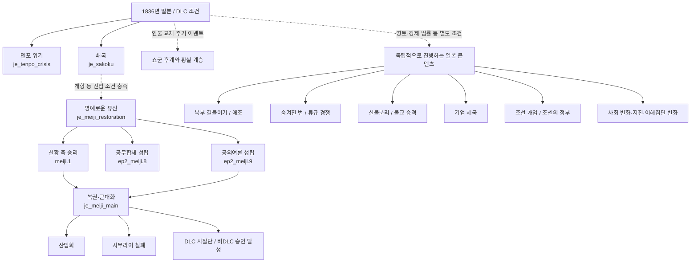
```mermaid
flowchart TD
    START["1836년 일본 / DLC 조건"] --> TENPO["덴포 위기<br/>je_tenpo_crisis"]
    START --> SAKOKU["쇄국<br/>je_sakoku"]
    START -. "인물 교체·주기 이벤트" .-> DYNASTY["쇼군 후계와 황실 계승"]
    SAKOKU -. "개항 등 진입 조건 충족" .-> RESTORE["명예로운 유신<br/>je_meiji_restoration"]
    RESTORE --> EMPEROR["천황 측 승리<br/>meiji.1"]
    RESTORE --> KOBU["공무합체 성립<br/>ep2_meiji.8"]
    RESTORE --> KOGI["공의여론 성립<br/>ep2_meiji.9"]
    EMPEROR --> MODERN["복권·근대화<br/>je_meiji_main"]
    KOGI --> MODERN
    MODERN --> ECON["산업화"]
    MODERN --> ARMY["사무라이 철폐"]
    MODERN --> DIP["DLC 사절단 / 비DLC 승인 달성"]
    START -. "영토·경제·법률 등 별도 조건" .-> PARALLEL["독립적으로 진행하는 일본 콘텐츠"]
    PARALLEL --> NORTH["북부 길들이기 / 에조"]
    PARALLEL --> RYUKYU["숨겨진 번 / 류큐 경쟁"]
    PARALLEL --> RELIGION["신불분리 / 불교 승격"]
    PARALLEL --> ZAIBATSU["기업 제국"]
    PARALLEL --> KOREA["조선 개입 / 조센의 정부"]
    PARALLEL --> FLAVOR["사회 변화·지진·이해집단 변화"]
```

공무합체 결말 `ep2_meiji.8`에는 `je_meiji_main`을 추가하는 처리가 없다. 공의여론 결말 `ep2_meiji.9`와 천황 측 승리 `meiji.1`은 근대화 저널을 연결한다. ‘개항 → 유신’ 화살표는 쇄국 저널의 직접 호출이 아니라 유신 저널의 활성 조건 변화다.

### 2. 덴포 위기와 쇄국

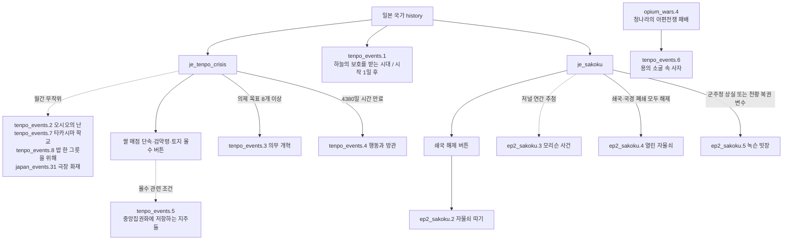
```mermaid
flowchart TD
    HISTORY["일본 국가 history"] --> T["je_tenpo_crisis"]
    HISTORY --> T1["tenpo_events.1<br/>하늘의 보호를 받는 시대 / 시작 1일 후"]
    T -. "월간 무작위" .-> TP["tenpo_events.2 오시오의 난<br/>tenpo_events.7 타카시마 학교<br/>tenpo_events.8 밥 한 그릇을 위해<br/>japan_events.31 극장 화재"]
    T --> TB["쌀 매점 단속·검약령·토지 몰수 버튼"]
    TB -. "몰수 관련 조건" .-> T5["tenpo_events.5<br/>중앙집권화에 저항하는 지주들"]
    T -->|"의제 목표 8개 이상"| T3["tenpo_events.3 의무 개혁"]
    T -->|"4380일 시간 만료"| T4["tenpo_events.4 행동과 방관"]
    OPIUM["opium_wars.4<br/>청나라의 아편전쟁 패배"] --> T6["tenpo_events.6<br/>용의 소굴 속 사자"]
    HISTORY --> S["je_sakoku"]
    S --> SB["쇄국 해제 버튼"] --> S2["ep2_sakoku.2 자물쇠 따기"]
    S -. "저널 연간 추첨" .-> S3["ep2_sakoku.3 모리슨 사건"]
    S -->|"쇄국·국경 폐쇄 모두 해제"| S4["ep2_sakoku.4 열린 자물쇠"]
    S -->|"군주정 상실 또는 천황 복권 변수"| S5["ep2_sakoku.5 녹슨 빗장"]
```

덴포 위기 성공·실패는 쇄국 또는 유신 저널의 필수 선행 완료 조건이 아니다. `tenpo_events.6`도 덴포 위기 저널의 완료 이벤트가 아니라 외부 아편전쟁 결과에서 연결된다.

### 3. 명예로운 유신과 막부의 두 전략

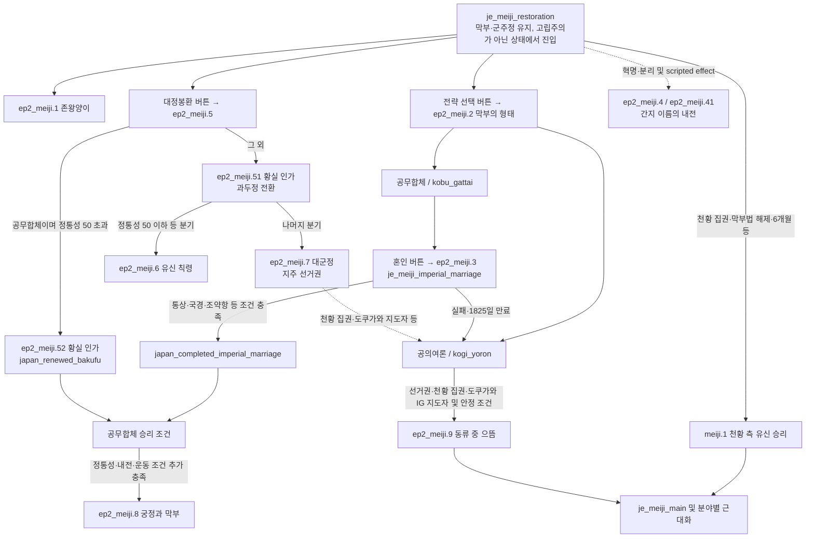
```mermaid
flowchart TD
    JE["je_meiji_restoration<br/>막부·군주정 유지, 고립주의가 아닌 상태에서 진입"] --> INTRO["ep2_meiji.1 존왕양이"]
    JE --> STRATEGY["전략 선택 버튼 → ep2_meiji.2 막부의 형태"]
    STRATEGY --> KOBU["공무합체 / kobu_gattai"]
    STRATEGY --> KOGI["공의여론 / kogi_yoron"]
    KOBU --> MARRIAGE["혼인 버튼 → ep2_meiji.3<br/>je_meiji_imperial_marriage"]
    MARRIAGE -->|"통상·국경·조약항 등 조건 충족"| MARRIED["japan_completed_imperial_marriage"]
    MARRIAGE -->|"실패·1825일 만료"| KOGI
    JE --> RETURN["대정봉환 버튼 → ep2_meiji.5"]
    RETURN -->|"공무합체이며 정통성 50 초과"| AUTH52["ep2_meiji.52 황실 인가<br/>japan_renewed_bakufu"]
    RETURN -->|"그 외"| AUTH51["ep2_meiji.51 황실 인가<br/>과두정 전환"]
    AUTH51 -->|"정통성 50 이하 등 분기"| DECREE["ep2_meiji.6 유신 칙령"]
    AUTH51 -->|"나머지 분기"| TAIKUN["ep2_meiji.7 대군정<br/>지주 선거권"]
    TAIKUN -. "천황 집권·도쿠가와 지도자 등" .-> KOGI
    MARRIED --> KOBUWIN["공무합체 승리 조건"]
    AUTH52 --> KOBUWIN
    KOBUWIN -->|"정통성·내전·운동 조건 추가 충족"| END8["ep2_meiji.8 궁정과 막부"]
    KOGI -->|"선거권·천황 집권·도쿠가와 IG 지도자 및 안정 조건"| END9["ep2_meiji.9 동류 중 으뜸"]
    JE -->|"천황 집권·막부법 해제·6개월 등"| END1["meiji.1 천황 측 유신 승리"]
    END1 --> REFORMS["je_meiji_main 및 분야별 근대화"]
    END9 --> REFORMS
    JE -. "혁명·분리 및 scripted effect" .-> WAR["ep2_meiji.4 / ep2_meiji.41<br/>간지 이름의 내전"]
```

- 내부적으로 천황 승리는 `complete`, 막부 승리는 `fail`이다. 화면의 사용자 정의 제목은 이를 각 진영의 승리로 표시한다.
- 공무합체 승리는 막부법·막부 재인가·황실 혼인을 요구한다. 공의여론 승리는 천황 집권·선거권·도쿠가와 가문 이해집단 지도자와 정부 참여를 요구한다.
- 두 막부 승리 경로는 정통성 75 이상, 진행 중 내전 부재, 존왕양이 운동의 지지도 또는 급진성 조건도 확인한다.
- `ep2_meiji.51`과 `.52`는 서로 다른 황실 인가 사건이다. `.51`은 정권 전환, `.52`는 막부 재인가로 이어지므로 혼동하면 안 된다.
- 양측 결말에서 `japan_restoration_complete`를 사용한다. `japan_emperor_restored`는 천황 복권 여부를 따로 기록한다.

#### 유신 정국의 월간 사건

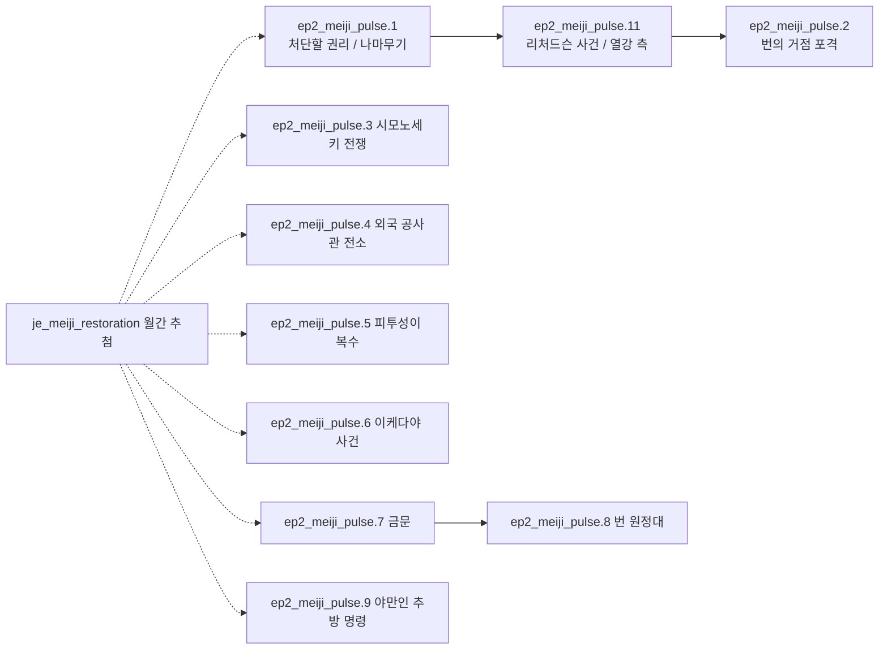
```mermaid
flowchart LR
    JE["je_meiji_restoration 월간 추첨"] -.-> P1["ep2_meiji_pulse.1<br/>처단할 권리 / 나마무기"]
    P1 --> P11["ep2_meiji_pulse.11<br/>리처드슨 사건 / 열강 측"] --> P2["ep2_meiji_pulse.2<br/>번의 거점 포격"]
    JE -.-> P3["ep2_meiji_pulse.3 시모노세키 전쟁"]
    JE -.-> P4["ep2_meiji_pulse.4 외국 공사관 전소"]
    JE -.-> P5["ep2_meiji_pulse.5 피투성이 복수"]
    JE -.-> P6["ep2_meiji_pulse.6 이케다야 사건"]
    JE -.-> P7["ep2_meiji_pulse.7 금문"] --> P8["ep2_meiji_pulse.8 번 원정대"]
    JE -.-> P9["ep2_meiji_pulse.9 야만인 추방 명령"]
```

추첨 대상에 있어도 각 이벤트 trigger를 충족해야 한다. 후속 사건 역시 선택지·분기 조건에 따라 호출된다.

### 4. 근대화와 해외 사절단

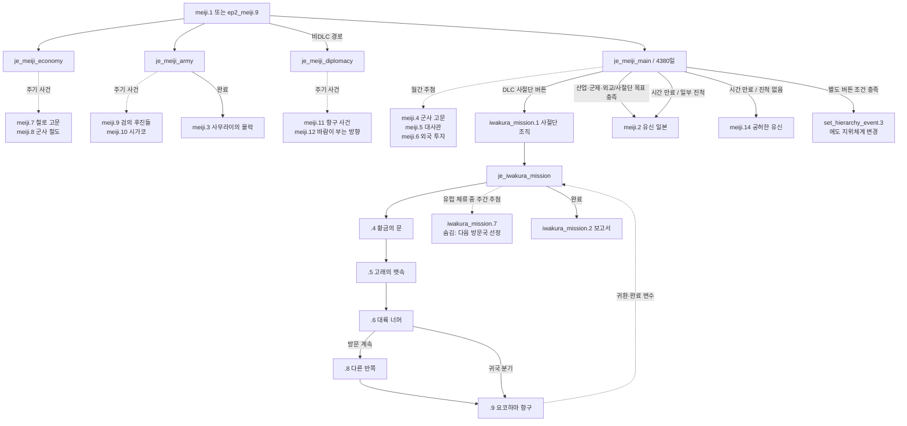
```mermaid
flowchart TD
    END["meiji.1 또는 ep2_meiji.9"] --> MAIN["je_meiji_main / 4380일"]
    END --> ECON["je_meiji_economy"]
    END --> ARMY["je_meiji_army"]
    END -->|"비DLC 경로"| DIP["je_meiji_diplomacy"]
    ECON -. "주기 사건" .-> E["meiji.7 철로 고문<br/>meiji.8 군사 철도"]
    ARMY -. "주기 사건" .-> A["meiji.9 검의 후진들<br/>meiji.10 시가코"]
    ARMY -->|"완료"| A3["meiji.3 사무라이의 몰락"]
    DIP -. "주기 사건" .-> D["meiji.11 항구 사건<br/>meiji.12 바람이 부는 방향"]
    MAIN -. "월간 추첨" .-> P["meiji.4 군사 고문<br/>meiji.5 대사관<br/>meiji.6 외국 투자"]
    MAIN -->|"DLC 사절단 버튼"| I1["iwakura_mission.1 사절단 조직"]
    I1 --> IJ["je_iwakura_mission"] --> I4[".4 황금의 문"] --> I5[".5 고래의 뱃속"] --> I6[".6 대륙 너머"]
    I6 -->|"방문 계속"| I8[".8 다른 반쪽"] --> I9[".9 요코하마 항구"]
    I6 -->|"귀국 분기"| I9
    IJ -. "유럽 체류 중 주간 추첨" .-> I7["iwakura_mission.7<br/>숨김: 다음 방문국 선정"]
    I9 -. "귀환·완료 변수" .-> IJ
    IJ -->|"완료"| I2["iwakura_mission.2 보고서"]
    MAIN -->|"산업·군제·외교/사절단 목표 충족"| SUCCESS["meiji.2 유신 일본"]
    MAIN -->|"시간 만료 / 일부 진척"| SUCCESS
    MAIN -->|"시간 만료 / 진척 없음"| EMPTY["meiji.14 공허한 유신"]
    MAIN -->|"별도 버튼 조건 충족"| EDO["set_hierarchy_event.3<br/>에도 지위체계 변경"]
```

그림의 `.4`~`.9`는 `iwakura_mission` 네임스페이스다. 이미 완료 조건을 갖춘 분야는 시작 사건에서 즉시 달성 처리하거나 관련 완료 사건을 호출할 수 있으므로, 모든 세부 저널이 반드시 동시에 생성되는 것은 아니다. 사절단에는 소환 버튼과 귀국 처리도 있으며, 방문·귀환은 단순한 일회성 이벤트 순서 이상의 변수로 관리한다.

`meiji.13` ‘일본 개항’은 강제 개항 modifier를 조건으로 가진 `orphan = yes` 정의다. 현재 활성 스크립트에서 직접 호출원을 찾지 못했으므로 확정 실행 경로에는 넣지 않았다. `je_meiji_main` 완료 사건도 아니다.

### 5. 쇼군·천황 계승

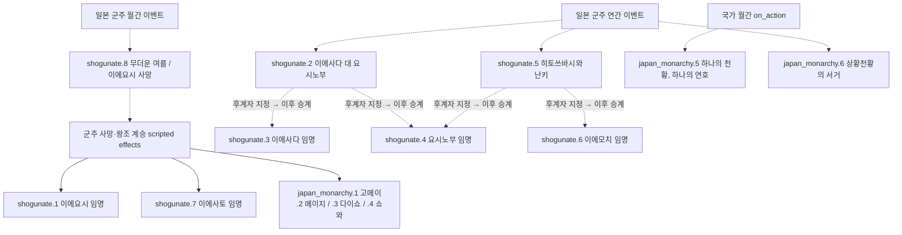
```mermaid
flowchart TD
    SUCCESSION["군주 사망·왕조 계승 scripted effects"] --> IEYOSHI["shogunate.1 이에요시 임명"]
    YEAR["일본 군주 연간 이벤트"] -.-> DEBATE1["shogunate.2 이에사다 대 요시노부"]
    DEBATE1 -. "후계자 지정 → 이후 승계" .-> IESADA["shogunate.3 이에사다 임명"]
    DEBATE1 -. "후계자 지정 → 이후 승계" .-> YOSHINOBU["shogunate.4 요시노부 임명"]
    YEAR -.-> DEBATE2["shogunate.5 히토쓰바시와 난키"]
    DEBATE2 -. "후계자 지정 → 이후 승계" .-> IEMOCHI["shogunate.6 이에모치 임명"]
    DEBATE2 -. "후계자 지정 → 이후 승계" .-> YOSHINOBU
    SUCCESSION --> IESATO["shogunate.7 이에사토 임명"]
    MONTH["일본 군주 월간 이벤트"] -.-> DEATH["shogunate.8 무더운 여름 / 이에요시 사망"]
    DEATH -.-> SUCCESSION
    SUCCESSION --> EMP["japan_monarchy.1 고메이<br/>.2 메이지 / .3 다이쇼 / .4 쇼와"]
    LAWEVENT["국가 월간 on_action"] -.-> ERA["japan_monarchy.5 하나의 천황, 하나의 연호"]
    YEAR -.-> RETIRED["japan_monarchy.6 상황천황의 서거"]
```

임명 사건들이 서로를 차례로 직접 호출하는 구조가 아니다. 후계자를 정한 뒤 인물 사망·계승 효과가 해당 임명 사건을 호출한다. 바닐라의 `.2`, `.5`는 실제 `set_heir`를 사용한다. 황실 계승과 쇼군 집권은 별도의 인물·법률 처리로 연결된다.

### 6. 종교 노선

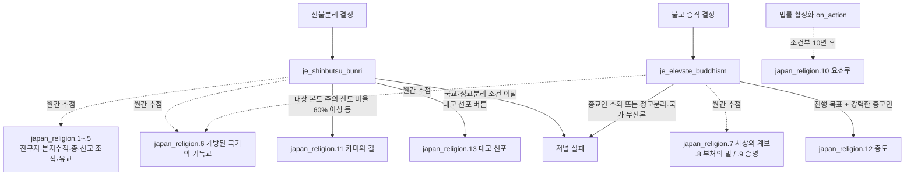
```mermaid
flowchart TD
    SD["신불분리 결정"] --> S["je_shinbutsu_bunri"]
    S -. "월간 추첨" .-> SP["japan_religion.1~.5<br/>진구지·본지수적·종·선교 조직·유교"]
    S -. "월간 추첨" .-> CHRISTIAN["japan_religion.6 개방된 국가의 기독교"]
    S -->|"대상 본토 주의 신토 비율 60% 이상 등"| S11["japan_religion.11 카미의 길"]
    S -->|"대교 선포 버튼"| S13["japan_religion.13 대교 선포"]
    BD["불교 승격 결정"] --> B["je_elevate_buddhism"]
    B -. "월간 추첨" .-> BP["japan_religion.7 사상의 계보<br/>.8 부처의 말 / .9 승병"]
    B -. "월간 추첨" .-> CHRISTIAN
    B -->|"진행 목표 + 강력한 종교인"| B12["japan_religion.12 중도"]
    LAW["법률 활성화 on_action"] -. "조건부 10년 후" .-> FOOD["japan_religion.10 요쇼쿠"]
    S -->|"국교·정교분리 조건 이탈"| FAIL["저널 실패"]
    B -->|"종교인 소외 또는 정교분리·국가 무신론"| FAIL
```

이 두 저널은 유신 완료 보상으로 자동 생성되는 공통 후속 저널이 아니라 각 결정에서 시작한다.

### 7. 개척·류큐·조선·재벌


```mermaid
flowchart TD
    NORTH["je_taming_the_north<br/>홋카이도 전역·편입·도시 조건"] --> N1["hokkaido_events.1 여덟 번째 도"]
    NORTH --> NB["개척·아이누·농학교·농업 확장 버튼"] --> NP["hokkaido_events.2~.6"]
    NORTH -->|"인구·GDP·농업 확장·식민지 목표"| N7["hokkaido_events.7 개척사의 종막"]
    NORTH -->|"홋카이도 상실"| N8["hokkaido_events.8 대의를 잃은 개척사"]
    EZO["국가 월간 on_action / 에조 관련 조건"] -.-> E2["ezo_republic.2 하코다테 원정"] --> E1["ezo_republic.1 에조 정부"]
    R["je_ryukyu_rivalry<br/>일본 개방·청·류큐 존재"] --> R8["ryukyu_rivalry.8 숨겨진 번"]
    R --> RB["종주권·상인·방어·종교 권위 버튼"] --> RP["ryukyu_rivalry.1~.4"]
    R -. "연간 경합" .-> R6["ryukyu_rivalry.6 대립"]
    R -->|"일본 +40 / 청 -40"| R5["ryukyu_rivalry.5 류큐의 운명"]
    R -->|"류큐 독자 진행 100"| R7["ryukyu_rivalry.7 류큐 칙령"]
    K1["je_donghak_movement / 동학"] -. "청원·봉기 경로" .-> K2["je_gyojo_shinwon / 교조 신원"]
    K1 -. "혁명 발생" .-> K3["je_korean_rebellion / 조선 혁명"]
    K3 -. "외국 개입 사건" .-> K7["gg_korea.7 조선 봉기"]
    K3 -->|"정부 승리 및 개입 조건"| K8["gg_korea.8 일본 측 요구"] --> K9["gg_korea.9 청나라 측 응답"]
    TERRITORY["조선 5개 주 전역 소유·식민부"] --> KC["je_colonize_korea"]
    KC -->|"편입·문화·소요·산업·행정 목표"| KC2["korea_colonization.2 유망한 미래"]
    KC -->|"지배 상실 조건"| KC3["korea_colonization.3 사라진 기회"]
    Z["je_zaibatsu / 기업 제국"] -->|"재벌 소유·번영 확대"| Z1["zaibatsu.1 기업 제국"]
    Z -->|"재벌 억제 조건"| Z2["zaibatsu.2 통제 확립"]
```

조선 혁명·청일 간 개입과 조선 식민통치 저널은 서로 다른 시스템이다. `gg_korea.9`를 통과했다고 `je_colonize_korea`가 자동으로 완료되거나 바로 시작되는 것은 아니다. 류큐의 ±40은 영향력 점수이고, 100은 별도의 류큐 진행도다. 재벌 저널은 유신 성공 여부만으로 시작하지 않으며 경제·기업·법률 조건을 따로 확인한다.

### 8. 독립적인 사회·정치·재난 사건

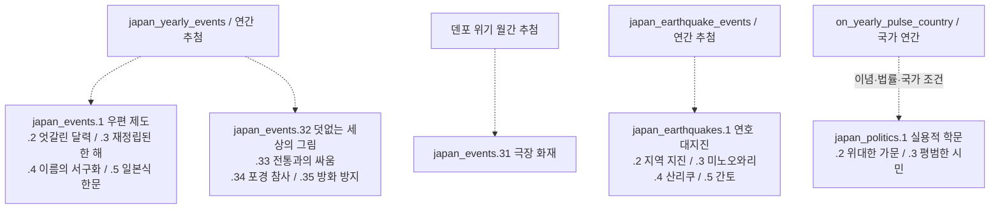
```mermaid
flowchart TD
    Y["japan_yearly_events / 연간 추첨"] -.-> SOCIAL["japan_events.1 우편 제도<br/>.2 엇갈린 달력 / .3 재정립된 한 해<br/>.4 이름의 서구화 / .5 일본식 한문"]
    Y -.-> CULTURE["japan_events.32 덧없는 세상의 그림<br/>.33 전통과의 싸움<br/>.34 포경 참사 / .35 방화 방지"]
    T["덴포 위기 월간 추첨"] -.-> FIRE["japan_events.31 극장 화재"]
    Q["japan_earthquake_events / 연간 추첨"] -.-> QUAKES["japan_earthquakes.1 연호 대지진<br/>.2 지역 지진 / .3 미노오와리<br/>.4 산리쿠 / .5 간토"]
    IG["on_yearly_pulse_country / 국가 연간"] -. "이념·법률·국가 조건" .-> POLITICS["japan_politics.1 실용적 학문<br/>.2 위대한 가문 / .3 평범한 시민"]
```

각 사건은 자체 연도·기술·법률·건물·인물 조건을 갖는다. 예컨대 달력 사건과 재벌 명칭 변화는 별도의 조건을 검사하므로 목록 순서가 발생 순서를 보장하지 않는다.


### 9. 저널 전체 목록

일본 핵심 저널 **15개**, 조선 개입 연결 저널 **3개**다.

| ID | 한국어 표시명 | 활성·진행·종료 요약 | 정의 |
|---|---|---|---|
| `je_meiji_restoration` | 명예로운 유신 | 개항 조건에서 시작. 천황 승리는 meiji.1, 공무합체는 ep2_meiji.8, 공의여론은 ep2_meiji.9. 막부 승리는 내부 fail 분기. | [00_meiji_restoration.txt](<D:/SteamLibrary/steamapps/common/Victoria 3/game/common/journal_entries/00_meiji_restoration.txt:1>) |
| `je_meiji_imperial_marriage` | 황실 결혼 | ep2_meiji.3에서 추가. 조약·국경·통상 조건을 충족하면 혼인 완수 변수. 실패·5년 만료 시 공의여론으로 전환. | [00_meiji_restoration.txt](<D:/SteamLibrary/steamapps/common/Victoria 3/game/common/journal_entries/00_meiji_restoration.txt:496>) |
| `je_meiji_main` | [ROOT.Var('emperor_var').GetCharacter.GetFirstName] 복권 | 천황 복권 또는 공의여론 결말에서 추가. 산업·군제·외교/사절단 진행을 통합. meiji.2 또는 meiji.14로 종료. | [00_meiji_restoration.txt](<D:/SteamLibrary/steamapps/common/Victoria 3/game/common/journal_entries/00_meiji_restoration.txt:640>) |
| `je_meiji_economy` | 유신: 일본 산업화 | 산업화 목표. meiji.7·.8을 주기적으로 추첨하며 완료 시 경제 개혁 달성 기록. | [00_meiji_restoration.txt](<D:/SteamLibrary/steamapps/common/Victoria 3/game/common/journal_entries/00_meiji_restoration.txt:744>) |
| `je_meiji_army` | 유신: 사무라이 철폐 | 군제·사무라이 개혁 목표. meiji.9·.10 추첨, 완료 시 meiji.3. | [00_meiji_restoration.txt](<D:/SteamLibrary/steamapps/common/Victoria 3/game/common/journal_entries/00_meiji_restoration.txt:792>) |
| `je_meiji_diplomacy` | 유신: 승인 달성 | 비DLC 근대화의 승인 달성 분야. meiji.11·.12 추첨. DLC에서는 사절단 경로를 사용. | [00_meiji_restoration.txt](<D:/SteamLibrary/steamapps/common/Victoria 3/game/common/journal_entries/00_meiji_restoration.txt:851>) |
| `je_ryukyu_rivalry` | 숨겨진 번 | 일본·청·류큐의 별도 경합. 일본 영향력 +40 또는 청 영향력 -40, 류큐 진행도 100 등으로 결과 분기. | [01_ryukyu_rivalry.txt](<D:/SteamLibrary/steamapps/common/Victoria 3/game/common/journal_entries/01_ryukyu_rivalry.txt:1>) |
| `je_taming_the_north` | 북부 길들이기 | 일본 또는 에조. 홋카이도 전역 소유·편입·도시 조건. 개척 버튼과 인구·GDP 목표; .7 성공 / .8 일본의 실패. | [07_hokkaido.txt](<D:/SteamLibrary/steamapps/common/Victoria 3/game/common/journal_entries/07_hokkaido.txt:1>) |
| `je_iwakura_mission` | 유신: [ROOT.Var('expedition_leader_storage_var').GetCharacter.GetLastName] 사절단 | iwakura_mission.1에서 추가. .4부터 여정 시작, 유럽 주간 .7, 귀환 및 완료 조건으로 .2 보고서. | [07_iwakura_mission.txt](<D:/SteamLibrary/steamapps/common/Victoria 3/game/common/journal_entries/07_iwakura_mission.txt:1>) |
| `je_shinbutsu_bunri` | 신불분리 | 신불분리 결정으로 시작. 신토 확산, 종교 사건 .1~.6, 완료 .11. | [07_japanese_religion.txt](<D:/SteamLibrary/steamapps/common/Victoria 3/game/common/journal_entries/07_japanese_religion.txt:1>) |
| `je_elevate_buddhism` | 불교 승격 | 불교 승격 결정으로 시작. 강력한 종교인을 유지해 진행 60 달성, 종교 사건 .6~.9, 완료 .12. | [07_japanese_religion.txt](<D:/SteamLibrary/steamapps/common/Victoria 3/game/common/journal_entries/07_japanese_religion.txt:155>) |
| `je_colonize_korea` | 조센의 정부 | 조선 5개 주 전역 소유와 식민부 조건. 편입·일본 문화·소요·기업·산업·행정 목표, .2 성공 / .3 실패. | [07_korea_colonization.txt](<D:/SteamLibrary/steamapps/common/Victoria 3/game/common/journal_entries/07_korea_colonization.txt:1>) |
| `je_sakoku` | 쇄국 | DLC 일본 시작 history에서 추가. 쇄국과 국경 폐쇄 해제 시 ep2_sakoku.4, 군주정 상실·천황 복권 시 .5. | [07_sakoku.txt](<D:/SteamLibrary/steamapps/common/Victoria 3/game/common/journal_entries/07_sakoku.txt:1>) |
| `je_tenpo_crisis` | 덴포 위기 | DLC 일본 시작 history에서 추가. 의제 목표 8개 이상 시 tenpo_events.3, 4380일 만료 시 .4. | [07_tenpo_crisis.txt](<D:/SteamLibrary/steamapps/common/Victoria 3/game/common/journal_entries/07_tenpo_crisis.txt:1>) |
| `je_zaibatsu` | 기업 제국 | 개방·경제법·산업가·재벌 소유 조건. 재벌 번영 확대 시 zaibatsu.1, 통제 확립 시 .2. | [07_zaibatsu.txt](<D:/SteamLibrary/steamapps/common/Victoria 3/game/common/journal_entries/07_zaibatsu.txt:1>) |
| `je_donghak_movement` | 동학 농민 운동 | 조선의 동학 기반 저널. gg_korea.1 시작, .4 청원 사건, 실패 .2 봉기. | [03_korea.txt](<D:/SteamLibrary/steamapps/common/Victoria 3/game/common/journal_entries/03_korea.txt:1>) |
| `je_gyojo_shinwon` | 교조 신원 운동 | gg_korea.4의 교조 신원 청원에서 추가. gg_korea.5 성공 / .6 시간 만료. | [03_korea.txt](<D:/SteamLibrary/steamapps/common/Victoria 3/game/common/journal_entries/03_korea.txt:97>) |
| `je_korean_rebellion` | 조선 혁명 | 조선 혁명과 외국 개입을 추적. 정부 승리·개입 조건에서 gg_korea.8 일본 측 요구 → .9 청나라 응답. | [03_korea.txt](<D:/SteamLibrary/steamapps/common/Victoria 3/game/common/journal_entries/03_korea.txt:189>) |

### 10. 일본 이벤트 전체 목록

일본 전용 디렉터리와 기본 유신 파일의 이벤트는 **124개**다. 여기에는 `ep2_meiji.1000` 디버그 사건 1개도 포함된다.

호출원은 실제 `trigger_event`, 가중 이벤트 목록, on_action의 이벤트 목록을 역추적한 결과다. 조건 분기 전체를 표에 반복하지는 않는다. scripted effect가 호출원인 경우 해당 효과를 실행하는 상위 시스템도 함께 작동해야 한다.

#### ep2_ezo_republic.txt — 2개

| 이벤트 ID | 한국어 제목 | 확인된 호출원 |
|---|---|---|
| [ezo_republic.1](<D:/SteamLibrary/steamapps/common/Victoria 3/game/events/japan_events/ep2_ezo_republic.txt:3>) | 에조 정부 | [ezo_republic.2](<D:/SteamLibrary/steamapps/common/Victoria 3/game/events/japan_events/ep2_ezo_republic.txt:399>) |
| [ezo_republic.2](<D:/SteamLibrary/steamapps/common/Victoria 3/game/events/japan_events/ep2_ezo_republic.txt:194>) | 하코다테 원정 | [on_monthly_pulse_country](<D:/SteamLibrary/steamapps/common/Victoria 3/game/common/on_actions/00_code_on_actions.txt:563>) |

#### ep2_hokkaido_events.txt — 8개

| 이벤트 ID | 한국어 제목 | 확인된 호출원 |
|---|---|---|
| [hokkaido_events.1](<D:/SteamLibrary/steamapps/common/Victoria 3/game/events/japan_events/ep2_hokkaido_events.txt:4>) | 여덟 번째 도 / 북부의 관문 | [je_taming_the_north](<D:/SteamLibrary/steamapps/common/Victoria 3/game/common/journal_entries/07_hokkaido.txt:72>) |
| [hokkaido_events.2](<D:/SteamLibrary/steamapps/common/Victoria 3/game/events/japan_events/ep2_hokkaido_events.txt:242>) | 새로운 개척지 | [button_je_taming_the_north_establish_colonies](<D:/SteamLibrary/steamapps/common/Victoria 3/game/common/scripted_buttons/07_japan_buttons.txt:221>) |
| [hokkaido_events.3](<D:/SteamLibrary/steamapps/common/Victoria 3/game/events/japan_events/ep2_hokkaido_events.txt:446>) | 진보의 씨앗 | [button_je_taming_the_north_agriculture_potentials](<D:/SteamLibrary/steamapps/common/Victoria 3/game/common/scripted_buttons/07_japan_buttons.txt:414>) |
| [hokkaido_events.4](<D:/SteamLibrary/steamapps/common/Victoria 3/game/events/japan_events/ep2_hokkaido_events.txt:632>) | 토양의 성장 | [button_je_taming_the_north_agriculture_arable_land](<D:/SteamLibrary/steamapps/common/Victoria 3/game/common/scripted_buttons/07_japan_buttons.txt:501>) |
| [hokkaido_events.5](<D:/SteamLibrary/steamapps/common/Victoria 3/game/events/japan_events/ep2_hokkaido_events.txt:818>) | 소년이여, 야망을 품어라... | [button_je_taming_the_north_sapporo_agricultural_college](<D:/SteamLibrary/steamapps/common/Victoria 3/game/common/scripted_buttons/07_japan_buttons.txt:362>) |
| [hokkaido_events.6](<D:/SteamLibrary/steamapps/common/Victoria 3/game/events/japan_events/ep2_hokkaido_events.txt:968>) | 아이누 모시르, 시삼 모시르 | [button_je_taming_the_north_integrate_ainu](<D:/SteamLibrary/steamapps/common/Victoria 3/game/common/scripted_buttons/07_japan_buttons.txt:266>) |
| [hokkaido_events.7](<D:/SteamLibrary/steamapps/common/Victoria 3/game/events/japan_events/ep2_hokkaido_events.txt:1074>) | 개척사의 종막 | [je_taming_the_north](<D:/SteamLibrary/steamapps/common/Victoria 3/game/common/journal_entries/07_hokkaido.txt:146>) |
| [hokkaido_events.8](<D:/SteamLibrary/steamapps/common/Victoria 3/game/events/japan_events/ep2_hokkaido_events.txt:1199>) | 대의를 잃은 개척사 | [je_taming_the_north](<D:/SteamLibrary/steamapps/common/Victoria 3/game/common/journal_entries/07_hokkaido.txt:246>) |

#### ep2_imperial_events.txt — 6개

| 이벤트 ID | 한국어 제목 | 확인된 호출원 |
|---|---|---|
| [japan_monarchy.1](<D:/SteamLibrary/steamapps/common/Victoria 3/game/events/japan_events/ep2_imperial_events.txt:4>) | 가에이 시대 / 덴큐 시대 | [on_remove_ruler_effects](<D:/SteamLibrary/steamapps/common/Victoria 3/game/common/scripted_effects/00_victoria_ep2_scripted_effects.txt:2813>)<br/>[character_japan_imperial_succession_chain_effect](<D:/SteamLibrary/steamapps/common/Victoria 3/game/common/scripted_effects/00_victoria_royal_successions.txt:956>) |
| [japan_monarchy.2](<D:/SteamLibrary/steamapps/common/Victoria 3/game/events/japan_events/ep2_imperial_events.txt:152>) | 메이지 시대 | [on_remove_ruler_effects](<D:/SteamLibrary/steamapps/common/Victoria 3/game/common/scripted_effects/00_victoria_ep2_scripted_effects.txt:2827>)<br/>[character_japan_imperial_succession_chain_effect](<D:/SteamLibrary/steamapps/common/Victoria 3/game/common/scripted_effects/00_victoria_royal_successions.txt:994>) |
| [japan_monarchy.3](<D:/SteamLibrary/steamapps/common/Victoria 3/game/events/japan_events/ep2_imperial_events.txt:240>) | 다이쇼 시대 | [on_remove_ruler_effects](<D:/SteamLibrary/steamapps/common/Victoria 3/game/common/scripted_effects/00_victoria_ep2_scripted_effects.txt:2841>)<br/>[character_japan_imperial_succession_chain_effect](<D:/SteamLibrary/steamapps/common/Victoria 3/game/common/scripted_effects/00_victoria_royal_successions.txt:1025>) |
| [japan_monarchy.4](<D:/SteamLibrary/steamapps/common/Victoria 3/game/events/japan_events/ep2_imperial_events.txt:327>) | 쇼와 시대 | [on_remove_ruler_effects](<D:/SteamLibrary/steamapps/common/Victoria 3/game/common/scripted_effects/00_victoria_ep2_scripted_effects.txt:2855>)<br/>[character_japan_imperial_succession_chain_effect](<D:/SteamLibrary/steamapps/common/Victoria 3/game/common/scripted_effects/00_victoria_royal_successions.txt:1055>) |
| [japan_monarchy.5](<D:/SteamLibrary/steamapps/common/Victoria 3/game/events/japan_events/ep2_imperial_events.txt:414>) | 하나의 천황, 하나의 연호 | [on_monthly_pulse_country](<D:/SteamLibrary/steamapps/common/Victoria 3/game/common/on_actions/00_code_on_actions.txt:560>) |
| [japan_monarchy.6](<D:/SteamLibrary/steamapps/common/Victoria 3/game/events/japan_events/ep2_imperial_events.txt:463>) | 상황천황의 서거 | [japan_monarchy_yearly_events](<D:/SteamLibrary/steamapps/common/Victoria 3/game/common/on_actions/00_on_actions_yearly.txt:263>) |

#### ep2_iwakura_events.txt — 8개

| 이벤트 ID | 한국어 제목 | 확인된 호출원 |
|---|---|---|
| [iwakura_mission.1](<D:/SteamLibrary/steamapps/common/Victoria 3/game/events/japan_events/ep2_iwakura_events.txt:4>) | 서양으로 가는 사절단 | [je_iwakura_mission_button](<D:/SteamLibrary/steamapps/common/Victoria 3/game/common/scripted_buttons/meiji_reform_buttons.txt:36>) |
| [iwakura_mission.2](<D:/SteamLibrary/steamapps/common/Victoria 3/game/events/japan_events/ep2_iwakura_events.txt:189>) | [ROOT.Var('expedition_leader_storage_var').GetCharacter.GetLastName] 보고서 | [je_iwakura_mission](<D:/SteamLibrary/steamapps/common/Victoria 3/game/common/journal_entries/07_iwakura_mission.txt:116>) |
| [iwakura_mission.4](<D:/SteamLibrary/steamapps/common/Victoria 3/game/events/japan_events/ep2_iwakura_events.txt:418>) | 황금의 문 | [je_iwakura_mission](<D:/SteamLibrary/steamapps/common/Victoria 3/game/common/journal_entries/07_iwakura_mission.txt:69>) |
| [iwakura_mission.5](<D:/SteamLibrary/steamapps/common/Victoria 3/game/events/japan_events/ep2_iwakura_events.txt:489>) | 고래의 뱃속 | [iwakura_mission.4](<D:/SteamLibrary/steamapps/common/Victoria 3/game/events/japan_events/ep2_iwakura_events.txt:478>) |
| [iwakura_mission.6](<D:/SteamLibrary/steamapps/common/Victoria 3/game/events/japan_events/ep2_iwakura_events.txt:561>) | 대륙 너머 | [iwakura_mission.5](<D:/SteamLibrary/steamapps/common/Victoria 3/game/events/japan_events/ep2_iwakura_events.txt:550>) |
| [iwakura_mission.7](<D:/SteamLibrary/steamapps/common/Victoria 3/game/events/japan_events/ep2_iwakura_events.txt:678>) | 숨김 처리: 유럽의 다음 방문국 선정 | [je_iwakura_mission](<D:/SteamLibrary/steamapps/common/Victoria 3/game/common/journal_entries/07_iwakura_mission.txt:91>) |
| [iwakura_mission.8](<D:/SteamLibrary/steamapps/common/Victoria 3/game/events/japan_events/ep2_iwakura_events.txt:799>) | 다른 반쪽 | [iwakura_mission.6](<D:/SteamLibrary/steamapps/common/Victoria 3/game/events/japan_events/ep2_iwakura_events.txt:641>) |
| [iwakura_mission.9](<D:/SteamLibrary/steamapps/common/Victoria 3/game/events/japan_events/ep2_iwakura_events.txt:901>) | 요코하마 항구 | [je_iwakura_mission_recall_mission](<D:/SteamLibrary/steamapps/common/Victoria 3/game/common/scripted_buttons/07_iwakura_buttons.txt:33>)<br/>[iwakura_mission.6](<D:/SteamLibrary/steamapps/common/Victoria 3/game/events/japan_events/ep2_iwakura_events.txt:644>)<br/>[iwakura_mission.8](<D:/SteamLibrary/steamapps/common/Victoria 3/game/events/japan_events/ep2_iwakura_events.txt:889>) |

#### ep2_japan_earthquake_events.txt — 5개

| 이벤트 ID | 한국어 제목 | 확인된 호출원 |
|---|---|---|
| [japan_earthquakes.1](<D:/SteamLibrary/steamapps/common/Victoria 3/game/events/japan_events/ep2_japan_earthquake_events.txt:7>) | [ROOT.GetCountry.GetCustom('JAP_era_name')] 대지진 | [japan_earthquake_events](<D:/SteamLibrary/steamapps/common/Victoria 3/game/common/on_actions/00_on_actions_yearly.txt:613>) |
| [japan_earthquakes.2](<D:/SteamLibrary/steamapps/common/Victoria 3/game/events/japan_events/ep2_japan_earthquake_events.txt:117>) | [ROOT.GetCountry.GetCustom('JAP_era_name')] [SCOPE.sState('japan_earthquake_state').GetCityHubName] 지진 | [japan_earthquake_events](<D:/SteamLibrary/steamapps/common/Victoria 3/game/common/on_actions/00_on_actions_yearly.txt:614>) |
| [japan_earthquakes.3](<D:/SteamLibrary/steamapps/common/Victoria 3/game/events/japan_events/ep2_japan_earthquake_events.txt:195>) | 미노오와리 지진 | [japan_earthquake_events](<D:/SteamLibrary/steamapps/common/Victoria 3/game/common/on_actions/00_on_actions_yearly.txt:615>) |
| [japan_earthquakes.4](<D:/SteamLibrary/steamapps/common/Victoria 3/game/events/japan_events/ep2_japan_earthquake_events.txt:279>) | 산리쿠 지진 | [japan_earthquake_events](<D:/SteamLibrary/steamapps/common/Victoria 3/game/common/on_actions/00_on_actions_yearly.txt:616>) |
| [japan_earthquakes.5](<D:/SteamLibrary/steamapps/common/Victoria 3/game/events/japan_events/ep2_japan_earthquake_events.txt:364>) | 간토 대지진 | [japan_earthquake_events](<D:/SteamLibrary/steamapps/common/Victoria 3/game/common/on_actions/00_on_actions_yearly.txt:617>) |

#### ep2_japan_events.txt — 5개

| 이벤트 ID | 한국어 제목 | 확인된 호출원 |
|---|---|---|
| [japan_events.1](<D:/SteamLibrary/steamapps/common/Victoria 3/game/events/japan_events/ep2_japan_events.txt:4>) | 전 국민 우편 제도 | [japan_yearly_events](<D:/SteamLibrary/steamapps/common/Victoria 3/game/common/on_actions/00_on_actions_yearly.txt:598>) |
| [japan_events.2](<D:/SteamLibrary/steamapps/common/Victoria 3/game/events/japan_events/ep2_japan_events.txt:181>) | 엇갈린 달력 | [japan_yearly_events](<D:/SteamLibrary/steamapps/common/Victoria 3/game/common/on_actions/00_on_actions_yearly.txt:599>) |
| [japan_events.3](<D:/SteamLibrary/steamapps/common/Victoria 3/game/events/japan_events/ep2_japan_events.txt:331>) | 재정립된 한 해 | [japan_yearly_events](<D:/SteamLibrary/steamapps/common/Victoria 3/game/common/on_actions/00_on_actions_yearly.txt:600>) |
| [japan_events.4](<D:/SteamLibrary/steamapps/common/Victoria 3/game/events/japan_events/ep2_japan_events.txt:508>) | 이름의 서구화 | [japan_yearly_events](<D:/SteamLibrary/steamapps/common/Victoria 3/game/common/on_actions/00_on_actions_yearly.txt:601>) |
| [japan_events.5](<D:/SteamLibrary/steamapps/common/Victoria 3/game/events/japan_events/ep2_japan_events.txt:708>) | 일본식 한문의 문제 | [japan_yearly_events](<D:/SteamLibrary/steamapps/common/Victoria 3/game/common/on_actions/00_on_actions_yearly.txt:602>) |

#### ep2_japan_events_03.txt — 5개

| 이벤트 ID | 한국어 제목 | 확인된 호출원 |
|---|---|---|
| [japan_events.31](<D:/SteamLibrary/steamapps/common/Victoria 3/game/events/japan_events/ep2_japan_events_03.txt:6>) | [SCOPE.sState('kabuki_theatre_state').GetCityHubName]의 극장이 불타다 | [je_tenpo_crisis](<D:/SteamLibrary/steamapps/common/Victoria 3/game/common/journal_entries/07_tenpo_crisis.txt:128>) |
| [japan_events.32](<D:/SteamLibrary/steamapps/common/Victoria 3/game/events/japan_events/ep2_japan_events_03.txt:128>) | 덧없는 세상의 그림 | [japan_yearly_events](<D:/SteamLibrary/steamapps/common/Victoria 3/game/common/on_actions/00_on_actions_yearly.txt:603>) |
| [japan_events.33](<D:/SteamLibrary/steamapps/common/Victoria 3/game/events/japan_events/ep2_japan_events_03.txt:239>) | 전통과의 싸움 | [japan_yearly_events](<D:/SteamLibrary/steamapps/common/Victoria 3/game/common/on_actions/00_on_actions_yearly.txt:604>) |
| [japan_events.34](<D:/SteamLibrary/steamapps/common/Victoria 3/game/events/japan_events/ep2_japan_events_03.txt:353>) | [SCOPE.sState('whaling_state').GetPortHubName]의 포경 참사 | [japan_yearly_events](<D:/SteamLibrary/steamapps/common/Victoria 3/game/common/on_actions/00_on_actions_yearly.txt:605>) |
| [japan_events.35](<D:/SteamLibrary/steamapps/common/Victoria 3/game/events/japan_events/ep2_japan_events_03.txt:443>) | 방화 방지 조치 | [japan_yearly_events](<D:/SteamLibrary/steamapps/common/Victoria 3/game/common/on_actions/00_on_actions_yearly.txt:606>) |

#### ep2_japan_political_events.txt — 3개

| 이벤트 ID | 한국어 제목 | 확인된 호출원 |
|---|---|---|
| [japan_politics.1](<D:/SteamLibrary/steamapps/common/Victoria 3/game/events/japan_events/ep2_japan_political_events.txt:4>) | 실용적 학문 | [on_yearly_pulse_country](<D:/SteamLibrary/steamapps/common/Victoria 3/game/common/on_actions/00_code_on_actions.txt:1581>) |
| [japan_politics.2](<D:/SteamLibrary/steamapps/common/Victoria 3/game/events/japan_events/ep2_japan_political_events.txt:58>) | 위대한 가문 | [on_yearly_pulse_country](<D:/SteamLibrary/steamapps/common/Victoria 3/game/common/on_actions/00_code_on_actions.txt:1582>) |
| [japan_politics.3](<D:/SteamLibrary/steamapps/common/Victoria 3/game/events/japan_events/ep2_japan_political_events.txt:110>) | 평범한 시민 | [on_yearly_pulse_country](<D:/SteamLibrary/steamapps/common/Victoria 3/game/common/on_actions/00_code_on_actions.txt:1583>) |

#### ep2_korea_colonization.txt — 2개

| 이벤트 ID | 한국어 제목 | 확인된 호출원 |
|---|---|---|
| [korea_colonization.2](<D:/SteamLibrary/steamapps/common/Victoria 3/game/events/japan_events/ep2_korea_colonization.txt:4>) | 유망한 미래 | [je_colonize_korea](<D:/SteamLibrary/steamapps/common/Victoria 3/game/common/journal_entries/07_korea_colonization.txt:157>) |
| [korea_colonization.3](<D:/SteamLibrary/steamapps/common/Victoria 3/game/events/japan_events/ep2_korea_colonization.txt:124>) | 사라진 기회 | [je_colonize_korea](<D:/SteamLibrary/steamapps/common/Victoria 3/game/common/journal_entries/07_korea_colonization.txt:240>) |

#### ep2_meiji_restoration.txt — 23개

| 이벤트 ID | 한국어 제목 | 확인된 호출원 |
|---|---|---|
| [ep2_meiji.1](<D:/SteamLibrary/steamapps/common/Victoria 3/game/events/japan_events/ep2_meiji_restoration.txt:3>) | 존왕양이 | [je_meiji_restoration](<D:/SteamLibrary/steamapps/common/Victoria 3/game/common/journal_entries/00_meiji_restoration.txt:47>) |
| [ep2_meiji.2](<D:/SteamLibrary/steamapps/common/Victoria 3/game/events/japan_events/ep2_meiji_restoration.txt:107>) | 막부의 형태 | [je_meiji_restoration_decide_shogunate_strategy](<D:/SteamLibrary/steamapps/common/Victoria 3/game/common/scripted_buttons/07_meiji_buttons.txt:179>) |
| [ep2_meiji.3](<D:/SteamLibrary/steamapps/common/Victoria 3/game/events/japan_events/ep2_meiji_restoration.txt:192>) | 황실 결혼 | [je_meiji_restoration_imperial_marriage](<D:/SteamLibrary/steamapps/common/Victoria 3/game/common/scripted_buttons/07_meiji_buttons.txt:290>) |
| [ep2_meiji.4](<D:/SteamLibrary/steamapps/common/Victoria 3/game/events/japan_events/ep2_meiji_restoration.txt:324>) | [ROOT.GetCountry.GetCustom('get_sexagenary_cycle_term')] 전쟁 | [meiji_civil_war_effects](<D:/SteamLibrary/steamapps/common/Victoria 3/game/common/scripted_effects/00_victoria_ep2_scripted_effects.txt:2362>) |
| [ep2_meiji.41](<D:/SteamLibrary/steamapps/common/Victoria 3/game/events/japan_events/ep2_meiji_restoration.txt:384>) | [ROOT.GetCountry.GetCustom('get_sexagenary_cycle_term')] 전쟁 | [meiji_civil_war_effects](<D:/SteamLibrary/steamapps/common/Victoria 3/game/common/scripted_effects/00_victoria_ep2_scripted_effects.txt:2295>) |
| [ep2_meiji.5](<D:/SteamLibrary/steamapps/common/Victoria 3/game/events/japan_events/ep2_meiji_restoration.txt:492>) | 대정봉환 | [je_meiji_restoration_proclaim_imperial_restoration](<D:/SteamLibrary/steamapps/common/Victoria 3/game/common/scripted_buttons/07_meiji_buttons.txt:79>) |
| [ep2_meiji.51](<D:/SteamLibrary/steamapps/common/Victoria 3/game/events/japan_events/ep2_meiji_restoration.txt:555>) | 황실 인가 | [ep2_meiji.5](<D:/SteamLibrary/steamapps/common/Victoria 3/game/events/japan_events/ep2_meiji_restoration.txt:547>) |
| [ep2_meiji.52](<D:/SteamLibrary/steamapps/common/Victoria 3/game/events/japan_events/ep2_meiji_restoration.txt:672>) | 황실 인가 | [ep2_meiji.5](<D:/SteamLibrary/steamapps/common/Victoria 3/game/events/japan_events/ep2_meiji_restoration.txt:540>) |
| [ep2_meiji.6](<D:/SteamLibrary/steamapps/common/Victoria 3/game/events/japan_events/ep2_meiji_restoration.txt:731>) | 유신 칙령 | [ep2_meiji.51](<D:/SteamLibrary/steamapps/common/Victoria 3/game/events/japan_events/ep2_meiji_restoration.txt:641>) |
| [ep2_meiji.7](<D:/SteamLibrary/steamapps/common/Victoria 3/game/events/japan_events/ep2_meiji_restoration.txt:812>) | 대군정 | [ep2_meiji.51](<D:/SteamLibrary/steamapps/common/Victoria 3/game/events/japan_events/ep2_meiji_restoration.txt:657>) |
| [ep2_meiji.8](<D:/SteamLibrary/steamapps/common/Victoria 3/game/events/japan_events/ep2_meiji_restoration.txt:881>) | 궁정과 막부 | [je_meiji_restoration](<D:/SteamLibrary/steamapps/common/Victoria 3/game/common/journal_entries/00_meiji_restoration.txt:343>) |
| [ep2_meiji.9](<D:/SteamLibrary/steamapps/common/Victoria 3/game/events/japan_events/ep2_meiji_restoration.txt:938>) | 동류 중 으뜸 | [je_meiji_restoration](<D:/SteamLibrary/steamapps/common/Victoria 3/game/common/journal_entries/00_meiji_restoration.txt:351>) |
| [ep2_meiji.1000](<D:/SteamLibrary/steamapps/common/Victoria 3/game/events/japan_events/ep2_meiji_restoration.txt:1106>) | #todo Meiji Debug Event#! | 수동 디버그용 |
| [ep2_meiji_pulse.1](<D:/SteamLibrary/steamapps/common/Victoria 3/game/events/japan_events/ep2_meiji_restoration.txt:1164>) | 처단할 권리 | [je_meiji_restoration](<D:/SteamLibrary/steamapps/common/Victoria 3/game/common/journal_entries/00_meiji_restoration.txt:111>) |
| [ep2_meiji_pulse.11](<D:/SteamLibrary/steamapps/common/Victoria 3/game/events/japan_events/ep2_meiji_restoration.txt:1297>) | [SCOPE.sCharacter('richardson_scope').GetLastNameNoFormatting] 사건 | [ep2_meiji_pulse.1](<D:/SteamLibrary/steamapps/common/Victoria 3/game/events/japan_events/ep2_meiji_restoration.txt:1288>) |
| [ep2_meiji_pulse.2](<D:/SteamLibrary/steamapps/common/Victoria 3/game/events/japan_events/ep2_meiji_restoration.txt:1347>) | [SCOPE.sCharacter('daimyo_scope').GetHomeState.GetCustom('japan_domain_seat_name')] 포격 | [ep2_meiji_pulse.11](<D:/SteamLibrary/steamapps/common/Victoria 3/game/events/japan_events/ep2_meiji_restoration.txt:1334>) |
| [ep2_meiji_pulse.3](<D:/SteamLibrary/steamapps/common/Victoria 3/game/events/japan_events/ep2_meiji_restoration.txt:1423>) | 시모노세키 전쟁 | [je_meiji_restoration](<D:/SteamLibrary/steamapps/common/Victoria 3/game/common/journal_entries/00_meiji_restoration.txt:112>) |
| [ep2_meiji_pulse.4](<D:/SteamLibrary/steamapps/common/Victoria 3/game/events/japan_events/ep2_meiji_restoration.txt:1598>) | [SCOPE.sCountry('relevant_gp').GetAdjective] 공사관 전소 | [je_meiji_restoration](<D:/SteamLibrary/steamapps/common/Victoria 3/game/common/journal_entries/00_meiji_restoration.txt:113>) |
| [ep2_meiji_pulse.5](<D:/SteamLibrary/steamapps/common/Victoria 3/game/events/japan_events/ep2_meiji_restoration.txt:1710>) | 피투성이 복수 | [je_meiji_restoration](<D:/SteamLibrary/steamapps/common/Victoria 3/game/common/journal_entries/00_meiji_restoration.txt:114>) |
| [ep2_meiji_pulse.6](<D:/SteamLibrary/steamapps/common/Victoria 3/game/events/japan_events/ep2_meiji_restoration.txt:1834>) | 이케다야 사건 | [je_meiji_restoration](<D:/SteamLibrary/steamapps/common/Victoria 3/game/common/journal_entries/00_meiji_restoration.txt:115>) |
| [ep2_meiji_pulse.7](<D:/SteamLibrary/steamapps/common/Victoria 3/game/events/japan_events/ep2_meiji_restoration.txt:1924>) | 금문 | [je_meiji_restoration](<D:/SteamLibrary/steamapps/common/Victoria 3/game/common/journal_entries/00_meiji_restoration.txt:116>) |
| [ep2_meiji_pulse.8](<D:/SteamLibrary/steamapps/common/Victoria 3/game/events/japan_events/ep2_meiji_restoration.txt:2046>) | [SCOPE.sCharacter('daimyo_1_scope').GetCustom('japan_domain_by_character')] 원정대 | [ep2_meiji_pulse.7](<D:/SteamLibrary/steamapps/common/Victoria 3/game/events/japan_events/ep2_meiji_restoration.txt:2019>) |
| [ep2_meiji_pulse.9](<D:/SteamLibrary/steamapps/common/Victoria 3/game/events/japan_events/ep2_meiji_restoration.txt:2138>) | 야만인 추방 명령 | [je_meiji_restoration](<D:/SteamLibrary/steamapps/common/Victoria 3/game/common/journal_entries/00_meiji_restoration.txt:117>) |

#### ep2_sakoku_events.txt — 4개

| 이벤트 ID | 한국어 제목 | 확인된 호출원 |
|---|---|---|
| [ep2_sakoku.2](<D:/SteamLibrary/steamapps/common/Victoria 3/game/events/japan_events/ep2_sakoku_events.txt:6>) | 자물쇠 따기 | [je_sakoku_stop_being_closed_button](<D:/SteamLibrary/steamapps/common/Victoria 3/game/common/scripted_buttons/sakoku_buttons.txt:17>) |
| [ep2_sakoku.3](<D:/SteamLibrary/steamapps/common/Victoria 3/game/events/japan_events/ep2_sakoku_events.txt:157>) | [SCOPE.sCharacter('morrison_incident_country_namesake').GetLastNameNoFormatting] 사건 | [je_sakoku](<D:/SteamLibrary/steamapps/common/Victoria 3/game/common/journal_entries/07_sakoku.txt:21>) |
| [ep2_sakoku.4](<D:/SteamLibrary/steamapps/common/Victoria 3/game/events/japan_events/ep2_sakoku_events.txt:324>) | 열린 자물쇠 | [je_sakoku](<D:/SteamLibrary/steamapps/common/Victoria 3/game/common/journal_entries/07_sakoku.txt:33>) |
| [ep2_sakoku.5](<D:/SteamLibrary/steamapps/common/Victoria 3/game/events/japan_events/ep2_sakoku_events.txt:370>) | 녹슨 빗장 | [je_sakoku](<D:/SteamLibrary/steamapps/common/Victoria 3/game/common/journal_entries/07_sakoku.txt:67>) |

#### ep2_shogunate_events.txt — 8개

| 이벤트 ID | 한국어 제목 | 확인된 호출원 |
|---|---|---|
| [shogunate.1](<D:/SteamLibrary/steamapps/common/Victoria 3/game/events/japan_events/ep2_shogunate_events.txt:4>) | [SCOPE.sCharacter('shogun_scope').GetFirstName] 임명 | [character_japan_ruler_succession_chain_effect](<D:/SteamLibrary/steamapps/common/Victoria 3/game/common/scripted_effects/00_victoria_royal_successions.txt:877>) |
| [shogunate.2](<D:/SteamLibrary/steamapps/common/Victoria 3/game/events/japan_events/ep2_shogunate_events.txt:66>) | 승계 문제 | [japan_monarchy_yearly_events](<D:/SteamLibrary/steamapps/common/Victoria 3/game/common/on_actions/00_on_actions_yearly.txt:261>) |
| [shogunate.3](<D:/SteamLibrary/steamapps/common/Victoria 3/game/events/japan_events/ep2_shogunate_events.txt:223>) | [SCOPE.sCharacter('shogun_scope').GetFirstName] 임명 | [character_japan_ruler_succession_chain_effect](<D:/SteamLibrary/steamapps/common/Victoria 3/game/common/scripted_effects/00_victoria_royal_successions.txt:894>) |
| [shogunate.4](<D:/SteamLibrary/steamapps/common/Victoria 3/game/events/japan_events/ep2_shogunate_events.txt:281>) | [SCOPE.sCharacter('shogun_scope').GetFirstName] 임명 | [character_japan_ruler_succession_chain_effect](<D:/SteamLibrary/steamapps/common/Victoria 3/game/common/scripted_effects/00_victoria_royal_successions.txt:926>) |
| [shogunate.5](<D:/SteamLibrary/steamapps/common/Victoria 3/game/events/japan_events/ep2_shogunate_events.txt:336>) | 히토쓰바시와 난키 | [japan_monarchy_yearly_events](<D:/SteamLibrary/steamapps/common/Victoria 3/game/common/on_actions/00_on_actions_yearly.txt:262>) |
| [shogunate.6](<D:/SteamLibrary/steamapps/common/Victoria 3/game/events/japan_events/ep2_shogunate_events.txt:483>) | [SCOPE.sCharacter('shogun_scope').GetFirstName] 임명 | [character_japan_ruler_succession_chain_effect](<D:/SteamLibrary/steamapps/common/Victoria 3/game/common/scripted_effects/00_victoria_royal_successions.txt:910>) |
| [shogunate.7](<D:/SteamLibrary/steamapps/common/Victoria 3/game/events/japan_events/ep2_shogunate_events.txt:646>) | [SCOPE.sCharacter('shogun_scope').GetFirstName] 임명 | [character_japan_ruler_succession_chain_effect](<D:/SteamLibrary/steamapps/common/Victoria 3/game/common/scripted_effects/00_victoria_royal_successions.txt:939>) |
| [shogunate.8](<D:/SteamLibrary/steamapps/common/Victoria 3/game/events/japan_events/ep2_shogunate_events.txt:701>) | 무더운 여름 | [japan_monarchy_monthly_events](<D:/SteamLibrary/steamapps/common/Victoria 3/game/common/on_actions/00_on_actions_monthly.txt:70>) |

#### ep2_tenpo_events.txt — 8개

| 이벤트 ID | 한국어 제목 | 확인된 호출원 |
|---|---|---|
| [tenpo_events.1](<D:/SteamLibrary/steamapps/common/Victoria 3/game/events/japan_events/ep2_tenpo_events.txt:4>) | 하늘의 보호를 받는 시대 | [COUNTRIES](<D:/SteamLibrary/steamapps/common/Victoria 3/game/common/history/countries/jap - japan.txt:49>) |
| [tenpo_events.2](<D:/SteamLibrary/steamapps/common/Victoria 3/game/events/japan_events/ep2_tenpo_events.txt:73>) | 철학가 사무라이의 난 | [je_tenpo_crisis](<D:/SteamLibrary/steamapps/common/Victoria 3/game/common/journal_entries/07_tenpo_crisis.txt:125>) |
| [tenpo_events.3](<D:/SteamLibrary/steamapps/common/Victoria 3/game/events/japan_events/ep2_tenpo_events.txt:247>) | 의무 개혁 | [je_tenpo_crisis](<D:/SteamLibrary/steamapps/common/Victoria 3/game/common/journal_entries/07_tenpo_crisis.txt:39>) |
| [tenpo_events.4](<D:/SteamLibrary/steamapps/common/Victoria 3/game/events/japan_events/ep2_tenpo_events.txt:370>) | 행동과 방관 | [je_tenpo_crisis](<D:/SteamLibrary/steamapps/common/Victoria 3/game/common/journal_entries/07_tenpo_crisis.txt:95>) |
| [tenpo_events.5](<D:/SteamLibrary/steamapps/common/Victoria 3/game/events/japan_events/ep2_tenpo_events.txt:509>) | 중앙집권화에 저항하는 지주들 | [button_je_tenpo_confiscate_land](<D:/SteamLibrary/steamapps/common/Victoria 3/game/common/scripted_buttons/07_japan_buttons.txt:148>) |
| [tenpo_events.6](<D:/SteamLibrary/steamapps/common/Victoria 3/game/events/japan_events/ep2_tenpo_events.txt:701>) | 용의 소굴 속 사자 | [opium_wars.4](<D:/SteamLibrary/steamapps/common/Victoria 3/game/events/opium_wars_events.txt:530>) |
| [tenpo_events.7](<D:/SteamLibrary/steamapps/common/Victoria 3/game/events/japan_events/ep2_tenpo_events.txt:908>) | 타카시마 학교 | [je_tenpo_crisis](<D:/SteamLibrary/steamapps/common/Victoria 3/game/common/journal_entries/07_tenpo_crisis.txt:126>) |
| [tenpo_events.8](<D:/SteamLibrary/steamapps/common/Victoria 3/game/events/japan_events/ep2_tenpo_events.txt:1019>) | 밥 한 그릇을 위해 | [je_tenpo_crisis](<D:/SteamLibrary/steamapps/common/Victoria 3/game/common/journal_entries/07_tenpo_crisis.txt:127>) |

#### ep2_zaibatsu_events.txt — 2개

| 이벤트 ID | 한국어 제목 | 확인된 호출원 |
|---|---|---|
| [zaibatsu.1](<D:/SteamLibrary/steamapps/common/Victoria 3/game/events/japan_events/ep2_zaibatsu_events.txt:3>) | 기업 제국 | [je_zaibatsu](<D:/SteamLibrary/steamapps/common/Victoria 3/game/common/journal_entries/07_zaibatsu.txt:175>) |
| [zaibatsu.2](<D:/SteamLibrary/steamapps/common/Victoria 3/game/events/japan_events/ep2_zaibatsu_events.txt:106>) | 균형을 맞추는 손 / 통제 확립 | [je_zaibatsu](<D:/SteamLibrary/steamapps/common/Victoria 3/game/common/journal_entries/07_zaibatsu.txt:285>) |

#### japan_religion_events.txt — 13개

| 이벤트 ID | 한국어 제목 | 확인된 호출원 |
|---|---|---|
| [japan_religion.1](<D:/SteamLibrary/steamapps/common/Victoria 3/game/events/japan_events/japan_religion_events.txt:4>) | 진구지 | [je_shinbutsu_bunri](<D:/SteamLibrary/steamapps/common/Victoria 3/game/common/journal_entries/07_japanese_religion.txt:39>) |
| [japan_religion.2](<D:/SteamLibrary/steamapps/common/Victoria 3/game/events/japan_events/japan_religion_events.txt:91>) | 본지수적 | [je_shinbutsu_bunri](<D:/SteamLibrary/steamapps/common/Victoria 3/game/common/journal_entries/07_japanese_religion.txt:40>) |
| [japan_religion.3](<D:/SteamLibrary/steamapps/common/Victoria 3/game/events/japan_events/japan_religion_events.txt:192>) | 그대를 위해 울리네 | [je_shinbutsu_bunri](<D:/SteamLibrary/steamapps/common/Victoria 3/game/common/journal_entries/07_japanese_religion.txt:41>) |
| [japan_religion.4](<D:/SteamLibrary/steamapps/common/Victoria 3/game/events/japan_events/japan_religion_events.txt:277>) | 신토사무국 | [je_shinbutsu_bunri](<D:/SteamLibrary/steamapps/common/Victoria 3/game/common/journal_entries/07_japanese_religion.txt:42>) |
| [japan_religion.5](<D:/SteamLibrary/steamapps/common/Victoria 3/game/events/japan_events/japan_religion_events.txt:338>) | 유교와 신토 | [je_shinbutsu_bunri](<D:/SteamLibrary/steamapps/common/Victoria 3/game/common/journal_entries/07_japanese_religion.txt:43>) |
| [japan_religion.6](<D:/SteamLibrary/steamapps/common/Victoria 3/game/events/japan_events/japan_religion_events.txt:400>) | 개방된 국가의 기독교 | [je_shinbutsu_bunri](<D:/SteamLibrary/steamapps/common/Victoria 3/game/common/journal_entries/07_japanese_religion.txt:44>)<br/>[je_elevate_buddhism](<D:/SteamLibrary/steamapps/common/Victoria 3/game/common/journal_entries/07_japanese_religion.txt:188>) |
| [japan_religion.7](<D:/SteamLibrary/steamapps/common/Victoria 3/game/events/japan_events/japan_religion_events.txt:523>) | 사상의 계보 | [je_elevate_buddhism](<D:/SteamLibrary/steamapps/common/Victoria 3/game/common/journal_entries/07_japanese_religion.txt:185>) |
| [japan_religion.8](<D:/SteamLibrary/steamapps/common/Victoria 3/game/events/japan_events/japan_religion_events.txt:591>) | 부처의 말 | [je_elevate_buddhism](<D:/SteamLibrary/steamapps/common/Victoria 3/game/common/journal_entries/07_japanese_religion.txt:186>) |
| [japan_religion.9](<D:/SteamLibrary/steamapps/common/Victoria 3/game/events/japan_events/japan_religion_events.txt:702>) | 승병 | [je_elevate_buddhism](<D:/SteamLibrary/steamapps/common/Victoria 3/game/common/journal_entries/07_japanese_religion.txt:187>) |
| [japan_religion.10](<D:/SteamLibrary/steamapps/common/Victoria 3/game/events/japan_events/japan_religion_events.txt:758>) | 요쇼쿠 | [on_law_activated](<D:/SteamLibrary/steamapps/common/Victoria 3/game/common/on_actions/00_code_on_actions.txt:5131>) |
| [japan_religion.11](<D:/SteamLibrary/steamapps/common/Victoria 3/game/events/japan_events/japan_religion_events.txt:825>) | 카미의 길 | [je_shinbutsu_bunri](<D:/SteamLibrary/steamapps/common/Victoria 3/game/common/journal_entries/07_japanese_religion.txt:115>) |
| [japan_religion.12](<D:/SteamLibrary/steamapps/common/Victoria 3/game/events/japan_events/japan_religion_events.txt:865>) | 중도 | [je_elevate_buddhism](<D:/SteamLibrary/steamapps/common/Victoria 3/game/common/journal_entries/07_japanese_religion.txt:201>) |
| [japan_religion.13](<D:/SteamLibrary/steamapps/common/Victoria 3/game/events/japan_events/japan_religion_events.txt:905>) | 대교선포 | [je_taikyo_proclamation_button](<D:/SteamLibrary/steamapps/common/Victoria 3/game/common/scripted_buttons/07_japan_religion_buttons.txt:25>) |

#### ryukyu_rivalry_events.txt — 8개

| 이벤트 ID | 한국어 제목 | 확인된 호출원 |
|---|---|---|
| [ryukyu_rivalry.1](<D:/SteamLibrary/steamapps/common/Victoria 3/game/events/japan_events/ryukyu_rivalry_events.txt:4>) | 조공국 논의 | [je_ryukyu_rivalry_reaffirm_suzerainty_button](<D:/SteamLibrary/steamapps/common/Victoria 3/game/common/scripted_buttons/ryukyu_rivalry_buttons.txt:79>) |
| [ryukyu_rivalry.2](<D:/SteamLibrary/steamapps/common/Victoria 3/game/events/japan_events/ryukyu_rivalry_events.txt:159>) | 항구의 경쟁 구도 | [je_ryukyu_rivalry_sway_merchants_button](<D:/SteamLibrary/steamapps/common/Victoria 3/game/common/scripted_buttons/ryukyu_rivalry_buttons.txt:249>) |
| [ryukyu_rivalry.3](<D:/SteamLibrary/steamapps/common/Victoria 3/game/events/japan_events/ryukyu_rivalry_events.txt:210>) | [SCOPE.sCountry('ryukyu_scope').GetNameNoFormatting]의 장군 방문 | [je_ryukyu_rivalry_inspect_defenses_button](<D:/SteamLibrary/steamapps/common/Victoria 3/game/common/scripted_buttons/ryukyu_rivalry_buttons.txt:379>) |
| [ryukyu_rivalry.4](<D:/SteamLibrary/steamapps/common/Victoria 3/game/events/japan_events/ryukyu_rivalry_events.txt:270>) | 장군 방문 | [je_ryukyu_rivalry_inspect_defenses_button](<D:/SteamLibrary/steamapps/common/Victoria 3/game/common/scripted_buttons/ryukyu_rivalry_buttons.txt:378>) |
| [ryukyu_rivalry.5](<D:/SteamLibrary/steamapps/common/Victoria 3/game/events/japan_events/ryukyu_rivalry_events.txt:309>) | [SCOPE.sCountry('ryukyu_scope').GetNameNoFormatting]의 운명 | [je_ryukyu_rivalry](<D:/SteamLibrary/steamapps/common/Victoria 3/game/common/journal_entries/01_ryukyu_rivalry.txt:171>) |
| [ryukyu_rivalry.6](<D:/SteamLibrary/steamapps/common/Victoria 3/game/events/japan_events/ryukyu_rivalry_events.txt:523>) | [SCOPE.sCountry('ryukyu_scope').GetCapital.GetNameNoFormatting] 내 대립 | [ryukyu_rivalry_coin_toss](<D:/SteamLibrary/steamapps/common/Victoria 3/game/common/on_actions/00_on_actions_yearly.txt:590>) |
| [ryukyu_rivalry.7](<D:/SteamLibrary/steamapps/common/Victoria 3/game/events/japan_events/ryukyu_rivalry_events.txt:599>) | 류큐 칙령 | [je_ryukyu_rivalry](<D:/SteamLibrary/steamapps/common/Victoria 3/game/common/journal_entries/01_ryukyu_rivalry.txt:307>) |
| [ryukyu_rivalry.8](<D:/SteamLibrary/steamapps/common/Victoria 3/game/events/japan_events/ryukyu_rivalry_events.txt:707>) | 숨겨진 번 | [je_ryukyu_rivalry](<D:/SteamLibrary/steamapps/common/Victoria 3/game/common/journal_entries/01_ryukyu_rivalry.txt:58>) |

#### meiji_restoration.txt — 14개

| 이벤트 ID | 한국어 제목 | 확인된 호출원 |
|---|---|---|
| [meiji.1](<D:/SteamLibrary/steamapps/common/Victoria 3/game/events/meiji_restoration.txt:4>) | [ROOT.Var('emperor_var').GetCharacter.GetFirstName] 복권 | [je_meiji_restoration](<D:/SteamLibrary/steamapps/common/Victoria 3/game/common/journal_entries/00_meiji_restoration.txt:158>) |
| [meiji.2](<D:/SteamLibrary/steamapps/common/Victoria 3/game/events/meiji_restoration.txt:222>) | 유신 일본 | [je_meiji_main](<D:/SteamLibrary/steamapps/common/Victoria 3/game/common/journal_entries/00_meiji_restoration.txt:682>) |
| [meiji.3](<D:/SteamLibrary/steamapps/common/Victoria 3/game/events/meiji_restoration.txt:345>) | 사무라이의 몰락 | [je_meiji_army](<D:/SteamLibrary/steamapps/common/Victoria 3/game/common/journal_entries/00_meiji_restoration.txt:831>)<br/>[meiji.1](<D:/SteamLibrary/steamapps/common/Victoria 3/game/events/meiji_restoration.txt:184>)<br/>[ep2_meiji.9](<D:/SteamLibrary/steamapps/common/Victoria 3/game/events/japan_events/ep2_meiji_restoration.txt:1069>) |
| [meiji.4](<D:/SteamLibrary/steamapps/common/Victoria 3/game/events/meiji_restoration.txt:427>) | [SCOPE.sCountry('military_consultant_country').GetAdjectiveNoFormatting] 군사 고문 | [je_meiji_main](<D:/SteamLibrary/steamapps/common/Victoria 3/game/common/journal_entries/00_meiji_restoration.txt:723>)<br/>[on_law_checkpoint_advance](<D:/SteamLibrary/steamapps/common/Victoria 3/game/common/on_actions/00_code_on_actions.txt:4563>) |
| [meiji.5](<D:/SteamLibrary/steamapps/common/Victoria 3/game/events/meiji_restoration.txt:553>) | [SCOPE.sCountry('japan_embassy_country').GetName] 대사관 | [je_meiji_main](<D:/SteamLibrary/steamapps/common/Victoria 3/game/common/journal_entries/00_meiji_restoration.txt:724>)<br/>[on_law_checkpoint_advance](<D:/SteamLibrary/steamapps/common/Victoria 3/game/common/on_actions/00_code_on_actions.txt:4564>) |
| [meiji.6](<D:/SteamLibrary/steamapps/common/Victoria 3/game/events/meiji_restoration.txt:696>) | [SCOPE.sCountry('western_investor_country').GetAdjectiveNoFormatting]의 투자 | [je_meiji_main](<D:/SteamLibrary/steamapps/common/Victoria 3/game/common/journal_entries/00_meiji_restoration.txt:725>)<br/>[on_law_checkpoint_advance](<D:/SteamLibrary/steamapps/common/Victoria 3/game/common/on_actions/00_code_on_actions.txt:4565>) |
| [meiji.7](<D:/SteamLibrary/steamapps/common/Victoria 3/game/events/meiji_restoration.txt:817>) | 철로 고문 | [je_meiji_economy](<D:/SteamLibrary/steamapps/common/Victoria 3/game/common/journal_entries/00_meiji_restoration.txt:780>) |
| [meiji.8](<D:/SteamLibrary/steamapps/common/Victoria 3/game/events/meiji_restoration.txt:966>) | 군사 철도 | [je_meiji_economy](<D:/SteamLibrary/steamapps/common/Victoria 3/game/common/journal_entries/00_meiji_restoration.txt:781>) |
| [meiji.9](<D:/SteamLibrary/steamapps/common/Victoria 3/game/events/meiji_restoration.txt:1040>) | 검의 후진들 | [je_meiji_army](<D:/SteamLibrary/steamapps/common/Victoria 3/game/common/journal_entries/00_meiji_restoration.txt:839>) |
| [meiji.10](<D:/SteamLibrary/steamapps/common/Victoria 3/game/events/meiji_restoration.txt:1117>) | 시가코 | [je_meiji_army](<D:/SteamLibrary/steamapps/common/Victoria 3/game/common/journal_entries/00_meiji_restoration.txt:840>) |
| [meiji.11](<D:/SteamLibrary/steamapps/common/Victoria 3/game/events/meiji_restoration.txt:1189>) | [SCOPE.sState('infringed_port_state').GetPortHubName] 사건 | [je_meiji_diplomacy](<D:/SteamLibrary/steamapps/common/Victoria 3/game/common/journal_entries/00_meiji_restoration.txt:873>) |
| [meiji.12](<D:/SteamLibrary/steamapps/common/Victoria 3/game/events/meiji_restoration.txt:1306>) | 바람이 부는 방향 | [je_meiji_diplomacy](<D:/SteamLibrary/steamapps/common/Victoria 3/game/common/journal_entries/00_meiji_restoration.txt:874>) |
| [meiji.13](<D:/SteamLibrary/steamapps/common/Victoria 3/game/events/meiji_restoration.txt:1396>) | 일본 개항 | `orphan = yes`; 직접 호출원 미발견 |
| [meiji.14](<D:/SteamLibrary/steamapps/common/Victoria 3/game/events/meiji_restoration.txt:1457>) | 공허한 유신 | [je_meiji_main](<D:/SteamLibrary/steamapps/common/Victoria 3/game/common/journal_entries/00_meiji_restoration.txt:700>) |

### 11. 일본 경로와 직접 연결되는 외부 이벤트

총 **11개**. 동학부터 일본의 조선 개입까지 이어지는 `gg_korea.1`~`.9`를 함께 포함했다. 이 중 조선·청나라에 표시되는 사건도 있으므로 전부 일본 ROOT 이벤트라는 뜻은 아니다.

| 이벤트 ID | 한국어 제목 | 소속 파일 |
|---|---|---|
| [gg_korea.1](<D:/SteamLibrary/steamapps/common/Victoria 3/game/events/soi_events/00_ep1_korea_events.txt:3>) | 동학 | `events/soi_events/00_ep1_korea_events.txt` |
| [gg_korea.2](<D:/SteamLibrary/steamapps/common/Victoria 3/game/events/soi_events/00_ep1_korea_events.txt:36>) | 동학 농민 혁명 | `events/soi_events/00_ep1_korea_events.txt` |
| [gg_korea.3](<D:/SteamLibrary/steamapps/common/Victoria 3/game/events/soi_events/00_ep1_korea_events.txt:100>) | 동양의 학문 | `events/soi_events/00_ep1_korea_events.txt` |
| [gg_korea.4](<D:/SteamLibrary/steamapps/common/Victoria 3/game/events/soi_events/00_ep1_korea_events.txt:187>) | 삼례 집회 / [SCOPE.sState('petition_state').GetFarmHubName] 집회 | `events/soi_events/00_ep1_korea_events.txt` |
| [gg_korea.5](<D:/SteamLibrary/steamapps/common/Victoria 3/game/events/soi_events/00_ep1_korea_events.txt:300>) | 인내천 | `events/soi_events/00_ep1_korea_events.txt` |
| [gg_korea.6](<D:/SteamLibrary/steamapps/common/Victoria 3/game/events/soi_events/00_ep1_korea_events.txt:358>) | 방치 | `events/soi_events/00_ep1_korea_events.txt` |
| [gg_korea.7](<D:/SteamLibrary/steamapps/common/Victoria 3/game/events/soi_events/00_ep1_korea_events.txt:404>) | 동학 농민 혁명 / [SCOPE.sState('korea_rebellion_capital').GetCityHubName] 반란 | `events/soi_events/00_ep1_korea_events.txt` |
| [gg_korea.8](<D:/SteamLibrary/steamapps/common/Victoria 3/game/events/soi_events/00_ep1_korea_events.txt:570>) | [SCOPE.sCountry('korea_scope').GetName]에서의 기회 | `events/soi_events/00_ep1_korea_events.txt` |
| [gg_korea.9](<D:/SteamLibrary/steamapps/common/Victoria 3/game/events/soi_events/00_ep1_korea_events.txt:675>) | [SCOPE.sCountry('japan_scope').GetName]의 [SCOPE.sCountry('korea_scope').GetName] 철수 요구 | `events/soi_events/00_ep1_korea_events.txt` |
| [opium_wars.4](<D:/SteamLibrary/steamapps/common/Victoria 3/game/events/opium_wars_events.txt:422>) | 아편 전쟁: 패배 | `events/opium_wars_events.txt` |
| [set_hierarchy_event.3](<D:/SteamLibrary/steamapps/common/Victoria 3/game/events/india_events/set_hierarchy_events.txt:57>) | 숨김 처리: 에도 지위체계 전환 | `events/india_events/set_hierarchy_events.txt` |

### 12. 일본 참조가 있는 범용·타국 이벤트

다음 **7개**는 일본 전용 이야기와 구분한다. 일본 대상·분기·제외 조건 등이 소스에 있으나, 일본 근대화의 필수 단계는 아니다.

| 이벤트 ID | 한국어 제목 | 소속 파일 |
|---|---|---|
| [belle_epoque_events.20](<D:/SteamLibrary/steamapps/common/Victoria 3/game/events/belle_epoque_events.txt:1815>) | 새로운 동물원 / [SCOPE.sState('belle_epoque_state').GetCityHubName] 동물원 | `events/belle_epoque_events.txt` |
| [krakatoa.1](<D:/SteamLibrary/steamapps/common/Victoria 3/game/events/krakatoa_events.txt:3>) | 어둠의 나날 | `events/krakatoa_events.txt` |
| [krakatoa.2](<D:/SteamLibrary/steamapps/common/Victoria 3/game/events/krakatoa_events.txt:277>) | 파도의 밤 | `events/krakatoa_events.txt` |
| [nihilism.1](<D:/SteamLibrary/steamapps/common/Victoria 3/game/events/nihilism.txt:3>) | 허무주의 | `events/nihilism.txt` |
| [austria_events.33](<D:/SteamLibrary/steamapps/common/Victoria 3/game/events/balkans_events/03_ip3_austria_events.txt:334>) | [SCOPE.sState('relevant_state_scope').GetCityHubName] 만국박람회 | `events/balkans_events/03_ip3_austria_events.txt` |
| [austria_events.34](<D:/SteamLibrary/steamapps/common/Victoria 3/game/events/balkans_events/03_ip3_austria_events.txt:451>) | [SCOPE.sCountry('japan_scope').GetAdjective] 파빌리온 / 일본 파빌리온 | `events/balkans_events/03_ip3_austria_events.txt` |
| [labor_rights.3](<D:/SteamLibrary/steamapps/common/Victoria 3/game/events/law_events/labor_rights_laws.txt:198>) | 돈으로 사는 해방 | `events/law_events/labor_rights_laws.txt` |

### 13. 전체 흐름에서 구별해야 할 사항

1. **저널과 사건의 번호는 시간 순서가 아니다.** 쇼군·황실 사건은 실제 인물 승계가 연결하고, 지진·사회 변화는 주기 추첨과 trigger가 연결한다.
2. **결말 분기의 의미를 구분한다.** 공무합체는 쇼군 집권, 공의여론은 천황 집권과 도쿠가와의 정치적 지위 유지다.
3. **완료 변수는 서로 다르다.** `japan_restoration_complete`는 유신 정국 종결, `japan_emperor_restored`는 천황 복권, `meiji_reforms_complete_var`는 후속 개혁 단계와 관련된다.
4. **법률 변경이 인물 교체를 일으킨다.** 바닐라 `law_bakufu` 해제는 군주정 조건에서 천황 복권 효과를 호출한다. 대정봉환 경로의 법률 변경을 단순한 보너스로 취급하면 안 된다.
5. **독립 콘텐츠를 유신 결말 뒤에 일괄 배치하지 않는다.** 홋카이도·종교·류큐·재벌·조선 통치는 자체 조건을 가진다.
6. **범용 사건은 무한히 넓힐 수 있으므로 별도 취급한다.** 일본이 다른 국가처럼 받을 수 있는 선거·전쟁·법률·경제의 범용 사건 전부는 이 일본 콘텐츠 목록에 포함하지 않았다.

### 14. 조사 및 검증 기록

- 핵심 저널 파일 9개와 외부 연결 저널 파일 1개의 정의를 대조했다.
- 핵심 이벤트 파일 17개의 정의 124개를 개별 ID로 열거했다. 직접 연결 11개와 참고 7개를 합쳐 문서의 이벤트 목록은 142개다.
- 한국어 제목은 바닐라 localization에서 읽었다. 인물·국가·연호에 따라 바뀌는 제목은 원래 동적 표현을 보존했다.
- 호출원은 바닐라 common 및 events의 활성 .txt를 검색했다. 미리보기 전용 블록과 주석을 제거한 뒤 연결을 확인했다.
- 문서만 작성했으며 게임 코드와 EAFP의 기존 파일은 수정하지 않았다. 게임 실행을 통한 모든 분기의 재현 검증은 하지 않았다.
- 직접 호출원이 발견되지 않은 핵심 정의: `meiji.13`. 미사용으로 단정하지 않고 별도 확인 대상으로 남긴다.

---

<a id="event-overlap"></a>

## 4. 바닐라 DLC–EAFP 일본 이벤트 내용 중복 조사

통합 전 문서: `japan_dlc_event_overlap_audit.md`

조사일: 2026-09-08. 기준은 설치된 Victoria 3 게임 데이터와 현재 EAFP 작업 파일이다. 기존 호환성 문서의 버전 기준은 1.13.11이며, 이번 판정은 문서의 과거 계획보다 실제 파일을 우선했다. The Great Wave의 `ep2_content`/`dlc018` 사용을 전제로 한다.

바닐라 `events/japan_events`의 16개 활성 파일·110개 이벤트와 EAFP `events/eafp_jap_events`의 11개 활성 파일·141개 이벤트를 목록화하고, 중복 후보의 설명·효과·호출을 대조했다. `.disable`은 현재 실행 대상에서 제외했다. 이 수치는 최초 조사 당시의 목록이다. 이후 처리 내역은 아래 상태와 처리 결과에 반영했다. 오시오 후속 이벤트의 결과별 분기도 처리 현황에 반영했다.

**결론: 우선 검토할 중복 묶음은 12개다.** 아래에는 동일 역사적 사건, 같은 기능의 별도 구현, 의도된 후속 알림을 구분했다. ‘함께 발생 가능’은 두 활성 호출 경로가 남았다는 정적 판정이며, 모든 캠페인에서 둘 다 발생한다는 뜻은 아니다. 조건·확률·진행 순서에 따라 실제 발생은 달라진다. 게임 실행으로 중복 팝업을 재현한 조사는 아니다.

### 처리 현황 — 2026-09-09

최초 후보 12개 중 **처리 완료 11개, 미처리 1개**다. 완료는 코드 삭제·연결 통합 및 활성 참조 확인 기준이며, 게임 내 연쇄 발생 검증 완료를 뜻하지 않는다. 최초 판정·제안은 비교 이력으로 남기고 현재 상태와 구분했다.

- **처리 완료:** 쇼군 승계, 천황 즉위, 대교선포, 오시오 반란, 황실 혼인, 피살→배상→포격, 공사관 방화, 모리슨호, 고카쿠 서거, 에도 지진, 홋카이도 개척 완료.
- **미처리:** 대정봉환·왕정복고·보신전쟁 개시.

### 중복 후보와 처리 결과

| 상태 | 우선도 | 소재 | 바닐라 이벤트 | EAFP 이벤트 | 최초 판정 및 영향 | 최초 제안 | 현재 처리 결과 |
|---|---|---|---|---|---|---|---|
| 처리 완료 | 우선 1 | 오시오 헤이하치로의 난 | tenpo_events.2 | tenpo_famine.5, tenpo_famine.6 | 동일 사건. 바닐라가 반란과 오시오의 생사·처벌을 처리한 뒤, EAFP가 다시 반란 발생을 서술하고 간사이 급진파 +10%, 황폐도 +10을 적용한다. | 바닐라 결과 이후의 여파만 남기도록 .5를 재작성하거나 제거. .6의 생존 소문은 바닐라 선택 결과와 연결. | tenpo_famine.5 및 저널 예약·번역 삭제. REPLACE:tenpo_events.2의 after에서 .6을 1개월 뒤 호출. .2의 자결·공개 처형·사면·반란 성공 결과를 국가 변수에 저장하여 .6의 제목·설명·플레이버와 실제 효과를 분기. 자결은 급진파 +5%·정치 운동 급진파 생성 +20%(5년), 처형은 +7.5%·+30%(5년), 사면은 하류층 충성파 +2.5%·상류층 급진파 +2.5%, 반란 성공은 상류층 급진파 +5%·정치 운동 급진파 생성 +40%(5년). 인구 효과는 소유한 일본 지역 주의 일본 문화 인구 대상. 결과 변수가 없는 기존 예약은 중립 문구와 기본 여파로 처리. |
| 처리 완료 | 우선 1 | 황실 혼인 | ep2_meiji.3 | eafp_japan.2008 | 동일 기능. 바닐라는 조약·쇄국과 연동된 황실 결혼 및 japan_imperial_marriage를 처리하고, EAFP는 별도 is_married를 사용한다. | 바닐라 혼인 경로를 기준으로 통합하고 EAFP 파벌 효과만 필요한 위치에 연결. | EAFP .2008·혼인 버튼·전용 수정치·번역 삭제. 바닐라 ep2_meiji.3에 막부개혁 저널이 있을 때 히토츠바시파 지지도 +5 추가. 배알 버튼은 .2009로 수정. |
| 처리 완료 | 우선 1 | 나마무기형 외국인 피살 → 배상 → 번 포격 | ep2_meiji_pulse.1, ep2_meiji_pulse.11, ep2_meiji_pulse.2 | eafp_japan.4005, eafp_japan.4006, eafp_japan.4007 | 상인 피살, 배상 거부, 함대 포격이라는 동일 연쇄. 바닐라 1회 사건과 EAFP 반복 사건이 별도 저널에서 호출된다. EAFP .4006의 차입 선택은 고유 요소다. | 바닐라 연쇄에 차입·파벌 반응을 덧붙이고 EAFP 독립 피살 트리거를 정리. | EAFP .4005/.4007과 독립 호출·번역 삭제. 바닐라 .11 → 10일 뒤 EAFP .4006. 지원 시 동일 금액 이전 후 종결, 거부 시 60일 뒤 바닐라 .2. 포격 피해는 바닐라 유지, 히토츠바시파 영향력 +7.5 이관. |
| 처리 완료 | 우선 1 | 외국 공사관 방화 | ep2_meiji_pulse.4 | eafp_japan.4009 | 존황양이 계열의 공사관 방화와 외교적 후폭풍이 중복된다. 바닐라 1회 제한과 EAFP 12개월 쿨다운이 서로 독립적이다. | 바닐라 사건으로 합치거나, EAFP를 분명히 다른 후속 사건으로 재작성. | EAFP .4009·월간 호출·번역 삭제. 바닐라 ep2_meiji_pulse.4 유지. |
| 처리 완료 | 우선 1 | 대교선포 | japan_religion.13 | shinto_events.1, eafp_japan.5004 | 대교선포와 신토 국교화라는 동일 소재. EAFP .5004와 shinto_events.1의 설명·플레이버도 서로 동일하다. .5004는 현재 활성 호출을 찾지 못했다. | 바닐라 버튼 또는 EAFP 결단 중 하나를 실행 기준으로 정하고 중복 선포문 제거. 이후 교화 완료 shinto_events.99는 별도로 유지 가능. | shinto_events.1/.99, EAFP .5004, je_shinto와 전용 진행 막대 3개·수정치 2개·이해집단 특성 4개·인구 계산값 2개·번역 삭제. EAFP shinto_decision 대체 정의도 제거하여 DLC에서는 바닐라 종교 저널·대교선포 경로를 사용하고, 비 DLC에서는 바닐라 결단을 사용. |
| 처리 완료 | 우선 2 | 모리슨호 사건 | ep2_sakoku.3 | eafp_japan.2001, eafp_japan.2003 | 동일 사건을 다룬다. 바닐라는 동적으로 선정한 외국 상선의 통상 시도를 처리하고, EAFP는 시작 후 576일 예약 및 후속 비판으로 구성된다. | 바닐라 최초 사건 + EAFP 후속 비판으로 연결하거나 공통 발생 플래그를 사용. EAFP .2001의 영국 군함 서술도 원문 대조 필요. | EAFP .2001/.2003·국가 역사 예약·번역 삭제. 바닐라 ep2_sakoku.3 유지. |
| 처리 완료 | 우선 2 | 고카쿠 상황 서거 | japan_monarchy.6 | eafp_japan.1008 | 고카쿠의 서거와 시호를 다루는 동일 사건. 바닐라는 1840년 이후 연간 후보, EAFP는 시작 후 1805일 예약이다. | 한쪽만 발생시키고 인물 사망 처리는 한 경로에만 남김. | EAFP .1008·국가 역사 예약·번역 삭제. 바닐라 japan_monarchy.6 유지. |
| 처리 완료 | 우선 2 | 1855년 에도 지진 | japan_earthquakes.2 | eafp_japan.1013 | 바닐라 조건이 year = 1855 및 STATE_KANTO로 명시되어 있다. EAFP도 시작 후 228~240개월의 관동 지진이며 황폐도·구호 효과가 겹친다. | 바닐라 재해를 기준으로 통합. EAFP .1013의 비어 있는 설명·플레이버도 함께 정리 가능. | EAFP .1013·국가 역사 예약·번역 삭제. 바닐라 japan_earthquakes.2 유지. |
| 처리 완료 | 우선 2 | 쇼군 후계 분쟁 및 즉위 | shogunate.1, shogunate.2, shogunate.3, shogunate.4, shogunate.5, shogunate.6, shogunate.7, shogunate.8 | eafp_japan.2002, eafp_japan.2006, eafp_japan.2101, eafp_japan.2102, eafp_japan.2104, eafp_japan.2105, eafp_japan.2107, eafp_japan.2108, eafp_japan.2109, eafp_japan.2110 | 이에요시·이에사다·이에모치·요시노부·이에사토의 승계와 히토츠바시/난키 후계 경쟁을 두 체계가 다룬다. 단일 팝업 삭제만으로 정리하기 어려운 상태 관리 중복이다. | 인물 생성·후계 지정·사망·즉위의 담당 체계를 먼저 하나로 정한 후 EAFP 파벌 계산을 연동. 인물 생성 코드를 먼저 삭제하지 말 것. | shogunate.2/.5를 EAFP 의중 표명으로 대체하고 .2107은 이에모치 재위·후보 생존 조건의 월간 사건으로 유지. 지지 파벌 영향력 +5·찬성도 +10·반대 찬성도 -10, 실제 승계는 당시 영향력 비교 및 동률 시 선대의 지지로 결정. 선대와 다른 후보가 즉위하면 .2106으로 막부 권위 -250, 지지 선택지에 경고 표시. 바닐라 이해집단 승패 효과는 실제 승계에 이관. 바닐라 즉위·섭정 이벤트와 후계 부재 안전장치에 연결하고 중복 EAFP 즉위·강제 사망 예약·불사 부여 제거. .2002는 조건부 양위와 저널 시작만 수행. 신게임 기준 정적 검증이며 게임 내 승계·섭정 검증은 별도 필요. |
| 처리 완료 | 우선 2 | 천황 즉위와 연호 전환 | japan_monarchy.1, japan_monarchy.2, japan_monarchy.3, japan_monarchy.4 | eafp_japan.1010, eafp_japan.1011, eafp_japan.1016, eafp_japan.1017, eafp_japan.1022, eafp_japan.1024 | 고메이·메이지·다이쇼·쇼와 승계를 두 체계가 다룬다. 바닐라 .1은 숨겨진 처리이므로 모든 항목이 이중 팝업인 것은 아니다. | 천황 인물/승계 처리를 통합하고 EAFP는 필요 시 즉위 후 반응만 표시. | EAFP 6개 즉위 이벤트·3개 언어 번역·고메이/메이지 날짜 예약·추가 on_new_ruler 알림을 삭제. .1010/.1011은 바닐라 .1, .1016/.1017은 .2, .1022는 .3, .1024는 .4로 통일. 기존 EAFP 이벤트에는 독자적인 실제 효과가 없어 바닐라 승계·emperor_var·개명·유신 이념 처리를 그대로 사용. 황실 출생 및 보신전쟁 인물 생성은 이번 즉위 알림 통합 범위에 포함하지 않음. |
| 삭제 완료 | 우선 2 | 대정봉환·왕정복고·보신전쟁 개시 | ep2_meiji.5, ep2_meiji.51, ep2_meiji.52, ep2_meiji.6, ep2_meiji.4, ep2_meiji.41 | boshin_war.1~4 (삭제) | 유신파 내전 발생 후 대정봉환·왕정복고를 다시 서술하던 중복 경로였다. | 정치 전환은 바닐라 경로를 사용하고 EAFP의 중복 개시 사건을 삭제. | 2026-10-01: .1~4 정의·호출·전용 번역문 삭제. 양측 보신전쟁 저널과 .9~11 전후 처리 유지. |
| 처리 완료 | 낮음 | 홋카이도 개척 완료 | hokkaido_events.7 | hokkaido.1 | 같은 완료 시점을 알린다. EAFP는 바닐라 je_taming_the_north 완료 후 의도적으로 추가 예약되는 후속 사건이다. | 완료 알림을 하나로 합치거나 EAFP 제목·내용을 후속 성과로 구분. 개척 효과 전체 삭제는 불필요. | EAFP hokkaido.1~6 전체, 전용 수정치 5개·아이누 관계 초기화·번역 제거. 활성 호출 없음. 바닐라 hokkaido_events 체계 유지. |

### 최초 조사 당시의 호출 관계 — 처리 전 기록

아래는 2026-09-08 최초 조사 당시의 근거이다. 삭제된 이벤트의 호출을 현재도 유지한다는 뜻이 아니며, 현재 구현은 위 처리 결과를 따른다.

- **오시오 반란:** `common/journal_entries/eafp_07_tenpo_crisis.txt`는 바닐라 `tenpo_events.2`를 월간 후보로 유지한다. 그 사건이 설정하는 `oshio_revolt_happened_var`를 감지하면 `tenpo_famine.5`를 30일 뒤 예약한다. .5는 다시 반란 발생을 서술하고 급진파·황폐도를 추가하며, .6을 1개월 뒤 호출한다. 의도는 후속 연결이지만 현재 텍스트와 효과는 재발생처럼 보인다. 바닐라에서는 오시오를 살려 두는 선택도 있으므로 .6의 도피·생존 소문은 결과별 처리가 필요하다.
- **황실 혼인:** `eafp_00_meiji_restoration.txt`는 `je_meiji_restoration_imperial_marriage` 버튼을 유지한다. 동시에 EAFP `shogun_marry_with_princess_button`이 `.2008`을 호출한다. 두 체계의 혼인 변수 이름이 다르다. 추가 발견으로 `shogun_meet_emperor_button`도 현재 `.2009`가 아니라 `.2008`을 호출한다. 이는 중복과 별도로 검토할 호출 연결 문제다.
- **외국인 피살·공사관 방화:** `je_meiji_restoration`의 바닐라 월간 `ep2_meiji_pulse.1/.4`와 `je_bakufu_kaikaku`의 EAFP 월간 `.4005/.4009`가 공존한다. EAFP .4008은 별도의 낭인 습격 사건으로 같은 외교 분쟁 소재를 반복하지만, 특정한 하나의 역사 사건과 동일하다고 단정할 근거는 약하다.
- **모리슨호:** 바닐라 `je_sakoku`가 `ep2_sakoku.3`을 호출한다. 현재 EAFP 일본 역사 파일은 `.2001`을 직접 예약하고, .2001은 .2003을 이어서 호출한다. EAFP의 사건 두 개는 전후 사정을 나눈 체인이므로 둘을 서로 중복이라는 이유로 함께 없애는 판단과, 바닐라 첫 사건과 통합하는 판단은 구분해야 한다.
- **군주 승계:** 바닐라 `00_on_actions_yearly.txt`의 `japan_monarchy_yearly_events`에 `shogunate.2/.5`, `japan_monarchy.6`이 존재한다. `00_victoria_royal_successions.txt`와 천황 갱신 효과에도 즉위 사건 호출이 있다. EAFP는 `japan_code_on_actions.txt`와 국가 역사 예약으로 별도 즉위 이벤트를 처리한다. 승계는 인물 상태에 따라 상호 배타적으로 끝날 수도 있어, 이중 팝업 확정 대신 중복 구현 위험으로 분류했다.
- **대정봉환 — 삭제 완료:** `boshin_war.1~4`와 `japan_code_on_actions.txt`의 개시 사건 호출을 삭제했다. 양측 보신전쟁 저널·관련 국가 지원은 바닐라 `ep2_meiji.4/.41` 내부로 이관했고, 정치 전환 서술도 해당 바닐라 사건을 사용한다. 막부 승리 후 `.9~11`은 유지한다.
- **대교선포:** 바닐라 `je_taikyo_proclamation_button` → `japan_religion.13`, EAFP `REPLACE:shinto_decision` → `shinto_events.1`이 남아 있다. `.5004`는 활성 common/events/gui에서 외부 호출을 찾지 못했으므로 자동 중복 팝업이 아니라 남아 있는 중복 정의로 분류한다.
- **홋카이도:** `eafp_07_taming_the_north.txt` 완료 처리에서 `eafp_jap_taming_north_completed`를 설정하고 `hokkaido.1`을 추가 예약한다. 같은 완료를 연속 안내하는 구조이지만, 이미 바닐라 진행에 붙인 후속 연결이므로 독립된 개척 시스템 두 개가 경쟁하는 것과는 다르다.

### 같은 분야지만 곧바로 삭제 대상으로 삼기 어려운 항목

최초 판단을 보존하되, 후속 삭제가 이루어진 항목에는 처리 사실을 덧붙였다.

| 분야 | 비교 대상 | 판단 |
|---|---|---|
| 개항 압력 | `ep2_sakoku.2/.4`, EAFP `.4001` | 바닐라는 쇄국 폐지·완료, EAFP는 외교전의 개항 요구를 알린다. 같은 체인의 서로 다른 단계로 유지 가능하다. |
| 포격전 | `ep2_meiji_pulse.3`, EAFP `.4007` | 시모노세키 해협의 외국선 발포와 피살 배상 분쟁의 번 포격은 계기가 다르다. .4007의 가장 직접적인 대응은 바닐라 `.2`이다. **처리 완료:** .4007은 삭제하고 바닐라 .2에 파벌 반응을 이관했다. |
| 천황의 명령 | `ep2_meiji_pulse.9`, EAFP `.4003` | **처리 완료:** 사용자 요청으로 EAFP .4003·번역 삭제, 바닐라 .9에 선택지별 효과 병합. 교토 방문은 히토츠바시파 영향력 +10·난키파 지지도 -30, 칙령 금지는 관리 주 충성도 -10·히토츠바시파 영향력 +10·양 파벌 지지도 -10. 파벌 효과는 막부개혁 저널 활성 시 적용. 바닐라 천황 수정치·후속 플래그·발생 조건 유지. |
| 젠코지 지진 | EAFP `.1012`, 바닐라 `japan_earthquakes.*` | 확인한 DLC 지진 목록에서 젠코지와 직접 대응하는 사건은 찾지 못했다. 1855년 에도 지진과 구분한다. |
| 홋카이도 아이누 | `hokkaido_events.6`, EAFP `hokkaido.5/.6` | 법적 지위·자치와 국지적 습격·합류는 같은 지역의 서로 다른 사건이다. **처리 완료:** 이후 사용자 요청으로 EAFP hokkaido.1~6 전체를 삭제했다. |
| 덴포 위기 종료 | `tenpo_events.3/.4`, `tenpo_famine.99` | **처리 완료:** EAFP .99와 호출·농민 구제 수정치·파벌 보상·번역 삭제. 구호 변수 정리는 저널 완료·시간 초과 시 직접 실행. 바닐라 .4의 대상은 살아 있는 EAFP 막부 정치인 중 무작위로 선정하며 후보가 없으면 발생하지 않음. |
| 덴포 개혁 | `tenpo_events.5/.7`, EAFP `.2201~.2233` | **처리 완료:** 사용자 요청으로 EAFP .2201~.2233 범위의 이벤트 11개 및 내부 후속 호출·전용 수정치 9개·정책명·번역 삭제. 바닐라 덴포 개혁 이벤트는 유지. |
| 정한론·조선 식민화 | `korea_colonization.2/.3`, `seikanron_events.*` | 외교/식민화 결과와 일본 국내 찬반·정치 갈등이라는 역할 차이가 있다. |
| 이와쿠라·대만·류큐 | `iwakura_mission.*`, `ryukyu_rivalry.*`, EAFP 외교 후속 | 같은 대외 진출 분야만으로 중복 확정하지 않았다. 사절단·류큐 경쟁·대만 획득은 별개 사건이다. |
| 1차 아편전쟁의 해외 반응 | `eafp_event_rtc.1/.2`, `tenpo_events.6`, EAFP `.2007` | **처리 완료:** 1차 아편전쟁 청 패배 결말 `first_opium_war.153`의 after에서 뉴스 발송 변수를 설정하고 3~7일 뒤 열강·지역 강국에 rtc.1, 조선에 rtc.2, 일본에 tenpo_events.6 호출. 일반 아편전쟁의 기존 호출은 제거. rtc.1/.2는 1차 아편전쟁 이벤트 파일로 이관. rtc.5/.6의 잔여 번역과 rtc.7·태평천국 뉴스 호출 삭제. EAFP .2007·번역 삭제 후 히토츠바시파 영향력 +5를 tenpo.6의 모든 선택지에 이관. 위기 인정은 히토츠바시파 지지도 +5·막부 권위 -25, 검열은 히토츠바시파 지지도 -5·난키파 지지도 +5, 방비 강조는 난키파 지지도 +5·막부 권위 +25 추가. 각 효과는 해당 EAFP 저널 활성 시 적용. 청 승리·전쟁 전 양보 결말에는 패전 뉴스를 보내지 않음. |
| 메이지 legacy | `eafp_jap_meiji_legacy.1~.13` | **처리 완료:** 사용자 요청으로 13개 이벤트 파일·3개 언어 전용 번역 파일 삭제. 메이지 저널의 완료 호출 3개와 월간·연간 후보 9개, 전용 단발성 변수·완료 변수·인물 스코프 정리. 바닐라 메이지 이벤트와 공유 유신 완료 추적은 유지. |

### 이미 제거되었거나 이번 범위에서 제외한 항목

- `eafp_japan.2301~.2309`: 최근 요청으로 삭제한 요구 이벤트이므로 현재 중복 제거 후보에 다시 포함하지 않았다.
- `modifier_crop_failure_tenpo_1~3`: 현재 활성 정의·참조가 제거된 수정치이며 신규 이벤트가 아니다.
- 옛 `eafp_zaibatsu_events.disable` 등 `.disable` 자료는 실행 중인 중복 사건으로 집계하지 않았다.
- `eafp_japan.1`은 막번체제 기능 안내, `tenpo_events.1`은 기근 시작 사건이므로 형식이 비슷해도 내용 중복으로 보지 않았다.

### 남은 정리 순서

1. 보신전쟁의 정치 전환 담당 체계를 정한 뒤 통합한다. 쇼군은 EAFP의 의중·파벌 판정과 바닐라 즉위·섭정으로 통합했으며 게임 내 검증이 남아 있다. 천황 즉위 알림은 바닐라로 통합했으며, 별도 황실 출생·보신전쟁 인물 생성 코드는 후속 검토 대상으로 남긴다.
2. 이미 통합한 혼인·배상·포격·오시오 후속의 게임 내 실행을 검증한다.

실제 변경 시에는 이벤트 정의뿐 아니라 호출, 전용 변수, 버튼, 설명 키를 함께 확인해야 한다. 바닐라 원문을 바꿀 경우에만 사용자가 요청한 `#추가`·`#수정` 주석 규칙을 적용한다.

---

<a id="regional-plan"></a>

## 5. 일본 막번체제 저널 내 주별 통치 관리 복원·최신화 계획

통합 전 문서: `japan_regional_bakuhantaisei_restoration_plan.md`

작성일: 2026-09-06  
상태: 코드 반영 및 정적 검증 완료, 게임 내 검증 미완료. 실제 변경과 검증 범위는 [주별 통치 구현 보고](#regional-implementation)를 참조한다. 아래 수용 기준 중 게임 실행 항목은 아직 완료하지 않았다.

### 1. 최신 결정과 범위

기존 **`je_bakuhantaisei` 하나에서** 막부 권위·인사와 9개 주의 **주 충성도(L)·번의 독립성(independency, I)**을 관리한다. 옛 `je_bakuhantaisei_TOHOKU` 등의 지역 통치 기능은 이 저널 내부로 옮기며, 주별 JE는 생성하지 않는다. 사용자가 지칭한 `je_baskuhantaisei`는 저장소의 기존 식별자인 `je_bakuhantaisei`로 적용한다.

최신 수정 지시는 앞선 초안보다 우선한다.

1. **고료(goryo) 관련 기능은 삭제한다.** 저장값·초기값·월간 계산·세수 인자·확대/축소 행동·비용·쿨다운·modifier·UI·활성 로컬라이제이션 연결을 복원하지 않는다. 다른 이름의 직할 비중이나 숨은 상수로 남기지 않는다.
2. 주 충성도는 **주마다 독자적으로 저장·변경되는 0~100 값**이다. 다이묘 평균·대표 인물·영지 규모에서 계산하지 않는다.
3. **바닐라의 `cached_daimyo_loyalty`를 해당 주의 EAFP 저장 L로 덮어쓴다.** 국가에 저장한 EAFP L이 원본이고, 실제 주에 있는 바닐라 캐시는 그 복사본이다. 앞선 ‘인물 평균 캐시를 별도로 유지’ 결정은 관리 대상 주에 대해 폐기한다.
4. 누적 계산은 전국 JE 한 곳에서 실행한다. 지역 JE·지역별 자동 진행 막대·별도 지역 월간 on_action은 추가하지 않는다.

기존 리뉴얼 문서의 지역 충성도·독립성 삭제 방침은 변경하지만, 지역 JE 정의와 고료 삭제 방침은 유지한다. 이 문서의 이전 개정에 있던 9개 지역 JE 생성안, 다이묘 평균을 주 충성도로 사용하는 안, 고료 관리안은 구현 기준으로 사용하지 않는다.

다음 결정도 유지한다.

- 전체 공식 DLC 활성화, EAFP를 활성화하고 시작한 신게임을 지원한다. 이전 버전 저장에 대한 migration은 추가하지 않는다. 같은 신게임의 저장·불러오기와 영토 상실·재획득은 지원한다.
- EAFP가 일본 콘텐츠를 직접 소유한다. 메이지·북방 등 현행 `REPLACE:` 저널은 바닐라 전문에 EAFP 변경을 병합한다. 과거 bridge·shadow JE·간이 진행도로 되돌리지 않는다.
- 정책·청원 8개 `je_bakufu_seisaku_*`, 독립된 옛 텐포 대기근·테라코야·홋카이도·재벌 저널, 재벌 청원 3개는 일괄 복원하지 않는다.
- `reduce_nidome_*` 14개 버튼, `tenpo_famine.1/.2`, 수쿠이고야 버튼 4개 및 해당 modifier의 삭제를 유지한다. 별도로 남긴 구휼 누적 보상은 유지한다.
- 최근 정리한 인물 템플릿·신판/후다이/도자마 분류·trait·막부 직위 사망 해임 on_action을 보존한다. 옛 중복 인물을 다시 생성하지 않는다.
- `.disable`은 비교 원본으로 보존한다. 활성 파일 전체를 옛 파일로 덮어쓰지 않는다. 이관하는 기능의 주석은 보존하고 변경 이유를 덧붙인다. 삭제하는 기능의 설명은 활성 UI에 남기지 않는다.

### 2. 검토한 일본 Markdown 전체와 적용 관계

최초 작성 시 저장소의 Markdown 파일명과 본문을 검색하여 확인한 일본 전용 문서 10개를 모두 검토했다. 과거 보고서는 당시 상태의 기록이며, 현재 코드 및 최신 사용자 결정과 충돌하는 서술을 그대로 구현 근거로 사용하지 않는다.

| 문서 | 이번 계획에 반영한 내용 |
|---|---|
| [일본 콘텐츠 리뉴얼 계획](#renewal-plan) | 직접 소유·신게임·전체 DLC 전제 유지. 지역 L/I 기능은 전국 JE에 통합. 주 L은 독자 값이며 바닐라 캐시에 전달. 고료 삭제 유지 |
| [레거시 이관 명세](#migration-manifest) | 옛 44개 JE 판정 참고. 지역 7개 JE 정의의 삭제는 유지하고 L/I 기능만 이관. 고료 및 다른 삭제 항목은 유지 |
| [바닐라 호환 매트릭스](#vanilla-compatibility) | 실제 지형·인물·JE 식별자 사용. EAFP 저장 L에서 바닐라 캐시로의 단방향 연결과 메이지·보신전쟁 소비자 검증 |
| [인물 동일성 대응표](#character-identity) | 바닐라/EAFP 인물 중복 생성 방지. 주 L을 만들기 위해 인물을 생성하지 않음 |
| [P0 충돌 해소](#p0-collisions) | DB 중복과 시작 순서를 선행 점검. 과거 로드 판정을 새 지역 기능 검증으로 간주하지 않음 |
| [1단계 초기 로드 보고](#stage1-load) | 초기 로드 확인과 장기 플레이 검증을 구분. 삭제·이관 이력 보존 |
| [3단계 bridge 보고](#stage3-implementation) | 직접 소유 전환 경위 참고. 이후 대체된 메이지·북방 간이 구현을 복구하지 않음 |
| [4단계 구현 보고](#stage4-implementation) | 바닐라 전문 기반 JE·이벤트·보신전쟁 연결 유지. 대표 다이묘 충성도와 지역 기능 삭제 서술은 후속 변경으로 명시 |
| [4단계 런타임 오류 해소 계획](#stage4-runtime-plan) | null scope, 옛 지형·법률·modifier·GUI 키, 초기화 순서 문제를 검증에 포함 |
| [4단계 선택 P0 구현 보고](#stage4-selected-p0) | 복원된 JE 그룹·이념·실제 지리/법률 트리거와 기존 수정을 유지. 검증 범위 확대 해석 금지 |

과거 문서의 `1.13.11`·Steam 빌드·원본 53개 파일 수는 당시 기준이다. 구현 시작 시 현재 작업 트리, `../Vic3-vanilla`, 실제 설치본의 버전·차이를 기록한다. 현재 삭제 표시된 옛 파일까지 모두 존재한다고 가정하지 않는다.

### 3. 옛 구현에서 이관할 부분

| 확인한 원본 | 사용할 부분 | 제외·수정할 부분 |
|---|---|---|
| [옛 일본 저널](../common/journal_entries/eafp_japan.disable) | 지역 L/I 관리와 종료 정리 의도 | 별도 지역 JE, 고료 기능, `STATE_CHUBU`, 옛 법률 판정, JE 막대에 종속된 저장 |
| [옛 지역 진행 막대](../common/scripted_progress_bars/eafp_bakuhantaisei_progress_bars.disable) | 주 충성도·독립성 월간 변화 요인 | 고료 막대, 개별 막대가 원본을 보유하는 구조, 0 나눗셈 |
| [옛 지역 버튼](../common/scripted_buttons/eafp_bakuhantaisei_buttons.disable) | 기존 임명 기능과 삭제 경계 대조 | 고료 확대/축소 및 관련 비용·쿨다운 전체, nidome |
| [옛 일본 효과](../common/scripted_effects/eafp_japan_effects.disable) | 지역 갱신·종료, 독립성·승인도, L/I 변경 의미 | 고료 효과, 옛 세수식, 존재하지 않는 JE 진행도 조회, 반복 modifier 중첩 |
| [옛 일본 script value](../common/script_values/earp_jap_values.disable) | 지역별 L/I 초기값 | 고료 값·석고 배분, JE 표시값 역참조. `earp`는 실제 원본 파일명 |
| [옛 일본 modifier](../common/static_modifiers/EAFP_japan_modifiers.disable) | 세금 낭비·자치에 따른 행정/징병 영향 | 고료 정책 modifier, 미지원 type, 7주 기준의 전국 합산 규모 |
| [옛 일본 이벤트](../events/eafp_jap_events/eafp_japan.disable) | 초기화 경위, 밀무역·개혁 등의 L/I 결과 | 고료 결과, 충성도 중복 치환, 옛 초기화 이벤트 전체 복원 |
| [옛 scripted GUI](../common/scripted_guis/eafp_bakuhantaisei_sgui.disable), [평정소 GUI](../gui/eafp_council_of_elders.disable) | 지역 임무·대상 선택 의도 | 고료 조작, 옛 GUI 전체 교체, UI 변수에 영구 상태 저장 |

국가 history와 한·영·중 `.disable` 로컬라이제이션은 초기화·설명문 대조에 사용한다. 보신전쟁·텐포 대기근·정책 원본은 연결 지점 확인 자료이며 독립적인 복원 대상은 아니다. 옛 JE 무효화 때 막대 값을 복사하던 방식 대신, 새 L/I는 처음부터 국가에 저장하여 JE 소멸 순서에 의존하지 않는다.

### 4. 전국 JE 내부의 관리 지역

| 기존 지역 | 현행 주 지역 | 관리 접미사 |
|---|---|---|
| TOHOKU | `STATE_TOHOKU` | `TOHOKU` |
| KANTO | `STATE_KANTO` | `KANTO` |
| CHUBU | `STATE_HOKUSHINETSU` | `HOKUSHINETSU` |
| CHUBU | `STATE_TOKAI` | `TOKAI` |
| KANSAI | `STATE_KYOTO` | `KYOTO` |
| KANSAI | `STATE_KANSAI` | `KANSAI` |
| CHUGOKU | `STATE_CHUGOKU` | `CHUGOKU` |
| SHIKOKU | `STATE_SHIKOKU` | `SHIKOKU` |
| KYUSHU | `STATE_KYUSHU` | `KYUSHU` |

초기화·월간 계산·캐시 덮어쓰기·UI·사건·임무 귀환·정리는 이 9주 목록과 순서로 통일한다. 일부 현행 경로에서 빠진 교토도 포함한다. 홋카이도·류큐·사할린은 별도 체계이므로 포함하지 않는다. 지역별 JE 정의·추가·조회 경로와 가상 `STATE_CHUBU`는 만들지 않는다.

지역 효과와 캐시의 적용 대상은 해당 `state_region` 안에서 **JAP가 소유한 실제 주**다. 분할주에서 다른 국가의 소유 부분에 JAP 값을 쓰지 않는다. 유효 관리 조건은 JAP 소유, 막부법, 전국 JE 활성, 해당 지역 L/I 초기화 완료다.

### 5. 데이터 원본과 바닐라 캐시 계약

#### 5.1 주별 독자 저장값

| 값 | 의미 | 저장 위치 | 범위 |
|---|---|---|---|
| L | 해당 주의 막부 통치에 대한 충성도 | JAP 국가 변수 `eafp_japan_loyalty_<STATE>` | 0~100 |
| I | 번이 막부 행정·재정 통제로부터 독립해 있는 정도 | JAP 국가 변수 `eafp_japan_independency_<STATE>` | 0~100 |
| 초기화 표식 | 지역별 중복 초기화 방지 | JAP 국가 변수 `eafp_japan_region_initialized_<STATE>` | 존재 여부 |
| 바닐라 캐시 | 바닐라 충성도 소비자에게 전달하는 L 복사본 | JAP 소유 주의 `cached_daimyo_loyalty` | 0~100 |
| 캐시 관리 표식 | EAFP가 덮어쓴 주 식별과 종료 정리 | 주 변수 `eafp_japan_loyalty_cache_managed` | 존재 여부 |
| 세수 손실 | I에 따른 추가 세금 낭비 | 파생값 및 주 modifier | 0~설정 상한 |

`<STATE>`는 고정 접미사의 설계 표기다. 구현에서는 기존 `$STATE$` 치환 또는 명시적 분기를 사용한다. L/I는 각각 공통 변경 효과로 `clamp(기존값 + 변화량, 0, 100)`을 적용한다. I를 매번 `100−L`로 재계산하지 않는다. 충성스러우면서 자치권이 큰 번도 표현한다.

주 L의 초기값·월간 변화는 인물 수·소속·사망·prominence·영지 규모에 종속시키지 않는다. 인물이 0명이어도 저장 L과 그 캐시는 유지한다. 주 L 변경으로 **개별 인물의 실제 충성도**를 자동 변경하지 않는다. 반대로 인물 충성도 변경을 주 L에 역으로 반영하지 않는다. 사건에 두 결과가 모두 필요하면 별도 효과와 설명을 명시한다.

#### 5.2 EAFP L → 바닐라 캐시 덮어쓰기

```text
EAFP 국가의 해당 주 저장 L (원본, 0~100)
    → JAP가 소유한 해당 실제 주의 cached_daimyo_loyalty (복사본, 0~100)
    → 바닐라 state_daimyo_loyalty 등 접근자
    → 메이지 정치운동·관련 조건과 툴팁
```

`REPLACE:country_calculate_and_cache_daimyo_loyalties_per_state`를 수정하여 **유효 관리 주의 최종 캐시 값은 언제나 EAFP L**이 되도록 한다. 관리 대상 주에서는 기존 산술평균 집계와 ‘다이묘 0명이면 캐시 제거’ 처리를 사용하지 않는다. 캐시에서 EAFP L로 역복사하거나, 인물 평균으로 L을 초기화하지 않는다.

바닐라 원본은 [00_victoria_ep2_scripted_effects.txt](../../Vic3-vanilla/common/scripted_effects/00_victoria_ep2_scripted_effects.txt)의 동명 효과다. 구현안은 원본의 대상 조건·인물 기반 처리를 확인한 뒤 **관리 밖 대상에는 바닐라 처리, 유효 관리 주에는 EAFP 덮어쓰기** 순서로 구성한다. 원본 fallback이 관리 주를 건드리더라도 동일 함수 호출의 마지막에는 반드시 L을 기록한다. `REPLACE:` 안에서 자기 자신을 호출하는 재귀는 만들지 않는다.

- 초기화 직후, 모든 L 변경 직후, 월간 갱신 완료 후, 주간 정합성 점검, 주 재획득 후에 덮어쓴다. UI 개방 여부와 무관하다.
- 기존 바닐라/모드 캐시 갱신 호출이 들어와도 같은 최종 계약을 지킨다. `cached_daimyo_loyalty`에 직접 쓰는 다른 경로도 검색하여 관리 주에서는 공통 동기화 효과를 거치게 한다. 주간에 뒤늦게 수정하는 것만으로 완료하지 않는다.
- 캐시 동기화는 L/I 누적을 실행하지 않는다. 사망·인물 생성·역할 변경에 따른 호출도 저장 L을 그대로 다시 전달한다.
- 초기화가 완료되지 않은 지역은 L을 먼저 초기화한다. 주 스코프가 아직 없으면 쓰기를 지연한다. 누락값을 0이나 다이묘 평균으로 확정하여 저장하지 않는다.
- 관리 밖 국가·지역은 JAP의 L을 참조하지 않는다. EAFP 관리가 끝난 주의 캐시 인계는 §8의 절차를 따른다.

바닐라 [ep2_japan_values.txt](../../Vic3-vanilla/common/script_values/ep2_japan_values.txt)의 `state_daimyo_loyalty`는 캐시를 100으로 나눈 0~1 값이며 황제 집권 상태에서는 반전한다. **캐시에는 반전하지 않은 0~100 L을 쓴다.** 바닐라 접근자의 변환·반전을 유지하여 이중 반전을 피한다. `absolute_state_daimyo_loyalty` 등 다른 소비자도 같은 캐시를 읽는다는 점을 검증한다.

현재 전국 권위 막대의 `state_daimyo_loyalty−50`은 단위가 맞지 않는다. EAFP 권위·지역 계산·UI는 저장 L을 읽는 전용 0~100 접근자로 전환한다. 바닐라 소비자용 0~1 접근자 자체의 단위는 바꾸지 않는다. 이제 바닐라의 지역 정치운동 효과에도 주 L이 반영되므로, 이는 의도한 연동 변화이며 개별 인물 충성도와 같은 값이라고 설명하지 않는다.

#### 5.3 효과 인터페이스

- **지역 L/I 변경:** 국가 스코프와 지역 접미사를 받아 저장값을 변경·제한한다. L 변경 후 해당 주 캐시를 갱신한다.
- **인물 충성도 변경:** 실제 인물만 변경한다. 관리 중인 주의 캐시는 재호출되어도 EAFP L로 유지한다.
- **파생값 갱신:** 저장 L/I 읽기 → L을 캐시에 전달 → 세수·승인도·지역 효과 계산 → 전국 JE 표시 갱신. 원본 L/I를 증가시키지 않는다.
- **월간 진행:** 해당 월의 L/I 변화만 한 번 적용한 뒤 파생값을 갱신한다. UI·사망·캐시 호출에서는 실행하지 않는다.

현재 `add_eafp_japan_daimyo_loyalty`는 `daimyo_var`와 `TARGET`을 비교하여 prominence가 높은 한 명을 선택한다. 주를 넘기면서 주 지역과 비교하는 호출도 있다. 옛 지역 L 결과는 새 주 L 변경 효과로 이관하고, 실제 인물 결과만 인물 효과에 남긴다. 입력이 주인지 주 지역인지 명시하고 필요한 변환을 한 곳에서 수행한다.

### 6. 초기값과 월간 진행

#### 6.1 초기값

옛 막대의 기본값 L=50/I=50은 실제 지역 초기값이 아니다. 옛 `eafp_japan.1`이 script value로 덮어썼다. 아래 L/I 자료를 최초 한 번 적용한다.

| 원래 지역 | 새 L 초기값 | 새 I 초기값 | 적용 |
|---|---:|---:|---|
| TOHOKU | 77.5 | 22.5 | 도호쿠 |
| KANTO | 92.5 | 7.5 | 간토 |
| CHUBU | 75 | 25 | 호쿠신에쓰·도카이에 각각 잠정 적용 |
| KANSAI | 83.5 | 16.5 | 교토·간사이에 각각 잠정 적용 |
| CHUGOKU | 45.8 | 54.2 | 주고쿠 |
| SHIKOKU | 67.5 | 32.5 | 시코쿠 |
| KYUSHU | 28.8 | 71.2 | 규슈 |

I의 출처는 옛 초기 `100−L`이지만 두 값은 초기화 이후 독립적으로 저장한다. 분할 지역에 같은 초기 수치를 적용하는 것은 임시 배분안이며 현행 행정구역의 고증 값으로 확정하지 않는다. 후속 조사로 교토·간사이, 도카이·호쿠신에쓰를 구분하면 수치와 출처 주석을 함께 교체한다.

#### 6.2 월간 계산 제안

```text
L0, I0 = 월간 갱신 시작 시점의 해당 주 저장값
GDP비중 = 국가 GDP > 0 이면 clamp(주 GDP / 국가 GDP, 0, 1), 아니면 0
징세부족률 = 세금 사용량 > 0 이면 clamp((사용량 - 역량) / 사용량, 0, 1), 아니면 0
월간 ΔL = (50 - L0) / 100 - 주 급진파 비율 + 주 충성파 비율
          + 지역 충성도 월간 보정
월간 ΔI = (50 - L0) / 200 + (50 - I0) / 200
          + GDP비중 + 징세부족률 / 2 + 지역 독립성 월간 보정
L다음 = clamp(L0 + ΔL, 0, 100)
I다음 = clamp(I0 + ΔI, 0, 100)
해당 주 cached_daimyo_loyalty = L다음
```

원본의 징세 여유분이 제한 없이 독립성을 낮추는 부분은 제거한다. 인구 비율은 0~1로 읽는다. 두 변화량은 모두 갱신 전 값으로 산출한 뒤 저장하여 호출 순서가 ΔI에 영향을 주지 않도록 한다. 임무·사건의 L/I 월간 modifier는 한 경로에서만 반영한다.

누적 실행 주체는 **`je_bakuhantaisei.on_monthly_pulse`의 effect 한 곳**이다. 유효 9주를 순회하여 각 주를 한 번 갱신한다. 기존 월간 random_events는 유지한다. 주간은 신규 주 초기화·캐시·지역 효과 정합성을 보정하고 한 달치 진행을 추가하지 않는다. 지역 정치운동의 바닐라 갱신 주기도 확인하여 L 변경이 정상 주기에 반영되는지 검증한다.

현재 국가 history에서 전국 JE를 추가하는 경로에 초기화를 연결한다. 유효 주의 L/I를 설정한 뒤 즉시 캐시를 덮어쓰고 지역 목록·효과를 구성한다. 주 스코프가 없으면 첫 유효 pulse로 지연한다. 다이묘 생성 완료는 주 L 초기화의 선행 조건이 아니다. 정보 안내용 `eafp_japan.1`을 필수 초기화 관문으로 되돌리지 않는다.

### 7. 지역 효과와 사건·임무를 통한 관리

#### 7.1 세수·독립성·승인도

세금 낭비는 **독립성만 사용하는 식**으로 단순화한다. 첫 밸런스 초안은 `추가 세금 낭비 = 0.25 × I/100`이다. 계수 0.25는 기존 초안의 최대 25%를 유지하기 위한 조정값이며 script value 한 곳에 둔다. I=0/50/100이면 각각 0%/12.5%/25%다. L은 I의 월간 변화에 영향을 주고 세금 낭비에 다시 직접 곱하지 않는다.

고료를 사용하는 이전 식과 충성도 단독 세수 modifier는 함께 적용하지 않는다. 이 식은 막번체제로 인한 추가 낭비 성분이며 실제 징수액은 다른 세금 낭비·징세역량과 합산한 결과를 확인한다. `state_tax_waste_add` 등 실제 modifier type의 유효성도 검사한다. 고료 인자 제거로 초기 세수 손실이 달라지므로 1836년 재정 비교를 남긴다.

번 독립성의 비재정 효과는 옛 `bakuhantaisei_han_independency_modifier`를 참고한다. 징병소 한도 −50·정치력 −50%·인구 행정비용 −50%는 그대로 확정하지 않고 현행 type·막부법 효과 중복을 확인한다. I=0/50/100에서 징병 한도와 행정비용의 실제 결과를 측정한다.

옛 주별 지주 승인도는 `3 × (L−50)/50 × (1−I/100)`을 주마다 합산했다. 9주 확대에 따른 과도한 영향을 피하기 위해 유효 주 전체의 값을 평균한 **전국 단일 승인도 modifier, 최대 ±3**을 초안으로 한다. 유효 주가 없으면 제거한다. 바닐라 정치운동이 이제 동일한 L 캐시를 소비하므로, 승인도와 정치운동의 합산 영향도 검증한다.

전국 권위의 지역 충성도 기여에는 저장 L을 사용하고 교토를 포함한다. 기존 0~4000 막대의 방향·상태 설명을 확인한다. I를 권위에 직접 합산하는 새 보너스는 1차 복원에 넣지 않는다.

#### 7.2 관리 수단과 삭제 경계

L/I 관리는 기존 충성도 재확인·번 통제 임무, 밀무역·개혁·구휼·개항 사건의 선택지, 월간 지역 상황을 통해 이루어진다. 고료 확대/축소를 다른 명칭의 매입/매각 버튼으로 대체하지 않으며, 이를 위한 신규 scripted GUI·AI 정책 루프·권위 점유·재정 보상도 추가하지 않는다.

옛 선택지에서 충성도와 독립성에 각각 영향을 주던 부분은 L/I로 복원한다. 고료 전용 선택지나 분기는 제거한다. 다른 유효 결과와 섞여 있으면 고료 결과·조건·설명만 제거하되 선택지가 빈 효과나 무상 보상으로 남는지 확인한다. 고료 비용을 삭제하면서 거래 보상만 남겨서는 안 된다. 기존 임무의 비용·유효성·쿨다운은 그 임무의 규칙으로 유지하며, 삭제된 고료 규칙과 혼동하지 않는다.

### 8. 전국 JE의 UI와 생명주기

기존 그룹·핀·인사 widget을 유지하고 **전국 JE 내부에 9주 패널**을 추가한다. 행 또는 접을 수 있는 항목마다 **충성도 → 독립성** 순서로 표시한다. 두 값은 국가 원본 변수를 읽어 0~100 숫자·시각 막대·월간 예상 변화·원인을 보여준다. 별도 지역 JE 진행도는 만들지 않는다.

`gui/journal_entry_widgets/eafp_je_bakuhantaisei.gui`에 지역 패널을 추가하고 전국 JE의 지원 컨테이너에 연결한다. 고료 열·버튼·설명은 없다. 주 L은 지역 통치에 대한 충성도로 설명하며 개별 다이묘 평균으로 표시하지 않는다. 바닐라 정치운동 툴팁이 캐시를 인물 평균으로 설명하는 경우 해당 설명도 실제 데이터 출처에 맞춰 조정한다.

UI를 닫거나 특정 주만 선택해도 모든 유효 주를 계산한다. 접기·선택은 UI 상태에만 저장하며 L/I를 변경하지 않는다.

| 상황 | 처리 |
|---|---|
| 유효한 주를 처음 소유 | L/I 1회 초기화 → 캐시 덮어쓰기·관리 표식 설정 → 목록·효과 적용 |
| 이미 초기화된 유효 주 | 기존 L/I 사용, 캐시만 일치시킴. 재초기화 없음 |
| UI 닫기·접기·주 선택 변경 | 표시만 변경, 계산 중단·추가 누적 없음 |
| 주 소유권 상실·혁명 분리 | 해당 주 계산·효과 중단, 임무 귀환, 국가 L/I·초기화 표식 휴면 보존. 실제 주의 캐시는 아래 인계 절차 적용 |
| 같은 캠페인에서 재획득 | 보존한 L/I로 재개하고 캐시를 L로 덮어씀. 상실 기간의 월간 진행 소급 없음 |
| 막부 개혁 완료·막부법 폐지·전국 JE 종료 | L/I·표식·목록·지역 효과·임무 정리, 캐시 인계. 종료 후 지역 시스템 재초기화 금지 |
| 저장·불러오기 | L/I 보존, 유효 주의 캐시를 L과 일치시킴. 월간 진행 추가 실행 없음 |

**캐시 인계:** 관리가 끝나는 주에서는 EAFP 캐시 관리 표식을 기준으로 기존 복사본을 제거한 뒤, 그 시점의 실제 소유자·현행 바닐라 대상 조건에 맞는 캐시 계산으로 인계한다. 적용할 바닐라 대상이 없으면 캐시를 제거하여 접근자의 기본 동작을 사용한다. 관리 종료 전의 EAFP L이나 최초 덮어쓰기 전의 오래된 캐시를 영구 보존하지 않는다. 재계산이 자기 자신을 재귀 호출하거나 종료 직후 L을 다시 덮어쓰지 않도록 먼저 관리 조건을 해제한다. 다른 시스템이 관리하는 캐시는 표식 없이 일괄 제거하지 않는다.

주 상실 후 `s:STATE_X.region_state:JAP`만으로는 이전 주를 찾을 수 없으므로, 실제 소유권 변경 on_action의 이전/현재 주 스코프를 확인한다. 제공되지 않으면 해당 주 지역의 실제 주에서 EAFP 표식을 찾아 정리하는 보완 경로를 둔다. modifier 제거·캐시 인계·국가 승인도에서의 제외가 모두 끝나야 상실 처리가 완료된다.

전국 JE 이관이나 국가 변수 복제가 발생해도 혁명국에서 JAP 지역 관리가 실행되지 않게 제한한다. 실제 보신전쟁 반대편은 기존 동적 혁명 스코프를 사용하고 `c:NIP`를 전제하지 않는다. I가 높다는 이유로 별도 국가 생성·강제 주 이전·독자 내전을 추가하지 않는다. 옛 종료 효과의 24개월 감쇠는 자동 복원하지 않고 EAFP 지역 modifier를 즉시 제거한다. 인물의 다른 효과는 무조건 삭제하지 않는다.

### 9. 기존 콘텐츠 연결 시 필수 작업

1. **임무:** 배치·진행·귀환·사망 정리를 대조한다. 옛 I 감소를 L 증가로 치환한 부분은 I 감소로 되돌리고 실제 L 보상만 L에 적용한다. 교토 분기와 기존 임무 modifier 정리를 포함한다.
2. **사건:** 밀무역·개혁·대기근 구휼·개항 선택지를 `.disable`과 대조한다. `eafp_japan.1001`처럼 동일 대상에 두 번 인물 충성도 효과를 호출하는 곳은 원래 L/I 결과를 구분한다. 고료 전용 효과·조건·설명은 제거한다.
3. **정책 삭제 경계:** 삭제된 정책 JE 8개는 추가하지 않는다. 유지 중인 청원·구휼 보상은 보존하되 고료 거래의 잔존 보상과 구분한다.
4. **다이묘와 인사:** `eafp_japan_on_bakufu_politician_death` 및 기존 해임 효과를 재사용한다. 사망 시 임무 보정은 해제하지만 L은 초기화하지 않는다. 캐시 갱신이 호출되면 관리 주에서는 EAFP L이 다시 기록되어야 한다.
5. **전국 JE:** 초기화·월간 L/I 진행·주간 정합성·완료/무효화 정리를 모두 연결한다. 공석 처리·현행 임명 UI·연간 사건은 유지하며 옛 JE 전문으로 덮어쓰지 않는다.
6. **메이지·보신전쟁:** `movement_meiji_restorationist`와 승패 on_action을 유지한다. 캐시 출처 변경에 따른 운동 지지·툴팁·지역 반응을 검사한다. 공식 JE 본문·widget·완료 결과를 축약하지 않는다.
7. **북방·류큐·조선:** 기존 별도 진행도·지리 범위·외교 분기를 보존한다. 관리 밖 지역에 JAP의 L을 기록하지 않는다.

### 10. 구현 단계와 파일 단위 작업

| 단계 | 작업 및 대상 파일 | 완료 조건 |
|---|---|---|
| P0 — 원본·캐시 계약 | `common/scripted_effects/eafp_japan_effects.txt`, 신규 `common/script_values/eafp_japan_regional_values.txt`, 기존 전국 권위 막대 | L→캐시 덮어쓰기, 전체 캐시 쓰기 경로 점검, 관리 밖 fallback, 0~100/0~1 단위 확인 |
| P1 — 데이터 생명주기 | 신규 `common/scripted_effects/eafp_japan_regional_effects.txt`, `common/history/countries/jap - japan.txt`, 필요한 on_actions | L/I 최초 초기화, 캐시 관리 표식, 상실·재획득·종료 인계 검증 |
| P2 — 전국 JE 통합 | `common/journal_entries/eafp_japan.txt`의 `je_bakuhantaisei`, 지역 effects/values | 신규 지역 JE 0개, 월간 순회 1곳, 9주 L/I 각각 한 번 계산 |
| P3 — 지역 효과·삭제 정리 | 지역 effects, `common/static_modifiers/EAFP_japan_modifiers.txt`, 필요한 modifier type 정의 | 독립성 기반 세수 단일 적용, 승인도·행정/징병 검증, 활성 고료 연결 제거 |
| P4 — 사건·임무 연결 | `events/eafp_jap_events/eafp_japan.txt` 및 관련 활성 이벤트, 기존 effects·GUI/버튼 | L/I 결과별 이관표, 중복 치환·스코프 오류 해소, 교토 포함, 빈 선택지 없음 |
| P5 — 표시·검증 | 한·영·중 `eafp_japan_l_*.yml`, `gui/journal_entry_widgets/eafp_je_bakuhantaisei.gui`, 문서 | 전국 JE의 9주·2수치 패널, 캐시 출처 설명, 아래 검증 통과 |

한 지역의 L/I·캐시·종료 동작부터 검증한 뒤 9주로 확장한다. 신규 지역 JE 파일이나 고료 행동용 scripted GUI 파일은 만들지 않는다. 활성 인물 템플릿·history 전체 복원도 포함하지 않는다. 중간 상태를 구현 완료로 보고하지 않는다.

### 11. 검증 및 수용 기준

#### 정적 검증

- 신규 지역 JE 정의·생성·조회는 0개다. 기존 전국 JE 한 곳이 9주 L/I를 처리하고, 각 지역 저장값 2개·초기화 표식·캐시 관리 표식·패널을 연결한다.
- 활성 지역 경로에 고료 변수·초기값·계산식·조건·효과·버튼·modifier·툴팁 참조가 없다. `.disable`과 과거 문서에 남은 이력은 활성 참조와 구분한다.
- 모든 `cached_daimyo_loyalty` 쓰기 경로를 조사한다. 관리 주의 최종값은 EAFP L이며, L 변경 효과와 캐시 갱신 함수 양쪽에서 계약을 지킨다. 인물 평균에 의한 최종 덮어쓰기나 캐시→L 역복사는 없다.
- 바닐라 캐시 갱신 호출은 L/I를 누적하지 않으며 재귀하지 않는다. 관리 밖 스코프와 종료 fallback에는 JAP 값이 누출되지 않는다.
- `STATE_CHUBU`, 가상 `INJECT:STATE_*`, 고정 `c:NIP`, 옛 법률 판정이 재유입되지 않는다. type·스코프는 로컬 바닐라 및 생성된 documentation 로그로 확인한다.
- `.disable` 원본과 이관 기능의 주석을 보존한다. 텍스트는 UTF-8 BOM·CRLF로 저장한다. L/I 선택지 이관표와 삭제 기능 목록으로 누락·중복을 확인한다.

#### 게임 내 검증

| 시험 | 기대 결과 |
|---|---|
| 1836 JAP 신게임·첫 일/주/월 | 전국 JE 하나에 9주 패널, 별도 지역 JE 0개. L/I 초기화 1회, 첫 유효 시점부터 캐시=L |
| 주 L=70, 인물 충성도=20/80 | 캐시 70. 인물 충성도를 변경하고 바닐라 갱신 함수를 반복 호출해도 L과 최종 캐시 모두 70 |
| 주 L에 +5 | L=75, 캐시=75. 실제 개별 인물 충성도는 이 효과로 변경되지 않음 |
| 다이묘 1명·0명·신규 등장·사망 | L/I 보존, 유효 관리 주 캐시=L. 0명이라는 이유로 캐시 제거 없음 |
| 단위·반전 | L=70이면 캐시 70, 비반전 접근자 0.7. 바닐라 반전 분기 조건이 성립하면 0.3. 캐시 자체에는 30을 기록하지 않음 |
| 전국 권위 | 저장 L=50이면 지역 기여 `(50−50)/20=0`. 0.5를 50으로 오인하는 계산 없음 |
| 월간 진행 | L0=70, 인구 비율·L 보정=0이면 다음 L=69.8, 캐시=69.8. ΔI는 갱신 전 L0=70 기준 |
| 경계·분모 0 | L/I=0/100 범위 준수. GDP=0·세금 사용량=0에서 오류 없음 |
| 세수 | I=0/50/100이면 추가 낭비 성분 0%/12.5%/25%, modifier 중첩 없음 |
| 고료 삭제 | 패널·행동·조건·비용·권위 점유·거래 보상이 남지 않음. 혼합 사건에 빈 선택지 없음 |
| 직위자·임무 중 사망 | 기존 해임 정상, 임무 보정 정리, L 보존 및 캐시=L, 중복 임명 없음 |
| 주 양도·혁명 분리 | 계산 중단·임무 귀환·modifier 정리, 이전 실제 주의 캐시 인계. 상대국에 JAP L 고착 없음 |
| 재획득 | 보존 L/I 복구, 캐시를 L로 덮어씀. 상실 기간 소급 누적 없음 |
| 체제 종료·중복 정리 호출 | 관리 조건 해제→캐시 인계→데이터 정리, 재초기화·재덮어쓰기 없음 |
| 관리 밖 국가·지역 | 캐시 갱신이 JAP L을 읽거나 기록하지 않음. 바닐라 대상 조건·기본 동작 유지 |
| 저장·불러오기·UI 닫기 | L/I 보존, 캐시 일치. UI 선택·로드에 따른 추가 진행이나 미선택 주 누락 없음 |
| 메이지 정치운동 | 동일 주 L의 변경이 바닐라 갱신 주기에 맞춰 지역 효과·툴팁에 반영. 인물값 표시와 구분 |
| 한·영·중 및 일본 회귀 | 9주 2수치와 변화 이유 표시, raw loc key 없음. 인사·개항·북방·류큐·조선 등 기존 경로 유지 |

초기 30일과 1년의 월별 L/I·캐시·낭비·권위·승인도·정치운동 지지를 기록하고, AI 5년 진행으로 재정·극단 수렴·혁명 양상을 확인한다. DB/menu 로드를 장기 검증으로 보고하지 않는다. 기존 비일본 오류와 이번 일본 변경 오류는 구분한다.

### 12. 문서 정합성과 완료 산출물

구현 시 원래 리뉴얼 계획에 이 문서로 연결하고 지역 L/I 삭제·캐시 출처·세수식·7주/8주 순회 설명을 수정한다. 이관 명세는 ‘지역 JE 정의 삭제 유지, L/I 기능은 전국 JE의 9주 관리로 이관, 고료 삭제 유지’로 명시한다. 호환 매트릭스에는 **EAFP L→바닐라 캐시의 단방향 덮어쓰기**, 적용 범위·종료 인계·정치운동 소비자 계약을 추가한다.

과거 단계별/P0 보고서는 당시 기록을 유지하고 후속 변경 문서를 연결한다. 과거 성공 기록을 새 기능의 검증 결과로 고쳐 쓰지 않는다. 실제 인물 추가·삭제가 없으면 인물 동일성 대응표에 새 엔트리를 만들지 않는다.

최종 산출물은 전국 JE 안의 9주 L/I 계산·패널, 캐시 덮어쓰기와 인계 코드, 3개 언어 설명, L/I 이관표·고료 삭제 목록, 밸런스 계수·검증 로그, 업데이트한 명세다. **독자 저장 L이 원본이고 관리 주의 바닐라 캐시가 이를 따르며, 전국 JE 한 곳에서 계산하고 고료 의존성이 없는 것**을 완료 기준으로 한다.

---

<a id="regional-implementation"></a>

## 6. 일본 막번체제 주별 통치 구현 보고

통합 전 문서: `japan_regional_implementation_report.md`

작성일: 2026-09-06  
상태: 코드 반영·정적 검증·엔진 DB 검사 완료. DB 전체에는 기존 오류가 남으며, 신게임 플레이·화면 검증은 미완료.

### 반영한 최종 결정

기존 `je_bakuhantaisei` 하나가 도호쿠·간토·호쿠신에쓰·도카이·교토·간사이·주고쿠·시코쿠·규슈의 충성도(L)와 독립성(I)을 관리한다. 별도 주별 JE를 만들지 않았다. 고료 저장값·계산·버튼·비용·UI는 추가하지 않았으며 활성 지역 경로에 고료 식별자가 없는 것을 검사했다.

L/I 원본은 JAP의 지역 접미사별 국가 변수다. 주 L은 다이묘 인물 평균과 독립적이다. 바닐라 `country_calculate_and_cache_daimyo_loyalties_per_state`를 호출하면 원본 바닐라 처리를 거친 뒤, 관리 중인 실제 주의 `cached_daimyo_loyalty`를 EAFP L로 덮어쓴다. 다이묘가 없어도 관리 주의 캐시는 유지한다. 실제 인물 충성도는 주 L 변경으로 자동 변경하지 않는다.

### 주요 파일과 실행 흐름

| 파일 | 역할 |
|---|---|
| [지역 effects](../common/scripted_effects/eafp_japan_regional_effects.txt) | 최초 초기화, 캐시 덮어쓰기, 월간 L/I 변경, 파생 효과, 소유권 상실·종료 정리, 사건용 L/I 변경 인터페이스 |
| [지역 script values](../common/script_values/eafp_japan_regional_values.txt) | 0~100 주 L 접근자, 주별 월간 변화, 세금 낭비 |
| [지역 triggers](../common/scripted_triggers/eafp_japan_regional_triggers.txt) | JAP·막부법·전국 JE·종료 표식의 관리 조건 |
| [기존 일본 effects](../common/scripted_effects/eafp_japan_effects.txt) | 바닐라 캐시 함수 override, 교토 임무 인계, 상실한 주 지역 기준 임무 비용 제거 |
| [전국 JE](../common/journal_entries/eafp_japan.txt) | 초기화·월간 처리·완료/무효화 정리 연결, 지역 패널 widget 등록 |
| [지역 on_actions](../common/on_actions/eafp_japan_regional_on_actions.txt) | 주 생성·소유권 변경·history 완료 후 정합성 갱신, 등록만 남아 있던 직위자 사망 해임 정의 복구 |
| [전국 권위 막대](../common/scripted_progress_bars/eafp_bakuhantaisei_progress_bars.txt) | 바닐라 0~1 접근자 대신 EAFP 0~100 L을 읽고 교토 기여 포함 |
| [저널 widget](../gui/journal_entry_widgets/eafp_je_bakuhantaisei.gui) | 기존 인사 UI 유지, 9주 × 충성도/독립성 숫자·막대·월간 변화·원인 설명 |
| [지역 효과 이관표](#regional-migration) | 사건별 기존 결과와 새 L/I 결과 대조 |
| [정적 검증 도구](../tools/validate_japan_regional_content.py) | 9주 범위, 단일 월간 실행 주체, 캐시 계약, 종료 연결, 구조·인코딩·3개 언어 UI 키 검사 |

국가 history의 기존 전국 JE 추가 경로를 활용하여 JE `immediate`에서 초기화한다. history가 모두 끝난 `on_game_started`에서도 누적 없이 정합성을 보정한다. 초기 주 데이터가 존재하면 다시 초기화하지 않는다.

월간에는 모든 유효 주의 갱신 전 값으로 L/I 변화량을 계산하여 저장한다. 이후 두 값을 변경하고 캐시·지역 효과·UI 예상치를 갱신한다. 기존 주간 캐시 호출은 정합성만 보정하며 한 달치 진행을 추가하지 않는다. UI를 열거나 특정 주를 선택해야 계산이 돌아가는 구조가 아니다.

관리 대상에서 벗어난 실제 주는 EAFP 캐시 표식과 지역 효과를 제거한다. JAP 소유 주라면 바닐라와 같은 인물 기반 캐시 계산으로 인계하며, 대상 인물이 없거나 다른 소유자라면 캐시 기본 동작을 사용한다. 소유권 상실 때 국가 L/I는 휴면 보존하고 재획득하면 다시 캐시에 전달한다. 체제가 끝날 때는 종료 표식을 먼저 설정하여 정리 중 재덮어쓰기를 막은 뒤 국가 데이터를 제거한다.

### 사건·임무·밸런스

- `eafp_japan` 사건 19개의 효과 호출 62개를 `.disable`과 순서·값으로 대조했다. 주 충성도 29개와 독립성 33개로 분리하고 독립성의 원래 부호를 복원했다.
- 임무 선택 사건 `.11/.12`에 있던 인물 충성도 즉시 보너스 32개를 제거했다. 영지 감독은 월간 I −0.5만, 충성심 재확인은 월간 L +0.5만 직접 변경한다. 교토 선택지를 추가하고 기존 임무를 정리한 뒤 새 임무를 배치한다. 같은 지역·같은 종류의 임무 담당자가 있으면 기존 담당자를 복귀시킨 뒤 교체하여 중복 배치를 막는다. `.disable`의 주별 `tt`(배치)·`tt2`(복귀) 표시를 9주 선택지 모두에 연결했다. 사건 시작 시 기존 담당자를 저장하고, 선택 시 소유국·임무·대상 주를 재확인한다.
- 임무 해제는 현재 JAP 주 객체가 아니라 저장된 임무 대상의 `state_region`으로 지역 비용을 찾는다. 다른 국가로 넘어간 실제 주에 남은 임무도 귀환시킨다.
- 보신전쟁 전후 처리 `.10`의 현행 선택지 a/b/c/e를 유지하면서 9주에 원본의 비례 L/I 결과를 적용했다. 고료 결과는 제외했다. 세부 계수는 이관표에 기록했다. 비례 효과 63곳은 `save_scope_value_as`로 변화량을 먼저 평가한 뒤 단일 `scope:` 인자로 전달한다. 계산식 블록을 scripted effect 인자로 넘기던 오류를 수정했고, 효과 적용 전 변화량을 툴팁에도 사용한다.
- 추가 세금 낭비는 `0.25 × I/100`이다. 독립성의 비재정 효과는 I=100 기준 징병소 최대 단계 −5, 정치력 −10%, 인구 행정비용 −10%를 초기 계수로 정했다. 기존보다 작은 계수이며 실제 재정·징병 결과와 장기 밸런스는 게임에서 검증해야 한다.
- 지주 승인도는 유효 주의 `3 × (L−50)/50 × (1−I/100)` 평균으로 전국 단일 modifier에 반영한다. 주 modifier는 중첩하지 않고 갱신하며, 정리 경로의 보완책으로 14일 유효기간을 둔다.
- 한·영·중 지역 패널·효과 설명을 추가했다. 바닐라 다이묘 정치운동 영향 툴팁 2종도 지역 캐시를 기준으로 설명하도록 각 언어의 `replace/` 파일에 반영했다.

### 검증한 범위

실행 명령:

```text
python tools/validate_japan_regional_content.py
```

결과: 9개 지역, 월간 호출 한 곳, 종료 연결 두 곳, 캐시 덮어쓰기 연결, 관련 스크립트/GUI 10개 구조·BOM·CRLF, UI 키 23개의 3개 언어 정의가 통과했다. 새 지역 effect/trigger의 활성 정의 참조도 별도로 확인했다. 보신전쟁 비례 호출 63곳의 값 저장·전달·정리 개수와 계산식 블록 인자 금지 검사도 통과했다. 원본 `.disable`은 수정하지 않았다. 기존 사용자 변경을 포함한 전체 Git diff를 이번 변경의 결과로 간주하지 않았으며, 이 작업 직전 파일 사본과 대조했다.

로컬 바닐라의 `00_victoria_ep2_scripted_effects.txt`, `ep2_japan_values.txt`, `00_code_on_actions.txt` 및 생성된 modifier/effect 문서로 캐시 단위·기본 동작·주 스코프 on_action·modifier type을 확인했다. 정적 검사 도구는 게임 인터프리터가 아니므로 엔진의 모든 스코프 판정이나 GUI 렌더링을 보증하지 않는다.

### 미완료 검증

Victoria 3 1.13.11 실행 파일을 `-debug_mode`와 별도 임시 `-userdir`로 시작하고, 해당 프로필에는 EAFP만 활성화·전체 DLC 활성 설정을 작성했다. 사용자 플레이세트나 기존 저장 파일을 변경하지 않았다.

실행 프로세스는 생성되어 셰이더 캐시를 작성했지만, 게임 창 및 `error.log`/`game.log`/`debug.log`가 생성되기 전 단계에 머물렀다. 출력은 비어 있는 `pdxsdk.log`뿐이어서 모드 DB 로드 통과로 간주하지 않았다. 이 작업에서 시작한 프로세스만 PID와 시작 시각을 확인하여 종료했다. 초기화 지연의 원인은 확정하지 않았다.

후속 재실행에서는 기존 셰이더 캐시를 임시 프로필에 복사하고 `victoria3_win_console.exe`로 실행했다. 2026-09-06 18:20:07 시작한 프로세스가 DB 검사까지 진행했으며, 체크섬 출력에서 새 지역 파일을 읽은 사실을 확인했다. `database_conflicts.log`는 0바이트였고, 당시 `error.log`에서 새 지역 파일·보신전쟁 파일·지역 저널 GUI의 직접 오류는 발견하지 않았다. 단, 에도성 건물/생산방식 등 기존 콘텐츠의 오류가 남아 있으므로 모드 전체 DB가 정상이라는 뜻은 아니다.

실제 창 핸들은 생성되었지만 computer-use의 창 및 앱 목록에는 게임이 나오지 않아 신게임 선택·패널 확인을 진행하지 못했다. 자동화로 접근 가능한 창을 확보했다고 간주하지 않았고, 이번에 시작한 게임과 콘솔 래퍼만 PID·시작 시각을 확인하여 종료했다. 사용자의 원래 프로필·저장 파일은 수정하지 않았다.

이번 검사 원본은 [DB 오류 로그](../scratch/japan_regional_runtime_qa/database_error.log), [DB 충돌 로그](../scratch/japan_regional_runtime_qa/database_conflicts.log), [지역 파일 로드 체크섬](../scratch/japan_regional_runtime_qa/regional_load_checksums.log)에 보존했다. `scratch/`의 로컬 검증 산출물이며 배포용 모드 파일이 아니다.

따라서 다음은 **아직 실행으로 검증하지 않았다**: 1836 JAP 실제 초기값과 패널 배치, 효과 툴팁, 다이묘 0명/사망 후 캐시, 월간 진행, 주 양도·재획득·분할, 체제 종료 인계, 저장·불러오기, 30일·1년·AI 5년 진행, 메이지 정치운동 반응과 비일본 회귀. 기존 런타임 보고서의 통과 기록으로 이를 대체하지 않는다.

[최신 계획](#regional-plan)의 게임 내 수용 기준에 따라 후속 실행 검증이 필요하다. 코드는 반영했지만 이 검증까지 완료한 상태로 보고하지 않는다.

### 2026-09-07 임무 효과의 주 modifier 이관

영지 감독은 실제 주에 `modifier_oversee_daimyo_domains`(독립성 월간 −0.5), 충성심 재확인은 `modifier_reaffirm_daimyos_loyalty`(충성도 월간 +0.5)를 붙인다. 국가 modifier는 기존 권위 비용 및 임무 활성 상태를 유지한다. 지역 갱신은 주 modifier를 먼저 반영한 뒤 월간 변화량을 계산한다. 임무별 고정 기여분은 제거했으며, 효과와 툴팁은 기존 주 변화요인 합계에서 한 번만 읽는다. 임무 귀환 시 저장된 실제 주의 해당 modifier를 제거하고, 주 상실·체제 종료 시에도 정리한다. 주 modifier는 주간 갱신 및 14일 만료를 사용한다. 기존 월간 효과량은 유지하며, 국가 권위 비용의 노중수좌 배율을 새로 월간 효과에 적용하지 않는다.

### 2026-09-07 세키가하라의 유산 복원

옛 `common/history/countries/jap - japan.disable`의 규슈 배율 0.4·주고쿠 배율 0.2와 `EAFP_japan_modifiers.disable`의 `legacy_of_sekigahara_modifier` 정의를 복원했다. 기본 충성도 월간 보정 −1에 따라 규슈 −0.4, 주고쿠 −0.2가 주 변화요인 합계에 반영된다. 관리 중인 JAP 주에만 중복 없이 적용하며, 기존 저널 완료·무효화의 `eafp_japan_end_regions` → 지역 해제 경로에서 존재 여부 확인 후 제거한다. 주 소유권 상실 시에도 같은 해제 경로로 정리한다. `.disable`과 기존 한·영·중 명칭은 유지했다. 정적 검사를 통과했으며 실제 게임 진행 검증은 미완료다.

---

<a id="regional-migration"></a>

## 7. 주별 통치 효과 이관표

통합 전 문서: `japan_regional_effect_migration.md`

전국 JE 내부의 독자 L/I로 이관. `.disable` 원본 보존.

| 사건 | 순번 | 옛 결과 | 이관 결과 |
|---|---:|---|---|
| eafp_japan.4009 | 1 | independency -10 | 주 independency -10 |
| eafp_japan.4008 | 1 | independency -10 | 주 independency -10 |
| eafp_japan.4006 | 3 | loyalty -10 | 주 loyalty -10 |
| eafp_japan.4006 | 2 | independency 10 | 주 independency 10 |
| eafp_japan.4006 | 1 | independency -15 | 주 independency -15 |
| eafp_japan.4005 | 2 | independency 5 | 주 independency 5 |
| eafp_japan.4005 | 1 | independency -10 | 주 independency -10 |
| ep2_meiji_pulse.9.b (옛 eafp_japan.4003.a) | 1 | loyalty -10 | 칙령 금지 시 관리 주 loyalty -10. EAFP 독립 이벤트 삭제·바닐라 선택지에 병합 |
| eafp_japan.2222 | 4 | loyalty -15 | 주 loyalty -15  **삭제 완료:** 원본 이벤트 제거로 이 효과도 제거. |
| eafp_japan.2222 | 3 | loyalty -15 | 주 loyalty -15  **삭제 완료:** 원본 이벤트 제거로 이 효과도 제거. |
| eafp_japan.2222 | 2 | loyalty -15 | 주 loyalty -15  **삭제 완료:** 원본 이벤트 제거로 이 효과도 제거. |
| eafp_japan.2222 | 1 | loyalty -15 | 주 loyalty -15  **삭제 완료:** 원본 이벤트 제거로 이 효과도 제거. |
| eafp_japan.2221 | 4 | independency -15 | 주 independency -15  **삭제 완료:** 원본 이벤트 제거로 이 효과도 제거. |
| eafp_japan.2221 | 3 | independency -15 | 주 independency -15  **삭제 완료:** 원본 이벤트 제거로 이 효과도 제거. |
| eafp_japan.2221 | 2 | independency -15 | 주 independency -15  **삭제 완료:** 원본 이벤트 제거로 이 효과도 제거. |
| eafp_japan.2221 | 1 | independency -15 | 주 independency -15  **삭제 완료:** 원본 이벤트 제거로 이 효과도 제거. |
| eafp_japan.2212 | 4 | independency 10 | 주 independency 10  **삭제 완료:** 원본 이벤트 제거로 이 효과도 제거. |
| eafp_japan.2212 | 3 | independency 10 | 주 independency 10  **삭제 완료:** 원본 이벤트 제거로 이 효과도 제거. |
| eafp_japan.2212 | 2 | independency 10 | 주 independency 10  **삭제 완료:** 원본 이벤트 제거로 이 효과도 제거. |
| eafp_japan.2212 | 1 | independency 10 | 주 independency 10  **삭제 완료:** 원본 이벤트 제거로 이 효과도 제거. |
| eafp_japan.2211 | 4 | independency -10 | 주 independency -10  **삭제 완료:** 원본 이벤트 제거로 이 효과도 제거. |
| eafp_japan.2211 | 3 | independency -10 | 주 independency -10  **삭제 완료:** 원본 이벤트 제거로 이 효과도 제거. |
| eafp_japan.2211 | 2 | independency -10 | 주 independency -10  **삭제 완료:** 원본 이벤트 제거로 이 효과도 제거. |
| eafp_japan.2211 | 1 | independency -10 | 주 independency -10  **삭제 완료:** 원본 이벤트 제거로 이 효과도 제거. |
| eafp_japan.2202 | 4 | loyalty -15 | 주 loyalty -15  **삭제 완료:** 원본 이벤트 제거로 이 효과도 제거. |
| eafp_japan.2202 | 3 | loyalty -15 | 주 loyalty -15  **삭제 완료:** 원본 이벤트 제거로 이 효과도 제거. |
| eafp_japan.2202 | 2 | loyalty -15 | 주 loyalty -15  **삭제 완료:** 원본 이벤트 제거로 이 효과도 제거. |
| eafp_japan.2202 | 1 | loyalty -15 | 주 loyalty -15  **삭제 완료:** 원본 이벤트 제거로 이 효과도 제거. |
| eafp_japan.2201 | 4 | loyalty 5 | 주 loyalty 5  **삭제 완료:** 원본 이벤트 제거로 이 효과도 제거. |
| eafp_japan.2201 | 3 | loyalty 5 | 주 loyalty 5  **삭제 완료:** 원본 이벤트 제거로 이 효과도 제거. |
| eafp_japan.2201 | 2 | loyalty 5 | 주 loyalty 5  **삭제 완료:** 원본 이벤트 제거로 이 효과도 제거. |
| eafp_japan.2201 | 1 | loyalty 5 | 주 loyalty 5  **삭제 완료:** 원본 이벤트 제거로 이 효과도 제거. |
| eafp_japan.1015 | 3 | loyalty 2.5 | 주 loyalty 2.5 |
| eafp_japan.1015 | 2 | loyalty -2.5 | 주 loyalty -2.5 |
| eafp_japan.1015 | 1 | independency -5 | 주 independency -5 |
| eafp_japan.1007 | 1 | independency -10 | 주 independency -10 |
| eafp_japan.1006 | 4 | loyalty -10 | 주 loyalty -10 |
| eafp_japan.1006 | 3 | independency -10 | 주 independency -10 |
| eafp_japan.1006 | 2 | loyalty -2.5 | 주 loyalty -2.5 |
| eafp_japan.1006 | 1 | independency -5 | 주 independency -5 |
| eafp_japan.1005 | 4 | loyalty -10 | 주 loyalty -10 |
| eafp_japan.1005 | 3 | independency -10 | 주 independency -10 |
| eafp_japan.1005 | 2 | loyalty -2.5 | 주 loyalty -2.5 |
| eafp_japan.1005 | 1 | independency -5 | 주 independency -5 |
| eafp_japan.1004 | 4 | loyalty -5 | 주 loyalty -5 |
| eafp_japan.1004 | 3 | independency -7.5 | 주 independency -7.5 |
| eafp_japan.1004 | 2 | loyalty -5 | 주 loyalty -5 |
| eafp_japan.1004 | 1 | independency -7.5 | 주 independency -7.5 |
| eafp_japan.1003 | 4 | loyalty -5 | 주 loyalty -5 |
| eafp_japan.1003 | 3 | independency -7.5 | 주 independency -7.5 |
| eafp_japan.1003 | 2 | loyalty -5 | 주 loyalty -5 |
| eafp_japan.1003 | 1 | independency -7.5 | 주 independency -7.5 |
| eafp_japan.1002 | 6 | loyalty -15 | 주 loyalty -15 |
| eafp_japan.1002 | 5 | independency -10 | 주 independency -10 |
| eafp_japan.1002 | 4 | loyalty -10 | 주 loyalty -10 |
| eafp_japan.1002 | 3 | independency -10 | 주 independency -10 |
| eafp_japan.1002 | 2 | loyalty -2.5 | 주 loyalty -2.5 |
| eafp_japan.1002 | 1 | independency -5 | 주 independency -5 |
| eafp_japan.1001 | 4 | loyalty -10 | 주 loyalty -10 |
| eafp_japan.1001 | 3 | independency -10 | 주 independency -10 |
| eafp_japan.1001 | 2 | loyalty -2.5 | 주 loyalty -2.5 |
| eafp_japan.1001 | 1 | independency -5 | 주 independency -5 |
| eafp_japan.12 | 전체 | 지속 임무 | 임시 즉시 충성도 보너스 16개 제거, 9주 지속 L/I 보정 복원 |
| eafp_japan.11 | 전체 | 지속 임무 | 임시 즉시 충성도 보너스 16개 제거, 9주 지속 L/I 보정 복원 |
| boshin_war.10.e | 9주 | 원본 비례 L/I 결과 | L: -0.3, I: -0.3; 고료 제외 |
| boshin_war.10.c | 9주 | 원본 비례 L/I 결과 | L: -0.1, I: -0.2; 고료 제외 |
| boshin_war.10.b | 9주 | 원본 비례 L/I 결과 | L: 0.1, I: -0.1; 고료 제외 |
| boshin_war.10.a | 9주 | 원본 비례 L/I 결과 | L: 0.3, I: 0; 고료 제외 |

보신전쟁의 양수 L 계수는 `(100−L) × 계수`, 음수 L/I 계수는 해당 현재값에 계수를 곱한다. 63개 비례 결과는 호출 전에 `save_scope_value_as`로 평가하고, 효과에는 단일 숫자 scope를 전달한 뒤 정리한다. 계산식 블록 자체를 scripted effect 인자로 전달하지 않는다.

---

<a id="han-identity"></a>

## 8. 다이묘의 주 위치와 번 식별자 분리

통합 전 문서: `japan_daimyo_han_identity.md`

### 변수 계약

```text
set_variable = { name = daimyo_var value = s:STATE_KYOTO }
set_variable = { name = daimyo_han_var value = flag:hikone }
```

- `daimyo_var`: 영지가 속한 주 지역 스코프. 주별 GUI 목록, 충성도 캐시, 주 변화요인, 소유 국가 판정에 사용한다.
- `daimyo_han_var`: 번 식별용 flag. 번 이름, 특정 번주 선택, 번별 후임 생성에 사용한다.
- `has_variable = daimyo_var`: 기존의 다이묘 신분 판정이므로 유지한다.
- 다이묘 지위를 해제하는 `character_clear_daimyo_status`는 두 변수를 모두 제거한다.

### 부여 경로

기존 10개 번의 역사 인물 템플릿 40개와 무작위 후임 생성 경로 10개에 번 식별자를 추가했다. 이이 나오아키는 기존 EAFP 템플릿에 추가하고, 나머지는 바닐라 템플릿을 REPLACE한다. 막부 직위만 가진 인물에게 다이묘 신분을 새로 부여하지 않는다.

| 번 | flag | 기본 주 |
|---|---|---|
| 사쓰마 | satsuma | KYUSHU |
| 미토 | mito | KANTO |
| 조슈 | choshu | CHUGOKU |
| 도쿠시마 | tokushima | SHIKOKU |
| 기슈 | kishu | KANSAI |
| 오와리 | owari | TOKAI |
| 히코네 | hikone | KYOTO |
| 가가 | kaga | HOKUSHINETSU |
| 센다이 | sendai | TOHOKU |
| 마쓰마에 | matsumae | HOKKAIDO |

### 번 기준으로 변경한 사용처

- `japan_domain_by_character`: 인물의 번 이름. EAFP 초상화 위 번 이름도 이 정의를 사용한다.
- `JAP_character_generate_new_daimyo`: 사망·쇼군 취임 등으로 공석이 된 번의 후임 생성 경로 선택.
- `JAP_state_generate_new_daimyo`, `japan_replace_missing_daimyo`: 내전 후 복구 시 해당 번의 생존 번주 유무 확인. 같은 주에 다른 번주가 있어도 복구를 막지 않는다.
- 대로 등용의 기존 이이 가문 후보 선택: 교토 소재 여부 대신 히코네번 여부 확인.
- `ep2_meiji.52`, `ep2_meiji_pulse.3`: 조슈 번주 선택.
- 나마무기 사건의 번주 선택: 내륙의 히코네번만 제외한다. 교토 주의 다른 번까지 제외하지 않는다.
- `ezo_republic.2`: 마쓰마에 번주의 자동 망명 대상 판정.
- `evaluate_matsumae_curse`: 바닐라 월간 on_action이 선택한 에조치 인물의 소유 국가에서 마쓰마에 번주를 다시 선택한다. 같은 주의 다른 번주가 사망 확률 판정을 대신 소모하지 않는다. 기존 역사 인물·연도·확률 조건은 유지한다.

### 주 기준으로 유지한 사용처

- 주별 다이묘 목록과 충성도 캐시, 주 변화요인·급진파·충성파 효과.
- 지진 피해 지역, 나마무기 사건의 실제 영지·피해 주 선택, 신선조가 활동하는 교토의 지역 대상.
- 내전에서 영지 소유 국가에 따른 인물 이전, 사망 시 소유 영지 존재 확인.
- 월간 on_action의 에조치·간사이 진입 조건. 실제 마쓰마에 대상은 새 효과에서 번으로 선택하고, 기슈의 조기 사망 대상은 기존 역사 인물 템플릿으로 한정되어 있다.
- 일반 다이묘 여부를 확인하는 상호작용·정치 운동·의복·정당 GUI 조건.
- `japan_domain_by_state`: 특정 인물의 소속이 아닌 주의 대표 번을 표시하는 바닐라 문구.

### 번을 추가할 때

1. 해당 인물의 생성 경로마다 주 지역과 새 번 flag를 모두 설정한다.
2. `japan_domain_by_character`에 flag와 `domain_번이름` 현지화의 대응을 추가한다.
3. 번별 후임 생성 효과와 `JAP_character_generate_new_daimyo`의 flag 분기를 추가한다. 역사 승계 순번을 사용한다면 다른 번과 공유하지 않는 변수를 사용한다. 기존 10개 번의 바닐라 승계 순번은 각 생성 효과에 고정된 서로 다른 주 지역에 저장되어 있다.
4. `JAP_state_generate_new_daimyo`에 해당 주·번의 공석 확인과 생성 분기를 추가한다. 같은 주에 분기를 여러 개 두어도 번주 존재 확인은 flag별로 이루어진다.

후속 구현으로 구마모토·사가·후쿠오카·오카야마·히로시마·돗토리·후쿠이·쓰·구보타·토사 10개 번을 추가하여 총 20개 번을 지원한다. 신규 역사 인물 32명과 번별 승계 순번은 [추가 다이묘 10개 번: 역사 인물과 승계 구현](#additional-daimyos)에 정리했다. 기존 세이브에 번 식별자를 추정하여 넣는 이관 코드는 포함하지 않는다. 시작 인물 추가는 새 게임부터 적용된다.

### 검증

`python -B tools/validate_japan_daimyo_identity.py --game "D:/SteamLibrary/steamapps/common/Victoria 3/game"`

역사 템플릿 누락, 생성 경로, 번 이름·승계 분기, 같은 주에 다른 번을 지정한 경우의 이름·분기 분리, 주별 목록 유지, 공석 복구, 지위 해제, 중복 REPLACE, 파일 구조를 정적으로 검사한다. 게임 엔진 실행 검증을 대체하지 않는다.

---

<a id="additional-daimyos"></a>

## 9. 추가 다이묘 10개 번: 역사 인물과 승계 구현

통합 전 문서: `japan_additional_daimyos.md`

1836년 재임 번주 10명과 이후 역사 인물 22명, 총 32개 character_template을 추가했다. 시작 인물만 국가 역사에서 생성하며, 나머지는 해당 번의 승계가 발생할 때 생성한다. 기존 10개 번과 합쳐 20개 번을 개별 식별한다.

### 번 배치와 신분

| 번 | 가문 | 게임 주 | 분류 | 1836년 번주 |
|---|---|---|---|---|
| 구마모토 | 호소카와 | KYUSHU | 도자마 | 나리모리 |
| 사가 | 나베시마 | KYUSHU | 도자마 | 나오마사 |
| 후쿠오카 | 구로다 | KYUSHU | 도자마 | 나가히로 |
| 오카야마 | 이케다 | CHUGOKU | 도자마 | 나리토시 |
| 히로시마 | 아사노 | CHUGOKU | 도자마 | 나리타카 |
| 돗토리 | 이케다 | CHUGOKU | 도자마 | 나리미치 |
| 후쿠이 | 마쓰다이라 | HOKUSHINETSU | 신판 | 나리사와 |
| 쓰 | 도도 | TOKAI | 도자마 | 다카유키 |
| 구보타 | 사타케 | TOHOKU | 도자마 | 요시히로 |
| 토사 | 야마우치 | SHIKOKU | 도자마 | 도요스케 |

주 배치는 게임의 큰 주 구획에 대응시킨 것이다. 바닐라 `dynamic_state_and_hub_names_l_english.yml`의 쓰 거점은 `STATE_TOKAI`, 후쿠이 거점은 `STATE_HOKUSHINETSU`에 속한다. 돗토리 이케다가는 도쿠가와가와 가까운 대우를 받았지만 도자마로 분류했다. 쓰번 도도가는 도자마이면서 준후다이 대우를 받은 사례로, 이 구현은 출신 구분인 도자마를 사용한다. 준후다이 지위를 별도 후다이 변화요인과 중복 적용하지 않는다. 이 특수성은 [국립국회도서관의 도도가 연구 서지](https://ndlsearch.ndl.go.jp/books/R000000004-I8799055)에서도 확인할 수 있다.

### 인물 목록과 조사 자료

출생일은 양력으로 맞췄다. 재임 연도는 조사용 자료이며 게임에서 강제 퇴임시키는 날짜가 아니다. 1869년 이후의 표기는 지번사 재임을 포함한다. 호소카와 모리히사와 도도 다카키요는 에도시대 번주가 아니라 이후 지번사인 가문 계승자이므로 이를 별도로 표시했다.

| 번 | 인물 (전기) | 출생일 | 재임 |
|---|---|---|---|
| 구마모토 | [호소카와 나리모리 / 細川斉護](https://ja.wikipedia.org/wiki/細川斉護) | 1804.10.19 | 1826–1860 |
| 구마모토 | [호소카와 요시쿠니 / 細川韶邦](https://ja.wikipedia.org/wiki/細川韶邦) | 1835.7.23 | 1860–1870 |
| 구마모토 | [호소카와 모리히사 / 細川護久](https://ja.wikipedia.org/wiki/細川護久) | 1839.4.14 | 1870–1871 (知藩事) |
| 사가 | [나베시마 나오마사 / 鍋島直正](https://ja.wikipedia.org/wiki/鍋島直正) | 1815.1.16 | 1830–1861 |
| 사가 | [나베시마 나오히로 / 鍋島直大](https://ja.wikipedia.org/wiki/鍋島直大) | 1846.10.17 | 1861–1871 |
| 후쿠오카 | [쿠로다 나가히로 / 黒田長溥](https://ja.wikipedia.org/wiki/黒田長溥) | 1811.4.23 | 1834–1869 |
| 후쿠오카 | [쿠로다 나가토모 / 黒田長知](https://ja.wikipedia.org/wiki/黒田長知) | 1839.2.2 | 1869–1871 |
| 오카야마 | [이케다 나리토시 / 池田斉敏](https://ja.wikipedia.org/wiki/池田斉敏) | 1811.5.29 | 1829–1842 |
| 오카야마 | [이케다 요시마사 / 池田慶政](https://ja.wikipedia.org/wiki/池田慶政) | 1823.8.10 | 1842–1863 |
| 오카야마 | [이케다 모치마사 / 池田茂政](https://ja.wikipedia.org/wiki/池田茂政) | 1839.11.16 | 1863–1868 |
| 오카야마 | [이케다 아키마사 / 池田章政](https://ja.wikipedia.org/wiki/池田章政) | 1836.6.16 | 1868–1871 |
| 히로시마 | [아사노 나리타카 / 浅野斉粛](https://ja.wikipedia.org/wiki/浅野斉粛) | 1817.11.7 | 1830–1858 |
| 히로시마 | [아사노 요시테루 / 浅野慶熾](https://ja.wikipedia.org/wiki/浅野慶熾) | 1836.12.19 | 1858 |
| 히로시마 | [아사노 나가미치 / 浅野長訓](https://ja.wikipedia.org/wiki/浅野長訓) | 1812.9.4 | 1858–1869 |
| 히로시마 | [아사노 나가코토 / 浅野長勲](https://ja.wikipedia.org/wiki/浅野長勲) | 1842.8.28 | 1869–1871 |
| 돗토리 | [이케다 나리미치 / 池田斉訓](https://ja.wikipedia.org/wiki/池田斉訓) | 1820.9.2 | 1830–1841 |
| 돗토리 | [이케다 요시유키 / 池田慶行](https://ja.wikipedia.org/wiki/池田慶行) | 1832.5.24 | 1841–1848 |
| 돗토리 | [이케다 요시타카 / 池田慶栄](https://ja.wikipedia.org/wiki/池田慶栄) | 1834.5.1 | 1848–1850 |
| 돗토리 | [이케다 요시노리 / 池田慶徳](https://ja.wikipedia.org/wiki/池田慶徳) | 1837.8.13 | 1850–1871 |
| 후쿠이 | [마츠다이라 나리사와 / 松平斉善](https://ja.wikipedia.org/wiki/松平斉善) | 1820.10.30 | 1835–1838 |
| 후쿠이 | [마츠다이라 요시나가 / 松平慶永](https://ja.wikipedia.org/wiki/松平慶永) | 1828.10.10 | 1838–1858 |
| 후쿠이 | [마츠다이라 모치아키 / 松平茂昭](https://ja.wikipedia.org/wiki/松平茂昭) | 1836.9.17 | 1858–1871 |
| 쓰 | [도도 다카유키 / 藤堂高猷](https://ja.wikipedia.org/wiki/藤堂高猷) | 1813.3.11 | 1825–1871 |
| 쓰 | [도도 다카키요 / 藤堂高潔](https://ja.wikipedia.org/wiki/藤堂高潔) | 1837.10.19 | 1871 (知藩事) |
| 구보타 | [사타케 요시히로 / 佐竹義厚](https://ja.wikipedia.org/wiki/佐竹義厚) | 1812.8.23 | 1815–1846 |
| 구보타 | [사타케 요시치카 / 佐竹義睦](https://ja.wikipedia.org/wiki/佐竹義睦) | 1839.7.2 | 1846–1857 |
| 구보타 | [사타케 요시타카 / 佐竹義堯](https://ja.wikipedia.org/wiki/佐竹義堯) | 1825.9.9 | 1857–1871 |
| 토사 | [야마우치 도요스케 / 山内豊資](https://ja.wikipedia.org/wiki/山内豊資) | 1794.11.9 | 1809–1843 |
| 토사 | [야마우치 도요테루 / 山内豊熈](https://ja.wikipedia.org/wiki/山内豊熈) | 1815.4.8 | 1843–1848 |
| 토사 | [야마우치 도요아쓰 / 山内豊惇](https://ja.wikipedia.org/wiki/山内豊惇) | 1824.7.2 | 1848 |
| 토사 | [야마우치 도요시게 / 山内豊信](https://ja.wikipedia.org/wiki/山内豊信) | 1827.11.27 | 1848–1859 |
| 토사 | [야마우치 도요노리 / 山内豊範](https://ja.wikipedia.org/wiki/山内豊範) | 1846.5.10 | 1859–1871 |

연속된 번주 목록과 행적 확인에는 다음 박물관·지역 자료를 함께 사용했다. 개별 출생일은 위 인물별 전기와 대조했다.

- 구마모토: [문화유산 온라인의 호소카와가 묘소 자료](https://online.bunka.go.jp/heritages/detail/162588).
- 사가: [나베시마 보효회 나오마사 소개](https://www.nabeshima.or.jp/main/40.html), [아시아역사자료센터 나오히로 인물사전](https://www.jacar.go.jp/dictionary/02_item.html?id=00001038).
- 후쿠오카: [구로다가 역대 당주](https://toukoukai-kuroda.com/master/), [후쿠오카시박물관 나가히로 자료](https://museum.city.fukuoka.jp/archives/leaflet/479/index02.html).
- 오카야마: [오카야마성 역대 성주](https://okayama-castle.jp/learn-castlelords/), [하야시바라미술관 막말 이케다가 전시](https://www.hayashibara-museumofart.jp/data/199/exhibition_tpl/).
- 히로시마: [히로시마성 역대 성주](https://hiroshimacastle.jp/history/lord-of-castle), [국립국회도서관 아사노 나가코토](https://www.ndl.go.jp/portrait/datas/524).
- 돗토리: [돗토리현 이케다 요시노리](https://www.pref.tottori.lg.jp/82541.htm), [돗토리시역사박물관 요시유키 자료](https://www.tbz.or.jp/yamabikokan/yamabiko/10348/).
- 후쿠이: [후쿠이현 문서관 마쓰다이라가 자료](https://www.library-archives.pref.fukui.lg.jp/bunsho/category/usage/22268.html).
- 쓰: [도도 다카유키 인물사전](https://kotobank.jp/word/藤堂高猷-19061). 사전의 음력 생일과 게임에서 사용하는 양력 생일을 구분했다.
- 구보타: [사타케 요시히로](https://en.wikipedia.org/wiki/Satake_Yoshihiro), [요시치카](https://en.wikipedia.org/wiki/Satake_Yoshichika), [요시타카](https://en.wikipedia.org/wiki/Satake_Yoshitaka) 전기에서 출생일과 계승 순서를 확인했다.
- 토사: [고치성역사박물관 야마우치가 번주 소개](https://www.kochi-johaku.jp/column/3819/), [국립국회도서관 야마우치 도요시게](https://www.ndl.go.jp/portrait/datas/206).

### 이념·이해집단·특성

이름·생일·계승 순서는 역사 자료에 근거한다. 게임의 이념, 이해집단, trait 배정은 그 행적을 게임 규칙에 대응시킨 해석이며 역사 자료의 직접 분류가 아니다.

- 나베시마 나오마사·구로다 나가히로는 기술 도입과 번정 쇄신을 반영해 막부개혁가와 산업가를 배정했다.
- 마쓰다이라 요시나가·야마우치 도요시게 등 막부 틀 안의 현실적 개혁을 지향한 인물에는 `ideology_bakufu_reformer`를 사용했다.
- 미토가 출신 이케다 모치마사·요시노리는 미토학으로 배정했다.
- 이후 근대화·유신에 참여한 후계자 일부는 개혁가로 배정했다. 행적이 불분명한 단기·어린 번주는 중도파를 중심으로 설정했다.
- 특성은 혁신적·꼼꼼함·신중함·정치적 수완 등을 1~2개 부여했다. 생성일에 만 16세 미만이면 바닐라 방식의 `trait_child` 조건도 적용한다.
- 이 인물들은 실제 번주이므로 귀족·다이묘·magnate·politician으로 생성한다. 막부 관직만 가진 인물의 역할 설정에는 영향을 주지 않는다.

정확한 인물별 게임 설정과 원전 URL은 `tools/data/japan_additional_daimyos.json`에 보관했다.

### 승계와 이벤트 연결

1. 모든 번주에게 `daimyo_var = s:STATE_...`와 `daimyo_han_var = flag:...`를 함께 부여한다. 주별 GUI는 전자로 묶고, 번 이름과 후계자는 후자로 구별한다.
2. 바닐라 `on_character_death` → `JAP_character_generate_new_daimyo` 경로에 새 번 10개를 추가했다. 바닐라의 쇼군 취임·도쿠가와가 입양에서 호출하는 승계도 같은 분기를 사용한다. 별도의 중복 사망 on_action은 만들지 않는다.
3. 번마다 `eafp_daimyo_chain_id_<han>`를 주 지역에 저장한다. 규슈의 구마모토·사가·후쿠오카가 각자 다른 순번을 가지며, 기존 사쓰마의 순번과도 공유하지 않는다. 역사 인물 등록은 순번을 앞으로만 진행시킨다.
4. 다음 역사 인물이 이미 사용된 템플릿이면 건너뛴다. 매 반복마다 순번을 증가시키며 한 번의 호출에서 최대 해당 번 후계자 수만큼 반복한다.
5. 아직 태어나지 않은 후계자는 생성하지 않고 같은 가문의 무작위 번주를 생성한다. 이때 역사 승계 순번을 소비하지 않아 다음 승계 때 다시 확인한다. 역사 인물 목록이 끝나면 같은 가문·번·주·신분을 가진 무작위 후임을 생성한다.
6. 현재 국가가 해당 주를 소유하는 경우에만 새 번주를 생성한다. 폐번 전역 변수가 설정된 뒤에는 새 생성 경로가 작동하지 않는다.
7. 내전 후 공석 복구는 주 전체의 다이묘 존재가 아니라 해당 번 flag를 가진 살아 있는 인물의 존재를 확인한다. 같은 주의 다른 번주가 복구를 막지 않는다.
8. 기존 `daimyos_list`와 주별 목록은 모든 해당 인물을 순회하므로 신규 번주도 초상화·충성도 표시, 일반 다이묘 상호작용·이벤트 및 내전 소유국 이전 대상이 된다. 기존 지역 충성도·독립성은 주 단위 값을 계속 사용한다.
9. 조슈·히코네·마쓰마에 같은 특정 번의 전용 사건은 해당 번 flag를 판정한다. 예를 들어 히로시마 번주가 같은 주에 있다는 이유로 조슈 전용 사건의 대상이 되지 않는다.

역사상 퇴임 연도나 사망 연도에 강제로 교체하는 새 일정은 추가하지 않았다. 바닐라처럼 게임 중 사망·해임 등 승계 계기가 발생할 때 순서대로 이어지므로 실제 교체 연도는 달라질 수 있다.

### 파일과 검증

- `common/character_templates/eafp_japan_additional_daimyo_templates.txt`: 32개 역사 인물.
- `common/scripted_effects/eafp_japan_additional_daimyo_effects.txt`: 등록·번별 역사 승계·무작위 후임.
- `common/history/characters/jap - japan.txt`: 시작 번주 10명.
- `common/scripted_effects/eafp_japan_daimyo_effects.txt`: 승계 및 공석 복구 연결.
- `common/customizable_localization/eafp_japan_daimyo_custom_loc.txt`: 번 flag별 이름.
- `localization/{korean,english,simp_chinese}/eafp_japan_additional_daimyos_l_<language>.yml`: 번 이름 및 새 인명.

동일 로마자·동일 한자는 기존 인명 키를 사용한다. 동일 로마자에 다른 한자이면 빈 숫자 접미사 키를 사용한다. 새 키는 한국어·영어·중국어 간체에 모두 정의한다.

재생성 및 검사:

```powershell
python -B tools/generate_japan_additional_daimyos.py --game 'D:/SteamLibrary/steamapps/common/Victoria 3/game'
python -B tools/validate_japan_daimyo_identity.py --game 'D:/SteamLibrary/steamapps/common/Victoria 3/game'
python -B tools/validate_japan_additional_daimyos.py --game 'D:/SteamLibrary/steamapps/common/Victoria 3/game'
```

검사는 40개 기존 역사 템플릿의 번 식별, 20개 번 분기, 새 역사 인물 32명과 무작위 후임 10개, 참조·현지화·구조 및 추출된 승계 표의 64개 조건 사례를 확인한다. 게임 엔진에서의 실행·화면 검증은 별도로 필요하다.

새 게임을 기준으로 한 변경이며, 이미 진행 중인 세이브에 시작 번주나 번 식별자를 소급 부여하는 이관은 포함하지 않는다.

---

<a id="bakufu-roles"></a>

## 10. 막부 보직별 character_role 전환 계획

통합 전 문서: `japan_bakufu_character_roles_plan.md`

작성일: 2026-09-16
상태: 보직 역할 전환 구현 완료. 세이브 이관은 2026-09-16 사용자 지시에 따라 제외. 정적 검증 완료, 게임 내 역할 만료·UI 검증은 미실행.

### 1. 목표와 적용 범위

노중·노중수좌·대로를 각각 독립된 `character_role`로 만들고, 임명 시 해당 역할을 부여한다. 보직의 보유 여부와 임기는 새 역할이 관리한다. 기존 정치력·임무·파벌·저널 기능은 이 역할에 연결한다.

현재 `character_role_politician`에 설정하는 막부 임기를 전용 역할로 옮기고, EAFP의 `REPLACE:character_role_politician`은 제거하여 바닐라 정의를 사용한다. 일반 정치인 활동 종료와 막부 보직의 임기 종료를 분리한다.

이번 전환에서 최근 결정한 임기 범위, 파벌별 이념 선별, 신규 인물의 귀족 설정, 기존 이이 가문 인물 등용, 다이묘 이해집단 지도자 동기화는 유지한다. 새 인물을 만드는 과정에 `daimyo_var`나 `character_role_magnate`를 다시 추가하지 않는다.

### 2. 현재 구조에서 바꿔야 할 부분

| 현재 구조 | 전환 방향 |
|---|---|
| `is_roju`가 `roju_varlist`를 조회 | 노중 역할의 `has_role`로 판정 |
| `is_rojushuza`가 `rojushuza_var`를 조회 | 노중수좌 역할의 `has_role`로 판정 |
| `is_tairo`가 `tairo_var`를 조회 | 대로 역할의 `has_role`로 판정 |
| `is_bakufu_politician`이 정치력 변수 유무로 판정 | 세 보직 역할 중 하나를 보유했는지 판정 |
| 모든 막부 임기가 `character_role_politician`에 저장 | 직위에 대응하는 정확한 역할 키에 저장 |
| 일반 정치인 역할의 `on_career_end`가 막부 보직 해제 | 각 보직 역할의 종료 콜백에서 해당 직위 해제 |
| 여러 곳에서 보직 변수·목록을 직접 수정 | 임명·승진·해임 공통 효과로 수정 경로 통합 |

현재 확인한 주요 진입점은 다음과 같다.

- 시작 인물: `common/history/global/eafp_global.txt`의 6명.
- 신규 생성과 기존 이이 가문 인물 등용: `create_bakufu_politician_character`.
- 노중에서 노중수좌로 승진: `eafp_japan.5`의 파벌별 5개 분기.
- 일반 해임과 후임 없는 해임: `remove_bakufu_politician_role`, `remove_bakufu_politician_role_without_appointment`.
- 사망: `eafp_japan_on_bakufu_politician_death`.
- 저널 종료·무효화, 소속 국가 변경, 임무·개혁 이벤트의 해임 경로.
- 인물 상호작용과 디버그 효과의 직접 보직 변경.

### 3. 새 역할 정의

| 역할 키 | 표시명 | type | priority | 기본 career_length |
|---|---|---|---:|---|
| `character_role_eafp_roju` | 노중 | 미지정 | 30 | `{ 7 19 }` |
| `character_role_eafp_rojushuza` | 노중수좌 | 미지정 | 35 | `{ 2 10 }` |
| `character_role_eafp_tairo` | 대로 | 미지정 | 40 | `{ 0.5 6 }` |

정의 위치는 기존 `common/character_roles/eafp_japan_character_roles.txt`를 사용한다. 이 파일의 일반 정치인 REPLACE를 세 독립 정의로 교체한다.

공통 설정:

- `auto_assigned = no`: 정치인 생성 시 자동으로 막부 보직이 붙지 않도록 한다.
- `spawn_characters_to_pool = no`: 보직 역할이 자체적으로 후보를 생성하지 않도록 한다.
- 아이콘은 우선 바닐라 정치인 역할 아이콘을 재사용한다.
- `character_modifier`로 추가 정치력·명망을 주지 않는다. 기존 영향력 계산과 중복 보너스가 생기지 않게 한다.
- 인물 이름 앞에 새 직함을 붙이는 기능은 기본 범위에서 제외하고, 역할 목록과 툴팁에 직위를 표시한다.
- `priority`는 이해집단 지도자(25)보다 높고 군주·후계자·장군 등의 우선순위보다 낮게 둔다. 실제 화면에서 주 직함이 어떻게 선택되는지 검증한다.

보직 역할의 `type`은 지정하지 않는다. 일반 정치인 역할의 자동 부여를 보직 유형에서 유발하지 않도록 하며, 다이묘 이해집단 지도자로 선정되는 대로 또는 노중수좌에게만 `character_role_politician`을 명시적으로 보장한다. 바닐라 이해집단 지도자 역할과 일반 정치인 역할 자체는 수정하지 않는다.

역할의 `career_length`는 부여 직후에도 유효한 기본값을 제공한다. 최종 임명 효과는 반드시 `set_career_length`와 `random_range`로 해당 역할의 기간을 다시 설정한다.

예시 구조는 다음과 같다. 종료 효과 이름과 인수는 새로 구현할 인터페이스다.

```text
character_role_eafp_roju = {
    texture = "gfx/interface/icons/character_role_icons/politician.dds"
    priority = 30
    auto_assigned = no
    spawn_characters_to_pool = no
    career_length = { 7 19 }
    on_career_end = {
        eafp_japan_on_bakufu_office_career_end = { POSITION = flag:roju }
    }
}
```

노중수좌와 대로도 자신의 `POSITION`을 명시한다. `remove_character_role = politician`처럼 유형 전체를 제거하는 구문은 사용하지 않는다.

### 4. 역할과 기존 변수의 관계

역할을 보직 판정의 기준으로 삼는다. 기존 국가 변수는 조회용 명부로 유지한다.

| 데이터 | 전환 후 책임 |
|---|---|
| 새 역할 3종 | 현재 보직과 해당 보직의 임기 |
| `roju_varlist` | 저널·임무·후보 선정이 조회하는 노중 명부 |
| `rojushuza_var`, `tairo_var` | 단일 직위 보유자의 조회용 참조 |
| `eafp_bakuhantaisei_politician_influence` 및 최대치 | 정치적 영향력 수치 |
| 현재 임무·임무 위치·임무 인계 변수 | 기존 임무와 주별 변화 요인 |

유지할 불변 조건:

1. 한 인물은 막부 보직 역할을 최대 하나만 가진다.
2. 대로와 노중수좌는 일본에 각각 최대 한 명이다. 노중 정원은 기존 4명을 유지한다.
3. 역할 보유자와 국가 명부가 일치한다. 노중수좌·대로는 노중 명부에 남지 않는다.
4. 임기 재설정은 시작 초기화·실제 임명·승진·명시적인 재임명에서만 일어난다. 주간 동기화나 GUI 조회에서는 실행하지 않는다.
5. 보직이 없는 인물에게 남은 정치력 변수만으로 보직을 되살리지 않는다.

`is_roju`, `is_rojushuza`, `is_tairo`의 외부 이름과 `custom_description` 현지화는 유지하고 내부 판정만 바꾼다. 다른 콘텐츠가 사용하는 공용 트리거를 대량으로 개명할 필요가 없다.

### 5. 임명·승진 공통 처리

공통 효과를 도입하여 모든 보직 변경 경로를 이 효과로 모은다. 효과 이름은 구현 시 기존 이름과 충돌하지 않는 것을 확인한다.

- `eafp_japan_assign_bakufu_office`: 직위 부여와 국가 명부 갱신.
- `set_bakufu_politician_career_length`: 새 보직 역할을 대상으로 임기 설정.
- `eafp_japan_end_bakufu_office`: 종료된 직위를 명시적으로 받아 해임 정리.
- 기존 `remove_bakufu_politician_role` 두 종류는 호출부 호환용 진입점으로 유지한다.

#### 5.1 신규 임명

1. 기존 이념 선별과 강제 생성 대체 경로로 후보를 확정한다. 후보 생성·폐기 반복 중에는 보직 역할을 부여하지 않는다. 두 생성 경로 모두 `character_role_politician`을 명시적으로 부여하지 않으며, 확정된 후보에게 해당 보직 전용 역할을 부여한다.
2. 자리가 유효한지 확인한다. 이미 다른 인물이 차지한 단일 직위를 변수 덮어쓰기로 빼앗지 않는다.
3. 새 역할을 부여하고 국가 명부를 갱신한다.
4. 기존 직위별 영향력·최대치와 최근 임명 모디파이어를 설정한다.
5. 새 역할의 `set_career_length`를 실행하고 저장된 임무를 적용한다.
6. 다이묘 이해집단 지도자를 동기화하고 기존 알림을 표시한다.

노중·노중수좌·대로 세 가지 `POSITION`을 모두 지원한다. 임명 효과에 들어오는 인물이 새 인물인지 기존 인물인지에 따라 임기 설정이 누락되지 않게 한다.

#### 5.2 승진과 재임명

승진은 중간에 후임 선출 이벤트가 끼어들지 않는 하나의 처리로 만든다.

1. 옛 직위와 임무를 기록하고 보직 전환 중임을 표시한다.
2. 옛 임무 효과, 명부와 옛 보직 역할을 정리한다. 이 단계에서는 후임을 뽑지 않는다.
3. 새 직위와 명부를 설정한 뒤 새 임기를 부여한다.
4. 기존 승진 시 영향력 증가량과 직위별 임무 인계 정책을 적용한다.
5. 전환 표시를 해제하고 지도자·공석을 정리한다.

`eafp_japan.5`의 5개 분기를 모두 연결한다. 이미 같은 역할을 가진 인물에 대한 단순 동기화는 임기를 연장하지 않는다. 실제 재임명일 때만 새 임기를 부여한다.

### 6. 임기 설정

역사적 기간의 근거와 수치 선택은 기존 [막부 정치인 활동 기간 설정](#bakufu-careers)를 계승한다. 이번 작업은 임기를 저장하는 역할을 바꾸는 작업이며, 기간 재조정은 하지 않는다.

| 임명 직위 | set_career_length 대상 | years | random_range | 최종 기간 |
|---|---|---:|---|---|
| 노중 | `character_role_eafp_roju` | 10 | `{ 0.7 1.9 }` | 7~19년 |
| 노중수좌 | `character_role_eafp_rojushuza` | 5 | `{ 0.4 2.0 }` | 2~10년 |
| 대로 | `character_role_eafp_tairo` | 4 | `{ 0.125 1.5 }` | 6개월~6년 |

시작 인물은 해당 보직을 먼저 부여한 다음 아래 잔여 기간을 한 번만 설정한다.

| 시작 인물 | 역할 | months | random_range | 잔여 기간 |
|---|---|---:|---|---|
| 이이 나오아키 | 대로 | 60 | `{ 1.0 1.2 }` | 5~6년 |
| 오쿠보 다다자네 | 노중수좌 | 12 | `{ 1.0 2.0 }` | 1~2년 |
| 마쓰다이라 노리히로 | 노중 | 24 | `{ 1.5 2.0 }` | 3~4년 |
| 미즈노 다다쿠니 | 노중 | 48 | `{ 1.75 2.0 }` | 7~8년 |
| 마쓰다이라 무네아키라 | 노중 | 48 | `{ 1.0 1.25 }` | 4~5년 |
| 오타 스케모토 | 노중 | 60 | `{ 1.0 1.2 }` | 5~6년 |

임명 공통 효과의 일반 임기 설정이 시작 인물의 개별 잔여 기간을 나중에 덮어쓰지 않도록 호출 순서를 고정한다. 일반 정치인·이해집단 지도자·거물 역할에는 막부 임기를 설정하지 않는다.

### 7. 임기 종료·해임·사망 처리

#### 7.1 콜백의 역할 판정 문제

`on_career_end`가 호출될 때 종료된 역할이 이미 제거되었을 수 있다. 따라서 콜백 안에서 `is_roju = yes` 등을 다시 검사해서 어느 직위가 끝났는지 추측하지 않는다. 각 역할 정의에서 `POSITION`을 전달한다.

종료 효과는 역할이 이미 없는 상태에서도 국가 명부와 임무를 정리할 수 있어야 한다. 국가 참조는 아직 해당 인물을 가리킬 때만 지운다. 이미 새로 임명된 다른 인물의 참조를 삭제하지 않는다.

#### 7.2 공통 정리 순서

1. 종료 직위와 인물을 확보한다. 중복 호출·보직 전환 중 재진입을 차단한다.
2. 기존 직위에 맞춰 임무 인계 데이터를 보관하고, 현재 임무가 주는 효과를 제거한다.
3. 해당 직위의 국가 명부에서 인물을 제거한다.
4. 해당 보직 역할이 남아 있을 때만 정확한 역할 키로 제거한다.
5. 보직 영향력·최대치·임무 변수를 정리한다.
6. 전환이 끝난 뒤 다이묘 이해집단 지도자를 동기화한다.
7. 자연 임기 종료 시 저널이 활성 상태이면 해당 보직의 등용을 시작한다. 다른 등용이 진행 중이면 보직별 대기 요청을 저장하고 주간 처리에서 재시도한다. 대로도 임기 종료 시 자동으로 등용 절차를 시작한다.

수동 역할 제거가 종료 콜백을 호출하는지는 엔진 검증 전까지 가정하지 않는다. 명시적 해임은 공통 정리를 직접 호출하고, 콜백이 함께 발생해도 정리가 한 번만 수행되도록 한다. 임무 인계는 역할·명부 제거 전에 수행하며, 역할이 먼저 만료된 경우에는 전달받은 직위를 사용하도록 기존 임무 저장 효과도 보완한다.

#### 7.3 사망과 기타 종료

- 사망 시 역할이 먼저 제거되는 경우를 고려해, 사망용 판정에는 기존 국가 명부 참조도 보조적으로 사용한다. 일반 보직 판정 트리거 자체를 다시 변수 기반으로 되돌리지는 않는다.
- 사망으로 인한 역할 종료 콜백과 사망 on_action이 둘 다 호출되어도 임무 효과 제거는 한 번만 수행한다. 자연 임기 종료의 등용은 정리가 끝난 뒤 시작하며, 승진·명시적 해임 중 역할 제거는 `eafp_bakufu_office_cleanup_in_progress`로 콜백 재진입을 막는다. 그 외 공석과 대기 중인 등용 요청은 주간 처리에서 보충한다.
- 저널 완료·무효화 시 전원 해임에서는 후임 선출을 막는다.
- 추방·국가 변경 시 옛 일본 명부와 역할을 정리하고, 다른 국가의 인물에게 일본 보직이 남지 않도록 한다.
- 기존 일반 정치인 역할 종료는 새 보직의 해임 사유로 삼지 않는다.
- 현재 대로·노중수좌가 이해집단 지도자인 상태에서 해임될 때, 같은 인물을 지도자로 재지정하는 순환이 생기지 않는지 확인한다.

### 8. 기존 이이 가문 등용의 연계 점검

대로의 기존 이이 가문 후보를 재사용하는 흐름에도 새 대로 역할을 부여한다. 기존 노중·노중수좌라면 승진 공통 처리를 거친다. 파벌 이념이 맞지 않거나 적합한 후보가 없으면 사카이 성씨 인물을 생성하는 정책을 유지한다.

시작 인물 마츠다이라 무네아키라의 `character_role_magnate`를 제거한다. 기존 이이 가문 후보는 거물 역할과 `daimyo_var = STATE_KYOTO`를 함께 확인하여 찾는다. 별도의 가문 판정 트리거·표식과 히코네 후계 생성 REPLACE는 제거하고 바닐라 후계 생성을 사용한다. 무네아키라는 거물 역할이 없어 이이 가문 후보에서 제외된다.

이이 가문 식별을 위해 새로 생성하는 막부 정치인 전체에 `daimyo_var`를 부여하는 방식은 사용하지 않는다.

### 9. 기존 세이브 처리 — 구현 제외

사용자의 최종 지시에 따라 세이브 이관을 구현하지 않는다. 기존 인물의 명부를 읽어 역할을 부여하는 로드·시작 이관, 버전 변수, 이전 임기 복사·재추첨, 옛 세이브 예약 이벤트 보정은 추가하지 않았다. 새 게임 시작 인물과 이후 정상 임명·승진 경로에 적용한다.

### 10. 수정 파일

| 파일 | 예정 작업 |
|---|---|
| `common/character_roles/eafp_japan_character_roles.txt` | 일반 정치인 REPLACE 제거, 보직 역할 3개와 종료 콜백 정의 |
| `common/scripted_triggers/eafp_jap_triggers.txt` | 공용 보직 판정의 내부를 정확한 역할 키 판정으로 전환 |
| `common/scripted_effects/eafp_japan_effects.txt` | 임명·승진·해임·임무 인계·임기 효과와 국가 명부 동기화 정리 |
| `common/history/global/eafp_global.txt` | 시작 인물 6명에게 역할을 먼저 부여하고 잔여 임기 설정 |
| `events/eafp_jap_events/eafp_japan.txt` | 수좌 승진 5개 분기, 기존 등용 호출, 옛 예약 해임 처리 연결 |
| `common/on_actions/eafp_japan_regional_on_actions.txt` | 사망과 역할 소실 후 명부 정리. 이관 없음 |
| `common/on_actions/japan_code_on_actions.txt` | 기존 개혁·해임 경로와 보직 판정 점검 |
| `common/on_actions/00_code_on_actions_definition.txt` | 기존 사망 등록 유지. 새 이관 on_action 추가 없음 |
| `common/journal_entries/eafp_japan.txt` | 공석 보충·저널 종료·소속 변경 정리. 임기 재추첨 금지 |
| `common/character_interactions/eafp_jap_character_interactions.txt` | 직접 명부 변경을 공통 효과로 연결, 해임 금지 조건 검증 |
| `common/character_interactions/eafp_debug_character_interactions.txt` | 디버그 임명도 역할과 명부가 일치하도록 수정 |
| `gui/journal_entry_widgets/eafp_je_bakuhantaisei.gui`, `gui/eafp_council_of_elders.gui` | 기존 명부 조회 유지, 공석·역할 표시 검증 |
| `localization/korean`, `localization/english`, `localization/simp_chinese` | 역할 3종의 이름 및 엔진에서 실제 사용하는 설명 키 추가 |
| [막부 정치인 활동 기간 설정](#bakufu-careers) | 일반 정치인 역할에 임기를 저장한다는 설명을 새 역할 기준으로 갱신 |

시작 막부 인사 중 이이 나오아키만 거물 역할을 유지한다. 오쿠보 다다자네·마츠다이라 노리히로·마츠다이라 무네아키라·오타 스케모토의 거물 역할은 제거하고, 원래 거물 역할이 없는 미즈노 다다쿠니는 유지한다. 히코네 후계 생성은 바닐라 정의를 사용한다. `.disable`은 참고 자료로 유지한다. `#추가`·`#수정` 표시는 기존 사용자 지침에 따라 바닐라 원문과 달라지는 부분에만 사용한다. 수정 게임 파일은 UTF-8 BOM·CRLF로 저장한다.

### 11. 구현 순서와 검증

#### 단계 1 — 역할 동작 확인 (게임 실행 검증 대기)

로컬 엔진 문서와 바닐라 역할 정의를 확인해 구현했다. 아래 짧은 임기 실험은 아직 실행하지 않았으며 게임 내 검증 항목으로 남긴다.

- 자동 생성이 없는지, 정확한 역할 키로 수동 부여·제거할 수 있는지.
- 일반 정치인·이해집단 지도자·거물 역할과 동시에 보유 가능한지.
- `set_career_length`가 지정한 역할의 임기만 바꾸는지.
- 일반 정치인 역할의 만료가 보직을 해제하지 않는지, 현직 이해집단 지도자는 동기화 시 필요한 정치인 역할을 다시 부여받는지.
- 보직 임기 종료 및 수동 제거 시 콜백이 언제 몇 번 호출되는지.
- 종료 콜백 실행 시 `has_role` 결과와 국가 명부가 어떤 상태인지.

콜백에서 역할이 먼저 소실되는 순서와 수동 제거로 콜백이 재진입하는 순서 모두를 코드로 방어한다. 역할 단위 독립 만료와 화면 표시는 실제 게임에서 추가 확인한다.

#### 단계 2 — 상태 전환 통합

세 역할 정의 → 공통 임명·해임 → 역할 기반 트리거 → 명부 갱신 → 임무 인계 순서로 연결한다. 처리 중 역할이 없거나 명부가 먼저 바뀌는 순간에도 잘못된 후임 선출이 발생하지 않도록 한다.

#### 단계 3 — 콘텐츠 연결

시작 인물, 신규 등용, 수좌 승진, 기존 이이 가문 대로 등용, 사망, 저널 종료, 인물 상호작용 및 GUI를 연결한다. 전역 일반 정치인 REPLACE를 제거하고 새 역할 현지화를 추가한다.

#### 단계 4 — 회귀 검증

| 시나리오 | 통과 조건 |
|---|---|
| 새 게임 시작 | 대로 1명·수좌 1명·노중 4명, 역사적 잔여 기간, 역할과 명부 일치 |
| 파벌별 신규 등용 | 기존 이념 조건 유지, 임명 전 후보에는 보직 없음, 역할·임기 정상 부여 |
| 노중 → 수좌 | 옛 노중 역할과 명부 항목 제거, 수좌 임기 설정, 노중 후임 중복 선출 없음 |
| 이이 가문 → 대로 | 적합한 기존 인물 재사용, 이전 보직 제거, 이념 불일치 시 사카이 생성 |
| 시작 인물 무네아키라 | 거물 역할이 없어 교토 다이묘 후보에서 제외됨 |
| 자연 임기 종료 | 보직·명부·임무 효과 정리 및 적절한 공석 처리 |
| 임기 종료와 사망 동시 발생 | 해임·임무 제거·후임 선출을 중복 실행하지 않음 |
| 수동 해임·추방 | 지정 보직만 제거, 다이묘 지위 등 별도 역할은 유지 |
| 저널 종료 | 전용 보직과 관련 임무 해제, 후임 선출 없음 |
| 일반 정치인·거물·이해집단 지도자 역할 유지 | 막부 임기가 다른 역할의 기간을 변경하지 않음 |
| 주간 펄스·저장 후 재로드 | 보직 임기 연장·재추첨 없음 |
| 세이브 이관 제외 | 로드·버전 기반 역할 부여나 임기 재추첨 코드가 없음 |
| 다른 국가 | 일반 정치인 역할의 바닐라 동작 유지 |

정적 검사에서는 역할 키·현지화 누락, REPLACE 중복, 보직 역할의 자동 생성, 직접 명부 쓰기 잔존, 막부 임기 효과의 일반 정치인 역할 참조, 정확한 임기 범위와 파일 형식을 확인한다. 실행 검사에서는 `error.log`의 알 수 없는 역할·잘못된 범위·재귀 효과 오류와 위 시나리오를 확인한다.

완료 기준은 세 역할이 독립적인 임기를 가지고 모든 보직 변경 경로에서 명부·임무·지도자와 일치하며, 일반 정치인 역할을 REPLACE하지 않아도 기존 막부 기능이 유지되는 것이다.

### 12. 확인한 로컬 근거

- 게임 `common/character_roles/character_roles.md`: 역할 유형, 자동 부여, 기본 임기, `on_career_end`, 직함과 후보 생성 설정.
- 게임 `common/character_roles/00_auto_assigned_roles.txt`: 일반 정치인 역할의 기본 임기 5~10년 및 역할별 표시 우선순위.
- 게임 `common/character_roles/01_appointment_roles.txt`: 이해집단 지도자 역할도 `type = politician`을 사용하며 별도 종료 콜백을 가짐.
- 게임 `common/character_roles/02_unique_roles.txt`: 일본 천황 등 독립 역할 정의 사례.
- 로컬 `docs/effects.log`: `add_character_role`, `remove_character_role`, `set_career_length`의 정확한 역할 키 지원.
- 로컬 `docs/triggers.log`: `has_role`과 `has_role_of_type`의 차이, `remaining_career_length` 비교 트리거.
- 현재 EAFP의 임기 설정 문서와 위 수정 대상 파일을 직접 확인했다. 역사적 기간을 새로 재산정하지 않았으므로 기존 임기 근거 문서를 이어서 사용한다.

### 13. 구현 결과와 검증 상태

- `character_role_eafp_roju`, `character_role_eafp_rojushuza`, `character_role_eafp_tairo`를 추가하고 일반 정치인 REPLACE를 제거했다.
- `eafp_bakufu_office_position`은 역할이 소실된 뒤 종료 직위를 알기 위한 인물 수명주기 기록이다. 공개 보직 트리거는 역할만 판정한다. 이 변수로 옛 세이브를 이관하지 않는다.
- 전환·해임 중 재진입을 막고, 승진 중 정치력은 보존한다. 임무 인계는 옛 직위 기록을 사용한다.
- 각 보직의 임기 종료 콜백은 기존 직위 정리 후 해당 보직 등용을 시작한다. 다른 등용이 진행 중이면 보직별 대기 요청으로 남겨 주간에 재시도한다. 수동 해임·승진의 역할 제거는 정리 중 표식으로 콜백 중복 처리를 막는다.
- 무네아키라의 시작 거물 역할을 제거했다. 이이 가문 후보는 거물 역할과 교토 `daimyo_var`로 판정하며 별도 가문 트리거·표식·히코네 후계 생성 REPLACE는 제거했다.
- 한국어·영어·중국어 역할 이름을 추가했다. 기존 GUI·상호작용은 공용 트리거와 명부를 사용하므로 수정하지 않았다. 디버그 해임 상호작용은 기존부터 주석 처리되어 있다.
- `python -B tools/validate_japan_office_roles.py`: 통과. 역할·시작 임기 6개·승진 5개 분기·명부 등록 통합·종료 가드·가문 조건·현지화·BOM/CRLF를 검사한다.
- `git diff --check`: 통과.
- 기존 `validate_japan_regional_content.py`는 59행의 `eafp_japan_regional_ended` 조건 검사에서 실패했다. 해당 지역 트리거 파일은 이번 작업에서 변경하지 않았고 HEAD에도 해당 조건이 없어 기존 검사 불일치임을 확인했다.
- 게임 실행에 의한 역할 만료·인물 UI·저장 후 재로드 검증은 수행하지 않았다.

### 신규 등용 인물의 다이묘 분류

후보 선별과 보직 부여에 성공한 신규 인물에게만 바닐라 `designate_as_*_daimyo` 효과를 한 번 적용한다. 일반 생성과 반복 한도 이후 강제 생성이 같은 처리를 사용한다. 기존 이이 가문 인물의 재등용과 기존 인물의 승진은 분류를 재추첨하지 않는다.

| 신규 보직 | 후다이 | 도자마 | 신판 |
|---|---:|---:|---:|
| 노중 | 90% | 5% | 5% |
| 노중수좌 | 95% | 2% | 3% |
| 대로 | 100% | 0% | 0% |

비율은 역사 통계가 아닌 게임 내 생성 가중치다. 신규 대로는 기존 사카이 성씨 지정과 일치하도록 후다이로 고정한다. 이 처리는 `character_role_politician`, `character_role_magnate`, `daimyo_var`를 추가하지 않는다.

### 임기 종료 후 등용 및 결과 스코프 정리

- `on_career_end`는 `eafp_japan_on_bakufu_office_career_end`를 호출한다. 직위 기록이 일치하고 수동 정리 중이 아닌 경우 해임을 완료한 다음 등용 요청을 등록한다.
- `eafp_japan_process_pending_office_recruitment`는 저널 활성·미해체·등용 미진행·해당 보직 공석을 확인한다. 대로, 노중수좌, 노중 순으로 대기 요청 하나를 시작한다. 등용 효과 진입 시 해당 요청을 지우며, 저널 종료 시 남은 요청을 모두 지운다. 세이브 이관은 추가하지 않는다.
- 선택 이벤트 `eafp_japan.2`, `.4`, `.6`의 `after`에서 후속 이벤트 호출 전후에 `new_politician_scope`를 정리한다. 결과 이벤트 `.3`, `.5`, `.7`도 마지막에 정리한다. `.5`는 승진 알림·임무 적용이 끝난 후, 노중 보충을 호출하기 전에도 정리한다.
- 정적 검증은 현재의 정리 중 표식과 임기 종료 콜백을 기준으로 갱신한다. 게임 내 콜백 순서 검증은 별도 확인이 필요하다.

### 정치인 역할과 임기 종료 은퇴 (2026-09-18)

- 시작 막부 인사 템플릿 네 개에서 일반 정치인 역할을 제거한다. 이이 나오아키는 기존 정치인·거물 역할을 유지한다. 바닐라 미즈노 다다쿠니 템플릿에는 일반 정치인 역할의 명시적 지정이 없으므로 덮어쓰지 않는다.
- 보직 세 역할에서 `type = politician`을 제거한다. 지도자 동기화는 대로 우선, 대로 공석 시 노중수좌를 선정하고 `character_role_politician`이 없으면 지도자 지정 전에 추가한다. 시작 역사 설정 끝에서도 이 동기화를 실행한다.
- 자연 임기 종료 시 보직·명부·임무 정리와 지도자 동기화 후, 생존 인물 중 바닐라 `character_is_daimyo = no`인 인물에게 `retire_character = yes`를 실행한다. 그 뒤 후임 등용 절차를 시작한다. 승진·명시적 해임·저널 종료에는 이 은퇴 처리를 적용하지 않는다.
- 바닐라 다이묘 판정은 일본 문화 국가 소속과 `daimyo_var`에 따른다. 후다이·도자마·신판 분류 모디파이어만으로 은퇴 예외가 되지는 않는다. 기존 세이브 이관은 추가하지 않는다.

---

<a id="bakufu-careers"></a>

## 11. 막부 정치인 활동 기간 설정

통합 전 문서: `japan_bakufu_career_lengths.md`

`set_career_length`는 설정 시점부터 역할의 종료일까지 남은 시간을 지정한다. 이미 재임 중인 시작 인물에게 전체 재임 기간을 다시 부여하지 않고, 1836년부터 실제 퇴임·사망 연도까지의 잔여 기간을 부여한다. 연도 단위의 역사적 경과를 게임의 무작위 기간으로 표현하며, 정확한 퇴임일을 강제하지 않는다.

### 게임 시작 인물

각자의 `character_role_eafp_roju`, `character_role_eafp_rojushuza`, `character_role_eafp_tairo`에 적용한다. 기간은 `months × random_range`이다.

| 인물 | 시작 직위 | 역사적 기준 | months | random_range | 시작 후 기간 |
|---|---|---|---:|---|---|
| 이이 나오아키 | 대로 | 1835~1841년 대로 재임 | 60 | `{ 1.0 1.2 }` | 5~6년 |
| 오쿠보 다다자네 | 노중수좌 | 1818~1837년 노중, 1835~1837년 수좌 | 12 | `{ 1.0 2.0 }` | 1~2년 |
| 마쓰다이라 노리히로 | 노중 | 1822~1839년 노중 | 24 | `{ 1.5 2.0 }` | 3~4년 |
| 미즈노 다다쿠니 | 노중 | 1843년 첫 파면 | 48 | `{ 1.75 2.0 }` | 7~8년 |
| 마쓰다이라 무네아키라 | 노중 | 1831~1840년 노중 | 48 | `{ 1.0 1.25 }` | 4~5년 |
| 오타 스케모토 | 노중 | 1834~1841년 첫 재임 | 60 | `{ 1.0 1.2 }` | 5~6년 |

미즈노 다다쿠니의 기존 180~192개월 예약 해임은 1851년 사망에 가까운 시점이었다. 이번 설정은 첫 파면 연도인 1843년을 기준으로 하며, 1844~1845년의 별도 재임은 시작 임기에 합산하지 않는다. 오타 스케모토의 1858~1859년 및 1863년 재임도 합산하지 않는다. 서환·본환 노중의 구분은 기존 EAFP 시작 직위 구성을 유지한다.

### 신규 임명과 승진

`set_bakufu_politician_career_length`를 신규 생성·기존 인물 등용 및 노중수좌 승진에 공통으로 적용하며, 해당 보직의 전용 역할에만 임기를 설정한다. 아래 범위는 후기 막부의 선정된 사례에서 도출한 게임 설정이며, 역사상 모든 재임자의 최솟값·최댓값이나 법정 임기를 의미하지 않는다.

| 직위 | years | random_range | 기간 | 참고 사례 |
|---|---:|---|---|---|
| 노중 | 10 | `{ 0.7 1.9 }` | 7~19년 | 오타 스케모토 1834~1841, 무네아키라 1831~1840, 다다자네 1818~1837 |
| 노중수좌 | 5 | `{ 0.4 2.0 }` | 2~10년 | 다다자네 1835~1837, 다다쿠니 1839~1843, 아베 마사히로 1845~1855 |
| 대로 | 4 | `{ 0.125 1.5 }` | 6개월~6년 | 사카이 다다시게 1865년의 단기 재임, 이이 나오스케 1858~1860, 나오아키 1835~1841 |

대로의 최솟값 6개월은 1865년 중의 단기 재임을 게임에 반영하기 위한 근사값이다. 승진·재임명 때는 그 시점부터 새 직위의 기간을 다시 설정한다. 사망이나 다른 이벤트에 의한 조기 해임은 여전히 가능하다.

### 종료 처리

- 시작 시 예약하던 `eafp_japan.9` 호출 6개를 `set_career_length`로 교체했다.
- 막번체제 저널의 연간 무작위 예약 해임도 제거했다. `is_busy`는 임기 종료 판정으로 사용하지 않는다.
- 일반 정치인 REPLACE와 보직 역할의 `type = politician`을 제거했다. 새 보직 역할 3개의 `on_career_end`가 보직·임무를 해제하고, 생존한 비다이묘 인물을 은퇴시킨 뒤 후임 등용을 시작한다. 다른 등용이 진행 중이면 주간 처리에서 재시도한다. 이해집단 지도자로 선정된 대로 또는 노중수좌에게는 일반 정치인 역할을 별도로 보장한다.
- 사용자 지시에 따라 기존 세이브 이관은 구현하지 않았다. 시작 인물의 역할·임기는 새 게임에 적용된다.

### 근거 자료

- 엔진 효과 설명: 로컬 `docs/effects.log`의 `set_career_length` — “Sets the career length from now”. 역할 종료 콜백은 바닐라 `common/character_roles/character_roles.md`의 `on_career_end` 설명을 따른다.
- [오다와라 디지털 뮤지엄: 오쿠보 다다자네](https://odawara-digital-museum.jp/great/detail/125/) — 1835년 수좌 취임 및 1837년 사망.
- [미야즈시 역사문화 자료](https://www.city.miyazu.kyoto.jp/uploaded/attachment/8773.pdf) — 무네아키라의 1831년 노중 취임과 1840년 종수의 가독 계승.
- [JapanKnowledge: 미즈노 다다쿠니](https://japanknowledge.com/introduction/keyword.html?i=1186) — 1843년 첫 파면과 1844~1845년 복직·재사임.
- [역대 노중 목록](https://en.wikipedia.org/wiki/R%C5%8Dj%C5%AB) — 시작 인물의 노중 재임 연도 대조.
- [대로·노중·수좌 목록](https://www.asahi-net.or.jp/~SH8A-YMMT/hp/japan/list11.htm) — 후기 대로와 아베 마사히로 수좌의 재임 연도 대조. 일부 수좌·서환 구분은 다른 자료와 차이가 있어 다다자네는 박물관의 1835년 취임을 따른다.
- [히코네성 박물관: 이이 나오스케의 대로 정치](https://hikone-castle-museum.jp/history/naosuke.php) — 대로 임명과 재임 중 정치 활동의 배경.

---

<a id="character-identity"></a>

## 12. 일본 중복 인물 정본 매핑

통합 전 문서: `japan_legacy_character_identity_map.md`

4단계에서 바닐라와 중복되던 EAFP 인물 템플릿 69개를 제거하고, 활성 effect·trigger·event·history 참조를 아래 바닐라 정본 ID로 치환했다. 구버전 세이브 migration은 제공하지 않는다.

| EAFP 제거 ID | 바닐라 정본 ID |
|---|---|
| `eafp_abe_masahiro` | `JAP_abe_masahiro` |
| `eafp_aizawa_seishisai` | `JAP_aizawa_seishisai` |
| `eafp_date_muneatsu` | `JAP_date_muneatsu` |
| `eafp_date_munemoto` | `JAP_date_munemoto` |
| `eafp_date_narikuni` | `JAP_date_narikuni` |
| `eafp_date_yoshikuni` | `JAP_date_yoshikuni` |
| `eafp_fukuzawa_yukichi` | `JAP_fukuzawa_yukichi` |
| `eafp_goto_shinpei` | `JAP_goto_shinpei` |
| `eafp_hachisuka_mochiaki` | `JAP_hachisuka_mochiaki` |
| `eafp_hachisuka_narihiro` | `JAP_hachisuka_narihiro` |
| `eafp_hachisuka_narimasa` | `JAP_hachisuka_narimasa` |
| `eafp_hamaguchi_osachi` | `JAP_hamaguchi_osachi` |
| `eafp_hara_takashi` | `JAP_hara_takashi` |
| `eafp_hotta_masayoshi` | `JAP_masayoshi_hotta` |
| `eafp_ii_naonori` | `JAP_ii_naonori` |
| `eafp_ii_naosuke` | `JAP_ii_naosuke` |
| `eafp_inoue_kaoru` | `JAP_inoue_kaoru` |
| `eafp_ito_hirobumi` | `JAP_ito_hirobumi` |
| `eafp_iwakura_tomomi` | `JAP_iwakura_tomomi` |
| `eafp_iwasaki_yataro` | `JAP_iwasaki_yataro` |
| `eafp_jap_hotta_masayoshi_template` | `JAP_masayoshi_hotta` |
| `eafp_jap_ii_naoaki_template` | `JAP_ii_naoaki` |
| `eafp_jap_komei_template` | `JAP_komei_yamato` |
| `eafp_jap_meiji_template` | `JAP_meiji_yamato` |
| `eafp_jap_mizuno_tadakuni_template` | `JAP_tadakuni_mizuno` |
| `eafp_jap_ninko_template` | `JAP_ninko_yamato` |
| `eafp_jap_showa_template` | `JAP_showa_yamato` |
| `eafp_jap_taisho_template` | `JAP_taisho_yamato` |
| `eafp_jap_tokugawa_iemochi_template` | `JAP_iemochi_tokugawa` |
| `eafp_jap_tokugawa_iesada_template` | `JAP_iesada_tokugawa` |
| `eafp_jap_tokugawa_iesato_template` | `JAP_iesato_tokugawa` |
| `eafp_jap_tokugawa_yoshinobu_template` | `JAP_yoshinobu_tokugawa` |
| `eafp_katsura_taro` | `JAP_katsura_taro` |
| `eafp_kodama_gentaro` | `JAP_kodama_gentaro` |
| `eafp_maeda_nariyasu` | `JAP_maeda_nariyasu` |
| `eafp_maeda_yoshiyasu` | `JAP_maeda_yoshiyasu` |
| `eafp_maejima_hisoka` | `JAP_maejima_hisoka` |
| `eafp_matsumae_masahiro` | `JAP_matsumae_masahiro` |
| `eafp_matsumae_nagahiro` | `JAP_matsumae_nagahiro` |
| `eafp_matsumae_norihiro` | `JAP_matsumae_norihiro` |
| `eafp_matsumae_takahiro` | `JAP_matsumae_takahiro` |
| `eafp_matsumae_yoshihiro` | `JAP_matsumae_yoshihiro` |
| `eafp_nogi_maresuke` | `JAP_nogi_maresuke` |
| `eafp_ogata_koan` | `JAP_koan_ogata` |
| `eafp_oguri_tadamasa` | `JAP_oguri_tadamasa` |
| `eafp_okuma_shigenobu` | `JAP_okuma_shigenobu` |
| `eafp_ozaki_yukio` | `JAP_yukio_ozaki` |
| `eafp_saionji_kinmochi` | `JAP_saionji_kinmochi` |
| `eafp_sakamoto_ryoma` | `JAP_sakamoto_ryoma` |
| `eafp_sanjo_sanetomi` | `JAP_sanjo_sanetomi` |
| `eafp_shibusawa_eiichi` | `JAP_shibusawa_eiichi` |
| `eafp_shimazu_hisamitsu` | `JAP_hisamitsu_shimazu` |
| `eafp_shimazu_nariakira` | `JAP_nariakira_shimazu` |
| `eafp_shimazu_narioki` | `JAP_narioki_shimazu` |
| `eafp_shimazu_tadayoshi` | `JAP_tadayoshi_shimazu` |
| `eafp_takashima_shuhan` | `JAP_takashima_shuhan` |
| `eafp_terauchi_masatake` | `JAP_terauchi_masatake` |
| `eafp_togo_heihachiro` | `JAP_togo_heihachiro` |
| `eafp_tokugawa_akitake` | `JAP_akitake_tokugawa` |
| `eafp_tokugawa_iemochi` | `JAP_iemochi_tokugawa` |
| `eafp_tokugawa_mochitsugu` | `JAP_tokugawa_mochitsugu` |
| `eafp_tokugawa_nariaki` | `JAP_nariaki_tokugawa` |
| `eafp_tokugawa_narikatsu` | `JAP_tokugawa_narikatsu` |
| `eafp_tokugawa_naritaka` | `JAP_tokugawa_naritaka` |
| `eafp_tokugawa_nariyuki` | `JAP_tokugawa_nariyuki` |
| `eafp_tokugawa_yoshiatsu` | `JAP_yoshiatsu_tokugawa` |
| `eafp_tokugawa_yoshikatsu` | `JAP_tokugawa_yoshikatsu` |
| `eafp_tokugawa_yoshinori` | `JAP_tokugawa_yoshinori` |
| `eafp_yamagata_aritomo` | `JAP_yamagata_aritomo` |

---

<a id="migration-manifest"></a>

## 13. 일본 옛 콘텐츠 이관 Manifest

통합 전 문서: `japan_legacy_content_migration_manifest.md`

이 문서의 “이관”은 `.disable` 원본을 활성 파일로 복원하고 정의·키·현지화를 재배치하는 파일 단위 작업만 뜻한다. 리뉴얼 이전 세이브를 변환하는 save migration은 계획·구현 범위에 포함하지 않는다.

### 1. 기준과 상태 값

| 항목 | 값 |
|---|---|
| 조사일 | 2026-09-01 |
| 원본 파일 | 일본 관련 `.disable` 53개 |
| 원본 합계 크기 | 2,312,731 bytes |
| 활성 목적 | script `.txt` 45개, localization `.yml` 7개, GUI `.gui` 1개 |
| 원본 보존 | `.disable` 직접 수정·삭제 금지 |

상태 값은 `무수정 복원`, `현행화`, `병합`, `ID 변경`, `명시적 삭제`를 사용한다. 1단계에서는 모든 행을 `무수정 복원`으로 만든 뒤 SHA-256 동일성을 확인한다. 이후 단계의 변경은 같은 행의 최종 상태와 별도 diff 기록에 추가한다.

### 2. 대상 선정

파일명·경로에서 일본 콘텐츠로 식별된 47개에 다음 간접 의존 6개를 추가했다.

- `common/scripted_progress_bars/eafp_bakuhantaisei_progress_bars.disable`
- `common/scripted_buttons/eafp_bakuhantaisei_buttons.disable`
- `common/scripted_guis/eafp_bakuhantaisei_sgui.disable`
- `gui/eafp_council_of_elders.disable`
- `localization/korean/unused/kurofune_l_korean.disable`
- `localization/korean/EAFP_traits_l_korean.disable`

공용 한국·중국 초상화나 다른 국가 콘텐츠는 일본 전용 참조가 확인되지 않아 대상에서 제외했다. 이후 참조 그래프에서 일본 전용 간접 의존이 추가로 확인되면 새 행으로 등록한 뒤 동일한 복원 절차를 적용한다.

### 3. 파일별 복원 기준선

| 원본 | 활성 목적 | bytes | 원본 SHA-256 | 1단계 상태 |
|---|---|---:|---|---|
| `common/character_interactions/eafp_jap_character_interactions.disable` | `common/character_interactions/eafp_jap_character_interactions.txt` | 20985 | `7e71ec33a568a431b3acf43c9cbfb2f0a70ac13ff76cf09adaf48c742788f37b` | 무수정 복원 |
| `common/character_templates/eafp_character_templates_JAP.disable` | `common/character_templates/eafp_character_templates_JAP.txt` | 7868 | `eea1c4406ebf2da45c763e5a749bb543fba327b134b4be8386f32970ec181faf` | 무수정 복원 |
| `common/character_templates/EAFP_japan_character_templates.disable` | `common/character_templates/EAFP_japan_character_templates.txt` | 513767 | `9f7346b40cda4e35890b791527444740de2327a8563902b2747dc847305b51c6` | 무수정 복원 |
| `common/company_types/eafp_companies_japan.disable` | `common/company_types/eafp_companies_japan.txt` | 12492 | `575383c51f7774dec2a1a884e6deae9d2c4b9b669da09601389d71b6e7e45129` | 무수정 복원 |
| `common/customizable_localization/eafp_JAP_custom_loc.disable` | `common/customizable_localization/eafp_JAP_custom_loc.txt` | 4607 | `22e7c565d165da6558abeea0c9a67daa9a0ee87fa0cc78687c83f064e9daa712` | 무수정 복원 |
| `common/decisions/eafp_00_japan_shinto.disable` | `common/decisions/eafp_00_japan_shinto.txt` | 588 | `5469fbccb772929742456b92b9d39aa08b6a8f7b433a9d08da5a9f3ffb3d5563` | 무수정 복원 |
| `common/effect_localization/eafp_japan_effects_loc.disable` | `common/effect_localization/eafp_japan_effects_loc.txt` | 1492 | `ae05a2130df02c51afba0e5930f061b2cc19b6cefc96c82b419db72a46c9a741` | 무수정 복원 |
| `common/flag_definitions/eafp_jap_flag_definitions.disable` | `common/flag_definitions/eafp_jap_flag_definitions.txt` | 2423 | `462fecb505a92bc5bf1672830143b07e7256860f2e667dea36651b74c8fa9142` | 무수정 복원 |
| `common/history/buildings/jap_building.disable` | `common/history/buildings/jap_building.txt` | 2920 | `9a69506f37601039c27bb9fd62b68624557dac6d228a55f3c2c84317ae2a6260` | 무수정 복원 |
| `common/history/characters/jap - japan.disable` | `common/history/characters/jap - japan.txt` | 3305 | `098f7fee6d5efc866535d2b867ecbe98cb69dc6baa89f36986ce9950f98cc17f` | 무수정 복원 |
| `common/history/countries/jap - japan.disable` | `common/history/countries/jap - japan.txt` | 5422 | `f808b480104bfb8d67fcc45dc3933b738abbce5a61f6d54e72da7e5e00487931` | 무수정 복원 |
| `common/history/countries/ryu - japan.disable` | `common/history/countries/ryu - japan.txt` | 927 | `095cab84ef0149a9f81396fb42af33dd0e3fb1bb6ad2a7886e871f260cef0a75` | 무수정 복원 |
| `common/history/diplomacy/jap_relation.disable` | `common/history/diplomacy/jap_relation.txt` | 243 | `95fb31e674fe5816f951c780a4540625dcb2d76095e0ece1d4edd4abbe12b2f0` | 무수정 복원 |
| `common/history/pops/99_jap.disable` | `common/history/pops/99_jap.txt` | 981 | `4da29981bac82c97bf718fc6936e6b08c9e5bb2240a3c436d3671805d51a6965` | 무수정 복원 |
| `common/journal_entries/eafp_00_meiji_restoration.disable` | `common/journal_entries/eafp_00_meiji_restoration.txt` | 6828 | `7ad17dbee0b3d0d1f83a5c45035413f55e876ccb89005a5554533f5ab4e576e6` | 무수정 복원 |
| `common/journal_entries/eafp_bakufu_seisaku.disable` | `common/journal_entries/eafp_bakufu_seisaku.txt` | 17284 | `929e6b91155923cc65a6f348dee9af3aba41d434fc68b1345f17720f6896971e` | 무수정 복원 |
| `common/journal_entries/eafp_japan.disable` | `common/journal_entries/eafp_japan.txt` | 65105 | `8ca986e6f09f0d790e5180299b1cd62b44d8608c8d34e0afdb43192b549b9ac4` | 무수정 복원 |
| `common/messages/eafp_jap_messages.disable` | `common/messages/eafp_jap_messages.txt` | 2274 | `df8074b143462008eb5125c65ade093acbd1486c86dce15f61c0d811dc7cd74e` | 무수정 복원 |
| `common/on_actions/japan_code_on_actions.disable` | `common/on_actions/japan_code_on_actions.txt` | 37644 | `d0a286c55249ed205cd6a76d0afc01636953ff1d7245ade687e9392d6eecaae7` | 무수정 복원 |
| `common/script_values/earp_jap_values.disable` | `common/script_values/earp_jap_values.txt` | 11166 | `b5f5b347427c25de317e877bd46b0ccb6cd6825bc1cdf9b2978f617658af5058` | 무수정 복원 |
| `common/scripted_buttons/eafp_bakuhantaisei_buttons.disable` | `common/scripted_buttons/eafp_bakuhantaisei_buttons.txt` | 13537 | `76bf74a92d756dd2c4ccb9f14e0016fdcc006c3ed0760ce5643e7a33d13990fb` | 무수정 복원 |
| `common/scripted_buttons/eafp_japan_buttons.disable` | `common/scripted_buttons/eafp_japan_buttons.txt` | 10089 | `a9f6614c2824c5f3e62ecb4dff277c2bc5e73bb69cc1d27366644e7d5ae8a62e` | 무수정 복원 |
| `common/scripted_buttons/eafp_tenpo_famine_buttons.disable` | `common/scripted_buttons/eafp_tenpo_famine_buttons.txt` | 12045 | `310a422b8aeedd0782a4b821e0010258f73ec69290cb5de91bf180710658732d` | 무수정 복원 |
| `common/scripted_effects/eafp_japan_effects.disable` | `common/scripted_effects/eafp_japan_effects.txt` | 52789 | `539e5368e928f37e4ecd2710f3ba800b9e1e41f6105ae47965d93d99ce77ebfe` | 무수정 복원 |
| `common/scripted_guis/eafp_bakuhantaisei_sgui.disable` | `common/scripted_guis/eafp_bakuhantaisei_sgui.txt` | 7595 | `63e4cc7504acb6c7a3cf81b0619cf9f1579c326a58c3c44c8560f6d8890bbae1` | 무수정 복원 |
| `common/scripted_progress_bars/eafp_bakufu_kaikaku_progress_bars.disable` | `common/scripted_progress_bars/eafp_bakufu_kaikaku_progress_bars.txt` | 2342 | `265036fed7d4529217da2c2db8bb58e799eb78031ecf1d076ee65087f6a87ff2` | 무수정 복원 |
| `common/scripted_progress_bars/eafp_bakuhantaisei_progress_bars.disable` | `common/scripted_progress_bars/eafp_bakuhantaisei_progress_bars.txt` | 23787 | `3db69960ed4147e26eaeca6dccab194ebe2c2d086fada2d443d749953234368c` | 무수정 복원 |
| `common/scripted_progress_bars/eafp_formosa_expedition_progress_bars.disable` | `common/scripted_progress_bars/eafp_formosa_expedition_progress_bars.txt` | 445 | `dc9c198f1a76e3077d4b40fb1bccf170e660578dca8bc172c44710bdf3424d1b` | 무수정 복원 |
| `common/scripted_progress_bars/eafp_hokkaido_progress_bars.disable` | `common/scripted_progress_bars/eafp_hokkaido_progress_bars.txt` | 506 | `2bfe1a336a65c38f643ed89576d5714ec41eb68257665732be8565d643bbb5c3` | 무수정 복원 |
| `common/scripted_progress_bars/eafp_shinto_progress_bars.disable` | `common/scripted_progress_bars/eafp_shinto_progress_bars.txt` | 3428 | `b15aedd7a4a7b6cf1925dac6a05be1d98d434599120be46b272e3f03297b7e89` | 무수정 복원 |
| `common/scripted_triggers/eafp_jap_triggers.disable` | `common/scripted_triggers/eafp_jap_triggers.txt` | 1224 | `bbb19a1f6ce82f234f28863e992fbacd75fd40c3ee75925ba15d5b38758dc616` | 무수정 복원 |
| `common/static_modifiers/EAFP_japan_modifiers.disable` | `common/static_modifiers/EAFP_japan_modifiers.txt` | 31276 | `c12cdf27328fc42c70c167d753ad2c9af157d82e28eafa8b6158f6650cc490a3` | 무수정 복원 |
| `common/trigger_localization/eafp_japan_trigger_loc.disable` | `common/trigger_localization/eafp_japan_trigger_loc.txt` | 1270 | `8ae1d46c53c896b85ed05cb30e73651c34122302e6c358a78f186bd6347374d1` | 무수정 복원 |
| `events/eafp_jap_events/eafp_boshin_war.disable` | `events/eafp_jap_events/eafp_boshin_war.txt` | 39514 | `e1c15d27754d7359b9d0cbfe0badfaa26c80af9e49b1913759430a9ef829d517` | 무수정 복원 |
| `events/eafp_jap_events/eafp_formosa_expedition_events.disable` | `events/eafp_jap_events/eafp_formosa_expedition_events.txt` | 1248 | `2b286fa727974979b4441c1635dcb7b6c9db4ba830037988e6df7834dae20009` | 무수정 복원 |
| `events/eafp_jap_events/eafp_hanbatsu_oligarchy_events.disable` | `events/eafp_jap_events/eafp_hanbatsu_oligarchy_events.txt` | 596 | `0adcb233baf3db9ba8219754c98f0a69c9fe8d901e994aaac9da098824bdf971` | 무수정 복원 |
| `events/eafp_jap_events/eafp_hokkaido.disable` | `events/eafp_jap_events/eafp_hokkaido.txt` | 6111 | `97d8a25434277c1bb83120b889b8a74a5439c75e84645d1f81bbecc0bbadf7d5` | 무수정 복원 |
| `events/eafp_jap_events/eafp_japan.disable` | `events/eafp_jap_events/eafp_japan.txt` | 184241 | `8e6bfd60c052d16ee149f7f9d59c7e4193eb5326efffb0dbb207e9d1111ad6f9` | 무수정 복원 |
| `events/eafp_jap_events/eafp_karafuto_events.disable` | `events/eafp_jap_events/eafp_karafuto_events.txt` | 1136 | `78b07d407e86b6be657c6055f4650ee5c443ac96c1481c6429e027bf3708aa04` | 무수정 복원 |
| `events/eafp_jap_events/eafp_liberty_civil_right_movement_events.disable` | `events/eafp_jap_events/eafp_liberty_civil_right_movement_events.txt` | 13963 | `f95b1aa8319ccd5fb92f92e50be748e75f2a88f497dbd343b3f18e5f6379d0b6` | 무수정 복원 |
| `events/eafp_jap_events/eafp_seikanron_events.disable` | `events/eafp_jap_events/eafp_seikanron_events.txt` | 21585 | `dafbacc30955c587fb07c6e18a9c8969f8a870fc40ef631fa0d1c9883fc942c8` | 무수정 복원 |
| `events/eafp_jap_events/eafp_shinto_events.disable` | `events/eafp_jap_events/eafp_shinto_events.txt` | 2591 | `e786afcc01603b925369f04e555d147d0ff11ef2ee2ccaea9342de5758c69157` | 무수정 복원 |
| `events/eafp_jap_events/eafp_tenpo_famine_events.disable` | `events/eafp_jap_events/eafp_tenpo_famine_events.txt` | 8371 | `2ab4120deaf659aaf9c8bdd91ce80c7d11cf337c1fd04d80f18ca92d11ffea14` | 무수정 복원 |
| `events/eafp_jap_events/eafp_zaibatsu_events.disable` | `events/eafp_jap_events/eafp_zaibatsu_events.txt` | 8229 | `b34ad8c7f3c8de19e66861d73412b10b0f08f740c864ee1e912880fae025698e` | 무수정 복원 |
| `events/meiji_restoration.disable` | `events/meiji_restoration.txt` | 34984 | `98281ca54507aa4efbcea92e70cd92d9a00847f2eefb8137958e3cb869fcb8b3` | 무수정 복원 |
| `gui/eafp_council_of_elders.disable` | `gui/eafp_council_of_elders.gui` | 8789 | `aea188717d1784e063bed266851514d54e7d45b5b9327d07cd78a2dcbfbf9617` | 무수정 복원 |
| `localization/english/eafp_japan_l_english.disable` | `localization/english/eafp_japan_l_english.yml` | 204541 | `32afa795e492e16da628d369756576da5fadef258faf1c1b7af126febb547939` | 무수정 복원 |
| `localization/korean/eafp_japan_l_korean.disable` | `localization/korean/eafp_japan_l_korean.yml` | 214684 | `b9422045dfb56140c153777c668f97ae153ca7ad2745419f0e8d5d46c10cacb1` | 무수정 복원 |
| `localization/korean/EAFP_traits_l_korean.disable` | `localization/korean/EAFP_traits_l_korean.yml` | 430788 | `4064e4b966ee3d11a68410e14eb27e31fa3fc6e05b8a4d6260fc606cced85863` | 무수정 복원 |
| `localization/korean/japan_historical_names_l_korean.disable` | `localization/korean/japan_historical_names_l_korean.yml` | 54754 | `a4370365116f158fdc567b99dbcb7f8863f1b889ab696c59ba724ddc231d92c3` | 무수정 복원 |
| `localization/korean/replace/jap_replace_l_korean.disable` | `localization/korean/replace/jap_replace_l_korean.yml` | 882 | `ec478c8bd685203a26f5a7cbb8d9d64fa87450e647eb84c3e1728ab1abd6a539` | 무수정 복원 |
| `localization/korean/unused/kurofune_l_korean.disable` | `localization/korean/unused/kurofune_l_korean.yml` | 20975 | `65a09a8838408c09ccfda34f4e32cb7e0464ab4e3f64a04b0515877f3c8be6cb` | 무수정 복원 |
| `localization/simp_chinese/eafp_japan_l_simp_chinese.disable` | `localization/simp_chinese/eafp_japan_l_simp_chinese.yml` | 176095 | `1a0d7de658482033b7351e821698d1bb4bb532bcd1dda8fa0f6c4f116febe78e` | 무수정 복원 |

### 4. 콘텐츠 수량 기준선

| 항목 | 수량 | 처리 원칙 |
|---|---:|---|
| 비활성 JE 정의 | 44 | 22개 활성·최신화, 22개 삭제·바닐라 병합 (`je_terakoya`·옛 `je_hokkaido`·옛 재벌 JE 4개 포함) |
| 활성 재정의 JE | 1 (`je_ryukyu_rivalry`) | 바닐라 소유로 돌리고 EAFP 조선 개입 분리 |
| 비활성 이벤트 | 156 | 활성·재배치·흡수·삭제 중 하나로 추적 |
| 영어 주 현지화 | 1,447 | 원문 중심 복원 후 삭제 전용 키 정리 |
| 한국어 주 현지화 | 1,459 | 원문 중심 복원 후 삭제 전용 키 정리 |
| 중국어 간체 주 현지화 | 1,447 | 원문 중심 복원 후 삭제 전용 키 정리 |
| 한국어 역사명 | 1,586 | 바닐라 중복 이름만 대조 |

명시적 삭제·병합 22개는 지역 막번체제 JE 7개, 막부 정책·청원 JE 8개, 독립 `je_tenpo_famine` 1개, `je_terakoya` 1개, 옛 `je_hokkaido` 1개, 옛 `je_zaibatsu`와 재벌 청원 JE 3개로 고정한다. `je_terakoya`는 새 키로 이관하지 않으며 history 시작 호출과 전용 수정치·효과·트리거·현지화도 삭제 대상으로 추적한다. 옛 `je_hokkaido` 역시 새 JE로 이관하지 않고 history 시작 호출, `hokkaido_progress_bar`, 전용 버튼 4개를 삭제하되, 원본 `hokkaido.1-6`과 `je_karafuto`는 바닐라 `je_taming_the_north`의 진행·성공 상태에서 이어지도록 재배치한다. 옛 재벌 체인은 활성 `eafp_zaibatsu_events.txt`, `zaibatsu_events.1-4`, 고아 `.101` localization, `is_zaibatsu_company`, `zaibatsu_cooperation_modifier`까지 삭제하고 바닐라 `je_zaibatsu`와 공식 회사만 사용한다. 원본 `.disable` 파일들은 1단계 복원 증거와 회귀 대조를 위해 그대로 보존한다.

### 5. 검증 절차

1. 원본과 활성 목적 파일이 모두 존재하는지 확인한다.
2. 파일 크기와 SHA-256이 일치하는지 확인한다.
3. 원본 `.disable` 53개의 SHA-256이 이 표와 일치하는지 확인한다.
4. 최초 전면 복원 상태의 오류 보고서를 [일본 콘텐츠 1단계 최초 로드 보고서](#stage1-load)에 기록한다.
5. 후속 수정은 활성 파일에서만 수행하고 원본은 회귀 대조본으로 유지한다.

### 6. 4단계 바닐라 기준선과 최종 분류

기준 게임 버전은 Victoria 3 1.13.11이며 모든 일본 관련 DLC가 활성인 환경만 지원한다.

| 바닐라 원본 | 원본 파일 SHA-256 | EAFP 활성 파일 | 활성 파일 SHA-256 | 상태 |
|---|---|---|---|---|
| `common/journal_entries/00_meiji_restoration.txt` | `aaaf94eb3c4acd16e2985381ef68f6cd1cf1ca8fa012002ad2305c24faa135d0` | `common/journal_entries/eafp_00_meiji_restoration.txt` | `4f56af7902b3d8d0b172a0203500e1a751c47a6f22275b8eb6bcb7c811249ee5` | 바닐라 5개 JE 전문 + 명시적 EAFP delta |
| `common/journal_entries/07_hokkaido.txt` | `867af26f75e9e3b4f90c603ddbf0e7b357eb57fb6b92ac0f7989b7756436724d` | `common/journal_entries/eafp_07_taming_the_north.txt` | `1f11e83ef110d84b7a92cdb2dacc710833a5c5cecd05106350b6a0f4a9ce7a6b` | 바닐라 전문 + 홋카이도·가라후토 후속 delta |
| `common/journal_entries/07_tenpo_crisis.txt` | `37e7bf5859dd585d512cfe0b39e7383765598b7e8b69d4d4bd48afbb76c90ac2` | `common/journal_entries/eafp_07_tenpo_crisis.txt` | `b59544ea914765a1412753c1e3d1efb8ca0fc803989e40e3929385452763f066` | 바닐라 전문 + 기근·파벌 delta |

각 활성 `REPLACE:` 블록에서 `EAFP DELTA BEGIN/END` 구간을 제거한 뒤 주석과 공백을 정규화하면 대응 바닐라 블록과 동일하다. 파일 SHA-256 차이는 `REPLACE:` 접두어, 설명 주석, EAFP delta 때문이다.

#### 6.1 명시적 삭제

- 7개 지역 막번체제 JE와 지역 loyalty·independency·goryo 지원 자산
- 8개 막부 정책·청원 JE와 전용 시작 버튼·GUI·trigger localization
- 독립 `je_tenpo_famine`, `je_terakoya`, 옛 `je_hokkaido`
- 옛 재벌 JE·청원·사건
- `reduce_nidome*` 14개 버튼
- 바닐라 중복 EAFP 인물 템플릿 69개

#### 6.2 재배치

- `tenpo_famine.3-6`, `.99` → `REPLACE:je_tenpo_crisis`. 기근 시작 안내 `tenpo_famine.1`은 정의·호출·전용 현지화를 삭제하며, 기존 후속 `tenpo_famine.3`은 JE 개시 2개월 뒤 직접 예약한다. 니도메 `.2`의 정의·예약 호출·전용 쌀 이출 수정치·현지화와 구호소 설치·축소·확장·폐쇄 버튼, 구호소 modifier는 삭제한다. 구호 실적 누적과 별도 결말 농민 구호 보상은 유지한다.
- `ikokusen_uchiharairei_modifier` → `amendment_eafp_ikokusen_uchiharairei`: `law_sakoku`에만 부착 가능한 증보로 이관. 초기 부착·막번 JE 생성은 `common/history/countries/jap - japan.txt` 마지막에서 수행하고 버튼·청원은 증보를 직접 조작한다.
- `hokkaido.1-6`, `je_karafuto` → `REPLACE:je_taming_the_north`
- 정책 성공·실패 사건 `eafp_japan.2201-2233` → `eafp_japan.2302-2305` 직접 후속
- 지역 막번 사건 효과 → 저택 보유 magnate의 실제 loyalty
- 중복 인물 참조 → [바닐라 정본 매핑](#character-identity)

리뉴얼 이전 세이브에 대한 변수 변환, tombstone JE, migration on_action은 만들지 않았다.

### 7. 일본 국가 history 전문 병합

후속 사용자 요청에 따라 `common/history/countries/jap - japan.txt`를 현행 바닐라 전문과 활성 EAFP 변경분의 병합본으로 사용한다. 분리 파일 `common/history/countries/eafp_japan_legacy.txt`는 제거했다. 기존 표의 무수정 복원 이력과 `.disable` 원본은 변경하지 않는다.

| 대조 대상 | SHA-256 | 처리 |
|---|---|---|
| 바닐라 `common/history/countries/jap - japan.txt` | `b9e7df278cb01ab2e5059a142d28a8102f88efcc0bae517c646787cc554113c5` | 표시 구간 제외 시 정규화 기준 전체 원문 일치 |
| EAFP 병합 `common/history/countries/jap - japan.txt` | `af99fed0e108a26973d0ff4d1c994fda65ec4ed2f0138bc1ed4e676cebcb271f` | UTF-8 BOM + CRLF, 한글 주석 `# 수정` 1개와 `# 추가` 6개 구간 |
| 옛 `common/history/countries/jap - japan.disable` | `f808b480104bfb8d67fcc45dc3933b738abbce5a61f6d54e72da7e5e00487931` | 변경 없이 대조본 보존 |

기존 6개 표시 구간은 병합 직전 활성 legacy 파일의 효과를 보존한다. 마지막 7번째 구간은 `common/history/global/eafp_japan_start.txt`의 증보·막번 JE 초기화 본문을 같은 일본 국가 scope로 이관한 것으로, 실행 단계만 전역 history에서 국가 history로 앞당겼다. 원래 전역 파일은 중복 실행 방지를 위해 제거했으며 내용은 국가 파일에 보존했다. 삭제된 지역 저널·구호소 modifier·옛 이국선타불령 modifier는 복원하지 않았다.

---

<a id="stage1-load"></a>

## 14. 일본 콘텐츠 1단계 최초 로드 보고서

통합 전 문서: `japan_stage1_initial_load_report.md`

### 1. 실행 정보

| 항목 | 값 |
|---|---|
| 실행 시각 | 2026-09-01 00:41:52 KST |
| 실행 파일 | `victoria3_win_console.exe -debug_mode` |
| 게임 버전 | Victoria 3 `1.13.11` |
| 전면 복원 파일 | 53개, 2,312,731 bytes |
| 동일성 검사 | 원본–활성본 SHA-256 불일치 0개 |
| 초기화 결과 | `Empty -> Game` 전환 완료, 66.93539초 |
| 테스트 종료 | 초기화 로그 확보 후 프로세스 정상 종료 처리 |

현재 launcher 설정에는 EAFP와 Workshop 항목 `3385002128`이 함께 활성화되어 있었다. 사용자 playset은 변경하지 않았다. 따라서 원시 로그에는 다른 모드와 바닐라에서 발생한 메시지도 포함되며, 아래 분류는 일본 파일·키·경로가 확인되는 항목에 초점을 둔다.

### 2. 보존한 원시 로그

| 파일 | bytes | SHA-256 |
|---|---:|---|
| `documentation/japan_stage1_error.log` | 120276 | `a2a029fae525c281a947b9743a0ccb2f386141c1904184ca2f27bc0575e08540` |
| `documentation/japan_stage1_debug.log` | 35197 | `d8a8beb0a18dea1bf0b9b97bc565b91b8e7fb75ffe6b6577e940a991fcb542b8` |
| `documentation/japan_stage1_game.log` | 112581 | `d71a6e87b57a8e7ffb878322530bd0e530cf0bbdf7597cf4ff7434d27e426bd2` |
| `documentation/japan_stage1_database_conflicts.log` | 0 | `e3b0c44298fc1c149afbf4c8996fb92427ae41e4649b934ca495991b7852b855` |

### 3. 요약

- `error.log` 전체 827줄 중 timestamp가 있는 오류는 728줄이었다.
- 일본 관련 파일명·키 필터에 일치한 줄은 484줄이었다.
- localization 중복 메시지는 일본 필터 안에서 185개였다.
  - `japan_historical_names_l_korean.yml` 내부 중복이 177개였다.
  - `kurofune_l_korean.yml`의 `meiji.13.*`, `meiji.14.*`와 현행 바닐라 localization 충돌이 8개였다.
- `common/scripted_effects/eafp_japan_effects.txt` 관련 메시지가 148개로 가장 많았다.
- 게임은 오류가 있어도 데이터베이스 초기화를 끝내고 메인 게임 상태로 전환했다. 이 보고서는 수정 전 기준선이며 오류 해결을 수행한 결과가 아니다.

### 4. 우선 수정군

| 우선도 | 유형 | 최초 로드 근거 | 후속 처리 |
|---|---|---|---|
| P0 | 바닐라 JE 중복 | `je_ryukyu_rivalry`, `je_zaibatsu` duplicated key | 계획대로 바닐라 소유로 돌리고 EAFP 확장만 분리 |
| P0 | 회사 중복 | `company_sumitomo` duplicated key | 바닐라 회사 정본 사용, EAFP 중복 정의 제거 |
| P0 | 옛 이념 ID | `ideology_nankiha`, `ideology_kaikakuha`, `ideology_hoshuha`, `ideology_hitotsubashiha`가 invalid | 현행 바닐라 덴포 파벌 adapter와 EAFP faction resolver로 교체 |
| P0 | 지역·국가 ID | `region_japan`, `NIP`가 invalid | 현행 strategic region과 `JAP`로 이관 |
| P0 | JE group 누락 | `je_group_bakuhantaisei` 참조 실패 8개 | 상위 JE UI 재설계 시 현행 group 또는 독립 group 정의로 교체 |
| P0 | history 오류 | `jap_building.txt` invalid building, `je_terakoya` invalid journal entry | 현행 건물 기준으로 history를 갱신하고 `je_terakoya` 시작 호출은 완전 제거 |
| P1 | 효과·트리거 문법 | EAFP 일본 effect PostValidate 48개, 일본 이벤트 trigger PostValidate 다수 | wrapper 효과·트리거로 순차 치환 |
| P1 | localization 자체 중복 | 역사명 파일 내부 중복 177개 | 첫 정의/최종 정의 정책을 정하고 중복 키를 하나로 정리 |
| P1 | 쿠로후네 localization 충돌 | `meiji.13.*`, `meiji.14.*` 8개 | EAFP namespaced 키로 이관 |
| P1 | 이벤트 고아 | `meiji.13`, `eafp_japan.1/2007/2309/5004`, `tenpo_famine.1`, `zaibatsu_events.1-4` 등 | 살아남는 JE·on_action 또는 바닐라 사건 풀에 재연결 |
| P1 | 구식 회사·건물 | `building_military_shipyard` 등 invalid key | 현행 building type으로 매핑하거나 중복 회사와 함께 제거 |

### 5. 대표 오류 위치

- `common/journal_entries/eafp_japan.txt`: `je_group_bakuhantaisei` 누락, `je_zaibatsu` 중복, `NIP` 참조
- `common/scripted_effects/eafp_japan_effects.txt`: 옛 파벌 이념과 다수의 effect PostValidate 실패
- `events/eafp_jap_events/eafp_japan.txt`: 폐지된 trigger·`region_japan` 참조
- `events/eafp_jap_events/eafp_boshin_war.txt`: `NIP`와 옛 지역 계산 참조
- `common/company_types/eafp_companies_japan.txt`: `company_sumitomo` 및 구식 건물 중복·누락
- `localization/korean/japan_historical_names_l_korean.yml`: 파일 내부 중복 키
- `localization/korean/unused/kurofune_l_korean.yml`: 바닐라 `meiji.*` localization 충돌

### 6. 1단계 판정

1단계의 목적은 오류 없는 최종 구현이 아니라, 모든 옛 일본 파일을 무수정 활성 복원하고 실제 초기 로드 오류를 기준선으로 보존하는 것이다. 다음 조건을 충족했으므로 1단계는 완료로 판정한다.

- 53개 원본이 모두 활성 확장자로 복원됨
- 복원 당시 원본–활성본 SHA-256 불일치 0개
- 기존 활성 파일 덮어쓰기 0개
- 원본 `.disable` 수정·삭제 0개
- Victoria 3 데이터베이스 초기화 완료
- 최초 `error/debug/game/database_conflicts` 로그 보존
- 후속 수정 우선군 분류 완료

---

<a id="p0-collisions"></a>

## 15. 일본 콘텐츠 2단계 P0 충돌 제거 보고서

통합 전 문서: `japan_p0_collision_resolution.md`

### 1. 판정

2단계의 목표였던 바닐라 일본 정본 복구를 완료했다. Victoria 3 1.13.11과 모든 공식 DLC를 기준으로 EAFP만 활성화한 초기 로드에서 다음 P0 충돌은 모두 0건이다.

- `je_ryukyu_rivalry`, `je_zaibatsu`, `company_sumitomo` duplicated key
- EAFP의 `REPLACE:JAP`, `REPLACE:je_meiji_*`, `REPLACE:je_terakoya`
- EAFP `events/meiji_restoration.txt`와 아시아 군사 편제·일본 국가 history의 바닐라 동일 경로 가림
- `je_terakoya` 정의·시작 호출·전용 수정치 참조
- 옛 조선 함대의 `Combat units are not applicable for fleets` 오류
- 이번 단계에서 생성·이동한 파일의 UTF-8 BOM 경고

P0는 바닐라 정본 소유권 충돌을 제거하는 단계이므로, 전면 복원된 옛 일본 콘텐츠의 구형 이념·지역·JE group·건물·localization 오류는 후속 단계 backlog로 유지한다. 따라서 이 보고서의 완료 판정은 모드 전체 오류 0건을 뜻하지 않는다.

### 2. 실행 환경

| 항목 | 값 |
|---|---|
| 최종 실행 시각 | 2026-09-01 01:51 KST |
| 실행 파일 | `victoria3_win_console.exe -debug_mode` |
| 게임 버전 | Victoria 3 `1.13.11`, Git revision `15aa89ae42` |
| 활성 모드 | EAFP만 활성화 |
| DLC | 모든 공식 DLC 활성화 (`disabledDLC = []`) |
| 런처 설정 | 실행 전 백업, 검증 종료 후 원래 EAFP + Workshop `3385002128` 설정으로 복원 |
| 데이터베이스 초기화 | 이벤트·JE·history PostValidate와 localization 초기화 완료 후 로그 보존 |

### 3. 충돌 소유권 이관표

| 충돌 자산 | 바닐라 정본 | EAFP P0 결과 |
|---|---|---|
| 메이지 핵심 JE | `je_meiji_restoration`, `je_meiji_main/economy/army/diplomacy` | 모든 `REPLACE:` 정의 제거. 옛 진행형 JE 하나만 `je_eafp_jap_legacy_meiji_restoration`으로 분리 |
| 메이지 이벤트 | `events/meiji_restoration.txt`, `meiji.1-14` | 옛 13개 이벤트를 `events/eafp_jap_events/eafp_meiji_restoration_legacy.txt`, `eafp_jap_meiji_legacy.1-13`으로 이동 |
| 데라코야 | 바닐라 1.13.11에는 해당 JE 없음 | `je_terakoya`, history 시작 호출, 두 전용 수정치 참조를 제거하고 대체 JE를 만들지 않음 |
| 일본 국가 | 바닐라 `JAP` | `REPLACE:JAP` 국가 블록 제거 |
| 일본 국기 | 바닐라 `JAP` flag definition | `REPLACE:JAP` 국기 블록 제거. EAFP 국기 자산 파일은 삭제하지 않음 |
| 일본 문화 | 바닐라 `japanese` 비인명 필드 | 유일한 허용 예외 `REPLACE:japanese`를 생성기로 재구성하고 네 이름 배열만 합집합 처리 |
| 류큐 경쟁 | 바닐라 `je_ryukyu_rivalry` | 조선 버튼과 결과만 `je_eafp_ryukyu_intervention` sidecar로 분리 |
| 재벌 | 바닐라 `je_zaibatsu` | 옛 재벌 JE·청원 JE 3개·이벤트 4개와 전용 trigger·modifier·localization을 제거 |
| 일본 공식 회사 | 바닐라 `company_mitsui`, `company_mitsubishi`, `company_mantetsu`, `company_sumitomo` | EAFP 정의·`REPLACE:` 제거. `company_zohiko`, `company_daiichi_kokuritsu_bank`만 EAFP 고유 회사로 유지 |
| 아시아 군사 편제 | 바닐라 `06_military_formations_asia.txt` | 동일 경로 파일 제거. 조선 추가분만 `eafp_korea_military_formations.txt`로 분리 |
| 일본 국가 history | 바닐라 `jap - japan.txt` | 동일 경로 파일 제거. EAFP 추가 effect만 `eafp_japan_legacy.txt`로 분리 |

### 4. 주요 구현 내용

#### 4.1 메이지와 데라코야

- 바닐라 메이지 JE 5개의 EAFP 정의를 제거했다.
- 옛 `je_meiji_restoration`은 바닐라 결과 변수·영토 effect를 직접 쓰지 않는 비활성 legacy companion으로 바꿨다.
- 옛 메이지 이벤트 13개는 바닐라 파일과 별도 경로·namespace로 이동했다.
- `replace/jap_replace` 3개 언어 파일에서 `dyn_c_japan_shogunate`, `je_meiji_main`, `meiji.*` 직접 덮어쓰기를 제거했다.
- legacy JE의 제목·설명·목표는 `je_eafp_jap_legacy_meiji_restoration*` 키로 분리했다.
- `je_terakoya`와 `modifier_jap_terakoya`, `modifier_legacy_of_terakoya`는 활성 정의·참조에서 제거했다.

#### 4.2 류큐와 재벌

- 류큐 sidecar는 조선만 관여하도록 `should_be_involved`를 제한했다.
- sidecar 버튼은 바닐라 류큐 진행 막대에 제한된 진행도만 전달하며 일본·청의 공식 승패 effect를 소유하지 않는다.
- 조선의 독립적인 100 진행도 결과와 대만 개척 연결만 EAFP sidecar가 처리한다.
- 옛 재벌 JE와 청원 JE 3개를 활성 journal 파일에서 제거했다.
- 활성 `eafp_zaibatsu_events.txt`, `zaibatsu_events.1-4` 호출, 고아 `.101` localization을 제거했다.
- 전용 `is_zaibatsu_company` trigger와 `zaibatsu_cooperation_modifier`를 제거했으며, 원본 `.disable`은 회귀 대조본으로 보존했다.

#### 4.3 문화 생성 패치

[`tools/generate_japanese_culture_patch.py`](../tools/generate_japanese_culture_patch.py)가 다음 규칙으로 일본 문화 파일을 생성한다.

- 바닐라 기준 파일: `common/cultures/00_cultures.txt`
- 바닐라 SHA-256: `30c8a1085257fb130634d3e5cc187d2eef7717a07db5fa7b390846dd319e5baa`
- 모든 비인명 필드와 일본 외교조약 인장 texture는 바닐라 원문을 사용한다.
- 이름 수량: 남성 이름 852, 여성 이름 125, 귀족 성씨 921, 일반 성씨 946
- 바닐라 이름 누락 0, 기존 EAFP 이름 누락 0, 대소문자 정규화 중복 0
- 생성 파일은 Victoria 3 요구 형식인 UTF-8 BOM으로 저장한다.

#### 4.4 history 분리

- 바닐라 아시아 편제와 일본 국가 history의 동일 경로 가림을 제거했다.
- 조선 함대는 구형 `combat_unit_type_frigate` 대신 `ship_type:ship_type_frigate`를 사용한다.
- 일본 history의 바닐라 법률·기술·공식 JE 시작부는 바닐라 파일에 맡겼다.
- EAFP 옛 지역 JE·덴포 기근 JE·사건 예약·초기 변수는 후속 단계 이관을 위해 별도 legacy history에 남겼다.

### 5. 정적 검증 결과

| 검사 | 결과 |
|---|---:|
| `REPLACE:JAP` | 0 |
| `REPLACE:je_meiji_*`, `REPLACE:je_terakoya` | 0 |
| 활성 `je_terakoya` 및 전용 수정치 참조 | 0 |
| EAFP `je_ryukyu_rivalry`, `je_zaibatsu`, 일본 공식 회사 정의 | 0 |
| EAFP 옛 재벌 JE 4개·`zaibatsu_events`·전용 지원 자산 참조 | 0 |
| `namespace = meiji` | 0 |
| `eafp_jap_meiji_legacy.*` 이벤트 정의 | 13 |
| `je_eafp_ryukyu_intervention` 정의 | 1 |
| `je_eafp_jap_legacy_zaibatsu` 정의 | 0 |
| `REPLACE:japanese` | 1 |
| P0 수정 스크립트 중괄호 불균형 | 0 |
| 원본 `.disable` manifest SHA-256 불일치 | 0 / 53 |
| `git diff --check` 공백 오류 | 0 |

### 6. 초기 로드 전후 비교

| 항목 | 1단계 기준선 | P0 최종 |
|---|---:|---:|
| `Duplicated key je_ryukyu_rivalry` | 1 | 0 |
| `Duplicated key je_zaibatsu` | 1 | 0 |
| `Duplicated key company_sumitomo` | 1 | 0 |
| `je_terakoya` 오류·참조 | 존재 | 0 |
| 구형 조선 함대 combat unit 오류 | 존재 | 0 |
| P0 생성·이동 파일 BOM 경고 | 해당 없음 | 0 |
| `database_conflicts.log` | 0 bytes | 0 bytes |

최종 `game.log`에서 바닐라 `events/meiji_restoration.txt`가 14개 이벤트를, EAFP legacy 파일이 별도로 13개 이벤트를 로드한 것을 확인했다.

### 7. 후속 단계 backlog

최종 `error.log`는 966줄이며 timestamp가 있는 메시지는 882개다. 다음은 P0 소유권 충돌과 별개의 전면 복원 잔여 오류다.

| 잔여군 | 최종 로그 관측 | 처리 단계 |
|---|---:|---|
| 옛 막부 파벌 이념 ID | 56 | 3·4단계 adapter |
| `region_japan` | 14 | 3·4단계 현행 strategic region 이관 |
| `je_group_bakuhantaisei` | 8 | 4단계 지역 JE 제거 |
| `japan_historical_names_l_korean.yml` 자체 중복 | 177 | 8단계 localization 정리 |
| 다른 옛 일본 이벤트의 `has_port` | 6 | 5~8단계 사건 현행화 |
| 일본·조선 옛 building history | 2 | 각 국가 후속 현행화 |

`common/history/characters/jap - japan.txt`는 바닐라와 같은 상대 경로로 남아 있는 유일한 일본 파일이다. 중복 인물 정본화가 8단계 범위이므로 P0에서 임의 병합하지 않고 승인된 임시 예외로 기록한다. 8단계에서는 바닐라 인물 history를 복구하고 EAFP 고유 인물만 별도 파일로 분리해야 한다.

### 8. 보존 로그

| 파일 | bytes | SHA-256 |
|---|---:|---|
| `japan_p0_error.log` | 132180 | `5c3a3e93e1e22dd00c18ddc8e874460eea06309f2551ea08acf1a5ee16e9dbca` |
| `japan_p0_debug.log` | 333391 | `c997722d977f9f92328cc3e6585761902db8565bc420c39a76ed3b9ba79d74fa` |
| `japan_p0_game.log` | 110255 | `6a69fc2c8255706e276f1c38a0fc2047b622aacf5fffa54a1f7ead4b17c24ecf` |
| `japan_p0_database_conflicts.log` | 0 | `e3b0c44298fc1c149afbf4c8996fb92427ae41e4649b934ca495991b7852b855` |

이번 최종 실행에서는 `debug.log`가 회전되지 않았으므로 단일 파일만 보존했다.

---

<a id="stage3-implementation"></a>

## 16. 일본 콘텐츠 3단계 직접 소유 구현 보고서

통합 전 문서: `japan_stage3_bridge_report.md`

### 1. 판정

기존 bridge 구조를 철거하고, EAFP가 신게임부터 일본 저널의 생명주기와 상태 변수를 직접 소유하도록 3단계를 다시 구현했다.

- bridge scripted trigger 삭제
- bridge scripted effect와 character bridge effect 삭제
- 일본 월간 bridge on_action과 등록 호출 삭제
- 바닐라 일본 JE 활성 여부·완료 변수·진행 막대를 관측하는 코드 삭제
- `je_meiji_restoration`, `je_meiji_main`, `je_meiji_economy`, `je_meiji_army`, `je_meiji_diplomacy`, `je_taming_the_north`를 EAFP 정의로 직접 교체
- 조선의 류큐 개입 JE를 바닐라 `je_ryukyu_rivalry`와 무관한 독립 EAFP 진행도로 전환
- 구버전 저장 migration 미구현

Victoria 3 1.13.11, 모든 공식 DLC, EAFP만 활성화한 초기 로드에서 이번 직접 소유 파일의 missing key, invalid trigger, invalid effect, invalid scope와 UTF-8 BOM 경고는 0건이었다. `database_conflicts.log`도 0바이트다.

### 2. 직접 소유 구조

#### 2.1 메이지 유신

[`common/journal_entries/eafp_00_meiji_restoration.txt`](../common/journal_entries/eafp_00_meiji_restoration.txt)는 다음 5개 키를 `REPLACE:`로 직접 정의한다.

| 저널 | EAFP가 직접 소유하는 상태와 결과 |
|---|---|
| `je_meiji_restoration` | 개항 뒤 시작하고, 막부법 폐지·지주 비정부·정통성 50 이상 상태가 6개월 유지되면 완료한다. 완료 시 EAFP 유신 flag와 사건 `.1`을 직접 설정·호출한다. |
| `je_meiji_main` | 경제·군사·외교 세 EAFP 완료 flag를 직접 집계한다. 완료 시 main 완료 flag와 사건 `.2`를 직접 처리한다. |
| `je_meiji_economy` | 현행 도시 중심지·철도·채무 조건을 사용하되 완료 상태는 `eafp_jap_meiji_economy_finished`에 직접 기록한다. |
| `je_meiji_army` | 농노제·농민 징집병·군사 PM·비정규 보병 조건을 사용하되 완료 상태와 사건 `.3`을 직접 처리한다. |
| `je_meiji_diplomacy` | 전통주의 폐지·독립·승인국 조건을 사용하고 이와쿠라 사절단 변수를 읽지 않는다. |

바닐라 `meiji.*`, `ep2_meiji.*` 사건을 EAFP 후속 사건의 진입점으로 사용하지 않는다. 보존한 옛 사건은 `eafp_jap_meiji_legacy.1-13`으로만 호출한다.

#### 2.2 북방과 가라후토

[`common/journal_entries/eafp_07_taming_the_north.txt`](../common/journal_entries/eafp_07_taming_the_north.txt)는 `je_taming_the_north`를 EAFP가 직접 교체한다. 삭제한 옛 `je_hokkaido`는 되살리지 않았다.

- 홋카이도 전역 소유·편입·도시 중심지 조건으로 시작한다.
- EAFP 자체 북방 진행도를 매월 1씩 올린다.
- 36개월 진행, 인구 50만, GDP 100만을 직접 완료 조건으로 사용한다.
- `hokkaido.2-6`은 이 JE의 월간 pulse에서 직접 호출한다.
- 완료 시 `eafp_jap_taming_north_completed`, `hokkaido.1`, 메이지 북방 후일담 `.13`, `je_karafuto` 진입을 직접 처리한다.
- 아이누 사건 분기는 바닐라 `ainu_friendship_var` 대신 EAFP 자체 우호도 변수를 사용한다.

[`je_karafuto`](../common/journal_entries/eafp_japan.txt)는 북방 완료 flag, 홋카이도 보유, 러시아의 극동·사할린 조건만 직접 검사한다. 바닐라 북방 modifier나 JE 완료 상태는 읽지 않는다.

#### 2.3 류큐 개입

[`je_eafp_ryukyu_intervention`](../common/journal_entries/eafp_01_ryukyu_rivalry.txt)은 바닐라 `je_ryukyu_rivalry`의 존재·진행 막대·관여국 목록을 더 이상 읽거나 수정하지 않는다.

- 시작 조건은 조선 자체 상태와 `JAP`·`CHI`·`RYU`의 존재뿐이다.
- 사절단 버튼은 EAFP 진행도에 10을 더한다.
- 항구 무장 버튼은 EAFP 진행도에 20을 더한다.
- 진행도 100에서 조선의 독립적인 류큐 결과를 처리한다.

### 3. 삭제한 bridge 자산

다음 활성 파일은 삭제했다.

- `common/scripted_triggers/eafp_japan_vanilla_bridge.txt`
- `common/scripted_effects/eafp_japan_vanilla_bridge_effects.txt`
- `common/scripted_effects/eafp_japan_character_bridge_effects.txt`
- `common/on_actions/eafp_japan_on_actions.txt`

`common/on_actions/00_code_on_actions_definition.txt`에서도 `eafp_japan_on_monthly_pulse_country` 등록을 제거했다. 따라서 일본 상태를 월간으로 폴링하거나 바닐라→EAFP shadow 상태를 동기화하는 실행 경로가 없다.

### 4. 변수 목록

#### 4.1 직접 소유 전환에서 새로 추가한 변수

| 변수 | 형식 | 설정 위치 | 역할 |
|---|---|---|---|
| `eafp_jap_restoration_progress` | 수치 | `je_meiji_restoration` | EAFP 유신 완료에 필요한 연속 진행 월수를 기록한다. |
| `eafp_jap_north_development_progress` | 수치 | `je_taming_the_north` | EAFP 북방 개발 진행 월수를 기록한다. |
| `eafp_jap_ainu_friendship` | 수치 | `je_taming_the_north`, `hokkaido.5-6` | EAFP 아이누 갈등·합류 사건 분기를 직접 소유한다. |
| `eafp_ryukyu_intervention_progress_var` | 수치 | 조선 류큐 개입 JE·버튼 | 바닐라 류큐 진행 막대를 대신하는 독립 진행도다. |

#### 4.2 유지한 EAFP 결과·중복 방지 변수

| 변수군 | 변수 |
|---|---|
| 유신 결과 | `eafp_jap_restoration_finished`, `eafp_jap_restoration_failed` |
| 메이지 결과 | `eafp_jap_meiji_main_finished`, `eafp_jap_meiji_economy_finished`, `eafp_jap_meiji_army_finished`, `eafp_jap_meiji_diplomacy_finished` |
| 메이지 사건 guard | `eafp_jap_meiji_legacy_1_fired`부터 `eafp_jap_meiji_legacy_13_fired`까지 13개 |
| 북방 결과 | `eafp_jap_taming_north_completed`, `eafp_jap_taming_north_failed` |
| 홋카이도 사건 guard | `eafp_jap_hokkaido_1_fired`, `eafp_jap_hokkaido_castle_chain_started`, `eafp_jap_hokkaido_castle_chain_completed` |
| 가라후토 수명주기 | `eafp_jap_karafuto_started`, `eafp_jap_karafuto_event_resolved`, `eafp_jap_karafuto_closed` |

#### 4.3 제거한 shadow·동반 JE 변수

다음 변수는 더 이상 설정하거나 읽지 않는다.

- `eafp_jap_seen_meiji_restoration`
- `eafp_jap_seen_meiji_main`
- `eafp_jap_seen_taming_north`
- `eafp_jap_seen_ryukyu_rivalry`
- `eafp_jap_meiji_companion_started`
- `eafp_jap_meiji_companion_completed`
- `eafp_jap_meiji_companion_failed`
- `eafp_jap_legacy_restoration_progress`
- `eafp_jap_meiji_main_failed`

#### 4.4 읽지 않는 바닐라 일본 변수

다음 식별자는 활성 EAFP `common`·`events` 코드에서 참조 0건이다.

- `meiji_var`
- `completed_je_meiji_economy`
- `completed_je_meiji_army`
- `completed_je_meiji_diplomacy`
- `iwakura_mission_finished`
- `japan_restoration_complete`
- `restoration_timer_var`
- `ainu_friendship_var`
- `hokkaido_agriculture_potentials_counter_var`
- `hokkaido_agriculture_arable_counter_var`

### 5. 신게임 전용 원칙

- 기존 저장에 flag를 소급 설정하지 않는다.
- 기존 저장의 바닐라 변수를 EAFP 변수로 변환하지 않는다.
- 삭제된 bridge shadow flag를 정리하는 migration을 만들지 않는다.
- 콘텐츠 버전 변수와 migration on_action을 만들지 않는다.

### 6. 검증 결과

#### 6.1 정적 검사

| 검사 | 결과 |
|---|---:|
| 활성 `common`·`events`의 `eafp_japan_*` bridge 호출 | 0 |
| bridge 파일 존재 | 0 / 4 |
| 바닐라 메이지·북방 내부 변수 참조 | 0 |
| 변경 대상 파일 중괄호 불균형 | 0 |
| `git diff --check` 공백 오류 | 0 |
| 새 JE 파일 UTF-8 BOM 누락 | 0 / 3 |

#### 6.2 EAFP 단독 초기 로드

| 항목 | 결과 |
|---|---|
| 실행 | `victoria3_win_console.exe -debug_mode` |
| 활성 콘텐츠 | 모든 공식 DLC + EAFP만 |
| 테스트 뒤 사용자 `content_load.json` | 원본 바이트 복원 확인 |
| 테스트 프로세스 | 잔존 0 |
| 직접 소유 일본 파일의 missing key | 0 |
| 직접 소유 일본 파일의 invalid trigger/effect/scope | 0 |
| 직접 소유 일본 파일의 UTF-8 BOM 경고 | 0 |
| `database_conflicts.log` | 0 bytes |

전체 `error.log`에는 4단계 이후 처리 대상으로 남아 있는 지역 막번체제 group, 구형 일본 사건 trigger, 옛 일본 building history 및 다른 국가 콘텐츠의 기존 오류가 남아 있다. 이번 직접 소유 메이지·북방·류큐 파일에서 발생한 오류는 아니다.

바닐라에 이미 존재하는 예약 현지화 키 `je_meiji_main_goal`이 직접 교체된 JE에서는 자동 사용되지 않는다는 redundant localization 알림 1건은 남는다. missing localization이나 실행 오류는 아니며, EAFP는 JE 이름과 설명만 세 언어 `replace` 파일에서 직접 덮어쓴다.

#### 6.3 보존 로그

| 파일 | bytes | lines | SHA-256 |
|---|---:|---:|---|
| `japan_stage3_direct_error.log` | 70574 | 380 | `5168e31386c3a1a45a7366ba48fbf3c12c545c448746a675dec531ee006759c4` |
| `japan_stage3_direct_debug.log` | 300584 | 2852 | `a8959071993786a7081eabe105ff55e23e14c787be9bc32ef4086d3af69aacc5` |
| `japan_stage3_direct_game.log` | 83157 | 829 | `c0ca7e289c668e47e876f242e81a618cdca1072b5588575b9db0f9cc370f668a` |
| `japan_stage3_direct_database_conflicts.log` | 0 | 0 | `e3b0c44298fc1c149afbf4c8996fb92427ae41e4649b934ca495991b7852b855` |

### 7. 4단계 경계

이번 구조 변경은 3단계에서 만들었던 bridge와 바닐라 상태 의존성만 제거한다. 다음 항목은 기존 계획대로 4단계 작업이다.

- 7개 `je_bakuhantaisei_*`와 goryo·independency 제거
- `reduce_nidome*` 제거
- 저택 소유 인물 충성도 기반 세금 공식
- 8개 막부 정책·청원 JE 제거
- `je_tenpo_famine` 삭제와 `je_tenpo_crisis` 사건 병합
- 중복 인물 template의 물리 삭제와 참조 통합

따라서 3단계 종료 상태는 “EAFP를 켠 신게임에서 EAFP가 메이지·북방·류큐 후속 콘텐츠의 상태와 진입을 직접 소유하며, bridge나 바닐라 일본 상태 관측을 사용하지 않는 상태”다.

---

<a id="stage4-implementation"></a>

## 17. 일본 콘텐츠 리뉴얼 4단계 구현 보고서

통합 전 문서: `japan_stage4_implementation_report.md`

구현일: 2026-09-02

대상 환경: Victoria 3 1.13.11, 모든 일본 관련 DLC 활성, 신게임 전용

세이브 migration: 구현하지 않음

### 1. 구현 결과

- 바닐라 전문을 기준으로 `je_meiji_restoration`, `je_meiji_main`, `je_meiji_economy`, `je_meiji_army`, `je_meiji_diplomacy`, `je_taming_the_north`, `je_tenpo_crisis`를 `REPLACE:`했다.
- 각 블록에서 `EAFP DELTA BEGIN/END` 구간을 제거하고 공백·주석을 정규화하면 Victoria 3 1.13.11 바닐라 블록과 일치한다.
- EAFP 추가 사건은 공식 사건과 결과를 유지한 뒤 단발성 guard를 거쳐 호출한다.
- 런타임 bridge trigger/effect와 바닐라 JE 상태를 복제하는 변수는 만들지 않았다.

### 2. 저널 처리

| 대상 | 처리 |
|---|---|
| 메이지 5개 JE와 유신 JE | 바닐라 버튼, widget, 변수, 공식 사건, 완료·실패·무효화 결과를 유지하고 EAFP legacy 사건과 추적 flag만 추가 |
| `je_taming_the_north` | 바닐라 5개 버튼·3개 카운터·아이누 우호도·공식 사건을 유지하고 `hokkaido.1-6`, `je_karafuto`를 진행·성공 후속으로 연결 |
| `je_tenpo_crisis` | 바닐라 3개 버튼·목표·12년 timeout·공식 결과와 구호 실적 누적·결말 보상, `tenpo_famine.3-6`, `.99`를 유지. 기근 시작 안내 `.1`은 정의·호출·3개 언어 전용 현지화를 삭제하고 `.3`은 JE 개시 2개월 뒤 직접 예약. 구호소 관리 버튼 4개·구호소 modifier·니도메 `.2`는 후속 요청으로 삭제 |
| `je_bakufu_kaikaku/kaikoku/guntai/naibu/zaisei` | 현행 메이지 main·diplomacy·army·restoration·economy 조건에 대응하도록 완료·무효화·timeout을 갱신 |
| 7개 지역 막번 JE | 정의·history·on_action·사건·진행 막대·GUI·현지화 참조 삭제 |
| 8개 정책·청원 JE | 정의와 전용 버튼·GUI·trigger localization 삭제. 기존 성공·실패 사건은 청원 사건의 직접 후속으로 보존 |
| 독립 `je_tenpo_famine` | 삭제하고 바닐라 `je_tenpo_crisis`에 흡수 |
| `je_terakoya`, 옛 재벌 JE·사건, 옛 `je_hokkaido` | 활성 정의·참조가 없는 상태를 유지 |

### 3. 막번 충성도와 세금

지역 loyalty·independency·goryo 진행 바 대신 주 저택을 소유한 magnate의 실제 `loyalty`를 사용한다.

1. `je_meiji_restoration_update_daimyos`로 다이묘 소유 관계를 갱신한다.
2. `country_calculate_and_cache_daimyo_loyalties_per_state`로 각 주의 `cached_daimyo_loyalty`를 계산한다.
3. 복수 후보가 있으면 `prominence`가 가장 높은 인물을 선택한다.
4. 기존 사건의 loyalty 변화는 `add_eafp_japan_daimyo_loyalty`로 해당 인물에게 직접 적용한다.
5. 기존 autonomy 증가는 충성도 감소, autonomy 감소는 충성도 증가로 역변환한다.
6. 세금 누수는 매주 다음 식으로 다시 계산한다.

```text
세금 보존율 = 0.75 + 0.25 × clamp(loyalty, 0, 100) / 100
세금 누수율 = 0.25 × (1 - clamp(loyalty, 0, 100) / 100)
```

충성도 판정은 40 미만 불충, 40~65 중립, 65 초과 충성으로 scripted trigger를 제공한다.

### 4. 덴포 파벌 대응

| 바닐라 결과 | EAFP 파벌 |
|---|---|
| `tenpo_outcome_reformer_var` | 히토츠바시파·개혁파 |
| `tenpo_outcome_hardliner_var` | 난키파·보수파 |
| `tenpo_outcome_balanced_var` 또는 timeout | 양 파벌 균형 처리 |

`eafp_jap_tenpo_faction_result_applied`가 보상의 중복 적용을 막는다.

### 5. 4단계에서 추가·보존한 변수

| 변수 | 범위 | 목적 |
|---|---|---|
| `eafp_japan_daimyo_loyalty_adjustment` | character | legacy 사건이 저택 소유 다이묘에게 누적한 충성도 조정값 |
| `eafp_jap_bakufu_reform_timed_out` | country | 막부 개혁 main JE의 12년 timeout 기록 |
| `eafp_jap_restoration_finished`, `eafp_jap_restoration_failed` | country | 공식 유신 종료 결과 추적 |
| `eafp_jap_meiji_legacy_1_fired`, `eafp_jap_meiji_legacy_2_fired`, `eafp_jap_meiji_legacy_3_fired`, `eafp_jap_meiji_legacy_13_fired` | country | 유신·메이지·북방 legacy 후속 사건의 단발성 보장 |
| `eafp_jap_meiji_main_finished` | country | 메이지 main 완료 추적 |
| `eafp_jap_meiji_economy_finished` | country | 메이지 경제 완료 추적 |
| `eafp_jap_meiji_army_finished` | country | 메이지 군사 완료 추적 |
| `eafp_jap_meiji_diplomacy_finished` | country | 메이지 외교 완료 추적 |
| `eafp_jap_taming_north_completed`, `eafp_jap_taming_north_failed` | country | 북방 JE 성공·실패와 `je_karafuto` 접근 통제 |
| `eafp_jap_hokkaido_castle_chain_started`, `eafp_jap_hokkaido_1_fired` | country | 옛 홋카이도 사건 단발성 보장 |
| `eafp_jap_karafuto_started`, `eafp_jap_karafuto_event_resolved`, `eafp_jap_karafuto_closed` | country | `je_taming_the_north` 성공 뒤 가라후토 후속 JE의 개시·사건·종료 추적 |
| `eafp_jap_tenpo_famine_started` | country | 바닐라 덴포 JE에서 legacy 기근 트랙을 한 번만 초기화 |
| `eafp_jap_tenpo_oshio_followup_scheduled` | country | 공식 오시오 사건 뒤 EAFP 후속 중복 방지 |
| `eafp_jap_tenpo_famine_conclusion_scheduled` | country | 성공·timeout의 기근 정리 사건 중복 방지 |
| `eafp_jap_tenpo_faction_result_applied` | country | 바닐라 덴포 결과의 EAFP 파벌 보상 중복 방지 |
| `eafp_jap_currency_reform_commissioned/resolved` | country | 새 화폐 사건 체인 접수·종료 |
| `eafp_jap_water_reform_commissioned/resolved` | country | 중농치수 사건 체인 접수·종료 |
| `eafp_jap_domain_reform_commissioned/resolved` | country | 상지령 사건 체인 접수·종료 |
| `eafp_jap_purge_reform_commissioned/resolved` | country | 강기숙정 사건 체인 접수·종료 |

기존 `sukuigoya_for_tenpo`, `sukuigoya_for_tenpo_accumulation`, 바닐라 `ainu_friendship_var`, `cached_daimyo_loyalty`, `tenpo_outcome_*_var`는 새 변수가 아니라 보존·재사용한 상태다.

### 6. 인물 정본화

바닐라와 중복되는 EAFP 인물 템플릿 69개를 제거했다. history, on_action, event의 모든 활성 참조를 바닐라 정본 ID로 바꿨다. 전체 대응표는 [japan_legacy_character_identity_map.md](#character-identity)에 기록했다.

### 7. 정적 검증

- 변경된 활성 `.txt` 25개: 문자열·주석을 제외한 중괄호 균형 정상.
- `REPLACE:` 7개: EAFP delta 제거 후 바닐라 1.13.11 블록과 정규화 기준 일치.
- 세 언어 주 현지화: 중복 키 0개, 홀수 따옴표 0개, UTF-8 BOM 유지.
- 활성 `common/events/localization`에서 다음 참조 0개:
  - 7개 `je_bakuhantaisei_*`
  - 8개 `je_bakufu_seisaku_*`
  - `je_tenpo_famine`, `je_terakoya`, 옛 `je_hokkaido`
  - `goryo`, 지역 `independency`, `reduce_nidome*`
  - 옛 재벌 JE·사건
  - 제거한 EAFP 중복 인물 ID 69개
- 실제 게임 신게임·장기 관전 검증은 아직 실행하지 않았다.

### 8. 선택 P0 후속 구현

4단계 최초 구현 뒤 실제 엔진 로그에서 확인된 state key, 막부 데이터베이스, 존황양이 운동, `NIP`, 구식 문법, 다이묘 충성도 effect 문제 중 사용자가 선택한 1, 3, 4, 5, 6, 7번을 후속 수정했다.

구현 내역, 새 키, 변수 변화와 3차 로딩 검증 결과는 [japan_stage4_selected_p0_implementation_report.md](#stage4-selected-p0)에 기록했다.

### 9. 구호소 관리 버튼·니도메 삭제

- `install_sukuigoya_button`, `reduce_sukuigoya_button`, `expand_sukuigoya_button`, `close_sukuigoya_button`의 정의와 덴포 JE 연결, 영어·한국어·중국어 표시 문구를 삭제했다. 해당 4개 정의만 들어 있던 `common/scripted_buttons/eafp_tenpo_famine_buttons.txt`도 삭제했다.
- `tenpo_famine.2`(니도메) 이벤트 및 `.1`에서의 1개월 후 예약 호출을 삭제했다. `.1`에서 `.3`으로 이어지는 2개월 후 대이주 사건은 유지한다.
- 니도메 전용 `rice_export_ban_state_modifier`, `rice_export_ban_reduced_state_modifier`의 정의·결말 정리 코드·3개 언어 현지화도 함께 제거했다.
- 구호소의 자동 초기화, 월간 누적, 기근 종료 시 구호 보상은 유지했다. 바닐라 덴포 버튼 3개와 공식 결과, 나머지 EAFP 기근 사건도 유지했다.
- `.disable` 원본은 변경하지 않았으며 새 변수·migration·bridge 코드는 추가하지 않았다. 삭제한 콘텐츠는 Git 및 `.disable` 대조본에서 복구할 수 있다.
- 검증: 삭제한 버튼·이벤트·전용 수정치의 활성 참조 0건, 덴포 JE의 바닐라 버튼 3개 및 `.1`→`.3` 예약 유지, 수정한 게임 텍스트 6개의 UTF-8 BOM·CRLF 및 `.txt` 중괄호 개수 검사 통과, `git diff --check` 오류 없음. 이번 삭제 변경 후 실제 게임은 다시 실행하지 않았다.

### 10. 이국선타불령 증보·구호소 수정치 제거·시작 저널

#### 10.1 이국선타불령

- 기존 국가 modifier를 삭제하고 `common/amendments/eafp_amendments_japan.txt`에 `amendment_eafp_ikokusen_uchiharairei`를 추가했다.
- 한국어 기준 ‘쇄국’은 `law_sakoku`이며 ‘고립주의’는 `law_isolationism`이다. 따라서 `allowed_laws`는 `law_sakoku`만 허용하고 이념 선호를 위한 `parent`만 상위법 `law_isolationism`을 사용한다.
- 기존 8개 효과 중 현행 엔진에서 유효하지 않은 `country_max_declared_interests_add = -5`를 제외한 7개를 같은 수치로 증보의 `modifier`에 옮겼다.
- 도입·폐지 버튼, 청원 선정 조건과 `eafp_japan.2301/.2306`의 수락 결과는 현행 무역법 scope의 증보를 직접 조회·추가·제거한다. 폐지는 해당 증보 type만 대상으로 하며 다른 증보는 건드리지 않는다. 쇄국을 떠났거나 이미 요청 상태가 바뀌었을 때는 수락 선택지가 유효하지 않다.
- 시작 시 지주 IG를 sponsor로 부착하며, 영어·한국어·중국어의 증보명·설명 및 버튼 설명을 갱신했다.

#### 10.2 구호소 modifier 제거

- `modifier_sukuigoya_for_tenpo` 정의, 덴포 JE 시작 적용, `.99`의 제거 코드 및 3개 언어 표시 키를 삭제했다. 기존 버튼 삭제에 이어 구호소의 상시 보너스도 남지 않는다.
- 이번 요청은 ‘구호소’ modifier 제거이므로 기존 `sukuigoya_for_tenpo`, `sukuigoya_for_tenpo_accumulation`의 실적 계산과 별개인 `nomin_kyusai_modifier` 결말 보상은 유지했다.

#### 10.3 신게임 시작 저널

- 후속 요청으로 초기화 위치를 `common/history/countries/jap - japan.txt` 마지막으로 옮겼다. 일본의 시작 법률·EAFP 초기값 설정 뒤 증보와 `je_bakuhantaisei`를 추가한다. 저널은 막부법 보유와 미등록을 확인하므로 중복 생성하지 않는다. 이전 전역 history 단계와 실행 시점이 달라졌으며, 이관 후 실제 신게임 초기 상태는 재검증이 필요하다.
- 저널의 기존 `immediate`가 다이묘 관계·충성도 캐시·세금 계산을 수행하고, 기존 기본 고정 표시 설정도 유지한다.
- 하루 뒤 `eafp_japan.1`은 안내 팝업으로만 유지했다. 그 이벤트에서 중복 초기화와 저널 추가를 제거해 저널 표시가 하루 진행에 의존하지 않도록 했다.
- 새 영구 변수, bridge trigger/effect 또는 세이브 migration은 추가하지 않았다. `.disable` 대조본은 변경하지 않았다.

#### 10.4 검증

- 수정·추가한 게임 텍스트 12개: UTF-8 BOM + CRLF 및 `.txt` 중괄호 개수 검사 통과.
- 활성 스크립트·현지화의 `ikokusen_uchiharairei_modifier`, `modifier_sukuigoya_for_tenpo` 참조 0건. 신규 증보 정의 1개, 제목·설명은 3개 언어에 각각 1개씩 존재한다.
- EAFP 단독·전체 DLC·`-debug_mode`로 데이터베이스와 메인 메뉴를 로드했다. 신규 증보·초기화 파일·수정 버튼·청원 이벤트를 가리키는 오류는 0건이다. 로그는 `scratch/japan_sakoku_amendment_qa/after_error.log`, `after_game.log`, `after_debug.log`에 보존했다.
- 기존 다른 static modifier·인물·GUI 등 오류는 남아 있다. 일본 신게임 선택 직후 저널 표시 및 실제 증보 도입·폐지 클릭은 직접 검증하지 않았다.
- 검증 전 로그를 `before_*`로 보존했다. 실행 종료 후 원래 플레이셋을 백업과 동일한 SHA-256으로 복원했다.

### 11. 바닐라 일본 국가 history 전문 병합

#### 11.1 파일 구성과 표시

- 바닐라 1.13.11의 `common/history/countries/jap - japan.txt` 전문을 모드의 같은 경로에 복사하고, 기존 활성 `eafp_japan_legacy.txt`에 남아 있던 EAFP 효과를 병합했다.
- 파일 상단에 바닐라 원본 SHA-256과 한글 주석 표시 규칙을 적었다. `# 수정: …` / `# 수정 끝` 1개 구간은 군부 이념·IG 명칭·유교 국교 변경이며, `# 추가: …` / `# 추가 끝` 6개 구간은 부패 수정치·시작 안내 사건·기근 및 다이묘 수정치·역사 사건 예약·파벌 초기값·시작 증보 및 막번 저널이다. 주석 한글화에서는 실행 코드를 변경하지 않았고, 그 뒤 별도 요청으로 전역 초기화 구간을 추가 이관했다.
- 바닐라의 기술, 세율, 시작 법률, 경찰 제도, 지주 집권 설정, DLC 시작 저널·사건·기근 효과는 삭제하지 않았다. 현재 EAFP 변경 효과는 그 원문 뒤에 명시적으로 적용한다.
- 중복 실행을 막기 위해 활성 분리 파일 `eafp_japan_legacy.txt`를 제거했다. 그 내용은 병합 파일에 모두 보존되어 있으며 Git에서도 복구할 수 있다.
- `common/history/global/eafp_japan_start.txt`의 증보 부착·막번체제 저널 등록 본문을 국가 파일 마지막으로 이관하고 전역 파일은 제거했다. 기존 법률·중복 방지 조건과 `PREV.ig:ig_landowners` 후원자 scope를 유지한다. 하루 뒤 안내 사건에는 초기화를 추가하지 않는다.

#### 11.2 옛 원본 대조와 제외 사항

`.disable` 원본도 대조했지만 앞선 리뉴얼에서 폐기한 초기화를 다시 넣지 않았다. 옛 고립주의·무학교·변경 식민화 및 제도 설정으로 현행 쇄국·테라코야·에도 사회제도를 되돌리지 않는다. 삭제한 지역 막번 JE, 테라코야 JE, 독립 기근·홋카이도 JE와 전용 수정치도 복원하지 않는다. 옛 이국선타불령 modifier 대신 직전 구현의 쇄국 증보를 유지한다.

#### 11.3 검증

- 표시된 7개 EAFP 구간 제거 후 주석·공백을 정규화하면 설치된 바닐라 일본 country history 전체와 일치한다.
- 기존 6개 구간의 예약 사건 ID·지연시간과 변수 초기값은 보존했다. 새 마지막 구간은 이관 직전 전역 초기화 파일의 일본 국가 scope 본문과 주석·공백 정규화 기준으로 일치한다.
- `.disable` 원본은 그대로 보존했고, 전역 초기화 파일은 국가 파일로 내용 이관 후 제거했다.
- UTF-8 BOM·CRLF, 중괄호 개수 및 `git diff --check` 검사 통과. 새 변수·bridge·migration 코드 없음.
- 국가 파일 병합 및 전역 초기화 이관 뒤 실제 게임은 재실행하지 않았다. 직전 증보 작업의 로딩 로그를 이번 변경의 검증 결과로 재사용하지 않는다. 신게임의 증보 부착·막번 저널 표시와 저널 `immediate`의 다이묘·충성도·세금 초기값을 확인해야 한다.

---

<a id="stage4-runtime-plan"></a>

## 18. 일본 콘텐츠 4단계 런타임 오류 해결 계획

통합 전 문서: `japan_stage4_runtime_error_resolution_plan.md`

작성일: 2026-09-02

기준 게임: Victoria 3 1.13.11

검증 환경: 모든 DLC 활성, EAFP만 활성, `-debug_mode`, 신게임 전용

세이브 migration: 수행하지 않음

bridge trigger/effect 및 바닐라 JE 상태 복제: 사용하지 않음

### 1. 이번 로그가 증명한 범위

이번 실행에서는 게임 데이터베이스와 메인 메뉴를 정상 로드한 뒤 샌드박스 신게임 초기화를 시작했다. 이 과정에서 전역 1836 history가 실행되었으나, 일본 국가 선택 후 날짜 진행까지는 완료하지 않았다. 따라서 이 문서는 다음 두 층을 구분한다.

1. 메인 메뉴 이전에 검출된 데이터베이스·구문·참조 오류
2. 신게임 history 초기화에서 추가로 검출된 국가 소유권·주 scope 오류

원본 로그는 다음 위치에 보존한다.

- `scratch/japan_stage4_runtime_qa/menu_error.log`: 메인 메뉴 기준선
- `scratch/japan_stage4_runtime_qa/latest_error.log`: 신게임 history 초기화 포함
- `scratch/japan_stage4_runtime_qa/menu_game.log`
- `scratch/japan_stage4_runtime_qa/latest_game.log`
- `scratch/japan_stage4_runtime_qa/latest_debug.log`

테스트를 위해 변경했던 `content_load.json`은 기존 플레이셋으로 복원했으며 Victoria 3 프로세스도 종료했다.

### 2. 핵심 판정

- `database_conflicts.log`는 0바이트다. 이번 오류의 주원인은 같은 데이터베이스 키를 이중 등록한 것이 아니라, 존재하지 않거나 현행 1.13.11에서 형식이 바뀐 키를 옛 스크립트가 참조하는 데 있다.
- `eafp_00_meiji_restoration.txt`, `eafp_07_taming_the_north.txt`, `eafp_07_tenpo_crisis.txt`의 7개 `REPLACE:` JE는 직접적인 JE 파싱 오류를 만들지 않았다. 세 파일에서 나온 직접 경고는 UTF-8 BOM 누락뿐이다.
- 따라서 바닐라 전문을 다시 복사하거나 `REPLACE:` 본체를 재설계하지 않는다. 먼저 그 본체가 호출하는 옛 막부 지원 계층을 현행 문법으로 복구한다.
- 가장 먼저 해결할 오류는 `INJECT:STATE_CHUBU`와 `INJECT:STATE_CHUGOKU`다. 두 문자열이 patch 지시어가 아니라 새 state region 키로 읽혀 0개 province를 가진 잘못된 주가 만들어졌다.
- 신게임 history에서 추가된 120개 오류 엔트리 중 대부분은 잘못된 초기 주 소유권과 삭제된 `STATE_CHUBU`가 일으킨 연쇄 오류다. 이 상태에서는 일본 저널의 실제 동작을 검증할 수 없다.

### 3. 현재 오류 기준선

`latest_error.log`는 1,454줄, 1,004개 타임스탬프 엔트리다. 아래 수치는 로그 문자열 출현 횟수이며 하나의 원인이 `PostValidate` 오류를 추가로 발생시키는 경우가 있으므로 고유 버그 수와 같지는 않다.

| 오류 묶음 | 출현 | 판정 | 우선순위 |
|---|---:|---|---|
| 잘못된 `INJECT:STATE_*` | 4 | 일본 map/history 직접 차단 | P0 |
| 신게임 `region_state` 무효 | 28 | 중국·만주·몽골·신강 소유권 변경 시점 문제 | P0 |
| `NULL_STATE` pop 생성 | 63 | 위 소유권 문제의 연쇄 오류 | P0 |
| `NULL_STATE` building 생성 | 14 | 위 소유권 문제의 연쇄 오류 | P0 |
| 군사 편제 생성 실패 | 5 | 위 소유권 문제의 연쇄 오류 | P0 |
| `STATE_CHUBU` 없음 | 1 | 현행 `STATE_TOKAI`·`STATE_HOKUSHINETSU` 이관 누락 | P0 |
| 다이묘 충성도 effect 인자 오류 | 15 | 계산식 블록을 scripted effect 인자로 전달 | P0 |
| 구식 `has_port` | 6 | 현행 trigger에서 제거됨 | P0 |
| `law_bakufu` variant를 parent trigger에 전달 | 5 | `has_law_or_variant` 오용 | P0 |
| 잘못된 `region_japan` | 14 | 전략지역과 지리지역 체계 혼용 | P0 |
| 없는 `NIP` 국가 | 8 | 옛 보신전쟁 고정 태그 잔재 | P0 |
| 없는 존황양이 movement | 7 | 정의 제거 후 참조 잔존 | P0 |
| 없는 막부 4개 이념 관련 오류 | 56 | 정의를 주석 처리했으나 trigger/effect가 계속 사용 | P0 |
| `je_group_bakuhantaisei` 없음 | 1 | 그룹 정의만 주석 처리됨 | P0 |
| trigger localization 없음 | 4 | 활성 trigger와 `.disable` 현지화의 불일치 | P0 |
| 잘못된 `has_potential_resource` target | 2 | building group를 building type 자리에 사용 | P0 |
| 잘못된 인물 템플릿 | 1 | 빈 `ideology =`와 잘못된 IG 값 | P0 |
| 일본 static modifier type 없음 | 5 | 1.13.11에서 삭제·개명된 modifier | P0 |
| UTF-8 BOM 누락 | 30 | 일본 활성 파일 20개를 포함 | P1 |
| 한국어 일본 인명 loc 중복 | 177 전후 | 한 파일 안에서 154개 키가 중복됨 | P1 |
| 사용되지 않는 4단계 변수 | 3 | 실제 소비자가 없는 추적 변수 | P1 |
| 한국·몽골·중국·debug·GUI·asset 오류 | 다수 | 일본 직접 오류와 분리하되 최종 통합 로그에서 해결 | P2 |

### 4. 변경 금지선

다음 결정은 오류를 고치는 과정에서도 되돌리지 않는다.

- 7개 지역 `je_bakuhantaisei_*`를 복원하지 않는다.
- 8개 `je_bakufu_seisaku*`, `je_terakoya`, 독립 `je_tenpo_famine`, 옛 `je_hokkaido`, 옛 재벌 JE·사건을 복원하지 않는다.
- `goryo`, 지역 `independency`, `reduce_nidome*`를 다시 만들지 않는다.
- 바닐라 JE 상태를 읽어 EAFP 변수로 복제하는 bridge를 만들지 않는다.
- 구버전 세이브용 cleanup, tombstone JE, migration runner를 만들지 않는다.
- 오류를 숨기기 위한 빈 scripted trigger/effect나 항상 참인 대체 정의를 추가하지 않는다.
- 현행 바닐라 기반 7개 `REPLACE:` JE는 해당 JE 자체에서 재현되는 오류가 확인되지 않는 한 수정하지 않는다.

### 5. P0-A: map 및 신게임 history 정상화

#### 5.1 잘못된 state region patch 제거

대상 파일:

- `map_data/state_regions/eafp_state_regions.txt`
- `common/history/pops/99_jap.txt`
- `events/eafp_jap_events/eafp_japan.txt`
- `events/eafp_jap_events/eafp_boshin_war.txt`
- `common/scripted_effects/eafp_japan_effects.txt`
- `common/scripted_progress_bars/eafp_bakuhantaisei_progress_bars.txt`
- 일본 3개 언어 localization

처리 순서:

1. `INJECT:STATE_CHUBU`와 `INJECT:STATE_CHUGOKU` 블록을 삭제한다. 1.13.11은 이를 부분 patch로 해석하지 않고 별도 state region으로 등록한다.
2. 활성 스크립트·현지화에 남은 `STATE_CHUBU` 54건을 전수 분류한다.
3. 옛 주부 지방을 한 주로 치환하지 않고 현행 바닐라 분할에 맞춰 `STATE_TOKAI`와 `STATE_HOKUSHINETSU` 두 주로 확장한다.
4. `99_jap.txt`의 유교 인구 변환 10%는 두 주에 각각 적용한다. 기존 바닐라 pop을 새로 만들지 않는다.
5. 다이묘 충성도·임무·보신전쟁 지역 효과는 도카이와 호쿠시네쓰를 각각 독립 주로 처리한다. 한쪽 충성도를 다른 쪽에 복사하지 않는다.
6. 진행 막대의 주별 기여 역시 두 주의 저택 소유 다이묘를 따로 계산한다.
7. 세 언어에서 `CHUBU` 전용 표시 키를 `TOKAI`와 `HOKUSHINETSU` 키로 분리한다. 옛 문구는 지역명만 교체해 최대한 유지한다.

#### 5.2 금광 사건의 현행 자원 모델 이관

`eafp_japan.2203` 계열은 `bg_gold_fields`를 `has_potential_resource`에 넘기고 있다. 이 trigger는 building group가 아니라 building type을 요구한다.

1. 삭제된 `STATE_CHUBU`와 map injection에 의존하는 금 발견 로직을 제거한다.
2. 현행 바닐라 `STATE_HOKUSHINETSU`의 `building_gold_mine = 3`과 `STATE_CHUGOKU`의 `building_gold_mine = 1` 잠재량을 사용한다.
3. `has_potential_resource = building_gold_mine`으로 후보 주를 검사한다.
4. `force_resource_discovery = building_gold_field`는 현행 두 주에 undiscovered gold resource가 없으므로 사용하지 않는다.
5. 사건 보상은 기존 잠재 금광에 1레벨을 건설하거나 금광 건설 보너스 modifier를 부여하는 방식 중 하나로 통일한다. 새 map resource를 삽입하지 않는다.
6. 사건 ID, 제목, 설명, 선택지 localization은 유지한다.

#### 5.3 중국·만주·몽골·신강 소유권 변경 시점 수정

이 묶음은 일본 콘텐츠 자체는 아니지만 신게임 history를 정상화하지 않으면 일본 캠페인 검증이 불가능하므로 선행 P0로 처리한다.

대상 파일:

- `common/history/states/chi_states.txt`
- `common/history/pops/99_chi.txt`
- `common/history/buildings/chi_building.txt`
- 중국·만주·몽골·신강 초기화 on_action/effect

현재 `chi_states.txt`가 `STATE_DZUNGARIA`, `STATE_TIANSHAN`, `STATE_JETISY` 등을 바닐라 POPS·BUILDINGS·MILITARY 실행 전에 CHI에서 XIN/MGL/MCH로 넘긴다. 그 결과 뒤이어 실행되는 바닐라 `region_state:CHI`가 모두 NULL scope가 된다.

해결 방식:

1. `common/history/states`에서는 바닐라 시작 소유권을 유지한다.
2. POPS·BUILDINGS·MILITARY history 완료 후 실행되는 신게임 초기화 effect에서만 대상 주를 MCH/MGL/XIN에 양도한다.
3. 이 effect는 신게임 최초 1회만 실행하되 save migration이나 bridge 역할을 하지 않는다.
4. `99_chi.txt`와 `chi_building.txt`가 바닐라 인구·건물을 다시 생성하는지 비교한다. 중복분은 삭제하고 EAFP 추가분만 양도 후 적용한다.
5. 양도 후 시장 수도, HQ, 군사 편제, 저택·금융지구 소유권이 새 소유국과 일치하는지 확인한다.

통과 조건:

- `Event target link 'region_state' returned an invalid object` 0건
- `NULL_STATE` pop/building 0건
- 동아시아 초기 군사 편제 실패 0건
- `STATE_CHUBU` 및 `INJECT:STATE_*` 0건

### 6. P0-B: 일본 데이터베이스 정본 복구

#### 6.1 막번 JE 그룹

`common/journal_entry_groups/eafp_journal_entries.txt`의 주석 처리된 `je_group_bakuhantaisei`를 다시 활성화한다. 별도 새 그룹을 만들거나 `je_bakuhantaisei`를 무관한 바닐라 그룹에 넣지 않는다.

#### 6.2 막부 4개 인물 이념

다음 키는 localization과 호출부가 살아 있지만 정의만 주석 처리되어 있다.

- `ideology_kaikakuha`
- `ideology_hoshuha`
- `ideology_hitotsubashiha`
- `ideology_nankiha`

처리 원칙:

1. `common/ideologies/eafp_leader_ideologies.txt`의 옛 정의를 기반으로 네 이념을 복구한다.
2. 1.13.11의 현행 character ideology 예시와 동일한 필드·scope를 사용한다.
3. 옛 `lawgroup_shogunate`처럼 존재 여부가 불명확한 그룹을 그대로 되살리지 않고, 현행 `lawgroup_distribution_of_power`와 `law_bakufu` variant를 기준으로 선호를 작성한다.
4. 이념은 랜덤 생성용이 아니라 EAFP 막부 정치인에게 명시적으로 부여하는 전용 이념으로 유지하므로 자동 선택 weight는 0으로 둔다.
5. 덴포 결말에서 `tenpo_outcome_reformer_var`는 `kaikakuha`·`hitotsubashiha`, `tenpo_outcome_hardliner_var`는 `hoshuha`·`nankiha`에 연결한다. balanced는 양쪽에 대칭 적용한다.

#### 6.3 존황양이 운동과 보신전쟁

옛 `eafp_movement_sonno_joi` 정의는 없고 바닐라 DLC에는 이미 `movement_meiji_restorationist`가 있다. 중복 운동을 새로 만들지 않는다.

1. `common/journal_entries/eafp_japan.txt`, `common/on_actions/japan_code_on_actions.txt`, `events/eafp_jap_events/eafp_boshin_war.txt`의 운동 판정을 `movement_meiji_restorationist`로 이관한다.
2. `mitogaku_modifier`가 주는 운동 지지는 현행 movement용 modifier type을 명시적으로 정의해 연결하거나, 해당 modifier type이 실제로 movement 지지에 연결되지 않으면 그 한 효과만 제거한다.
3. 옛 고정 국가 `c:NIP`는 다시 국가 정의로 만들지 않는다.
4. 보신전쟁 상대는 실제 `movement_meiji_restorationist` civil war 또는 diplomatic play의 반대편 국가 scope를 저장해 사용한다.
5. `je_boshin_war_sabaku`, `je_boshin_war_tobaku`와 `boshin_war.*` 사건 ID는 유지하고 고정 태그 참조만 동적 scope로 바꾼다.
6. civil war 종료·패배·정권 교체 후 저장 scope가 유효하지 않은 경우를 `exists`로 방어한다.

#### 6.4 trigger localization 복원

`common/trigger_localization/eafp_japan_trigger_loc.disable`의 원문 중 현재도 살아 있는 다음 네 블록만 `.txt`에 복원한다.

- `is_roju`
- `is_rojushuza`
- `is_tairo`
- `has_bakufu_politician_mission`

삭제된 막부 정책 JE 전용 trigger localization은 복원하지 않는다. 세 언어의 기존 `TRIGGER_*` 문구를 재사용한다.

통과 조건:

- missing ideology, movement, JE group, trigger loc 오류 0건
- `NIP` 활성 참조 0건
- 덴포 개혁파·보수파 결과가 실제 막부 정치인 이념에 반영됨

### 7. P0-C: 현행 1.13.11 문법 및 scope 수정

#### 7.1 `law_bakufu` variant

`law_bakufu`는 `law_autocracy`의 variant다. 활성 일본 파일의 모든 `has_law_or_variant = law_type:law_bakufu`를 `has_law = law_type:law_bakufu`로 바꾼다. 로그에 즉시 드러난 5건뿐 아니라 journal, on_action, scripted effect에 남은 활성 참조도 모두 수정한다.

#### 7.2 항구와 일본 지역

- state scope의 `has_port = yes` 6건은 현행 바닐라 패턴인 `is_coastal = yes`로 바꾼다.
- state 집합 판정은 `is_in_geographic_region = geographic_region_japan`을 사용한다.
- `has_interest_marker_in_region`은 strategic region을 요구하므로 `region_japan`을 `region_northeast_asia`로 바꾼다.
- 일본 인구·종교 script value는 전략지역 scope 대신 `geographic_region_japan`에 속한 state를 순회한다.
- `region_japan_current`는 해상 strategic region이므로 일본 본토 외교 관심 판정의 대체값으로 사용하지 않는다.

#### 7.3 다이묘 충성도 effect 인자

`add_eafp_japan_daimyo_loyalty_inverse`는 `VALUE` 인자로 계산식 블록을 전달해 내부의 `value`, `multiply`가 알 수 없는 effect 인자로 해석된다.

1. inverse wrapper를 제거한다.
2. 모든 호출부에서 최종 부호가 확정된 숫자를 `add_eafp_japan_daimyo_loyalty`에 직접 전달한다.
3. 동적 계산이 필요한 경우 호출 전에 `save_scope_value_as`로 값을 계산한 뒤 단일 값 scope를 전달한다.
4. 기존 autonomy 증가→충성도 감소, autonomy 감소→충성도 증가 대응표를 호출부별 manifest로 만들어 부호 반전 실수를 막는다.
5. 모든 호출에서 대상 state에 저택 소유 magnate가 없을 때는 갱신 effect를 한 번 실행한 후 다시 찾고, 그래도 없으면 상태를 변경하지 않는다.

#### 7.4 인물 템플릿

`EAFP_japan_character_templates.txt`의 `eafp_yamaoka_tesshu`는 `interest_group = ideology_reformer`, 빈 `ideology =`를 가지고 있다.

1. 현행 인물 자료와 기존 EAFP 역할을 확인해 올바른 interest group을 지정한다.
2. `ideology = ideology_reformer`를 완전한 한 줄로 복구한다.
3. 같은 형태의 빈 `ideology =`, `interest_group = ideology_*`, `interest_group = ig:*` 혼용을 두 일본 템플릿 파일 전체에서 정적 검색한다.

#### 7.5 일본 static modifier

`EAFP_japan_modifiers.txt`의 5개 오류는 다음 원칙으로 수정한다.

| 옛 modifier | 처리 |
|---|---|
| `country_law_enactment_time_mult = -0.1` | `country_law_enactment_speed_mult = 0.1`로 의미와 부호를 변환 |
| `country_max_declared_interests_add` | 1.13.11에 직접 대응 modifier가 없으므로 삭제하고 기존 influence·maneuver 페널티만 유지 |
| `country_convoys_capacity_mult` | 1.13.11에 직접 대응 modifier가 없으므로 삭제하며 임의의 경제 보너스로 바꾸지 않음 |
| `state_pop_support_eafp_movement_sonno_joi_mult` | 바닐라 `movement_meiji_restorationist` 대응 modifier가 검증되면 그 키로 이관, 아니면 해당 한 효과 제거 |

통과 조건:

- unknown trigger/effect/argument 0건
- 일본 파일의 unknown modifier type 0건
- 잘못된 law variant target 0건
- 인물 템플릿 parse 오류 0건

### 8. P1: 인코딩·현지화·변수 정리

#### 8.1 UTF-8 BOM 및 CRLF

로그에 나온 일본 활성 파일 20개를 내용 수정이 끝난 뒤 일괄적으로 UTF-8 BOM + CRLF로 정규화한다. 중간 단계에서 반복 변환하지 않는다. 마지막에는 실제 바이트 `EF BB BF`와 CRLF를 검사한다.

대상에는 다음 핵심 파일이 포함된다.

- 4개 일본 JE 파일
- `events/eafp_jap_events/eafp_japan.txt`, `eafp_boshin_war.txt`, `eafp_hokkaido.txt`
- 2개 일본 character template
- 일본 scripted effect/trigger/button/progress bar/on_action/static modifier/script value
- 일본 history country/global 파일

#### 8.2 한국어 일본 인명 중복

`localization/korean/japan_historical_names_l_korean.yml`에는 1,586개 키 중 154개 키가 중복되고 중복 초과 행은 178개다.

1. 키별 모든 번역값을 비교한다.
2. 값이 동일하면 첫 정본 한 줄만 유지한다.
3. 값이 다르면 실제 인물 템플릿에서 사용하는 표기와 EAFP 일본 번역 스타일을 기준으로 하나를 선택하고 결정표에 기록한다.
4. 영어·중국어 파일에도 동일 키 중복 검사를 실행한다.
5. 삭제한 중복 인물 템플릿 때문에 완전히 미사용이 된 이름 키는 이번 단계에서 삭제하지 않는다. 중복 제거와 미사용 정리는 분리한다.

#### 8.3 사용되지 않는 4단계 변수

현재 경고 대상:

- `eafp_jap_bakufu_reform_timed_out`
- `eafp_jap_restoration_failed`
- `eafp_jap_meiji_diplomacy_finished`

각 변수는 실제 후속 사건·조건·UI 소비자가 있으면 그 소비자를 정상 경로에 연결하고, 단순 보고용 흔적이면 set 구문과 구현 보고서 항목을 함께 삭제한다. 경고를 없애기 위한 더미 trigger나 bridge read는 만들지 않는다.

### 9. P2: 일본 외 전역 오류 분리 처리

일본 P0 수정 후에도 EAFP 전체 로그를 깨끗하게 만들려면 다음 묶음을 별도 변경 단위로 처리한다.

1. 한국·몽골 static modifier의 1.13.11 개명: 전체 13개 unknown modifier 중 일본 5개를 제외한 항목
2. `events/eafp_debug.txt`의 없는 `fix_variable_error` effect 14건과 문자열을 loc key처럼 사용한 3건
3. 만주 범위 effect `every_scope_state_in_dongbei`, `random_scope_state_in_dongbei`
4. 몽골의 구식 relations·infamy event target
5. 한국 character interaction의 중복 `potential`
6. 일본 외 progress bar·button localization 누락
7. 한국 궁궐·에도성 mesh shader 오류와 누락 texture
8. porcelain prestige good 3개 제한 assertion
9. GUI datamodel·texture·localization 오류

이 작업은 일본 4단계 파일과 같은 커밋에 섞지 않는다. 다만 P0-A의 중국 초기 소유권 문제는 일본 신게임을 막으므로 예외적으로 먼저 처리한다.

### 10. 구현 순서와 변경 단위

1. **A1 — state key 정본화**
   - 잘못된 map injection 삭제
   - `CHUBU`를 `TOKAI`·`HOKUSHINETSU`로 분리
   - 정적 검색과 메인 메뉴 로드
2. **A2 — 신게임 history 순서**
   - CHI 주 양도 시점 이동
   - pop/building/military 중복 정리
   - 샌드박스 신게임 history 로그 검증
3. **B1 — 막부 DB 정의**
   - JE group, 4개 이념, trigger localization 복구
   - missing database key 검증
4. **B2 — 보신전쟁 정본화**
   - 바닐라 restorationist movement 사용
   - `NIP`를 동적 civil war scope로 교체
5. **C1 — 문법 일괄 수정**
   - `law_bakufu`, `has_port`, 지역 종류, 자원 target
6. **C2 — 충성도 effect**
   - inverse wrapper 제거와 모든 호출부 부호 검증
7. **C3 — 템플릿·modifier**
   - Yamaoka 템플릿과 일본 modifier 5개 수정
8. **D1 — 인코딩·loc·변수**
   - BOM/CRLF, 인명 중복, 미사용 변수
9. **E1 — 실제 일본 신게임 회귀**
   - 1836 일본 선택, 날짜 진행, JE·사건별 강제 검증
10. **E2 — 일본 외 backlog**
    - P2 항목을 기능별 별도 변경 단위로 해결

각 변경 단위는 직전 로그와 diff를 남기며, 새 오류가 생기면 다음 단위로 넘어가지 않는다.

#### 10.1 2026-09-02 선택 구현 현황

- [x] A1 — state key 정본화
- [ ] A2 — 신게임 history 순서: 이번 요청에서 제외
- [x] B1 — 막부 DB 정의
- [x] B2 — 보신전쟁 정본화
- [x] C1 — 선택된 일본 구식 문법 수정
- [x] C2 — 충성도 effect
- [ ] C3 — 템플릿·modifier: 이번 요청에서 제외
- [ ] D1 — 전체 인코딩·loc·변수: 이번 요청에서 제외
- [ ] E1 — 1836 일본 30일 및 사건별 회귀
- [ ] E2 — 일본 외 backlog

선택 구현 보고서: [japan_stage4_selected_p0_implementation_report.md](#stage4-selected-p0)

### 11. 실제 게임 검증 절차

#### 11.1 정적 검사

- 활성 `.txt`의 중괄호 균형
- UTF-8 BOM·CRLF
- top-level key 중복
- `STATE_CHUBU`, `INJECT:STATE_`, `c:NIP`, `region_japan`, `has_port`, `eafp_movement_sonno_joi` 활성 참조 0건
- `has_law_or_variant = law_type:law_bakufu` 활성 참조 0건
- 4개 막부 이념, 막번 JE 그룹, 4개 trigger localization의 정의·참조 일치
- 다이묘 충성도 effect 호출부의 `TARGET`·`VALUE` 계약 일치

#### 11.2 데이터베이스 로드

모든 DLC와 EAFP만 활성화하고 `-debug_mode`로 메인 메뉴까지 실행한다.

통과 기준:

- `database_conflicts.log` 0바이트 유지
- 일본 파일 unknown key/trigger/effect/modifier/argument 0건
- 일본 파일 BOM 경고 0건
- 7개 바닐라 기반 `REPLACE:` JE 직접 오류 0건

#### 11.3 신게임 전역 초기화

샌드박스 또는 1836 신게임을 시작해 history 실행을 완료한다.

통과 기준:

- `region_state` invalid 0건
- `NULL_STATE` pop/building 0건
- 군사 편제 초기화 실패 0건
- 중국·만주·몽골·신강의 초기 소유권과 수도·시장·HQ 정상

#### 11.4 1836 일본 시작

일본을 선택하고 일시정지 상태에서 다음을 확인한다.

- `je_tenpo_crisis`, `je_bakuhantaisei`와 바닐라 시작 JE가 중복 없이 표시
- 삭제한 지역·정책·독립 기근·테라코야·재벌 JE가 표시되지 않음
- 다이묘 magnate와 `daimyo_var`, 각 주 `cached_daimyo_loyalty`가 유효
- 도카이와 호쿠시네쓰가 서로 독립적으로 충성도·세금 누수 계산에 참여
- 4개 막부 이념을 가진 정치인이 정상 생성되고 tooltip이 표시

그 뒤 30일을 진행해 weekly/monthly pulse와 최초 사건을 검증한다.

#### 11.5 사건별 강제 회귀

debug console 또는 제한된 테스트 fixture로 다음 분기를 각각 새 게임에서 검증한다.

1. 덴포 hardliner/reformer/balanced/timeout
2. 메이지 restoration 성공·실패와 main/economy/army/diplomacy 완료
3. `je_taming_the_north` 성공·실패와 `hokkaido.*`·`je_karafuto` 후속
4. 바닐라 restorationist movement의 civil war와 EAFP 보신전쟁 양측 JE
5. 도카이·호쿠시네쓰·주고쿠 다이묘 충성도 증감과 세금 누수
6. 금광 사건 대상 선정과 보상

각 분기에서 공식 바닐라 보상과 EAFP 후속 사건이 각각 한 번만 실행되어야 한다.

#### 11.6 저장·재로드

리뉴얼 버전으로 시작한 일본 캠페인만 저장·재로드한다. 구버전 세이브는 열지 않는다.

- 1836 시작 직후
- 덴포 진행 중
- 메이지 JE 진행 중
- 북방 JE 완료 직전
- 보신전쟁 진행 중

재로드 후 JE·변수·다이묘 scope·예약 사건이 중복되지 않아야 한다.

### 12. 최종 완료 조건

1. 일본 직접 P0 오류 문자열의 출현 횟수가 모두 0이다.
2. 신게임 history의 `NULL_STATE`·invalid `region_state`가 0이다.
3. 7개 바닐라 기반 `REPLACE:` JE의 본체와 공식 결과가 보존된다.
4. EAFP 옛 사건 ID와 localization은 삭제 결정된 콘텐츠를 제외하고 유지된다.
5. `STATE_CHUBU`는 도카이·호쿠시네쓰의 현행 두 주 모델로 완전히 이관된다.
6. 보신전쟁은 `NIP` 고정 태그 없이 바닐라 restorationist civil war에서 동작한다.
7. 덴포 reformer/hardliner 결과가 EAFP 개혁·보수 파벌에 정확히 반영된다.
8. 다이묘 충성도와 세금 누수는 저택 소유 magnate 기준으로 정상 계산된다.
9. 삭제한 JE·재벌·테라코야·goryo·independency·`reduce_nidome`가 되살아나지 않는다.
10. bridge·바닐라 JE 상태 복제·save migration 코드가 추가되지 않는다.
11. 모든 일본 활성 텍스트 파일이 UTF-8 BOM + CRLF다.
12. 실제 1836 일본 신게임 30일 진행과 새 버전 저장·재로드를 통과한다.

---

<a id="stage4-selected-p0"></a>

## 19. 일본 콘텐츠 4단계 선택 P0 구현 보고서

통합 전 문서: `japan_stage4_selected_p0_implementation_report.md`

구현일: 2026-09-02

기준 게임: Victoria 3 1.13.11

검증 조건: 모든 DLC 활성, EAFP만 활성, `-debug_mode`, 신게임용 코드만 고려

세이브 migration: 구현하지 않음

bridge trigger/effect 및 바닐라 일본 JE 상태 조회: 구현하지 않음

### 1. 구현 범위

사용자가 선택한 오류 해결 계획의 1, 3, 4, 5, 6, 7번을 구현했다.

| 번호 | 구현 대상 | 결과 |
|---:|---|---|
| 1 | 잘못된 `INJECT:STATE_*` 제거와 옛 `STATE_CHUBU` 이관 | 완료 |
| 3 | 막번 JE 그룹과 막부 4개 인물 이념 복구 | 완료 |
| 4 | 옛 존황양이 운동을 바닐라 유신 운동에 통합 | 완료 |
| 5 | `NIP` 고정 태그 제거와 실제 내전 상대 scope 사용 | 완료 |
| 6 | 일본 옛 문법·지역·법률·자원 trigger 갱신 | 완료 |
| 7 | 다이묘 충성도 inverse effect 인자 오류 제거 | 완료 |

2번 중국·만주·몽골·신강 초기 소유권 실행 순서와 8번 인물 템플릿·static modifier·전체 인코딩·중복 현지화 정리는 이번 변경 범위에 넣지 않았다.

### 2. 주 지역 이관

- `map_data/state_regions/eafp_state_regions.txt`를 삭제했다. 이 파일에는 엔진이 patch 지시어로 해석하지 못하는 `INJECT:STATE_CHUBU`, `INJECT:STATE_CHUGOKU`만 남아 있었다.
- 활성 스크립트의 `STATE_CHUBU` 참조를 제거했다.
- 옛 주부 전체에 적용되던 다이묘 임무, 충성도 진행 막대, 보신전쟁 후처리, 인구 변환은 `STATE_HOKUSHINETSU`와 `STATE_TOKAI`에 각각 적용되도록 분리했다.
- 밀수와 젠코지 지진처럼 지리적으로 옛 주부 북부를 뜻하는 사건은 `STATE_HOKUSHINETSU`에만 이관했다.
- 영어·한국어·중국어의 임무 선택지, tooltip, modifier, 진행 막대 키를 호쿠시네쓰와 도카이용으로 나눴다.
- `CHUBU_kokudaka_value`는 실제 소비자가 없어 제거했다.

금광 사건 `eafp_japan.2203`은 임의의 state-region 주입을 사용하지 않는다. `geographic_region_japan`에 속하고 편입되었으며 기존 금광이 없고 `building_gold_mine` 잠재량이 있는 주만 후보로 삼아 금광 1레벨을 생성한다.

### 3. 막부 데이터베이스 복구

다음 정의를 활성 파일에 복구했다.

- JE 그룹 `je_group_bakuhantaisei`
- 인물 이념 `ideology_kaikakuha`
- 인물 이념 `ideology_hoshuha`
- 인물 이념 `ideology_hitotsubashiha`
- 인물 이념 `ideology_nankiha`
- trigger localization `is_roju`
- trigger localization `is_rojushuza`
- trigger localization `is_tairo`
- trigger localization `has_bakufu_politician_mission`

4개 이념은 일본 또는 일본에서 발생한 내전국에서만 유효하고 자동 무작위 선택 weight는 0이다. 현행 엔진은 상위법의 variant인 `law_bakufu`를 이념 stance에 직접 넣는 것을 허용하지 않으므로 다음과 같이 `law_autocracy` 선호 강도로 파벌 차이를 표현했다.

| 이념 | `law_autocracy` stance |
|---|---|
| `ideology_hitotsubashiha` | `neutral` |
| `ideology_kaikakuha` | `approve` |
| `ideology_hoshuha` | `strongly_approve` |
| `ideology_nankiha` | `strongly_approve` |

삭제된 막부 정책 JE용 trigger localization과 `law_chusei`는 복원하지 않았다. 어떤 전역 on_action에도 연결되지 않았던 `japan_on_law_enactment_pass` 유휴 블록은 폐기된 `law_chusei` 파서 오류만 만들고 있어 제거했다.

### 4. 존황양이 운동과 보신전쟁

- 활성 `eafp_movement_sonno_joi` 참조를 모두 `movement_meiji_restorationist`로 바꿨다.
- `mitogaku_modifier`가 바닐라 유신 운동 지지에 연결되도록 `state_pop_support_movement_meiji_restorationist_mult` modifier type과 3개 언어 표시 문구를 추가했다.
- 보신전쟁은 더 이상 없는 국가 `c:NIP`를 만들거나 찾지 않는다.
- `japan_on_revolution_start`가 실제 유신 운동 내전국인 `scope:target`에 토막 JE를, 일본 원국에 사막 JE를 추가하고 서로를 JE target으로 저장한다.
- 보신전쟁 JE와 사건은 저장된 실제 상대국을 사용하며 상대 scope가 없을 때는 실행하지 않도록 방어했다.
- 항구·무역 중심지의 소유권도 `c:NIP` 대신 실제 내전 상대국에 부여한다.
- 옛 주간 `c:NIP` 탐색 polling은 삭제하고 `japan_on_revolution_start`, `japan_on_civil_war_won`을 실제 on_action 목록에 연결했다.

### 5. 현행 문법 이관

| 옛 표현 | 현행 처리 |
|---|---|
| `has_law_or_variant = law_type:law_bakufu` | `has_law = law_type:law_bakufu` |
| state scope의 `has_port = yes` | `is_coastal = yes` |
| `has_interest_marker_in_region = region_japan` | `region_northeast_asia` |
| state 집합용 `sr:region_japan` | `is_in_geographic_region = geographic_region_japan` 순회 |
| `has_potential_resource`에 building group 전달 | `building_gold_mine` building type 전달 |
| 삭제된 주에 `force_resource_discovery` | 실제 잠재 금광 후보에 금광 1레벨 생성 |

일본 전체 인구와 신토 인구 script value도 전략 지역 scope가 아니라 보유 주 가운데 `geographic_region_japan` 소속 주를 합산하도록 바꿨다.

### 6. 다이묘 충성도 effect

`add_eafp_japan_daimyo_loyalty_inverse` wrapper와 활성 호출을 제거했다. 총 34개 호출을 `add_eafp_japan_daimyo_loyalty` 직접 호출로 바꾸고, 기존 inverse 결과가 보존되도록 literal `VALUE`의 부호를 호출부에서 반대로 확정했다.

변환 규칙은 다음과 같다.

```text
inverse VALUE = -X  →  direct VALUE = +X
inverse VALUE = +X  →  direct VALUE = -X
```

계산식 블록을 scripted effect 인자로 넘기는 호출은 남기지 않았다. 따라서 내부의 `value`, `multiply`가 알 수 없는 effect argument로 해석되는 오류도 제거되었다.

### 7. 변수와 새 데이터베이스 키

#### 7.1 새 영구 변수

이번 선택 구현에서 새로 추가한 country, state, character 영구 변수는 없다. save migration과 상태 복제용 변수를 만들지 않았다.

기존 변수 `boshin_war_happened`는 새 변수가 아니며, 실제 유신 운동 내전이 시작될 때 설정되도록 호출 위치만 정상화했다.

#### 7.2 복구·추가한 키

| 종류 | 키 |
|---|---|
| JE 그룹 | `je_group_bakuhantaisei` |
| 인물 이념 | `ideology_kaikakuha`, `ideology_hoshuha`, `ideology_hitotsubashiha`, `ideology_nankiha` |
| trigger localization | `is_roju`, `is_rojushuza`, `is_tairo`, `has_bakufu_politician_mission` |
| modifier type | `state_pop_support_movement_meiji_restorationist_mult` |
| 주 modifier | `modifier_oversee_daimyo_domains_HOKUSHINETSU`, `modifier_oversee_daimyo_domains_TOKAI`, `modifier_reaffirm_daimyos_loyalty_HOKUSHINETSU`, `modifier_reaffirm_daimyos_loyalty_TOKAI` |
| 진행 막대 설명 | `bakuhantaisei_bakufu_authority_progress_bar_from_HOKUSHINETSU`, `bakuhantaisei_bakufu_authority_progress_bar_from_TOKAI` |

임무 사건 `eafp_japan.11`과 `eafp_japan.12`에도 두 주의 선택지·tooltip·character scope localization을 각각 추가했다.

### 8. 검증 결과

#### 8.1 정적 검사

- 선택 구현이 수정한 활성 파일 25개: UTF-8 BOM + CRLF 확인
- 활성 `.txt` 19개: 원시 중괄호 개수 일치
- `git diff --check`: 오류 없음
- 활성 참조 0건: `STATE_CHUBU`, `INJECT:STATE_`, `c:NIP`, `eafp_movement_sonno_joi`, `add_eafp_japan_daimyo_loyalty_inverse`, 구식 `has_port`, 구식 `law_bakufu` trigger, `sr:region_japan`, `bg_gold_fields`
- 막부 JE 그룹, 4개 이념, 4개 trigger localization: 각 활성 정의 존재

#### 8.2 실제 엔진 로딩

모든 DLC와 EAFP만 활성화한 뒤 `victoria3_win_console.exe -debug_mode`로 세 차례 데이터베이스·메인 메뉴 로딩을 수행했다.

| 실행 | 결과 |
|---|---|
| pass 1 | 선택 범위 주요 오류는 재발하지 않았으나 trigger localization 5회와 `law_chusei` 1회 발견 |
| pass 2 | 위 6건은 0건. 복구한 이념의 `law_bakufu` variant stance 경고 4건 발견 |
| pass 3 | 선택 범위 검색식 0건, 이념 variant 경고 0건 |

최종 로그:

- `scratch/japan_stage4_runtime_qa/selected_fix_pass3_error.log`
- `scratch/japan_stage4_runtime_qa/selected_fix_pass3_game.log`
- `scratch/japan_stage4_runtime_qa/selected_fix_pass3_debug.log`

검증을 위해 일시 변경한 `content_load.json`은 매 실행 후 백업 바이트와 동일하게 복원했고 Victoria 3 프로세스도 종료했다.

#### 8.3 남은 비대상 오류

pass 3의 `error.log`에는 670줄이 남아 있다. 이번에 제외한 8번 및 일본 외 backlog가 포함되어 있으며 선택 구현의 완료 판정과 분리한다.

- 중복 localization 186건
- UTF-8 BOM 경고 19건
- unknown modifier type 12건
- invalid database object key 3건
- orphan event 12건
- 미사용 변수 경고 7건
- 인물 템플릿, GUI, asset 및 한국·몽골·중국 관련 기존 오류

이 로딩 검증은 데이터베이스와 메인 메뉴까지다. 1836 일본 선택 후 30일 진행, 보신전쟁 강제 발생, 사건 분기별 실행과 저장·재로드는 전체 P0/P1 오류가 정리된 뒤 별도 회귀 단계에서 수행해야 한다.

---

<a id="integrated-flow"></a>

## 20. 바닐라·EAFP 일본 콘텐츠 통합 흐름도

기준일: **2026-10-01**. 설치된 바닐라와 현재 작업 트리의 활성 `.txt` 정의를 대조했다. `REPLACE:`와 같은 경로의 덮어쓰기를 반영하며, `.disable` 파일과 주석 처리된 호출은 진행 경로에서 제외한다. 앞 절의 과거 계획보다 **이 절의 현재 연결 관계**를 우선해서 읽는다. 게임 실행 결과가 아닌 스크립트 정적 조사다.

### 20.1. 읽는 법과 전체 흐름

| 표시 | 의미 |
| --- | --- |
| **[V] 바닐라** / 파랑 | 해당 저널·이벤트 본문은 바닐라 정의를 사용한다. 공용 effect나 modifier를 통한 EAFP의 간접 변화는 별도 설명한다. |
| **[M] EAFP 수정** / 주황 | 바닐라 저널·이벤트 또는 공용 처리에 EAFP가 변경을 적용한다. 모든 선택지가 변경됐다는 뜻은 아니다. |
| **[A] EAFP 추가** / 초록 | 바닐라에 없는 EAFP 저널·이벤트·처리다. |
| **[U] 호출 미확인** / 회색 점선 테두리 | 정의는 있지만 활성 스크립트에서 시작시키는 호출을 찾지 못했다. 자연 발생 경로로 연결하지 않는다. |
| 실선 `-->` | 명시적인 호출·생성·완료 후 처리. 선택지에 따른 호출은 화살표에 조건을 적었다. |
| 점선 `-.->` | 조건 충족, 정기 평가, 무작위 후보, 공용 시스템의 간접 영향. 발생을 보장하지 않는다. |

화살표는 시간순으로 모든 사건이 반드시 발생한다는 뜻이 아니다. DLC, 인물 생존, 법률, 소유 주, 외교 상황과 각 이벤트의 `trigger`를 추가로 만족해야 한다. 도표의 조건은 핵심 조건을 요약했다. 범위 표기 `1~5`는 그 번호의 이벤트 묶음이며, 순차 발생을 뜻하지 않는다.

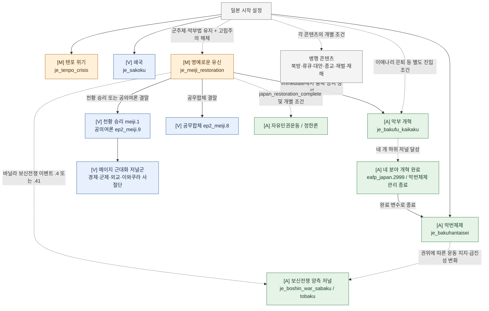
```mermaid
flowchart TD
    START["일본 시작 설정"]:::N
    B["[A] 막번체제<br/>je_bakuhantaisei"]:::A
    T["[M] 텐포 위기<br/>je_tenpo_crisis"]:::M
    S["[V] 쇄국<br/>je_sakoku"]:::V
    R["[M] 명예로운 유신<br/>je_meiji_restoration"]:::M
    K["[A] 막부 개혁<br/>je_bakufu_kaikaku"]:::A
    KEND["[A] 네 분야 개혁 완료<br/>eafp_japan.2999 / 막번체제 관리 종료"]:::A
    BW["[A] 보신전쟁 양측 저널<br/>je_boshin_war_sabaku / tobaku"]:::A
    MEND["[V] 천황 승리 meiji.1<br/>공의여론 ep2_meiji.9"]:::V
    COURT["[V] 공무합체 ep2_meiji.8"]:::V
    MOD["[V] 메이지 근대화 저널군<br/>경제·군제·외교·이와쿠라 사절단"]:::V
    POST["[A] 자유민권운동 / 정한론"]:::A
    SIDE["병행 콘텐츠<br/>북방·류큐·대만·종교·재벌·재해"]:::N
    START --> B
    START --> T
    START --> S
    START -. "군주제·막부법 유지 + 고립주의 해제" .-> R
    START -. "이에나리 은퇴 등 별도 진입 조건" .-> K
    R -->|immediate에서 중복 방지 생성| K
    K -. "네 개 하위 저널 달성" .-> KEND
    KEND -->|완료 변수로 종료| B
    B -. "권위에 따른 운동 지지·급진성 변화" .-> BW
    R -. "바닐라 보신전쟁 이벤트 .4 또는 .41" .-> BW
    R -->|천황 승리 또는 공의여론 결말| MEND
    R -->|공무합체 결말| COURT
    MEND --> MOD
    R -. "japan_restoration_complete 및 개별 조건" .-> POST
    START -. "각 콘텐츠의 개별 조건" .-> SIDE
    classDef V fill:#e7f0fc,stroke:#35689a,color:#172b45;
    classDef M fill:#fff0d9,stroke:#b76a16,color:#4d2b05;
    classDef A fill:#e5f4e7,stroke:#347c45,color:#173d22;
    classDef U fill:#eeeeee,stroke:#777777,color:#333333,stroke-dasharray:5 5;
    classDef N fill:#f4f4f4,stroke:#777777,color:#333333;

```

막부 개혁은 명예로운 유신과 **병행하는 별도 경로**다. 현재 `eafp_japan.2999`는 공무합체·공의여론을 자동 선택하거나 메이지 근대화 저널을 생성하지 않는다. 개혁 완료는 `bakufu_kaikaku_complete_var`를 설정하고, 막번체제 저널의 지역·보직 관리 종료로 이어진다. 공무합체 결말 `ep2_meiji.8`에도 근대화 저널군 생성 호출은 없다.

### 20.2. 막번체제·번과 다이묘·막부 인사

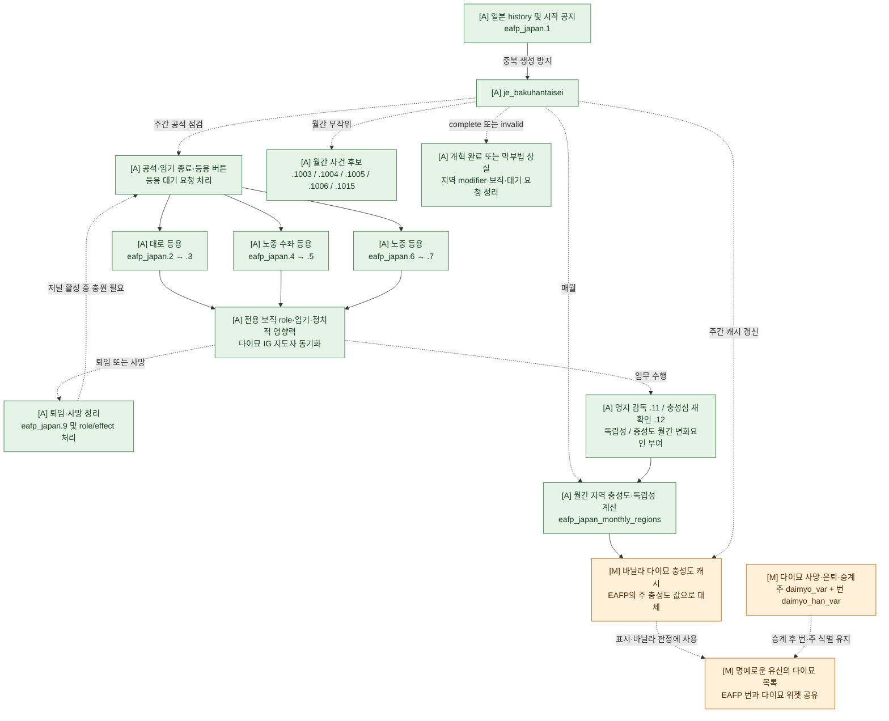
```mermaid
flowchart TD
    H["[A] 일본 history 및 시작 공지<br/>eafp_japan.1"]:::A
    J["[A] je_bakuhantaisei"]:::A
    MONTH["[A] 월간 지역 충성도·독립성 계산<br/>eafp_japan_monthly_regions"]:::A
    CACHE["[M] 바닐라 다이묘 충성도 캐시<br/>EAFP의 주 충성도 값으로 대체"]:::M
    GUI["[M] 명예로운 유신의 다이묘 목록<br/>EAFP 번과 다이묘 위젯 공유"]:::M
    REC["[A] 공석·임기 종료·등용 버튼<br/>등용 대기 요청 처리"]:::A
    TA["[A] 대로 등용<br/>eafp_japan.2 → .3"]:::A
    RH["[A] 노중 수좌 등용<br/>eafp_japan.4 → .5"]:::A
    RO["[A] 노중 등용<br/>eafp_japan.6 → .7"]:::A
    ROLE["[A] 전용 보직 role·임기·정치적 영향력<br/>다이묘 IG 지도자 동기화"]:::A
    RET["[A] 퇴임·사망 정리<br/>eafp_japan.9 및 role/effect 처리"]:::A
    TASK["[A] 영지 감독 .11 / 충성심 재확인 .12<br/>독립성 / 충성도 월간 변화요인 부여"]:::A
    RAND["[A] 월간 사건 후보<br/>.1003 / .1004 / .1005 / .1006 / .1015"]:::A
    HAN["[M] 다이묘 사망·은퇴·승계<br/>주 daimyo_var + 번 daimyo_han_var"]:::M
    END["[A] 개혁 완료 또는 막부법 상실<br/>지역 modifier·보직·대기 요청 정리"]:::A
    H -->|중복 생성 방지| J
    J -. "매월" .-> MONTH
    MONTH --> CACHE
    J -. "주간 캐시 갱신" .-> CACHE
    CACHE -. "표시·바닐라 판정에 사용" .-> GUI
    J -. "주간 공석 점검" .-> REC
    REC --> TA
    REC --> RH
    REC --> RO
    TA --> ROLE
    RH --> ROLE
    RO --> ROLE
    ROLE -. "퇴임 또는 사망" .-> RET
    RET -. "저널 활성 중 충원 필요" .-> REC
    ROLE -. "임무 수행" .-> TASK
    TASK --> MONTH
    J -. "월간 무작위" .-> RAND
    HAN -. "승계 후 번·주 식별 유지" .-> GUI
    J -. "complete 또는 invalid" .-> END
    classDef V fill:#e7f0fc,stroke:#35689a,color:#172b45;
    classDef M fill:#fff0d9,stroke:#b76a16,color:#4d2b05;
    classDef A fill:#e5f4e7,stroke:#347c45,color:#173d22;
    classDef U fill:#eeeeee,stroke:#777777,color:#333333,stroke-dasharray:5 5;
    classDef N fill:#f4f4f4,stroke:#777777,color:#333333;

```

지역 저널을 주별로 따로 생성하지 않는다. 에조치를 포함한 각 주의 충성도·독립성은 막번체제 아래에서 관리하며, 한 주에 여러 번이 있어도 주 충성도를 다이묘 개인 충성도의 산술평균으로 바꾸지 않는다. 추가 10개 번의 다이묘도 공용 승계 경로를 사용한다. 번을 특정하는 사건은 `daimyo_han_var`로 대상을 구분한다.

### 20.3. 막부 개혁과 파벌 대립

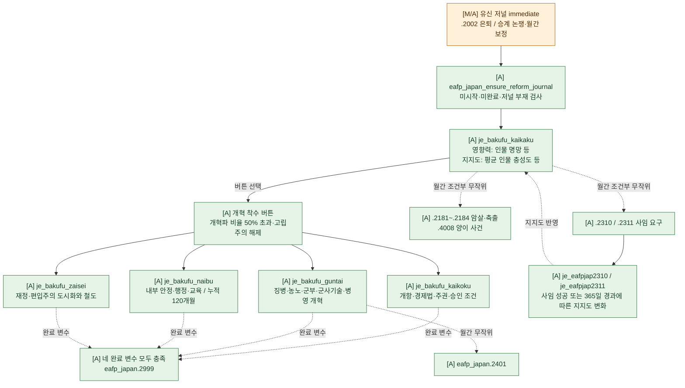
```mermaid
flowchart TD
    ENTRY["[A] eafp_japan_ensure_reform_journal<br/>미시작·미완료·저널 부재 검사"]:::A
    SOURCES["[M/A] 유신 저널 immediate<br/>.2002 은퇴 / 승계 논쟁·월간 보정"]:::M
    J["[A] je_bakufu_kaikaku<br/>영향력: 인물 명망 등<br/>지지도: 평균 인물 충성도 등"]:::A
    BTN["[A] 개혁 착수 버튼<br/>개혁파 비율 50% 초과·고립주의 해제"]:::A
    OPEN["[A] je_bakufu_kaikoku<br/>개항·경제법·주권·승인 조건"]:::A
    ARMY["[A] je_bakufu_guntai<br/>징병·농노·군부·군사기술·병영 개혁"]:::A
    INNER["[A] je_bakufu_naibu<br/>내부 안정·행정·교육 / 누적 120개월"]:::A
    FIN["[A] je_bakufu_zaisei<br/>재정·편입주의 도시화와 철도"]:::A
    RESULT["[A] 네 완료 변수 모두 충족<br/>eafp_japan.2999"]:::A
    CONFLICT["[A] .2181~.2184 암살·축출<br/>.4008 양이 사건"]:::A
    DEMAND["[A] .2310 / .2311 사임 요구"]:::A
    DJ["[A] je_eafpjap2310 / je_eafpjap2311<br/>사임 성공 또는 365일 경과에 따른 지지도 변화"]:::A
    DRILL["[A] eafp_japan.2401"]:::A
    SOURCES --> ENTRY
    ENTRY --> J
    J -->|버튼 선택| BTN
    BTN --> OPEN
    BTN --> ARMY
    BTN --> INNER
    BTN --> FIN
    OPEN -. "완료 변수" .-> RESULT
    ARMY -. "완료 변수" .-> RESULT
    INNER -. "완료 변수" .-> RESULT
    FIN -. "완료 변수" .-> RESULT
    J -. "월간 조건부 무작위" .-> CONFLICT
    J -. "월간 조건부 무작위" .-> DEMAND
    DEMAND --> DJ
    DJ -. "지지도 반영" .-> J
    ARMY -. "월간 무작위" .-> DRILL
    classDef V fill:#e7f0fc,stroke:#35689a,color:#172b45;
    classDef M fill:#fff0d9,stroke:#b76a16,color:#4d2b05;
    classDef A fill:#e5f4e7,stroke:#347c45,color:#173d22;
    classDef U fill:#eeeeee,stroke:#777777,color:#333333,stroke-dasharray:5 5;
    classDef N fill:#f4f4f4,stroke:#777777,color:#333333;

```

`je_bakufu_kaikaku.on_invalid`에도 파벌 modifier 정리와 `bakufu_kaikaku_complete_var` 설정이 있다. 따라서 그 변수만 보고 성공 이벤트 `.2999`가 발생했다고 판단하면 안 된다. `.2999`는 네 분야를 완료한 `on_complete`에서 호출된다.

### 20.4. 쇼군의 뜻·후계 분쟁·즉위와 황실

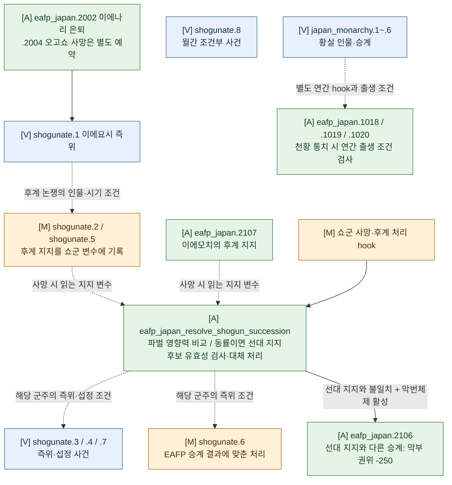
```mermaid
flowchart TD
    RET["[A] eafp_japan.2002 이에나리 은퇴<br/>.2004 오고쇼 사망은 별도 예약"]:::A
    ACC["[V] shogunate.1 이에요시 즉위"]:::V
    WILL["[M] shogunate.2 / shogunate.5<br/>후계 지지를 쇼군 변수에 기록"]:::M
    WILL2["[A] eafp_japan.2107<br/>이에모치의 후계 지지"]:::A
    DEATH["[M] 쇼군 사망·후계 처리 hook"]:::M
    RESOLVE["[A] eafp_japan_resolve_shogun_succession<br/>파벌 영향력 비교 / 동률이면 선대 지지<br/>후보 유효성 검사·대체 처리"]:::A
    VAN["[V] shogunate.3 / .4 / .7<br/>즉위·섭정 사건"]:::V
    MOD["[M] shogunate.6<br/>EAFP 승계 결과에 맞춘 처리"]:::M
    HIT["[A] eafp_japan.2106<br/>선대 지지와 다른 승계: 막부 권위 -250"]:::A
    FLAVOR["[V] shogunate.8<br/>월간 조건부 사건"]:::V
    EMP["[V] japan_monarchy.1~.6<br/>황실 인물·승계"]:::V
    BIRTH["[A] eafp_japan.1018 / .1019 / .1020<br/>천황 통치 시 연간 출생 조건 검사"]:::A
    RET --> ACC
    ACC -. "후계 논쟁의 인물·시기 조건" .-> WILL
    WILL -. "사망 시 읽는 지지 변수" .-> RESOLVE
    WILL2 -. "사망 시 읽는 지지 변수" .-> RESOLVE
    DEATH --> RESOLVE
    RESOLVE -. "해당 군주의 즉위·섭정 조건" .-> VAN
    RESOLVE -. "해당 군주의 즉위 조건" .-> MOD
    RESOLVE -->|선대 지지와 불일치 + 막번체제 활성| HIT
    EMP -. "별도 연간 hook과 출생 조건" .-> BIRTH
    classDef V fill:#e7f0fc,stroke:#35689a,color:#172b45;
    classDef M fill:#fff0d9,stroke:#b76a16,color:#4d2b05;
    classDef A fill:#e5f4e7,stroke:#347c45,color:#173d22;
    classDef U fill:#eeeeee,stroke:#777777,color:#333333,stroke-dasharray:5 5;
    classDef N fill:#f4f4f4,stroke:#777777,color:#333333;

```

바닐라의 후계자 지명을 그대로 실행하는 구조가 아니다. 수정된 `.2/.5`와 추가된 `.2107`은 뜻을 기록하며, 실제 승계는 사망 시 effect에서 결정한다. 왕조별 바닐라 사건은 해당 인물과 조건에 맞게 계속 사용한다. `shogunate.8`과 황실 사건은 이 후계 분쟁의 필수 후속 단계가 아니다.

### 20.5. 텐포 위기·아편전쟁 충격·쇄국

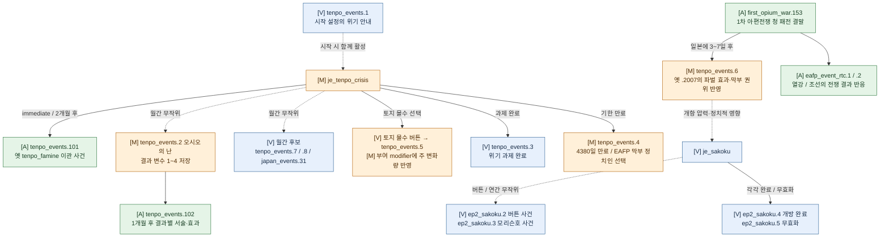
```mermaid
flowchart TD
    START["[V] tenpo_events.1<br/>시작 설정의 위기 안내"]:::V
    J["[M] je_tenpo_crisis"]:::M
    INTRO["[A] tenpo_events.101<br/>옛 tenpo_famine 이관 사건"]:::A
    OSH["[M] tenpo_events.2 오시오의 난<br/>결과 변수 1~4 저장"]:::M
    AFTER["[A] tenpo_events.102<br/>1개월 후 결과별 서술·효과"]:::A
    R["[V] 월간 후보<br/>tenpo_events.7 / .8 / japan_events.31"]:::V
    LAND["[V] 토지 몰수 버튼 → tenpo_events.5<br/>[M] 부여 modifier에 주 변화량 반영"]:::M
    SUCCESS["[V] tenpo_events.3<br/>위기 과제 완료"]:::V
    FAIL["[M] tenpo_events.4<br/>4380일 만료 / EAFP 막부 정치인 선택"]:::M
    WAR["[A] first_opium_war.153<br/>1차 아편전쟁 청 패전 결말"]:::A
    SHOCK["[M] tenpo_events.6<br/>옛 .2007의 파벌 효과·막부 권위 반영"]:::M
    RTC["[A] eafp_event_rtc.1 / .2<br/>열강 / 조선의 전쟁 결과 반응"]:::A
    S["[V] je_sakoku"]:::V
    ST["[V] ep2_sakoku.2 버튼 사건<br/>ep2_sakoku.3 모리슨호 사건"]:::V
    SE["[V] ep2_sakoku.4 개방 완료<br/>ep2_sakoku.5 무효화"]:::V
    START -. "시작 시 함께 활성" .-> J
    J -->|immediate / 2개월 후| INTRO
    J -. "월간 무작위" .-> OSH
    OSH --> AFTER
    J -. "월간 무작위" .-> R
    J -->|토지 몰수 선택| LAND
    J -->|과제 완료| SUCCESS
    J -->|기한 만료| FAIL
    WAR -->|일본에 3~7일 후| SHOCK
    WAR --> RTC
    S -. "버튼 / 연간 무작위" .-> ST
    S -->|각각 완료 / 무효화| SE
    SHOCK -. "개항 압력·정치적 영향" .-> S
    classDef V fill:#e7f0fc,stroke:#35689a,color:#172b45;
    classDef M fill:#fff0d9,stroke:#b76a16,color:#4d2b05;
    classDef A fill:#e5f4e7,stroke:#347c45,color:#173d22;
    classDef U fill:#eeeeee,stroke:#777777,color:#333333,stroke-dasharray:5 5;
    classDef N fill:#f4f4f4,stroke:#777777,color:#333333;

```

아편전쟁 충격은 EAFP 1차 아편전쟁 결말에서 발생한다. 덮어쓴 `events/opium_wars_events.txt`의 기존 `opium_wars.4 → tenpo_events.6` 호출은 주석 처리되어 있다. `tenpo_famine.*`는 별도 활성 namespace로 유지하지 않으며, 이관된 사건은 `.101/.102`를 사용한다.

### 20.6. 명예로운 유신·황실 혼인·세 가지 결말

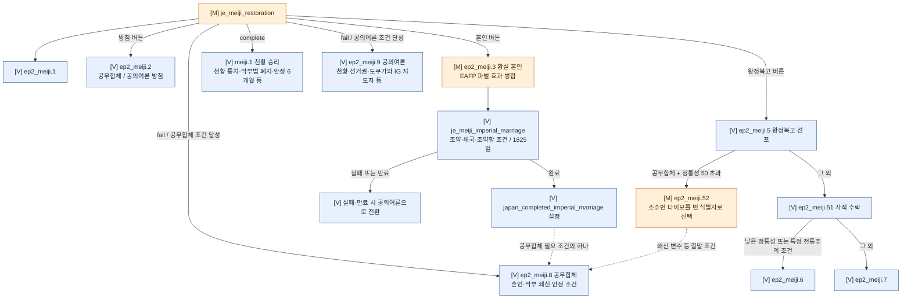
```mermaid
flowchart TD
    J["[M] je_meiji_restoration"]:::M
    INTRO["[V] ep2_meiji.1"]:::V
    STRAT["[V] ep2_meiji.2<br/>공무합체 / 공의여론 방침"]:::V
    MARR["[M] ep2_meiji.3 황실 혼인<br/>EAFP 파벌 효과 병합"]:::M
    MJ["[V] je_meiji_imperial_marriage<br/>조약·쇄국·조약항 조건 / 1825일"]:::V
    MPASS["[V] japan_completed_imperial_marriage 설정"]:::V
    MFAIL["[V] 실패·만료 시 공의여론으로 전환"]:::V
    PRO["[V] ep2_meiji.5 왕정복고 선포"]:::V
    P52["[M] ep2_meiji.52<br/>조슈번 다이묘를 번 식별자로 선택"]:::M
    P51["[V] ep2_meiji.51 사직 수락"]:::V
    P6["[V] ep2_meiji.6"]:::V
    P7["[V] ep2_meiji.7"]:::V
    IMP["[V] meiji.1 천황 승리<br/>천황 통치·막부법 폐지·안정 6개월 등"]:::V
    COURT["[V] ep2_meiji.8 공무합체<br/>혼인·막부 쇄신·안정 조건"]:::V
    PARL["[V] ep2_meiji.9 공의여론<br/>천황·선거권·도쿠가와 IG 지도자 등"]:::V
    J --> INTRO
    J -->|방침 버튼| STRAT
    J -->|혼인 버튼| MARR
    MARR --> MJ
    MJ -->|완료| MPASS
    MJ -->|실패 또는 만료| MFAIL
    J -->|왕정복고 버튼| PRO
    PRO -->|공무합체 + 정통성 50 초과| P52
    PRO -->|그 외| P51
    P51 -->|낮은 정통성 또는 특정 전통주의 조건| P6
    P51 -->|그 외| P7
    P52 -. "쇄신 변수 등 결말 조건" .-> COURT
    MPASS -. "공무합체 필요 조건의 하나" .-> COURT
    J -->|complete| IMP
    J -->|fail / 공무합체 조건 달성| COURT
    J -->|fail / 공의여론 조건 달성| PARL
    classDef V fill:#e7f0fc,stroke:#35689a,color:#172b45;
    classDef M fill:#fff0d9,stroke:#b76a16,color:#4d2b05;
    classDef A fill:#e5f4e7,stroke:#347c45,color:#173d22;
    classDef U fill:#eeeeee,stroke:#777777,color:#333333,stroke-dasharray:5 5;
    classDef N fill:#f4f4f4,stroke:#777777,color:#333333;

```

`fail`은 이 저널에서 **막부 측 승리**를 표현하는 엔진 분기 이름이다. 일반적인 패배로 읽으면 안 된다. 천황 승리와 두 막부 결말은 `japan_restoration_complete`를 설정하지만, 근대화 저널군 호출 여부는 서로 다르다. 군주제 상실에 따른 `on_invalid`도 이 변수를 설정하므로, 후속 저널은 각자의 추가 조건까지 확인해야 한다.

### 20.7. 유신기 사건에 병합된 EAFP 효과

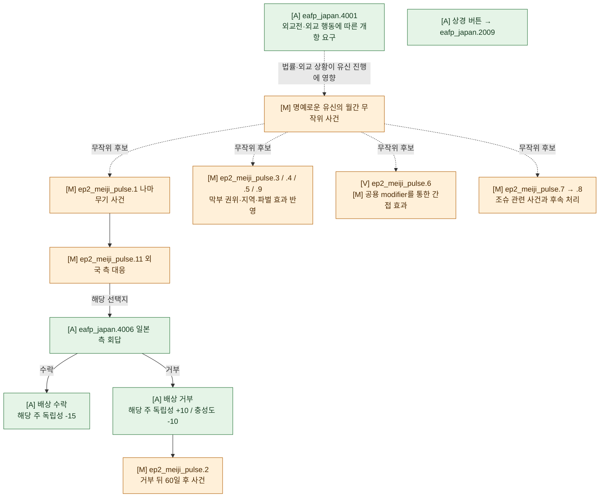
```mermaid
flowchart TD
    J["[M] 명예로운 유신의 월간 무작위 사건"]:::M
    N["[M] ep2_meiji_pulse.1 나마무기 사건"]:::M
    GP["[M] ep2_meiji_pulse.11 외국 측 대응"]:::M
    REPLY["[A] eafp_japan.4006 일본 측 회답"]:::A
    PAY["[A] 배상 수락<br/>해당 주 독립성 -15"]:::A
    REFUSE["[A] 배상 거부<br/>해당 주 독립성 +10 / 충성도 -10"]:::A
    BOMB["[M] ep2_meiji_pulse.2<br/>거부 뒤 60일 후 사건"]:::M
    PULSE["[M] ep2_meiji_pulse.3 / .4 / .5 / .9<br/>막부 권위·지역·파벌 효과 반영"]:::M
    IKEDA["[V] ep2_meiji_pulse.6<br/>[M] 공용 modifier를 통한 간접 효과"]:::M
    CHO["[M] ep2_meiji_pulse.7 → .8<br/>조슈 관련 사건과 후속 처리"]:::M
    OPEN["[A] eafp_japan.4001<br/>외교전·외교 행동에 따른 개항 요구"]:::A
    VISIT["[A] 상경 버튼 → eafp_japan.2009"]:::A
    J -. "무작위 후보" .-> N
    N --> GP
    GP -->|해당 선택지| REPLY
    REPLY -->|수락| PAY
    REPLY -->|거부| REFUSE
    REFUSE --> BOMB
    J -. "무작위 후보" .-> PULSE
    J -. "무작위 후보" .-> IKEDA
    J -. "무작위 후보" .-> CHO
    OPEN -. "법률·외교 상황이 유신 진행에 영향" .-> J
    classDef V fill:#e7f0fc,stroke:#35689a,color:#172b45;
    classDef M fill:#fff0d9,stroke:#b76a16,color:#4d2b05;
    classDef A fill:#e5f4e7,stroke:#347c45,color:#173d22;
    classDef U fill:#eeeeee,stroke:#777777,color:#333333,stroke-dasharray:5 5;
    classDef N fill:#f4f4f4,stroke:#777777,color:#333333;

```

옛 `.4005/.4007`은 바닐라 나마무기·보복 사건 경로로 통합했고, `.4006`만 일본 측 후속 회답으로 남겼다. 옛 `.4003`의 효과는 `ep2_meiji_pulse.9`에 병합했다. `[V]` 사건이 사용하는 modifier에 월간 막부 권위·지역 변화량을 추가한 경우, 이벤트 본문을 `REPLACE:`한 것과 구분해서 표시했다.

### 20.8. 유신파·도쿠가와파 혁명과 보신전쟁

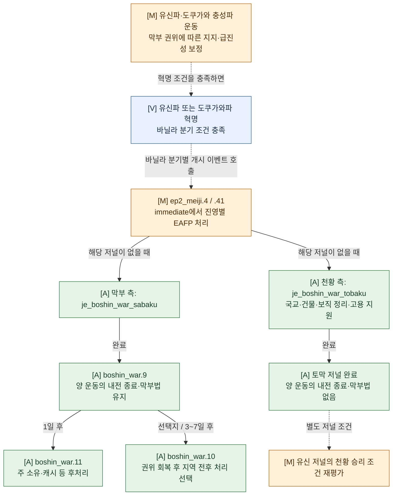
```mermaid
flowchart TD
    MOV["[M] 유신파·도쿠가와 충성파 운동<br/>막부 권위에 따른 지지·급진성 보정"]:::M
    REV["[V] 유신파 또는 도쿠가와파 혁명<br/>바닐라 분기 조건 충족"]:::V
    VE["[M] ep2_meiji.4 / .41<br/>immediate에서 진영별 EAFP 처리"]:::M
    S["[A] 막부 측: je_boshin_war_sabaku"]:::A
    T["[A] 천황 측: je_boshin_war_tobaku<br/>국교·건물·보직 정리·고용 지원"]:::A
    WIN["[A] boshin_war.9<br/>양 운동의 내전 종료·막부법 유지"]:::A
    RESET["[A] boshin_war.11<br/>주 소유·캐시 등 후처리"]:::A
    SETTLE["[A] boshin_war.10<br/>권위 회복 후 지역 전후 처리 선택"]:::A
    IMP["[A] 토막 저널 완료<br/>양 운동의 내전 종료·막부법 없음"]:::A
    MEIJI["[M] 유신 저널의 천황 승리 조건 재평가"]:::M
    MOV -. "혁명 조건을 충족하면" .-> REV
    REV -. "바닐라 분기별 개시 이벤트 호출" .-> VE
    VE -->|해당 저널이 없을 때| S
    VE -->|해당 저널이 없을 때| T
    S -->|완료| WIN
    WIN -->|1일 후| RESET
    WIN -->|선택지 / 3~7일 후| SETTLE
    T -->|완료| IMP
    IMP -. "별도 저널 조건" .-> MEIJI
    classDef V fill:#e7f0fc,stroke:#35689a,color:#172b45;
    classDef M fill:#fff0d9,stroke:#b76a16,color:#4d2b05;
    classDef A fill:#e5f4e7,stroke:#347c45,color:#173d22;
    classDef U fill:#eeeeee,stroke:#777777,color:#333333,stroke-dasharray:5 5;
    classDef N fill:#f4f4f4,stroke:#777777,color:#333333;

```

2026-10-01에 `boshin_war.1~4`와 혁명 시작 시의 호출을 삭제했다. EAFP의 대정봉환·도막파 폭동·왕정복고 쿠데타·저택 전투 사건은 발생하지 않으며, `.2`가 부여하던 수도 황폐화도 함께 제거했다. 양측 저널 생성과 국가 지원은 `ep2_meiji.4/.41`의 `immediate`에서 처리하고, 막부 승리 후 `.9 → .11/.10` 경로를 사용한다. 토막 저널 완료에는 `meiji.1` 직접 호출이 없으므로, 보신전쟁 승리와 유신 저널의 천황 승리를 하나의 즉시 전환으로 연결하지 않았다.

| 개시 이벤트 | 막부 측 / 사막 저널 | 천황 측 / 토막 저널·지원 |
| --- | --- | --- |
| `ep2_meiji.4` | `scope:tokugawa_scope` — 도쿠가와파 혁명국 | `ROOT` — 원국 |
| `ep2_meiji.41` | `ROOT` — 원국 | `scope:imperial_court_scope` — 유신파 혁명국 |

두 저널은 서로를 `target`으로 저장한다. 상대국 스코프가 존재할 때만 처리하고, 각 저널이 이미 있으면 해당 진영의 초기 처리를 반복하지 않는다. `boshin_war_happened`는 막부 측에 설정한다. 천황 측에는 유교 국교, 항구·수도 무역 중심지, 막부 보직 해제, 24개월 고용 지원을 적용한다. 바닐라 이벤트의 진영 선택·플레이 국가 전환은 유지한다.

옛 on_action의 연도별 `create_character` 군주·후계자 지정과 `heir_meiji_spawned`·`taisho_born`·`showa_born` 설정은 이관하지 않고 삭제했다. 군주 구성은 바닐라 내전 처리에 맡긴다. 두 저널의 완료 판정은 유신파와 도쿠가와파 내전을 모두 검사하여 `.4` 경로에서 전쟁 중 조기 완료되지 않도록 한다.

### 20.9. 메이지 근대화와 이와쿠라 사절단

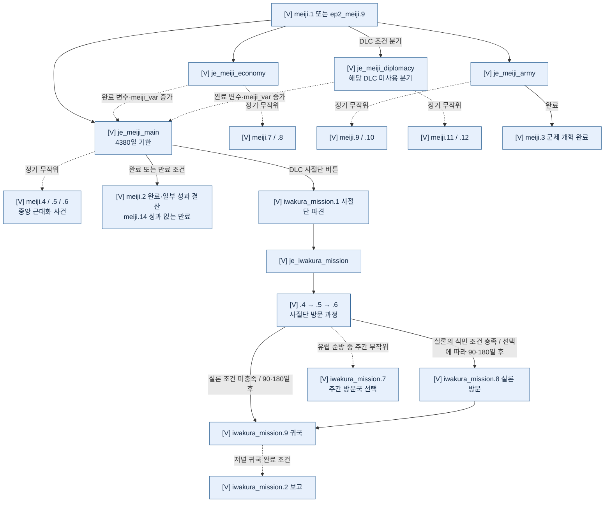
```mermaid
flowchart TD
    E["[V] meiji.1 또는 ep2_meiji.9"]:::V
    MAIN["[V] je_meiji_main<br/>4380일 기한"]:::V
    ECO["[V] je_meiji_economy"]:::V
    ARMY["[V] je_meiji_army"]:::V
    DIP["[V] je_meiji_diplomacy<br/>해당 DLC 미사용 분기"]:::V
    MR["[V] meiji.4 / .5 / .6<br/>중앙 근대화 사건"]:::V
    ER["[V] meiji.7 / .8"]:::V
    AR["[V] meiji.9 / .10"]:::V
    DR["[V] meiji.11 / .12"]:::V
    SUB["[V] meiji.3 군제 개혁 완료"]:::V
    FIN["[V] meiji.2 완료·일부 성과 결산<br/>meiji.14 성과 없는 만료"]:::V
    I1["[V] iwakura_mission.1 사절단 파견"]:::V
    IJ["[V] je_iwakura_mission"]:::V
    TOUR["[V] .4 → .5 → .6<br/>사절단 방문 과정"]:::V
    EXT["[V] iwakura_mission.8 실론 방문"]:::V
    DEST["[V] iwakura_mission.7<br/>주간 방문국 선택"]:::V
    BACK["[V] iwakura_mission.9 귀국"]:::V
    REPORT["[V] iwakura_mission.2 보고"]:::V
    E --> MAIN
    E --> ECO
    E --> ARMY
    E -->|DLC 조건 분기| DIP
    MAIN -. "정기 무작위" .-> MR
    ECO -. "정기 무작위" .-> ER
    ARMY -. "정기 무작위" .-> AR
    DIP -. "정기 무작위" .-> DR
    ECO -. "완료 변수·meiji_var 증가" .-> MAIN
    ARMY -->|완료| SUB
    DIP -. "완료 변수·meiji_var 증가" .-> MAIN
    MAIN -->|완료 또는 만료 조건| FIN
    MAIN -->|DLC 사절단 버튼| I1
    I1 --> IJ
    IJ --> TOUR
    TOUR -->|실론의 식민 조건 충족 / 선택에 따라 90·180일 후| EXT
    TOUR -->|실론 조건 미충족 / 90·180일 후| BACK
    TOUR -. "유럽 순방 중 주간 무작위" .-> DEST
    EXT --> BACK
    BACK -. "저널 귀국 완료 조건" .-> REPORT
    classDef V fill:#e7f0fc,stroke:#35689a,color:#172b45;
    classDef M fill:#fff0d9,stroke:#b76a16,color:#4d2b05;
    classDef A fill:#e5f4e7,stroke:#347c45,color:#173d22;
    classDef U fill:#eeeeee,stroke:#777777,color:#333333,stroke-dasharray:5 5;
    classDef N fill:#f4f4f4,stroke:#777777,color:#333333;

```

현재 EAFP는 `je_meiji_restoration`만 교체한다. 같은 바닐라 파일의 `je_meiji_imperial_marriage`, `je_meiji_main`, `je_meiji_economy`, `je_meiji_army`, `je_meiji_diplomacy`는 바닐라 정의를 사용한다. 앞 절에 남은 “메이지 5개 JE 직접 소유” 설명은 과거 계획이다. `meiji.*`와 이와쿠라 사건 자체를 EAFP의 옛 `eafp_jap_meiji_legacy.*`로 대체하지 않는다. 경제·외교 하위 저널은 완료 변수와 `meiji_var`를 갱신하고, 군제 하위 저널만 `meiji.3`을 직접 호출한다. 이와쿠라 `.6`의 두 선택지는 유럽 체류 기간을 정하며, 이후 `.8` 경유 여부는 실론의 식민 상태 조건으로 갈린다. 근대화 저널의 지위체계 변경 버튼은 바닐라 공용 `set_hierarchy_event.3`으로 연결된다.

### 20.10. 에조치 개척·가라후토·에조 공화국

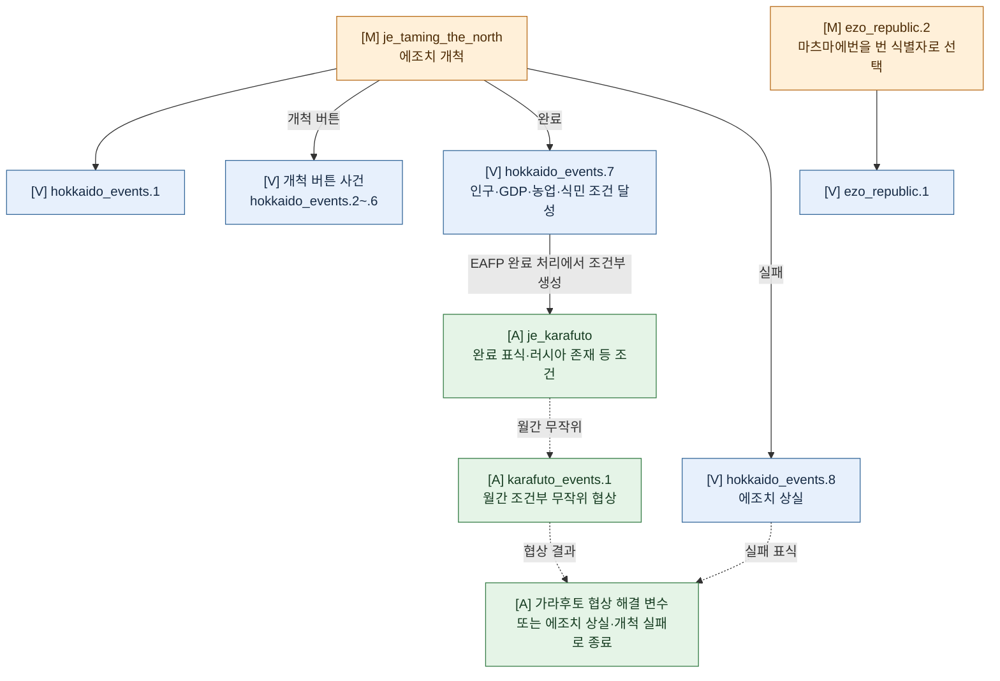
```mermaid
flowchart TD
    J["[M] je_taming_the_north<br/>에조치 개척"]:::M
    INTRO["[V] hokkaido_events.1"]:::V
    BTN["[V] 개척 버튼 사건<br/>hokkaido_events.2~.6"]:::V
    DONE["[V] hokkaido_events.7<br/>인구·GDP·농업·식민 조건 달성"]:::V
    FAIL["[V] hokkaido_events.8<br/>에조치 상실"]:::V
    KAR["[A] je_karafuto<br/>완료 표식·러시아 존재 등 조건"]:::A
    KE["[A] karafuto_events.1<br/>월간 조건부 무작위 협상"]:::A
    KD["[A] 가라후토 협상 해결 변수<br/>또는 에조치 상실·개척 실패로 종료"]:::A
    EZO2["[M] ezo_republic.2<br/>마츠마에번을 번 식별자로 선택"]:::M
    EZO1["[V] ezo_republic.1"]:::V
    J --> INTRO
    J -->|개척 버튼| BTN
    J -->|완료| DONE
    J -->|실패| FAIL
    DONE -->|EAFP 완료 처리에서 조건부 생성| KAR
    KAR -. "월간 무작위" .-> KE
    KE -. "협상 결과" .-> KD
    FAIL -. "실패 표식" .-> KD
    EZO2 --> EZO1
    classDef V fill:#e7f0fc,stroke:#35689a,color:#172b45;
    classDef M fill:#fff0d9,stroke:#b76a16,color:#4d2b05;
    classDef A fill:#e5f4e7,stroke:#347c45,color:#173d22;
    classDef U fill:#eeeeee,stroke:#777777,color:#333333,stroke-dasharray:5 5;
    classDef N fill:#f4f4f4,stroke:#777777,color:#333333;

```

북방 개척 본편은 바닐라 `hokkaido_events.*`를 사용한다. EAFP가 바꾼 지점은 저널의 완료·실패 표식과 가라후토 연결, 에조 공화국 사건의 다이묘 선택 등이다. 삭제된 옛 EAFP 홋카이도 이벤트를 별도 선행 과정으로 넣지 않았다.

### 20.11. 류큐 경쟁·류큐 처분·대만 원정

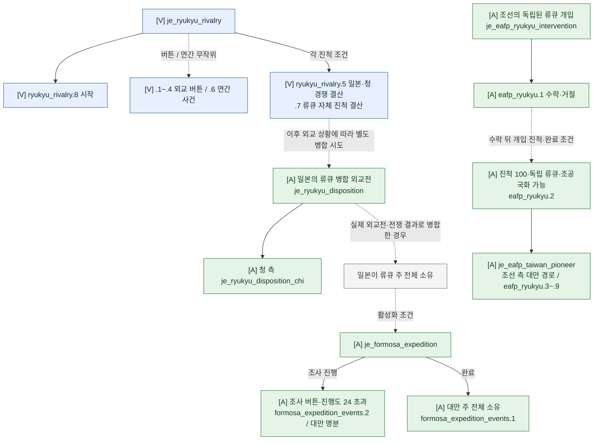
```mermaid
flowchart TD
    R["[V] je_ryukyu_rivalry"]:::V
    RI["[V] ryukyu_rivalry.8 시작"]:::V
    RR["[V] .1~.4 외교 버튼 / .6 연간 사건"]:::V
    RE["[V] ryukyu_rivalry.5 일본·청 경쟁 결산<br/>.7 류큐 자체 진척 결산"]:::V
    ANN["[A] 일본의 류큐 병합 외교전<br/>je_ryukyu_disposition"]:::A
    CHI["[A] 청 측 je_ryukyu_disposition_chi"]:::A
    OWNS["일본이 류큐 주 전체 소유"]:::N
    F["[A] je_formosa_expedition"]:::A
    SURVEY["[A] 조사 버튼·진행도 24 초과<br/>formosa_expedition_events.2 / 대만 명분"]:::A
    FE["[A] 대만 주 전체 소유<br/>formosa_expedition_events.1"]:::A
    K["[A] 조선의 독립된 류큐 개입<br/>je_eafp_ryukyu_intervention"]:::A
    KI["[A] eafp_ryukyu.1 수락·거절"]:::A
    KR["[A] 진척 100·독립 류큐·조공국화 가능<br/>eafp_ryukyu.2"]:::A
    KT["[A] je_eafp_taiwan_pioneer<br/>조선 측 대만 경로 / eafp_ryukyu.3~.9"]:::A
    R --> RI
    R -. "버튼 / 연간 무작위" .-> RR
    R -->|각 진척 조건| RE
    RE -. "이후 외교 상황에 따라 별도 병합 시도" .-> ANN
    ANN --> CHI
    ANN -. "실제 외교전·전쟁 결과로 병합한 경우" .-> OWNS
    OWNS -. "활성화 조건" .-> F
    F -->|조사 진행| SURVEY
    F -->|완료| FE
    K --> KI
    KI -. "수락 뒤 개입 진척·완료 조건" .-> KR
    KR --> KT
    classDef V fill:#e7f0fc,stroke:#35689a,color:#172b45;
    classDef M fill:#fff0d9,stroke:#b76a16,color:#4d2b05;
    classDef A fill:#e5f4e7,stroke:#347c45,color:#173d22;
    classDef U fill:#eeeeee,stroke:#777777,color:#333333,stroke-dasharray:5 5;
    classDef N fill:#f4f4f4,stroke:#777777,color:#333333;

```

`je_ryukyu_disposition` 두 저널은 현재 완료 효과가 비어 있다. 이 저널이 자동으로 류큐를 병합한다고 해석하지 않는다. 대만 원정은 **일본의 류큐 주 전체 소유**가 활성화 조건이므로 시작부터 이어지는 경로가 아니다. 조선의 류큐 개입은 바닐라 `je_ryukyu_rivalry`를 대체하거나 그 진척도를 공유하지 않는 별도 저널이다. 조선 대만 경로는 관련 대외 분기까지만 묶어 표시했다.

### 20.12. 자유민권운동·정한론·조선 개입

```mermaid
flowchart TD
    DONE["유신 결말 변수<br/>japan_restoration_complete"]:::N
    LIB["[A] je_liberty_civil_right_movement<br/>운동 지지 5% 이상·급진성 15% 이상 등"]:::A
    LR["[A] liberty_civil_right_movement_events.3~.9<br/>월간 사건"]:::A
    LE["[A] .1 권리 확대 완료<br/>.2 운동 약화로 실패"]:::A
    SEI["[A] je_seikanron<br/>반조선 로비 존재"]:::A
    SI["[A] seikanron_events.1<br/>주간 이벤트 후보 / 개별 trigger 검사"]:::A
    SR["[A] seikanron_events.2~.9 / .13~.15<br/>월간 무작위 사건"]:::A
    SF["[A] seikanron_events.99<br/>조선 국가 소멸로 완료"]:::A
    KOR["[M] 조선: je_donghak_movement<br/>je_gyojo_shinwon / je_korean_rebellion"]:::M
    INTER["[M] gg_korea.7<br/>외부 개입 선택"]:::M
    JAP["[M] gg_korea.8<br/>정부 승리 뒤 일본의 대응"]:::M
    CHI["[M] gg_korea.9<br/>일본 선택에 따른 청의 대응"]:::M
    COL["[V] je_colonize_korea<br/>조선 5개 주 소유·식민 관련 조건"]:::V
    CE["[V] korea_colonization.2 완료<br/>korea_colonization.3 실패"]:::V
    DONE -. "운동·법률 등 개별 조건" .-> LIB
    LIB -. "월간 무작위" .-> LR
    LIB -->|완료 / 실패| LE
    DONE -. "반조선 로비 등 개별 조건" .-> SEI
    SEI -. "주간" .-> SI
    SEI -. "월간 무작위" .-> SR
    SEI -->|완료| SF
    KOR -. "반란·외부 개입 조건" .-> INTER
    KOR -->|정부 승리 및 일본 개입 조건| JAP
    JAP -->|대청 요구 선택| CHI
    SEI -. "정복은 외교·전쟁으로 별도 달성" .-> COL
    COL -->|완료 / 실패| CE
    classDef V fill:#e7f0fc,stroke:#35689a,color:#172b45;
    classDef M fill:#fff0d9,stroke:#b76a16,color:#4d2b05;
    classDef A fill:#e5f4e7,stroke:#347c45,color:#173d22;
    classDef U fill:#eeeeee,stroke:#777777,color:#333333,stroke-dasharray:5 5;
    classDef N fill:#f4f4f4,stroke:#777777,color:#333333;

```

자유민권운동과 정한론은 `meiji.2`의 근대화 완료를 기다리는 직렬 후속 저널이 아니다. 유신 결말 변수와 각 활성화 조건으로 진입한다. 정한론의 로비 만족도 `appeasement <= -8` 실패 분기에는 후속 이벤트가 없고, 반조선 로비가 없어지면 무효화된다. 조선 사건은 EAFP의 같은 경로 파일 `events/soi_events/00_ep1_korea_events.txt`를 사용한다. 조선 전체 국내 개혁 과정은 이 일본 흐름도의 범위 밖이다.

### 20.13. 종교·재벌·일상 사건과 예약 사건

```mermaid
flowchart TD
    SH["[V] 신불분리 결정<br/>je_shinbutsu_bunri"]:::V
    SHP["[V] japan_religion.1~.6<br/>종교 갈등 사건"]:::V
    SHE["[V] japan_religion.11 완료<br/>버튼 사건 .13"]:::V
    BU["[V] 불교 진흥 결정<br/>je_elevate_buddhism"]:::V
    BUP["[V] japan_religion.6~.9"]:::V
    BUE["[V] japan_religion.12 완료"]:::V
    LAW["[V] 법률 변경 hook<br/>지연된 japan_religion.10"]:::V
    ZA["[V] je_zaibatsu"]:::V
    ZAE["[V] zaibatsu.1 완료 / .2 억제"]:::V
    OA["[V] 바닐라 국가 정기 on_action"]:::V
    FL["[V] japan_events.1~.5 / .32~.35<br/>japan_earthquakes.1~.5<br/>japan_politics.1~.3"]:::V
    HIST["[A] 일본 history의 개별 예약"]:::A
    HE["[A] eafp_japan.1001 / .1002 / .1007<br/>.1009 / .1012 / .1014"]:::A
    SH -. "정기 무작위" .-> SHP
    SH -->|완료 또는 버튼| SHE
    BU -. "정기 무작위" .-> BUP
    BU -->|완료| BUE
    ZA -->|각 결말| ZAE
    OA -. "각 사건의 조건·가중치" .-> FL
    HIST --> HE
    classDef V fill:#e7f0fc,stroke:#35689a,color:#172b45;
    classDef M fill:#fff0d9,stroke:#b76a16,color:#4d2b05;
    classDef A fill:#e5f4e7,stroke:#347c45,color:#173d22;
    classDef U fill:#eeeeee,stroke:#777777,color:#333333,stroke-dasharray:5 5;
    classDef N fill:#f4f4f4,stroke:#777777,color:#333333;

```

바닐라 종교 저널은 유지한다. 삭제된 EAFP `je_shinto`·`shinto_events.*`를 신불분리의 후속으로 넣지 않는다. 일상·재해 사건은 정기 호출 후보이며 특정 저널을 순서대로 완료해야 나오는 목록이 아니다. `japan_events.31`은 텐포 위기의 월간 후보로 앞 도표에 표시했다.

### 20.14. 정의는 남았지만 일반 진행에 연결하지 않은 사건

| 구분 | 이벤트 | 현재 조사 결과 |
| --- | --- | --- |
| [U] EAFP 추가 | `eafp_japan.4002` | 류큐 개항 사건 정의는 있으나 활성 호출을 찾지 못했다. |
| [U] EAFP 추가 | `eafp_japan.4004` | 외국인의 후지산 등반 사건 정의는 있으나 활성 호출을 찾지 못했다. |
| [U] EAFP 추가 | `eafp_japan.5002 → eafp_japan.5003` | 둘 사이의 후속 연결은 남아 있으나 `.5002`를 시작시키는 활성 호출을 찾지 못했다. |
| [U] EAFP 추가 | `hanbatsu_oligarchy_events.1` | 정의는 남아 있으나 호출할 활성 저널·이벤트를 찾지 못했다. |
| [U] 바닐라 잔존 정의 | `meiji.13` | 강제 개항 사건으로 `orphan = yes`가 있으며, 활성 호출을 찾지 못했다. 일반 개항 경로에 연결하지 않는다. |
| [V] 디버그 전용 | `ep2_meiji.1000` | 바닐라에 `orphan = yes`인 디버그 이벤트로 정의되어 있다. 정상 진행의 사건으로 연결하지 않는다. |

이는 활성 스크립트의 정적 검색 결과이며, 콘솔이나 외부 모드의 호출까지 배제하는 판정은 아니다. 문서 작성 과정에서는 이 사건들의 코드를 변경하지 않았다.

### 20.15. EAFP 변경 지점 요약

| 영역 | 구분 | 바닐라와 비교한 현재 차이 |
| --- | --- | --- |
| 막번체제·막부 개혁 | [A] | 막부 권위, 지역 충성도·독립성, 보직별 인사·임무, 파벌 영향력·지지도, 4개 분야 개혁을 추가한다. |
| 명예로운 유신 | [M] | 개시 시 막부 개혁 저널 생성 보장, 번과 다이묘 위젯 사용. 주요 바닐라 결말 구조는 유지한다. |
| 다이묘 | [M/A] | 번 식별자와 주 위치를 분리하고 10개 번을 추가한다. 승계·퇴임·특정 번 대상 사건에 반영한다. |
| 쇼군 승계 | [M/A] | `.2/.5`를 후계 지지 선언으로 바꾸고, EAFP 영향력 기반 승계·불일치 권위 손실을 연결한다. |
| 텐포 위기 | [M/A] | `.2` 결과별 `.102`, `.101` 추가, `.4`의 막부 인사 선택, `.6`의 아편전쟁 충격과 파벌 효과를 적용한다. |
| 혼인·양이 사건 | [M/A] | 황실 혼인에 파벌 효과를 병합하고 유신기 사건에 권위·지역 효과를 넣는다. 나마무기 회답 `.4006`을 유지한다. |
| modifier 간접 효과 | [M] | 기존 modifier에 막부 권위·주 충성도·독립성 월간 변화량을 추가한다. 사건 본문이 바닐라여도 결과는 EAFP 계산에 연결될 수 있다. |
| 보신전쟁 | [M/A] | 바닐라 .4/.41의 immediate에 양측 저널·천황 측 지원을 병합한다. 연도별 군주 지정과 기존 개시 on_action을 삭제하고, 막부 승리 후 .9~11 처리는 유지한다. |
| 메이지 근대화 | [V] | 현행 근대화 하위 저널과 `meiji.*`, 이와쿠라 사건을 사용한다. 삭제된 legacy 사건 경로는 복원하지 않는다. |
| 북방 | [M/A] | 바닐라 개척 결과에서 가라후토 저널로 연결한다. 에조 공화국의 마츠마에 대상 판정을 바꾼다. |
| 류큐·대만 | [A] | 류큐 병합 외교전 저널과 일본 대만 원정, 조선의 별도 류큐 개입·대만 경로를 추가한다. |
| 유신 결말 이후 | [A] | 자유민권운동·정한론을 개별 조건으로 추가한다. |

### 20.16. 이벤트 정의 대조 목록

대조한 고유 이벤트 정의는 **199개**다. 바닐라 본문 유지 104개, EAFP 교체 20개, EAFP 추가 75개로 구분했다.

다음 표는 바닐라 일본 이벤트 디렉터리, 바닐라 `events/meiji_restoration.txt`, EAFP 일본 이벤트 디렉터리의 **실제 정의 ID**를 대조한 목록이다. 큰 사건 묶음을 도표에서 생략 없이 찾아보기 위한 색인이다. 한 셀의 번호 목록은 표 첫 열의 namespace를 공유한다. `[U]` 항목도 정의 자체는 존재하므로 `[A]` 열에 포함되며, 연결 여부는 20.14절을 따른다.

| Namespace | [V] 바닐라 본문 | [M] EAFP 교체 | [A] EAFP 추가 |
| --- | --- | --- | --- |
| `boshin_war` | — | — | .9, .10, .11 |
| `eafp_japan` | — | — | .1, .2, .3, .4, .5, .6, .7, .9, .11, .12, .1001, .1002, .1003, .1004, .1005, .1006, .1007, .1009, .1012, .1014, .1015, .1018, .1019, .1020, .2002, .2004, .2009, .2106, .2107, .2181, .2182, .2183, .2184, .2310, .2311, .2401, .2999, .4001, .4002, .4004, .4006, .4008, .5002, .5003 |
| `ep2_meiji` | .1, .2, .5, .6, .7, .8, .9, .51, .1000 | .3, .4, .41, .52 | — |
| `ep2_meiji_pulse` | .6 | .1, .2, .3, .4, .5, .7, .8, .9, .11 | — |
| `ep2_sakoku` | .2, .3, .4, .5 | — | — |
| `ezo_republic` | .1 | .2 | — |
| `formosa_expedition_events` | — | — | .1, .2 |
| `hanbatsu_oligarchy_events` | — | — | .1 |
| `hokkaido_events` | .1, .2, .3, .4, .5, .6, .7, .8 | — | — |
| `iwakura_mission` | .1, .2, .4, .5, .6, .7, .8, .9 | — | — |
| `japan_earthquakes` | .1, .2, .3, .4, .5 | — | — |
| `japan_events` | .1, .2, .3, .4, .5, .31, .32, .33, .34, .35 | — | — |
| `japan_monarchy` | .1, .2, .3, .4, .5, .6 | — | — |
| `japan_politics` | .1, .2, .3 | — | — |
| `japan_religion` | .1, .2, .3, .4, .5, .6, .7, .8, .9, .10, .11, .12, .13 | — | — |
| `karafuto_events` | — | — | .1 |
| `korea_colonization` | .2, .3 | — | — |
| `liberty_civil_right_movement_events` | — | — | .1, .2, .3, .4, .5, .6, .7, .8, .9 |
| `meiji` | .1, .2, .3, .4, .5, .6, .7, .8, .9, .10, .11, .12, .13, .14 | — | — |
| `ryukyu_rivalry` | .1, .2, .3, .4, .5, .6, .7, .8 | — | — |
| `seikanron_events` | — | — | .1, .2, .3, .4, .5, .6, .7, .8, .9, .13, .14, .15, .99 |
| `shogunate` | .1, .3, .4, .7, .8 | .2, .5, .6 | — |
| `tenpo_events` | .1, .3, .5, .7, .8 | .2, .4, .6 | .101, .102 |
| `zaibatsu` | .1, .2 | — | — |

외부 연결 사건은 `first_opium_war.153`, `eafp_event_rtc.1/.2`, `gg_korea.7/.8/.9`, `eafp_ryukyu.1~.9`, `set_hierarchy_event.3`을 도표와 본문에 별도로 표시했다. 다른 국가의 모든 사건을 일본 사건 목록으로 합산하지 않는다.

### 20.17. 조사한 구현 파일과 검증 범위

| 용도 | 현재 정의·호출을 확인한 파일 |
| --- | --- |
| 막번체제·개혁·전쟁·대외 저널 | `common/journal_entries/eafp_japan.txt` |
| 교체된 유신·텐포·북방 저널 | `common/journal_entries/eafp_00_meiji_restoration.txt`, `eafp_07_tenpo_crisis.txt`, `eafp_07_taming_the_north.txt` |
| 시작·정기·혁명·사망 호출 | `common/history/countries/jap - japan.txt`, `common/history/global/`, `common/on_actions/japan_code_on_actions.txt`, `eafp_japan_regional_on_actions.txt`, `00_code_on_actions_definition.txt` |
| 인사·번·승계·지역 계산 | `common/scripted_effects/eafp_japan_effects.txt`, `eafp_japan_daimyo_effects.txt`, `eafp_japan_additional_daimyo_effects.txt`, `eafp_japan_succession_effects.txt`, `eafp_japan_vanilla_succession_effects.txt`, `eafp_japan_regional_effects.txt` |
| 버튼·진행도 | `common/scripted_buttons/eafp_japan_buttons.txt`, `common/scripted_progress_bars/`, `common/script_values/` |
| 일본 이벤트 | `events/eafp_jap_events/*.txt`.EAFP 신설과 `REPLACE:` 병합 사건을 개별 대조했다. |
| 아편전쟁 접점 | `events/eafp_chi_events/eafp_first_opium_war_events.txt`, `events/opium_wars_events.txt` |
| 류큐·조선 접점 | `common/journal_entries/eafp_01_ryukyu_rivalry.txt`, `eafp_taiwan_journal.txt`, `eafp_03_korea.txt`, `events/eafp_ryukyu_events.txt`, `events/soi_events/00_ep1_korea_events.txt` |
| 바닐라 원본 | 설치 경로의 `events/japan_events/*.txt`, `events/meiji_restoration.txt`, 일본 관련 `common/journal_entries/`, `common/scripted_buttons/07_japan_buttons.txt`, `common/scripted_effects/00_victoria_ep2_scripted_effects.txt`, 정기 `common/on_actions/` |

바닐라 조사 경로는 `D:/SteamLibrary/steamapps/common/Victoria 3/game`이다. 특히 북방 원본 저널 파일명은 `common/journal_entries/07_hokkaido.txt`이며, 모드 교체 파일명과 다르다.

검증은 활성 정의 ID, 명시적 이벤트 호출, 저널 생성·완료·실패·무효화, 정기 이벤트 후보, Markdown 코드 블록과 Mermaid 그래프 구조를 대상으로 했다. `show_as_tooltip`·`event_outcome_*_effect_desc`의 표시용 효과를 실행 경로로 세지 않았다. 무작위 사건의 실제 발생 빈도, DLC 조합별 화면과 게임 내 스코프 동작은 이 문서 작업에서 실행 검증하지 않았다.

