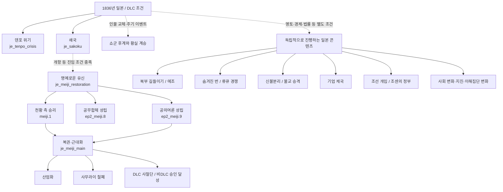
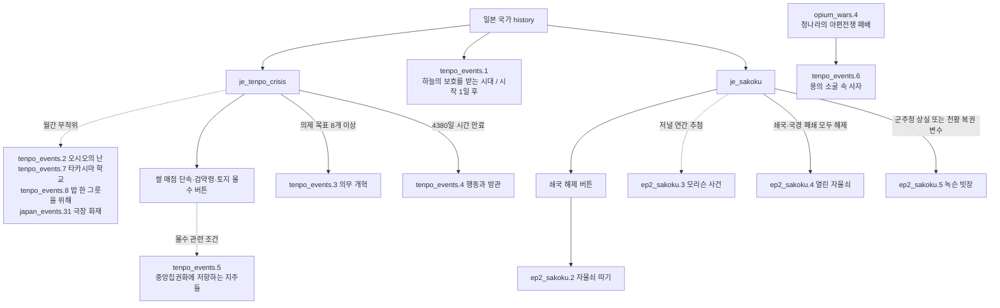
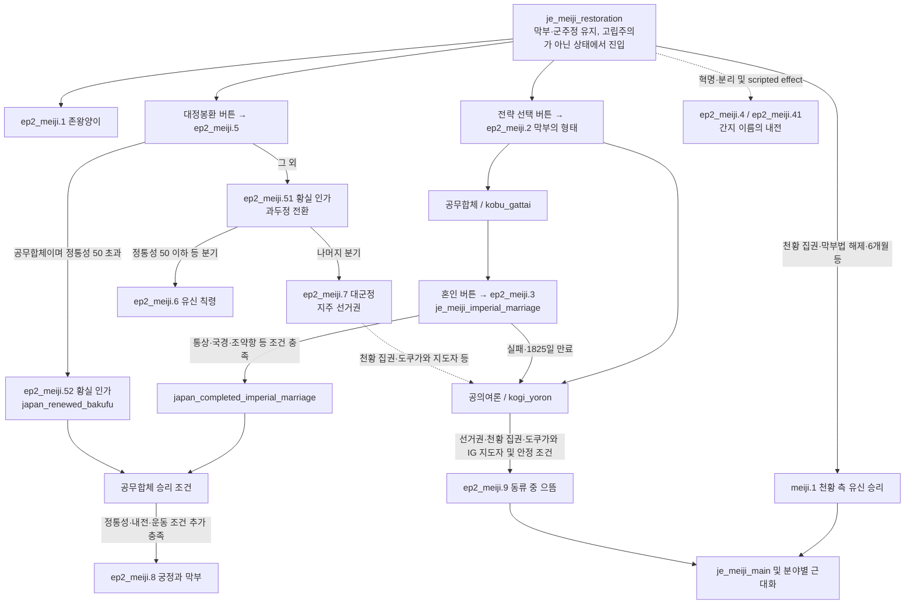
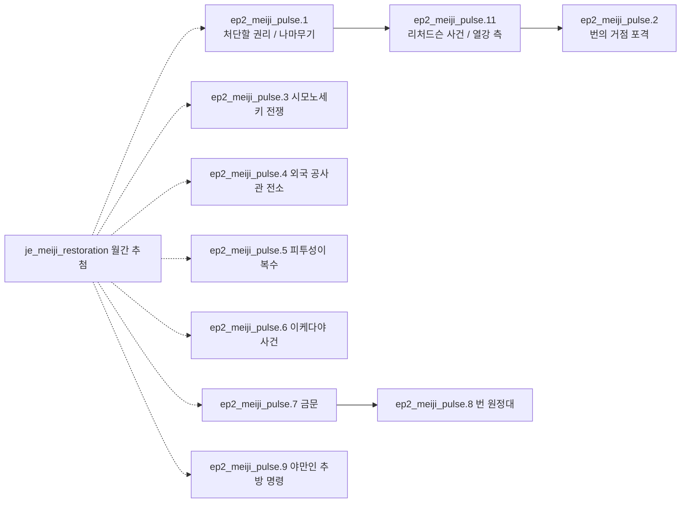
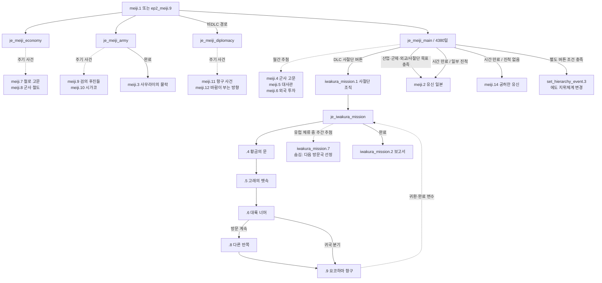
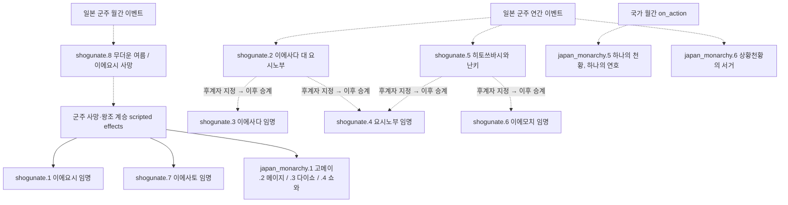
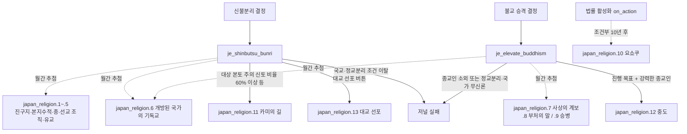
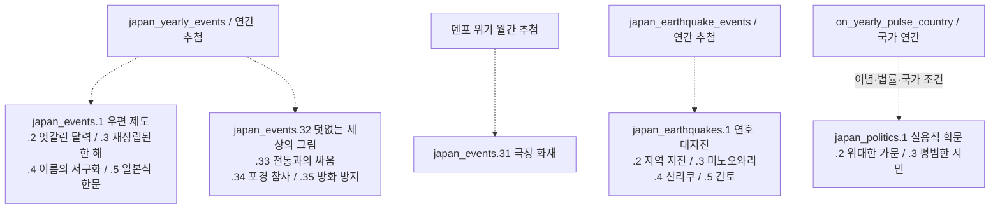

# 바닐라 일본 저널·이벤트 전체 목록과 흐름

조사일: 2026-09-21

## 조사 범위와 읽는 법

설치된 `D:/SteamLibrary/steamapps/common/Victoria 3/game`의 현재 파일과 한국어 localization을 기준으로 조사했다. EAFP의 REPLACE·INJECT와 신규 콘텐츠는 적용하지 않은 **바닐라 정의**다. 기본 게임과 설치된 DLC의 정의를 모두 포함하므로, 실제 캠페인에서는 DLC 기능·법률·연도·국가·인물 조건에 따라 일부만 발생한다.

- 본 목록: `events/japan_events/` 전체, `events/meiji_restoration.txt`, 이에 대응하는 일본 저널 9개 파일.
- 연결 목록: 동학·조선 혁명과 청일전쟁, 청나라 아편전쟁 패배, 에도 지위체계 변경 등 일본 경로와 직접 연결되는 외부 파일.
- 참고 목록: 일본을 대상으로 삼거나 일본 관련 분기가 있는 범용·타국 사건. 일본에서 발생할 수 있는 모든 범용 사건을 일본 전용 콘텐츠로 세지는 않는다.
- 실선은 명시적인 실행·후속 관계 또는 표시한 조건을 충족했을 때의 진행을 뜻한다. 점선은 주기적 추첨, 조건 변화, 별도 시스템을 통한 연결이다. 점선 사건은 앞 사건 직후 확정적으로 발생하는 것이 아니다.
- 그림은 주요 조건을 요약한다. 세부 trigger·선택지·AI 조건 전체를 펼친 실행 명세는 아니다. 목록의 소스 위치에서 원문을 확인할 수 있다.
- ID가 연속하지 않는 것은 원본 그대로다. 없는 번호를 보충하지 않았다. 디버그 이벤트도 별도로 표시하여 포함했다.
- 저널의 `event_outcome_*_effect_desc`와 `show_as_tooltip`은 효과 미리보기이므로 실제 이벤트 호출과 구분했다.

## 1. 전체 구조

일본 콘텐츠는 유신 하나로 이어지는 직선 구조가 아니다. 덴포 위기·쇄국·왕조 계승·개척·종교·산업화 등이 병행된다. 특히 공무합체 결말은 쇼군을 유지하지만, 공의여론은 천황 복권과 도쿠가와의 정치적 잔존을 결합한다.

공무합체 결말 `ep2_meiji.8`에는 `je_meiji_main`을 추가하는 처리가 없다. 공의여론 결말 `ep2_meiji.9`와 천황 측 승리 `meiji.1`은 근대화 저널을 연결한다. ‘개항 → 유신’ 화살표는 쇄국 저널의 직접 호출이 아니라 유신 저널의 활성 조건 변화다.

## 2. 덴포 위기와 쇄국

덴포 위기 성공·실패는 쇄국 또는 유신 저널의 필수 선행 완료 조건이 아니다. `tenpo_events.6`도 덴포 위기 저널의 완료 이벤트가 아니라 외부 아편전쟁 결과에서 연결된다.

## 3. 명예로운 유신과 막부의 두 전략

- 내부적으로 천황 승리는 `complete`, 막부 승리는 `fail`이다. 화면의 사용자 정의 제목은 이를 각 진영의 승리로 표시한다.
- 공무합체 승리는 막부법·막부 재인가·황실 혼인을 요구한다. 공의여론 승리는 천황 집권·선거권·도쿠가와 가문 이해집단 지도자와 정부 참여를 요구한다.
- 두 막부 승리 경로는 정통성 75 이상, 진행 중 내전 부재, 존왕양이 운동의 지지도 또는 급진성 조건도 확인한다.
- `ep2_meiji.51`과 `.52`는 서로 다른 황실 인가 사건이다. `.51`은 정권 전환, `.52`는 막부 재인가로 이어지므로 혼동하면 안 된다.
- 양측 결말에서 `japan_restoration_complete`를 사용한다. `japan_emperor_restored`는 천황 복권 여부를 따로 기록한다.

### 유신 정국의 월간 사건

추첨 대상에 있어도 각 이벤트 trigger를 충족해야 한다. 후속 사건 역시 선택지·분기 조건에 따라 호출된다.

## 4. 근대화와 해외 사절단

그림의 `.4`~`.9`는 `iwakura_mission` 네임스페이스다. 이미 완료 조건을 갖춘 분야는 시작 사건에서 즉시 달성 처리하거나 관련 완료 사건을 호출할 수 있으므로, 모든 세부 저널이 반드시 동시에 생성되는 것은 아니다. 사절단에는 소환 버튼과 귀국 처리도 있으며, 방문·귀환은 단순한 일회성 이벤트 순서 이상의 변수로 관리한다.

`meiji.13` ‘일본 개항’은 강제 개항 modifier를 조건으로 가진 `orphan = yes` 정의다. 현재 활성 스크립트에서 직접 호출원을 찾지 못했으므로 확정 실행 경로에는 넣지 않았다. `je_meiji_main` 완료 사건도 아니다.

## 5. 쇼군·천황 계승

임명 사건들이 서로를 차례로 직접 호출하는 구조가 아니다. 후계자를 정한 뒤 인물 사망·계승 효과가 해당 임명 사건을 호출한다. 바닐라의 `.2`, `.5`는 실제 `set_heir`를 사용한다. 황실 계승과 쇼군 집권은 별도의 인물·법률 처리로 연결된다.

## 6. 종교 노선

이 두 저널은 유신 완료 보상으로 자동 생성되는 공통 후속 저널이 아니라 각 결정에서 시작한다.

## 7. 개척·류큐·조선·재벌

```mermaid
flowchart TD
    NORTH["je_taming_the_north<br/>홋카이도 전역·편입·도시 조건"] --> N1["hokkaido_events.1 여덟 번째 도"]
    NORTH --> NB["개척·아이누·농학교·농업 확장 버튼"] --> NP["hokkaido_events.2~.6"]
    NORTH -->|"인구·GDP·농업 확장·식민지 목표"| N7["hokkaido_events.7 개척사의 종막"]
    NORTH -->|"홋카이도 상실"| N8["hokkaido_events.8 대의를 잃은 개척사"]
    EZO["국가 월간 on_action / 에조 관련 조건"] -.-> E2["ezo_republic.2 하코다테 원정"] --> E1["ezo_republic.1 에조 정부"]
    R["je_ryukyu_rivalry<br/>일본 개방·청·류큐 존재"] --> R8["ryukyu_rivalry.8 숨겨진 번"]
    R --> RB["종주권·상인·방어·종교 권위 버튼"] --> RP["ryukyu_rivalry.1~.4"]
    R -. "연간 경합" .-> R6["ryukyu_rivalry.6 대립"]
    R -->|"일본 +40 / 청 -40"| R5["ryukyu_rivalry.5 류큐의 운명"]
    R -->|"류큐 독자 진행 100"| R7["ryukyu_rivalry.7 류큐 칙령"]
    K1["je_donghak_movement / 동학"] -. "청원·봉기 경로" .-> K2["je_gyojo_shinwon / 교조 신원"]
    K1 -. "혁명 발생" .-> K3["je_korean_rebellion / 조선 혁명"]
    K3 -. "외국 개입 사건" .-> K7["gg_korea.7 조선 봉기"]
    K3 -->|"정부 승리 및 개입 조건"| K8["gg_korea.8 일본 측 요구"] --> K9["gg_korea.9 청나라 측 응답"]
    TERRITORY["조선 5개 주 전역 소유·식민부"] --> KC["je_colonize_korea"]
    KC -->|"편입·문화·소요·산업·행정 목표"| KC2["korea_colonization.2 유망한 미래"]
    KC -->|"지배 상실 조건"| KC3["korea_colonization.3 사라진 기회"]
    Z["je_zaibatsu / 기업 제국"] -->|"재벌 소유·번영 확대"| Z1["zaibatsu.1 기업 제국"]
    Z -->|"재벌 억제 조건"| Z2["zaibatsu.2 통제 확립"]
```

조선 혁명·청일 간 개입과 조선 식민통치 저널은 서로 다른 시스템이다. `gg_korea.9`를 통과했다고 `je_colonize_korea`가 자동으로 완료되거나 바로 시작되는 것은 아니다. 류큐의 ±40은 영향력 점수이고, 100은 별도의 류큐 진행도다. 재벌 저널은 유신 성공 여부만으로 시작하지 않으며 경제·기업·법률 조건을 따로 확인한다.

## 8. 독립적인 사회·정치·재난 사건

각 사건은 자체 연도·기술·법률·건물·인물 조건을 갖는다. 예컨대 달력 사건과 재벌 명칭 변화는 별도의 조건을 검사하므로 목록 순서가 발생 순서를 보장하지 않는다.

## 9. 저널 전체 목록

일본 핵심 저널 **15개**, 조선 개입 연결 저널 **3개**다.

| ID | 한국어 표시명 | 활성·진행·종료 요약 | 정의 |
|---|---|---|---|
| `je_meiji_restoration` | 명예로운 유신 | 개항 조건에서 시작. 천황 승리는 meiji.1, 공무합체는 ep2_meiji.8, 공의여론은 ep2_meiji.9. 막부 승리는 내부 fail 분기. | [00_meiji_restoration.txt](<D:/SteamLibrary/steamapps/common/Victoria 3/game/common/journal_entries/00_meiji_restoration.txt:1>) |
| `je_meiji_imperial_marriage` | 황실 결혼 | ep2_meiji.3에서 추가. 조약·국경·통상 조건을 충족하면 혼인 완수 변수. 실패·5년 만료 시 공의여론으로 전환. | [00_meiji_restoration.txt](<D:/SteamLibrary/steamapps/common/Victoria 3/game/common/journal_entries/00_meiji_restoration.txt:496>) |
| `je_meiji_main` | [ROOT.Var('emperor_var').GetCharacter.GetFirstName] 복권 | 천황 복권 또는 공의여론 결말에서 추가. 산업·군제·외교/사절단 진행을 통합. meiji.2 또는 meiji.14로 종료. | [00_meiji_restoration.txt](<D:/SteamLibrary/steamapps/common/Victoria 3/game/common/journal_entries/00_meiji_restoration.txt:640>) |
| `je_meiji_economy` | 유신: 일본 산업화 | 산업화 목표. meiji.7·.8을 주기적으로 추첨하며 완료 시 경제 개혁 달성 기록. | [00_meiji_restoration.txt](<D:/SteamLibrary/steamapps/common/Victoria 3/game/common/journal_entries/00_meiji_restoration.txt:744>) |
| `je_meiji_army` | 유신: 사무라이 철폐 | 군제·사무라이 개혁 목표. meiji.9·.10 추첨, 완료 시 meiji.3. | [00_meiji_restoration.txt](<D:/SteamLibrary/steamapps/common/Victoria 3/game/common/journal_entries/00_meiji_restoration.txt:792>) |
| `je_meiji_diplomacy` | 유신: 승인 달성 | 비DLC 근대화의 승인 달성 분야. meiji.11·.12 추첨. DLC에서는 사절단 경로를 사용. | [00_meiji_restoration.txt](<D:/SteamLibrary/steamapps/common/Victoria 3/game/common/journal_entries/00_meiji_restoration.txt:851>) |
| `je_ryukyu_rivalry` | 숨겨진 번 | 일본·청·류큐의 별도 경합. 일본 영향력 +40 또는 청 영향력 -40, 류큐 진행도 100 등으로 결과 분기. | [01_ryukyu_rivalry.txt](<D:/SteamLibrary/steamapps/common/Victoria 3/game/common/journal_entries/01_ryukyu_rivalry.txt:1>) |
| `je_taming_the_north` | 북부 길들이기 | 일본 또는 에조. 홋카이도 전역 소유·편입·도시 조건. 개척 버튼과 인구·GDP 목표; .7 성공 / .8 일본의 실패. | [07_hokkaido.txt](<D:/SteamLibrary/steamapps/common/Victoria 3/game/common/journal_entries/07_hokkaido.txt:1>) |
| `je_iwakura_mission` | 유신: [ROOT.Var('expedition_leader_storage_var').GetCharacter.GetLastName] 사절단 | iwakura_mission.1에서 추가. .4부터 여정 시작, 유럽 주간 .7, 귀환 및 완료 조건으로 .2 보고서. | [07_iwakura_mission.txt](<D:/SteamLibrary/steamapps/common/Victoria 3/game/common/journal_entries/07_iwakura_mission.txt:1>) |
| `je_shinbutsu_bunri` | 신불분리 | 신불분리 결정으로 시작. 신토 확산, 종교 사건 .1~.6, 완료 .11. | [07_japanese_religion.txt](<D:/SteamLibrary/steamapps/common/Victoria 3/game/common/journal_entries/07_japanese_religion.txt:1>) |
| `je_elevate_buddhism` | 불교 승격 | 불교 승격 결정으로 시작. 강력한 종교인을 유지해 진행 60 달성, 종교 사건 .6~.9, 완료 .12. | [07_japanese_religion.txt](<D:/SteamLibrary/steamapps/common/Victoria 3/game/common/journal_entries/07_japanese_religion.txt:155>) |
| `je_colonize_korea` | 조센의 정부 | 조선 5개 주 전역 소유와 식민부 조건. 편입·일본 문화·소요·기업·산업·행정 목표, .2 성공 / .3 실패. | [07_korea_colonization.txt](<D:/SteamLibrary/steamapps/common/Victoria 3/game/common/journal_entries/07_korea_colonization.txt:1>) |
| `je_sakoku` | 쇄국 | DLC 일본 시작 history에서 추가. 쇄국과 국경 폐쇄 해제 시 ep2_sakoku.4, 군주정 상실·천황 복권 시 .5. | [07_sakoku.txt](<D:/SteamLibrary/steamapps/common/Victoria 3/game/common/journal_entries/07_sakoku.txt:1>) |
| `je_tenpo_crisis` | 덴포 위기 | DLC 일본 시작 history에서 추가. 의제 목표 8개 이상 시 tenpo_events.3, 4380일 만료 시 .4. | [07_tenpo_crisis.txt](<D:/SteamLibrary/steamapps/common/Victoria 3/game/common/journal_entries/07_tenpo_crisis.txt:1>) |
| `je_zaibatsu` | 기업 제국 | 개방·경제법·산업가·재벌 소유 조건. 재벌 번영 확대 시 zaibatsu.1, 통제 확립 시 .2. | [07_zaibatsu.txt](<D:/SteamLibrary/steamapps/common/Victoria 3/game/common/journal_entries/07_zaibatsu.txt:1>) |
| `je_donghak_movement` | 동학 농민 운동 | 조선의 동학 기반 저널. gg_korea.1 시작, .4 청원 사건, 실패 .2 봉기. | [03_korea.txt](<D:/SteamLibrary/steamapps/common/Victoria 3/game/common/journal_entries/03_korea.txt:1>) |
| `je_gyojo_shinwon` | 교조 신원 운동 | gg_korea.4의 교조 신원 청원에서 추가. gg_korea.5 성공 / .6 시간 만료. | [03_korea.txt](<D:/SteamLibrary/steamapps/common/Victoria 3/game/common/journal_entries/03_korea.txt:97>) |
| `je_korean_rebellion` | 조선 혁명 | 조선 혁명과 외국 개입을 추적. 정부 승리·개입 조건에서 gg_korea.8 일본 측 요구 → .9 청나라 응답. | [03_korea.txt](<D:/SteamLibrary/steamapps/common/Victoria 3/game/common/journal_entries/03_korea.txt:189>) |

## 10. 일본 이벤트 전체 목록

일본 전용 디렉터리와 기본 유신 파일의 이벤트는 **124개**다. 여기에는 `ep2_meiji.1000` 디버그 사건 1개도 포함된다.

호출원은 실제 `trigger_event`, 가중 이벤트 목록, on_action의 이벤트 목록을 역추적한 결과다. 조건 분기 전체를 표에 반복하지는 않는다. scripted effect가 호출원인 경우 해당 효과를 실행하는 상위 시스템도 함께 작동해야 한다.

### ep2_ezo_republic.txt — 2개

| 이벤트 ID | 한국어 제목 | 확인된 호출원 |
|---|---|---|
| [ezo_republic.1](<D:/SteamLibrary/steamapps/common/Victoria 3/game/events/japan_events/ep2_ezo_republic.txt:3>) | 에조 정부 | [ezo_republic.2](<D:/SteamLibrary/steamapps/common/Victoria 3/game/events/japan_events/ep2_ezo_republic.txt:399>) |
| [ezo_republic.2](<D:/SteamLibrary/steamapps/common/Victoria 3/game/events/japan_events/ep2_ezo_republic.txt:194>) | 하코다테 원정 | [on_monthly_pulse_country](<D:/SteamLibrary/steamapps/common/Victoria 3/game/common/on_actions/00_code_on_actions.txt:563>) |

### ep2_hokkaido_events.txt — 8개

| 이벤트 ID | 한국어 제목 | 확인된 호출원 |
|---|---|---|
| [hokkaido_events.1](<D:/SteamLibrary/steamapps/common/Victoria 3/game/events/japan_events/ep2_hokkaido_events.txt:4>) | 여덟 번째 도 / 북부의 관문 | [je_taming_the_north](<D:/SteamLibrary/steamapps/common/Victoria 3/game/common/journal_entries/07_hokkaido.txt:72>) |
| [hokkaido_events.2](<D:/SteamLibrary/steamapps/common/Victoria 3/game/events/japan_events/ep2_hokkaido_events.txt:242>) | 새로운 개척지 | [button_je_taming_the_north_establish_colonies](<D:/SteamLibrary/steamapps/common/Victoria 3/game/common/scripted_buttons/07_japan_buttons.txt:221>) |
| [hokkaido_events.3](<D:/SteamLibrary/steamapps/common/Victoria 3/game/events/japan_events/ep2_hokkaido_events.txt:446>) | 진보의 씨앗 | [button_je_taming_the_north_agriculture_potentials](<D:/SteamLibrary/steamapps/common/Victoria 3/game/common/scripted_buttons/07_japan_buttons.txt:414>) |
| [hokkaido_events.4](<D:/SteamLibrary/steamapps/common/Victoria 3/game/events/japan_events/ep2_hokkaido_events.txt:632>) | 토양의 성장 | [button_je_taming_the_north_agriculture_arable_land](<D:/SteamLibrary/steamapps/common/Victoria 3/game/common/scripted_buttons/07_japan_buttons.txt:501>) |
| [hokkaido_events.5](<D:/SteamLibrary/steamapps/common/Victoria 3/game/events/japan_events/ep2_hokkaido_events.txt:818>) | 소년이여, 야망을 품어라... | [button_je_taming_the_north_sapporo_agricultural_college](<D:/SteamLibrary/steamapps/common/Victoria 3/game/common/scripted_buttons/07_japan_buttons.txt:362>) |
| [hokkaido_events.6](<D:/SteamLibrary/steamapps/common/Victoria 3/game/events/japan_events/ep2_hokkaido_events.txt:968>) | 아이누 모시르, 시삼 모시르 | [button_je_taming_the_north_integrate_ainu](<D:/SteamLibrary/steamapps/common/Victoria 3/game/common/scripted_buttons/07_japan_buttons.txt:266>) |
| [hokkaido_events.7](<D:/SteamLibrary/steamapps/common/Victoria 3/game/events/japan_events/ep2_hokkaido_events.txt:1074>) | 개척사의 종막 | [je_taming_the_north](<D:/SteamLibrary/steamapps/common/Victoria 3/game/common/journal_entries/07_hokkaido.txt:146>) |
| [hokkaido_events.8](<D:/SteamLibrary/steamapps/common/Victoria 3/game/events/japan_events/ep2_hokkaido_events.txt:1199>) | 대의를 잃은 개척사 | [je_taming_the_north](<D:/SteamLibrary/steamapps/common/Victoria 3/game/common/journal_entries/07_hokkaido.txt:246>) |

### ep2_imperial_events.txt — 6개

| 이벤트 ID | 한국어 제목 | 확인된 호출원 |
|---|---|---|
| [japan_monarchy.1](<D:/SteamLibrary/steamapps/common/Victoria 3/game/events/japan_events/ep2_imperial_events.txt:4>) | 가에이 시대 / 덴큐 시대 | [on_remove_ruler_effects](<D:/SteamLibrary/steamapps/common/Victoria 3/game/common/scripted_effects/00_victoria_ep2_scripted_effects.txt:2813>) [character_japan_imperial_succession_chain_effect](<D:/SteamLibrary/steamapps/common/Victoria 3/game/common/scripted_effects/00_victoria_royal_successions.txt:956>) |
| [japan_monarchy.2](<D:/SteamLibrary/steamapps/common/Victoria 3/game/events/japan_events/ep2_imperial_events.txt:152>) | 메이지 시대 | [on_remove_ruler_effects](<D:/SteamLibrary/steamapps/common/Victoria 3/game/common/scripted_effects/00_victoria_ep2_scripted_effects.txt:2827>) [character_japan_imperial_succession_chain_effect](<D:/SteamLibrary/steamapps/common/Victoria 3/game/common/scripted_effects/00_victoria_royal_successions.txt:994>) |
| [japan_monarchy.3](<D:/SteamLibrary/steamapps/common/Victoria 3/game/events/japan_events/ep2_imperial_events.txt:240>) | 다이쇼 시대 | [on_remove_ruler_effects](<D:/SteamLibrary/steamapps/common/Victoria 3/game/common/scripted_effects/00_victoria_ep2_scripted_effects.txt:2841>) [character_japan_imperial_succession_chain_effect](<D:/SteamLibrary/steamapps/common/Victoria 3/game/common/scripted_effects/00_victoria_royal_successions.txt:1025>) |
| [japan_monarchy.4](<D:/SteamLibrary/steamapps/common/Victoria 3/game/events/japan_events/ep2_imperial_events.txt:327>) | 쇼와 시대 | [on_remove_ruler_effects](<D:/SteamLibrary/steamapps/common/Victoria 3/game/common/scripted_effects/00_victoria_ep2_scripted_effects.txt:2855>) [character_japan_imperial_succession_chain_effect](<D:/SteamLibrary/steamapps/common/Victoria 3/game/common/scripted_effects/00_victoria_royal_successions.txt:1055>) |
| [japan_monarchy.5](<D:/SteamLibrary/steamapps/common/Victoria 3/game/events/japan_events/ep2_imperial_events.txt:414>) | 하나의 천황, 하나의 연호 | [on_monthly_pulse_country](<D:/SteamLibrary/steamapps/common/Victoria 3/game/common/on_actions/00_code_on_actions.txt:560>) |
| [japan_monarchy.6](<D:/SteamLibrary/steamapps/common/Victoria 3/game/events/japan_events/ep2_imperial_events.txt:463>) | 상황천황의 서거 | [japan_monarchy_yearly_events](<D:/SteamLibrary/steamapps/common/Victoria 3/game/common/on_actions/00_on_actions_yearly.txt:263>) |

### ep2_iwakura_events.txt — 8개

| 이벤트 ID | 한국어 제목 | 확인된 호출원 |
|---|---|---|
| [iwakura_mission.1](<D:/SteamLibrary/steamapps/common/Victoria 3/game/events/japan_events/ep2_iwakura_events.txt:4>) | 서양으로 가는 사절단 | [je_iwakura_mission_button](<D:/SteamLibrary/steamapps/common/Victoria 3/game/common/scripted_buttons/meiji_reform_buttons.txt:36>) |
| [iwakura_mission.2](<D:/SteamLibrary/steamapps/common/Victoria 3/game/events/japan_events/ep2_iwakura_events.txt:189>) | [ROOT.Var('expedition_leader_storage_var').GetCharacter.GetLastName] 보고서 | [je_iwakura_mission](<D:/SteamLibrary/steamapps/common/Victoria 3/game/common/journal_entries/07_iwakura_mission.txt:116>) |
| [iwakura_mission.4](<D:/SteamLibrary/steamapps/common/Victoria 3/game/events/japan_events/ep2_iwakura_events.txt:418>) | 황금의 문 | [je_iwakura_mission](<D:/SteamLibrary/steamapps/common/Victoria 3/game/common/journal_entries/07_iwakura_mission.txt:69>) |
| [iwakura_mission.5](<D:/SteamLibrary/steamapps/common/Victoria 3/game/events/japan_events/ep2_iwakura_events.txt:489>) | 고래의 뱃속 | [iwakura_mission.4](<D:/SteamLibrary/steamapps/common/Victoria 3/game/events/japan_events/ep2_iwakura_events.txt:478>) |
| [iwakura_mission.6](<D:/SteamLibrary/steamapps/common/Victoria 3/game/events/japan_events/ep2_iwakura_events.txt:561>) | 대륙 너머 | [iwakura_mission.5](<D:/SteamLibrary/steamapps/common/Victoria 3/game/events/japan_events/ep2_iwakura_events.txt:550>) |
| [iwakura_mission.7](<D:/SteamLibrary/steamapps/common/Victoria 3/game/events/japan_events/ep2_iwakura_events.txt:678>) | 숨김 처리: 유럽의 다음 방문국 선정 | [je_iwakura_mission](<D:/SteamLibrary/steamapps/common/Victoria 3/game/common/journal_entries/07_iwakura_mission.txt:91>) |
| [iwakura_mission.8](<D:/SteamLibrary/steamapps/common/Victoria 3/game/events/japan_events/ep2_iwakura_events.txt:799>) | 다른 반쪽 | [iwakura_mission.6](<D:/SteamLibrary/steamapps/common/Victoria 3/game/events/japan_events/ep2_iwakura_events.txt:641>) |
| [iwakura_mission.9](<D:/SteamLibrary/steamapps/common/Victoria 3/game/events/japan_events/ep2_iwakura_events.txt:901>) | 요코하마 항구 | [je_iwakura_mission_recall_mission](<D:/SteamLibrary/steamapps/common/Victoria 3/game/common/scripted_buttons/07_iwakura_buttons.txt:33>) [iwakura_mission.6](<D:/SteamLibrary/steamapps/common/Victoria 3/game/events/japan_events/ep2_iwakura_events.txt:644>) [iwakura_mission.8](<D:/SteamLibrary/steamapps/common/Victoria 3/game/events/japan_events/ep2_iwakura_events.txt:889>) |

### ep2_japan_earthquake_events.txt — 5개

| 이벤트 ID | 한국어 제목 | 확인된 호출원 |
|---|---|---|
| [japan_earthquakes.1](<D:/SteamLibrary/steamapps/common/Victoria 3/game/events/japan_events/ep2_japan_earthquake_events.txt:7>) | [ROOT.GetCountry.GetCustom('JAP_era_name')] 대지진 | [japan_earthquake_events](<D:/SteamLibrary/steamapps/common/Victoria 3/game/common/on_actions/00_on_actions_yearly.txt:613>) |
| [japan_earthquakes.2](<D:/SteamLibrary/steamapps/common/Victoria 3/game/events/japan_events/ep2_japan_earthquake_events.txt:117>) | [ROOT.GetCountry.GetCustom('JAP_era_name')] [SCOPE.sState('japan_earthquake_state').GetCityHubName] 지진 | [japan_earthquake_events](<D:/SteamLibrary/steamapps/common/Victoria 3/game/common/on_actions/00_on_actions_yearly.txt:614>) |
| [japan_earthquakes.3](<D:/SteamLibrary/steamapps/common/Victoria 3/game/events/japan_events/ep2_japan_earthquake_events.txt:195>) | 미노오와리 지진 | [japan_earthquake_events](<D:/SteamLibrary/steamapps/common/Victoria 3/game/common/on_actions/00_on_actions_yearly.txt:615>) |
| [japan_earthquakes.4](<D:/SteamLibrary/steamapps/common/Victoria 3/game/events/japan_events/ep2_japan_earthquake_events.txt:279>) | 산리쿠 지진 | [japan_earthquake_events](<D:/SteamLibrary/steamapps/common/Victoria 3/game/common/on_actions/00_on_actions_yearly.txt:616>) |
| [japan_earthquakes.5](<D:/SteamLibrary/steamapps/common/Victoria 3/game/events/japan_events/ep2_japan_earthquake_events.txt:364>) | 간토 대지진 | [japan_earthquake_events](<D:/SteamLibrary/steamapps/common/Victoria 3/game/common/on_actions/00_on_actions_yearly.txt:617>) |

### ep2_japan_events.txt — 5개

| 이벤트 ID | 한국어 제목 | 확인된 호출원 |
|---|---|---|
| [japan_events.1](<D:/SteamLibrary/steamapps/common/Victoria 3/game/events/japan_events/ep2_japan_events.txt:4>) | 전 국민 우편 제도 | [japan_yearly_events](<D:/SteamLibrary/steamapps/common/Victoria 3/game/common/on_actions/00_on_actions_yearly.txt:598>) |
| [japan_events.2](<D:/SteamLibrary/steamapps/common/Victoria 3/game/events/japan_events/ep2_japan_events.txt:181>) | 엇갈린 달력 | [japan_yearly_events](<D:/SteamLibrary/steamapps/common/Victoria 3/game/common/on_actions/00_on_actions_yearly.txt:599>) |
| [japan_events.3](<D:/SteamLibrary/steamapps/common/Victoria 3/game/events/japan_events/ep2_japan_events.txt:331>) | 재정립된 한 해 | [japan_yearly_events](<D:/SteamLibrary/steamapps/common/Victoria 3/game/common/on_actions/00_on_actions_yearly.txt:600>) |
| [japan_events.4](<D:/SteamLibrary/steamapps/common/Victoria 3/game/events/japan_events/ep2_japan_events.txt:508>) | 이름의 서구화 | [japan_yearly_events](<D:/SteamLibrary/steamapps/common/Victoria 3/game/common/on_actions/00_on_actions_yearly.txt:601>) |
| [japan_events.5](<D:/SteamLibrary/steamapps/common/Victoria 3/game/events/japan_events/ep2_japan_events.txt:708>) | 일본식 한문의 문제 | [japan_yearly_events](<D:/SteamLibrary/steamapps/common/Victoria 3/game/common/on_actions/00_on_actions_yearly.txt:602>) |

### ep2_japan_events_03.txt — 5개

| 이벤트 ID | 한국어 제목 | 확인된 호출원 |
|---|---|---|
| [japan_events.31](<D:/SteamLibrary/steamapps/common/Victoria 3/game/events/japan_events/ep2_japan_events_03.txt:6>) | [SCOPE.sState('kabuki_theatre_state').GetCityHubName]의 극장이 불타다 | [je_tenpo_crisis](<D:/SteamLibrary/steamapps/common/Victoria 3/game/common/journal_entries/07_tenpo_crisis.txt:128>) |
| [japan_events.32](<D:/SteamLibrary/steamapps/common/Victoria 3/game/events/japan_events/ep2_japan_events_03.txt:128>) | 덧없는 세상의 그림 | [japan_yearly_events](<D:/SteamLibrary/steamapps/common/Victoria 3/game/common/on_actions/00_on_actions_yearly.txt:603>) |
| [japan_events.33](<D:/SteamLibrary/steamapps/common/Victoria 3/game/events/japan_events/ep2_japan_events_03.txt:239>) | 전통과의 싸움 | [japan_yearly_events](<D:/SteamLibrary/steamapps/common/Victoria 3/game/common/on_actions/00_on_actions_yearly.txt:604>) |
| [japan_events.34](<D:/SteamLibrary/steamapps/common/Victoria 3/game/events/japan_events/ep2_japan_events_03.txt:353>) | [SCOPE.sState('whaling_state').GetPortHubName]의 포경 참사 | [japan_yearly_events](<D:/SteamLibrary/steamapps/common/Victoria 3/game/common/on_actions/00_on_actions_yearly.txt:605>) |
| [japan_events.35](<D:/SteamLibrary/steamapps/common/Victoria 3/game/events/japan_events/ep2_japan_events_03.txt:443>) | 방화 방지 조치 | [japan_yearly_events](<D:/SteamLibrary/steamapps/common/Victoria 3/game/common/on_actions/00_on_actions_yearly.txt:606>) |

### ep2_japan_political_events.txt — 3개

| 이벤트 ID | 한국어 제목 | 확인된 호출원 |
|---|---|---|
| [japan_politics.1](<D:/SteamLibrary/steamapps/common/Victoria 3/game/events/japan_events/ep2_japan_political_events.txt:4>) | 실용적 학문 | [on_yearly_pulse_country](<D:/SteamLibrary/steamapps/common/Victoria 3/game/common/on_actions/00_code_on_actions.txt:1581>) |
| [japan_politics.2](<D:/SteamLibrary/steamapps/common/Victoria 3/game/events/japan_events/ep2_japan_political_events.txt:58>) | 위대한 가문 | [on_yearly_pulse_country](<D:/SteamLibrary/steamapps/common/Victoria 3/game/common/on_actions/00_code_on_actions.txt:1582>) |
| [japan_politics.3](<D:/SteamLibrary/steamapps/common/Victoria 3/game/events/japan_events/ep2_japan_political_events.txt:110>) | 평범한 시민 | [on_yearly_pulse_country](<D:/SteamLibrary/steamapps/common/Victoria 3/game/common/on_actions/00_code_on_actions.txt:1583>) |

### ep2_korea_colonization.txt — 2개

| 이벤트 ID | 한국어 제목 | 확인된 호출원 |
|---|---|---|
| [korea_colonization.2](<D:/SteamLibrary/steamapps/common/Victoria 3/game/events/japan_events/ep2_korea_colonization.txt:4>) | 유망한 미래 | [je_colonize_korea](<D:/SteamLibrary/steamapps/common/Victoria 3/game/common/journal_entries/07_korea_colonization.txt:157>) |
| [korea_colonization.3](<D:/SteamLibrary/steamapps/common/Victoria 3/game/events/japan_events/ep2_korea_colonization.txt:124>) | 사라진 기회 | [je_colonize_korea](<D:/SteamLibrary/steamapps/common/Victoria 3/game/common/journal_entries/07_korea_colonization.txt:240>) |

### ep2_meiji_restoration.txt — 23개

| 이벤트 ID | 한국어 제목 | 확인된 호출원 |
|---|---|---|
| [ep2_meiji.1](<D:/SteamLibrary/steamapps/common/Victoria 3/game/events/japan_events/ep2_meiji_restoration.txt:3>) | 존왕양이 | [je_meiji_restoration](<D:/SteamLibrary/steamapps/common/Victoria 3/game/common/journal_entries/00_meiji_restoration.txt:47>) |
| [ep2_meiji.2](<D:/SteamLibrary/steamapps/common/Victoria 3/game/events/japan_events/ep2_meiji_restoration.txt:107>) | 막부의 형태 | [je_meiji_restoration_decide_shogunate_strategy](<D:/SteamLibrary/steamapps/common/Victoria 3/game/common/scripted_buttons/07_meiji_buttons.txt:179>) |
| [ep2_meiji.3](<D:/SteamLibrary/steamapps/common/Victoria 3/game/events/japan_events/ep2_meiji_restoration.txt:192>) | 황실 결혼 | [je_meiji_restoration_imperial_marriage](<D:/SteamLibrary/steamapps/common/Victoria 3/game/common/scripted_buttons/07_meiji_buttons.txt:290>) |
| [ep2_meiji.4](<D:/SteamLibrary/steamapps/common/Victoria 3/game/events/japan_events/ep2_meiji_restoration.txt:324>) | [ROOT.GetCountry.GetCustom('get_sexagenary_cycle_term')] 전쟁 | [meiji_civil_war_effects](<D:/SteamLibrary/steamapps/common/Victoria 3/game/common/scripted_effects/00_victoria_ep2_scripted_effects.txt:2362>) |
| [ep2_meiji.41](<D:/SteamLibrary/steamapps/common/Victoria 3/game/events/japan_events/ep2_meiji_restoration.txt:384>) | [ROOT.GetCountry.GetCustom('get_sexagenary_cycle_term')] 전쟁 | [meiji_civil_war_effects](<D:/SteamLibrary/steamapps/common/Victoria 3/game/common/scripted_effects/00_victoria_ep2_scripted_effects.txt:2295>) |
| [ep2_meiji.5](<D:/SteamLibrary/steamapps/common/Victoria 3/game/events/japan_events/ep2_meiji_restoration.txt:492>) | 대정봉환 | [je_meiji_restoration_proclaim_imperial_restoration](<D:/SteamLibrary/steamapps/common/Victoria 3/game/common/scripted_buttons/07_meiji_buttons.txt:79>) |
| [ep2_meiji.51](<D:/SteamLibrary/steamapps/common/Victoria 3/game/events/japan_events/ep2_meiji_restoration.txt:555>) | 황실 인가 | [ep2_meiji.5](<D:/SteamLibrary/steamapps/common/Victoria 3/game/events/japan_events/ep2_meiji_restoration.txt:547>) |
| [ep2_meiji.52](<D:/SteamLibrary/steamapps/common/Victoria 3/game/events/japan_events/ep2_meiji_restoration.txt:672>) | 황실 인가 | [ep2_meiji.5](<D:/SteamLibrary/steamapps/common/Victoria 3/game/events/japan_events/ep2_meiji_restoration.txt:540>) |
| [ep2_meiji.6](<D:/SteamLibrary/steamapps/common/Victoria 3/game/events/japan_events/ep2_meiji_restoration.txt:731>) | 유신 칙령 | [ep2_meiji.51](<D:/SteamLibrary/steamapps/common/Victoria 3/game/events/japan_events/ep2_meiji_restoration.txt:641>) |
| [ep2_meiji.7](<D:/SteamLibrary/steamapps/common/Victoria 3/game/events/japan_events/ep2_meiji_restoration.txt:812>) | 대군정 | [ep2_meiji.51](<D:/SteamLibrary/steamapps/common/Victoria 3/game/events/japan_events/ep2_meiji_restoration.txt:657>) |
| [ep2_meiji.8](<D:/SteamLibrary/steamapps/common/Victoria 3/game/events/japan_events/ep2_meiji_restoration.txt:881>) | 궁정과 막부 | [je_meiji_restoration](<D:/SteamLibrary/steamapps/common/Victoria 3/game/common/journal_entries/00_meiji_restoration.txt:343>) |
| [ep2_meiji.9](<D:/SteamLibrary/steamapps/common/Victoria 3/game/events/japan_events/ep2_meiji_restoration.txt:938>) | 동류 중 으뜸 | [je_meiji_restoration](<D:/SteamLibrary/steamapps/common/Victoria 3/game/common/journal_entries/00_meiji_restoration.txt:351>) |
| [ep2_meiji.1000](<D:/SteamLibrary/steamapps/common/Victoria 3/game/events/japan_events/ep2_meiji_restoration.txt:1106>) | #todo Meiji Debug Event#! | 수동 디버그용 |
| [ep2_meiji_pulse.1](<D:/SteamLibrary/steamapps/common/Victoria 3/game/events/japan_events/ep2_meiji_restoration.txt:1164>) | 처단할 권리 | [je_meiji_restoration](<D:/SteamLibrary/steamapps/common/Victoria 3/game/common/journal_entries/00_meiji_restoration.txt:111>) |
| [ep2_meiji_pulse.11](<D:/SteamLibrary/steamapps/common/Victoria 3/game/events/japan_events/ep2_meiji_restoration.txt:1297>) | [SCOPE.sCharacter('richardson_scope').GetLastNameNoFormatting] 사건 | [ep2_meiji_pulse.1](<D:/SteamLibrary/steamapps/common/Victoria 3/game/events/japan_events/ep2_meiji_restoration.txt:1288>) |
| [ep2_meiji_pulse.2](<D:/SteamLibrary/steamapps/common/Victoria 3/game/events/japan_events/ep2_meiji_restoration.txt:1347>) | [SCOPE.sCharacter('daimyo_scope').GetHomeState.GetCustom('japan_domain_seat_name')] 포격 | [ep2_meiji_pulse.11](<D:/SteamLibrary/steamapps/common/Victoria 3/game/events/japan_events/ep2_meiji_restoration.txt:1334>) |
| [ep2_meiji_pulse.3](<D:/SteamLibrary/steamapps/common/Victoria 3/game/events/japan_events/ep2_meiji_restoration.txt:1423>) | 시모노세키 전쟁 | [je_meiji_restoration](<D:/SteamLibrary/steamapps/common/Victoria 3/game/common/journal_entries/00_meiji_restoration.txt:112>) |
| [ep2_meiji_pulse.4](<D:/SteamLibrary/steamapps/common/Victoria 3/game/events/japan_events/ep2_meiji_restoration.txt:1598>) | [SCOPE.sCountry('relevant_gp').GetAdjective] 공사관 전소 | [je_meiji_restoration](<D:/SteamLibrary/steamapps/common/Victoria 3/game/common/journal_entries/00_meiji_restoration.txt:113>) |
| [ep2_meiji_pulse.5](<D:/SteamLibrary/steamapps/common/Victoria 3/game/events/japan_events/ep2_meiji_restoration.txt:1710>) | 피투성이 복수 | [je_meiji_restoration](<D:/SteamLibrary/steamapps/common/Victoria 3/game/common/journal_entries/00_meiji_restoration.txt:114>) |
| [ep2_meiji_pulse.6](<D:/SteamLibrary/steamapps/common/Victoria 3/game/events/japan_events/ep2_meiji_restoration.txt:1834>) | 이케다야 사건 | [je_meiji_restoration](<D:/SteamLibrary/steamapps/common/Victoria 3/game/common/journal_entries/00_meiji_restoration.txt:115>) |
| [ep2_meiji_pulse.7](<D:/SteamLibrary/steamapps/common/Victoria 3/game/events/japan_events/ep2_meiji_restoration.txt:1924>) | 금문 | [je_meiji_restoration](<D:/SteamLibrary/steamapps/common/Victoria 3/game/common/journal_entries/00_meiji_restoration.txt:116>) |
| [ep2_meiji_pulse.8](<D:/SteamLibrary/steamapps/common/Victoria 3/game/events/japan_events/ep2_meiji_restoration.txt:2046>) | [SCOPE.sCharacter('daimyo_1_scope').GetCustom('japan_domain_by_character')] 원정대 | [ep2_meiji_pulse.7](<D:/SteamLibrary/steamapps/common/Victoria 3/game/events/japan_events/ep2_meiji_restoration.txt:2019>) |
| [ep2_meiji_pulse.9](<D:/SteamLibrary/steamapps/common/Victoria 3/game/events/japan_events/ep2_meiji_restoration.txt:2138>) | 야만인 추방 명령 | [je_meiji_restoration](<D:/SteamLibrary/steamapps/common/Victoria 3/game/common/journal_entries/00_meiji_restoration.txt:117>) |

### ep2_sakoku_events.txt — 4개

| 이벤트 ID | 한국어 제목 | 확인된 호출원 |
|---|---|---|
| [ep2_sakoku.2](<D:/SteamLibrary/steamapps/common/Victoria 3/game/events/japan_events/ep2_sakoku_events.txt:6>) | 자물쇠 따기 | [je_sakoku_stop_being_closed_button](<D:/SteamLibrary/steamapps/common/Victoria 3/game/common/scripted_buttons/sakoku_buttons.txt:17>) |
| [ep2_sakoku.3](<D:/SteamLibrary/steamapps/common/Victoria 3/game/events/japan_events/ep2_sakoku_events.txt:157>) | [SCOPE.sCharacter('morrison_incident_country_namesake').GetLastNameNoFormatting] 사건 | [je_sakoku](<D:/SteamLibrary/steamapps/common/Victoria 3/game/common/journal_entries/07_sakoku.txt:21>) |
| [ep2_sakoku.4](<D:/SteamLibrary/steamapps/common/Victoria 3/game/events/japan_events/ep2_sakoku_events.txt:324>) | 열린 자물쇠 | [je_sakoku](<D:/SteamLibrary/steamapps/common/Victoria 3/game/common/journal_entries/07_sakoku.txt:33>) |
| [ep2_sakoku.5](<D:/SteamLibrary/steamapps/common/Victoria 3/game/events/japan_events/ep2_sakoku_events.txt:370>) | 녹슨 빗장 | [je_sakoku](<D:/SteamLibrary/steamapps/common/Victoria 3/game/common/journal_entries/07_sakoku.txt:67>) |

### ep2_shogunate_events.txt — 8개

| 이벤트 ID | 한국어 제목 | 확인된 호출원 |
|---|---|---|
| [shogunate.1](<D:/SteamLibrary/steamapps/common/Victoria 3/game/events/japan_events/ep2_shogunate_events.txt:4>) | [SCOPE.sCharacter('shogun_scope').GetFirstName] 임명 | [character_japan_ruler_succession_chain_effect](<D:/SteamLibrary/steamapps/common/Victoria 3/game/common/scripted_effects/00_victoria_royal_successions.txt:877>) |
| [shogunate.2](<D:/SteamLibrary/steamapps/common/Victoria 3/game/events/japan_events/ep2_shogunate_events.txt:66>) | 승계 문제 | [japan_monarchy_yearly_events](<D:/SteamLibrary/steamapps/common/Victoria 3/game/common/on_actions/00_on_actions_yearly.txt:261>) |
| [shogunate.3](<D:/SteamLibrary/steamapps/common/Victoria 3/game/events/japan_events/ep2_shogunate_events.txt:223>) | [SCOPE.sCharacter('shogun_scope').GetFirstName] 임명 | [character_japan_ruler_succession_chain_effect](<D:/SteamLibrary/steamapps/common/Victoria 3/game/common/scripted_effects/00_victoria_royal_successions.txt:894>) |
| [shogunate.4](<D:/SteamLibrary/steamapps/common/Victoria 3/game/events/japan_events/ep2_shogunate_events.txt:281>) | [SCOPE.sCharacter('shogun_scope').GetFirstName] 임명 | [character_japan_ruler_succession_chain_effect](<D:/SteamLibrary/steamapps/common/Victoria 3/game/common/scripted_effects/00_victoria_royal_successions.txt:926>) |
| [shogunate.5](<D:/SteamLibrary/steamapps/common/Victoria 3/game/events/japan_events/ep2_shogunate_events.txt:336>) | 히토쓰바시와 난키 | [japan_monarchy_yearly_events](<D:/SteamLibrary/steamapps/common/Victoria 3/game/common/on_actions/00_on_actions_yearly.txt:262>) |
| [shogunate.6](<D:/SteamLibrary/steamapps/common/Victoria 3/game/events/japan_events/ep2_shogunate_events.txt:483>) | [SCOPE.sCharacter('shogun_scope').GetFirstName] 임명 | [character_japan_ruler_succession_chain_effect](<D:/SteamLibrary/steamapps/common/Victoria 3/game/common/scripted_effects/00_victoria_royal_successions.txt:910>) |
| [shogunate.7](<D:/SteamLibrary/steamapps/common/Victoria 3/game/events/japan_events/ep2_shogunate_events.txt:646>) | [SCOPE.sCharacter('shogun_scope').GetFirstName] 임명 | [character_japan_ruler_succession_chain_effect](<D:/SteamLibrary/steamapps/common/Victoria 3/game/common/scripted_effects/00_victoria_royal_successions.txt:939>) |
| [shogunate.8](<D:/SteamLibrary/steamapps/common/Victoria 3/game/events/japan_events/ep2_shogunate_events.txt:701>) | 무더운 여름 | [japan_monarchy_monthly_events](<D:/SteamLibrary/steamapps/common/Victoria 3/game/common/on_actions/00_on_actions_monthly.txt:70>) |

### ep2_tenpo_events.txt — 8개

| 이벤트 ID | 한국어 제목 | 확인된 호출원 |
|---|---|---|
| [tenpo_events.1](<D:/SteamLibrary/steamapps/common/Victoria 3/game/events/japan_events/ep2_tenpo_events.txt:4>) | 하늘의 보호를 받는 시대 | [COUNTRIES](<D:/SteamLibrary/steamapps/common/Victoria 3/game/common/history/countries/jap - japan.txt:49>) |
| [tenpo_events.2](<D:/SteamLibrary/steamapps/common/Victoria 3/game/events/japan_events/ep2_tenpo_events.txt:73>) | 철학가 사무라이의 난 | [je_tenpo_crisis](<D:/SteamLibrary/steamapps/common/Victoria 3/game/common/journal_entries/07_tenpo_crisis.txt:125>) |
| [tenpo_events.3](<D:/SteamLibrary/steamapps/common/Victoria 3/game/events/japan_events/ep2_tenpo_events.txt:247>) | 의무 개혁 | [je_tenpo_crisis](<D:/SteamLibrary/steamapps/common/Victoria 3/game/common/journal_entries/07_tenpo_crisis.txt:39>) |
| [tenpo_events.4](<D:/SteamLibrary/steamapps/common/Victoria 3/game/events/japan_events/ep2_tenpo_events.txt:370>) | 행동과 방관 | [je_tenpo_crisis](<D:/SteamLibrary/steamapps/common/Victoria 3/game/common/journal_entries/07_tenpo_crisis.txt:95>) |
| [tenpo_events.5](<D:/SteamLibrary/steamapps/common/Victoria 3/game/events/japan_events/ep2_tenpo_events.txt:509>) | 중앙집권화에 저항하는 지주들 | [button_je_tenpo_confiscate_land](<D:/SteamLibrary/steamapps/common/Victoria 3/game/common/scripted_buttons/07_japan_buttons.txt:148>) |
| [tenpo_events.6](<D:/SteamLibrary/steamapps/common/Victoria 3/game/events/japan_events/ep2_tenpo_events.txt:701>) | 용의 소굴 속 사자 | [opium_wars.4](<D:/SteamLibrary/steamapps/common/Victoria 3/game/events/opium_wars_events.txt:530>) |
| [tenpo_events.7](<D:/SteamLibrary/steamapps/common/Victoria 3/game/events/japan_events/ep2_tenpo_events.txt:908>) | 타카시마 학교 | [je_tenpo_crisis](<D:/SteamLibrary/steamapps/common/Victoria 3/game/common/journal_entries/07_tenpo_crisis.txt:126>) |
| [tenpo_events.8](<D:/SteamLibrary/steamapps/common/Victoria 3/game/events/japan_events/ep2_tenpo_events.txt:1019>) | 밥 한 그릇을 위해 | [je_tenpo_crisis](<D:/SteamLibrary/steamapps/common/Victoria 3/game/common/journal_entries/07_tenpo_crisis.txt:127>) |

### ep2_zaibatsu_events.txt — 2개

| 이벤트 ID | 한국어 제목 | 확인된 호출원 |
|---|---|---|
| [zaibatsu.1](<D:/SteamLibrary/steamapps/common/Victoria 3/game/events/japan_events/ep2_zaibatsu_events.txt:3>) | 기업 제국 | [je_zaibatsu](<D:/SteamLibrary/steamapps/common/Victoria 3/game/common/journal_entries/07_zaibatsu.txt:175>) |
| [zaibatsu.2](<D:/SteamLibrary/steamapps/common/Victoria 3/game/events/japan_events/ep2_zaibatsu_events.txt:106>) | 균형을 맞추는 손 / 통제 확립 | [je_zaibatsu](<D:/SteamLibrary/steamapps/common/Victoria 3/game/common/journal_entries/07_zaibatsu.txt:285>) |

### japan_religion_events.txt — 13개

| 이벤트 ID | 한국어 제목 | 확인된 호출원 |
|---|---|---|
| [japan_religion.1](<D:/SteamLibrary/steamapps/common/Victoria 3/game/events/japan_events/japan_religion_events.txt:4>) | 진구지 | [je_shinbutsu_bunri](<D:/SteamLibrary/steamapps/common/Victoria 3/game/common/journal_entries/07_japanese_religion.txt:39>) |
| [japan_religion.2](<D:/SteamLibrary/steamapps/common/Victoria 3/game/events/japan_events/japan_religion_events.txt:91>) | 본지수적 | [je_shinbutsu_bunri](<D:/SteamLibrary/steamapps/common/Victoria 3/game/common/journal_entries/07_japanese_religion.txt:40>) |
| [japan_religion.3](<D:/SteamLibrary/steamapps/common/Victoria 3/game/events/japan_events/japan_religion_events.txt:192>) | 그대를 위해 울리네 | [je_shinbutsu_bunri](<D:/SteamLibrary/steamapps/common/Victoria 3/game/common/journal_entries/07_japanese_religion.txt:41>) |
| [japan_religion.4](<D:/SteamLibrary/steamapps/common/Victoria 3/game/events/japan_events/japan_religion_events.txt:277>) | 신토사무국 | [je_shinbutsu_bunri](<D:/SteamLibrary/steamapps/common/Victoria 3/game/common/journal_entries/07_japanese_religion.txt:42>) |
| [japan_religion.5](<D:/SteamLibrary/steamapps/common/Victoria 3/game/events/japan_events/japan_religion_events.txt:338>) | 유교와 신토 | [je_shinbutsu_bunri](<D:/SteamLibrary/steamapps/common/Victoria 3/game/common/journal_entries/07_japanese_religion.txt:43>) |
| [japan_religion.6](<D:/SteamLibrary/steamapps/common/Victoria 3/game/events/japan_events/japan_religion_events.txt:400>) | 개방된 국가의 기독교 | [je_shinbutsu_bunri](<D:/SteamLibrary/steamapps/common/Victoria 3/game/common/journal_entries/07_japanese_religion.txt:44>) [je_elevate_buddhism](<D:/SteamLibrary/steamapps/common/Victoria 3/game/common/journal_entries/07_japanese_religion.txt:188>) |
| [japan_religion.7](<D:/SteamLibrary/steamapps/common/Victoria 3/game/events/japan_events/japan_religion_events.txt:523>) | 사상의 계보 | [je_elevate_buddhism](<D:/SteamLibrary/steamapps/common/Victoria 3/game/common/journal_entries/07_japanese_religion.txt:185>) |
| [japan_religion.8](<D:/SteamLibrary/steamapps/common/Victoria 3/game/events/japan_events/japan_religion_events.txt:591>) | 부처의 말 | [je_elevate_buddhism](<D:/SteamLibrary/steamapps/common/Victoria 3/game/common/journal_entries/07_japanese_religion.txt:186>) |
| [japan_religion.9](<D:/SteamLibrary/steamapps/common/Victoria 3/game/events/japan_events/japan_religion_events.txt:702>) | 승병 | [je_elevate_buddhism](<D:/SteamLibrary/steamapps/common/Victoria 3/game/common/journal_entries/07_japanese_religion.txt:187>) |
| [japan_religion.10](<D:/SteamLibrary/steamapps/common/Victoria 3/game/events/japan_events/japan_religion_events.txt:758>) | 요쇼쿠 | [on_law_activated](<D:/SteamLibrary/steamapps/common/Victoria 3/game/common/on_actions/00_code_on_actions.txt:5131>) |
| [japan_religion.11](<D:/SteamLibrary/steamapps/common/Victoria 3/game/events/japan_events/japan_religion_events.txt:825>) | 카미의 길 | [je_shinbutsu_bunri](<D:/SteamLibrary/steamapps/common/Victoria 3/game/common/journal_entries/07_japanese_religion.txt:115>) |
| [japan_religion.12](<D:/SteamLibrary/steamapps/common/Victoria 3/game/events/japan_events/japan_religion_events.txt:865>) | 중도 | [je_elevate_buddhism](<D:/SteamLibrary/steamapps/common/Victoria 3/game/common/journal_entries/07_japanese_religion.txt:201>) |
| [japan_religion.13](<D:/SteamLibrary/steamapps/common/Victoria 3/game/events/japan_events/japan_religion_events.txt:905>) | 대교선포 | [je_taikyo_proclamation_button](<D:/SteamLibrary/steamapps/common/Victoria 3/game/common/scripted_buttons/07_japan_religion_buttons.txt:25>) |

### ryukyu_rivalry_events.txt — 8개

| 이벤트 ID | 한국어 제목 | 확인된 호출원 |
|---|---|---|
| [ryukyu_rivalry.1](<D:/SteamLibrary/steamapps/common/Victoria 3/game/events/japan_events/ryukyu_rivalry_events.txt:4>) | 조공국 논의 | [je_ryukyu_rivalry_reaffirm_suzerainty_button](<D:/SteamLibrary/steamapps/common/Victoria 3/game/common/scripted_buttons/ryukyu_rivalry_buttons.txt:79>) |
| [ryukyu_rivalry.2](<D:/SteamLibrary/steamapps/common/Victoria 3/game/events/japan_events/ryukyu_rivalry_events.txt:159>) | 항구의 경쟁 구도 | [je_ryukyu_rivalry_sway_merchants_button](<D:/SteamLibrary/steamapps/common/Victoria 3/game/common/scripted_buttons/ryukyu_rivalry_buttons.txt:249>) |
| [ryukyu_rivalry.3](<D:/SteamLibrary/steamapps/common/Victoria 3/game/events/japan_events/ryukyu_rivalry_events.txt:210>) | [SCOPE.sCountry('ryukyu_scope').GetNameNoFormatting]의 장군 방문 | [je_ryukyu_rivalry_inspect_defenses_button](<D:/SteamLibrary/steamapps/common/Victoria 3/game/common/scripted_buttons/ryukyu_rivalry_buttons.txt:379>) |
| [ryukyu_rivalry.4](<D:/SteamLibrary/steamapps/common/Victoria 3/game/events/japan_events/ryukyu_rivalry_events.txt:270>) | 장군 방문 | [je_ryukyu_rivalry_inspect_defenses_button](<D:/SteamLibrary/steamapps/common/Victoria 3/game/common/scripted_buttons/ryukyu_rivalry_buttons.txt:378>) |
| [ryukyu_rivalry.5](<D:/SteamLibrary/steamapps/common/Victoria 3/game/events/japan_events/ryukyu_rivalry_events.txt:309>) | [SCOPE.sCountry('ryukyu_scope').GetNameNoFormatting]의 운명 | [je_ryukyu_rivalry](<D:/SteamLibrary/steamapps/common/Victoria 3/game/common/journal_entries/01_ryukyu_rivalry.txt:171>) |
| [ryukyu_rivalry.6](<D:/SteamLibrary/steamapps/common/Victoria 3/game/events/japan_events/ryukyu_rivalry_events.txt:523>) | [SCOPE.sCountry('ryukyu_scope').GetCapital.GetNameNoFormatting] 내 대립 | [ryukyu_rivalry_coin_toss](<D:/SteamLibrary/steamapps/common/Victoria 3/game/common/on_actions/00_on_actions_yearly.txt:590>) |
| [ryukyu_rivalry.7](<D:/SteamLibrary/steamapps/common/Victoria 3/game/events/japan_events/ryukyu_rivalry_events.txt:599>) | 류큐 칙령 | [je_ryukyu_rivalry](<D:/SteamLibrary/steamapps/common/Victoria 3/game/common/journal_entries/01_ryukyu_rivalry.txt:307>) |
| [ryukyu_rivalry.8](<D:/SteamLibrary/steamapps/common/Victoria 3/game/events/japan_events/ryukyu_rivalry_events.txt:707>) | 숨겨진 번 | [je_ryukyu_rivalry](<D:/SteamLibrary/steamapps/common/Victoria 3/game/common/journal_entries/01_ryukyu_rivalry.txt:58>) |

### meiji_restoration.txt — 14개

| 이벤트 ID | 한국어 제목 | 확인된 호출원 |
|---|---|---|
| [meiji.1](<D:/SteamLibrary/steamapps/common/Victoria 3/game/events/meiji_restoration.txt:4>) | [ROOT.Var('emperor_var').GetCharacter.GetFirstName] 복권 | [je_meiji_restoration](<D:/SteamLibrary/steamapps/common/Victoria 3/game/common/journal_entries/00_meiji_restoration.txt:158>) |
| [meiji.2](<D:/SteamLibrary/steamapps/common/Victoria 3/game/events/meiji_restoration.txt:222>) | 유신 일본 | [je_meiji_main](<D:/SteamLibrary/steamapps/common/Victoria 3/game/common/journal_entries/00_meiji_restoration.txt:682>) |
| [meiji.3](<D:/SteamLibrary/steamapps/common/Victoria 3/game/events/meiji_restoration.txt:345>) | 사무라이의 몰락 | [je_meiji_army](<D:/SteamLibrary/steamapps/common/Victoria 3/game/common/journal_entries/00_meiji_restoration.txt:831>) [meiji.1](<D:/SteamLibrary/steamapps/common/Victoria 3/game/events/meiji_restoration.txt:184>) [ep2_meiji.9](<D:/SteamLibrary/steamapps/common/Victoria 3/game/events/japan_events/ep2_meiji_restoration.txt:1069>) |
| [meiji.4](<D:/SteamLibrary/steamapps/common/Victoria 3/game/events/meiji_restoration.txt:427>) | [SCOPE.sCountry('military_consultant_country').GetAdjectiveNoFormatting] 군사 고문 | [je_meiji_main](<D:/SteamLibrary/steamapps/common/Victoria 3/game/common/journal_entries/00_meiji_restoration.txt:723>) [on_law_checkpoint_advance](<D:/SteamLibrary/steamapps/common/Victoria 3/game/common/on_actions/00_code_on_actions.txt:4563>) |
| [meiji.5](<D:/SteamLibrary/steamapps/common/Victoria 3/game/events/meiji_restoration.txt:553>) | [SCOPE.sCountry('japan_embassy_country').GetName] 대사관 | [je_meiji_main](<D:/SteamLibrary/steamapps/common/Victoria 3/game/common/journal_entries/00_meiji_restoration.txt:724>) [on_law_checkpoint_advance](<D:/SteamLibrary/steamapps/common/Victoria 3/game/common/on_actions/00_code_on_actions.txt:4564>) |
| [meiji.6](<D:/SteamLibrary/steamapps/common/Victoria 3/game/events/meiji_restoration.txt:696>) | [SCOPE.sCountry('western_investor_country').GetAdjectiveNoFormatting]의 투자 | [je_meiji_main](<D:/SteamLibrary/steamapps/common/Victoria 3/game/common/journal_entries/00_meiji_restoration.txt:725>) [on_law_checkpoint_advance](<D:/SteamLibrary/steamapps/common/Victoria 3/game/common/on_actions/00_code_on_actions.txt:4565>) |
| [meiji.7](<D:/SteamLibrary/steamapps/common/Victoria 3/game/events/meiji_restoration.txt:817>) | 철로 고문 | [je_meiji_economy](<D:/SteamLibrary/steamapps/common/Victoria 3/game/common/journal_entries/00_meiji_restoration.txt:780>) |
| [meiji.8](<D:/SteamLibrary/steamapps/common/Victoria 3/game/events/meiji_restoration.txt:966>) | 군사 철도 | [je_meiji_economy](<D:/SteamLibrary/steamapps/common/Victoria 3/game/common/journal_entries/00_meiji_restoration.txt:781>) |
| [meiji.9](<D:/SteamLibrary/steamapps/common/Victoria 3/game/events/meiji_restoration.txt:1040>) | 검의 후진들 | [je_meiji_army](<D:/SteamLibrary/steamapps/common/Victoria 3/game/common/journal_entries/00_meiji_restoration.txt:839>) |
| [meiji.10](<D:/SteamLibrary/steamapps/common/Victoria 3/game/events/meiji_restoration.txt:1117>) | 시가코 | [je_meiji_army](<D:/SteamLibrary/steamapps/common/Victoria 3/game/common/journal_entries/00_meiji_restoration.txt:840>) |
| [meiji.11](<D:/SteamLibrary/steamapps/common/Victoria 3/game/events/meiji_restoration.txt:1189>) | [SCOPE.sState('infringed_port_state').GetPortHubName] 사건 | [je_meiji_diplomacy](<D:/SteamLibrary/steamapps/common/Victoria 3/game/common/journal_entries/00_meiji_restoration.txt:873>) |
| [meiji.12](<D:/SteamLibrary/steamapps/common/Victoria 3/game/events/meiji_restoration.txt:1306>) | 바람이 부는 방향 | [je_meiji_diplomacy](<D:/SteamLibrary/steamapps/common/Victoria 3/game/common/journal_entries/00_meiji_restoration.txt:874>) |
| [meiji.13](<D:/SteamLibrary/steamapps/common/Victoria 3/game/events/meiji_restoration.txt:1396>) | 일본 개항 | `orphan = yes`; 직접 호출원 미발견 |
| [meiji.14](<D:/SteamLibrary/steamapps/common/Victoria 3/game/events/meiji_restoration.txt:1457>) | 공허한 유신 | [je_meiji_main](<D:/SteamLibrary/steamapps/common/Victoria 3/game/common/journal_entries/00_meiji_restoration.txt:700>) |

## 11. 일본 경로와 직접 연결되는 외부 이벤트

총 **11개**. 동학부터 일본의 조선 개입까지 이어지는 `gg_korea.1`~`.9`를 함께 포함했다. 이 중 조선·청나라에 표시되는 사건도 있으므로 전부 일본 ROOT 이벤트라는 뜻은 아니다.

| 이벤트 ID | 한국어 제목 | 소속 파일 |
|---|---|---|
| [gg_korea.1](<D:/SteamLibrary/steamapps/common/Victoria 3/game/events/soi_events/00_ep1_korea_events.txt:3>) | 동학 | `events/soi_events/00_ep1_korea_events.txt` |
| [gg_korea.2](<D:/SteamLibrary/steamapps/common/Victoria 3/game/events/soi_events/00_ep1_korea_events.txt:36>) | 동학 농민 혁명 | `events/soi_events/00_ep1_korea_events.txt` |
| [gg_korea.3](<D:/SteamLibrary/steamapps/common/Victoria 3/game/events/soi_events/00_ep1_korea_events.txt:100>) | 동양의 학문 | `events/soi_events/00_ep1_korea_events.txt` |
| [gg_korea.4](<D:/SteamLibrary/steamapps/common/Victoria 3/game/events/soi_events/00_ep1_korea_events.txt:187>) | 삼례 집회 / [SCOPE.sState('petition_state').GetFarmHubName] 집회 | `events/soi_events/00_ep1_korea_events.txt` |
| [gg_korea.5](<D:/SteamLibrary/steamapps/common/Victoria 3/game/events/soi_events/00_ep1_korea_events.txt:300>) | 인내천 | `events/soi_events/00_ep1_korea_events.txt` |
| [gg_korea.6](<D:/SteamLibrary/steamapps/common/Victoria 3/game/events/soi_events/00_ep1_korea_events.txt:358>) | 방치 | `events/soi_events/00_ep1_korea_events.txt` |
| [gg_korea.7](<D:/SteamLibrary/steamapps/common/Victoria 3/game/events/soi_events/00_ep1_korea_events.txt:404>) | 동학 농민 혁명 / [SCOPE.sState('korea_rebellion_capital').GetCityHubName] 반란 | `events/soi_events/00_ep1_korea_events.txt` |
| [gg_korea.8](<D:/SteamLibrary/steamapps/common/Victoria 3/game/events/soi_events/00_ep1_korea_events.txt:570>) | [SCOPE.sCountry('korea_scope').GetName]에서의 기회 | `events/soi_events/00_ep1_korea_events.txt` |
| [gg_korea.9](<D:/SteamLibrary/steamapps/common/Victoria 3/game/events/soi_events/00_ep1_korea_events.txt:675>) | [SCOPE.sCountry('japan_scope').GetName]의 [SCOPE.sCountry('korea_scope').GetName] 철수 요구 | `events/soi_events/00_ep1_korea_events.txt` |
| [opium_wars.4](<D:/SteamLibrary/steamapps/common/Victoria 3/game/events/opium_wars_events.txt:422>) | 아편 전쟁: 패배 | `events/opium_wars_events.txt` |
| [set_hierarchy_event.3](<D:/SteamLibrary/steamapps/common/Victoria 3/game/events/india_events/set_hierarchy_events.txt:57>) | 숨김 처리: 에도 지위체계 전환 | `events/india_events/set_hierarchy_events.txt` |

## 12. 일본 참조가 있는 범용·타국 이벤트

다음 **7개**는 일본 전용 이야기와 구분한다. 일본 대상·분기·제외 조건 등이 소스에 있으나, 일본 근대화의 필수 단계는 아니다.

| 이벤트 ID | 한국어 제목 | 소속 파일 |
|---|---|---|
| [belle_epoque_events.20](<D:/SteamLibrary/steamapps/common/Victoria 3/game/events/belle_epoque_events.txt:1815>) | 새로운 동물원 / [SCOPE.sState('belle_epoque_state').GetCityHubName] 동물원 | `events/belle_epoque_events.txt` |
| [krakatoa.1](<D:/SteamLibrary/steamapps/common/Victoria 3/game/events/krakatoa_events.txt:3>) | 어둠의 나날 | `events/krakatoa_events.txt` |
| [krakatoa.2](<D:/SteamLibrary/steamapps/common/Victoria 3/game/events/krakatoa_events.txt:277>) | 파도의 밤 | `events/krakatoa_events.txt` |
| [nihilism.1](<D:/SteamLibrary/steamapps/common/Victoria 3/game/events/nihilism.txt:3>) | 허무주의 | `events/nihilism.txt` |
| [austria_events.33](<D:/SteamLibrary/steamapps/common/Victoria 3/game/events/balkans_events/03_ip3_austria_events.txt:334>) | [SCOPE.sState('relevant_state_scope').GetCityHubName] 만국박람회 | `events/balkans_events/03_ip3_austria_events.txt` |
| [austria_events.34](<D:/SteamLibrary/steamapps/common/Victoria 3/game/events/balkans_events/03_ip3_austria_events.txt:451>) | [SCOPE.sCountry('japan_scope').GetAdjective] 파빌리온 / 일본 파빌리온 | `events/balkans_events/03_ip3_austria_events.txt` |
| [labor_rights.3](<D:/SteamLibrary/steamapps/common/Victoria 3/game/events/law_events/labor_rights_laws.txt:198>) | 돈으로 사는 해방 | `events/law_events/labor_rights_laws.txt` |

## 13. 전체 흐름에서 구별해야 할 사항

1. **저널과 사건의 번호는 시간 순서가 아니다.** 쇼군·황실 사건은 실제 인물 승계가 연결하고, 지진·사회 변화는 주기 추첨과 trigger가 연결한다.
2. **결말 분기의 의미를 구분한다.** 공무합체는 쇼군 집권, 공의여론은 천황 집권과 도쿠가와의 정치적 지위 유지다.
3. **완료 변수는 서로 다르다.** `japan_restoration_complete`는 유신 정국 종결, `japan_emperor_restored`는 천황 복권, `meiji_reforms_complete_var`는 후속 개혁 단계와 관련된다.
4. **법률 변경이 인물 교체를 일으킨다.** 바닐라 `law_bakufu` 해제는 군주정 조건에서 천황 복권 효과를 호출한다. 대정봉환 경로의 법률 변경을 단순한 보너스로 취급하면 안 된다.
5. **독립 콘텐츠를 유신 결말 뒤에 일괄 배치하지 않는다.** 홋카이도·종교·류큐·재벌·조선 통치는 자체 조건을 가진다.
6. **범용 사건은 무한히 넓힐 수 있으므로 별도 취급한다.** 일본이 다른 국가처럼 받을 수 있는 선거·전쟁·법률·경제의 범용 사건 전부는 이 일본 콘텐츠 목록에 포함하지 않았다.

## 14. 조사 및 검증 기록

- 핵심 저널 파일 9개와 외부 연결 저널 파일 1개의 정의를 대조했다.
- 핵심 이벤트 파일 17개의 정의 124개를 개별 ID로 열거했다. 직접 연결 11개와 참고 7개를 합쳐 문서의 이벤트 목록은 142개다.
- 한국어 제목은 바닐라 localization에서 읽었다. 인물·국가·연호에 따라 바뀌는 제목은 원래 동적 표현을 보존했다.
- 호출원은 바닐라 common 및 events의 활성 .txt를 검색했다. 미리보기 전용 블록과 주석을 제거한 뒤 연결을 확인했다.
- 문서만 작성했으며 게임 코드와 EAFP의 기존 파일은 수정하지 않았다. 게임 실행을 통한 모든 분기의 재현 검증은 하지 않았다.
- 직접 호출원이 발견되지 않은 핵심 정의: `meiji.13`. 미사용으로 단정하지 않고 별도 확인 대상으로 남긴다.
