# 조선 콘텐츠 정리

> 기준: 2026-10-07, 저장소 커밋 `aa3f9261`의 스크립트와 한국어 현지화.
> 조선(KOR)의 고유 콘텐츠 및 직접 연결되는 공통 콘텐츠를 정리한다. 게임 실행 검증이 아닌 소스 분석이며, 설명문과 구현이 다르면 구현을 기준으로 적었다. `.disable`, 주석 처리된 내용, 기획 문서는 현재 활성 콘텐츠와 구분한다.

## 목차

1. [전체 구조와 시작 상태](#overview)
2. [주상의 상태와 왕위 계승](#royal-health)
3. [수렴청정과 성학](#regency)
4. [세도정치와 사라지는 권세](#sedo)
5. [삼정의 문란과 양전](#samjeong)
6. [민란의 시대와 삼정이정청](#uprising)
7. [유학의 왕국과 서학](#confucianism)
8. [경복궁 중건](#palace)
9. [부국강병의 길: 4대 개혁](#reformation)
10. [해외 사절단](#foreign-mission)
11. [군민동치와 양파 정변](#politics)
12. [한성개조사업](#seoul)
13. [서해 대간척 사업](#reclamation)
14. [조청전쟁](#joseon-qing-war)
15. [만주 진출과 경영](#manchuria)
16. [유구 개입과 대만 개척](#ryukyu-taiwan)
17. [동학·교조신원·조선 내전](#donghak)
18. [대한제국 선포·왕실 장식·전용 기업](#decisions-companies)
19. [연결되는 동아시아 공통 콘텐츠](#shared-content)
20. [미완성·비활성 콘텐츠와 구현상 주의점](#implementation-notes)
21. [이벤트·소스 찾아보기](#source-index)
22. [전체 일지·이벤트 상세 흐름도](#complete-flowcharts)

흐름도는 Mermaid 문법이다. GitHub 등 Mermaid를 지원하는 Markdown 뷰어에서 렌더링할 수 있다. 실선은 진행·조건 관계, 점선은 영향을 주거나 다른 조건도 필요한 연계를 나타낸다. 모든 콘텐츠를 순서대로 완료해야 하는 단일 캠페인은 아니다.

**모든 관련 일지·이벤트의 개별 노드와 호출 관계는 [22절 상세 흐름도](#complete-flowcharts)에 수록했다.** 아래 콘텐츠별 도식은 요약이며, 각 절의 상세 흐름도 링크로 전체 이벤트 분기를 볼 수 있다.

<a id="overview"></a>
## 1. 전체 구조와 시작 상태

조선의 초반은 **왕의 건강·섭정·세도정치·삼정·유학 질서**가 동시에 진행된다. 이 가운데 **삼정의 폐단 혁파 선언**이 근대화 콘텐츠를 여는 핵심 관문이다. 왕실 관리, 독립전쟁, 동학, 도시 사업은 각각의 조건으로 진행된다.

| 시작 요소 | 설정 |
|---|---|
| 법률 | 군주제·전제정치·농노제·토지 기반 조세·사대부 관료제·신민제·전통주의·고립주의·검열 |
| 세금 | 낮음 |
| 제도적 배경 | 오가작통법, 노비제, 서원, 시전상인, 포도청 관련 수정 조항 |
| 초기 일지 | 주상의 상태, 삼정의 문란, 수렴청정, 세도정치, 유학의 왕국 |
| 왕실 | 후계자 생성 제한 변수 `no_heirs`, 재위 연차 초기값 3 |
| 세도가 | 권력 균형 150, 사적 재산 150,000으로 시작 |
| 도입 이벤트 | 게임 시작 후 3일·7일·359일에 메인라인 `.1`, `.2`, `.3` 예약 |

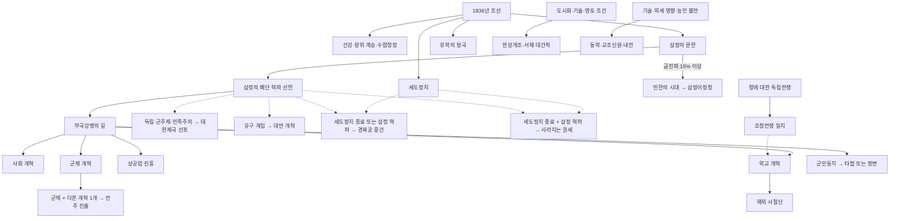

근거: [조선 국가 초기 설정](../common/history/countries/kor%20-%20korea.txt), [기본 일지](../common/journal_entries/eafp_korean_journal.txt), [개혁 일지](../common/journal_entries/eafp_korean_reformation.txt).

<a id="royal-health"></a>
## 2. 주상의 상태와 왕위 계승

상세 흐름도: [건강·왕실 활동](#flow-health), [왕위 계승](#flow-succession).

**일지:** `je_korean_kings_health` — 주상의 상태.

- **시작:** 조선 초기 일지. 헌종의 개인 사건과 역사적 왕위 계승을 제어한다.
- **핵심 수치:** 0~500의 건강 악화·스트레스 수치. **높을수록 나쁘다.** 기본 월간 증가량은 1.6이며, 성격·질병·제약 기술·인물 변화 요인이 증감시킨다.
- **위기:** 100·200·300·400·450에서 상태 설명이 달라지고, 500에 도달하면 주간 처리에서 수치를 0으로 되돌린 뒤 군주가 사망한다.
- **정상 완료:** `quinine` 연구. 특별한 불사 처리와 `no_heirs`를 해제하고 `.19` 「원자의 탄생」으로 연결된다.
- **계승:** 특별 건강 일지가 남아 있을 때 헌종 사망 → 철종, 철종 사망 → 고종 계승 이벤트. 세도정치 존속 여부에 따라 수렴청정을 다시 추가한다.

| 행동 | 조건·주요 효과 |
|---|---|
| 산책 | 10세 이상, 스트레스 -5 |
| 순시 | 성인·삼정 일지 활성, 국고 -50,000, 관청·군적·민생 각각 +15, 스트레스 +5 |
| 사냥 | 성인, 스트레스 -20. 삼정 일지 활성 시 국고 -50,000 및 세 현황 각각 -10. 사냥 사건 추가 가능 |
| 능행 | 성인·세도정치 활성, 국고 -50,000, 세도 권력 균형 -15, 스트레스 +5 |

네 행동은 12개월짜리 공통 재사용 대기 변수를 사용한다. 헌종의 장계·재용·정사·구제 등 월간 사건도 건강과 국정 사이의 선택을 만든다.

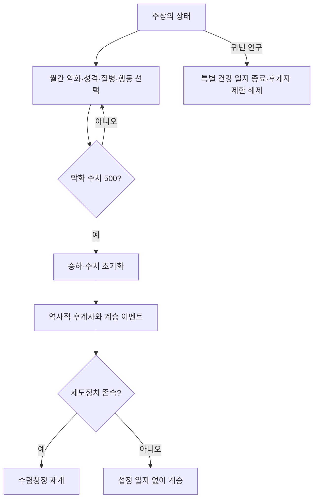

근거: [기본 일지](../common/journal_entries/eafp_korean_journal.txt), [진행도](../common/scripted_progress_bars/eafp_kor_progress_bars.txt), [행동 버튼](../common/scripted_buttons/eafp_korea_buttons.txt), [왕위 계승 on_action](../common/on_actions/korea_code_on_actions.txt).

<a id="regency"></a>
## 3. 수렴청정과 성학

상세 흐름도: [수렴청정](#flow-succession), [철종 성학의 개별 사건](#flow-education).

### 수렴청정

**일지:** `je_korean_regent`, 안내용 `je_korean_regent_inactive`.

- 초기 수렴청정 및 군주 교체에 대응하며, 전용 위젯과 섭정 인물 변수를 사용한다.
- **완료:** 군주가 성인이고 재위 연차 변수가 3 이상. 헌종·철종·고종별 「거둬진 수렴」 이벤트 `.105`~`.107`과 종료 알림을 제공한다.
- **무효화:** 군주제가 아니거나 제한선거·보통선거·무정부 법률을 채택하면 관련 트리거에 의해 종료한다.
- `je_korean_regent_inactive`는 다음 왕위 계승 때의 재개 조건을 보여주는 안내용 일지다. 자체 `possible`에 `always = no`가 있다.

### 성학: 철종 경연

**일지:** `je_king_cheoljong_education`.

- 철종의 「공부」 계열 사건에서 경연 일지를 추가한다. 강의 수준을 조절하는 네 버튼과 `.81`~`.98`의 단계별 사건이 있다.
- **완료:** 교육 진행도 200. `.99`에서 세도 권력 균형 -50, 철종에게 `erudite` 특성 및 토지개혁가 이념을 부여하고 꼭두각시 군주 변화 요인을 제거한다.
- **실패:** 현재 군주가 철종 템플릿이 아니게 되면 종료한다.

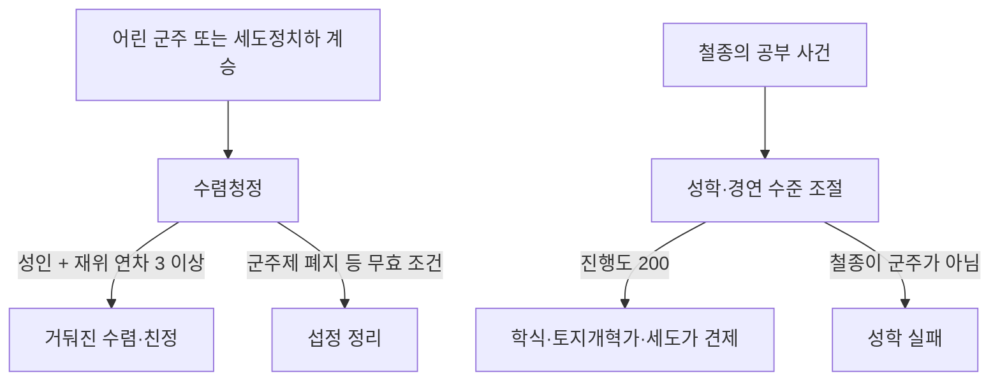

근거: [기본 일지](../common/journal_entries/eafp_korean_journal.txt), [메인라인 이벤트](../events/eafp_kor_events/eafp_kor_mainline.txt), [무효화 트리거](../common/scripted_triggers/eafp_kor_triggers.txt).

<a id="sedo"></a>
## 4. 세도정치와 사라지는 권세

상세 흐름도: [헌종·세도정치](#flow-sedo), [철종대 사건](#flow-cheoljong), [고종대 사건·사라지는 권세](#flow-gojong).

**일지:** `je_sedo_politics`, `je_korean_fading_power`.

세도가문의 지배력과 사적 재산을 관리하는 초반 정치 콘텐츠다. 권력 균형은 0~500이며, **0이 되면 세도정치가 종료**된다. 양반 지도자는 세도가문의 수장으로 이어지고, 주간 부패 사건과 월간 부패·권력 변화가 발생한다.

| 수단 | 기능 |
|---|---|
| 권위·행정력·자금으로 왕권 강화 | 해당 자원을 이용해 세도가를 견제. 조건이 유지되면 90일 간격으로 반복 처리 |
| 강화 취소 | 진행 중인 왕권 강화책 중지 |
| 세도가 인물 상호작용 | 환심 구매, 명예 높이기, 계파 사면, 관찰사직 제수, 정치적 거래, 자금 요청 |
| 역사 사건 | 헌종의 왕권 강화, 철종대 복권·예송·왕비 간택, 고종대 의정부·비변사 권력 조정 등 |
| 다른 콘텐츠의 보상 | 철종 성학 및 경복궁 중건 완료는 권력 균형을 각각 50 낮춤 |

군주제 폐지나 특정 선거법 등으로도 세도정치는 무효화된다. 군주제가 유지된 상태에서 **삼정 혁파와 세도정치 종료를 모두 충족**하면 「사라지는 권세」가 완료되어 양반에게 120개월간 감소하는 변화 요인을 주고 군주의 소속 이해집단을 기업가로 바꾼다.

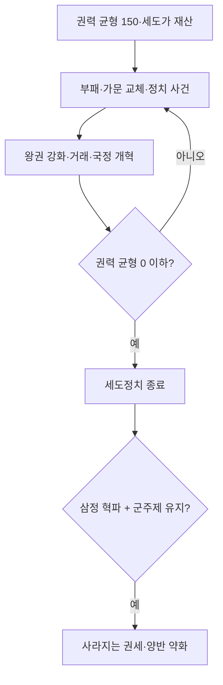

근거: [기본 일지](../common/journal_entries/eafp_korean_journal.txt), [세도가 상호작용](../common/character_interactions/eafp_kor_character_interactions.txt), [정치 효과](../common/scripted_effects/eafp_korea_effects.txt).

<a id="samjeong"></a>
## 5. 삼정의 문란과 양전

상세 흐름도: [삼정·양전·민란 전조](#flow-samjeong).

**일지:** `je_korean_land_problem`, `je_yangjeon`.

관청·군적·민생 세 현황을 개선해 전정·군정·환곡을 시정한다. 단계 기준은 400 / 800 / 1,200 / 1,600 / 2,000이며, 각각 고난 / 부실 / 미흡 / 안정 / 번영이다. 400 미만은 붕괴다. 정부·군사 건물과 임금, 기반시설, 농업, 1인당 GDP, 급진파 등이 현황에 영향을 준다.

| 개혁 | 현재 버튼의 실행 조건 | 결과 |
|---|---|---|
| 전정의 문란 시정 | 관청 ≥1,600, 민생 ≥1,200 | 전정 시정 변수 설정, 양전 일지 시작 |
| 군정의 문란 시정 | **관청 ≥1,600** | 군정 시정 변수 설정, 국방 페널티 제거 |
| 환곡의 문란 시정 | 관청 ≥1,200, 민생 ≥1,600 | 환곡 시정 변수 설정 |
| 양전 | 예산을 조절하며 진행도 360 달성 | 비용 제거, `.298` 선택으로 부실한 양안 페널티 제거 |
| 삼정의 폐단 혁파 선언 | 세 시정 변수 모두 존재 + 부실한 양안 페널티 없음 | `eafp_var_sam_all_clear` 설정 |

군정 버튼의 현지화는 **군적**을 요구한다고 쓰지만, 실제 조건은 **관청** 수치를 검사한다. 양전은 주간 진행량 1로 시작하고 버튼으로 1~5 범위에서 조절한다.

혁파 선언 후 `.299` 「중흥」의 보상을 받고 4대 개혁이 열린다. 경복궁 중건, 대한제국 선포, 전용 기업 등에서도 이 완료 변수를 활용한다.

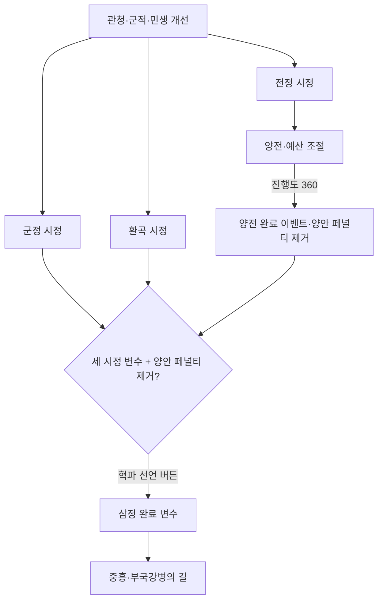

근거: [기본 일지](../common/journal_entries/eafp_korean_journal.txt), [시정·양전 버튼](../common/scripted_buttons/eafp_korea_buttons.txt), [현황 수치](../common/script_values/eafp_kor_values.txt), [한국어 설명](../localization/korean/eafp_kor_rework_l_korean.yml).

<a id="uprising"></a>
## 6. 민란의 시대와 삼정이정청

상세 흐름도: [발발·확산·수습](#flow-uprising), [삼정이정청·평가 결과](#flow-commission).

### 민란의 시대

**일지:** `je_korean_imsul_boom`.

- **시작:** 삼정 혁파 전 조선에서 국가 급진파 비율 15% 이상.
- 서울·양호·부산·평양·사리원 중 급진파 비율을 기준으로 발원지를 선정한다. 각 주 안의 봉기 규모와 다른 주로의 확산을 따로 처리한다.
- 확산 진행도 100에 도달하면 주 내부 확산 또는 다른 주 전파 사건이 발생한다. 삼남 지방, 첫 도간 확산, 육로 인접 여부 등에 가중치가 있다.
- 진정 진행도 50 이상에서 폐정개혁 문서화·관대한 처벌 약속·치안병력 재배치·읍소문·구휼미·호족 협조 버튼을 사용할 수 있다. 각 행동은 진정 +10, 공통 대기 1개월이다.
- 유통망 차단과 상행위 재허가도 가능하다. 차단은 민생 수치 -50과 6개월간 주 변화 요인을 준다.
- **수습:** 진정 100 이상에서 「안핵사 파견」 → `.221` 「수습」. 봉기 종료 변수를 설정하고 박규수 관련 선택 및 후속 개혁 사건으로 이어진다.

### 삼정이정청

**일지:** `je_samjeong_ijeongcheong`.

수습 `.221` → 부패 척결 `.222` → 감찰 확대 `.223` → 소란의 원인 `.224` → 삼정이정청 `.225`로 이어진다. 시작 당시 군주와 GDP를 저장하며, 기본 시간은 **260주**다. 조건을 충족하면 왕의 스트레스 +35를 대가로 26주를 추가할 수 있다.

평가 항목은 총 9개다.

| 번호 | 목표 |
|---|---|
| 1~3 | 관청·군적·민생 각각 1,600 이상 |
| 4 | 행정력 100 이상 |
| 5 | 급진파 비율 10% 이하 |
| 6 | 시작 GDP의 125% 이상 |
| 7 | 세도정치 종료 또는 권력 균형 50 이하 |
| 8 | 평균 생활수준 9 이상 |
| 9 | 금 보유고가 한도의 10% 이상이고 고정 순수입이 0 이상 |

삼정 완료 변수가 이미 있으면 각 평가 항목은 충족으로 계산한다.

| 종료 상황 | 이벤트·결과 |
|---|---|
| 9개 달성 | `.229` 삼정의 대개혁, 하층민 충성파 +5% |
| 시간 소진·7~8개 달성 | `.228` 삼정을 바로잡다, 하층민 충성파 +3% |
| 시간 소진·5~6개 달성 | `.227` 미완의 이정, 하층민 충성파 +1% |
| 시간 소진·0~4개 달성 | `.226` 유명무실한 이정, 하층민 급진파 +2% |
| 시작 당시 군주 사망 | `.230` 후원자의 죽음, 하층민 급진파 +1% |

**구현상 주의:** 일지의 결과 미리보기에는 삼정 완료 변수 설정이 있지만, 실제 `on_complete`와 `.229` 선택지에는 없다. 따라서 삼정이정청 성공만으로 「부국강병의 길」이 열린다고 설명할 수 없다. 현재 확인되는 실행 경로는 앞 절의 혁파 선언 버튼이다.

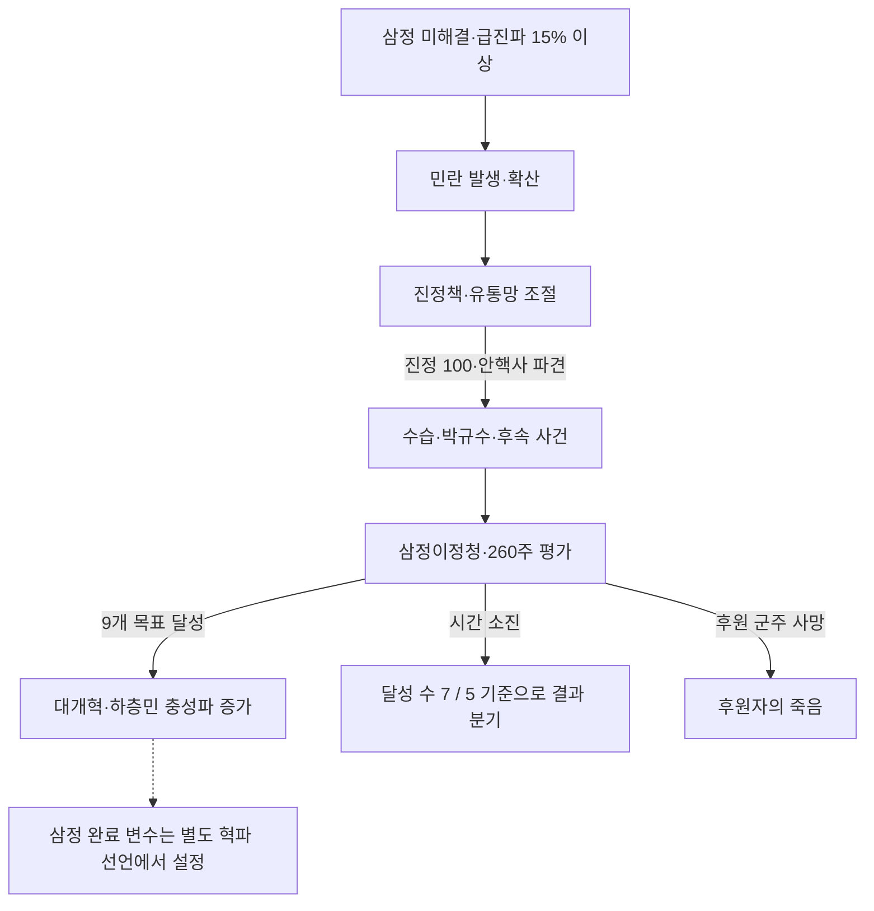

근거: [기본 일지](../common/journal_entries/eafp_korean_journal.txt), [평가 함수](../common/script_values/eafp_kor_values.txt), [메인라인 이벤트](../events/eafp_kor_events/eafp_kor_mainline.txt), [진행도](../common/scripted_progress_bars/eafp_kor_progress_bars.txt).

<a id="confucianism"></a>
## 7. 유학의 왕국과 서학

상세 흐름도: [서학·박해의 개별 사건](#flow-confucianism).

**일지:** `je_korean_confu`.

- **시작:** 초기 조선. 유교 질서, 천주교 전파, 선교사 등장, 박해와 대외 인식을 함께 다룬다.
- **진행도:** 세계 인식도 0~1,000. 기본 월 +2.5, 무역 기여분 최대 +20. 고립주의·전통주의·국교 법률은 각각 -5이며 AI 보정 +7.5가 별도로 있다. 기술 획득 on_action은 관련 효과를 통해 인식도 +20을 요청한다.
- **선택:** 「집중 교화」와 선교사·박해 관련 사건. 대규모 교화의 재사용 대기는 4년이다.
- **완료:** 인식도 1,000 → `.171` 「새로운 물결」. 지식인의 명칭·이념·특성을 재편하고 천주교 관련 페널티와 선교사 인물을 정리한다.
- **무효화:** 국가 종교가 유교가 아니게 되면 정리 절차로 종료한다.

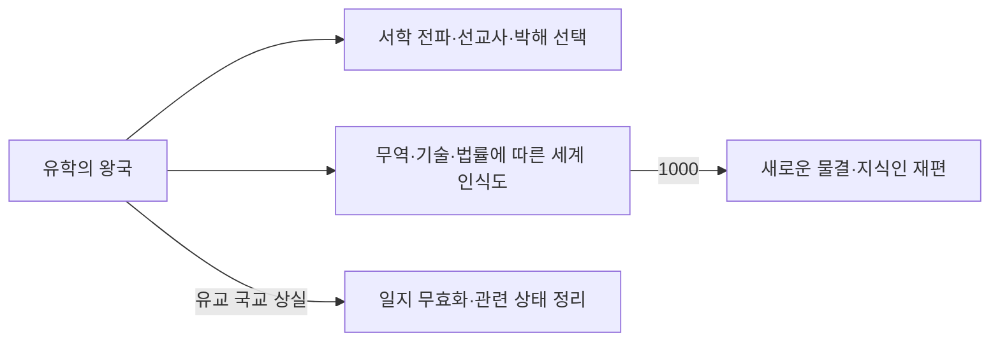

근거: [기본 일지](../common/journal_entries/eafp_korean_journal.txt), [진행도](../common/scripted_progress_bars/eafp_kor_progress_bars.txt), [조선 효과](../common/scripted_effects/eafp_korea_effects.txt), [기술 획득 처리](../common/on_actions/korea_code_on_actions.txt).

<a id="palace"></a>
## 8. 경복궁 중건

상세 흐름도: [중건·원납전의 개별 사건](#flow-palace).

**일지:** `je_rlg_seoul_gyeongbokgung_poor` → `je_rlg_seoul_gyeongbokgung_rebuild`.

「방치된 법궁」은 훼손된 경복궁 건물이 있는 조선에서 표시된다. **삼정 혁파 또는 세도정치 종료** 중 하나를 달성하면 중건 일지를 추가하고 궁궐 기술 `eafp_tech_palace`를 부여한다.

- 중건 시작 시 진행도 0, 원납전 사용 가능 변수와 `.1500` 사건을 설정한다.
- 건물의 공사 생산방식에 따라 주간 +5 / +7.5 / +10 / +12.5. AI는 별도로 +5를 받는다.
- 원납전과 기부자 치하·자발적 기부 사건이 공사 자금 문제를 다룬다.
- **완료:** 진행도 목표 1,000, 서울 전역 소유, 훼손된 궁궐 건물 존재. `.1510`에서 건물을 완성된 경복궁으로 교체하고 세도 권력 균형 -50.


근거: [기본 일지](../common/journal_entries/eafp_korean_journal.txt), [궁궐 사건](../events/eafp_kor_events/eafp_kor_mainline.txt).

<a id="reformation"></a>
## 9. 부국강병의 길: 4대 개혁

상세 흐름도: [상위 일지·사회](#flow-reformation), [군제](#flow-military), [경제](#flow-economy), [외교](#flow-diplomacy), [기술·제도 도입](#flow-technology).

**상위 일지:** `je_korean_reformation`.

**시작 조건은 삼정 완료 변수**다. 사회·군제·경제·외교 일지를 동시에 추가하고, 6~12개월 후 군민동치 도입 사건을 예약한다. 각 개혁은 진행값 +1과 고유 완료 변수를 남긴다. 네 개를 모두 완료하면 `korean_reformation_complete_var`가 설정된다.

### 9.1 사회 개혁

**일지:** `je_korean_reformation_society`.

- 세습 관료제·농노제·전통주의·국경 폐쇄·고립주의·토지 기반 조세·소비 기반 조세·경찰 없음·학교 없음 상태를 모두 벗어나야 한다.
- 행정력 >0, 진행도 0.1을 초과하는 혁명 내전이 없어야 한다.
- 경무청, 소학교령, 국문/한문, 노비, 단발령, 태양력, 광혜원 사건으로 제도 변화를 표현한다. 도입 후 순보서 사건도 예약된다.
- 완료 사건은 `.199` 「교육으로, 실행으로」다.
- 「문관전고소」 `.103`은 이 일지의 월간 목록에서 빠져 있으며, 별도 **사대부 관료제 일지** 완료로 호출된다.

### 9.2 군제 개혁

**일지:** `je_korean_reformation_military`.

| 분야 | 완료 조건 |
|---|---|
| 군제 | 전문직업군 법률 |
| 무기 공장 | 무기 공장 존재. 해당 건물의 75% 이상이 5단계 이상, 소총·연발총·볼트액션 소총 중 하나를 사용 |
| 경영 | 위 조건의 공장이 주간 흑자, 현금 보유율 ≥25%, 고용률 ≥75% |
| 조직 | `pm_no_organization` 생산방식을 쓰는 건물이 없음 |
| 육군 | 비정규 보병을 포함한 육군 편제 비율이 25% 미만. **병력 수 비율이 아닌 편제 검사** |
| 해군 | 조선소 존재, 전열함이 아닌 주력함 보유 |
| 통신 | 전신 `electric_telegraph` 연구 |

원수부·군기창·첫 군함·신식 부대·조선소·구식 군대·무관학교 사건을 거쳐 `.299` 「일신」으로 끝난다.

### 9.3 상공업 진흥

**일지:** `je_korean_reformation_economy`.

- 편입주의 **70% 초과**에 철도와 5단계 이상 도심지가 모두 있어야 하며, 5단계 이상 철도 건물도 하나 이상 필요하다.
- 전체 주의 50% 이상에 5단계 도심지, 10% 이상에 10단계 도심지가 필요하다.
- 섬유 공장·가구 공장·공구 공장과 대상 광산군에서 각각 5단계 이상 건물이 하나 이상 필요하다.
- 각 산업군 건물의 75% 이상이 지정된 근대 생산방식, 주간 흑자, 현금 ≥25%, 고용 ≥75%, 보조금 없음 조건을 충족해야 한다. 광산군은 석탄·철·납·유황을 묶어 검사한다.
- 해당 생산방식은 재봉틀 계열, 선반/기계화 작업장, 강철/고무 손잡이 공구, 복수식 증기기관/디젤 펌프 계열이다.
- 중앙은행 연구가 필요하다. 완료 사건은 `.399` 「흥성하는 도시」.

전차·철도·탄광·직조·제철·제지·공구·유리 공장의 도입 사건이 월간 조건에 따라 발생한다.

### 9.4 외교 개혁

**일지:** `je_korean_reformation_diplomacy`.

- 고립주의·전통주의·국경 폐쇄를 벗어난다.
- **비종속국 + 승인국 + 해외 사절단 완료 변수**를 모두 요구한다.
- 삼전도비 철거 사건 `.401`과 사절단 파견 버튼이 있다.
- 완료 사건은 `.499` 「열강과 어깨를 나란히」. 제목과 달리 **열강 등급 자체는 완료 조건이 아니다.**

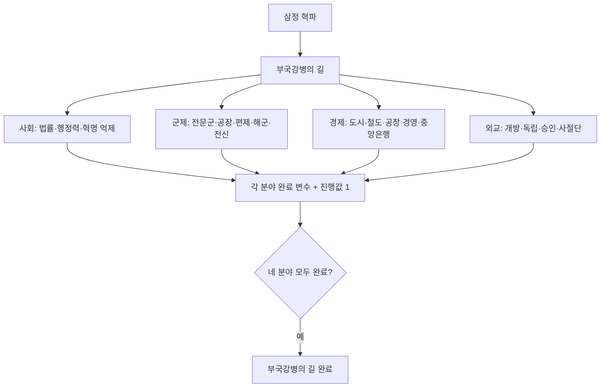

근거: [개혁 일지와 정확한 생산방식 목록](../common/journal_entries/eafp_korean_reformation.txt), [개혁 이벤트](../events/eafp_kor_events/eafp_korean_reformation_events.txt), [사대부 관료제](../common/journal_entries/eafp_scholar_bureaucrats_journal.txt).

<a id="foreign-mission"></a>
## 10. 해외 사절단

상세 흐름도: [대표 선임부터 견학·귀국·보고서까지](#flow-mission).

**일지:** `je_korean_foreign_mission`.

- **파견:** 외교 개혁 일지 활성, 사절단 미완료, 고립주의 아님, 항구 존재, 다른 사절단 없음. 정부 참여 이해집단 소속의 한가한 인물 중 군주·후계자·선동가를 제외한 후보가 필요하다.
- **대표:** 명망 순 최대 네 후보에서 선택하며, 파견 중에는 바쁨·불사 상태로 처리한다.
- **여정:** 비밀/공개 출발 → 세계 순방 → 궁정 의례·전기·도시·복식·군기창·우편 등 견학 → 연장 순방 → 귀국.
- 방문국은 고정 국가 순서가 아니다. 비전쟁국 중 강대국 또는 관련 기술을 가진 국가를 우선 무작위 선정하고, 없으면 다른 비전쟁국을 고른다.
- **소환:** 해외 체류 중 조기 소환 가능. 귀국 사건을 30일 뒤 예약한다. 소환 뒤에도 보고서를 제출해 완료할 수 있다.
- **완료:** 귀국 사건 `.5` 선택 후 보고서 `.6`. 보고서를 선택해야 `completed_je_korean_foreign_mission`이 설정되고 대표 상태가 복구된다.

| 보고서 | 주요 결과 |
|---|---|
| 제도 | 제도 보고서 변화 요인, 세습 관료제라면 임명 관료제로 변경, 대표 소속 이해집단 우호 효과 |
| 기술 | 기술 보고서 변화 요인, 연장 순방을 했다면 군사 참관 보너스 추가 |
| 외교 | 외교 보고서 변화 요인, 강대국 이상 국가와 관계 +10 |

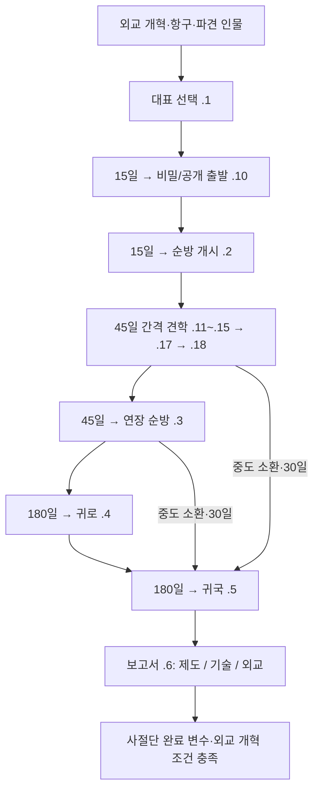

근거: [사절단 일지](../common/journal_entries/eafp_korean_foreign_mission.txt), [파견·소환 버튼](../common/scripted_buttons/eafp_korean_foreign_mission_buttons.txt), [여정 이벤트](../events/eafp_kor_events/eafp_korean_foreign_mission_events.txt), [방문국 선정·정리](../common/scripted_effects/eafp_korean_foreign_mission_effects.txt).

<a id="politics"></a>
## 11. 군민동치와 양파 정변

상세 흐름도: [군민동치·정변·정착·숙청](#flow-politics).

**일지:** `je_gunmin_dongchi` 및 개화파·척사파 정변 후속 일지 2개.

부국강병 시작 6~12개월 후 `gunmin_dongchi_events.1`이 일지를 추가한다. 군주제를 전제로 개화파·척사파의 **정변 위험**을 각각 관리한다. 도입 선택은 한쪽 위험에 +25를 주며, 위로 버튼과 월간 사건으로 양파의 압력을 조절한다.

| 본 일지의 분기 | 후속 결과 |
|---|---|
| 개화파 위험 100 | `.2` → 「갑작스러운 개벽」 |
| 척사파 위험 100 | `.3` → 「성리학적 회귀」 |
| 7,300일 경과·투표권 있음 | `.4`, 타협의 시대 보상과 충성파 증가 |
| 7,300일 경과·투표권 없음 | `.5`, 군주 주도 근대화 보상과 충성파 증가 |
| 군주제 상실 | 일지 무효화·관련 상태 정리 |

### 개화파 정변: 갑작스러운 개벽

`je_gunmin_dongchi_enlightenment_coup`는 기존 법률을 저장하고 개화파 법률 변경 효과를 적용한다. 종속국이면 독립 열망 +50이며, 보수 운동의 반발을 관리한다.

- **완료:** 전문 경찰·전문직업군·투표권, 반대파 불법화/검열/여성 권리 없음/국교/길드 체제에서 이탈, 지식인 또는 기업가의 정부 참여.
- **실패:** 농노제·전통주의·고립주의·토지 기반 조세 중 하나가 있거나 반쿠데타 압력 100.
- **기한:** 3,650일. 실패·시간 초과 시 저장된 법률로 복구하는 처리와 개화파 숙청 보상 사건 `.102`.

### 척사파 정변: 성리학적 회귀

`je_gunmin_dongchi_antiwestern_coup` 역시 기존 법률을 저장한 뒤 척사파 법률 효과를 적용하고 자유주의·사회주의 운동의 반발을 관리한다.

- **완료:** 여성 권리 없음, 양반 또는 유학자 이해집단의 정부 참여.
- **실패:** 전제정치·국교·고립주의·검열 중 하나라도 유지하지 못하거나 반쿠데타 압력 100.
- **기한:** 3,650일. 실패·시간 초과 시 법률 복구와 척사파 숙청 사건 `.202`.

두 경로 모두 법률 복구 시 사대부 관료제를 복구할 수 없는 조건이면 임명 관료제로 대체하는 예외가 있다. **현지화의 “총 5년 동안 조건 충족”과 달리, 현재 두 `complete` 블록은 유지 기간이나 성공 진행도 값을 검사하지 않는다.**

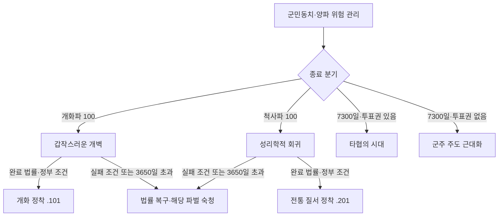

근거: [정변 일지](../common/journal_entries/eafp_korean_reformation.txt), [정변 사건](../events/eafp_kor_events/eafp_korean_reformation_events.txt), [법률 변경·정리 효과](../common/scripted_effects/eafp_korean_reformation_effects.txt).

<a id="seoul"></a>
## 12. 한성개조사업

상세 흐름도: [한성개조·서해 간척](#flow-seoul).

**일지:** `je_seoul_improvement_project`.

- **시작:** 서울에 조선 수도가 있고 오염 >75.
- 사업 예산 증액/축소로 진행 속도와 비용을 조절한다. 초기 주간 진행값은 0이므로 예산 조절이 필요하다.
- **완료:** 사업 진행도 ≥200, 현대 하수도 연구, 수도에 도심지와 철도 존재. 수도 건물에 `pm_market_stalls`, `pm_market_squares`, `pm_no_street_lighting`, `pm_no_public_transport`가 남아 있지 않아야 한다.
- 완료 시 `seoul_improvement_project_events.1`을 호출하고 비용을 제거한다. 서울 지역의 주를 모두 잃으면 실패하며 비용을 정리한다.

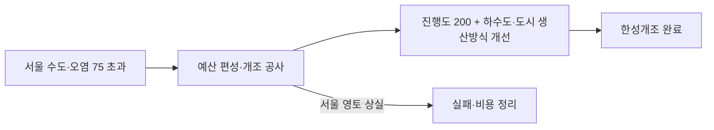

근거: [개혁·도시 사업 일지](../common/journal_entries/eafp_korean_reformation.txt), [사업 버튼](../common/scripted_buttons/eafp_korean_reformation_buttons.txt).

<a id="reclamation"></a>
## 13. 서해 대간척 사업

상세 흐름도: [한성개조·서해 간척](#flow-seoul).

**일지:** `je_korean_reclamation`.

- **시작:** 서울·평양·양호 전역 소유, 철골 건물·콘크리트 요새·다이너마이트 연구.
- 세 지역에 `building_korean_reclamation` 건물을 각각 건설한다.
- **완료:** 세 건물 존재 시 간척 건물을 제거하고 경작지를 서울 +5, 평양 +12, 양호 +18, 총 **35** 늘린다.
- **실패:** 세 지역 중 하나라도 전역 소유 조건을 잃으면 간척 건물을 정리한다.

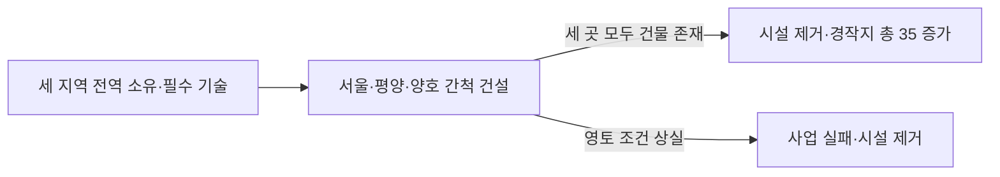

근거: [간척 일지](../common/journal_entries/eafp_korean_reformation.txt), [간척 건물](../common/buildings/eafp_korean_reclamation.txt), [생산방식](../common/production_methods/eafp_korean_reclamation.txt).

<a id="joseon-qing-war"></a>
## 14. 조청전쟁

상세 흐름도: [전쟁 시작·승전·패전](#flow-war).

**일지:** `je_eafp_joseon_qing_war`.

조선과 청이 각각 전쟁 지도자이고, 조선이 청에 대한 **독립 전쟁 목표**를 가진 전쟁을 추적한다. 모든 청과의 전쟁에 적용되는 것은 아니다. 시작 시 해당 전쟁을 저장하고 주마다 조선 전쟁 지지도를 기록한다.

| 전쟁 종료 결과 | 보상·페널티 |
|---|---|
| 독립, 지지도 ≥50 | 대승: 위신 +15%, 권위 +20%, 충성파 및 정치운동 안정 보상 |
| 독립, 지지도 0 이상 50 미만 | 값비싼 승리: 위신 +10%, 권위 +10%, 충성파 보상 |
| 독립, 지지도 <0 | 피로스의 승리: 위신 +5%, 정치운동발 급진파 증가 |
| 전쟁 종료 후에도 청의 종속국 | 패전: 위신 -10%, 권위 -10%, 급진파 증가 등 |

청이 소멸해도 전쟁 종료 후 독립 측 완료 조건에 포함된다. 지지도 변수가 없는 경우 중간 보상으로 처리한다. 판정에는 **마지막으로 주간 저장된 전쟁 지지도**를 사용한다.

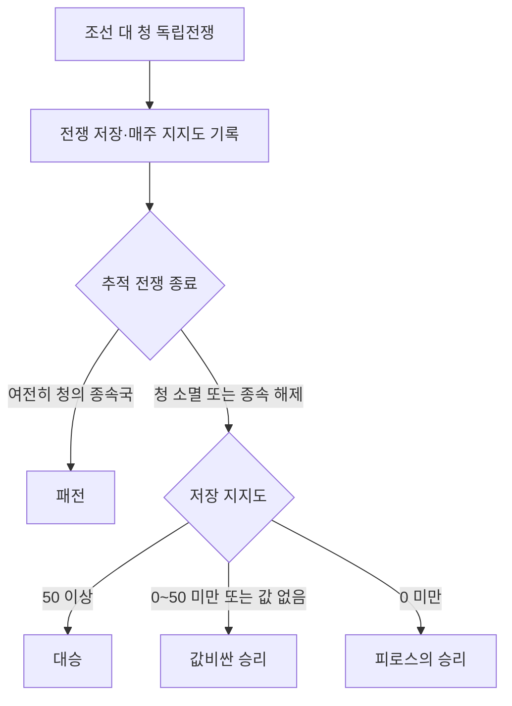

근거: [조청전쟁 일지](../common/journal_entries/eafp_joseon_qing_war.txt), [전쟁·등급 트리거](../common/scripted_triggers/eafp_kor_triggers.txt), [보상 효과](../common/scripted_effects/eafp_joseon_qing_war_effects.txt), [변화 요인](../common/static_modifiers/eafp_joseon_qing_war_modifiers.txt).

<a id="manchuria"></a>
## 15. 만주 진출과 경영

상세 흐름도: [만주 정책·경영·간도](#flow-manchuria).

**일지:** `je_eafp_manchurian_policy` → `je_eafp_manchurian_management`.

### 만주 정책

- 삼정 완료 후 표시되고, **군제 개혁 + 사회·경제·외교 중 하나의 개혁 완료**가 활성 조건이다.
- 시작 사건 `eafp_manchuria.1`은 성경·남만주·북만주에 명분을 부여한다.
- 동북 지역 판정 대상 주를 모두 소유하면 `.2`를 거쳐 만주 경영으로 이어진다.

### 만주 경영

| 수단·목표 | 내용 |
|---|---|
| 정착 지원 | 730일 대기. 현재 조건은 동북 대상 주 **모두** 소유·한국 문화 공동체 없음, 한반도에 한국인 소작농 존재. 대상 주에 공동체와 정착 변화 요인을 만들고 인구 이동 처리 |
| 경작지 확대 | 1,095일 대기, 최대 5회. 동북 대상 지역마다 경작지 +10 |
| 완료 | 대상 주 모두 소유, 각 주 도시화 ≥1,000, 한국 문화 비중 ≥10%, 조세 역량 ≥조세 사용량 |
| 결과 | `.3`에서 각 주 편입, 통합 변화 요인, 주 충성파 +10% |

정착 버튼은 “어느 한 주에 공동체가 없음”보다 강한 `count = all` 조건이므로 반복 가능 범위를 해석할 때 주의한다.


근거: [만주 일지](../common/journal_entries/eafp_kor_manchuria_management.txt), [만주 버튼](../common/scripted_buttons/eafp_kor_manchuria_buttons.txt), [만주 사건](../events/eafp_kor_events/eafp_kor_manchuria_events.txt).

<a id="ryukyu-taiwan"></a>
## 16. 유구 개입과 대만 개척

상세 흐름도: [개입·답사·대만 양도 요구](#flow-ryukyu).

### 조선의 유구 개입

**일지:** `je_eafp_ryukyu_intervention`.

삼정 혁파 뒤 일본·청·유구가 존재하고 이전에 거절·종료하지 않았다면 표시되는 조선 개입 일지다. 시작 7일 후 개입/불개입을 선택한다.

- **사절 파견:** 고립주의 아님, 365일 대기, 개입 진행도 +10. 신용 기준 비용과 일본 -10·청 -5 관계 변화.
- **항구 무장 지원:** 해군 전력 투사 ≥50, 730일 대기, 진행도 +20. 더 큰 비용과 일본 -15·청 -10 관계 변화.
- **완료:** 개입 선택 + 진행도 ≥100 + 유구가 비종속국.
- 완료 시 조공국으로 삼을 수 있으면 유구를 조선의 조공국으로 만들고 대만 개척 일지를 추가한다. **진행도 100 자체가 유구를 독립시키지는 않는다.**
- 불개입 또는 일본·청·유구 소멸은 일지를 무효화한다.

### 대만 개척

**일지:** `je_eafp_taiwan_pioneer`, 결정 `eafp_taiwan_survey_decision`.

- 유구가 조선의 종속국인 상태에서 진행한다. 기본 월 +3, 유구와 우호 관계 +1, 해군 전력 투사 ≥100이면 +1을 추가하고 100에서 제한한다.
- **답사 결정:** 진행도 100 미만, 평시, 다른 탐험·답사 없음, 남중국 관심, 행정력 >-100. 1,095일 재사용 대기. 적극 답사는 +20, 신중 답사는 +12이며 비용·외교 효과가 다르다.
- **양도 요구:** 진행도 100에서 대만 보유국에 요구 사건을 보내도록 구성되어 있다.
- 수락 사건은 보유 대만 주를 조선에 넘기고 한국 문화 공동체·완료 변수를 설정한다. 거절 사건은 조선에 대만 명분을 주고 역시 해결 변수를 설정한다.
- **완료:** 해결 변수 또는 대만 전역 소유. 따라서 거절도 일지의 완료 결과다. 해결 전에 유구 종속 관계를 잃으면 실패한다.

**구현상 주의:** 양도 요구 버튼은 조선 국가 범위의 `every_scope_state` 안에서 “소유자가 조선이 아닌 주”를 찾는다. 외국 소유 주로 요구 이벤트가 전달되는지는 게임 내 확인이 필요하다. 아래 요구 이후 분기는 이벤트가 실제 호출되었을 때의 처리다.

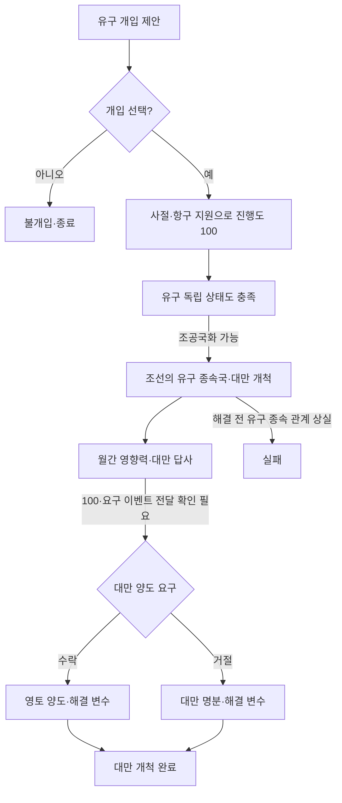

근거: [유구 일지](../common/journal_entries/eafp_01_ryukyu_rivalry.txt), [유구 버튼](../common/scripted_buttons/eafp_ryukyu_buttons.txt), [대만 일지](../common/journal_entries/eafp_taiwan_journal.txt), [답사 결정](../common/decisions/eafp_taiwan_decisions.txt), [양도 요구 버튼](../common/scripted_buttons/eafp_taiwan_buttons.txt), [연결 사건](../events/eafp_ryukyu_events.txt).

<a id="donghak"></a>
## 17. 동학·교조신원·조선 내전

상세 흐름도: [동학·교조신원·내전·청일 개입](#flow-donghak).

**일지:** `je_donghak_movement`, `je_gyojo_shinwon`, `je_korean_rebellion`의 교체 정의. `ep1_content` DLC 조건을 사용하는 콘텐츠다.

### 동학 창시자와 운동

- 최제우 등장 사건 `.3`은 1855-01-01 이후, 1880-01-01 이전, 한국 주류 문화, 평등주의 연구, 급진파 10% 이상인 주 존재 등을 요구한다. `.101`에서 처형/석방을 선택한다.
- 동학 운동 일지는 한국 문화·평등주의·DLC 조건으로 표시되며, 인권 연구, 비고립주의, 유럽 소재 세력권 지도자의 대조선 영향력 우위, 국가 급진파 ≥10%, 급진파 ≥20%인 주가 있어야 활성화된다.
- **완료:** 국가 급진파 ≤5% 또는 교조신원 완료 변수.
- **실패:** 전원 주민에게 영향을 주는 정치운동이 반란 상태가 되면 `.2`에서 혁명 진행도 +0.50과 운동 변화 요인을 적용한다.

### 교조신원

동학 운동 중 청원 사건 `.4`는 국가 급진파 ≥20%, 전원 주민이 비주변화·비정부 상태일 때 후보가 된다. 거절하면 반발하고, 수락하면 교조신원 일지를 추가한다.

- **기한:** 3,650일.
- **완료:** 고립주의, 국교 법률에서 이탈, 양반이 강력하지 않으며 정부에 없음.
- `.5`에서 두 보상 중 하나를 선택하고 `donghak_petition_complete`를 설정한다.
- 시간 초과는 `.6` 배신·급진화 결과. 전원 주민 영향 운동의 반란도 실패 조건이지만, 해당 일지 자체에는 별도의 `on_fail` 보상 블록이 없다.

### 내전과 청·일 개입

`je_korean_rebellion`은 조선과 반란국을 추적하는 국제 일지다. 청·일의 개입 사건에서는 정부 지지/반란군 지지/불개입을 조건에 따라 선택한다. 혁명이 끝난 뒤 원래 군주가 남았는지로 정부 승리와 반란군 승리를 구분하며, 개입국의 선택에 따라 성공·실패 보상을 준다.

정부 승리 후 일본이 일지에 관여했고 조선이 여전히 저장된 청의 종속국이라면, 7일 뒤 일본의 대청 요구 사건 `.8`로 이어질 수 있다. 청의 수락 `.9.a`는 기존 종속 협정을 해제하고, 거절 `.9.b`는 관계 악화·일본의 정복 목표·`sino_japanese_war` 변수를 설정한다. 이 선택지 자체가 즉시 전쟁을 생성하는 것은 아니다.

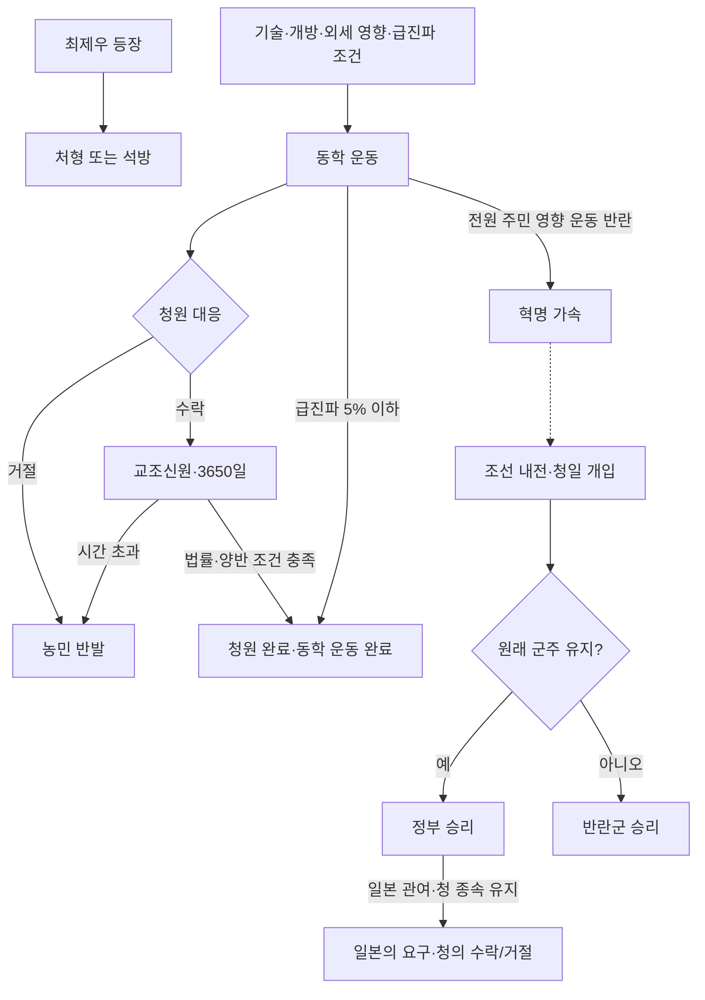

근거: [동학·내전 일지](../common/journal_entries/eafp_03_korea.txt), [SOI 조선 이벤트](../events/soi_events/00_ep1_korea_events.txt).

<a id="decisions-companies"></a>
## 18. 대한제국 선포·왕실 장식·전용 기업

상세 흐름도: [대한제국 결정의 기본 게임 이벤트 호출](#flow-diplomacy). 일월오봉도와 기업 정의에는 별도의 이벤트·일지 호출이 없다.

### 결정

| 콘텐츠 | 조건 | 결과 |
|---|---|---|
| 대한제국 선포 `KOR_declare_korean_empire` | 조선, 민족주의, 독립국, 군주제, 삼정 혁파, 미실행 | 기본 게임 `korea.1` 호출, 실행 변수 설정. 실제 국호·후속 효과는 기본 게임 이벤트에 의존 |
| 일월오봉도 추가 `eafp_rlg_qudvnd` | 조선, 군주제, 미실행 | 국고 -10,000, 왕실 장식 변수 설정 |

### 전용 기업

다음 7개 정의는 한국 주류 문화·동북아 관심과 **삼정 혁파**를 공통으로 요구한다. 아래 건물 조건은 별도의 설립 조건이며, 번영 효과는 설립 즉시 보상이 아니라 기업이 번영할 때의 효과다.

| 기업 | 핵심 건물 조건 | 주요 번영 효과 |
|---|---|---|
| 내수사 | 한국 본토 편입주에 5단계 담배 농장 | 위신 +15%, 플랜테이션 처리율 +10% |
| 철도국 | 한국 본토 편입주에 5단계 철도 | 기반시설 +10%, 시장 접근 가격 영향 +0.05 |
| 훈련도감 | 서울 편입주에 5단계 대포 주조소 | 육군 공격 +15%, 살상률 +0.1 |
| 신민회 | 서울 편입주에 5단계 **섬유 공장** | 자원 발견 확률 +200%, 지식인 지지 +5, 석유 시추 처리율 +10% |
| 송림제철 | 평양 편입주에 5단계 철 광산 | 철도 처리율 +10% |
| 경성방직 | 서울 편입주에 5단계 섬유 공장 | 목화·고무 농장 처리율 각각 +10% |
| 광무국 | 평양 편입주에 5단계 석탄 광산 | 광업 처리율 +5% |

내수사의 고려 인삼, 신민회의 조선 백자 등 위신 상품 연결도 있다. 신민회의 사업 건물은 유리·제지지만 설립 조건은 현재 섬유 공장을 검사한다.

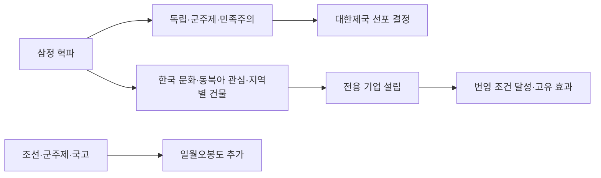

근거: [대한제국 결정](../common/decisions/eafp_00_korea_decisions.txt), [장식 결정](../common/decisions/eafp_korean_decisions.txt), [기업 정의](../common/company_types/eafp_companies_korea.txt).

<a id="shared-content"></a>
## 19. 연결되는 동아시아 공통 콘텐츠

상세 흐름도: [사대부 관료제·문관전고소](#flow-reformation), [팽창주의의 개별 사건](#flow-expansionism).

### 사대부 관료제의 해체

`je_scholar_bureaucrats`는 사대부 관료제를 가진 국가의 공통 일지다. 국교·소작농 부역군·농노제에서 모두 벗어나면 완료한다. 조선에서는 `eafp_korean_reformation_events.103` 「문관전고소」를 호출하며 사회 개혁과 연결된다.

### 동아시아 팽창주의

`je_eastasian_expansionism`은 동아시아 문화권 공통 콘텐츠로 조선도 조건을 만족하면 참여한다.

- **시작:** 승인국·독립국·공격적 외교전 허용 상태이며, 같은 자격을 가진 다른 동아시아 문화권 국가가 없어야 한다.
- 파시스트·주류 문화·주류 종교 정치운동을 만들고 대중 편집증과 극단주의 압력을 관리한다.
- **완료:** 수도 밖 다른 전략 지역에도 영토가 있고, 자국 보유 주가 속한 전략 지역의 전 주를 직접 소유하며, 인접 주가 속한 전략 지역의 전 주를 자국 또는 종속국이 소유해야 한다.
- **실패:** 편집증 100, 종속국화, 공격적 외교전 금지, 미승인국 상태 중 하나.

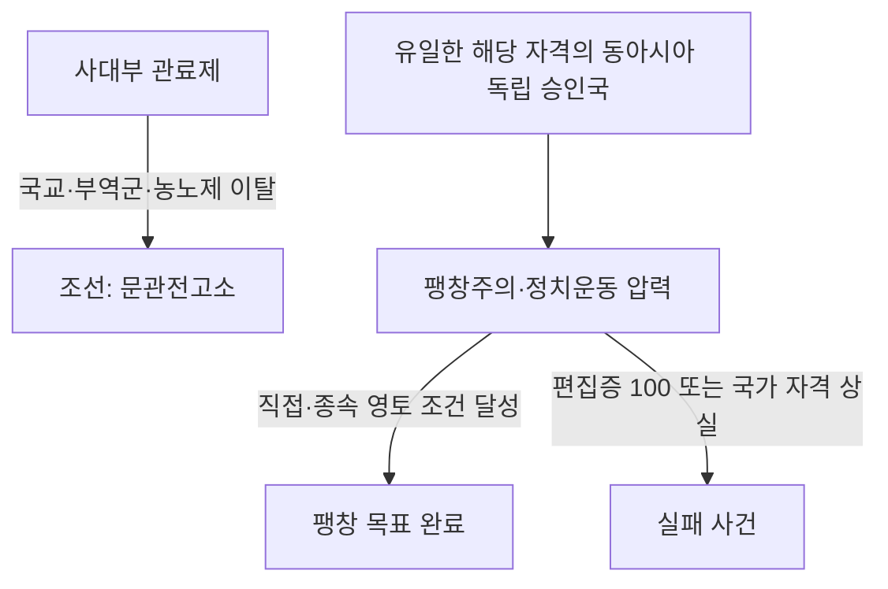

근거: [사대부 관료제 일지](../common/journal_entries/eafp_scholar_bureaucrats_journal.txt), [동아시아 팽창주의](../common/journal_entries/eafp_eastasian_expansionism.txt), [팽창주의 사건](../events/eafp_eastasian_expansionism_events.txt).

<a id="implementation-notes"></a>
## 20. 미완성·비활성 콘텐츠와 구현상 주의점

상세 흐름도: [비활성·주석 처리·차단된 정의](#flow-disabled), [간도 일지](#flow-manchuria).

이 절은 문서의 설명 범위를 명확히 하기 위한 구분이다. 아래 사항을 문서화하면서 게임 스크립트는 수정하지 않았다.

### 미완성 또는 현재 진행 경로에서 제외한 항목

| 항목 | 현재 상태 |
|---|---|
| 간도 구상 `je_gando_ambition` | `.txt`에 정의되어 있지만 `complete`와 `on_complete`가 비어 있음. 완성된 간도 획득 경로로 볼 수 없음 |
| 조선 쟁탈전 `je_scramble_for_korea` | 일지와 이벤트가 `.disable`. 현지화·수치·기획은 남아 있지만 활성 흐름에 포함하지 않음 |
| 동아시아 헌법 | 이벤트 파일이 `.disable`. 군민동치의 투표권 분기와 별개로 취급 |
| 서원의 폐단 `je_korean_seowon` | 한국어 현지화는 있으나 활성 일지 정의는 검색에서 확인되지 않음 |
| 구판 조선 유신·한일동조론 등 | 오래된 현지화 키만으로 활성 콘텐츠라고 판정하지 않음 |

간도 일지의 준비 조건은 조선의 서울·평양·사리원 전역 소유, 독립, 범민족주의, 삼정 혁파, 청 또는 그 종속국의 남만주 전역 소유, 중국 분열 변수 없음이다. 조건 상실 실패와 7,300일 기한은 있으나 영토 획득·협상·완료 보상은 비어 있다.

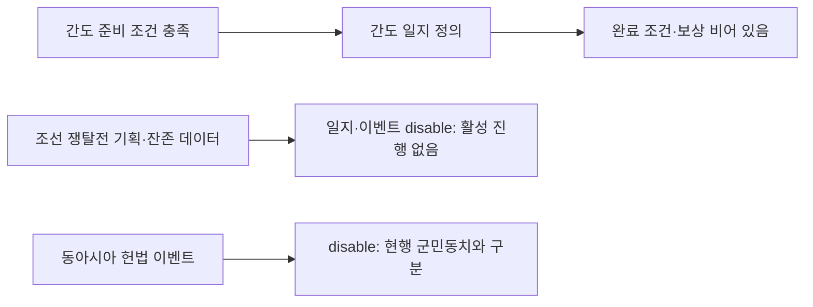

### 설명과 코드를 함께 확인해야 하는 부분

| 항목 | 확인한 차이·주의점 |
|---|---|
| 군정 시정 | 설명은 군적 ≥1,600, 실행 조건은 관청 ≥1,600 |
| 삼정이정청 대개혁 | 결과 미리보기의 삼정 완료 변수 설정이 실제 완료·선택지 효과에는 없음 |
| 정변 후 안정화 | 설명의 5년 유지와 달리 완료 블록에 유지 기간·성공 진행도 검사가 없음 |
| 유구 개입 | 진행도 외에 유구의 독립 상태와 조공국화 가능 조건 필요 |
| 대만 요구 | 외국 소유 주에 대한 버튼의 범위 순회는 게임 내 전달 확인 필요 |
| 대만 완료 | 양도 거절도 해결 변수 설정으로 완료 처리 |
| 만주 정착 | 대상 주 모두에 한국 문화 공동체가 없어야 하는 조건 |
| 신민회 | 사업 건물과 달리 설립 조건은 서울 섬유 공장 |

근거: [간도 포함 개혁 일지](../common/journal_entries/eafp_korean_reformation.txt), [비활성 쟁탈전 일지](../common/journal_entries/eafp_scramble_for_korea.disable), [비활성 쟁탈전 이벤트](../events/eafp_scramble_for_korea_events.disable), [쟁탈전 설계안](../scratch/scramble_for_korea_journal_design_plan.md), [비활성 헌법 이벤트](../events/eafp_eastasian_constitution_events.disable). 나머지 구현 차이의 근거는 각 콘텐츠 절의 소스 링크를 참조한다.

<a id="source-index"></a>
## 21. 이벤트·소스 찾아보기

### 주요 이벤트 묶음

범위 표기는 같은 주제의 묶음이며, 범위 내 모든 번호가 활성 정의라는 뜻은 아니다. 실제 호출·주석 여부는 원본을 확인한다.

| 네임스페이스·번호 | 콘텐츠 |
|---|---|
| `eafp_kor_mainline.1`~`.43` | 도입, 주상의 상태, 헌종 개인 사건, 순시·사냥 |
| `eafp_kor_mainline.81`~`.115` | 철종 성학, 왕위 계승, 수렴청정 종료 |
| `eafp_kor_mainline.120`~`.171` | 서학·선교사·교화·새로운 물결 |
| `eafp_kor_mainline.200`~`.230` | 부패, 민란 확산·수습, 삼정이정청 |
| `eafp_kor_mainline.298`, `.299` | 양전 완료, 삼정 혁파 |
| `eafp_kor_mainline.301`~`.346` | 왕권 강화·세도가·철종·고종 역사 사건 |
| `eafp_kor_mainline.999` | 사라지는 권세 |
| `eafp_kor_mainline.1500`~`.1510` | 경복궁 중건·원납전 |
| `eafp_korean_reformation_events.101`~`.199` | 사회 제도 개혁 |
| `eafp_korean_reformation_events.201`~`.299` | 군제 개혁 |
| `eafp_korean_reformation_events.301`~`.399` | 상공업 진흥 |
| `eafp_korean_reformation_events.401`, `.499` | 외교 개혁 |
| `eafp_korean_reformation_events.501`~`.506` | 회사설·주식회사·우정총국·중앙은행·위생·순보서 |
| `gunmin_dongchi_events` | 군민동치·양파 정변·정착·숙청 |
| `seoul_improvement_project_events.1` | 한성개조사업 완료 |
| `eafp_kor_foreign_mission` | 사절단 대표·견학·귀국·보고서 |
| `eafp_joseon_qing_war_events.1`~`.3` | 조청전쟁 시작·승리·패배 |
| `eafp_manchuria.1`~`.3` | 만주 명분·점령·통합 |
| `eafp_ryukyu.1`~`.9` | 유구 개입·대만 답사·양도 요구 |
| `gg_korea.1`~`.9`, `.101` | 동학·청원·내전 개입·청일 요구·최제우 처분 |

### 공통 구현·표시 파일

| 역할 | 경로 |
|---|---|
| 국정 공통 효과 | [eafp_korea_effects.txt](../common/scripted_effects/eafp_korea_effects.txt) |
| 국정 수치·삼정이정청 평가 | [eafp_kor_values.txt](../common/script_values/eafp_kor_values.txt) |
| 왕실·삼정·세계 인식도 | [eafp_kor_progress_bars.txt](../common/scripted_progress_bars/eafp_kor_progress_bars.txt) |
| 개혁·정변 진행도 | [eafp_korean_reformation_progress_bars.txt](../common/scripted_progress_bars/eafp_korean_reformation_progress_bars.txt) |
| 기본 콘텐츠 한국어 | [eafp_kor_rework_l_korean.yml](../localization/korean/eafp_kor_rework_l_korean.yml) |
| 개혁 한국어 | [eafp_korean_reformation_l_korean.yml](../localization/korean/eafp_korean_reformation_l_korean.yml) |
| 사절단 한국어 | [eafp_korean_foreign_mission_l_korean.yml](../localization/korean/eafp_korean_foreign_mission_l_korean.yml) |
| 조청전쟁 한국어 | [eafp_joseon_qing_war_l_korean.yml](../localization/korean/eafp_joseon_qing_war_l_korean.yml) |
| 만주 한국어 | [eafp_kor_manchuria_l_korean.yml](../localization/korean/eafp_kor_manchuria_l_korean.yml) |
| 유구·대만 한국어 | [eafp_ryukyu_l_korean.yml](../localization/korean/eafp_ryukyu_l_korean.yml), [eafp_taiwan_l_korean.yml](../localization/korean/eafp_taiwan_l_korean.yml) |
| 동학 한국어 | [eafp_donghak_l_korean.yml](../localization/korean/eafp_donghak_l_korean.yml) |

인물 이름·복식·초상·국기·군주 호칭·초기 인구와 건물 데이터는 이 진행 문서의 범위에서 세부 목록을 생략했다. 디버그 결정·디버그 이벤트 역시 플레이 콘텐츠 목록에서 제외했다.

<!-- BEGIN GENERATED JOSEON FLOWCHARTS -->
<a id="complete-flowcharts"></a>
## 22. 전체 일지·이벤트 상세 흐름도

앞 절의 도식은 진행 요약이고, 이 절은 **각 일지·이벤트를 전체 ID가 붙은 개별 노드**로 표시한 소스 기준 호출 지도다. 같은 노드가 여러 그림에 보이면 동일한 콘텐츠의 연결 지점이다. 번호 구간을 하나의 노드로 묶지 않는다.

- 파란 노드: 일지. 흰 노드: 이벤트. 노란 노드: 버튼·결정·on_action·초기 설정. 회색 노드: 비활성 파일, 주석 정의, 명시적으로 차단된 사건. 분홍 노드: 저장소에 정의가 없는 외부 참조.
- 실선은 실행부의 이벤트 호출·일지 추가, 점선은 버튼 연결 또는 비활성 코드의 참조다. `show_as_tooltip`, 결과 미리보기, `can_trigger_event` 검사와 주석 속 호출은 실행선으로 세지 않는다.
- 선의 `조건부`는 원본 `if`/`else_if` 검사가 있다는 뜻이다. 무작위 후보·월간 후보는 순서대로 전부 발생한다는 뜻이 아니며 각 이벤트의 trigger를 추가 검사한다. 선택지는 원본 선택지 키를 적었다.
- 재사용 scripted effect의 호출은 실제 이벤트·일지 대상으로 펼쳤다. 날짜·변수·법률에 따른 자동 활성화와 완료/실패 결과는 각 절의 조건 설명 및 원본 일지를 함께 읽는다.
- 다른 국가의 전체 캠페인을 재귀적으로 포함하지 않는다. 기존 문서의 조선·공통 콘텐츠 파일 전체, 그 실행부가 호출하는 일지·이벤트, 그쪽으로 들어오는 외부 호출 지점을 포함한다. 디버그 호출은 제외한다.

`eafp_kor_mainline.27`과 `.29`는 원본에서 비워 둔 번호이며 주석 속 참조만 있다. 정의가 존재하는 이벤트 수에 포함하지 않는다. 유입 호출 미확인은 미구현 확정이 아니라 이 저장소 밖의 기본 게임 호출을 확인하지 못했다는 뜻일 수도 있다.

이 절은 [생성 도구](../tools/generate_joseon_flowcharts.cjs)로 갱신한다. 저장소 루트에서 `node tools/generate_joseon_flowcharts.cjs`로 재생성하고, `node tools/generate_joseon_flowcharts.cjs --check`로 원본 대비 최신 상태와 노드 포함 여부를 확인할 수 있다.

### 포함 범위 검증

| 원본 파일 | 일지 | 이벤트 | 구분 |
|---|---:|---:|---|
| [common/journal_entries/eafp_korean_journal.txt](../common/journal_entries/eafp_korean_journal.txt) | 13 | 0 | 활성 파일 |
| [common/journal_entries/eafp_korean_reformation.txt](../common/journal_entries/eafp_korean_reformation.txt) | 11 | 0 | 활성 파일 |
| [common/journal_entries/eafp_korean_foreign_mission.txt](../common/journal_entries/eafp_korean_foreign_mission.txt) | 1 | 0 | 활성 파일 |
| [common/journal_entries/eafp_joseon_qing_war.txt](../common/journal_entries/eafp_joseon_qing_war.txt) | 1 | 0 | 활성 파일 |
| [common/journal_entries/eafp_kor_manchuria_management.txt](../common/journal_entries/eafp_kor_manchuria_management.txt) | 2 | 0 | 활성 파일 |
| [common/journal_entries/eafp_03_korea.txt](../common/journal_entries/eafp_03_korea.txt) | 3 | 0 | 활성 파일 |
| [common/journal_entries/eafp_01_ryukyu_rivalry.txt](../common/journal_entries/eafp_01_ryukyu_rivalry.txt) | 1 | 0 | 활성 파일 |
| [common/journal_entries/eafp_taiwan_journal.txt](../common/journal_entries/eafp_taiwan_journal.txt) | 1 | 0 | 활성 파일 |
| [common/journal_entries/eafp_scholar_bureaucrats_journal.txt](../common/journal_entries/eafp_scholar_bureaucrats_journal.txt) | 1 | 0 | 활성 파일 |
| [common/journal_entries/eafp_eastasian_expansionism.txt](../common/journal_entries/eafp_eastasian_expansionism.txt) | 1 | 0 | 활성 파일 |
| [events/eafp_kor_events/eafp_joseon_qing_war_events.txt](../events/eafp_kor_events/eafp_joseon_qing_war_events.txt) | 0 | 3 | 활성 파일 |
| [events/eafp_kor_events/eafp_kor_mainline.txt](../events/eafp_kor_events/eafp_kor_mainline.txt) | 0 | 138 | 활성 파일 |
| [events/eafp_kor_events/eafp_kor_manchuria_events.txt](../events/eafp_kor_events/eafp_kor_manchuria_events.txt) | 0 | 3 | 활성 파일 |
| [events/eafp_kor_events/eafp_korean_foreign_mission_events.txt](../events/eafp_kor_events/eafp_korean_foreign_mission_events.txt) | 0 | 14 | 활성 파일 |
| [events/eafp_kor_events/eafp_korean_reformation_events.txt](../events/eafp_kor_events/eafp_korean_reformation_events.txt) | 0 | 48 | 활성 파일 |
| [events/soi_events/00_ep1_korea_events.txt](../events/soi_events/00_ep1_korea_events.txt) | 0 | 14 | 활성 파일 |
| [events/eafp_ryukyu_events.txt](../events/eafp_ryukyu_events.txt) | 0 | 9 | 활성 파일 |
| [events/eafp_eastasian_expansionism_events.txt](../events/eafp_eastasian_expansionism_events.txt) | 0 | 8 | 활성 파일 |
| [common/journal_entries/eafp_scramble_for_korea.disable](../common/journal_entries/eafp_scramble_for_korea.disable) | 1 | 0 | 비활성 |
| [events/eafp_scramble_for_korea_events.disable](../events/eafp_scramble_for_korea_events.disable) | 0 | 5 | 비활성 |
| [events/eafp_eastasian_constitution_events.disable](../events/eafp_eastasian_constitution_events.disable) | 0 | 5 | 비활성 |

총 **일지 36개·이벤트 249개**를 개별 노드로 수록했다. 이 수에는 비활성·차단·주석 정의도 포함되며 마지막 그림에서 구분한다. 원본 핵심 파일의 정의 283개와 호출 추적·주석 복원으로 추가된 2개를 대조했다. 외부 호출 지점과 정의 미확인 참조는 그림에 별도로 표시한다.

- [주상의 상태·도입·왕실 활동](#flow-health)
- [철종 성학·경연](#flow-education)
- [왕위 계승·수렴청정](#flow-succession)
- [유학의 왕국·서학·박해](#flow-confucianism)
- [삼정·양전·민란 전조](#flow-samjeong)
- [민란 발생·확산·수습](#flow-uprising)
- [삼정이정청·평가 결과](#flow-commission)
- [세도정치·헌종의 왕권 강화](#flow-sedo)
- [철종대 정치 사건](#flow-cheoljong)
- [고종대 정치 사건·사라지는 권세](#flow-gojong)
- [경복궁 중건·원납전](#flow-palace)
- [부국강병·사회 개혁](#flow-reformation)
- [군제 개혁](#flow-military)
- [상공업 진흥](#flow-economy)
- [외교 개혁·대한제국](#flow-diplomacy)
- [기술·제도 도입 사건](#flow-technology)
- [해외 사절단](#flow-mission)
- [군민동치·양파 정변](#flow-politics)
- [한성개조·서해 간척](#flow-seoul)
- [조청전쟁](#flow-war)
- [만주 정책·경영·간도](#flow-manchuria)
- [유구 개입·대만 개척](#flow-ryukyu)
- [동학·교조신원·내전·청일 개입](#flow-donghak)
- [동아시아 팽창주의](#flow-expansionism)
- [비활성·주석 처리·차단된 정의](#flow-disabled)

<a id="flow-health"></a>
### 주상의 상태·도입·왕실 활동

```mermaid
flowchart TD
    n_COUNTRIES["COUNTRIES<br/>조선 초기 설정"]:::entry
    n_eafp_kor_mainline_1["eafp_kor_mainline.1<br/>어린 왕"]:::event
    n_eafp_kor_mainline_2["eafp_kor_mainline.2<br/>병약한 기운"]:::event
    n_eafp_kor_mainline_3["eafp_kor_mainline.3<br/>미숙한 왕권"]:::event
    n_eafp_kor_mainline_6["eafp_kor_mainline.6<br/>불안한 병세"]:::event
    n_eafp_kor_mainline_7["eafp_kor_mainline.7<br/>대점(大漸)"]:::event
    n_eafp_kor_mainline_8["eafp_kor_mainline.8<br/>불안한 병세"]:::event
    n_eafp_kor_mainline_9["eafp_kor_mainline.9<br/>대점(大漸)"]:::event
    n_eafp_kor_mainline_19["eafp_kor_mainline.19<br/>원자의 탄생"]:::event
    n_eafp_kor_mainline_20["eafp_kor_mainline.20<br/>장계"]:::event
    n_eafp_kor_mainline_21["eafp_kor_mainline.21<br/>감사"]:::event
    n_eafp_kor_mainline_22["eafp_kor_mainline.22<br/>재용"]:::event
    n_eafp_kor_mainline_23["eafp_kor_mainline.23<br/>기거"]:::event
    n_eafp_kor_mainline_24["eafp_kor_mainline.24<br/>정사"]:::event
    n_eafp_kor_mainline_25["eafp_kor_mainline.25<br/>처분"]:::event
    n_eafp_kor_mainline_26["eafp_kor_mainline.26<br/>개강"]:::event
    n_eafp_kor_mainline_28["eafp_kor_mainline.28<br/>구제"]:::event
    n_eafp_kor_mainline_30["eafp_kor_mainline.30<br/>대책"]:::event
    n_eafp_kor_mainline_40["eafp_kor_mainline.40<br/>순시: 좋은 성과"]:::event
    n_eafp_kor_mainline_41["eafp_kor_mainline.41<br/>사냥: 노루를 잡다!"]:::event
    n_eafp_kor_mainline_42["eafp_kor_mainline.42<br/>사냥: 가마우지를 잡다!"]:::event
    n_eafp_kor_mainline_43["eafp_kor_mainline.43<br/>사냥: 신하들의 간언"]:::event
    n_eafp_scripted_button_health_hunting["eafp_scripted_button_health_hunting<br/>사냥"]:::entry
    n_eafp_scripted_button_health_inspectation_tour["eafp_scripted_button_health_inspectation_tour<br/>순시"]:::entry
    n_je_korean_kings_health["je_korean_kings_health<br/>주상의 상태"]:::journal
    n_je_korean_kings_health -.->|"버튼·사용 조건 검사"| n_eafp_scripted_button_health_inspectation_tour
    n_eafp_scripted_button_health_inspectation_tour -->|"효과 / 무작위 / 호출"| n_eafp_kor_mainline_40
    n_je_korean_kings_health -.->|"버튼·사용 조건 검사"| n_eafp_scripted_button_health_hunting
    n_eafp_scripted_button_health_hunting -->|"효과 / 조건부 / 호출"| n_eafp_kor_mainline_43
    n_eafp_scripted_button_health_hunting -->|"효과 / 무작위 / 호출"| n_eafp_kor_mainline_41
    n_eafp_scripted_button_health_hunting -->|"효과 / 무작위 / 호출"| n_eafp_kor_mainline_42
    n_je_korean_kings_health -->|"완료 / 호출"| n_eafp_kor_mainline_19
    n_je_korean_kings_health -->|"매월 / 효과 / 조건부 / 무작위 / 호출"| n_eafp_kor_mainline_20
    n_je_korean_kings_health -->|"매월 / 효과 / 조건부 / 무작위 / 호출"| n_eafp_kor_mainline_21
    n_je_korean_kings_health -->|"매월 / 효과 / 조건부 / 무작위 / 호출"| n_eafp_kor_mainline_22
    n_je_korean_kings_health -->|"매월 / 효과 / 조건부 / 무작위 / 호출"| n_eafp_kor_mainline_23
    n_je_korean_kings_health -->|"매월 / 효과 / 조건부 / 무작위 / 호출"| n_eafp_kor_mainline_24
    n_je_korean_kings_health -->|"매월 / 효과 / 조건부 / 무작위 / 호출"| n_eafp_kor_mainline_25
    n_je_korean_kings_health -->|"매월 / 효과 / 조건부 / 무작위 / 호출"| n_eafp_kor_mainline_26
    n_je_korean_kings_health -->|"매월 / 효과 / 조건부 / 무작위 / 호출"| n_eafp_kor_mainline_28
    n_je_korean_kings_health -->|"매월 / 효과 / 조건부 / 무작위 / 호출"| n_eafp_kor_mainline_30
    n_je_korean_kings_health -->|"매월 / 이벤트 후보·개별 trigger 검사"| n_eafp_kor_mainline_6
    n_je_korean_kings_health -->|"매월 / 이벤트 후보·개별 trigger 검사"| n_eafp_kor_mainline_7
    n_je_korean_kings_health -->|"매월 / 이벤트 후보·개별 trigger 검사"| n_eafp_kor_mainline_8
    n_je_korean_kings_health -->|"매월 / 이벤트 후보·개별 trigger 검사"| n_eafp_kor_mainline_9
    n_COUNTRIES -->|"일지 추가"| n_je_korean_kings_health
    n_COUNTRIES -->|"3일 뒤 호출"| n_eafp_kor_mainline_1
    n_COUNTRIES -->|"7일 뒤 호출"| n_eafp_kor_mainline_2
    n_COUNTRIES -->|"359일 뒤 호출"| n_eafp_kor_mainline_3
    classDef journal fill:#dbeafe,stroke:#2563eb,color:#111827
    classDef event fill:#ffffff,stroke:#64748b,color:#111827
    classDef entry fill:#fef3c7,stroke:#d97706,color:#111827
    classDef disabled fill:#e5e7eb,stroke:#6b7280,color:#374151,stroke-dasharray:5 5
    classDef external fill:#fce7f3,stroke:#be185d,color:#111827
```

| 일지·이벤트 ID | 이름 | 원본 | 상태 |
|---|---|---|---|
| `eafp_kor_mainline.1` | 어린 왕 | [events/eafp_kor_events/eafp_kor_mainline.txt:21](../events/eafp_kor_events/eafp_kor_mainline.txt#L21) | 실행부 연결 확인 |
| `eafp_kor_mainline.2` | 병약한 기운 | [events/eafp_kor_events/eafp_kor_mainline.txt:81](../events/eafp_kor_events/eafp_kor_mainline.txt#L81) | 실행부 연결 확인 |
| `eafp_kor_mainline.3` | 미숙한 왕권 | [events/eafp_kor_events/eafp_kor_mainline.txt:168](../events/eafp_kor_events/eafp_kor_mainline.txt#L168) | 실행부 연결 확인 |
| `eafp_kor_mainline.6` | 불안한 병세 | [events/eafp_kor_events/eafp_kor_mainline.txt:211](../events/eafp_kor_events/eafp_kor_mainline.txt#L211) | 실행부 연결 확인 |
| `eafp_kor_mainline.7` | 대점(大漸) | [events/eafp_kor_events/eafp_kor_mainline.txt:252](../events/eafp_kor_events/eafp_kor_mainline.txt#L252) | 실행부 연결 확인 |
| `eafp_kor_mainline.8` | 불안한 병세 | [events/eafp_kor_events/eafp_kor_mainline.txt:288](../events/eafp_kor_events/eafp_kor_mainline.txt#L288) | 실행부 연결 확인 |
| `eafp_kor_mainline.9` | 대점(大漸) | [events/eafp_kor_events/eafp_kor_mainline.txt:329](../events/eafp_kor_events/eafp_kor_mainline.txt#L329) | 실행부 연결 확인 |
| `eafp_kor_mainline.19` | 원자의 탄생 | [events/eafp_kor_events/eafp_kor_mainline.txt:371](../events/eafp_kor_events/eafp_kor_mainline.txt#L371) | 실행부 연결 확인 |
| `eafp_kor_mainline.20` | 장계 | [events/eafp_kor_events/eafp_kor_mainline.txt:572](../events/eafp_kor_events/eafp_kor_mainline.txt#L572) | 실행부 연결 확인 |
| `eafp_kor_mainline.21` | 감사 | [events/eafp_kor_events/eafp_kor_mainline.txt:699](../events/eafp_kor_events/eafp_kor_mainline.txt#L699) | 실행부 연결 확인 |
| `eafp_kor_mainline.22` | 재용 | [events/eafp_kor_events/eafp_kor_mainline.txt:826](../events/eafp_kor_events/eafp_kor_mainline.txt#L826) | 실행부 연결 확인 |
| `eafp_kor_mainline.23` | 기거 | [events/eafp_kor_events/eafp_kor_mainline.txt:953](../events/eafp_kor_events/eafp_kor_mainline.txt#L953) | 실행부 연결 확인 |
| `eafp_kor_mainline.24` | 정사 | [events/eafp_kor_events/eafp_kor_mainline.txt:1080](../events/eafp_kor_events/eafp_kor_mainline.txt#L1080) | 실행부 연결 확인 |
| `eafp_kor_mainline.25` | 처분 | [events/eafp_kor_events/eafp_kor_mainline.txt:1207](../events/eafp_kor_events/eafp_kor_mainline.txt#L1207) | 실행부 연결 확인 |
| `eafp_kor_mainline.26` | 개강 | [events/eafp_kor_events/eafp_kor_mainline.txt:1334](../events/eafp_kor_events/eafp_kor_mainline.txt#L1334) | 실행부 연결 확인 |
| `eafp_kor_mainline.28` | 구제 | [events/eafp_kor_events/eafp_kor_mainline.txt:1464](../events/eafp_kor_events/eafp_kor_mainline.txt#L1464) | 실행부 연결 확인 |
| `eafp_kor_mainline.30` | 대책 | [events/eafp_kor_events/eafp_kor_mainline.txt:1594](../events/eafp_kor_events/eafp_kor_mainline.txt#L1594) | 실행부 연결 확인 |
| `eafp_kor_mainline.40` | 순시: 좋은 성과 | [events/eafp_kor_events/eafp_kor_mainline.txt:1724](../events/eafp_kor_events/eafp_kor_mainline.txt#L1724) | 실행부 연결 확인 |
| `eafp_kor_mainline.41` | 사냥: 노루를 잡다! | [events/eafp_kor_events/eafp_kor_mainline.txt:1825](../events/eafp_kor_events/eafp_kor_mainline.txt#L1825) | 실행부 연결 확인 |
| `eafp_kor_mainline.42` | 사냥: 가마우지를 잡다! | [events/eafp_kor_events/eafp_kor_mainline.txt:1865](../events/eafp_kor_events/eafp_kor_mainline.txt#L1865) | 실행부 연결 확인 |
| `eafp_kor_mainline.43` | 사냥: 신하들의 간언 | [events/eafp_kor_events/eafp_kor_mainline.txt:1905](../events/eafp_kor_events/eafp_kor_mainline.txt#L1905) | 실행부 연결 확인 |
| `je_korean_kings_health` | 주상의 상태 | [common/journal_entries/eafp_korean_journal.txt:2](../common/journal_entries/eafp_korean_journal.txt#L2) | 실행부 연결 확인 |

<a id="flow-education"></a>
### 철종 성학·경연

```mermaid
flowchart TD
    n_eafp_kor_mainline_81["eafp_kor_mainline.81<br/>경연"]:::event
    n_eafp_kor_mainline_82["eafp_kor_mainline.82<br/>경연"]:::event
    n_eafp_kor_mainline_83["eafp_kor_mainline.83<br/>경연"]:::event
    n_eafp_kor_mainline_84["eafp_kor_mainline.84<br/>경연"]:::event
    n_eafp_kor_mainline_85["eafp_kor_mainline.85<br/>복습"]:::event
    n_eafp_kor_mainline_86["eafp_kor_mainline.86<br/>경연"]:::event
    n_eafp_kor_mainline_87["eafp_kor_mainline.87<br/>경연"]:::event
    n_eafp_kor_mainline_88["eafp_kor_mainline.88<br/>경연"]:::event
    n_eafp_kor_mainline_89["eafp_kor_mainline.89<br/>경연"]:::event
    n_eafp_kor_mainline_90["eafp_kor_mainline.90<br/>경연"]:::event
    n_eafp_kor_mainline_91["eafp_kor_mainline.91<br/>경연"]:::event
    n_eafp_kor_mainline_92["eafp_kor_mainline.92<br/>경연"]:::event
    n_eafp_kor_mainline_93["eafp_kor_mainline.93<br/>경연"]:::event
    n_eafp_kor_mainline_94["eafp_kor_mainline.94<br/>경연"]:::event
    n_eafp_kor_mainline_95["eafp_kor_mainline.95<br/>경연"]:::event
    n_eafp_kor_mainline_96["eafp_kor_mainline.96<br/>경연"]:::event
    n_eafp_kor_mainline_97["eafp_kor_mainline.97<br/>경연"]:::event
    n_eafp_kor_mainline_98["eafp_kor_mainline.98<br/>경연"]:::event
    n_eafp_kor_mainline_99["eafp_kor_mainline.99<br/>경연"]:::event
    n_eafp_kor_mainline_323["eafp_kor_mainline.323<br/>공부"]:::event
    n_je_king_cheoljong_education["je_king_cheoljong_education<br/>성학(聖學)"]:::journal
    n_eafp_kor_mainline_323 -->|"선택 eafp_kor_mainline.323.oa / 일지 추가"| n_je_king_cheoljong_education
    n_je_king_cheoljong_education -->|"완료 / 호출"| n_eafp_kor_mainline_99
    n_je_king_cheoljong_education -->|"매월 / 이벤트 후보·개별 trigger 검사"| n_eafp_kor_mainline_81
    n_je_king_cheoljong_education -->|"매월 / 이벤트 후보·개별 trigger 검사"| n_eafp_kor_mainline_82
    n_je_king_cheoljong_education -->|"매월 / 이벤트 후보·개별 trigger 검사"| n_eafp_kor_mainline_83
    n_je_king_cheoljong_education -->|"매월 / 이벤트 후보·개별 trigger 검사"| n_eafp_kor_mainline_84
    n_je_king_cheoljong_education -->|"매월 / 이벤트 후보·개별 trigger 검사"| n_eafp_kor_mainline_85
    n_je_king_cheoljong_education -->|"매월 / 이벤트 후보·개별 trigger 검사"| n_eafp_kor_mainline_86
    n_je_king_cheoljong_education -->|"매월 / 이벤트 후보·개별 trigger 검사"| n_eafp_kor_mainline_87
    n_je_king_cheoljong_education -->|"매월 / 이벤트 후보·개별 trigger 검사"| n_eafp_kor_mainline_88
    n_je_king_cheoljong_education -->|"매월 / 이벤트 후보·개별 trigger 검사"| n_eafp_kor_mainline_89
    n_je_king_cheoljong_education -->|"매월 / 이벤트 후보·개별 trigger 검사"| n_eafp_kor_mainline_90
    n_je_king_cheoljong_education -->|"매월 / 이벤트 후보·개별 trigger 검사"| n_eafp_kor_mainline_91
    n_je_king_cheoljong_education -->|"매월 / 이벤트 후보·개별 trigger 검사"| n_eafp_kor_mainline_92
    n_je_king_cheoljong_education -->|"매월 / 이벤트 후보·개별 trigger 검사"| n_eafp_kor_mainline_93
    n_je_king_cheoljong_education -->|"매월 / 이벤트 후보·개별 trigger 검사"| n_eafp_kor_mainline_94
    n_je_king_cheoljong_education -->|"매월 / 이벤트 후보·개별 trigger 검사"| n_eafp_kor_mainline_95
    n_je_king_cheoljong_education -->|"매월 / 이벤트 후보·개별 trigger 검사"| n_eafp_kor_mainline_96
    n_je_king_cheoljong_education -->|"매월 / 이벤트 후보·개별 trigger 검사"| n_eafp_kor_mainline_97
    n_je_king_cheoljong_education -->|"매월 / 이벤트 후보·개별 trigger 검사"| n_eafp_kor_mainline_98
    classDef journal fill:#dbeafe,stroke:#2563eb,color:#111827
    classDef event fill:#ffffff,stroke:#64748b,color:#111827
    classDef entry fill:#fef3c7,stroke:#d97706,color:#111827
    classDef disabled fill:#e5e7eb,stroke:#6b7280,color:#374151,stroke-dasharray:5 5
    classDef external fill:#fce7f3,stroke:#be185d,color:#111827
```

| 일지·이벤트 ID | 이름 | 원본 | 상태 |
|---|---|---|---|
| `eafp_kor_mainline.81` | 경연 | [events/eafp_kor_events/eafp_kor_mainline.txt:1993](../events/eafp_kor_events/eafp_kor_mainline.txt#L1993) | 실행부 연결 확인 |
| `eafp_kor_mainline.82` | 경연 | [events/eafp_kor_events/eafp_kor_mainline.txt:2030](../events/eafp_kor_events/eafp_kor_mainline.txt#L2030) | 실행부 연결 확인 |
| `eafp_kor_mainline.83` | 경연 | [events/eafp_kor_events/eafp_kor_mainline.txt:2067](../events/eafp_kor_events/eafp_kor_mainline.txt#L2067) | 실행부 연결 확인 |
| `eafp_kor_mainline.84` | 경연 | [events/eafp_kor_events/eafp_kor_mainline.txt:2104](../events/eafp_kor_events/eafp_kor_mainline.txt#L2104) | 실행부 연결 확인 |
| `eafp_kor_mainline.85` | 복습 | [events/eafp_kor_events/eafp_kor_mainline.txt:2141](../events/eafp_kor_events/eafp_kor_mainline.txt#L2141) | 실행부 연결 확인 |
| `eafp_kor_mainline.86` | 경연 | [events/eafp_kor_events/eafp_kor_mainline.txt:2178](../events/eafp_kor_events/eafp_kor_mainline.txt#L2178) | 실행부 연결 확인 |
| `eafp_kor_mainline.87` | 경연 | [events/eafp_kor_events/eafp_kor_mainline.txt:2215](../events/eafp_kor_events/eafp_kor_mainline.txt#L2215) | 실행부 연결 확인 |
| `eafp_kor_mainline.88` | 경연 | [events/eafp_kor_events/eafp_kor_mainline.txt:2252](../events/eafp_kor_events/eafp_kor_mainline.txt#L2252) | 실행부 연결 확인 |
| `eafp_kor_mainline.89` | 경연 | [events/eafp_kor_events/eafp_kor_mainline.txt:2289](../events/eafp_kor_events/eafp_kor_mainline.txt#L2289) | 실행부 연결 확인 |
| `eafp_kor_mainline.90` | 경연 | [events/eafp_kor_events/eafp_kor_mainline.txt:2326](../events/eafp_kor_events/eafp_kor_mainline.txt#L2326) | 실행부 연결 확인 |
| `eafp_kor_mainline.91` | 경연 | [events/eafp_kor_events/eafp_kor_mainline.txt:2363](../events/eafp_kor_events/eafp_kor_mainline.txt#L2363) | 실행부 연결 확인 |
| `eafp_kor_mainline.92` | 경연 | [events/eafp_kor_events/eafp_kor_mainline.txt:2400](../events/eafp_kor_events/eafp_kor_mainline.txt#L2400) | 실행부 연결 확인 |
| `eafp_kor_mainline.93` | 경연 | [events/eafp_kor_events/eafp_kor_mainline.txt:2437](../events/eafp_kor_events/eafp_kor_mainline.txt#L2437) | 실행부 연결 확인 |
| `eafp_kor_mainline.94` | 경연 | [events/eafp_kor_events/eafp_kor_mainline.txt:2474](../events/eafp_kor_events/eafp_kor_mainline.txt#L2474) | 실행부 연결 확인 |
| `eafp_kor_mainline.95` | 경연 | [events/eafp_kor_events/eafp_kor_mainline.txt:2511](../events/eafp_kor_events/eafp_kor_mainline.txt#L2511) | 실행부 연결 확인 |
| `eafp_kor_mainline.96` | 경연 | [events/eafp_kor_events/eafp_kor_mainline.txt:2548](../events/eafp_kor_events/eafp_kor_mainline.txt#L2548) | 실행부 연결 확인 |
| `eafp_kor_mainline.97` | 경연 | [events/eafp_kor_events/eafp_kor_mainline.txt:2585](../events/eafp_kor_events/eafp_kor_mainline.txt#L2585) | 실행부 연결 확인 |
| `eafp_kor_mainline.98` | 경연 | [events/eafp_kor_events/eafp_kor_mainline.txt:2622](../events/eafp_kor_events/eafp_kor_mainline.txt#L2622) | 실행부 연결 확인 |
| `eafp_kor_mainline.99` | 경연 | [events/eafp_kor_events/eafp_kor_mainline.txt:2659](../events/eafp_kor_events/eafp_kor_mainline.txt#L2659) | 실행부 연결 확인 |
| `je_king_cheoljong_education` | 성학(聖學) | [common/journal_entries/eafp_korean_journal.txt:771](../common/journal_entries/eafp_korean_journal.txt#L771) | 실행부 연결 확인 |

<a id="flow-succession"></a>
### 왕위 계승·수렴청정

```mermaid
flowchart TD
    n_COUNTRIES["COUNTRIES<br/>조선 초기 설정"]:::entry
    n_eafp_kor_mainline_100["eafp_kor_mainline.100<br/>군주 사망 처리·동적 제목"]:::event
    n_eafp_kor_mainline_101["eafp_kor_mainline.101<br/>강화도령"]:::event
    n_eafp_kor_mainline_102["eafp_kor_mainline.102<br/>입궐"]:::event
    n_eafp_kor_mainline_105["eafp_kor_mainline.105<br/>거둬진 수렴"]:::event
    n_eafp_kor_mainline_106["eafp_kor_mainline.106<br/>거둬진 수렴"]:::event
    n_eafp_kor_mainline_107["eafp_kor_mainline.107<br/>거둬진 수렴"]:::event
    n_eafp_kor_mainline_111["eafp_kor_mainline.111<br/>소견"]:::event
    n_eafp_kor_mainline_112["eafp_kor_mainline.112<br/>봉영"]:::event
    n_eafp_kor_mainline_114["eafp_kor_mainline.114<br/>사위(嗣位)"]:::event
    n_eafp_kor_mainline_115["eafp_kor_mainline.115<br/>입궐"]:::event
    n_eafp_kor_mainline_323["eafp_kor_mainline.323<br/>공부"]:::event
    n_eafp_kor_mainline_330["eafp_kor_mainline.330<br/>예송"]:::event
    n_eafp_kor_mainline_331["eafp_kor_mainline.331<br/>채희재의 난"]:::event
    n_eafp_kor_mainline_332["eafp_kor_mainline.332<br/>왕비 간택"]:::event
    n_eafp_kor_mainline_334["eafp_kor_mainline.334<br/>동지사은정사"]:::event
    n_eafp_kor_mainline_335["eafp_kor_mainline.335<br/>김노경 복권"]:::event
    n_eafp_kor_mainline_337["eafp_kor_mainline.337<br/>홍인한 복권"]:::event
    n_eafp_kor_mainline_339["eafp_kor_mainline.339<br/>서대순의 상소"]:::event
    n_eafp_kor_mainline_340["eafp_kor_mainline.340<br/>종계변무"]:::event
    n_eafp_kor_mainline_342["eafp_kor_mainline.342<br/>사색당파"]:::event
    n_eafp_kor_mainline_346["eafp_kor_mainline.346<br/>원자 탄생"]:::event
    n_je_korean_regent["je_korean_regent<br/>수렴청정"]:::journal
    n_je_korean_regent_inactive["je_korean_regent_inactive<br/>수렴청정"]:::journal
    n_korea_on_character_death["korea_on_character_death"]:::entry
    n_eafp_kor_mainline_101 -->|"시작 / 1~7일 뒤 호출"| n_eafp_kor_mainline_323
    n_eafp_kor_mainline_101 -->|"시작 / 365~720일 뒤 호출"| n_eafp_kor_mainline_330
    n_eafp_kor_mainline_101 -->|"시작 / 365~720일 뒤 호출"| n_eafp_kor_mainline_331
    n_eafp_kor_mainline_101 -->|"시작 / 365~720일 뒤 호출"| n_eafp_kor_mainline_332
    n_eafp_kor_mainline_101 -->|"시작 / 2920~3285일 뒤 호출"| n_eafp_kor_mainline_334
    n_eafp_kor_mainline_101 -->|"시작 / 2920~3285일 뒤 호출"| n_eafp_kor_mainline_335
    n_eafp_kor_mainline_101 -->|"시작 / 3285~3650일 뒤 호출"| n_eafp_kor_mainline_337
    n_eafp_kor_mainline_101 -->|"시작 / 4015~4380일 뒤 호출"| n_eafp_kor_mainline_339
    n_eafp_kor_mainline_101 -->|"시작 / 5110~5475일 뒤 호출"| n_eafp_kor_mainline_340
    n_eafp_kor_mainline_102 -->|"시작 / 45~90일 뒤 호출"| n_eafp_kor_mainline_342
    n_eafp_kor_mainline_102 -->|"시작 / 3285~4380일 뒤 호출"| n_eafp_kor_mainline_346
    n_eafp_kor_mainline_111 -->|"선택 eafp_kor_mainline.111.oa / 조건부 / 호출"| n_eafp_kor_mainline_112
    n_eafp_kor_mainline_111 -->|"선택 eafp_kor_mainline.111.oa / 그 외 / 호출"| n_eafp_kor_mainline_101
    n_eafp_kor_mainline_112 -->|"시작 / 일지 추가"| n_je_korean_regent
    n_eafp_kor_mainline_112 -->|"선택 eafp_kor_mainline.112.oa / 호출"| n_eafp_kor_mainline_101
    n_eafp_kor_mainline_114 -->|"선택 eafp_kor_mainline.114.o / 조건부 / 호출"| n_eafp_kor_mainline_115
    n_eafp_kor_mainline_114 -->|"선택 eafp_kor_mainline.114.o / 그 외 / 호출"| n_eafp_kor_mainline_102
    n_eafp_kor_mainline_115 -->|"시작 / 일지 추가"| n_je_korean_regent
    n_eafp_kor_mainline_115 -->|"선택 eafp_kor_mainline.115.o / 호출"| n_eafp_kor_mainline_102
    n_je_korean_regent -->|"완료 / 조건부 / 호출"| n_eafp_kor_mainline_105
    n_je_korean_regent -->|"완료 / 조건부 / 호출"| n_eafp_kor_mainline_106
    n_je_korean_regent -->|"완료 / 조건부 / 호출"| n_eafp_kor_mainline_107
    n_korea_on_character_death -->|"효과 / 조건부 / 호출"| n_eafp_kor_mainline_100
    n_korea_on_character_death -->|"효과 / 조건부 / 조건부 / 호출"| n_eafp_kor_mainline_111
    n_korea_on_character_death -->|"효과 / 조건부 / 조건부 / 호출"| n_eafp_kor_mainline_114
    n_korea_on_character_death -->|"효과 / 조건부 / 조건부 / 일지 추가"| n_je_korean_regent
    n_COUNTRIES -->|"일지 추가"| n_je_korean_regent
    classDef journal fill:#dbeafe,stroke:#2563eb,color:#111827
    classDef event fill:#ffffff,stroke:#64748b,color:#111827
    classDef entry fill:#fef3c7,stroke:#d97706,color:#111827
    classDef disabled fill:#e5e7eb,stroke:#6b7280,color:#374151,stroke-dasharray:5 5
    classDef external fill:#fce7f3,stroke:#be185d,color:#111827
```

| 일지·이벤트 ID | 이름 | 원본 | 상태 |
|---|---|---|---|
| `eafp_kor_mainline.100` | 군주 사망 처리·동적 제목 | [events/eafp_kor_events/eafp_kor_mainline.txt:2710](../events/eafp_kor_events/eafp_kor_mainline.txt#L2710) | 실행부 연결 확인 |
| `eafp_kor_mainline.101` | 강화도령 | [events/eafp_kor_events/eafp_kor_mainline.txt:3752](../events/eafp_kor_events/eafp_kor_mainline.txt#L3752) | 실행부 연결 확인 |
| `eafp_kor_mainline.102` | 입궐 | [events/eafp_kor_events/eafp_kor_mainline.txt:3820](../events/eafp_kor_events/eafp_kor_mainline.txt#L3820) | 실행부 연결 확인 |
| `eafp_kor_mainline.105` | 거둬진 수렴 | [events/eafp_kor_events/eafp_kor_mainline.txt:3872](../events/eafp_kor_events/eafp_kor_mainline.txt#L3872) | 실행부 연결 확인 |
| `eafp_kor_mainline.106` | 거둬진 수렴 | [events/eafp_kor_events/eafp_kor_mainline.txt:3933](../events/eafp_kor_events/eafp_kor_mainline.txt#L3933) | 실행부 연결 확인 |
| `eafp_kor_mainline.107` | 거둬진 수렴 | [events/eafp_kor_events/eafp_kor_mainline.txt:3961](../events/eafp_kor_events/eafp_kor_mainline.txt#L3961) | 실행부 연결 확인 |
| `eafp_kor_mainline.111` | 소견 | [events/eafp_kor_events/eafp_kor_mainline.txt:3993](../events/eafp_kor_events/eafp_kor_mainline.txt#L3993) | 실행부 연결 확인 |
| `eafp_kor_mainline.112` | 봉영 | [events/eafp_kor_events/eafp_kor_mainline.txt:4047](../events/eafp_kor_events/eafp_kor_mainline.txt#L4047) | 실행부 연결 확인 |
| `eafp_kor_mainline.114` | 사위(嗣位) | [events/eafp_kor_events/eafp_kor_mainline.txt:4084](../events/eafp_kor_events/eafp_kor_mainline.txt#L4084) | 실행부 연결 확인 |
| `eafp_kor_mainline.115` | 입궐 | [events/eafp_kor_events/eafp_kor_mainline.txt:4132](../events/eafp_kor_events/eafp_kor_mainline.txt#L4132) | 실행부 연결 확인 |
| `je_korean_regent` | 수렴청정 | [common/journal_entries/eafp_korean_journal.txt:857](../common/journal_entries/eafp_korean_journal.txt#L857) | 실행부 연결 확인 |
| `je_korean_regent_inactive` | 수렴청정 | [common/journal_entries/eafp_korean_journal.txt:947](../common/journal_entries/eafp_korean_journal.txt#L947) | 안내용·possible이 always = no |

<a id="flow-confucianism"></a>
### 유학의 왕국·서학·박해

```mermaid
flowchart TD
    n_COUNTRIES["COUNTRIES<br/>조선 초기 설정"]:::entry
    n_eafp_kor_mainline_120["eafp_kor_mainline.120<br/>이지연의 상소문"]:::event
    n_eafp_kor_mainline_121["eafp_kor_mainline.121<br/>박해의 끝?"]:::event
    n_eafp_kor_mainline_122["eafp_kor_mainline.122<br/>윤상도의 옥"]:::event
    n_eafp_kor_mainline_123["eafp_kor_mainline.123<br/>이재학의 탄핵"]:::event
    n_eafp_kor_mainline_124["eafp_kor_mainline.124<br/>사목활동 발각"]:::event
    n_eafp_kor_mainline_125["eafp_kor_mainline.125<br/>불길한 배"]:::event
    n_eafp_kor_mainline_126["eafp_kor_mainline.126<br/>결정의 시간"]:::event
    n_eafp_kor_mainline_127["eafp_kor_mainline.127<br/>서학도 색출"]:::event
    n_eafp_kor_mainline_128["eafp_kor_mainline.128<br/>대남의 비보"]:::event
    n_eafp_kor_mainline_170["eafp_kor_mainline.170<br/>대상의 교화"]:::event
    n_eafp_kor_mainline_171["eafp_kor_mainline.171<br/>새로운 물결"]:::event
    n_eafp_scripted_button_educating["eafp_scripted_button_educating<br/>집중 교화"]:::entry
    n_je_korean_confu["je_korean_confu<br/>유학의 왕국"]:::journal
    n_eafp_kor_mainline_120 -->|"선택 eafp_kor_mainline.120.oa / 150~210일 뒤 호출"| n_eafp_kor_mainline_121
    n_eafp_kor_mainline_120 -->|"선택 eafp_kor_mainline.120.oa / 7년 뒤 호출"| n_eafp_kor_mainline_125
    n_eafp_kor_mainline_120 -->|"선택 eafp_kor_mainline.120.ob / 150~210일 뒤 호출"| n_eafp_kor_mainline_121
    n_eafp_kor_mainline_120 -->|"선택 eafp_kor_mainline.120.ob / 7년 뒤 호출"| n_eafp_kor_mainline_125
    n_eafp_kor_mainline_121 -->|"선택 eafp_kor_mainline.121.oa / 90~150일 뒤 호출"| n_eafp_kor_mainline_123
    n_eafp_kor_mainline_124 -->|"선택 eafp_kor_mainline.124.oa / 1개월 뒤 호출"| n_eafp_kor_mainline_126
    n_je_korean_confu -.->|"버튼·사용 조건 검사"| n_eafp_scripted_button_educating
    n_eafp_scripted_button_educating -->|"효과 / 호출"| n_eafp_kor_mainline_170
    n_je_korean_confu -->|"완료 / 호출"| n_eafp_kor_mainline_171
    n_je_korean_confu -->|"매월 / 이벤트 후보·개별 trigger 검사"| n_eafp_kor_mainline_120
    n_je_korean_confu -->|"매월 / 이벤트 후보·개별 trigger 검사"| n_eafp_kor_mainline_122
    n_je_korean_confu -->|"매월 / 이벤트 후보·개별 trigger 검사"| n_eafp_kor_mainline_124
    n_je_korean_confu -->|"매월 / 이벤트 후보·개별 trigger 검사"| n_eafp_kor_mainline_127
    n_je_korean_confu -->|"매월 / 이벤트 후보·개별 trigger 검사"| n_eafp_kor_mainline_128
    n_COUNTRIES -->|"일지 추가"| n_je_korean_confu
    classDef journal fill:#dbeafe,stroke:#2563eb,color:#111827
    classDef event fill:#ffffff,stroke:#64748b,color:#111827
    classDef entry fill:#fef3c7,stroke:#d97706,color:#111827
    classDef disabled fill:#e5e7eb,stroke:#6b7280,color:#374151,stroke-dasharray:5 5
    classDef external fill:#fce7f3,stroke:#be185d,color:#111827
```

| 일지·이벤트 ID | 이름 | 원본 | 상태 |
|---|---|---|---|
| `eafp_kor_mainline.120` | 이지연의 상소문 | [events/eafp_kor_events/eafp_kor_mainline.txt:4166](../events/eafp_kor_events/eafp_kor_mainline.txt#L4166) | 실행부 연결 확인 |
| `eafp_kor_mainline.121` | 박해의 끝? | [events/eafp_kor_events/eafp_kor_mainline.txt:4265](../events/eafp_kor_events/eafp_kor_mainline.txt#L4265) | 실행부 연결 확인 |
| `eafp_kor_mainline.122` | 윤상도의 옥 | [events/eafp_kor_events/eafp_kor_mainline.txt:4300](../events/eafp_kor_events/eafp_kor_mainline.txt#L4300) | 실행부 연결 확인 |
| `eafp_kor_mainline.123` | 이재학의 탄핵 | [events/eafp_kor_events/eafp_kor_mainline.txt:4388](../events/eafp_kor_events/eafp_kor_mainline.txt#L4388) | 실행부 연결 확인 |
| `eafp_kor_mainline.124` | 사목활동 발각 | [events/eafp_kor_events/eafp_kor_mainline.txt:4485](../events/eafp_kor_events/eafp_kor_mainline.txt#L4485) | 실행부 연결 확인 |
| `eafp_kor_mainline.125` | 불길한 배 | [events/eafp_kor_events/eafp_kor_mainline.txt:4539](../events/eafp_kor_events/eafp_kor_mainline.txt#L4539) | 실행부 연결 확인 |
| `eafp_kor_mainline.126` | 결정의 시간 | [events/eafp_kor_events/eafp_kor_mainline.txt:4571](../events/eafp_kor_events/eafp_kor_mainline.txt#L4571) | 실행부 연결 확인 |
| `eafp_kor_mainline.127` | 서학도 색출 | [events/eafp_kor_events/eafp_kor_mainline.txt:4720](../events/eafp_kor_events/eafp_kor_mainline.txt#L4720) | 실행부 연결 확인 |
| `eafp_kor_mainline.128` | 대남의 비보 | [events/eafp_kor_events/eafp_kor_mainline.txt:4817](../events/eafp_kor_events/eafp_kor_mainline.txt#L4817) | 실행부 연결 확인 |
| `eafp_kor_mainline.170` | 대상의 교화 | [events/eafp_kor_events/eafp_kor_mainline.txt:4892](../events/eafp_kor_events/eafp_kor_mainline.txt#L4892) | 실행부 연결 확인 |
| `eafp_kor_mainline.171` | 새로운 물결 | [events/eafp_kor_events/eafp_kor_mainline.txt:4924](../events/eafp_kor_events/eafp_kor_mainline.txt#L4924) | 실행부 연결 확인 |
| `je_korean_confu` | 유학의 왕국 | [common/journal_entries/eafp_korean_journal.txt:1239](../common/journal_entries/eafp_korean_journal.txt#L1239) | 실행부 연결 확인 |

<a id="flow-samjeong"></a>
### 삼정·양전·민란 전조

```mermaid
flowchart TD
    n_COUNTRIES["COUNTRIES<br/>조선 초기 설정"]:::entry
    n_eafp_kor_mainline_200["eafp_kor_mainline.200<br/>부패의 토양"]:::event
    n_eafp_kor_mainline_206["eafp_kor_mainline.206<br/>포흠"]:::event
    n_eafp_kor_mainline_207["eafp_kor_mainline.207<br/>이포징민"]:::event
    n_eafp_kor_mainline_208["eafp_kor_mainline.208<br/>관리 해임"]:::event
    n_eafp_kor_mainline_209["eafp_kor_mainline.209<br/>도결"]:::event
    n_eafp_kor_mainline_210["eafp_kor_mainline.210<br/>모의"]:::event
    n_eafp_kor_mainline_298["eafp_kor_mainline.298<br/>양전 완료"]:::event
    n_eafp_kor_mainline_299["eafp_kor_mainline.299<br/>중흥"]:::event
    n_eafp_scripted_button_sam_jeon["eafp_scripted_button_sam_jeon<br/>전정의 문란 시정"]:::entry
    n_je_korean_imsul_boom["je_korean_imsul_boom<br/>민란의 시대"]:::journal
    n_je_korean_land_problem["je_korean_land_problem<br/>삼정의 문란"]:::journal
    n_je_yangjeon["je_yangjeon<br/>양전"]:::journal
    n_je_korean_land_problem -->|"완료 / 호출"| n_eafp_kor_mainline_299
    n_je_korean_land_problem -.->|"버튼·사용 조건 검사"| n_eafp_scripted_button_sam_jeon
    n_eafp_scripted_button_sam_jeon -->|"효과 / 일지 추가"| n_je_yangjeon
    n_je_korean_land_problem -->|"매월 / 이벤트 후보·개별 trigger 검사"| n_eafp_kor_mainline_200
    n_je_yangjeon -->|"완료 / 호출"| n_eafp_kor_mainline_298
    n_je_korean_imsul_boom -->|"매월 / 이벤트 후보·개별 trigger 검사"| n_eafp_kor_mainline_206
    n_je_korean_imsul_boom -->|"매월 / 이벤트 후보·개별 trigger 검사"| n_eafp_kor_mainline_207
    n_je_korean_imsul_boom -->|"매월 / 이벤트 후보·개별 trigger 검사"| n_eafp_kor_mainline_208
    n_je_korean_imsul_boom -->|"매월 / 이벤트 후보·개별 trigger 검사"| n_eafp_kor_mainline_209
    n_je_korean_imsul_boom -->|"매월 / 이벤트 후보·개별 trigger 검사"| n_eafp_kor_mainline_210
    n_COUNTRIES -->|"일지 추가"| n_je_korean_land_problem
    classDef journal fill:#dbeafe,stroke:#2563eb,color:#111827
    classDef event fill:#ffffff,stroke:#64748b,color:#111827
    classDef entry fill:#fef3c7,stroke:#d97706,color:#111827
    classDef disabled fill:#e5e7eb,stroke:#6b7280,color:#374151,stroke-dasharray:5 5
    classDef external fill:#fce7f3,stroke:#be185d,color:#111827
```

| 일지·이벤트 ID | 이름 | 원본 | 상태 |
|---|---|---|---|
| `eafp_kor_mainline.200` | 부패의 토양 | [events/eafp_kor_events/eafp_kor_mainline.txt:4972](../events/eafp_kor_events/eafp_kor_mainline.txt#L4972) | 실행부 연결 확인 |
| `eafp_kor_mainline.206` | 포흠 | [events/eafp_kor_events/eafp_kor_mainline.txt:5036](../events/eafp_kor_events/eafp_kor_mainline.txt#L5036) | 실행부 연결 확인 |
| `eafp_kor_mainline.207` | 이포징민 | [events/eafp_kor_events/eafp_kor_mainline.txt:5071](../events/eafp_kor_events/eafp_kor_mainline.txt#L5071) | 실행부 연결 확인 |
| `eafp_kor_mainline.208` | 관리 해임 | [events/eafp_kor_events/eafp_kor_mainline.txt:5106](../events/eafp_kor_events/eafp_kor_mainline.txt#L5106) | 실행부 연결 확인 |
| `eafp_kor_mainline.209` | 도결 | [events/eafp_kor_events/eafp_kor_mainline.txt:5179](../events/eafp_kor_events/eafp_kor_mainline.txt#L5179) | 실행부 연결 확인 |
| `eafp_kor_mainline.210` | 모의 | [events/eafp_kor_events/eafp_kor_mainline.txt:5214](../events/eafp_kor_events/eafp_kor_mainline.txt#L5214) | 실행부 연결 확인 |
| `eafp_kor_mainline.298` | 양전 완료 | [events/eafp_kor_events/eafp_kor_mainline.txt:6416](../events/eafp_kor_events/eafp_kor_mainline.txt#L6416) | 실행부 연결 확인 |
| `eafp_kor_mainline.299` | 중흥 | [events/eafp_kor_events/eafp_kor_mainline.txt:6446](../events/eafp_kor_events/eafp_kor_mainline.txt#L6446) | 실행부 연결 확인 |
| `je_korean_land_problem` | 삼정의 문란 | [common/journal_entries/eafp_korean_journal.txt:243](../common/journal_entries/eafp_korean_journal.txt#L243) | 실행부 연결 확인 |
| `je_yangjeon` | 양전 | [common/journal_entries/eafp_korean_journal.txt:315](../common/journal_entries/eafp_korean_journal.txt#L315) | 실행부 연결 확인 |

<a id="flow-uprising"></a>
### 민란 발생·확산·수습

```mermaid
flowchart TD
    n_eafp_kor_mainline_206["eafp_kor_mainline.206<br/>포흠"]:::event
    n_eafp_kor_mainline_207["eafp_kor_mainline.207<br/>이포징민"]:::event
    n_eafp_kor_mainline_208["eafp_kor_mainline.208<br/>관리 해임"]:::event
    n_eafp_kor_mainline_209["eafp_kor_mainline.209<br/>도결"]:::event
    n_eafp_kor_mainline_210["eafp_kor_mainline.210<br/>모의"]:::event
    n_eafp_kor_mainline_211["eafp_kor_mainline.211<br/>민란 발발·지역별 제목"]:::event
    n_eafp_kor_mainline_212["eafp_kor_mainline.212<br/>장을 닫아라!"]:::event
    n_eafp_kor_mainline_213["eafp_kor_mainline.213<br/>불을 질러라!"]:::event
    n_eafp_kor_mainline_214["eafp_kor_mainline.214<br/>하나된 마음"]:::event
    n_eafp_kor_mainline_215["eafp_kor_mainline.215<br/>죄를 알렸다!"]:::event
    n_eafp_kor_mainline_216["eafp_kor_mainline.216<br/>모조리 쳐라!"]:::event
    n_eafp_kor_mainline_217["eafp_kor_mainline.217<br/>저항의 물결"]:::event
    n_eafp_kor_mainline_218["eafp_kor_mainline.218<br/>민란의 지역 확산"]:::event
    n_eafp_kor_mainline_219["eafp_kor_mainline.219<br/>혼돈의 확산"]:::event
    n_eafp_kor_mainline_220["eafp_kor_mainline.220<br/>사그라드는 불길"]:::event
    n_eafp_kor_mainline_221["eafp_kor_mainline.221<br/>수습"]:::event
    n_eafp_kor_mainline_222["eafp_kor_mainline.222<br/>부패 척결"]:::event
    n_eafp_scripted_button_imsul_final["eafp_scripted_button_imsul_final<br/>안핵사 파견"]:::entry
    n_je_korean_imsul_boom["je_korean_imsul_boom<br/>민란의 시대"]:::journal
    n_eafp_kor_mainline_211 -->|"선택 eafp_kor_mainline.211.oa / 7~14일 뒤 호출"| n_eafp_kor_mainline_212
    n_eafp_kor_mainline_212 -->|"선택 eafp_kor_mainline.212.oa / 7~14일 뒤 호출"| n_eafp_kor_mainline_213
    n_eafp_kor_mainline_213 -->|"선택 eafp_kor_mainline.213.oa / 7~14일 뒤 호출"| n_eafp_kor_mainline_214
    n_eafp_kor_mainline_214 -->|"선택 eafp_kor_mainline.214.oa / 7~14일 뒤 호출"| n_eafp_kor_mainline_215
    n_eafp_kor_mainline_215 -->|"선택 eafp_kor_mainline.215.oa / 7~14일 뒤 호출"| n_eafp_kor_mainline_216
    n_eafp_kor_mainline_221 -->|"선택 후 / 21~30일 뒤 호출"| n_eafp_kor_mainline_222
    n_je_korean_imsul_boom -.->|"버튼·사용 조건 검사"| n_eafp_scripted_button_imsul_final
    n_eafp_scripted_button_imsul_final -->|"효과 / 호출"| n_eafp_kor_mainline_221
    n_je_korean_imsul_boom -->|"시작 / 호출"| n_eafp_kor_mainline_211
    n_je_korean_imsul_boom -->|"매주 / 효과 / 조건부 / 무작위 / 호출"| n_eafp_kor_mainline_217
    n_je_korean_imsul_boom -->|"매주 / 효과 / 조건부 / 무작위 / 호출"| n_eafp_kor_mainline_218
    n_je_korean_imsul_boom -->|"매월 / 효과 / 조건부 / 호출"| n_eafp_kor_mainline_219
    n_je_korean_imsul_boom -->|"매월 / 효과 / 조건부 / 호출"| n_eafp_kor_mainline_220
    n_je_korean_imsul_boom -->|"매월 / 이벤트 후보·개별 trigger 검사"| n_eafp_kor_mainline_206
    n_je_korean_imsul_boom -->|"매월 / 이벤트 후보·개별 trigger 검사"| n_eafp_kor_mainline_207
    n_je_korean_imsul_boom -->|"매월 / 이벤트 후보·개별 trigger 검사"| n_eafp_kor_mainline_208
    n_je_korean_imsul_boom -->|"매월 / 이벤트 후보·개별 trigger 검사"| n_eafp_kor_mainline_209
    n_je_korean_imsul_boom -->|"매월 / 이벤트 후보·개별 trigger 검사"| n_eafp_kor_mainline_210
    classDef journal fill:#dbeafe,stroke:#2563eb,color:#111827
    classDef event fill:#ffffff,stroke:#64748b,color:#111827
    classDef entry fill:#fef3c7,stroke:#d97706,color:#111827
    classDef disabled fill:#e5e7eb,stroke:#6b7280,color:#374151,stroke-dasharray:5 5
    classDef external fill:#fce7f3,stroke:#be185d,color:#111827
```

| 일지·이벤트 ID | 이름 | 원본 | 상태 |
|---|---|---|---|
| `eafp_kor_mainline.211` | 민란 발발·지역별 제목 | [events/eafp_kor_events/eafp_kor_mainline.txt:5250](../events/eafp_kor_events/eafp_kor_mainline.txt#L5250) | 실행부 연결 확인 |
| `eafp_kor_mainline.212` | 장을 닫아라! | [events/eafp_kor_events/eafp_kor_mainline.txt:5374](../events/eafp_kor_events/eafp_kor_mainline.txt#L5374) | 실행부 연결 확인 |
| `eafp_kor_mainline.213` | 불을 질러라! | [events/eafp_kor_events/eafp_kor_mainline.txt:5415](../events/eafp_kor_events/eafp_kor_mainline.txt#L5415) | 실행부 연결 확인 |
| `eafp_kor_mainline.214` | 하나된 마음 | [events/eafp_kor_events/eafp_kor_mainline.txt:5466](../events/eafp_kor_events/eafp_kor_mainline.txt#L5466) | 실행부 연결 확인 |
| `eafp_kor_mainline.215` | 죄를 알렸다! | [events/eafp_kor_events/eafp_kor_mainline.txt:5510](../events/eafp_kor_events/eafp_kor_mainline.txt#L5510) | 실행부 연결 확인 |
| `eafp_kor_mainline.216` | 모조리 쳐라! | [events/eafp_kor_events/eafp_kor_mainline.txt:5581](../events/eafp_kor_events/eafp_kor_mainline.txt#L5581) | 실행부 연결 확인 |
| `eafp_kor_mainline.217` | 저항의 물결 | [events/eafp_kor_events/eafp_kor_mainline.txt:5644](../events/eafp_kor_events/eafp_kor_mainline.txt#L5644) | 실행부 연결 확인 |
| `eafp_kor_mainline.218` | 민란의 지역 확산 | [events/eafp_kor_events/eafp_kor_mainline.txt:5856](../events/eafp_kor_events/eafp_kor_mainline.txt#L5856) | 실행부 연결 확인 |
| `eafp_kor_mainline.219` | 혼돈의 확산 | [events/eafp_kor_events/eafp_kor_mainline.txt:6051](../events/eafp_kor_events/eafp_kor_mainline.txt#L6051) | 실행부 연결 확인 |
| `eafp_kor_mainline.220` | 사그라드는 불길 | [events/eafp_kor_events/eafp_kor_mainline.txt:6100](../events/eafp_kor_events/eafp_kor_mainline.txt#L6100) | 실행부 연결 확인 |
| `eafp_kor_mainline.221` | 수습 | [events/eafp_kor_events/eafp_kor_mainline.txt:6141](../events/eafp_kor_events/eafp_kor_mainline.txt#L6141) | 실행부 연결 확인 |
| `je_korean_imsul_boom` | 민란의 시대 | [common/journal_entries/eafp_korean_journal.txt:366](../common/journal_entries/eafp_korean_journal.txt#L366) | 조건 기반 활성화·원본 참조 |

<a id="flow-commission"></a>
### 삼정이정청·평가 결과

```mermaid
flowchart TD
    n_eafp_kor_mainline_221["eafp_kor_mainline.221<br/>수습"]:::event
    n_eafp_kor_mainline_222["eafp_kor_mainline.222<br/>부패 척결"]:::event
    n_eafp_kor_mainline_223["eafp_kor_mainline.223<br/>감찰 확대"]:::event
    n_eafp_kor_mainline_224["eafp_kor_mainline.224<br/>소란의 원인"]:::event
    n_eafp_kor_mainline_225["eafp_kor_mainline.225<br/>삼정이정청"]:::event
    n_eafp_kor_mainline_226["eafp_kor_mainline.226<br/>유명무실한 이정"]:::event
    n_eafp_kor_mainline_227["eafp_kor_mainline.227<br/>미완의 이정"]:::event
    n_eafp_kor_mainline_228["eafp_kor_mainline.228<br/>삼정을 바로잡다"]:::event
    n_eafp_kor_mainline_229["eafp_kor_mainline.229<br/>삼정의 대개혁"]:::event
    n_eafp_kor_mainline_230["eafp_kor_mainline.230<br/>후원자의 죽음"]:::event
    n_je_samjeong_ijeongcheong["je_samjeong_ijeongcheong<br/>삼정이정청"]:::journal
    n_eafp_kor_mainline_221 -->|"선택 후 / 21~30일 뒤 호출"| n_eafp_kor_mainline_222
    n_eafp_kor_mainline_222 -->|"선택 eafp_kor_mainline.222.oa / 7~15일 뒤 호출"| n_eafp_kor_mainline_223
    n_eafp_kor_mainline_223 -->|"선택 eafp_kor_mainline.223.oa / 7~15일 뒤 호출"| n_eafp_kor_mainline_224
    n_eafp_kor_mainline_224 -->|"시작 / 10~15일 뒤 호출"| n_eafp_kor_mainline_225
    n_eafp_kor_mainline_225 -->|"선택 eafp_kor_mainline.225.oa / 조건부 / 일지 추가"| n_je_samjeong_ijeongcheong
    n_je_samjeong_ijeongcheong -->|"완료 / 호출"| n_eafp_kor_mainline_229
    n_je_samjeong_ijeongcheong -->|"실패 / 조건부 / 호출"| n_eafp_kor_mainline_228
    n_je_samjeong_ijeongcheong -->|"실패 / 조건부 / 호출"| n_eafp_kor_mainline_227
    n_je_samjeong_ijeongcheong -->|"실패 / 그 외 / 호출"| n_eafp_kor_mainline_226
    n_je_samjeong_ijeongcheong -->|"무효화 / 호출"| n_eafp_kor_mainline_230
    classDef journal fill:#dbeafe,stroke:#2563eb,color:#111827
    classDef event fill:#ffffff,stroke:#64748b,color:#111827
    classDef entry fill:#fef3c7,stroke:#d97706,color:#111827
    classDef disabled fill:#e5e7eb,stroke:#6b7280,color:#374151,stroke-dasharray:5 5
    classDef external fill:#fce7f3,stroke:#be185d,color:#111827
```

| 일지·이벤트 ID | 이름 | 원본 | 상태 |
|---|---|---|---|
| `eafp_kor_mainline.222` | 부패 척결 | [events/eafp_kor_events/eafp_kor_mainline.txt:6228](../events/eafp_kor_events/eafp_kor_mainline.txt#L6228) | 실행부 연결 확인 |
| `eafp_kor_mainline.223` | 감찰 확대 | [events/eafp_kor_events/eafp_kor_mainline.txt:6263](../events/eafp_kor_events/eafp_kor_mainline.txt#L6263) | 실행부 연결 확인 |
| `eafp_kor_mainline.224` | 소란의 원인 | [events/eafp_kor_events/eafp_kor_mainline.txt:6298](../events/eafp_kor_events/eafp_kor_mainline.txt#L6298) | 실행부 연결 확인 |
| `eafp_kor_mainline.225` | 삼정이정청 | [events/eafp_kor_events/eafp_kor_mainline.txt:6332](../events/eafp_kor_events/eafp_kor_mainline.txt#L6332) | 실행부 연결 확인 |
| `eafp_kor_mainline.226` | 유명무실한 이정 | [events/eafp_kor_events/eafp_kor_mainline.txt:6375](../events/eafp_kor_events/eafp_kor_mainline.txt#L6375) | 실행부 연결 확인 |
| `eafp_kor_mainline.227` | 미완의 이정 | [events/eafp_kor_events/eafp_kor_mainline.txt:9597](../events/eafp_kor_events/eafp_kor_mainline.txt#L9597) | 실행부 연결 확인 |
| `eafp_kor_mainline.228` | 삼정을 바로잡다 | [events/eafp_kor_events/eafp_kor_mainline.txt:9627](../events/eafp_kor_events/eafp_kor_mainline.txt#L9627) | 실행부 연결 확인 |
| `eafp_kor_mainline.229` | 삼정의 대개혁 | [events/eafp_kor_events/eafp_kor_mainline.txt:9657](../events/eafp_kor_events/eafp_kor_mainline.txt#L9657) | 실행부 연결 확인 |
| `eafp_kor_mainline.230` | 후원자의 죽음 | [events/eafp_kor_events/eafp_kor_mainline.txt:9687](../events/eafp_kor_events/eafp_kor_mainline.txt#L9687) | 실행부 연결 확인 |
| `je_samjeong_ijeongcheong` | 삼정이정청 | [common/journal_entries/eafp_korean_journal.txt:676](../common/journal_entries/eafp_korean_journal.txt#L676) | 실행부 연결 확인 |

<a id="flow-sedo"></a>
### 세도정치·헌종의 왕권 강화

```mermaid
flowchart TD
    n_COUNTRIES["COUNTRIES<br/>조선 초기 설정"]:::entry
    n_eafp_kor_mainline_301["eafp_kor_mainline.301<br/>유배자 복권?"]:::event
    n_eafp_kor_mainline_302["eafp_kor_mainline.302<br/>유배자 복권"]:::event
    n_eafp_kor_mainline_303["eafp_kor_mainline.303<br/>사소한 보안 소동"]:::event
    n_eafp_kor_mainline_304["eafp_kor_mainline.304<br/>새 군영"]:::event
    n_eafp_kor_mainline_305["eafp_kor_mainline.305<br/>초계문신제?"]:::event
    n_eafp_kor_mainline_306["eafp_kor_mainline.306<br/>인재 양성"]:::event
    n_eafp_kor_mainline_307["eafp_kor_mainline.307<br/>왕의 손, 왕의 발"]:::event
    n_eafp_kor_mainline_308["eafp_kor_mainline.308<br/>암행어사 출두요!"]:::event
    n_eafp_kor_mainline_309["eafp_kor_mainline.309<br/>삼망"]:::event
    n_eafp_kor_mainline_310["eafp_kor_mainline.310<br/>중비"]:::event
    n_eafp_kor_mainline_313["eafp_kor_mainline.313<br/>나팔수들"]:::event
    n_eafp_kor_mainline_314["eafp_kor_mainline.314<br/>삼사 숙청"]:::event
    n_eafp_kor_mainline_315["eafp_kor_mainline.315<br/>탄핵"]:::event
    n_eafp_kor_mainline_316["eafp_kor_mainline.316<br/>대어를 낚다"]:::event
    n_eafp_kor_mainline_317["eafp_kor_mainline.317<br/>중용"]:::event
    n_eafp_kor_mainline_318["eafp_kor_mainline.318<br/>외로운 천재"]:::event
    n_eafp_kor_mainline_319["eafp_kor_mainline.319<br/>낭보"]:::event
    n_eafp_kor_mainline_320["eafp_kor_mainline.320<br/>비보"]:::event
    n_eafp_kor_mainline_321["eafp_kor_mainline.321<br/>역모"]:::event
    n_eafp_kor_mainline_322["eafp_kor_mainline.322<br/>사사"]:::event
    n_eafp_sedo_politics_authority_event_roll["eafp_sedo_politics_authority_event_roll"]:::entry
    n_je_sedo_politics["je_sedo_politics<br/>세도정치"]:::journal
    n_eafp_kor_mainline_301 -->|"선택 eafp_kor_mainline.301.oa / 7일 뒤 호출"| n_eafp_kor_mainline_302
    n_eafp_kor_mainline_303 -->|"선택 eafp_kor_mainline.303.oa / 7일 뒤 호출"| n_eafp_kor_mainline_304
    n_eafp_kor_mainline_305 -->|"선택 eafp_kor_mainline.305.oa / 7일 뒤 호출"| n_eafp_kor_mainline_306
    n_eafp_kor_mainline_307 -->|"선택 eafp_kor_mainline.307.oa / 7일 뒤 호출"| n_eafp_kor_mainline_308
    n_eafp_kor_mainline_309 -->|"선택 eafp_kor_mainline.309.oa / 7일 뒤 호출"| n_eafp_kor_mainline_310
    n_eafp_kor_mainline_313 -->|"선택 eafp_kor_mainline.313.oa / 7일 뒤 호출"| n_eafp_kor_mainline_314
    n_eafp_kor_mainline_315 -->|"선택 eafp_kor_mainline.315.oa / 7일 뒤 호출"| n_eafp_kor_mainline_316
    n_eafp_kor_mainline_317 -->|"선택 eafp_kor_mainline.317.oa / 7일 뒤 호출"| n_eafp_kor_mainline_318
    n_eafp_kor_mainline_318 -->|"선택 eafp_kor_mainline.318.oa / 600일 뒤 호출"| n_eafp_kor_mainline_319
    n_eafp_kor_mainline_318 -->|"선택 eafp_kor_mainline.318.oa / 600일 뒤 호출"| n_eafp_kor_mainline_320
    n_eafp_kor_mainline_321 -->|"선택 eafp_kor_mainline.321.oa / 15~40일 뒤 호출"| n_eafp_kor_mainline_322
    n_je_sedo_politics -->|"매월 / 효과 / 조건부 / 효과 eafp_sedo_politics_authority_event_roll / 무작위 / 호출"| n_eafp_kor_mainline_301
    n_je_sedo_politics -->|"매월 / 효과 / 조건부 / 효과 eafp_sedo_politics_authority_event_roll / 무작위 / 호출"| n_eafp_kor_mainline_303
    n_je_sedo_politics -->|"매월 / 효과 / 조건부 / 효과 eafp_sedo_politics_authority_event_roll / 무작위 / 호출"| n_eafp_kor_mainline_305
    n_je_sedo_politics -->|"매월 / 효과 / 조건부 / 효과 eafp_sedo_politics_authority_event_roll / 무작위 / 호출"| n_eafp_kor_mainline_307
    n_je_sedo_politics -->|"매월 / 효과 / 조건부 / 효과 eafp_sedo_politics_authority_event_roll / 무작위 / 호출"| n_eafp_kor_mainline_309
    n_je_sedo_politics -->|"매월 / 효과 / 조건부 / 효과 eafp_sedo_politics_authority_event_roll / 무작위 / 호출"| n_eafp_kor_mainline_313
    n_je_sedo_politics -->|"매월 / 효과 / 조건부 / 효과 eafp_sedo_politics_authority_event_roll / 무작위 / 호출"| n_eafp_kor_mainline_315
    n_je_sedo_politics -->|"매월 / 효과 / 조건부 / 효과 eafp_sedo_politics_authority_event_roll / 무작위 / 호출"| n_eafp_kor_mainline_317
    n_je_sedo_politics -->|"매월 / 이벤트 후보·개별 trigger 검사"| n_eafp_kor_mainline_321
    n_eafp_sedo_politics_authority_event_roll -->|"무작위 / 호출"| n_eafp_kor_mainline_301
    n_eafp_sedo_politics_authority_event_roll -->|"무작위 / 호출"| n_eafp_kor_mainline_303
    n_eafp_sedo_politics_authority_event_roll -->|"무작위 / 호출"| n_eafp_kor_mainline_305
    n_eafp_sedo_politics_authority_event_roll -->|"무작위 / 호출"| n_eafp_kor_mainline_307
    n_eafp_sedo_politics_authority_event_roll -->|"무작위 / 호출"| n_eafp_kor_mainline_309
    n_eafp_sedo_politics_authority_event_roll -->|"무작위 / 호출"| n_eafp_kor_mainline_313
    n_eafp_sedo_politics_authority_event_roll -->|"무작위 / 호출"| n_eafp_kor_mainline_315
    n_eafp_sedo_politics_authority_event_roll -->|"무작위 / 호출"| n_eafp_kor_mainline_317
    n_COUNTRIES -->|"일지 추가"| n_je_sedo_politics
    classDef journal fill:#dbeafe,stroke:#2563eb,color:#111827
    classDef event fill:#ffffff,stroke:#64748b,color:#111827
    classDef entry fill:#fef3c7,stroke:#d97706,color:#111827
    classDef disabled fill:#e5e7eb,stroke:#6b7280,color:#374151,stroke-dasharray:5 5
    classDef external fill:#fce7f3,stroke:#be185d,color:#111827
```

| 일지·이벤트 ID | 이름 | 원본 | 상태 |
|---|---|---|---|
| `eafp_kor_mainline.301` | 유배자 복권? | [events/eafp_kor_events/eafp_kor_mainline.txt:6491](../events/eafp_kor_events/eafp_kor_mainline.txt#L6491) | 실행부 연결 확인 |
| `eafp_kor_mainline.302` | 유배자 복권 | [events/eafp_kor_events/eafp_kor_mainline.txt:6529](../events/eafp_kor_events/eafp_kor_mainline.txt#L6529) | 실행부 연결 확인 |
| `eafp_kor_mainline.303` | 사소한 보안 소동 | [events/eafp_kor_events/eafp_kor_mainline.txt:6705](../events/eafp_kor_events/eafp_kor_mainline.txt#L6705) | 실행부 연결 확인 |
| `eafp_kor_mainline.304` | 새 군영 | [events/eafp_kor_events/eafp_kor_mainline.txt:6744](../events/eafp_kor_events/eafp_kor_mainline.txt#L6744) | 실행부 연결 확인 |
| `eafp_kor_mainline.305` | 초계문신제? | [events/eafp_kor_events/eafp_kor_mainline.txt:6829](../events/eafp_kor_events/eafp_kor_mainline.txt#L6829) | 실행부 연결 확인 |
| `eafp_kor_mainline.306` | 인재 양성 | [events/eafp_kor_events/eafp_kor_mainline.txt:6868](../events/eafp_kor_events/eafp_kor_mainline.txt#L6868) | 실행부 연결 확인 |
| `eafp_kor_mainline.307` | 왕의 손, 왕의 발 | [events/eafp_kor_events/eafp_kor_mainline.txt:6943](../events/eafp_kor_events/eafp_kor_mainline.txt#L6943) | 실행부 연결 확인 |
| `eafp_kor_mainline.308` | 암행어사 출두요! | [events/eafp_kor_events/eafp_kor_mainline.txt:6981](../events/eafp_kor_events/eafp_kor_mainline.txt#L6981) | 실행부 연결 확인 |
| `eafp_kor_mainline.309` | 삼망 | [events/eafp_kor_events/eafp_kor_mainline.txt:7064](../events/eafp_kor_events/eafp_kor_mainline.txt#L7064) | 실행부 연결 확인 |
| `eafp_kor_mainline.310` | 중비 | [events/eafp_kor_events/eafp_kor_mainline.txt:7102](../events/eafp_kor_events/eafp_kor_mainline.txt#L7102) | 실행부 연결 확인 |
| `eafp_kor_mainline.313` | 나팔수들 | [events/eafp_kor_events/eafp_kor_mainline.txt:7183](../events/eafp_kor_events/eafp_kor_mainline.txt#L7183) | 실행부 연결 확인 |
| `eafp_kor_mainline.314` | 삼사 숙청 | [events/eafp_kor_events/eafp_kor_mainline.txt:7221](../events/eafp_kor_events/eafp_kor_mainline.txt#L7221) | 실행부 연결 확인 |
| `eafp_kor_mainline.315` | 탄핵 | [events/eafp_kor_events/eafp_kor_mainline.txt:7295](../events/eafp_kor_events/eafp_kor_mainline.txt#L7295) | 실행부 연결 확인 |
| `eafp_kor_mainline.316` | 대어를 낚다 | [events/eafp_kor_events/eafp_kor_mainline.txt:7333](../events/eafp_kor_events/eafp_kor_mainline.txt#L7333) | 실행부 연결 확인 |
| `eafp_kor_mainline.317` | 중용 | [events/eafp_kor_events/eafp_kor_mainline.txt:7420](../events/eafp_kor_events/eafp_kor_mainline.txt#L7420) | 실행부 연결 확인 |
| `eafp_kor_mainline.318` | 외로운 천재 | [events/eafp_kor_events/eafp_kor_mainline.txt:7458](../events/eafp_kor_events/eafp_kor_mainline.txt#L7458) | 실행부 연결 확인 |
| `eafp_kor_mainline.319` | 낭보 | [events/eafp_kor_events/eafp_kor_mainline.txt:7494](../events/eafp_kor_events/eafp_kor_mainline.txt#L7494) | 실행부 연결 확인 |
| `eafp_kor_mainline.320` | 비보 | [events/eafp_kor_events/eafp_kor_mainline.txt:7627](../events/eafp_kor_events/eafp_kor_mainline.txt#L7627) | 실행부 연결 확인 |
| `eafp_kor_mainline.321` | 역모 | [events/eafp_kor_events/eafp_kor_mainline.txt:7663](../events/eafp_kor_events/eafp_kor_mainline.txt#L7663) | 실행부 연결 확인 |
| `eafp_kor_mainline.322` | 사사 | [events/eafp_kor_events/eafp_kor_mainline.txt:7712](../events/eafp_kor_events/eafp_kor_mainline.txt#L7712) | 실행부 연결 확인 |
| `je_sedo_politics` | 세도정치 | [common/journal_entries/eafp_korean_journal.txt:993](../common/journal_entries/eafp_korean_journal.txt#L993) | 실행부 연결 확인 |

<a id="flow-cheoljong"></a>
### 철종대 정치 사건

```mermaid
flowchart TD
    n_eafp_kor_mainline_101["eafp_kor_mainline.101<br/>강화도령"]:::event
    n_eafp_kor_mainline_323["eafp_kor_mainline.323<br/>공부"]:::event
    n_eafp_kor_mainline_324["eafp_kor_mainline.324<br/>당부"]:::event
    n_eafp_kor_mainline_325["eafp_kor_mainline.325<br/>죄인역전세계"]:::event
    n_eafp_kor_mainline_326["eafp_kor_mainline.326<br/>복수"]:::event
    n_eafp_kor_mainline_328["eafp_kor_mainline.328<br/>세초"]:::event
    n_eafp_kor_mainline_330["eafp_kor_mainline.330<br/>예송"]:::event
    n_eafp_kor_mainline_331["eafp_kor_mainline.331<br/>채희재의 난"]:::event
    n_eafp_kor_mainline_332["eafp_kor_mainline.332<br/>왕비 간택"]:::event
    n_eafp_kor_mainline_333["eafp_kor_mainline.333<br/>조병현 사면"]:::event
    n_eafp_kor_mainline_334["eafp_kor_mainline.334<br/>동지사은정사"]:::event
    n_eafp_kor_mainline_335["eafp_kor_mainline.335<br/>김노경 복권"]:::event
    n_eafp_kor_mainline_337["eafp_kor_mainline.337<br/>홍인한 복권"]:::event
    n_eafp_kor_mainline_339["eafp_kor_mainline.339<br/>서대순의 상소"]:::event
    n_eafp_kor_mainline_340["eafp_kor_mainline.340<br/>종계변무"]:::event
    n_eafp_kor_mainline_341["eafp_kor_mainline.341<br/>종계변무"]:::event
    n_je_king_cheoljong_education["je_king_cheoljong_education<br/>성학(聖學)"]:::journal
    n_eafp_kor_mainline_101 -->|"시작 / 1~7일 뒤 호출"| n_eafp_kor_mainline_323
    n_eafp_kor_mainline_101 -->|"시작 / 365~720일 뒤 호출"| n_eafp_kor_mainline_330
    n_eafp_kor_mainline_101 -->|"시작 / 365~720일 뒤 호출"| n_eafp_kor_mainline_331
    n_eafp_kor_mainline_101 -->|"시작 / 365~720일 뒤 호출"| n_eafp_kor_mainline_332
    n_eafp_kor_mainline_101 -->|"시작 / 2920~3285일 뒤 호출"| n_eafp_kor_mainline_334
    n_eafp_kor_mainline_101 -->|"시작 / 2920~3285일 뒤 호출"| n_eafp_kor_mainline_335
    n_eafp_kor_mainline_101 -->|"시작 / 3285~3650일 뒤 호출"| n_eafp_kor_mainline_337
    n_eafp_kor_mainline_101 -->|"시작 / 4015~4380일 뒤 호출"| n_eafp_kor_mainline_339
    n_eafp_kor_mainline_101 -->|"시작 / 5110~5475일 뒤 호출"| n_eafp_kor_mainline_340
    n_eafp_kor_mainline_323 -->|"선택 eafp_kor_mainline.323.oa / 호출"| n_eafp_kor_mainline_324
    n_eafp_kor_mainline_323 -->|"선택 eafp_kor_mainline.323.oa / 일지 추가"| n_je_king_cheoljong_education
    n_eafp_kor_mainline_324 -->|"선택 eafp_kor_mainline.324.oa / 1~45일 뒤 호출"| n_eafp_kor_mainline_325
    n_eafp_kor_mainline_324 -->|"선택 eafp_kor_mainline.324.oa / 1~30일 뒤 호출"| n_eafp_kor_mainline_328
    n_eafp_kor_mainline_325 -->|"선택 eafp_kor_mainline.325.oa / 1~45일 뒤 호출"| n_eafp_kor_mainline_326
    n_eafp_kor_mainline_326 -->|"선택 eafp_kor_mainline.326.oa / 4년 뒤 호출"| n_eafp_kor_mainline_333
    n_eafp_kor_mainline_326 -->|"선택 eafp_kor_mainline.326.ob / 4년 뒤 호출"| n_eafp_kor_mainline_333
    n_eafp_kor_mainline_340 -->|"선택 eafp_kor_mainline.340.oa / 4개월 뒤 호출"| n_eafp_kor_mainline_341
    classDef journal fill:#dbeafe,stroke:#2563eb,color:#111827
    classDef event fill:#ffffff,stroke:#64748b,color:#111827
    classDef entry fill:#fef3c7,stroke:#d97706,color:#111827
    classDef disabled fill:#e5e7eb,stroke:#6b7280,color:#374151,stroke-dasharray:5 5
    classDef external fill:#fce7f3,stroke:#be185d,color:#111827
```

| 일지·이벤트 ID | 이름 | 원본 | 상태 |
|---|---|---|---|
| `eafp_kor_mainline.323` | 공부 | [events/eafp_kor_events/eafp_kor_mainline.txt:7779](../events/eafp_kor_events/eafp_kor_mainline.txt#L7779) | 실행부 연결 확인 |
| `eafp_kor_mainline.324` | 당부 | [events/eafp_kor_events/eafp_kor_mainline.txt:7833](../events/eafp_kor_events/eafp_kor_mainline.txt#L7833) | 실행부 연결 확인 |
| `eafp_kor_mainline.325` | 죄인역전세계 | [events/eafp_kor_events/eafp_kor_mainline.txt:7901](../events/eafp_kor_events/eafp_kor_mainline.txt#L7901) | 실행부 연결 확인 |
| `eafp_kor_mainline.326` | 복수 | [events/eafp_kor_events/eafp_kor_mainline.txt:7966](../events/eafp_kor_events/eafp_kor_mainline.txt#L7966) | 실행부 연결 확인 |
| `eafp_kor_mainline.328` | 세초 | [events/eafp_kor_events/eafp_kor_mainline.txt:8095](../events/eafp_kor_events/eafp_kor_mainline.txt#L8095) | 실행부 연결 확인 |
| `eafp_kor_mainline.330` | 예송 | [events/eafp_kor_events/eafp_kor_mainline.txt:8133](../events/eafp_kor_events/eafp_kor_mainline.txt#L8133) | 실행부 연결 확인 |
| `eafp_kor_mainline.331` | 채희재의 난 | [events/eafp_kor_events/eafp_kor_mainline.txt:8273](../events/eafp_kor_events/eafp_kor_mainline.txt#L8273) | 실행부 연결 확인 |
| `eafp_kor_mainline.332` | 왕비 간택 | [events/eafp_kor_events/eafp_kor_mainline.txt:8312](../events/eafp_kor_events/eafp_kor_mainline.txt#L8312) | 실행부 연결 확인 |
| `eafp_kor_mainline.333` | 조병현 사면 | [events/eafp_kor_events/eafp_kor_mainline.txt:8396](../events/eafp_kor_events/eafp_kor_mainline.txt#L8396) | 실행부 연결 확인 |
| `eafp_kor_mainline.334` | 동지사은정사 | [events/eafp_kor_events/eafp_kor_mainline.txt:8480](../events/eafp_kor_events/eafp_kor_mainline.txt#L8480) | 실행부 연결 확인 |
| `eafp_kor_mainline.335` | 김노경 복권 | [events/eafp_kor_events/eafp_kor_mainline.txt:8540](../events/eafp_kor_events/eafp_kor_mainline.txt#L8540) | 실행부 연결 확인 |
| `eafp_kor_mainline.337` | 홍인한 복권 | [events/eafp_kor_events/eafp_kor_mainline.txt:8666](../events/eafp_kor_events/eafp_kor_mainline.txt#L8666) | 실행부 연결 확인 |
| `eafp_kor_mainline.339` | 서대순의 상소 | [events/eafp_kor_events/eafp_kor_mainline.txt:8789](../events/eafp_kor_events/eafp_kor_mainline.txt#L8789) | 실행부 연결 확인 |
| `eafp_kor_mainline.340` | 종계변무 | [events/eafp_kor_events/eafp_kor_mainline.txt:8902](../events/eafp_kor_events/eafp_kor_mainline.txt#L8902) | 실행부 연결 확인 |
| `eafp_kor_mainline.341` | 종계변무 | [events/eafp_kor_events/eafp_kor_mainline.txt:8945](../events/eafp_kor_events/eafp_kor_mainline.txt#L8945) | 실행부 연결 확인 |

<a id="flow-gojong"></a>
### 고종대 정치 사건·사라지는 권세

```mermaid
flowchart TD
    n_eafp_kor_mainline_102["eafp_kor_mainline.102<br/>입궐"]:::event
    n_eafp_kor_mainline_342["eafp_kor_mainline.342<br/>사색당파"]:::event
    n_eafp_kor_mainline_343["eafp_kor_mainline.343<br/>의정부와 비변사"]:::event
    n_eafp_kor_mainline_344["eafp_kor_mainline.344<br/>권력 분할?"]:::event
    n_eafp_kor_mainline_345["eafp_kor_mainline.345<br/>비변사 폐지"]:::event
    n_eafp_kor_mainline_346["eafp_kor_mainline.346<br/>원자 탄생"]:::event
    n_eafp_kor_mainline_347["eafp_kor_mainline.347<br/>상소"]:::event
    n_eafp_kor_mainline_348["eafp_kor_mainline.348<br/>상소"]:::event
    n_eafp_kor_mainline_349["eafp_kor_mainline.349<br/>소유(疏儒)"]:::event
    n_eafp_kor_mainline_999["eafp_kor_mainline.999<br/>사라지는 권세"]:::event
    n_je_korean_fading_power["je_korean_fading_power<br/>사라지는 권세"]:::journal
    n_eafp_kor_mainline_102 -->|"시작 / 45~90일 뒤 호출"| n_eafp_kor_mainline_342
    n_eafp_kor_mainline_102 -->|"시작 / 3285~4380일 뒤 호출"| n_eafp_kor_mainline_346
    n_eafp_kor_mainline_342 -->|"시작 / 14일 뒤 호출"| n_eafp_kor_mainline_343
    n_eafp_kor_mainline_343 -->|"선택 eafp_kor_mainline.343.oa / 7일 뒤 호출"| n_eafp_kor_mainline_344
    n_eafp_kor_mainline_344 -->|"시작 / 1개월 뒤 호출"| n_eafp_kor_mainline_345
    n_je_korean_fading_power -->|"완료 / 호출"| n_eafp_kor_mainline_999
    classDef journal fill:#dbeafe,stroke:#2563eb,color:#111827
    classDef event fill:#ffffff,stroke:#64748b,color:#111827
    classDef entry fill:#fef3c7,stroke:#d97706,color:#111827
    classDef disabled fill:#e5e7eb,stroke:#6b7280,color:#374151,stroke-dasharray:5 5
    classDef external fill:#fce7f3,stroke:#be185d,color:#111827
```

| 일지·이벤트 ID | 이름 | 원본 | 상태 |
|---|---|---|---|
| `eafp_kor_mainline.342` | 사색당파 | [events/eafp_kor_events/eafp_kor_mainline.txt:8992](../events/eafp_kor_events/eafp_kor_mainline.txt#L8992) | 실행부 연결 확인 |
| `eafp_kor_mainline.343` | 의정부와 비변사 | [events/eafp_kor_events/eafp_kor_mainline.txt:9032](../events/eafp_kor_events/eafp_kor_mainline.txt#L9032) | 실행부 연결 확인 |
| `eafp_kor_mainline.344` | 권력 분할? | [events/eafp_kor_events/eafp_kor_mainline.txt:9070](../events/eafp_kor_events/eafp_kor_mainline.txt#L9070) | 실행부 연결 확인 |
| `eafp_kor_mainline.345` | 비변사 폐지 | [events/eafp_kor_events/eafp_kor_mainline.txt:9108](../events/eafp_kor_events/eafp_kor_mainline.txt#L9108) | 실행부 연결 확인 |
| `eafp_kor_mainline.346` | 원자 탄생 | [events/eafp_kor_events/eafp_kor_mainline.txt:9177](../events/eafp_kor_events/eafp_kor_mainline.txt#L9177) | 실행부 연결 확인 |
| `eafp_kor_mainline.347` | 상소 | [events/eafp_kor_events/eafp_kor_mainline.txt:9223](../events/eafp_kor_events/eafp_kor_mainline.txt#L9223) | 저장소의 실행부에서 유입 호출 미확인 |
| `eafp_kor_mainline.348` | 상소 | [events/eafp_kor_events/eafp_kor_mainline.txt:9262](../events/eafp_kor_events/eafp_kor_mainline.txt#L9262) | 저장소의 실행부에서 유입 호출 미확인 |
| `eafp_kor_mainline.349` | 소유(疏儒) | [events/eafp_kor_events/eafp_kor_mainline.txt:9301](../events/eafp_kor_events/eafp_kor_mainline.txt#L9301) | 저장소의 실행부에서 유입 호출 미확인 |
| `eafp_kor_mainline.999` | 사라지는 권세 | [events/eafp_kor_events/eafp_kor_mainline.txt:9343](../events/eafp_kor_events/eafp_kor_mainline.txt#L9343) | 실행부 연결 확인 |
| `je_korean_fading_power` | 사라지는 권세 | [common/journal_entries/eafp_korean_journal.txt:1374](../common/journal_entries/eafp_korean_journal.txt#L1374) | 조건 기반 활성화·원본 참조 |

<a id="flow-palace"></a>
### 경복궁 중건·원납전

```mermaid
flowchart TD
    n_eafp_kor_mainline_1500["eafp_kor_mainline.1500<br/>경복궁 중건?"]:::event
    n_eafp_kor_mainline_1501["eafp_kor_mainline.1501<br/>원납전"]:::event
    n_eafp_kor_mainline_1502["eafp_kor_mainline.1502<br/>기부자 치하"]:::event
    n_eafp_kor_mainline_1503["eafp_kor_mainline.1503<br/>자발적 기부?"]:::event
    n_eafp_kor_mainline_1510["eafp_kor_mainline.1510<br/>공사 종료"]:::event
    n_eafp_scripted_button_wonnap["eafp_scripted_button_wonnap<br/>원납전 걷기"]:::entry
    n_je_rlg_seoul_gyeongbokgung_poor["je_rlg_seoul_gyeongbokgung_poor<br/>방치된 법궁"]:::journal
    n_je_rlg_seoul_gyeongbokgung_rebuild["je_rlg_seoul_gyeongbokgung_rebuild<br/>경복궁 중건"]:::journal
    n_eafp_kor_mainline_1501 -->|"선택 eafp_kor_mainline.1501.a / 80~100일 뒤 호출"| n_eafp_kor_mainline_1502
    n_eafp_kor_mainline_1502 -->|"선택 eafp_kor_mainline.1502.a / 80~100일 뒤 호출"| n_eafp_kor_mainline_1503
    n_eafp_kor_mainline_1502 -->|"선택 eafp_kor_mainline.1502.b / 80~100일 뒤 호출"| n_eafp_kor_mainline_1503
    n_je_rlg_seoul_gyeongbokgung_poor -->|"완료 / 일지 추가"| n_je_rlg_seoul_gyeongbokgung_rebuild
    n_je_rlg_seoul_gyeongbokgung_rebuild -.->|"버튼·사용 조건 검사"| n_eafp_scripted_button_wonnap
    n_eafp_scripted_button_wonnap -->|"효과 / 호출"| n_eafp_kor_mainline_1501
    n_je_rlg_seoul_gyeongbokgung_rebuild -->|"시작 / 호출"| n_eafp_kor_mainline_1500
    n_je_rlg_seoul_gyeongbokgung_rebuild -->|"완료 / 호출"| n_eafp_kor_mainline_1510
    classDef journal fill:#dbeafe,stroke:#2563eb,color:#111827
    classDef event fill:#ffffff,stroke:#64748b,color:#111827
    classDef entry fill:#fef3c7,stroke:#d97706,color:#111827
    classDef disabled fill:#e5e7eb,stroke:#6b7280,color:#374151,stroke-dasharray:5 5
    classDef external fill:#fce7f3,stroke:#be185d,color:#111827
```

| 일지·이벤트 ID | 이름 | 원본 | 상태 |
|---|---|---|---|
| `eafp_kor_mainline.1500` | 경복궁 중건? | [events/eafp_kor_events/eafp_kor_mainline.txt:9382](../events/eafp_kor_events/eafp_kor_mainline.txt#L9382) | 실행부 연결 확인 |
| `eafp_kor_mainline.1501` | 원납전 | [events/eafp_kor_events/eafp_kor_mainline.txt:9409](../events/eafp_kor_events/eafp_kor_mainline.txt#L9409) | 실행부 연결 확인 |
| `eafp_kor_mainline.1502` | 기부자 치하 | [events/eafp_kor_events/eafp_kor_mainline.txt:9447](../events/eafp_kor_events/eafp_kor_mainline.txt#L9447) | 실행부 연결 확인 |
| `eafp_kor_mainline.1503` | 자발적 기부? | [events/eafp_kor_events/eafp_kor_mainline.txt:9499](../events/eafp_kor_events/eafp_kor_mainline.txt#L9499) | 실행부 연결 확인 |
| `eafp_kor_mainline.1510` | 공사 종료 | [events/eafp_kor_events/eafp_kor_mainline.txt:9540](../events/eafp_kor_events/eafp_kor_mainline.txt#L9540) | 실행부 연결 확인 |
| `je_rlg_seoul_gyeongbokgung_poor` | 방치된 법궁 | [common/journal_entries/eafp_korean_journal.txt:1428](../common/journal_entries/eafp_korean_journal.txt#L1428) | 조건 기반 활성화·원본 참조 |
| `je_rlg_seoul_gyeongbokgung_rebuild` | 경복궁 중건 | [common/journal_entries/eafp_korean_journal.txt:1469](../common/journal_entries/eafp_korean_journal.txt#L1469) | 실행부 연결 확인 |

<a id="flow-reformation"></a>
### 부국강병·사회 개혁

```mermaid
flowchart TD
    n_eafp_korean_reformation_events_101["eafp_korean_reformation_events.101<br/>경무청"]:::event
    n_eafp_korean_reformation_events_102["eafp_korean_reformation_events.102<br/>소학교령"]:::event
    n_eafp_korean_reformation_events_103["eafp_korean_reformation_events.103<br/>문관전고소"]:::event
    n_eafp_korean_reformation_events_104["eafp_korean_reformation_events.104<br/>국문이냐 한문이냐"]:::event
    n_eafp_korean_reformation_events_105["eafp_korean_reformation_events.105<br/>노비들의 운명"]:::event
    n_eafp_korean_reformation_events_106["eafp_korean_reformation_events.106<br/>단발령"]:::event
    n_eafp_korean_reformation_events_107["eafp_korean_reformation_events.107<br/>태양력 도입"]:::event
    n_eafp_korean_reformation_events_108["eafp_korean_reformation_events.108<br/>광혜원 설립"]:::event
    n_eafp_korean_reformation_events_199["eafp_korean_reformation_events.199<br/>교육으로, 실행으로"]:::event
    n_eafp_korean_reformation_events_506["eafp_korean_reformation_events.506<br/>순보서"]:::event
    n_gunmin_dongchi_events_1["gunmin_dongchi_events.1<br/>헌정을 향한 갈망"]:::event
    n_je_gunmin_dongchi_antiwestern_coup["je_gunmin_dongchi_antiwestern_coup<br/>성리학적 회귀"]:::journal
    n_je_gunmin_dongchi_enlightenment_coup["je_gunmin_dongchi_enlightenment_coup<br/>갑작스러운 개벽"]:::journal
    n_je_korean_reformation["je_korean_reformation<br/>부국강병의 길"]:::journal
    n_je_korean_reformation_diplomacy["je_korean_reformation_diplomacy<br/>부국강병의 길: 외교 개혁"]:::journal
    n_je_korean_reformation_economy["je_korean_reformation_economy<br/>부국강병의 길: 상공업 진흥"]:::journal
    n_je_korean_reformation_military["je_korean_reformation_military<br/>부국강병의 길: 군제 개혁"]:::journal
    n_je_korean_reformation_society["je_korean_reformation_society<br/>부국강병의 길: 사회 개혁"]:::journal
    n_je_scholar_bureaucrats["je_scholar_bureaucrats"]:::journal
    n_je_korean_reformation -->|"시작 / 6~12개월 뒤 호출"| n_gunmin_dongchi_events_1
    n_je_korean_reformation -->|"시작 / 일지 추가"| n_je_korean_reformation_society
    n_je_korean_reformation -->|"시작 / 일지 추가"| n_je_korean_reformation_military
    n_je_korean_reformation -->|"시작 / 일지 추가"| n_je_korean_reformation_economy
    n_je_korean_reformation -->|"시작 / 일지 추가"| n_je_korean_reformation_diplomacy
    n_je_korean_reformation_society -->|"시작 / 6~12개월 뒤 호출"| n_eafp_korean_reformation_events_506
    n_je_korean_reformation_society -->|"완료 / 호출"| n_eafp_korean_reformation_events_199
    n_je_korean_reformation_society -->|"완료 / 호출"| n_eafp_korean_reformation_events_101
    n_je_korean_reformation_society -->|"완료 / 호출"| n_eafp_korean_reformation_events_102
    n_je_korean_reformation_society -->|"완료 / 호출"| n_eafp_korean_reformation_events_104
    n_je_korean_reformation_society -->|"완료 / 호출"| n_eafp_korean_reformation_events_105
    n_je_korean_reformation_society -->|"완료 / 호출"| n_eafp_korean_reformation_events_106
    n_je_korean_reformation_society -->|"완료 / 호출"| n_eafp_korean_reformation_events_107
    n_je_korean_reformation_society -->|"완료 / 호출"| n_eafp_korean_reformation_events_108
    n_je_korean_reformation_society -->|"매월 / 이벤트 후보·개별 trigger 검사"| n_eafp_korean_reformation_events_101
    n_je_korean_reformation_society -->|"매월 / 이벤트 후보·개별 trigger 검사"| n_eafp_korean_reformation_events_102
    n_je_korean_reformation_society -->|"매월 / 이벤트 후보·개별 trigger 검사"| n_eafp_korean_reformation_events_104
    n_je_korean_reformation_society -->|"매월 / 이벤트 후보·개별 trigger 검사"| n_eafp_korean_reformation_events_105
    n_je_korean_reformation_society -->|"매월 / 이벤트 후보·개별 trigger 검사"| n_eafp_korean_reformation_events_106
    n_je_korean_reformation_society -->|"매월 / 이벤트 후보·개별 trigger 검사"| n_eafp_korean_reformation_events_107
    n_je_korean_reformation_society -->|"매월 / 이벤트 후보·개별 trigger 검사"| n_eafp_korean_reformation_events_108
    n_je_gunmin_dongchi_enlightenment_coup -->|"실패 / 조건부 / 그 외 / 일지 추가"| n_je_scholar_bureaucrats
    n_je_gunmin_dongchi_enlightenment_coup -->|"기한 초과 / 조건부 / 그 외 / 일지 추가"| n_je_scholar_bureaucrats
    n_je_gunmin_dongchi_antiwestern_coup -->|"실패 / 조건부 / 그 외 / 일지 추가"| n_je_scholar_bureaucrats
    n_je_gunmin_dongchi_antiwestern_coup -->|"기한 초과 / 조건부 / 그 외 / 일지 추가"| n_je_scholar_bureaucrats
    n_je_scholar_bureaucrats -->|"완료 / 조건부 / 호출"| n_eafp_korean_reformation_events_103
    classDef journal fill:#dbeafe,stroke:#2563eb,color:#111827
    classDef event fill:#ffffff,stroke:#64748b,color:#111827
    classDef entry fill:#fef3c7,stroke:#d97706,color:#111827
    classDef disabled fill:#e5e7eb,stroke:#6b7280,color:#374151,stroke-dasharray:5 5
    classDef external fill:#fce7f3,stroke:#be185d,color:#111827
```

| 일지·이벤트 ID | 이름 | 원본 | 상태 |
|---|---|---|---|
| `eafp_korean_reformation_events.101` | 경무청 | [events/eafp_kor_events/eafp_korean_reformation_events.txt:3](../events/eafp_kor_events/eafp_korean_reformation_events.txt#L3) | 실행부 연결 확인 |
| `eafp_korean_reformation_events.102` | 소학교령 | [events/eafp_kor_events/eafp_korean_reformation_events.txt:38](../events/eafp_kor_events/eafp_korean_reformation_events.txt#L38) | 실행부 연결 확인 |
| `eafp_korean_reformation_events.103` | 문관전고소 | [events/eafp_kor_events/eafp_korean_reformation_events.txt:73](../events/eafp_kor_events/eafp_korean_reformation_events.txt#L73) | 실행부 연결 확인 |
| `eafp_korean_reformation_events.104` | 국문이냐 한문이냐 | [events/eafp_kor_events/eafp_korean_reformation_events.txt:106](../events/eafp_kor_events/eafp_korean_reformation_events.txt#L106) | 실행부 연결 확인 |
| `eafp_korean_reformation_events.105` | 노비들의 운명 | [events/eafp_kor_events/eafp_korean_reformation_events.txt:172](../events/eafp_kor_events/eafp_korean_reformation_events.txt#L172) | 실행부 연결 확인 |
| `eafp_korean_reformation_events.106` | 단발령 | [events/eafp_kor_events/eafp_korean_reformation_events.txt:232](../events/eafp_kor_events/eafp_korean_reformation_events.txt#L232) | 실행부 연결 확인 |
| `eafp_korean_reformation_events.107` | 태양력 도입 | [events/eafp_kor_events/eafp_korean_reformation_events.txt:285](../events/eafp_kor_events/eafp_korean_reformation_events.txt#L285) | 실행부 연결 확인 |
| `eafp_korean_reformation_events.108` | 광혜원 설립 | [events/eafp_kor_events/eafp_korean_reformation_events.txt:326](../events/eafp_kor_events/eafp_korean_reformation_events.txt#L326) | 실행부 연결 확인 |
| `eafp_korean_reformation_events.199` | 교육으로, 실행으로 | [events/eafp_kor_events/eafp_korean_reformation_events.txt:367](../events/eafp_kor_events/eafp_korean_reformation_events.txt#L367) | 실행부 연결 확인 |
| `je_korean_reformation` | 부국강병의 길 | [common/journal_entries/eafp_korean_reformation.txt:1](../common/journal_entries/eafp_korean_reformation.txt#L1) | 조건 기반 활성화·원본 참조 |
| `je_korean_reformation_society` | 부국강병의 길: 사회 개혁 | [common/journal_entries/eafp_korean_reformation.txt:87](../common/journal_entries/eafp_korean_reformation.txt#L87) | 실행부 연결 확인 |
| `je_scholar_bureaucrats` | 동적 제목 또는 현지화 미확인 | [common/journal_entries/eafp_scholar_bureaucrats_journal.txt:1](../common/journal_entries/eafp_scholar_bureaucrats_journal.txt#L1) | 실행부 연결 확인 |

<a id="flow-military"></a>
### 군제 개혁

```mermaid
flowchart TD
    n_eafp_korean_reformation_events_201["eafp_korean_reformation_events.201<br/>원수부 설치"]:::event
    n_eafp_korean_reformation_events_202["eafp_korean_reformation_events.202<br/>군기창"]:::event
    n_eafp_korean_reformation_events_203["eafp_korean_reformation_events.203<br/>첫 군함"]:::event
    n_eafp_korean_reformation_events_204["eafp_korean_reformation_events.204<br/>신식 부대"]:::event
    n_eafp_korean_reformation_events_205["eafp_korean_reformation_events.205<br/>대상 조선소"]:::event
    n_eafp_korean_reformation_events_206["eafp_korean_reformation_events.206<br/>구식 군대 문제"]:::event
    n_eafp_korean_reformation_events_207["eafp_korean_reformation_events.207<br/>무관학교 설립"]:::event
    n_eafp_korean_reformation_events_299["eafp_korean_reformation_events.299<br/>일신"]:::event
    n_je_korean_reformation["je_korean_reformation<br/>부국강병의 길"]:::journal
    n_je_korean_reformation_military["je_korean_reformation_military<br/>부국강병의 길: 군제 개혁"]:::journal
    n_je_korean_reformation -->|"시작 / 일지 추가"| n_je_korean_reformation_military
    n_je_korean_reformation_military -->|"완료 / 호출"| n_eafp_korean_reformation_events_299
    n_je_korean_reformation_military -->|"완료 / 호출"| n_eafp_korean_reformation_events_201
    n_je_korean_reformation_military -->|"완료 / 호출"| n_eafp_korean_reformation_events_202
    n_je_korean_reformation_military -->|"완료 / 호출"| n_eafp_korean_reformation_events_203
    n_je_korean_reformation_military -->|"완료 / 호출"| n_eafp_korean_reformation_events_204
    n_je_korean_reformation_military -->|"완료 / 호출"| n_eafp_korean_reformation_events_205
    n_je_korean_reformation_military -->|"완료 / 호출"| n_eafp_korean_reformation_events_206
    n_je_korean_reformation_military -->|"완료 / 호출"| n_eafp_korean_reformation_events_207
    n_je_korean_reformation_military -->|"매월 / 이벤트 후보·개별 trigger 검사"| n_eafp_korean_reformation_events_201
    n_je_korean_reformation_military -->|"매월 / 이벤트 후보·개별 trigger 검사"| n_eafp_korean_reformation_events_202
    n_je_korean_reformation_military -->|"매월 / 이벤트 후보·개별 trigger 검사"| n_eafp_korean_reformation_events_203
    n_je_korean_reformation_military -->|"매월 / 이벤트 후보·개별 trigger 검사"| n_eafp_korean_reformation_events_204
    n_je_korean_reformation_military -->|"매월 / 이벤트 후보·개별 trigger 검사"| n_eafp_korean_reformation_events_205
    n_je_korean_reformation_military -->|"매월 / 이벤트 후보·개별 trigger 검사"| n_eafp_korean_reformation_events_206
    n_je_korean_reformation_military -->|"매월 / 이벤트 후보·개별 trigger 검사"| n_eafp_korean_reformation_events_207
    classDef journal fill:#dbeafe,stroke:#2563eb,color:#111827
    classDef event fill:#ffffff,stroke:#64748b,color:#111827
    classDef entry fill:#fef3c7,stroke:#d97706,color:#111827
    classDef disabled fill:#e5e7eb,stroke:#6b7280,color:#374151,stroke-dasharray:5 5
    classDef external fill:#fce7f3,stroke:#be185d,color:#111827
```

| 일지·이벤트 ID | 이름 | 원본 | 상태 |
|---|---|---|---|
| `eafp_korean_reformation_events.201` | 원수부 설치 | [events/eafp_kor_events/eafp_korean_reformation_events.txt:414](../events/eafp_kor_events/eafp_korean_reformation_events.txt#L414) | 실행부 연결 확인 |
| `eafp_korean_reformation_events.202` | 군기창 | [events/eafp_kor_events/eafp_korean_reformation_events.txt:449](../events/eafp_kor_events/eafp_korean_reformation_events.txt#L449) | 실행부 연결 확인 |
| `eafp_korean_reformation_events.203` | 첫 군함 | [events/eafp_kor_events/eafp_korean_reformation_events.txt:539](../events/eafp_kor_events/eafp_korean_reformation_events.txt#L539) | 실행부 연결 확인 |
| `eafp_korean_reformation_events.204` | 신식 부대 | [events/eafp_kor_events/eafp_korean_reformation_events.txt:612](../events/eafp_kor_events/eafp_korean_reformation_events.txt#L612) | 실행부 연결 확인 |
| `eafp_korean_reformation_events.205` | 대상 조선소 | [events/eafp_kor_events/eafp_korean_reformation_events.txt:683](../events/eafp_kor_events/eafp_korean_reformation_events.txt#L683) | 실행부 연결 확인 |
| `eafp_korean_reformation_events.206` | 구식 군대 문제 | [events/eafp_kor_events/eafp_korean_reformation_events.txt:783](../events/eafp_kor_events/eafp_korean_reformation_events.txt#L783) | 실행부 연결 확인 |
| `eafp_korean_reformation_events.207` | 무관학교 설립 | [events/eafp_kor_events/eafp_korean_reformation_events.txt:840](../events/eafp_kor_events/eafp_korean_reformation_events.txt#L840) | 실행부 연결 확인 |
| `eafp_korean_reformation_events.299` | 일신 | [events/eafp_kor_events/eafp_korean_reformation_events.txt:881](../events/eafp_kor_events/eafp_korean_reformation_events.txt#L881) | 실행부 연결 확인 |
| `je_korean_reformation_military` | 부국강병의 길: 군제 개혁 | [common/journal_entries/eafp_korean_reformation.txt:162](../common/journal_entries/eafp_korean_reformation.txt#L162) | 실행부 연결 확인 |

<a id="flow-economy"></a>
### 상공업 진흥

```mermaid
flowchart TD
    n_eafp_korean_reformation_events_301["eafp_korean_reformation_events.301"]:::event
    n_eafp_korean_reformation_events_302["eafp_korean_reformation_events.302"]:::event
    n_eafp_korean_reformation_events_303["eafp_korean_reformation_events.303<br/>탄광 개발"]:::event
    n_eafp_korean_reformation_events_304["eafp_korean_reformation_events.304<br/>직조권업장"]:::event
    n_eafp_korean_reformation_events_305["eafp_korean_reformation_events.305<br/>철수(鐵水) 첫 배출"]:::event
    n_eafp_korean_reformation_events_306["eafp_korean_reformation_events.306<br/>대상제지변"]:::event
    n_eafp_korean_reformation_events_307["eafp_korean_reformation_events.307<br/>대상기계제작소"]:::event
    n_eafp_korean_reformation_events_308["eafp_korean_reformation_events.308<br/>대상유리제조소"]:::event
    n_eafp_korean_reformation_events_399["eafp_korean_reformation_events.399<br/>흥성하는 도시"]:::event
    n_je_korean_reformation["je_korean_reformation<br/>부국강병의 길"]:::journal
    n_je_korean_reformation_economy["je_korean_reformation_economy<br/>부국강병의 길: 상공업 진흥"]:::journal
    n_je_korean_reformation -->|"시작 / 일지 추가"| n_je_korean_reformation_economy
    n_je_korean_reformation_economy -->|"완료 / 호출"| n_eafp_korean_reformation_events_399
    n_je_korean_reformation_economy -->|"완료 / 호출"| n_eafp_korean_reformation_events_301
    n_je_korean_reformation_economy -->|"완료 / 호출"| n_eafp_korean_reformation_events_302
    n_je_korean_reformation_economy -->|"완료 / 호출"| n_eafp_korean_reformation_events_303
    n_je_korean_reformation_economy -->|"완료 / 호출"| n_eafp_korean_reformation_events_304
    n_je_korean_reformation_economy -->|"완료 / 호출"| n_eafp_korean_reformation_events_305
    n_je_korean_reformation_economy -->|"완료 / 호출"| n_eafp_korean_reformation_events_306
    n_je_korean_reformation_economy -->|"완료 / 호출"| n_eafp_korean_reformation_events_307
    n_je_korean_reformation_economy -->|"완료 / 호출"| n_eafp_korean_reformation_events_308
    n_je_korean_reformation_economy -->|"매월 / 이벤트 후보·개별 trigger 검사"| n_eafp_korean_reformation_events_301
    n_je_korean_reformation_economy -->|"매월 / 이벤트 후보·개별 trigger 검사"| n_eafp_korean_reformation_events_302
    n_je_korean_reformation_economy -->|"매월 / 이벤트 후보·개별 trigger 검사"| n_eafp_korean_reformation_events_303
    n_je_korean_reformation_economy -->|"매월 / 이벤트 후보·개별 trigger 검사"| n_eafp_korean_reformation_events_304
    n_je_korean_reformation_economy -->|"매월 / 이벤트 후보·개별 trigger 검사"| n_eafp_korean_reformation_events_305
    n_je_korean_reformation_economy -->|"매월 / 이벤트 후보·개별 trigger 검사"| n_eafp_korean_reformation_events_306
    n_je_korean_reformation_economy -->|"매월 / 이벤트 후보·개별 trigger 검사"| n_eafp_korean_reformation_events_307
    n_je_korean_reformation_economy -->|"매월 / 이벤트 후보·개별 trigger 검사"| n_eafp_korean_reformation_events_308
    classDef journal fill:#dbeafe,stroke:#2563eb,color:#111827
    classDef event fill:#ffffff,stroke:#64748b,color:#111827
    classDef entry fill:#fef3c7,stroke:#d97706,color:#111827
    classDef disabled fill:#e5e7eb,stroke:#6b7280,color:#374151,stroke-dasharray:5 5
    classDef external fill:#fce7f3,stroke:#be185d,color:#111827
```

| 일지·이벤트 ID | 이름 | 원본 | 상태 |
|---|---|---|---|
| `eafp_korean_reformation_events.301` | 동적 제목 또는 현지화 미확인 | [events/eafp_kor_events/eafp_korean_reformation_events.txt:928](../events/eafp_kor_events/eafp_korean_reformation_events.txt#L928) | 실행부 연결 확인 |
| `eafp_korean_reformation_events.302` | 동적 제목 또는 현지화 미확인 | [events/eafp_kor_events/eafp_korean_reformation_events.txt:1006](../events/eafp_kor_events/eafp_korean_reformation_events.txt#L1006) | 실행부 연결 확인 |
| `eafp_korean_reformation_events.303` | 탄광 개발 | [events/eafp_kor_events/eafp_korean_reformation_events.txt:1082](../events/eafp_kor_events/eafp_korean_reformation_events.txt#L1082) | 실행부 연결 확인 |
| `eafp_korean_reformation_events.304` | 직조권업장 | [events/eafp_kor_events/eafp_korean_reformation_events.txt:1152](../events/eafp_kor_events/eafp_korean_reformation_events.txt#L1152) | 실행부 연결 확인 |
| `eafp_korean_reformation_events.305` | 철수(鐵水) 첫 배출 | [events/eafp_kor_events/eafp_korean_reformation_events.txt:1210](../events/eafp_kor_events/eafp_korean_reformation_events.txt#L1210) | 실행부 연결 확인 |
| `eafp_korean_reformation_events.306` | 대상제지변 | [events/eafp_kor_events/eafp_korean_reformation_events.txt:1313](../events/eafp_kor_events/eafp_korean_reformation_events.txt#L1313) | 실행부 연결 확인 |
| `eafp_korean_reformation_events.307` | 대상기계제작소 | [events/eafp_kor_events/eafp_korean_reformation_events.txt:1412](../events/eafp_kor_events/eafp_korean_reformation_events.txt#L1412) | 실행부 연결 확인 |
| `eafp_korean_reformation_events.308` | 대상유리제조소 | [events/eafp_kor_events/eafp_korean_reformation_events.txt:1503](../events/eafp_kor_events/eafp_korean_reformation_events.txt#L1503) | 실행부 연결 확인 |
| `eafp_korean_reformation_events.399` | 흥성하는 도시 | [events/eafp_kor_events/eafp_korean_reformation_events.txt:1561](../events/eafp_kor_events/eafp_korean_reformation_events.txt#L1561) | 실행부 연결 확인 |
| `je_korean_reformation_economy` | 부국강병의 길: 상공업 진흥 | [common/journal_entries/eafp_korean_reformation.txt:248](../common/journal_entries/eafp_korean_reformation.txt#L248) | 실행부 연결 확인 |

<a id="flow-diplomacy"></a>
### 외교 개혁·대한제국

```mermaid
flowchart TD
    n_eafp_korean_reformation_events_401["eafp_korean_reformation_events.401<br/>삼전도비 철거"]:::event
    n_eafp_korean_reformation_events_499["eafp_korean_reformation_events.499<br/>열강과 어깨를 나란히"]:::event
    n_eafp_scripted_button_kor_foreign_mission_start["eafp_scripted_button_kor_foreign_mission_start<br/>사절단 파견"]:::entry
    n_je_korean_reformation["je_korean_reformation<br/>부국강병의 길"]:::journal
    n_je_korean_reformation_diplomacy["je_korean_reformation_diplomacy<br/>부국강병의 길: 외교 개혁"]:::journal
    n_KOR_declare_korean_empire["KOR_declare_korean_empire"]:::entry
    n_korea_1["korea.1<br/>외부 정의·저장소에서 본문 미확인"]:::external
    n_je_korean_reformation -->|"시작 / 일지 추가"| n_je_korean_reformation_diplomacy
    n_je_korean_reformation_diplomacy -.->|"버튼·사용 조건 검사"| n_eafp_scripted_button_kor_foreign_mission_start
    n_je_korean_reformation_diplomacy -->|"매월 / 이벤트 후보·개별 trigger 검사"| n_eafp_korean_reformation_events_401
    n_je_korean_reformation_diplomacy -->|"완료 / 호출"| n_eafp_korean_reformation_events_499
    n_KOR_declare_korean_empire -->|"결정 실행 / 호출"| n_korea_1
    classDef journal fill:#dbeafe,stroke:#2563eb,color:#111827
    classDef event fill:#ffffff,stroke:#64748b,color:#111827
    classDef entry fill:#fef3c7,stroke:#d97706,color:#111827
    classDef disabled fill:#e5e7eb,stroke:#6b7280,color:#374151,stroke-dasharray:5 5
    classDef external fill:#fce7f3,stroke:#be185d,color:#111827
```

| 일지·이벤트 ID | 이름 | 원본 | 상태 |
|---|---|---|---|
| `eafp_korean_reformation_events.401` | 삼전도비 철거 | [events/eafp_kor_events/eafp_korean_reformation_events.txt:1616](../events/eafp_kor_events/eafp_korean_reformation_events.txt#L1616) | 실행부 연결 확인 |
| `eafp_korean_reformation_events.499` | 열강과 어깨를 나란히 | [events/eafp_kor_events/eafp_korean_reformation_events.txt:1663](../events/eafp_kor_events/eafp_korean_reformation_events.txt#L1663) | 실행부 연결 확인 |
| `je_korean_reformation_diplomacy` | 부국강병의 길: 외교 개혁 | [common/journal_entries/eafp_korean_reformation.txt:416](../common/journal_entries/eafp_korean_reformation.txt#L416) | 실행부 연결 확인 |

<a id="flow-technology"></a>
### 기술·제도 도입 사건

```mermaid
flowchart TD
    n_eafp_korean_reformation_events_501["eafp_korean_reformation_events.501<br/>회사설"]:::event
    n_eafp_korean_reformation_events_502["eafp_korean_reformation_events.502<br/>주식회사"]:::event
    n_eafp_korean_reformation_events_503["eafp_korean_reformation_events.503<br/>우정총국 낙성식"]:::event
    n_eafp_korean_reformation_events_504["eafp_korean_reformation_events.504<br/>중앙은행의 설립"]:::event
    n_eafp_korean_reformation_events_505["eafp_korean_reformation_events.505<br/>위생 문제"]:::event
    n_eafp_korean_reformation_events_506["eafp_korean_reformation_events.506<br/>순보서"]:::event
    n_je_korean_reformation_society["je_korean_reformation_society<br/>부국강병의 길: 사회 개혁"]:::journal
    n_korea_on_monthly_pulse_country["korea_on_monthly_pulse_country"]:::entry
    n_je_korean_reformation_society -->|"시작 / 6~12개월 뒤 호출"| n_eafp_korean_reformation_events_506
    n_korea_on_monthly_pulse_country -->|"이벤트 후보·개별 trigger 검사"| n_eafp_korean_reformation_events_501
    n_korea_on_monthly_pulse_country -->|"이벤트 후보·개별 trigger 검사"| n_eafp_korean_reformation_events_502
    n_korea_on_monthly_pulse_country -->|"이벤트 후보·개별 trigger 검사"| n_eafp_korean_reformation_events_503
    n_korea_on_monthly_pulse_country -->|"이벤트 후보·개별 trigger 검사"| n_eafp_korean_reformation_events_504
    n_korea_on_monthly_pulse_country -->|"이벤트 후보·개별 trigger 검사"| n_eafp_korean_reformation_events_505
    classDef journal fill:#dbeafe,stroke:#2563eb,color:#111827
    classDef event fill:#ffffff,stroke:#64748b,color:#111827
    classDef entry fill:#fef3c7,stroke:#d97706,color:#111827
    classDef disabled fill:#e5e7eb,stroke:#6b7280,color:#374151,stroke-dasharray:5 5
    classDef external fill:#fce7f3,stroke:#be185d,color:#111827
```

| 일지·이벤트 ID | 이름 | 원본 | 상태 |
|---|---|---|---|
| `eafp_korean_reformation_events.501` | 회사설 | [events/eafp_kor_events/eafp_korean_reformation_events.txt:1689](../events/eafp_kor_events/eafp_korean_reformation_events.txt#L1689) | 실행부 연결 확인 |
| `eafp_korean_reformation_events.502` | 주식회사 | [events/eafp_kor_events/eafp_korean_reformation_events.txt:1727](../events/eafp_kor_events/eafp_korean_reformation_events.txt#L1727) | 실행부 연결 확인 |
| `eafp_korean_reformation_events.503` | 우정총국 낙성식 | [events/eafp_kor_events/eafp_korean_reformation_events.txt:1762](../events/eafp_kor_events/eafp_korean_reformation_events.txt#L1762) | 실행부 연결 확인 |
| `eafp_korean_reformation_events.504` | 중앙은행의 설립 | [events/eafp_kor_events/eafp_korean_reformation_events.txt:1797](../events/eafp_kor_events/eafp_korean_reformation_events.txt#L1797) | 실행부 연결 확인 |
| `eafp_korean_reformation_events.505` | 위생 문제 | [events/eafp_kor_events/eafp_korean_reformation_events.txt:1832](../events/eafp_kor_events/eafp_korean_reformation_events.txt#L1832) | 실행부 연결 확인 |
| `eafp_korean_reformation_events.506` | 순보서 | [events/eafp_kor_events/eafp_korean_reformation_events.txt:1870](../events/eafp_kor_events/eafp_korean_reformation_events.txt#L1870) | 실행부 연결 확인 |

<a id="flow-mission"></a>
### 해외 사절단

```mermaid
flowchart TD
    n_eafp_kor_foreign_mission_1["eafp_kor_foreign_mission.1<br/>해외 사절단"]:::event
    n_eafp_kor_foreign_mission_2["eafp_kor_foreign_mission.2<br/>세계일주의 출항"]:::event
    n_eafp_kor_foreign_mission_3["eafp_kor_foreign_mission.3<br/>첫 보고"]:::event
    n_eafp_kor_foreign_mission_4["eafp_kor_foreign_mission.4<br/>세계를 한 바퀴 돌아"]:::event
    n_eafp_kor_foreign_mission_5["eafp_kor_foreign_mission.5<br/>귀국"]:::event
    n_eafp_kor_foreign_mission_6["eafp_kor_foreign_mission.6<br/>견문 보고서"]:::event
    n_eafp_kor_foreign_mission_10["eafp_kor_foreign_mission.10<br/>은밀한 유람단"]:::event
    n_eafp_kor_foreign_mission_11["eafp_kor_foreign_mission.11<br/>최고의 예법으로 모셔라"]:::event
    n_eafp_kor_foreign_mission_12["eafp_kor_foreign_mission.12<br/>마귀의 힘으로 켜지는 불"]:::event
    n_eafp_kor_foreign_mission_13["eafp_kor_foreign_mission.13<br/>움직이는 방과 지진 소동"]:::event
    n_eafp_kor_foreign_mission_14["eafp_kor_foreign_mission.14<br/>초상화의 대상이 된 이방인들"]:::event
    n_eafp_kor_foreign_mission_15["eafp_kor_foreign_mission.15<br/>불을 뿜는 기계창"]:::event
    n_eafp_kor_foreign_mission_17["eafp_kor_foreign_mission.17<br/>천 리를 가는 서신"]:::event
    n_eafp_kor_foreign_mission_18["eafp_kor_foreign_mission.18<br/>붓으로 나누는 밤샘 토론"]:::event
    n_eafp_scripted_button_kor_foreign_mission_recall["eafp_scripted_button_kor_foreign_mission_recall<br/>귀국 명령"]:::entry
    n_eafp_scripted_button_kor_foreign_mission_start["eafp_scripted_button_kor_foreign_mission_start<br/>사절단 파견"]:::entry
    n_je_korean_foreign_mission["je_korean_foreign_mission<br/>해외 사절단"]:::journal
    n_eafp_kor_foreign_mission_1 -->|"선택 eafp_kor_foreign_mission.1.a / 일지 추가"| n_je_korean_foreign_mission
    n_eafp_kor_foreign_mission_1 -->|"선택 eafp_kor_foreign_mission.1.a / 15일 뒤 호출"| n_eafp_kor_foreign_mission_10
    n_eafp_kor_foreign_mission_1 -->|"선택 eafp_kor_foreign_mission.1.b / 일지 추가"| n_je_korean_foreign_mission
    n_eafp_kor_foreign_mission_1 -->|"선택 eafp_kor_foreign_mission.1.b / 15일 뒤 호출"| n_eafp_kor_foreign_mission_10
    n_eafp_kor_foreign_mission_1 -->|"선택 eafp_kor_foreign_mission.1.c / 일지 추가"| n_je_korean_foreign_mission
    n_eafp_kor_foreign_mission_1 -->|"선택 eafp_kor_foreign_mission.1.c / 15일 뒤 호출"| n_eafp_kor_foreign_mission_10
    n_eafp_kor_foreign_mission_1 -->|"선택 eafp_kor_foreign_mission.1.e / 일지 추가"| n_je_korean_foreign_mission
    n_eafp_kor_foreign_mission_1 -->|"선택 eafp_kor_foreign_mission.1.e / 15일 뒤 호출"| n_eafp_kor_foreign_mission_10
    n_eafp_kor_foreign_mission_10 -->|"선택 eafp_kor_foreign_mission.10.a / 15일 뒤 호출"| n_eafp_kor_foreign_mission_2
    n_eafp_kor_foreign_mission_10 -->|"선택 eafp_kor_foreign_mission.10.b / 15일 뒤 호출"| n_eafp_kor_foreign_mission_2
    n_eafp_kor_foreign_mission_2 -->|"선택 eafp_kor_foreign_mission.2.a / 45일 뒤 호출"| n_eafp_kor_foreign_mission_11
    n_eafp_kor_foreign_mission_11 -->|"선택 eafp_kor_foreign_mission.11.a / 45일 뒤 호출"| n_eafp_kor_foreign_mission_12
    n_eafp_kor_foreign_mission_11 -->|"선택 eafp_kor_foreign_mission.11.b / 45일 뒤 호출"| n_eafp_kor_foreign_mission_12
    n_eafp_kor_foreign_mission_12 -->|"선택 eafp_kor_foreign_mission.12.a / 45일 뒤 호출"| n_eafp_kor_foreign_mission_13
    n_eafp_kor_foreign_mission_13 -->|"선택 eafp_kor_foreign_mission.13.a / 45일 뒤 호출"| n_eafp_kor_foreign_mission_14
    n_eafp_kor_foreign_mission_14 -->|"선택 eafp_kor_foreign_mission.14.a / 45일 뒤 호출"| n_eafp_kor_foreign_mission_15
    n_eafp_kor_foreign_mission_14 -->|"선택 eafp_kor_foreign_mission.14.b / 45일 뒤 호출"| n_eafp_kor_foreign_mission_15
    n_eafp_kor_foreign_mission_15 -->|"선택 eafp_kor_foreign_mission.15.a / 45일 뒤 호출"| n_eafp_kor_foreign_mission_17
    n_eafp_kor_foreign_mission_15 -->|"선택 eafp_kor_foreign_mission.15.b / 45일 뒤 호출"| n_eafp_kor_foreign_mission_17
    n_eafp_kor_foreign_mission_17 -->|"선택 eafp_kor_foreign_mission.17.a / 45일 뒤 호출"| n_eafp_kor_foreign_mission_18
    n_eafp_kor_foreign_mission_18 -->|"선택 eafp_kor_foreign_mission.18.a / 45일 뒤 호출"| n_eafp_kor_foreign_mission_3
    n_eafp_kor_foreign_mission_3 -->|"선택 eafp_kor_foreign_mission.3.a / 180일 뒤 호출"| n_eafp_kor_foreign_mission_4
    n_eafp_kor_foreign_mission_4 -->|"선택 eafp_kor_foreign_mission.4.a / 180일 뒤 호출"| n_eafp_kor_foreign_mission_5
    n_je_korean_foreign_mission -.->|"버튼·사용 조건 검사"| n_eafp_scripted_button_kor_foreign_mission_recall
    n_eafp_scripted_button_kor_foreign_mission_recall -->|"효과 / 30일 뒤 호출"| n_eafp_kor_foreign_mission_5
    n_je_korean_foreign_mission -->|"완료 / 호출"| n_eafp_kor_foreign_mission_6
    n_eafp_scripted_button_kor_foreign_mission_start -->|"효과 / 호출"| n_eafp_kor_foreign_mission_1
    classDef journal fill:#dbeafe,stroke:#2563eb,color:#111827
    classDef event fill:#ffffff,stroke:#64748b,color:#111827
    classDef entry fill:#fef3c7,stroke:#d97706,color:#111827
    classDef disabled fill:#e5e7eb,stroke:#6b7280,color:#374151,stroke-dasharray:5 5
    classDef external fill:#fce7f3,stroke:#be185d,color:#111827
```

| 일지·이벤트 ID | 이름 | 원본 | 상태 |
|---|---|---|---|
| `eafp_kor_foreign_mission.1` | 해외 사절단 | [events/eafp_kor_events/eafp_korean_foreign_mission_events.txt:3](../events/eafp_kor_events/eafp_korean_foreign_mission_events.txt#L3) | 실행부 연결 확인 |
| `eafp_kor_foreign_mission.2` | 세계일주의 출항 | [events/eafp_kor_events/eafp_korean_foreign_mission_events.txt:206](../events/eafp_kor_events/eafp_korean_foreign_mission_events.txt#L206) | 실행부 연결 확인 |
| `eafp_kor_foreign_mission.3` | 첫 보고 | [events/eafp_kor_events/eafp_korean_foreign_mission_events.txt:560](../events/eafp_kor_events/eafp_korean_foreign_mission_events.txt#L560) | 실행부 연결 확인 |
| `eafp_kor_foreign_mission.4` | 세계를 한 바퀴 돌아 | [events/eafp_kor_events/eafp_korean_foreign_mission_events.txt:590](../events/eafp_kor_events/eafp_korean_foreign_mission_events.txt#L590) | 실행부 연결 확인 |
| `eafp_kor_foreign_mission.5` | 귀국 | [events/eafp_kor_events/eafp_korean_foreign_mission_events.txt:620](../events/eafp_kor_events/eafp_korean_foreign_mission_events.txt#L620) | 실행부 연결 확인 |
| `eafp_kor_foreign_mission.6` | 견문 보고서 | [events/eafp_kor_events/eafp_korean_foreign_mission_events.txt:653](../events/eafp_kor_events/eafp_korean_foreign_mission_events.txt#L653) | 실행부 연결 확인 |
| `eafp_kor_foreign_mission.10` | 은밀한 유람단 | [events/eafp_kor_events/eafp_korean_foreign_mission_events.txt:163](../events/eafp_kor_events/eafp_korean_foreign_mission_events.txt#L163) | 실행부 연결 확인 |
| `eafp_kor_foreign_mission.11` | 최고의 예법으로 모셔라 | [events/eafp_kor_events/eafp_korean_foreign_mission_events.txt:237](../events/eafp_kor_events/eafp_korean_foreign_mission_events.txt#L237) | 실행부 연결 확인 |
| `eafp_kor_foreign_mission.12` | 마귀의 힘으로 켜지는 불 | [events/eafp_kor_events/eafp_korean_foreign_mission_events.txt:291](../events/eafp_kor_events/eafp_korean_foreign_mission_events.txt#L291) | 실행부 연결 확인 |
| `eafp_kor_foreign_mission.13` | 움직이는 방과 지진 소동 | [events/eafp_kor_events/eafp_korean_foreign_mission_events.txt:333](../events/eafp_kor_events/eafp_korean_foreign_mission_events.txt#L333) | 실행부 연결 확인 |
| `eafp_kor_foreign_mission.14` | 초상화의 대상이 된 이방인들 | [events/eafp_kor_events/eafp_korean_foreign_mission_events.txt:375](../events/eafp_kor_events/eafp_korean_foreign_mission_events.txt#L375) | 실행부 연결 확인 |
| `eafp_kor_foreign_mission.15` | 불을 뿜는 기계창 | [events/eafp_kor_events/eafp_korean_foreign_mission_events.txt:429](../events/eafp_kor_events/eafp_korean_foreign_mission_events.txt#L429) | 실행부 연결 확인 |
| `eafp_kor_foreign_mission.17` | 천 리를 가는 서신 | [events/eafp_kor_events/eafp_korean_foreign_mission_events.txt:480](../events/eafp_kor_events/eafp_korean_foreign_mission_events.txt#L480) | 실행부 연결 확인 |
| `eafp_kor_foreign_mission.18` | 붓으로 나누는 밤샘 토론 | [events/eafp_kor_events/eafp_korean_foreign_mission_events.txt:522](../events/eafp_kor_events/eafp_korean_foreign_mission_events.txt#L522) | 실행부 연결 확인 |
| `je_korean_foreign_mission` | 해외 사절단 | [common/journal_entries/eafp_korean_foreign_mission.txt:1](../common/journal_entries/eafp_korean_foreign_mission.txt#L1) | 실행부 연결 확인 |

<a id="flow-politics"></a>
### 군민동치·양파 정변

```mermaid
flowchart TD
    n_gunmin_dongchi_events_1["gunmin_dongchi_events.1<br/>헌정을 향한 갈망"]:::event
    n_gunmin_dongchi_events_2["gunmin_dongchi_events.2<br/>대상정변"]:::event
    n_gunmin_dongchi_events_3["gunmin_dongchi_events.3<br/>대상정변"]:::event
    n_gunmin_dongchi_events_4["gunmin_dongchi_events.4<br/>시대의 시험을 넘어"]:::event
    n_gunmin_dongchi_events_5["gunmin_dongchi_events.5<br/>철권 아래의 발전"]:::event
    n_gunmin_dongchi_events_11["gunmin_dongchi_events.11<br/>도성의 외국인들"]:::event
    n_gunmin_dongchi_events_12["gunmin_dongchi_events.12<br/>신문지상의 논쟁"]:::event
    n_gunmin_dongchi_events_13["gunmin_dongchi_events.13<br/>구식 군대의 동요"]:::event
    n_gunmin_dongchi_events_14["gunmin_dongchi_events.14<br/>조정의 중재"]:::event
    n_gunmin_dongchi_events_101["gunmin_dongchi_events.101<br/>새로운 질서"]:::event
    n_gunmin_dongchi_events_102["gunmin_dongchi_events.102<br/>개혁의 좌절"]:::event
    n_gunmin_dongchi_events_201["gunmin_dongchi_events.201<br/>옛 질서"]:::event
    n_gunmin_dongchi_events_202["gunmin_dongchi_events.202<br/>복고의 좌절"]:::event
    n_je_gunmin_dongchi["je_gunmin_dongchi<br/>군민동치"]:::journal
    n_je_gunmin_dongchi_antiwestern_coup["je_gunmin_dongchi_antiwestern_coup<br/>성리학적 회귀"]:::journal
    n_je_gunmin_dongchi_enlightenment_coup["je_gunmin_dongchi_enlightenment_coup<br/>갑작스러운 개벽"]:::journal
    n_je_korean_reformation["je_korean_reformation<br/>부국강병의 길"]:::journal
    n_je_scholar_bureaucrats["je_scholar_bureaucrats"]:::journal
    n_gunmin_dongchi_events_1 -->|"시작 / 일지 추가"| n_je_gunmin_dongchi
    n_gunmin_dongchi_events_2 -->|"선택 gunmin_dongchi_events.2.a / 일지 추가"| n_je_gunmin_dongchi_enlightenment_coup
    n_gunmin_dongchi_events_3 -->|"선택 gunmin_dongchi_events.3.a / 일지 추가"| n_je_gunmin_dongchi_antiwestern_coup
    n_je_korean_reformation -->|"시작 / 6~12개월 뒤 호출"| n_gunmin_dongchi_events_1
    n_je_gunmin_dongchi -->|"완료 / 호출"| n_gunmin_dongchi_events_2
    n_je_gunmin_dongchi -->|"실패 / 호출"| n_gunmin_dongchi_events_3
    n_je_gunmin_dongchi -->|"기한 초과 / 조건부 / 호출"| n_gunmin_dongchi_events_4
    n_je_gunmin_dongchi -->|"기한 초과 / 그 외 / 호출"| n_gunmin_dongchi_events_5
    n_je_gunmin_dongchi -->|"매월 / 무작위 후보·가중치 5"| n_gunmin_dongchi_events_11
    n_je_gunmin_dongchi -->|"매월 / 무작위 후보·가중치 5"| n_gunmin_dongchi_events_12
    n_je_gunmin_dongchi -->|"매월 / 무작위 후보·가중치 5"| n_gunmin_dongchi_events_13
    n_je_gunmin_dongchi -->|"매월 / 무작위 후보·가중치 5"| n_gunmin_dongchi_events_14
    n_je_gunmin_dongchi_enlightenment_coup -->|"완료 / 호출"| n_gunmin_dongchi_events_101
    n_je_gunmin_dongchi_enlightenment_coup -->|"실패 / 호출"| n_gunmin_dongchi_events_102
    n_je_gunmin_dongchi_enlightenment_coup -->|"실패 / 조건부 / 그 외 / 일지 추가"| n_je_scholar_bureaucrats
    n_je_gunmin_dongchi_enlightenment_coup -->|"기한 초과 / 호출"| n_gunmin_dongchi_events_102
    n_je_gunmin_dongchi_enlightenment_coup -->|"기한 초과 / 조건부 / 그 외 / 일지 추가"| n_je_scholar_bureaucrats
    n_je_gunmin_dongchi_antiwestern_coup -->|"완료 / 호출"| n_gunmin_dongchi_events_201
    n_je_gunmin_dongchi_antiwestern_coup -->|"실패 / 호출"| n_gunmin_dongchi_events_202
    n_je_gunmin_dongchi_antiwestern_coup -->|"실패 / 조건부 / 그 외 / 일지 추가"| n_je_scholar_bureaucrats
    n_je_gunmin_dongchi_antiwestern_coup -->|"기한 초과 / 호출"| n_gunmin_dongchi_events_202
    n_je_gunmin_dongchi_antiwestern_coup -->|"기한 초과 / 조건부 / 그 외 / 일지 추가"| n_je_scholar_bureaucrats
    classDef journal fill:#dbeafe,stroke:#2563eb,color:#111827
    classDef event fill:#ffffff,stroke:#64748b,color:#111827
    classDef entry fill:#fef3c7,stroke:#d97706,color:#111827
    classDef disabled fill:#e5e7eb,stroke:#6b7280,color:#374151,stroke-dasharray:5 5
    classDef external fill:#fce7f3,stroke:#be185d,color:#111827
```

| 일지·이벤트 ID | 이름 | 원본 | 상태 |
|---|---|---|---|
| `gunmin_dongchi_events.1` | 헌정을 향한 갈망 | [events/eafp_kor_events/eafp_korean_reformation_events.txt:1945](../events/eafp_kor_events/eafp_korean_reformation_events.txt#L1945) | 실행부 연결 확인 |
| `gunmin_dongchi_events.2` | 대상정변 | [events/eafp_kor_events/eafp_korean_reformation_events.txt:2242](../events/eafp_kor_events/eafp_korean_reformation_events.txt#L2242) | 실행부 연결 확인 |
| `gunmin_dongchi_events.3` | 대상정변 | [events/eafp_kor_events/eafp_korean_reformation_events.txt:2300](../events/eafp_kor_events/eafp_korean_reformation_events.txt#L2300) | 실행부 연결 확인 |
| `gunmin_dongchi_events.4` | 시대의 시험을 넘어 | [events/eafp_kor_events/eafp_korean_reformation_events.txt:2357](../events/eafp_kor_events/eafp_korean_reformation_events.txt#L2357) | 실행부 연결 확인 |
| `gunmin_dongchi_events.5` | 철권 아래의 발전 | [events/eafp_kor_events/eafp_korean_reformation_events.txt:2390](../events/eafp_kor_events/eafp_korean_reformation_events.txt#L2390) | 실행부 연결 확인 |
| `gunmin_dongchi_events.11` | 도성의 외국인들 | [events/eafp_kor_events/eafp_korean_reformation_events.txt:2008](../events/eafp_kor_events/eafp_korean_reformation_events.txt#L2008) | 실행부 연결 확인 |
| `gunmin_dongchi_events.12` | 신문지상의 논쟁 | [events/eafp_kor_events/eafp_korean_reformation_events.txt:2069](../events/eafp_kor_events/eafp_korean_reformation_events.txt#L2069) | 실행부 연결 확인 |
| `gunmin_dongchi_events.13` | 구식 군대의 동요 | [events/eafp_kor_events/eafp_korean_reformation_events.txt:2133](../events/eafp_kor_events/eafp_korean_reformation_events.txt#L2133) | 실행부 연결 확인 |
| `gunmin_dongchi_events.14` | 조정의 중재 | [events/eafp_kor_events/eafp_korean_reformation_events.txt:2197](../events/eafp_kor_events/eafp_korean_reformation_events.txt#L2197) | 실행부 연결 확인 |
| `gunmin_dongchi_events.101` | 새로운 질서 | [events/eafp_kor_events/eafp_korean_reformation_events.txt:2429](../events/eafp_kor_events/eafp_korean_reformation_events.txt#L2429) | 실행부 연결 확인 |
| `gunmin_dongchi_events.102` | 개혁의 좌절 | [events/eafp_kor_events/eafp_korean_reformation_events.txt:2474](../events/eafp_kor_events/eafp_korean_reformation_events.txt#L2474) | 실행부 연결 확인 |
| `gunmin_dongchi_events.201` | 옛 질서 | [events/eafp_kor_events/eafp_korean_reformation_events.txt:2505](../events/eafp_kor_events/eafp_korean_reformation_events.txt#L2505) | 실행부 연결 확인 |
| `gunmin_dongchi_events.202` | 복고의 좌절 | [events/eafp_kor_events/eafp_korean_reformation_events.txt:2550](../events/eafp_kor_events/eafp_korean_reformation_events.txt#L2550) | 실행부 연결 확인 |
| `je_gunmin_dongchi` | 군민동치 | [common/journal_entries/eafp_korean_reformation.txt:562](../common/journal_entries/eafp_korean_reformation.txt#L562) | 실행부 연결 확인 |
| `je_gunmin_dongchi_antiwestern_coup` | 성리학적 회귀 | [common/journal_entries/eafp_korean_reformation.txt:952](../common/journal_entries/eafp_korean_reformation.txt#L952) | 실행부 연결 확인 |
| `je_gunmin_dongchi_enlightenment_coup` | 갑작스러운 개벽 | [common/journal_entries/eafp_korean_reformation.txt:748](../common/journal_entries/eafp_korean_reformation.txt#L748) | 실행부 연결 확인 |

<a id="flow-seoul"></a>
### 한성개조·서해 간척

```mermaid
flowchart TD
    n_je_korean_reclamation["je_korean_reclamation<br/>서해 대간척 사업"]:::journal
    n_je_seoul_improvement_project["je_seoul_improvement_project<br/>한성개조사업"]:::journal
    n_seoul_improvement_project_events_1["seoul_improvement_project_events.1<br/>사업 완료"]:::event
    n_je_seoul_improvement_project -->|"완료 / 호출"| n_seoul_improvement_project_events_1
    classDef journal fill:#dbeafe,stroke:#2563eb,color:#111827
    classDef event fill:#ffffff,stroke:#64748b,color:#111827
    classDef entry fill:#fef3c7,stroke:#d97706,color:#111827
    classDef disabled fill:#e5e7eb,stroke:#6b7280,color:#374151,stroke-dasharray:5 5
    classDef external fill:#fce7f3,stroke:#be185d,color:#111827
```

| 일지·이벤트 ID | 이름 | 원본 | 상태 |
|---|---|---|---|
| `je_korean_reclamation` | 서해 대간척 사업 | [common/journal_entries/eafp_korean_reformation.txt:1153](../common/journal_entries/eafp_korean_reformation.txt#L1153) | 조건 기반 활성화·원본 참조 |
| `je_seoul_improvement_project` | 한성개조사업 | [common/journal_entries/eafp_korean_reformation.txt:462](../common/journal_entries/eafp_korean_reformation.txt#L462) | 조건 기반 활성화·원본 참조 |
| `seoul_improvement_project_events.1` | 사업 완료 | [events/eafp_kor_events/eafp_korean_reformation_events.txt:1906](../events/eafp_kor_events/eafp_korean_reformation_events.txt#L1906) | 실행부 연결 확인 |

<a id="flow-war"></a>
### 조청전쟁

```mermaid
flowchart TD
    n_eafp_joseon_qing_war_events_1["eafp_joseon_qing_war_events.1<br/>압록강을 넘은 포성"]:::event
    n_eafp_joseon_qing_war_events_2["eafp_joseon_qing_war_events.2<br/>전쟁 뒤의 국체"]:::event
    n_eafp_joseon_qing_war_events_3["eafp_joseon_qing_war_events.3<br/>무너진 사직의 체면"]:::event
    n_je_eafp_joseon_qing_war["je_eafp_joseon_qing_war<br/>조청전쟁"]:::journal
    n_je_eafp_joseon_qing_war -->|"시작 / 호출"| n_eafp_joseon_qing_war_events_1
    n_je_eafp_joseon_qing_war -->|"완료 / 호출"| n_eafp_joseon_qing_war_events_2
    n_je_eafp_joseon_qing_war -->|"실패 / 호출"| n_eafp_joseon_qing_war_events_3
    classDef journal fill:#dbeafe,stroke:#2563eb,color:#111827
    classDef event fill:#ffffff,stroke:#64748b,color:#111827
    classDef entry fill:#fef3c7,stroke:#d97706,color:#111827
    classDef disabled fill:#e5e7eb,stroke:#6b7280,color:#374151,stroke-dasharray:5 5
    classDef external fill:#fce7f3,stroke:#be185d,color:#111827
```

| 일지·이벤트 ID | 이름 | 원본 | 상태 |
|---|---|---|---|
| `eafp_joseon_qing_war_events.1` | 압록강을 넘은 포성 | [events/eafp_kor_events/eafp_joseon_qing_war_events.txt:3](../events/eafp_kor_events/eafp_joseon_qing_war_events.txt#L3) | 실행부 연결 확인 |
| `eafp_joseon_qing_war_events.2` | 전쟁 뒤의 국체 | [events/eafp_kor_events/eafp_joseon_qing_war_events.txt:39](../events/eafp_kor_events/eafp_joseon_qing_war_events.txt#L39) | 실행부 연결 확인 |
| `eafp_joseon_qing_war_events.3` | 무너진 사직의 체면 | [events/eafp_kor_events/eafp_joseon_qing_war_events.txt:151](../events/eafp_kor_events/eafp_joseon_qing_war_events.txt#L151) | 실행부 연결 확인 |
| `je_eafp_joseon_qing_war` | 조청전쟁 | [common/journal_entries/eafp_joseon_qing_war.txt:1](../common/journal_entries/eafp_joseon_qing_war.txt#L1) | 조건 기반 활성화·원본 참조 |

<a id="flow-manchuria"></a>
### 만주 정책·경영·간도

```mermaid
flowchart TD
    n_eafp_manchuria_1["eafp_manchuria.1<br/>북방 정책의 제기"]:::event
    n_eafp_manchuria_2["eafp_manchuria.2<br/>천부금탕의 땅"]:::event
    n_eafp_manchuria_3["eafp_manchuria.3<br/>새로운 지붕"]:::event
    n_je_eafp_manchurian_management["je_eafp_manchurian_management<br/>만주 경영"]:::journal
    n_je_eafp_manchurian_policy["je_eafp_manchurian_policy<br/>만주 정책"]:::journal
    n_je_gando_ambition["je_gando_ambition"]:::journal
    n_eafp_manchuria_2 -->|"시작 / 일지 추가"| n_je_eafp_manchurian_management
    n_je_eafp_manchurian_policy -->|"시작 / 호출"| n_eafp_manchuria_1
    n_je_eafp_manchurian_policy -->|"완료 / 호출"| n_eafp_manchuria_2
    n_je_eafp_manchurian_management -->|"완료 / 호출"| n_eafp_manchuria_3
    classDef journal fill:#dbeafe,stroke:#2563eb,color:#111827
    classDef event fill:#ffffff,stroke:#64748b,color:#111827
    classDef entry fill:#fef3c7,stroke:#d97706,color:#111827
    classDef disabled fill:#e5e7eb,stroke:#6b7280,color:#374151,stroke-dasharray:5 5
    classDef external fill:#fce7f3,stroke:#be185d,color:#111827
```

| 일지·이벤트 ID | 이름 | 원본 | 상태 |
|---|---|---|---|
| `eafp_manchuria.1` | 북방 정책의 제기 | [events/eafp_kor_events/eafp_kor_manchuria_events.txt:3](../events/eafp_kor_events/eafp_kor_manchuria_events.txt#L3) | 실행부 연결 확인 |
| `eafp_manchuria.2` | 천부금탕의 땅 | [events/eafp_kor_events/eafp_kor_manchuria_events.txt:28](../events/eafp_kor_events/eafp_kor_manchuria_events.txt#L28) | 실행부 연결 확인 |
| `eafp_manchuria.3` | 새로운 지붕 | [events/eafp_kor_events/eafp_kor_manchuria_events.txt:61](../events/eafp_kor_events/eafp_kor_manchuria_events.txt#L61) | 실행부 연결 확인 |
| `je_eafp_manchurian_management` | 만주 경영 | [common/journal_entries/eafp_kor_manchuria_management.txt:65](../common/journal_entries/eafp_kor_manchuria_management.txt#L65) | 실행부 연결 확인 |
| `je_eafp_manchurian_policy` | 만주 정책 | [common/journal_entries/eafp_kor_manchuria_management.txt:1](../common/journal_entries/eafp_kor_manchuria_management.txt#L1) | 조건 기반 활성화·원본 참조 |
| `je_gando_ambition` | 동적 제목 또는 현지화 미확인 | [common/journal_entries/eafp_korean_reformation.txt:1219](../common/journal_entries/eafp_korean_reformation.txt#L1219) | 완료 처리 미구현 |

<a id="flow-ryukyu"></a>
### 유구 개입·대만 개척

```mermaid
flowchart TD
    n_button_je_eafp_taiwan_demand["button_je_eafp_taiwan_demand<br/>대만 양도 요구"]:::entry
    n_eafp_ryukyu_1["eafp_ryukyu.1<br/>유구의 틈"]:::event
    n_eafp_ryukyu_2["eafp_ryukyu.2<br/>유구의 새 문서"]:::event
    n_eafp_ryukyu_3["eafp_ryukyu.3<br/>대만으로 가는 물길"]:::event
    n_eafp_ryukyu_4["eafp_ryukyu.4<br/>대만 항로의 문서"]:::event
    n_eafp_ryukyu_5["eafp_ryukyu.5<br/>끊어진 남쪽 항로"]:::event
    n_eafp_ryukyu_6["eafp_ryukyu.6<br/>대만 물길 답사"]:::event
    n_eafp_ryukyu_7["eafp_ryukyu.7<br/>대만 양도 요구"]:::event
    n_eafp_ryukyu_8["eafp_ryukyu.8<br/>넘겨받은 대만"]:::event
    n_eafp_ryukyu_9["eafp_ryukyu.9<br/>거절된 대만 문서"]:::event
    n_eafp_taiwan_survey_decision["eafp_taiwan_survey_decision<br/>대만 항로 답사"]:::entry
    n_je_eafp_ryukyu_intervention["je_eafp_ryukyu_intervention<br/>조선의 유구 개입"]:::journal
    n_je_eafp_taiwan_pioneer["je_eafp_taiwan_pioneer<br/>대만 개척"]:::journal
    n_eafp_ryukyu_7 -->|"선택 eafp_ryukyu.7.a / 호출"| n_eafp_ryukyu_8
    n_eafp_ryukyu_7 -->|"선택 eafp_ryukyu.7.b / 호출"| n_eafp_ryukyu_9
    n_je_eafp_ryukyu_intervention -->|"시작 / 조건부 / 7일 뒤 호출"| n_eafp_ryukyu_1
    n_je_eafp_ryukyu_intervention -->|"완료 / 조건부 / 조건부 / 일지 추가"| n_je_eafp_taiwan_pioneer
    n_je_eafp_ryukyu_intervention -->|"완료 / 조건부 / 호출"| n_eafp_ryukyu_2
    n_je_eafp_taiwan_pioneer -.->|"버튼·사용 조건 검사"| n_button_je_eafp_taiwan_demand
    n_button_je_eafp_taiwan_demand -->|"효과 / 조건부 / 호출"| n_eafp_ryukyu_7
    n_je_eafp_taiwan_pioneer -->|"시작 / 1일 뒤 호출"| n_eafp_ryukyu_3
    n_je_eafp_taiwan_pioneer -->|"실패 / 호출"| n_eafp_ryukyu_5
    n_eafp_taiwan_survey_decision -->|"결정 실행 / 호출"| n_eafp_ryukyu_6
    classDef journal fill:#dbeafe,stroke:#2563eb,color:#111827
    classDef event fill:#ffffff,stroke:#64748b,color:#111827
    classDef entry fill:#fef3c7,stroke:#d97706,color:#111827
    classDef disabled fill:#e5e7eb,stroke:#6b7280,color:#374151,stroke-dasharray:5 5
    classDef external fill:#fce7f3,stroke:#be185d,color:#111827
```

| 일지·이벤트 ID | 이름 | 원본 | 상태 |
|---|---|---|---|
| `eafp_ryukyu.1` | 유구의 틈 | [events/eafp_ryukyu_events.txt:3](../events/eafp_ryukyu_events.txt#L3) | 실행부 연결 확인 |
| `eafp_ryukyu.2` | 유구의 새 문서 | [events/eafp_ryukyu_events.txt:46](../events/eafp_ryukyu_events.txt#L46) | 실행부 연결 확인 |
| `eafp_ryukyu.3` | 대만으로 가는 물길 | [events/eafp_ryukyu_events.txt:77](../events/eafp_ryukyu_events.txt#L77) | 실행부 연결 확인 |
| `eafp_ryukyu.4` | 대만 항로의 문서 | [events/eafp_ryukyu_events.txt:109](../events/eafp_ryukyu_events.txt#L109) | 저장소의 실행부에서 유입 호출 미확인 |
| `eafp_ryukyu.5` | 끊어진 남쪽 항로 | [events/eafp_ryukyu_events.txt:138](../events/eafp_ryukyu_events.txt#L138) | 실행부 연결 확인 |
| `eafp_ryukyu.6` | 대만 물길 답사 | [events/eafp_ryukyu_events.txt:167](../events/eafp_ryukyu_events.txt#L167) | 실행부 연결 확인 |
| `eafp_ryukyu.7` | 대만 양도 요구 | [events/eafp_ryukyu_events.txt:235](../events/eafp_ryukyu_events.txt#L235) | 실행부 연결 확인 |
| `eafp_ryukyu.8` | 넘겨받은 대만 | [events/eafp_ryukyu_events.txt:309](../events/eafp_ryukyu_events.txt#L309) | 실행부 연결 확인 |
| `eafp_ryukyu.9` | 거절된 대만 문서 | [events/eafp_ryukyu_events.txt:338](../events/eafp_ryukyu_events.txt#L338) | 실행부 연결 확인 |
| `je_eafp_ryukyu_intervention` | 조선의 유구 개입 | [common/journal_entries/eafp_01_ryukyu_rivalry.txt:4](../common/journal_entries/eafp_01_ryukyu_rivalry.txt#L4) | 조건 기반 활성화·원본 참조 |
| `je_eafp_taiwan_pioneer` | 대만 개척 | [common/journal_entries/eafp_taiwan_journal.txt:1](../common/journal_entries/eafp_taiwan_journal.txt#L1) | 실행부 연결 확인 |

<a id="flow-donghak"></a>
### 동학·교조신원·내전·청일 개입

```mermaid
flowchart TD
    n_gg_korea_1["gg_korea.1"]:::event
    n_gg_korea_2["gg_korea.2"]:::event
    n_gg_korea_3["gg_korea.3"]:::event
    n_gg_korea_4["gg_korea.4"]:::event
    n_gg_korea_5["gg_korea.5"]:::event
    n_gg_korea_6["gg_korea.6"]:::event
    n_gg_korea_7["gg_korea.7"]:::event
    n_gg_korea_8["gg_korea.8"]:::event
    n_gg_korea_9["gg_korea.9"]:::event
    n_gg_korea_101["gg_korea.101<br/>동학"]:::event
    n_je_donghak_movement["je_donghak_movement"]:::journal
    n_je_gyojo_shinwon["je_gyojo_shinwon"]:::journal
    n_je_korean_rebellion["je_korean_rebellion"]:::journal
    n_gg_korea_3 -->|"선택 gg_korea.3.b / 15~30일 뒤 호출"| n_gg_korea_101
    n_gg_korea_4 -->|"선택 gg_korea.4.b / 일지 추가"| n_je_gyojo_shinwon
    n_gg_korea_8 -->|"선택 gg_korea.8.a / 호출"| n_gg_korea_9
    n_je_donghak_movement -->|"시작 / 호출"| n_gg_korea_1
    n_je_donghak_movement -->|"매월 / 무작위 후보·가중치 10"| n_gg_korea_4
    n_je_donghak_movement -->|"실패 / 호출"| n_gg_korea_2
    n_je_gyojo_shinwon -->|"완료 / 호출"| n_gg_korea_5
    n_je_gyojo_shinwon -->|"기한 초과 / 호출"| n_gg_korea_6
    n_je_korean_rebellion -->|"완료 / 조건부 / 7일 뒤 호출"| n_gg_korea_8
    classDef journal fill:#dbeafe,stroke:#2563eb,color:#111827
    classDef event fill:#ffffff,stroke:#64748b,color:#111827
    classDef entry fill:#fef3c7,stroke:#d97706,color:#111827
    classDef disabled fill:#e5e7eb,stroke:#6b7280,color:#374151,stroke-dasharray:5 5
    classDef external fill:#fce7f3,stroke:#be185d,color:#111827
```

| 일지·이벤트 ID | 이름 | 원본 | 상태 |
|---|---|---|---|
| `gg_korea.1` | 동적 제목 또는 현지화 미확인 | [events/soi_events/00_ep1_korea_events.txt:7](../events/soi_events/00_ep1_korea_events.txt#L7) | 실행부 연결 확인 |
| `gg_korea.2` | 동적 제목 또는 현지화 미확인 | [events/soi_events/00_ep1_korea_events.txt:40](../events/soi_events/00_ep1_korea_events.txt#L40) | 실행부 연결 확인 |
| `gg_korea.3` | 동적 제목 또는 현지화 미확인 | [events/soi_events/00_ep1_korea_events.txt:104](../events/soi_events/00_ep1_korea_events.txt#L104) | 저장소의 실행부에서 유입 호출 미확인 |
| `gg_korea.4` | 동적 제목 또는 현지화 미확인 | [events/soi_events/00_ep1_korea_events.txt:199](../events/soi_events/00_ep1_korea_events.txt#L199) | 실행부 연결 확인 |
| `gg_korea.5` | 동적 제목 또는 현지화 미확인 | [events/soi_events/00_ep1_korea_events.txt:312](../events/soi_events/00_ep1_korea_events.txt#L312) | 실행부 연결 확인 |
| `gg_korea.6` | 동적 제목 또는 현지화 미확인 | [events/soi_events/00_ep1_korea_events.txt:370](../events/soi_events/00_ep1_korea_events.txt#L370) | 실행부 연결 확인 |
| `gg_korea.7` | 동적 제목 또는 현지화 미확인 | [events/soi_events/00_ep1_korea_events.txt:416](../events/soi_events/00_ep1_korea_events.txt#L416) | 저장소의 실행부에서 유입 호출 미확인 |
| `gg_korea.8` | 동적 제목 또는 현지화 미확인 | [events/soi_events/00_ep1_korea_events.txt:582](../events/soi_events/00_ep1_korea_events.txt#L582) | 실행부 연결 확인 |
| `gg_korea.9` | 동적 제목 또는 현지화 미확인 | [events/soi_events/00_ep1_korea_events.txt:687](../events/soi_events/00_ep1_korea_events.txt#L687) | 실행부 연결 확인 |
| `gg_korea.101` | 동학 | [events/soi_events/00_ep1_korea_events.txt:831](../events/soi_events/00_ep1_korea_events.txt#L831) | 실행부 연결 확인 |
| `je_donghak_movement` | 동적 제목 또는 현지화 미확인 | [common/journal_entries/eafp_03_korea.txt:1](../common/journal_entries/eafp_03_korea.txt#L1) | 조건 기반 활성화·원본 참조 |
| `je_gyojo_shinwon` | 동적 제목 또는 현지화 미확인 | [common/journal_entries/eafp_03_korea.txt:101](../common/journal_entries/eafp_03_korea.txt#L101) | 실행부 연결 확인 |
| `je_korean_rebellion` | 동적 제목 또는 현지화 미확인 | [common/journal_entries/eafp_03_korea.txt:193](../common/journal_entries/eafp_03_korea.txt#L193) | 조건 기반 활성화·원본 참조 |

<a id="flow-expansionism"></a>
### 동아시아 팽창주의

```mermaid
flowchart TD
    n_eastasian_expansionism_events_1["eastasian_expansionism_events.1<br/>생존의 갈림길"]:::event
    n_eastasian_expansionism_events_2["eastasian_expansionism_events.2<br/>팽창의 한계"]:::event
    n_eastasian_expansionism_events_3["eastasian_expansionism_events.3<br/>또 하나의 문명국"]:::event
    n_eastasian_expansionism_events_4["eastasian_expansionism_events.4<br/>공영권"]:::event
    n_eastasian_expansionism_events_101["eastasian_expansionism_events.101<br/>주권선과 이익선"]:::event
    n_eastasian_expansionism_events_102["eastasian_expansionism_events.102<br/>비밀결사의 테러"]:::event
    n_eastasian_expansionism_events_103["eastasian_expansionism_events.103<br/>도발"]:::event
    n_eastasian_expansionism_events_104["eastasian_expansionism_events.104<br/>이민과 확장"]:::event
    n_je_eastasian_expansionism["je_eastasian_expansionism<br/>생존권 확보"]:::journal
    n_je_eastasian_expansionism -->|"시작 / 호출"| n_eastasian_expansionism_events_1
    n_je_eastasian_expansionism -->|"완료 / 호출"| n_eastasian_expansionism_events_4
    n_je_eastasian_expansionism -->|"실패 / 호출"| n_eastasian_expansionism_events_2
    n_je_eastasian_expansionism -->|"무효화 / 호출"| n_eastasian_expansionism_events_3
    n_je_eastasian_expansionism -->|"매월 / 무작위 후보·가중치 10"| n_eastasian_expansionism_events_101
    n_je_eastasian_expansionism -->|"매월 / 무작위 후보·가중치 10"| n_eastasian_expansionism_events_102
    n_je_eastasian_expansionism -->|"매월 / 무작위 후보·가중치 10"| n_eastasian_expansionism_events_103
    n_je_eastasian_expansionism -->|"매월 / 무작위 후보·가중치 10"| n_eastasian_expansionism_events_104
    classDef journal fill:#dbeafe,stroke:#2563eb,color:#111827
    classDef event fill:#ffffff,stroke:#64748b,color:#111827
    classDef entry fill:#fef3c7,stroke:#d97706,color:#111827
    classDef disabled fill:#e5e7eb,stroke:#6b7280,color:#374151,stroke-dasharray:5 5
    classDef external fill:#fce7f3,stroke:#be185d,color:#111827
```

| 일지·이벤트 ID | 이름 | 원본 | 상태 |
|---|---|---|---|
| `eastasian_expansionism_events.1` | 생존의 갈림길 | [events/eafp_eastasian_expansionism_events.txt:3](../events/eafp_eastasian_expansionism_events.txt#L3) | 실행부 연결 확인 |
| `eastasian_expansionism_events.2` | 팽창의 한계 | [events/eafp_eastasian_expansionism_events.txt:42](../events/eafp_eastasian_expansionism_events.txt#L42) | 실행부 연결 확인 |
| `eastasian_expansionism_events.3` | 또 하나의 문명국 | [events/eafp_eastasian_expansionism_events.txt:77](../events/eafp_eastasian_expansionism_events.txt#L77) | 실행부 연결 확인 |
| `eastasian_expansionism_events.4` | 공영권 | [events/eafp_eastasian_expansionism_events.txt:112](../events/eafp_eastasian_expansionism_events.txt#L112) | 실행부 연결 확인 |
| `eastasian_expansionism_events.101` | 주권선과 이익선 | [events/eafp_eastasian_expansionism_events.txt:147](../events/eafp_eastasian_expansionism_events.txt#L147) | 실행부 연결 확인 |
| `eastasian_expansionism_events.102` | 비밀결사의 테러 | [events/eafp_eastasian_expansionism_events.txt:191](../events/eafp_eastasian_expansionism_events.txt#L191) | 실행부 연결 확인 |
| `eastasian_expansionism_events.103` | 도발 | [events/eafp_eastasian_expansionism_events.txt:262](../events/eafp_eastasian_expansionism_events.txt#L262) | 실행부 연결 확인 |
| `eastasian_expansionism_events.104` | 이민과 확장 | [events/eafp_eastasian_expansionism_events.txt:354](../events/eafp_eastasian_expansionism_events.txt#L354) | 실행부 연결 확인 |
| `je_eastasian_expansionism` | 생존권 확보 | [common/journal_entries/eafp_eastasian_expansionism.txt:1](../common/journal_entries/eafp_eastasian_expansionism.txt#L1) | 조건 기반 활성화·원본 참조 |

<a id="flow-disabled"></a>
### 비활성·주석 처리·차단된 정의

```mermaid
flowchart TD
    n_africa_colonial_events_4["africa_colonial_events.4<br/>외부 정의·저장소에서 본문 미확인"]:::external
    n_africa_colonial_events_5["africa_colonial_events.5<br/>외부 정의·저장소에서 본문 미확인"]:::external
    n_africa_colonial_events_6["africa_colonial_events.6<br/>외부 정의·저장소에서 본문 미확인"]:::external
    n_africa_colonial_events_7["africa_colonial_events.7<br/>외부 정의·저장소에서 본문 미확인"]:::external
    n_africa_colonial_events_40["africa_colonial_events.40<br/>외부 정의·저장소에서 본문 미확인"]:::external
    n_africa_colonial_events_41["africa_colonial_events.41<br/>외부 정의·저장소에서 본문 미확인"]:::external
    n_africa_colonial_events_51["africa_colonial_events.51<br/>외부 정의·저장소에서 본문 미확인"]:::external
    n_africa_colonial_events_53["africa_colonial_events.53<br/>외부 정의·저장소에서 본문 미확인"]:::external
    n_africa_colonial_events_54["africa_colonial_events.54<br/>외부 정의·저장소에서 본문 미확인"]:::external
    n_amazon_2["amazon.2<br/>외부 정의·저장소에서 본문 미확인"]:::external
    n_eafp_eastasian_constitution_events_2["eafp_eastasian_constitution_events.2<br/>비활성 파일"]:::disabled
    n_eafp_eastasian_constitution_events_3["eafp_eastasian_constitution_events.3<br/>비활성 파일"]:::disabled
    n_eafp_eastasian_constitution_events_4["eafp_eastasian_constitution_events.4<br/>비활성 파일"]:::disabled
    n_eafp_eastasian_constitution_events_5["eafp_eastasian_constitution_events.5<br/>비활성 파일"]:::disabled
    n_eafp_eastasian_constitution_events_6["eafp_eastasian_constitution_events.6<br/>비활성 파일"]:::disabled
    n_eafp_kor_mainline_336["eafp_kor_mainline.336<br/>주석 처리"]:::disabled
    n_eafp_kor_mainline_338["eafp_kor_mainline.338<br/>주석 처리"]:::disabled
    n_je_scramble_for_korea["je_scramble_for_korea<br/>조선 쟁탈전<br/>비활성 파일"]:::disabled
    n_korea_monarchy_1["korea_monarchy.1<br/>기본 왕실 사건 차단: always = no"]:::disabled
    n_korea_monarchy_2["korea_monarchy.2<br/>기본 왕실 사건 차단: always = no"]:::disabled
    n_korea_monarchy_3["korea_monarchy.3<br/>기본 왕실 사건 차단: always = no"]:::disabled
    n_korea_monarchy_4["korea_monarchy.4<br/>기본 왕실 사건 차단: always = no"]:::disabled
    n_patagonia_2["patagonia.2<br/>외부 정의·저장소에서 본문 미확인"]:::external
    n_scramble_for_korea_events_1["scramble_for_korea_events.1<br/>외부 정의·저장소에서 본문 미확인"]:::external
    n_scramble_for_korea_events_2["scramble_for_korea_events.2<br/>외부 정의·저장소에서 본문 미확인"]:::external
    n_scramble_for_korea_events_4["scramble_for_korea_events.4<br/>조선에서의 선교 활동<br/>비활성 파일"]:::disabled
    n_scramble_for_korea_events_5["scramble_for_korea_events.5<br/>비활성 파일"]:::disabled
    n_scramble_for_korea_events_10["scramble_for_korea_events.10<br/>비활성 파일"]:::disabled
    n_scramble_for_korea_events_11["scramble_for_korea_events.11<br/>비활성 파일"]:::disabled
    n_scramble_for_korea_events_12["scramble_for_korea_events.12<br/>비활성 파일"]:::disabled
    n_je_scramble_for_korea -.->|"시작 / 호출"| n_scramble_for_korea_events_1
    n_je_scramble_for_korea -.->|"완료 / 호출"| n_scramble_for_korea_events_2
    n_je_scramble_for_korea -.->|"매월 / 무작위 후보·가중치 10"| n_africa_colonial_events_4
    n_je_scramble_for_korea -.->|"매월 / 무작위 후보·가중치 10"| n_africa_colonial_events_5
    n_je_scramble_for_korea -.->|"매월 / 무작위 후보·가중치 10"| n_africa_colonial_events_6
    n_je_scramble_for_korea -.->|"매월 / 무작위 후보·가중치 5"| n_africa_colonial_events_7
    n_je_scramble_for_korea -.->|"매월 / 무작위 후보·가중치 10"| n_patagonia_2
    n_je_scramble_for_korea -.->|"매월 / 무작위 후보·가중치 10"| n_amazon_2
    n_je_scramble_for_korea -.->|"매월 / 무작위 후보·가중치 10"| n_africa_colonial_events_40
    n_je_scramble_for_korea -.->|"매월 / 무작위 후보·가중치 10"| n_africa_colonial_events_41
    n_je_scramble_for_korea -.->|"매월 / 무작위 후보·가중치 10"| n_africa_colonial_events_51
    n_je_scramble_for_korea -.->|"매월 / 무작위 후보·가중치 10"| n_africa_colonial_events_53
    n_je_scramble_for_korea -.->|"매월 / 무작위 후보·가중치 10"| n_africa_colonial_events_54
    n_eafp_eastasian_constitution_events_2 -.->|"선택 eafp_eastasian_constitution_events.2.a / 호출"| n_eafp_eastasian_constitution_events_3
    n_eafp_eastasian_constitution_events_2 -.->|"선택 eafp_eastasian_constitution_events.2.b / 호출"| n_eafp_eastasian_constitution_events_3
    n_eafp_eastasian_constitution_events_3 -.->|"선택 eafp_eastasian_constitution_events.3.a / 호출"| n_eafp_eastasian_constitution_events_4
    n_eafp_eastasian_constitution_events_3 -.->|"선택 eafp_eastasian_constitution_events.3.b / 호출"| n_eafp_eastasian_constitution_events_4
    n_eafp_eastasian_constitution_events_4 -.->|"선택 eafp_eastasian_constitution_events.4.a / 호출"| n_eafp_eastasian_constitution_events_5
    n_eafp_eastasian_constitution_events_4 -.->|"선택 eafp_eastasian_constitution_events.4.b / 호출"| n_eafp_eastasian_constitution_events_5
    n_eafp_eastasian_constitution_events_5 -.->|"선택 eafp_eastasian_constitution_events.5.a / 호출"| n_eafp_eastasian_constitution_events_6
    n_eafp_eastasian_constitution_events_5 -.->|"선택 eafp_eastasian_constitution_events.5.b / 호출"| n_eafp_eastasian_constitution_events_6
    classDef journal fill:#dbeafe,stroke:#2563eb,color:#111827
    classDef event fill:#ffffff,stroke:#64748b,color:#111827
    classDef entry fill:#fef3c7,stroke:#d97706,color:#111827
    classDef disabled fill:#e5e7eb,stroke:#6b7280,color:#374151,stroke-dasharray:5 5
    classDef external fill:#fce7f3,stroke:#be185d,color:#111827
```

| 일지·이벤트 ID | 이름 | 원본 | 상태 |
|---|---|---|---|
| `eafp_eastasian_constitution_events.2` | 동적 제목 또는 현지화 미확인 | [events/eafp_eastasian_constitution_events.disable:3](../events/eafp_eastasian_constitution_events.disable#L3) | 비활성 파일 |
| `eafp_eastasian_constitution_events.3` | 동적 제목 또는 현지화 미확인 | [events/eafp_eastasian_constitution_events.disable:67](../events/eafp_eastasian_constitution_events.disable#L67) | 비활성 파일 |
| `eafp_eastasian_constitution_events.4` | 동적 제목 또는 현지화 미확인 | [events/eafp_eastasian_constitution_events.disable:131](../events/eafp_eastasian_constitution_events.disable#L131) | 비활성 파일 |
| `eafp_eastasian_constitution_events.5` | 동적 제목 또는 현지화 미확인 | [events/eafp_eastasian_constitution_events.disable:199](../events/eafp_eastasian_constitution_events.disable#L199) | 비활성 파일 |
| `eafp_eastasian_constitution_events.6` | 동적 제목 또는 현지화 미확인 | [events/eafp_eastasian_constitution_events.disable:267](../events/eafp_eastasian_constitution_events.disable#L267) | 비활성 파일 |
| `eafp_kor_mainline.336` | 동적 제목 또는 현지화 미확인 | [events/eafp_kor_events/eafp_kor_mainline.txt:8624](../events/eafp_kor_events/eafp_kor_mainline.txt#L8624) | 주석 정의 |
| `eafp_kor_mainline.338` | 동적 제목 또는 현지화 미확인 | [events/eafp_kor_events/eafp_kor_mainline.txt:8750](../events/eafp_kor_events/eafp_kor_mainline.txt#L8750) | 주석 정의 |
| `je_scramble_for_korea` | 조선 쟁탈전 | [common/journal_entries/eafp_scramble_for_korea.disable:1](../common/journal_entries/eafp_scramble_for_korea.disable#L1) | 비활성 파일 |
| `korea_monarchy.1` | 기본 왕실 사건 차단: always = no | [events/soi_events/00_ep1_korea_events.txt:891](../events/soi_events/00_ep1_korea_events.txt#L891) | trigger가 always = no |
| `korea_monarchy.2` | 기본 왕실 사건 차단: always = no | [events/soi_events/00_ep1_korea_events.txt:899](../events/soi_events/00_ep1_korea_events.txt#L899) | trigger가 always = no |
| `korea_monarchy.3` | 기본 왕실 사건 차단: always = no | [events/soi_events/00_ep1_korea_events.txt:907](../events/soi_events/00_ep1_korea_events.txt#L907) | trigger가 always = no |
| `korea_monarchy.4` | 기본 왕실 사건 차단: always = no | [events/soi_events/00_ep1_korea_events.txt:915](../events/soi_events/00_ep1_korea_events.txt#L915) | trigger가 always = no |
| `scramble_for_korea_events.4` | 조선에서의 선교 활동 | [events/eafp_scramble_for_korea_events.disable:3](../events/eafp_scramble_for_korea_events.disable#L3) | 비활성 파일 |
| `scramble_for_korea_events.5` | 동적 제목 또는 현지화 미확인 | [events/eafp_scramble_for_korea_events.disable:146](../events/eafp_scramble_for_korea_events.disable#L146) | 비활성 파일 |
| `scramble_for_korea_events.10` | 동적 제목 또는 현지화 미확인 | [events/eafp_scramble_for_korea_events.disable:252](../events/eafp_scramble_for_korea_events.disable#L252) | 비활성 파일 |
| `scramble_for_korea_events.11` | 동적 제목 또는 현지화 미확인 | [events/eafp_scramble_for_korea_events.disable:344](../events/eafp_scramble_for_korea_events.disable#L344) | 비활성 파일 |
| `scramble_for_korea_events.12` | 동적 제목 또는 현지화 미확인 | [events/eafp_scramble_for_korea_events.disable:476](../events/eafp_scramble_for_korea_events.disable#L476) | 비활성 파일 |

<!-- END GENERATED JOSEON FLOWCHARTS -->
